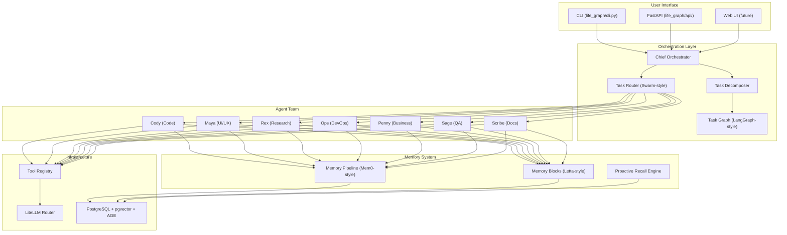
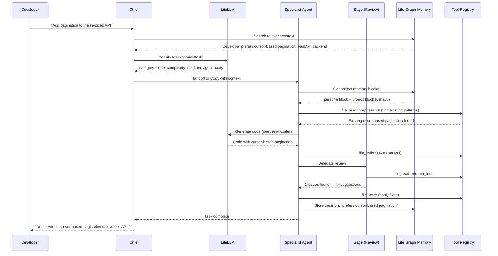
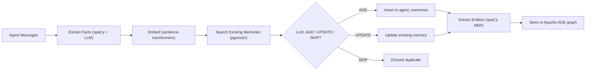
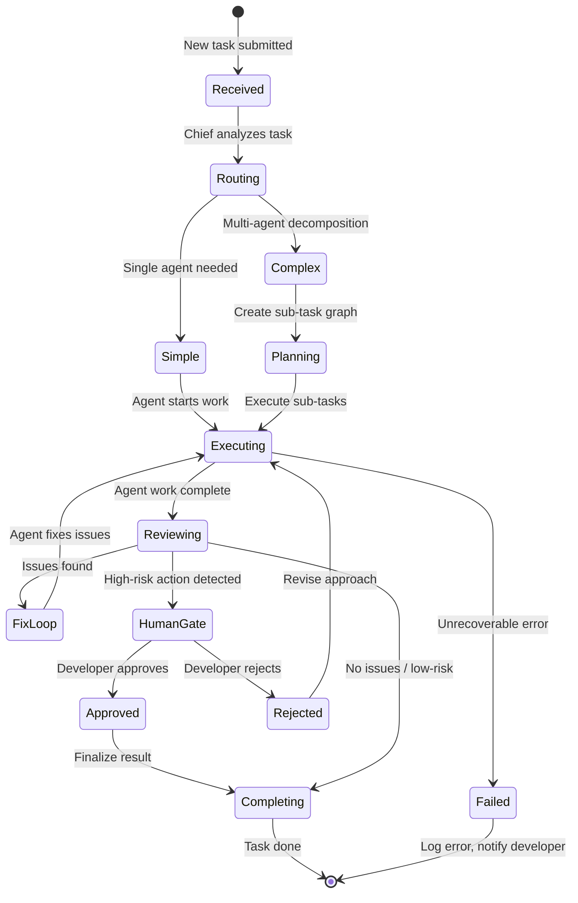

# Life Graph Agent System — Feature Spec

> **Purpose**: Complete blueprint for the multi-agent AI colleague system — 8 specialist agents + 1 orchestrator (Chief) that work as a permanent AI team, remembering the developer's preferences, coding style, and past decisions.
>
> **Architecture ref**: `agent-engineering-handbook.md` — patterns extracted from 8 OSS repos
>
> **Memory ref**: `docs/design/02_life_graph_v2_design.md` — Life Graph memory architecture
>
> **Context**: This system sits on top of the existing Life Graph memory layer (`life_graph/` codebase) and adds a multi-agent orchestration layer with Swarm-style handoff, PydanticAI typed tools, Letta-style memory blocks, and LangGraph-style task execution.

---

## System Overview

```
Developer → Chief (Orchestrator)
               │
     ┌─────────┼─────────┬──────────┬──────────┐
     ▼         ▼         ▼          ▼          ▼
   Cody      Maya      Rex        Ops       Penny
  (Code)    (UI/UX)  (Research) (DevOps)  (Business)
                        │
                  ┌─────┼─────┐
                  ▼           ▼
                Sage        Scribe
              (Review)     (Docs)
```

**What we're building**: An AI colleague team that:
1. Routes tasks to the right specialist automatically (Swarm-style handoff)
2. Remembers everything about the developer permanently (Life Graph memory)
3. Uses cheap models for simple tasks, expensive for complex (LiteLLM routing)
4. Collaborates — agents can delegate to each other (CrewAI-style)
5. Self-reviews before presenting work (reflection pattern)

---

## Agent Roster

### Chief — Orchestrator

| Field | Value |
|:------|:------|
| **Role** | Chief Orchestrator |
| **Goal** | Route every task to the best specialist, decompose complex requests, and ensure quality delivery |
| **Backstory** | You are the team lead of an elite AI engineering team. You know each specialist's strengths and never assign work to the wrong agent. You optimize for cost — using cheap models when possible, expensive ones only when reasoning quality matters. You monitor progress and step in when things stall. |
| **Default Model** | `gemini/gemini-2.5-flash` (routing decisions are simple classification) |
| **Delegation** | Can delegate to ALL agents |
| **Tools** | `route_task`, `decompose_task`, `check_agent_status`, `select_model`, `memory_search` |

### Cody — Code Engineer

| Field | Value |
|:------|:------|
| **Role** | Senior Code Engineer |
| **Goal** | Write clean, tested, production-quality code that follows the developer's coding standards |
| **Backstory** | You are a 10x engineer who knows the entire codebase. You read code before writing, search for existing patterns, and never introduce duplicate logic. You follow the project's conventions from memory — indentation, naming, file structure. When unsure, you check the codebase first. |
| **Default Model** | `deepseek/deepseek-coder` (simple) / `anthropic/claude-sonnet-4-20250514` (complex) |
| **Delegation** | Can delegate to Sage (review), Scribe (docs), Rex (research) |
| **Tools** | `file_read`, `file_write`, `file_create`, `grep_search`, `run_command`, `git_diff`, `git_commit`, `git_status` |

### Maya — UI/UX Designer

| Field | Value |
|:------|:------|
| **Role** | UI/UX Design Engineer |
| **Goal** | Create beautiful, responsive, accessible interfaces with modern design patterns |
| **Backstory** | You are a design-engineer hybrid. You don't just design — you implement. You write Next.js components, CSS, and ensure responsive layouts. You favor dark mode, glassmorphism, smooth animations, and vibrant color palettes. You know the project's component library and theme system. |
| **Default Model** | `anthropic/claude-sonnet-4-20250514` (creative + code generation) |
| **Delegation** | Can delegate to Cody (implementation), Sage (review) |
| **Tools** | `file_write`, `file_read`, `image_generate`, `component_search`, `theme_lookup` |

### Rex — Researcher

| Field | Value |
|:------|:------|
| **Role** | Senior Research Analyst |
| **Goal** | Find comprehensive, accurate information and compile actionable reports |
| **Backstory** | You are a thorough researcher who reads documentation, analyzes open source repos, benchmarks tools, and compiles findings into structured reports. You always cite sources, compare alternatives, and give clear recommendations. You don't just find information — you synthesize it. |
| **Default Model** | `gemini/gemini-2.5-flash` (great at summarization + long context) |
| **Delegation** | Can delegate to Scribe (write-up) |
| **Tools** | `web_search`, `url_read`, `file_write`, `file_read`, `repo_analyze` |

### Ops — DevOps Engineer

| Field | Value |
|:------|:------|
| **Role** | DevOps & Infrastructure Engineer |
| **Goal** | Keep systems running, deploy safely, and automate operational tasks |
| **Backstory** | You manage Docker, CI/CD, server monitoring, and deployments. You write Dockerfiles, docker-compose configs, GitHub Actions workflows, and Nginx configs. You always check logs before making changes and prefer incremental rollouts. You know the developer's self-hosted VPS setup. |
| **Default Model** | `gemini/gemini-2.5-flash` |
| **Delegation** | Can delegate to Cody (scripts), Sage (review configs) |
| **Tools** | `ssh_command`, `docker_manage`, `log_read`, `health_check`, `file_write`, `file_read`, `run_command` |

### Penny — Business Analyst

| Field | Value |
|:------|:------|
| **Role** | Business Intelligence Analyst |
| **Goal** | Turn business data into actionable insights with clear reports and visualizations |
| **Backstory** | You analyze business data, create financial reports, and answer questions with SQL queries. You work with the uzhavu SaaS platform data — invoices, orders, contacts, expenses. You create charts and summaries. You NEVER run mutation queries — read-only access always. |
| **Default Model** | `gemini/gemini-2.5-flash` |
| **Delegation** | Can delegate to Rex (market research), Scribe (reports) |
| **Tools** | `sql_query` (READ-ONLY), `chart_generate`, `report_export`, `file_write` |

### Sage — Reviewer / QA

| Field | Value |
|:------|:------|
| **Role** | Senior Code Reviewer & QA Engineer |
| **Goal** | Catch bugs, security issues, and bad practices before code reaches production |
| **Backstory** | You are the team's quality gate. Every piece of code passes through you. You check for: bugs, security vulnerabilities, performance issues, missing error handling, test coverage, and adherence to coding standards. You use the self-critique pattern — review your own reviews before presenting. |
| **Default Model** | `anthropic/claude-sonnet-4-20250514` / `openai/gpt-4o` (reasoning-heavy) |
| **Delegation** | Can delegate to Cody (fix issues) |
| **Tools** | `file_read`, `grep_search`, `run_tests`, `security_scan`, `lint`, `git_diff` |

### Scribe — Documentation

| Field | Value |
|:------|:------|
| **Role** | Technical Documentation Writer |
| **Goal** | Keep all documentation accurate, comprehensive, and in sync with the codebase |
| **Backstory** | You write READMEs, API docs, changelogs, and architecture guides. You update KNOWLEDGE.md and `.comms/` context files when decisions are made. You generate docs from code — not copy-paste, but intelligent summarization. You follow the project's existing doc format and structure. |
| **Default Model** | `gemini/gemini-2.5-flash` |
| **Delegation** | Can delegate to Rex (research for docs) |
| **Tools** | `file_read`, `file_write`, `git_log`, `markdown_format`, `grep_search` |

---

## Architecture

### System Architecture



### Request Flow



---

## Agent Base Class

```python
"""life_graph/agents/base.py — Base agent class using PydanticAI patterns."""

from __future__ import annotations
from dataclasses import dataclass, field
from typing import Any, Callable, Generic, TypeVar, Optional
from pydantic import BaseModel
import litellm
from datetime import datetime, timezone

# --- Persona ---

@dataclass
class AgentPersona:
    """CrewAI-style agent identity — role, goal, backstory."""
    role: str
    goal: str
    backstory: str

    def to_system_prompt(self) -> str:
        return (
            f"# Role\n{self.role}\n\n"
            f"# Goal\n{self.goal}\n\n"
            f"# Backstory\n{self.backstory}"
        )


# --- Memory Blocks (Letta-style) ---

@dataclass
class MemoryBlock:
    """Self-editing memory block — agent can read and write."""
    label: str          # "persona", "human", "project"
    description: str    # What this block is for
    value: str          # Content — agent self-edits this
    limit: int = 2000   # Max characters (context budget)

    def append(self, content: str) -> None:
        new_value = self.value + "\n" + content
        if len(new_value) <= self.limit:
            self.value = new_value

    def replace(self, old: str, new: str) -> None:
        self.value = self.value.replace(old, new)


# --- Run Context (PydanticAI-style DI) ---

@dataclass
class RunContext:
    """Dependency injection container — passed to every tool call."""
    agent_id: str
    user_id: str
    db: Any                           # AsyncConnection
    memory_blocks: dict[str, MemoryBlock] = field(default_factory=dict)
    context_variables: dict[str, Any] = field(default_factory=dict)
    task_id: Optional[str] = None
    parent_agent_id: Optional[str] = None


# --- Tool Registry ---

@dataclass
class ToolDef:
    """Registered tool with metadata."""
    name: str
    description: str
    function: Callable
    parameters: dict[str, Any]       # JSON Schema
    requires_approval: bool = False  # Human-in-the-loop gate
    max_result_chars: int = 4000     # Truncation limit


class ToolRegistry:
    """Central tool registry — agents request tools by name."""

    def __init__(self):
        self._tools: dict[str, ToolDef] = {}
        self._permissions: dict[str, set[str]] = {}  # agent_id → set of tool names

    def register(self, tool: ToolDef) -> None:
        self._tools[tool.name] = tool

    def grant(self, agent_id: str, tool_names: list[str]) -> None:
        self._permissions.setdefault(agent_id, set()).update(tool_names)

    def get_tools_for_agent(self, agent_id: str) -> list[ToolDef]:
        allowed = self._permissions.get(agent_id, set())
        return [t for t in self._tools.values() if t.name in allowed]

    def to_openai_tools(self, agent_id: str) -> list[dict]:
        """Convert agent's tools to OpenAI function-calling format."""
        tools = self.get_tools_for_agent(agent_id)
        return [
            {
                "type": "function",
                "function": {
                    "name": t.name,
                    "description": t.description,
                    "parameters": t.parameters,
                },
            }
            for t in tools
        ]

    async def execute(self, tool_name: str, args: dict, ctx: RunContext) -> str:
        tool = self._tools.get(tool_name)
        if not tool:
            return f"Error: Tool '{tool_name}' not found."
        if tool_name not in self._permissions.get(ctx.agent_id, set()):
            return f"Error: Agent '{ctx.agent_id}' does not have permission for '{tool_name}'."

        try:
            result = await tool.function(ctx=ctx, **args)
            result_str = str(result)
            if len(result_str) > tool.max_result_chars:
                result_str = result_str[:tool.max_result_chars] + "\n... (truncated)"
            return result_str
        except Exception as e:
            return f"Error executing '{tool_name}': {e}"


# --- Agent Config ---

@dataclass
class AgentConfig:
    """Runtime configuration for an agent."""
    model: str = "gemini/gemini-2.5-flash"
    fallback_model: str = "openai/gpt-4o-mini"
    max_iterations: int = 15
    temperature: float = 0.3
    max_tokens: int = 4096
    allow_delegation: bool = False
    memory_enabled: bool = True


# --- Base Agent ---

class BaseAgent:
    """
    Base agent class — all specialist agents inherit from this.

    Combines:
    - PydanticAI: typed tools, RunContext DI
    - Swarm: handoff via returning Agent objects
    - CrewAI: role/goal/backstory persona
    - Letta: self-editing memory blocks
    - Smolagents: step-based history
    """

    def __init__(
        self,
        agent_id: str,
        persona: AgentPersona,
        config: AgentConfig,
        tool_registry: ToolRegistry,
        memory_blocks: Optional[dict[str, MemoryBlock]] = None,
    ):
        self.agent_id = agent_id
        self.persona = persona
        self.config = config
        self.tool_registry = tool_registry
        self.memory_blocks = memory_blocks or {}
        self.step_history: list[ActionStep] = []

    def _build_system_prompt(self) -> str:
        """Compile system prompt from persona + memory blocks."""
        parts = [self.persona.to_system_prompt()]

        for label, block in self.memory_blocks.items():
            parts.append(f"\n## Memory: {label}\n{block.value}")

        if self.config.allow_delegation:
            parts.append(
                "\n## Delegation\n"
                "You can delegate tasks to other agents using the `delegate_work` tool, "
                "or ask questions using the `ask_question` tool."
            )

        return "\n\n".join(parts)

    async def run(self, task: str, ctx: RunContext) -> AgentResult:
        """
        Execute the agent loop (Letta heartbeat-style).

        1. Build context (system prompt + memory blocks + tools)
        2. Call LLM
        3. If tool call → execute → loop
        4. If send_message → return (terminal action)
        5. If returns Agent → handoff
        """
        messages = [
            {"role": "system", "content": self._build_system_prompt()},
            {"role": "user", "content": task},
        ]
        tools = self.tool_registry.to_openai_tools(self.agent_id)

        for iteration in range(self.config.max_iterations):
            try:
                response = await litellm.acompletion(
                    model=self.config.model,
                    messages=messages,
                    tools=tools if tools else None,
                    temperature=self.config.temperature,
                    max_tokens=self.config.max_tokens,
                )
            except Exception as e:
                # Fallback to secondary model
                response = await litellm.acompletion(
                    model=self.config.fallback_model,
                    messages=messages,
                    tools=tools if tools else None,
                    temperature=self.config.temperature,
                    max_tokens=self.config.max_tokens,
                )

            message = response.choices[0].message
            messages.append(message.model_dump())

            # No tool calls → agent is done
            if not message.tool_calls:
                step = ActionStep(
                    step_number=iteration,
                    thought=message.content or "",
                    tool_calls=[],
                    observation="",
                )
                self.step_history.append(step)
                return AgentResult(
                    value=message.content or "",
                    agent=None,
                    context_variables=ctx.context_variables,
                    steps=self.step_history,
                )

            # Execute tool calls
            for tool_call in message.tool_calls:
                import json
                func_name = tool_call.function.name
                func_args = json.loads(tool_call.function.arguments)

                # Check for handoff
                if func_name == "transfer_to_agent":
                    target_agent = func_args.get("agent_id")
                    return AgentResult(
                        value=f"Handing off to {target_agent}",
                        agent=target_agent,  # Swarm-style handoff
                        context_variables=ctx.context_variables,
                        steps=self.step_history,
                    )

                result = await self.tool_registry.execute(func_name, func_args, ctx)

                step = ActionStep(
                    step_number=iteration,
                    thought=message.content or "",
                    tool_calls=[{"name": func_name, "args": func_args}],
                    observation=result,
                )
                self.step_history.append(step)

                messages.append({
                    "role": "tool",
                    "tool_call_id": tool_call.id,
                    "content": result,
                })

        return AgentResult(
            value="Max iterations reached.",
            agent=None,
            context_variables=ctx.context_variables,
            steps=self.step_history,
        )


@dataclass
class ActionStep:
    """Smolagents-style structured step log."""
    step_number: int
    thought: str
    tool_calls: list[dict]
    observation: str
    error: Optional[str] = None
    timestamp: str = field(default_factory=lambda: datetime.now(timezone.utc).isoformat())


@dataclass
class AgentResult:
    """Result of an agent run — may include handoff."""
    value: str
    agent: Optional[str]              # If set → Swarm-style handoff to this agent ID
    context_variables: dict[str, Any]
    steps: list[ActionStep] = field(default_factory=list)
```

### Specialist Agent Example (Cody)

```python
"""life_graph/agents/cody.py — Code Engineer agent."""

from life_graph.agents.base import (
    BaseAgent, AgentPersona, AgentConfig, MemoryBlock, ToolRegistry
)

CODY_PERSONA = AgentPersona(
    role="Senior Code Engineer",
    goal="Write clean, tested, production-quality code that follows the developer's coding standards",
    backstory=(
        "You are a 10x engineer who knows the entire codebase. You read code before writing, "
        "search for existing patterns, and never introduce duplicate logic. You follow the "
        "project's conventions from memory — indentation, naming, file structure. "
        "When unsure, you check the codebase first."
    ),
)

CODY_CONFIG = AgentConfig(
    model="deepseek/deepseek-coder",
    fallback_model="anthropic/claude-sonnet-4-20250514",
    max_iterations=20,
    temperature=0.2,
    allow_delegation=True,
    memory_enabled=True,
)

CODY_TOOLS = [
    "file_read", "file_write", "file_create",
    "grep_search", "run_command",
    "git_diff", "git_commit", "git_status",
    "delegate_work", "ask_question",
    "core_memory_append", "core_memory_replace",
    "archival_memory_insert", "archival_memory_search",
]


def create_cody(tool_registry: ToolRegistry) -> BaseAgent:
    """Factory function to create the Cody agent."""
    agent = BaseAgent(
        agent_id="cody",
        persona=CODY_PERSONA,
        config=CODY_CONFIG,
        tool_registry=tool_registry,
        memory_blocks={
            "persona": MemoryBlock(
                label="persona",
                description="Your identity and capabilities",
                value="I am Cody, the code engineer. I specialize in Python (FastAPI) and Next.js.",
            ),
            "human": MemoryBlock(
                label="human",
                description="What I know about the developer",
                value="Race Raja. Solo developer. Prefers Python/FastAPI backend, Next.js frontend. "
                      "Uses PostgreSQL for everything. Values self-hosted solutions.",
            ),
            "project": MemoryBlock(
                label="project",
                description="Current project context",
                value="Life Graph: Brain-inspired personal memory system. "
                      "Uzhavu: Multi-tenant SaaS (NestJS + Next.js + FastAPI).",
            ),
        },
    )
    for tool_name in CODY_TOOLS:
        tool_registry.grant("cody", [tool_name])
    return agent
```

---

## Chief Orchestrator

```python
"""life_graph/agents/chief.py — Chief orchestrator with Swarm-style handoff."""

from life_graph.agents.base import (
    BaseAgent, AgentPersona, AgentConfig, AgentResult,
    RunContext, ToolRegistry,
)
import litellm
import json

ROUTING_PROMPT = """Classify this task and pick the best agent.

Available agents:
- cody: Code writing, refactoring, implementing features, git operations
- maya: UI/UX design, React components, CSS, responsive layouts
- rex: Web research, documentation reading, tech analysis, reports
- ops: Deployments, Docker, CI/CD, server management, monitoring
- penny: Business data analysis, SQL queries, reports, invoicing
- sage: Code review, testing, security scanning, quality checks
- scribe: Documentation, READMEs, changelogs, knowledge base updates

Respond with JSON:
{
  "agent": "<agent_id>",
  "complexity": "simple|medium|complex",
  "reasoning": "<why this agent>",
  "sub_tasks": ["<if complex, list sub-tasks>"]
}
"""


class ChiefOrchestrator:
    """
    Swarm-style orchestrator — routes tasks to specialist agents.

    Uses cheap model (gemini-flash) for routing decisions.
    Decomposes complex tasks into sub-tasks.
    Monitors agent progress.
    """

    def __init__(self, agents: dict[str, BaseAgent], tool_registry: ToolRegistry):
        self.agents = agents
        self.tool_registry = tool_registry
        self.task_history: list[dict] = []

    async def route(self, task: str, ctx: RunContext) -> dict:
        """Classify task and select the best agent."""
        response = await litellm.acompletion(
            model="gemini/gemini-2.5-flash",
            messages=[
                {"role": "system", "content": ROUTING_PROMPT},
                {"role": "user", "content": task},
            ],
            response_format={"type": "json_object"},
            temperature=0.1,
        )
        return json.loads(response.choices[0].message.content)

    def select_model(self, agent_id: str, complexity: str) -> str:
        """Override agent model based on task complexity."""
        MODEL_MAP = {
            ("cody", "simple"): "deepseek/deepseek-coder",
            ("cody", "medium"): "deepseek/deepseek-coder",
            ("cody", "complex"): "anthropic/claude-sonnet-4-20250514",
            ("sage", "simple"): "gemini/gemini-2.5-flash",
            ("sage", "medium"): "anthropic/claude-sonnet-4-20250514",
            ("sage", "complex"): "openai/gpt-4o",
            ("rex", "simple"): "gemini/gemini-2.5-flash",
            ("rex", "medium"): "gemini/gemini-2.5-flash",
            ("rex", "complex"): "gemini/gemini-2.5-pro",
            ("maya", "simple"): "gemini/gemini-2.5-flash",
            ("maya", "medium"): "anthropic/claude-sonnet-4-20250514",
            ("maya", "complex"): "anthropic/claude-sonnet-4-20250514",
        }
        return MODEL_MAP.get(
            (agent_id, complexity),
            self.agents[agent_id].config.model,
        )

    async def execute(self, task: str, ctx: RunContext) -> AgentResult:
        """
        Main execution loop:
        1. Route task to best agent
        2. Override model based on complexity
        3. Execute agent
        4. If handoff → follow the chain
        5. Log everything
        """
        routing = await self.route(task, ctx)
        agent_id = routing["agent"]
        complexity = routing["complexity"]
        sub_tasks = routing.get("sub_tasks", [])

        # Simple task — single agent
        if not sub_tasks or len(sub_tasks) <= 1:
            agent = self.agents[agent_id]
            agent.config.model = self.select_model(agent_id, complexity)

            result = await agent.run(task, ctx)

            # Swarm-style handoff chain
            while result.agent and result.agent in self.agents:
                next_agent = self.agents[result.agent]
                result = await next_agent.run(result.value, ctx)

            self.task_history.append({
                "task": task,
                "agent": agent_id,
                "complexity": complexity,
                "result": result.value[:500],
                "steps": len(result.steps),
            })
            return result

        # Complex task — decompose and execute sub-tasks
        results = []
        for sub_task in sub_tasks:
            sub_routing = await self.route(sub_task, ctx)
            sub_agent = self.agents[sub_routing["agent"]]
            sub_agent.config.model = self.select_model(
                sub_routing["agent"], sub_routing["complexity"]
            )
            sub_result = await sub_agent.run(sub_task, ctx)
            results.append(sub_result)

        # Combine results
        combined = "\n\n".join(
            f"## Sub-task: {st}\n{r.value}"
            for st, r in zip(sub_tasks, results)
        )
        return AgentResult(
            value=combined,
            agent=None,
            context_variables=ctx.context_variables,
            steps=[step for r in results for step in r.steps],
        )
```

---

## Memory System

### Memory Pipeline (Mem0-style)



### Memory Block Schema

```
┌─────────────────────────────────────────┐
│ LLM Context Window ("RAM")               │
│  ├── System Prompt (persona)             │
│  ├── Memory Blocks (self-editing)        │
│  │   ├── persona: "I am Cody..."         │
│  │   ├── human: "Race prefers..."        │
│  │   └── project: "Life Graph is..."     │
│  ├── Recent Messages                     │
│  └── Available Tools                     │
└────────────────┬────────────────────────┘
                 ↕ agent calls memory tools
┌────────────────┴────────────────────────┐
│ Recall Memory ("Main Memory")            │
│  └── agent_memories table (pgvector)     │
│      Searchable via memory_search        │
└────────────────┬────────────────────────┘
                 ↕ agent calls archival tools
┌────────────────┴────────────────────────┐
│ Archival Memory ("Disk")                 │
│  └── Unlimited, semantic similarity      │
│      life_graph memories + AGE graph     │
└─────────────────────────────────────────┘
```

### Self-Editing Memory Tools

```python
"""Built-in tools every agent has for managing its own memory."""

async def core_memory_append(ctx: RunContext, label: str, content: str) -> str:
    """Append content to a memory block (persona, human, or project)."""
    block = ctx.memory_blocks.get(label)
    if not block:
        return f"Error: No memory block with label '{label}'"
    block.append(content)
    # Persist to DB
    await ctx.db.execute(
        "UPDATE memory_blocks SET value = $1, updated_at = NOW() "
        "WHERE agent_id = $2 AND label = $3",
        block.value, ctx.agent_id, label,
    )
    return f"Appended to {label} block. New length: {len(block.value)} chars."


async def core_memory_replace(ctx: RunContext, label: str, old_content: str, new_content: str) -> str:
    """Replace content in a memory block (for corrections/updates)."""
    block = ctx.memory_blocks.get(label)
    if not block:
        return f"Error: No memory block with label '{label}'"
    if old_content not in block.value:
        return f"Error: '{old_content}' not found in {label} block."
    block.replace(old_content, new_content)
    await ctx.db.execute(
        "UPDATE memory_blocks SET value = $1, updated_at = NOW() "
        "WHERE agent_id = $2 AND label = $3",
        block.value, ctx.agent_id, label,
    )
    return f"Updated {label} block."


async def archival_memory_insert(ctx: RunContext, content: str) -> str:
    """Store in long-term archival memory (Life Graph)."""
    from life_graph.services.memory_service import MemoryService
    service = MemoryService(ctx.db)
    memory_id = await service.store(
        content=content,
        source=f"agent:{ctx.agent_id}",
        metadata={"task_id": ctx.task_id},
    )
    return f"Stored in archival memory: {memory_id}"


async def archival_memory_search(ctx: RunContext, query: str, limit: int = 5) -> str:
    """Search archival memory using semantic similarity."""
    from life_graph.services.memory_service import MemoryService
    service = MemoryService(ctx.db)
    results = await service.search(query=query, limit=limit)
    return "\n".join(
        f"- [{r['similarity']:.2f}] {r['content'][:200]}"
        for r in results
    )
```

---

## PostgreSQL Schema

```sql
-- ============================================================
-- Agent System Tables
-- ============================================================

-- Agent registry
CREATE TABLE agents (
    id TEXT PRIMARY KEY,                    -- e.g., 'cody', 'chief'
    display_name TEXT NOT NULL,
    persona_role TEXT NOT NULL,
    persona_goal TEXT NOT NULL,
    persona_backstory TEXT NOT NULL,
    default_model TEXT NOT NULL DEFAULT 'gemini/gemini-2.5-flash',
    fallback_model TEXT DEFAULT 'openai/gpt-4o-mini',
    config JSONB NOT NULL DEFAULT '{}',     -- AgentConfig as JSON
    allowed_tools TEXT[] NOT NULL DEFAULT '{}',
    can_delegate_to TEXT[] DEFAULT '{}',    -- Agent IDs this agent can delegate to
    is_active BOOLEAN DEFAULT true,
    created_at TIMESTAMPTZ DEFAULT NOW(),
    updated_at TIMESTAMPTZ DEFAULT NOW()
);

-- Self-editing memory blocks (Letta-style)
CREATE TABLE memory_blocks (
    id TEXT PRIMARY KEY DEFAULT gen_random_uuid()::text,
    agent_id TEXT NOT NULL REFERENCES agents(id) ON DELETE CASCADE,
    label TEXT NOT NULL,                    -- 'persona', 'human', 'project', custom
    description TEXT,
    value TEXT NOT NULL DEFAULT '',
    char_limit INT DEFAULT 2000,
    version INT DEFAULT 1,
    created_at TIMESTAMPTZ DEFAULT NOW(),
    updated_at TIMESTAMPTZ DEFAULT NOW(),
    UNIQUE(agent_id, label)
);

-- Agent-specific memories (Mem0-style, with pgvector)
CREATE TABLE agent_memories (
    id TEXT PRIMARY KEY DEFAULT gen_random_uuid()::text,
    agent_id TEXT NOT NULL REFERENCES agents(id),
    user_id TEXT,                            -- Scoped to user (multi-tenant ready)
    content TEXT NOT NULL,
    embedding vector(384) NOT NULL,          -- sentence-transformers all-MiniLM-L6-v2
    importance FLOAT DEFAULT 0.5,
    access_count INT DEFAULT 0,
    last_accessed_at TIMESTAMPTZ,
    source TEXT,                             -- 'conversation', 'tool_result', 'consolidation'
    metadata JSONB DEFAULT '{}',
    created_at TIMESTAMPTZ DEFAULT NOW(),
    updated_at TIMESTAMPTZ DEFAULT NOW()
);

CREATE INDEX idx_agent_memories_embedding ON agent_memories
    USING ivfflat (embedding vector_cosine_ops) WITH (lists = 100);
CREATE INDEX idx_agent_memories_agent ON agent_memories(agent_id);
CREATE INDEX idx_agent_memories_user ON agent_memories(user_id);

-- Memory change history (audit trail)
CREATE TABLE memory_history (
    id SERIAL PRIMARY KEY,
    memory_id TEXT NOT NULL,                -- References agent_memories or life_graph memories
    action TEXT NOT NULL,                   -- 'ADD', 'UPDATE', 'DELETE', 'CONSOLIDATE'
    old_content TEXT,
    new_content TEXT,
    reason TEXT,                            -- Why the change was made
    changed_by TEXT,                        -- Agent ID or 'system'
    created_at TIMESTAMPTZ DEFAULT NOW()
);

CREATE INDEX idx_memory_history_memory ON memory_history(memory_id);

-- Task tracking
CREATE TABLE agent_tasks (
    id TEXT PRIMARY KEY DEFAULT gen_random_uuid()::text,
    parent_task_id TEXT REFERENCES agent_tasks(id),  -- For sub-tasks
    title TEXT NOT NULL,
    description TEXT,
    status TEXT NOT NULL DEFAULT 'pending', -- pending, routed, in_progress, review, approved, completed, failed
    assigned_agent TEXT REFERENCES agents(id),
    routed_by TEXT REFERENCES agents(id),   -- Usually 'chief'
    complexity TEXT DEFAULT 'medium',        -- simple, medium, complex
    model_used TEXT,
    priority INT DEFAULT 5,                 -- 1 (highest) to 10 (lowest)
    result TEXT,
    error TEXT,
    metadata JSONB DEFAULT '{}',
    created_at TIMESTAMPTZ DEFAULT NOW(),
    started_at TIMESTAMPTZ,
    completed_at TIMESTAMPTZ
);

CREATE INDEX idx_tasks_status ON agent_tasks(status);
CREATE INDEX idx_tasks_agent ON agent_tasks(assigned_agent);

-- Step-based execution log (Smolagents-style)
CREATE TABLE task_steps (
    id SERIAL PRIMARY KEY,
    task_id TEXT NOT NULL REFERENCES agent_tasks(id) ON DELETE CASCADE,
    step_number INT NOT NULL,
    agent_id TEXT NOT NULL REFERENCES agents(id),
    thought TEXT,                            -- LLM reasoning
    tool_calls JSONB DEFAULT '[]',           -- [{name, args, result}]
    observation TEXT,                        -- Tool results
    error TEXT,
    tokens_used INT DEFAULT 0,
    model TEXT,
    duration_ms INT,
    created_at TIMESTAMPTZ DEFAULT NOW()
);

CREATE INDEX idx_steps_task ON task_steps(task_id);

-- Inter-agent messages
CREATE TABLE agent_messages (
    id TEXT PRIMARY KEY DEFAULT gen_random_uuid()::text,
    sender_id TEXT NOT NULL REFERENCES agents(id),
    receiver_id TEXT NOT NULL REFERENCES agents(id),
    message_type TEXT NOT NULL,              -- 'DELEGATE_WORK', 'ASK_QUESTION', 'REPORT_RESULT', 'HANDOFF'
    content TEXT NOT NULL,
    context JSONB DEFAULT '{}',
    task_id TEXT REFERENCES agent_tasks(id),
    priority TEXT DEFAULT 'normal',          -- low, normal, high, urgent
    status TEXT DEFAULT 'pending',           -- pending, read, responded
    response TEXT,
    created_at TIMESTAMPTZ DEFAULT NOW(),
    responded_at TIMESTAMPTZ
);

CREATE INDEX idx_messages_receiver ON agent_messages(receiver_id, status);

-- Tool execution log
CREATE TABLE tool_executions (
    id SERIAL PRIMARY KEY,
    task_id TEXT REFERENCES agent_tasks(id),
    agent_id TEXT NOT NULL REFERENCES agents(id),
    tool_name TEXT NOT NULL,
    arguments JSONB NOT NULL DEFAULT '{}',
    result TEXT,
    error TEXT,
    duration_ms INT,
    tokens_used INT DEFAULT 0,
    model TEXT,
    estimated_cost_usd NUMERIC(10,6) DEFAULT 0,
    created_at TIMESTAMPTZ DEFAULT NOW()
);

CREATE INDEX idx_tool_exec_agent ON tool_executions(agent_id);
CREATE INDEX idx_tool_exec_task ON tool_executions(task_id);

-- LLM usage tracking (per-call granularity)
CREATE TABLE agent_llm_usage (
    id SERIAL PRIMARY KEY,
    agent_id TEXT NOT NULL REFERENCES agents(id),
    task_id TEXT REFERENCES agent_tasks(id),
    model TEXT NOT NULL,
    prompt_tokens INT DEFAULT 0,
    completion_tokens INT DEFAULT 0,
    total_tokens INT DEFAULT 0,
    estimated_cost_usd NUMERIC(10,6) DEFAULT 0,
    purpose TEXT,                            -- 'routing', 'generation', 'review', 'memory_consolidation'
    created_at TIMESTAMPTZ DEFAULT NOW()
);

CREATE INDEX idx_llm_usage_agent ON agent_llm_usage(agent_id, created_at);
CREATE INDEX idx_llm_usage_date ON agent_llm_usage(created_at);

-- ============================================================
-- Apache AGE Graph (Entity Relationships)
-- ============================================================
-- Run after AGE extension is loaded:

-- SELECT create_graph('agent_knowledge');

-- Vertex labels:
--   Entity(name, type, description, first_seen, last_seen)
--   Agent(id, role)
--   Project(name, description)
--   Decision(content, date, context)

-- Edge labels:
--   KNOWS(since, confidence)
--   WORKS_ON(role, since)
--   DECIDED(reason, date)
--   RELATED_TO(relationship_type, strength)
--   PREFERS(domain, value, confidence)
```

---

## Inter-Agent Communication Protocol

### Message Types

| Type | Direction | Purpose | Example |
|:-----|:----------|:--------|:--------|
| `DELEGATE_WORK` | Any → Any | Assign a sub-task to another agent | Cody → Sage: "Review this code" |
| `ASK_QUESTION` | Any → Any | Get information from a specialist | Chief → Rex: "What's the latest on pgvector?" |
| `REPORT_RESULT` | Any → Sender | Return results of delegated work | Sage → Cody: "Found 2 bugs, here are fixes" |
| `HANDOFF` | Any → Chief | Transfer control back to orchestrator | Cody → Chief: "Task complete" |

### Communication Tools

```python
async def delegate_work(ctx: RunContext, target_agent: str, task: str, context: str = "") -> str:
    """Delegate a task to another agent. Returns their result."""
    await ctx.db.execute(
        "INSERT INTO agent_messages (id, sender_id, receiver_id, message_type, content, context, task_id) "
        "VALUES (gen_random_uuid()::text, $1, $2, 'DELEGATE_WORK', $3, $4::jsonb, $5)",
        ctx.agent_id, target_agent, task, json.dumps({"context": context}), ctx.task_id,
    )
    # In practice, this triggers the target agent's run() method
    # and waits for the result (synchronous delegation)
    target = agent_registry.get(target_agent)
    result = await target.run(f"{task}\n\nContext: {context}", ctx)
    return result.value


async def ask_question(ctx: RunContext, target_agent: str, question: str, context: str = "") -> str:
    """Ask another agent a question. Returns their answer."""
    await ctx.db.execute(
        "INSERT INTO agent_messages (id, sender_id, receiver_id, message_type, content, context, task_id) "
        "VALUES (gen_random_uuid()::text, $1, $2, 'ASK_QUESTION', $3, $4::jsonb, $5)",
        ctx.agent_id, target_agent, question, json.dumps({"context": context}), ctx.task_id,
    )
    target = agent_registry.get(target_agent)
    result = await target.run(f"Answer this question: {question}\n\nContext: {context}", ctx)
    return result.value
```

---

## LiteLLM Model Routing

### Routing Rules

| Task Type | Complexity | Model | Cost/1M tokens | Rationale |
|:----------|:-----------|:------|:---------------|:----------|
| Task routing | — | `gemini-2.5-flash` | ~$0.15 | Simple classification |
| Code generation | Simple | `deepseek-coder` | ~$0.14 | Great code, very cheap |
| Code generation | Complex | `claude-sonnet` | ~$3.00 | Best code quality |
| Code review | Simple | `gemini-2.5-flash` | ~$0.15 | Pattern matching |
| Code review | Complex | `gpt-4o` | ~$2.50 | Deep reasoning |
| Research/Summary | Any | `gemini-2.5-flash` | ~$0.15 | Long context, great summarization |
| UI/Creative | Any | `claude-sonnet` | ~$3.00 | Best creative output |
| Documentation | Any | `gemini-2.5-flash` | ~$0.15 | Bulk text, cheap |
| Business analysis | Any | `gemini-2.5-flash` | ~$0.15 | SQL generation, summaries |
| Memory consolidation | — | `gemini-2.5-flash` | ~$0.15 | Batch processing, cost-sensitive |
| Memory extraction | Ambiguous only | `gemini-2.5-flash` | ~$0.15 | 80% handled by spaCy |

### Estimated Monthly Cost

| Category | Volume | Model | Est. Cost |
|:---------|:-------|:------|:----------|
| Routing decisions | ~500/month | gemini-flash | ~$0.50 |
| Code generation | ~200/month | deepseek + claude mix | ~$15.00 |
| Research | ~100/month | gemini-flash | ~$1.00 |
| Code review | ~150/month | flash + gpt-4o mix | ~$8.00 |
| Memory ops | ~1000/month | flash | ~$2.00 |
| Documentation | ~50/month | flash | ~$0.50 |
| **Total** | | | **~$27/month** |

### Fallback Chain

```
Primary Model → Fallback Model → Emergency Model
deepseek-coder → claude-sonnet → gpt-4o-mini
claude-sonnet → gpt-4o → gemini-2.5-flash
gemini-2.5-flash → gpt-4o-mini → (error)
```

### LiteLLM Configuration

```yaml
# litellm_config.yaml
model_list:
  - model_name: "routing"
    litellm_params:
      model: "gemini/gemini-2.5-flash"
      api_key: "os.environ/GOOGLE_API_KEY"

  - model_name: "code-simple"
    litellm_params:
      model: "deepseek/deepseek-coder"
      api_key: "os.environ/DEEPSEEK_API_KEY"

  - model_name: "code-complex"
    litellm_params:
      model: "anthropic/claude-sonnet-4-20250514"
      api_key: "os.environ/ANTHROPIC_API_KEY"

  - model_name: "reasoning"
    litellm_params:
      model: "openai/gpt-4o"
      api_key: "os.environ/OPENAI_API_KEY"

  - model_name: "bulk"
    litellm_params:
      model: "gemini/gemini-2.5-flash"
      api_key: "os.environ/GOOGLE_API_KEY"

router_settings:
  routing_strategy: "cost-optimized"
  retry_policy:
    max_retries: 2
    retry_after: 1
  fallback_models:
    "deepseek/deepseek-coder": ["anthropic/claude-sonnet-4-20250514"]
    "anthropic/claude-sonnet-4-20250514": ["openai/gpt-4o"]
    "gemini/gemini-2.5-flash": ["openai/gpt-4o-mini"]
```

---

## Tool Permission Matrix

| Tool | Chief | Cody | Maya | Rex | Ops | Penny | Sage | Scribe |
|:-----|:-----:|:----:|:----:|:---:|:---:|:-----:|:----:|:------:|
| `file_read` | — | ✅ | ✅ | ✅ | ✅ | — | ✅ | ✅ |
| `file_write` | — | ✅ | ✅ | ✅ | ✅ | — | — | ✅ |
| `file_create` | — | ✅ | ✅ | — | ✅ | — | — | ✅ |
| `grep_search` | — | ✅ | — | — | — | — | ✅ | ✅ |
| `run_command` | — | ✅ | — | — | ✅ | — | — | — |
| `git_diff` | — | ✅ | — | — | — | — | ✅ | — |
| `git_commit` | — | ✅ | — | — | — | — | — | — |
| `git_status` | — | ✅ | — | — | — | — | — | — |
| `git_log` | — | — | — | — | — | — | — | ✅ |
| `web_search` | — | — | — | ✅ | — | — | — | — |
| `url_read` | — | — | — | ✅ | — | — | — | — |
| `ssh_command` | — | — | — | — | ✅ | — | — | — |
| `docker_manage` | — | — | — | — | ✅ | — | — | — |
| `log_read` | — | — | — | — | ✅ | — | — | — |
| `health_check` | — | — | — | — | ✅ | — | — | — |
| `sql_query` | — | — | — | — | — | ✅ | — | — |
| `chart_generate` | — | — | — | — | — | ✅ | — | — |
| `report_export` | — | — | — | — | — | ✅ | — | — |
| `image_generate` | — | — | ✅ | — | — | — | — | — |
| `component_search` | — | — | ✅ | — | — | — | — | — |
| `run_tests` | — | — | — | — | — | — | ✅ | — |
| `security_scan` | — | — | — | — | — | — | ✅ | — |
| `lint` | — | — | — | — | — | — | ✅ | — |
| `markdown_format` | — | — | — | — | — | — | — | ✅ |
| `route_task` | ✅ | — | — | — | — | — | — | — |
| `decompose_task` | ✅ | — | — | — | — | — | — | — |
| `check_agent_status` | ✅ | — | — | — | — | — | — | — |
| `select_model` | ✅ | — | — | — | — | — | — | — |
| `delegate_work` | ✅ | ✅ | ✅ | ✅ | ✅ | ✅ | ✅ | ✅ |
| `ask_question` | ✅ | ✅ | ✅ | ✅ | ✅ | ✅ | ✅ | ✅ |
| `memory_search` | ✅ | ✅ | ✅ | ✅ | ✅ | ✅ | ✅ | ✅ |
| `core_memory_*` | — | ✅ | ✅ | ✅ | ✅ | ✅ | ✅ | ✅ |
| `archival_memory_*` | — | ✅ | — | ✅ | — | — | — | ✅ |

---

## Requirements

### Story 1: Developer Sends a Coding Task

As a **developer**, I want to describe a coding task in natural language so that the right agent implements it without me specifying which agent to use.

#### Acceptance Criteria

- GIVEN I submit "Add cursor-based pagination to the invoices API" to the CLI WHEN Chief receives the task THEN Chief classifies it as code/medium and routes to Cody within 2 seconds
- GIVEN Cody receives the task WHEN it starts working THEN it searches the codebase for existing pagination patterns before writing new code
- GIVEN Cody has written the code WHEN it finishes THEN it automatically delegates to Sage for code review before presenting results
- GIVEN Sage finds issues WHEN it reports back to Cody THEN Cody fixes the issues and re-submits for review (max 3 review cycles)
- GIVEN the task is complete WHEN results are presented THEN the developer sees: files changed, lines added/removed, review summary, and estimated cost of the operation

---

### Story 2: Complex Task Decomposition

As a **developer**, I want to give complex, multi-step tasks and have them automatically broken into sub-tasks assigned to the right agents.

#### Acceptance Criteria

- GIVEN I submit "Build a WhatsApp integration with message templates and AI auto-reply" WHEN Chief receives it THEN Chief decomposes it into sub-tasks: (1) Research WhatsApp API (Rex), (2) Design database schema (Cody), (3) Implement webhook handler (Cody), (4) Build template management UI (Maya), (5) Review all code (Sage), (6) Write documentation (Scribe)
- GIVEN sub-tasks have dependencies WHEN Chief creates the execution plan THEN dependent tasks wait for their prerequisites (e.g., schema before webhook handler)
- GIVEN a sub-task fails WHEN the agent reports an error THEN Chief retries with a different approach or escalates to the developer
- GIVEN all sub-tasks complete WHEN Chief assembles the results THEN the developer sees a unified report with all changes, decisions made, and total cost

---

### Story 3: Agent Remembers Developer Preferences

As a **developer**, I want agents to remember my preferences across sessions so that I never repeat myself.

#### Acceptance Criteria

- GIVEN I tell Cody "I prefer cursor-based pagination over offset" WHEN Cody processes this THEN it stores the preference in its `human` memory block and in archival memory
- GIVEN the preference is stored WHEN I ask for pagination in a future session THEN Cody automatically uses cursor-based pagination without asking
- GIVEN I change my mind and say "Actually, use offset pagination for simple lists" WHEN Cody processes this THEN it updates the `human` memory block using `core_memory_replace`
- GIVEN multiple preferences exist WHEN Cody searches memory THEN the most recent preference takes priority (memory has timestamps)
- GIVEN a preference was stored 6 months ago WHEN it's retrieved THEN the memory is still accessible (no TTL on explicit preferences)

---

### Story 4: Code Review Workflow

As a **developer**, I want every code change reviewed automatically so that bugs are caught before I see them.

#### Acceptance Criteria

- GIVEN Cody writes code WHEN the code is ready THEN Cody automatically delegates to Sage with the file diff
- GIVEN Sage receives code for review WHEN it analyzes the code THEN it checks for: bugs, security issues, missing error handling, test coverage, and coding standard violations
- GIVEN Sage finds 0 issues WHEN the review is done THEN the code is presented to the developer as "Reviewed ✅"
- GIVEN Sage finds issues WHEN the review is done THEN it sends fix suggestions back to Cody, who applies them and re-submits (self-critique loop)
- GIVEN the fix loop exceeds 3 iterations WHEN Sage still finds issues THEN the code is presented to the developer with the remaining issues flagged for manual review

---

### Story 5: Research Task

As a **developer**, I want to ask research questions and get comprehensive reports so that I don't have to read documentation myself.

#### Acceptance Criteria

- GIVEN I ask "What are the best Python async task queue libraries in 2026?" WHEN Chief routes to Rex THEN Rex searches the web, reads at least 5 sources, and compiles a structured report
- GIVEN Rex completes research WHEN the report is generated THEN it includes: summary, comparison table, pros/cons, recommendation, and source URLs
- GIVEN the report is ready WHEN Rex finishes THEN it delegates to Scribe to format and save the report to `docs/research/`
- GIVEN a research topic was previously researched WHEN I ask about it again THEN Rex checks archival memory first and only searches for NEW information

---

### Story 6: Multi-Agent Collaboration

As a **developer**, I want agents to collaborate naturally on complex tasks so that the full team contributes.

#### Acceptance Criteria

- GIVEN I ask "Research Apache AGE best practices and implement a graph query helper" WHEN Chief decomposes THEN it creates: (1) Rex researches AGE patterns, (2) Cody implements based on Rex's findings, (3) Sage reviews Cody's code
- GIVEN Rex finishes research WHEN the report is passed to Cody THEN Cody receives Rex's full report as context for implementation
- GIVEN Sage reviews Cody's implementation WHEN issues are found THEN Sage can ask Rex clarifying questions using `ask_question`
- GIVEN all agents finish WHEN results are assembled THEN the developer sees the research report, implementation diff, and review summary in one unified response

---

### Story 7: Cost-Optimized Model Routing

As a **developer**, I want the system to automatically use cheap models when possible so that my monthly API bill stays under $50.

#### Acceptance Criteria

- GIVEN a simple task like "rename variable X to Y" WHEN Chief routes THEN it selects `deepseek-coder` (~$0.14/1M tokens) instead of `claude-sonnet` (~$3.00/1M tokens)
- GIVEN a complex task like "refactor the entire authentication module" WHEN Chief routes THEN it selects `claude-sonnet` for code quality
- GIVEN routing decisions WHEN Chief selects a model THEN the decision is logged with rationale in `agent_llm_usage` table
- GIVEN the primary model fails WHEN the API returns an error THEN the system automatically falls back to the next model in the chain
- GIVEN monthly usage WHEN tracked over time THEN the system achieves ~60-70% cost savings compared to using claude-sonnet for everything

---

### Story 8: Memory Consolidation

As the **system**, I want to consolidate agent memories daily so that memory stays clean and relevant.

#### Acceptance Criteria

- GIVEN it's 2:00 AM local time WHEN the consolidation job runs THEN it processes all agent memories created in the last 24 hours
- GIVEN duplicate or near-duplicate memories exist WHEN the consolidation pipeline runs THEN it merges them into a single memory with combined context
- GIVEN a memory hasn't been accessed in 90 days WHEN the decay scorer runs THEN it reduces the memory's importance score (but never deletes)
- GIVEN entity relationships were extracted WHEN consolidation completes THEN the Apache AGE graph is updated with new/merged entities
- GIVEN the consolidation job runs WHEN it uses LLM for distillation THEN it uses `gemini-2.5-flash` (cheapest) and processes in batches of 50

---

## Task Execution Graph (LangGraph-style)



### Task State Schema

```python
from typing import Annotated, TypedDict
import operator

class TaskState(TypedDict):
    """LangGraph-compatible state for task execution."""
    task_id: str
    task_description: str
    messages: Annotated[list, operator.add]      # Append reducer
    current_agent: str
    status: str                                   # Last-write-wins
    sub_tasks: list[dict]
    results: Annotated[list, operator.add]
    review_iterations: Annotated[int, operator.add]
    requires_approval: bool
    approved: bool | None
    error: str | None
    total_tokens: Annotated[int, operator.add]
    total_cost_usd: Annotated[float, operator.add]
```

---

## Implementation Phases

### Phase 1: Foundation (Weeks 1–2)

| # | Task | Effort | Dependencies |
|:--|:-----|:-------|:-------------|
| 1.1 | `BaseAgent` class (PydanticAI patterns, RunContext DI) | 2 days | — |
| 1.2 | `AgentPersona` + `AgentConfig` dataclasses | 0.5 days | — |
| 1.3 | `ToolRegistry` with permission model | 1.5 days | — |
| 1.4 | PostgreSQL schema + Alembic migrations | 1 day | — |
| 1.5 | `ChiefOrchestrator` with Swarm-style handoff | 2 days | 1.1, 1.3 |
| 1.6 | Cody agent (first specialist) | 1 day | 1.1, 1.3 |
| 1.7 | Core tools: `file_read`, `file_write`, `grep_search`, `run_command` | 1.5 days | 1.3 |
| 1.8 | CLI integration (`life_graph/cli.py` updates) | 0.5 days | 1.5, 1.6 |
| | **Phase 1 Total** | **10 days** | |

### Phase 2: Memory + More Agents (Weeks 3–4)

| # | Task | Effort | Dependencies |
|:--|:-----|:-------|:-------------|
| 2.1 | Memory pipeline (extract → consolidate → retrieve) | 3 days | Phase 1 |
| 2.2 | Memory blocks (self-editing, persistence) | 2 days | 2.1 |
| 2.3 | Memory tools (`core_memory_*`, `archival_memory_*`) | 1 day | 2.2 |
| 2.4 | Rex agent + web_search/url_read tools | 1 day | Phase 1 |
| 2.5 | Sage agent + review workflow (self-critique loop) | 1.5 days | Phase 1 |
| 2.6 | Scribe agent + documentation tools | 1 day | Phase 1 |
| 2.7 | Inter-agent communication (delegate_work, ask_question) | 1 day | Phase 1 |
| | **Phase 2 Total** | **10.5 days** | |

### Phase 3: Intelligence (Weeks 5–6)

| # | Task | Effort | Dependencies |
|:--|:-----|:-------|:-------------|
| 3.1 | Task execution graph (LangGraph-style state machine) | 3 days | Phase 2 |
| 3.2 | Checkpointing + resume for interrupted tasks | 1.5 days | 3.1 |
| 3.3 | Human-in-the-loop approval gates | 1 day | 3.1 |
| 3.4 | Maya agent + UI generation tools | 1 day | Phase 2 |
| 3.5 | Ops agent + Docker/SSH tools | 1 day | Phase 2 |
| 3.6 | Penny agent + SQL query (read-only) + charting | 1.5 days | Phase 2 |
| 3.7 | LiteLLM cost optimization + model selection logic | 1 day | Phase 1 |
| | **Phase 3 Total** | **10 days** | |

### Phase 4: Production (Weeks 7–8)

| # | Task | Effort | Dependencies |
|:--|:-----|:-------|:-------------|
| 4.1 | Memory consolidation background job | 2 days | Phase 2 |
| 4.2 | Proactive recall integration (push-based surfacing) | 1.5 days | 4.1 |
| 4.3 | Apache AGE entity graph integration | 2 days | Phase 2 |
| 4.4 | Agent dashboard web UI (FastAPI + templates) | 2 days | Phase 3 |
| 4.5 | Eval harness integration (agent quality metrics) | 1.5 days | Phase 3 |
| 4.6 | Performance optimization (batching, caching) | 1 day | Phase 3 |
| 4.7 | Integration tests for agent workflows | 1 day | All |
| | **Phase 4 Total** | **11 days** | |

### Total: ~41.5 developer-days (~8 weeks)

---

## Configuration

### Agent Persona Config (YAML)

```yaml
# config/agents.yaml
agents:
  chief:
    display_name: "Chief"
    persona:
      role: "Chief Orchestrator"
      goal: "Route every task to the best specialist and ensure quality delivery"
      backstory: "You are the team lead of an elite AI engineering team..."
    model: "gemini/gemini-2.5-flash"
    fallback_model: "openai/gpt-4o-mini"
    tools: [route_task, decompose_task, check_agent_status, select_model, memory_search]
    can_delegate_to: [cody, maya, rex, ops, penny, sage, scribe]

  cody:
    display_name: "Cody"
    persona:
      role: "Senior Code Engineer"
      goal: "Write clean, tested, production-quality code"
      backstory: "You are a 10x engineer who knows the entire codebase..."
    model: "deepseek/deepseek-coder"
    fallback_model: "anthropic/claude-sonnet-4-20250514"
    tools: [file_read, file_write, file_create, grep_search, run_command, git_diff, git_commit, git_status, delegate_work, ask_question]
    can_delegate_to: [sage, scribe, rex]
    memory_blocks:
      persona: "I am Cody, the code engineer."
      human: "Race Raja. Solo developer. Python/FastAPI + Next.js."
      project: "Life Graph + Uzhavu SaaS platform."

  # ... (repeat for all 8 agents)
```

### Seed Data

```sql
-- Seed the 9 agents
INSERT INTO agents (id, display_name, persona_role, persona_goal, persona_backstory, default_model, allowed_tools, can_delegate_to) VALUES
('chief', 'Chief', 'Chief Orchestrator', 'Route tasks and ensure quality', 'You are the team lead...', 'gemini/gemini-2.5-flash', ARRAY['route_task','decompose_task','check_agent_status','select_model','memory_search','delegate_work','ask_question'], ARRAY['cody','maya','rex','ops','penny','sage','scribe']),
('cody', 'Cody', 'Senior Code Engineer', 'Write clean, production-quality code', 'You are a 10x engineer...', 'deepseek/deepseek-coder', ARRAY['file_read','file_write','file_create','grep_search','run_command','git_diff','git_commit','git_status','delegate_work','ask_question','core_memory_append','core_memory_replace','archival_memory_insert','archival_memory_search'], ARRAY['sage','scribe','rex']),
('maya', 'Maya', 'UI/UX Design Engineer', 'Create beautiful, responsive interfaces', 'You are a design-engineer hybrid...', 'anthropic/claude-sonnet-4-20250514', ARRAY['file_write','file_read','image_generate','component_search','theme_lookup','delegate_work','ask_question','core_memory_append','core_memory_replace'], ARRAY['cody','sage']),
('rex', 'Rex', 'Senior Research Analyst', 'Find comprehensive information and compile reports', 'You are a thorough researcher...', 'gemini/gemini-2.5-flash', ARRAY['web_search','url_read','file_write','file_read','repo_analyze','delegate_work','ask_question','core_memory_append','core_memory_replace','archival_memory_insert','archival_memory_search'], ARRAY['scribe']),
('ops', 'Ops', 'DevOps Engineer', 'Keep systems running and deploy safely', 'You manage Docker, CI/CD...', 'gemini/gemini-2.5-flash', ARRAY['ssh_command','docker_manage','log_read','health_check','file_write','file_read','run_command','delegate_work','ask_question','core_memory_append','core_memory_replace'], ARRAY['cody','sage']),
('penny', 'Penny', 'Business Intelligence Analyst', 'Turn data into actionable insights', 'You analyze business data...', 'gemini/gemini-2.5-flash', ARRAY['sql_query','chart_generate','report_export','file_write','delegate_work','ask_question','core_memory_append','core_memory_replace'], ARRAY['rex','scribe']),
('sage', 'Sage', 'Senior Code Reviewer', 'Catch bugs and security issues before production', 'You are the quality gate...', 'anthropic/claude-sonnet-4-20250514', ARRAY['file_read','grep_search','run_tests','security_scan','lint','git_diff','delegate_work','ask_question','core_memory_append','core_memory_replace'], ARRAY['cody']),
('scribe', 'Scribe', 'Technical Documentation Writer', 'Keep all documentation accurate and in sync', 'You write READMEs, API docs...', 'gemini/gemini-2.5-flash', ARRAY['file_read','file_write','git_log','markdown_format','grep_search','delegate_work','ask_question','core_memory_append','core_memory_replace','archival_memory_insert','archival_memory_search'], ARRAY['rex']);

-- Seed default memory blocks for each agent
INSERT INTO memory_blocks (agent_id, label, description, value) VALUES
('cody', 'persona', 'Agent identity', 'I am Cody, the code engineer. I specialize in Python (FastAPI) and Next.js.'),
('cody', 'human', 'Developer preferences', 'Race Raja. Solo developer. Prefers Python/FastAPI backend, Next.js frontend. Uses PostgreSQL for everything. Values self-hosted solutions. OS: Windows.'),
('cody', 'project', 'Project context', 'Life Graph: Brain-inspired personal memory system + AI coding team. Uzhavu: Multi-tenant SaaS (NestJS + Next.js + FastAPI + PostgreSQL).'),
('rex', 'persona', 'Agent identity', 'I am Rex, the research analyst. I find information, analyze it, and compile structured reports.'),
('rex', 'human', 'Developer preferences', 'Race Raja. Values practical solutions over theoretical. Wants comparison tables and clear recommendations.'),
('sage', 'persona', 'Agent identity', 'I am Sage, the code reviewer. I catch bugs, security issues, and bad practices.'),
('sage', 'human', 'Developer preferences', 'Race Raja. Follows conventional commits. Wants error handling on all external calls. Prefers guard clauses over nested ifs.');
-- (repeat for all agents)
```

---

*Generated: 06 Jul 2026*
*Based on: Agent Engineering Handbook patterns, Life Graph architecture, KNOWLEDGE.md*
*Total estimated effort: ~8 weeks (solo developer)*
