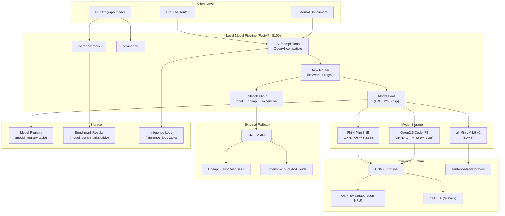
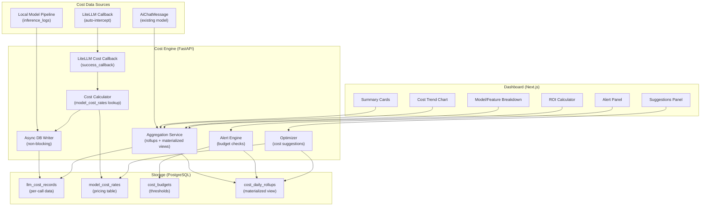
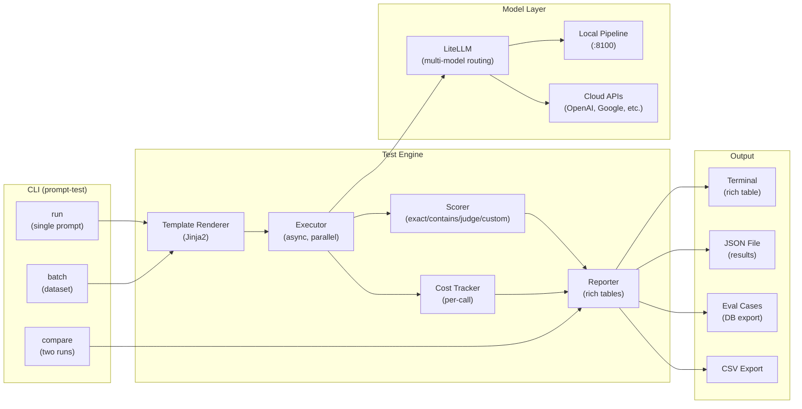
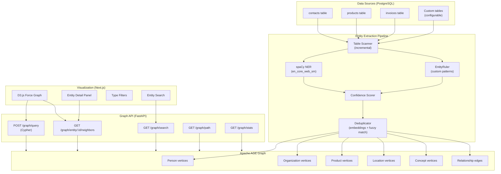
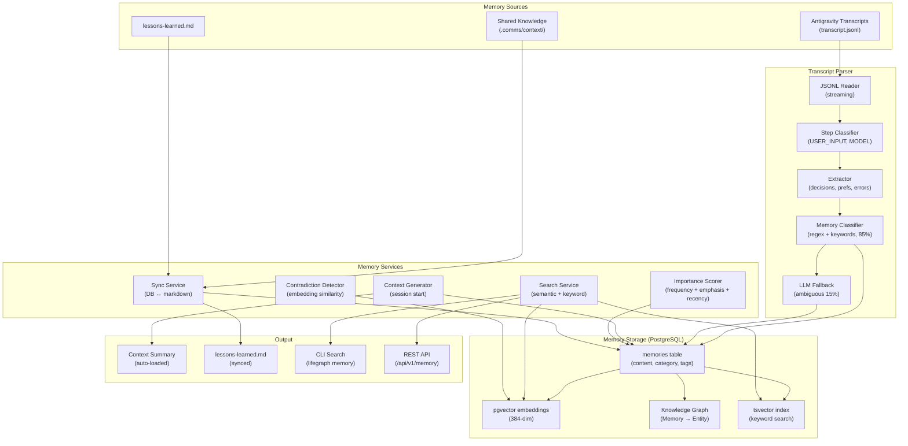
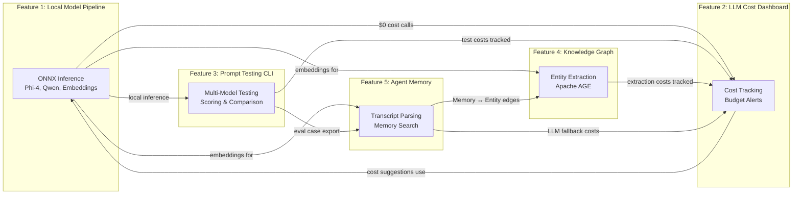

# AI Engineering Tools — Personal Developer Toolchain

> **Purpose**: Provide a suite of 5 AI engineering tools purpose-built for a solo developer's personal toolchain. These tools optimize local model inference on constrained hardware, track LLM spend, test prompts systematically, auto-build knowledge graphs, and persist agent memory across sessions — all self-hosted, cost-efficient, and vendor-lock-in free.
>
> **Context**: Life Graph is a brain-inspired personal memory system + AI coding team built on Python (FastAPI), PostgreSQL (pgvector + Apache AGE), CrewAI, and LiteLLM. The developer runs Windows 11 ARM on Snapdragon X (16GB RAM, no GPU). All tools integrate with the existing Life Graph architecture and share the same PostgreSQL database.
>
> **Architecture ref**: `KNOWLEDGE.md` for project context, `docs/design/02_life_graph_v2_design.md` for memory system, `docs/design/04_database_schema.md` for database schema

---

## Table of Contents

1. [Feature 1: Local Model Pipeline](#feature-1-local-model-pipeline)
2. [Feature 2: LLM Cost Dashboard](#feature-2-llm-cost-dashboard)
3. [Feature 3: Prompt Testing CLI](#feature-3-prompt-testing-cli)
4. [Feature 4: Knowledge Graph Builder](#feature-4-knowledge-graph-builder)
5. [Feature 5: Agent Conversation Memory](#feature-5-agent-conversation-memory)

---

# Feature 1: Local Model Pipeline

## Requirements

### Story 1: Task-Specific Model Selection

As a **solo developer**, I want **the system to automatically select the best local model for each task type** so that **I get optimal quality without manually choosing models for each operation**.

#### Acceptance Criteria

- GIVEN I send a classification task (entity typing, sentiment, intent detection) WHEN the pipeline routes it THEN it selects Phi-4 Mini 3.8B (optimized for classification with Q8 quantization, faster inference on small model)
- GIVEN I send a code generation task (code completion, refactoring, docstring generation) WHEN the pipeline routes it THEN it selects Qwen2.5-Coder 7B (specialized for code with Q4_K_M quantization, higher quality code output)
- GIVEN I need text embeddings (semantic search, similarity, clustering) WHEN the pipeline routes it THEN it selects `all-MiniLM-L6-v2` from sentence-transformers (384-dim vectors, fastest option, 80MB model)
- GIVEN I send a task with no explicit model preference WHEN the router evaluates it THEN it classifies the task type using keyword matching + regex patterns (no LLM needed for routing) and selects the appropriate model
- GIVEN a model is already loaded in memory WHEN a new request arrives for that model THEN the model is reused without reloading (model pooling with LRU eviction)
- GIVEN both Phi-4 Mini and Qwen2.5-Coder are requested simultaneously WHEN memory pressure exceeds 12GB THEN the system queues the second request and serves sequentially to avoid OOM (16GB RAM constraint)

---

### Story 2: ONNX Runtime NPU Optimization

As a **developer on Snapdragon X hardware**, I want **models optimized for ONNX Runtime with NPU acceleration** so that **I get the fastest possible inference without a discrete GPU**.

#### Acceptance Criteria

- GIVEN Phi-4 Mini 3.8B WHEN I convert it to ONNX format THEN the model is exported with `torch.onnx.export()` using opset 17, with INT8 quantization (Q8) reducing model size from ~7.6GB to ~3.8GB while maintaining >95% of original quality
- GIVEN Qwen2.5-Coder 7B WHEN I convert it to ONNX format THEN the model is exported with Q4_K_M quantization reducing model size from ~14GB to ~4.2GB, fitting within 16GB RAM alongside OS and other processes
- GIVEN ONNX Runtime is installed WHEN checking for NPU support THEN the system probes for `QNNExecutionProvider` (Qualcomm Hexagon NPU) and falls back to `CPUExecutionProvider` if unavailable
- GIVEN a model runs on the NPU WHEN processing a batch of tokens THEN inference throughput is 2-3x faster than CPU-only execution (target: 15-25 tokens/sec on Phi-4 Mini Q8)
- GIVEN the system starts WHEN loading the ONNX runtime THEN it reports available execution providers, allocated memory, and model load time in the startup log
- GIVEN an ONNX model file is corrupted or incompatible WHEN loading fails THEN the system falls back to the original PyTorch model with a warning log and performance degradation notice

---

### Story 3: Model Benchmark Script

As a **developer optimizing inference**, I want **a benchmark script that measures performance across all local models** so that **I can make data-driven decisions about which model to use for each task**.

#### Acceptance Criteria

- GIVEN I run `python -m lifegraph.benchmark` WHEN the script executes THEN it runs each registered model through a standardized test suite and reports: tokens/sec (generation speed), RAM peak usage (MB), time-to-first-token (TTFT in ms), and quality score (task-specific metric)
- GIVEN I specify `--task classification` WHEN running the benchmark THEN it tests only models registered for classification tasks using a set of 50 pre-defined test cases with known labels, reporting F1 score as the quality metric
- GIVEN I specify `--task code_generation` WHEN running the benchmark THEN it tests code models using 20 pre-defined coding tasks, reporting pass@1 (percentage of correct completions) as the quality metric
- GIVEN I specify `--task embedding` WHEN running the benchmark THEN it tests embedding models using a set of 100 sentence pairs with known similarity scores, reporting Spearman correlation as the quality metric
- GIVEN the benchmark completes WHEN results are available THEN they are saved to `benchmarks/results/{timestamp}.json` with full metrics and to `benchmarks/latest.json` for easy lookup
- GIVEN I run `python -m lifegraph.benchmark --compare` WHEN previous results exist THEN it shows a side-by-side comparison of current vs previous run, highlighting regressions (>5% quality drop or >20% speed drop)

---

### Story 4: Model Registry

As a **developer managing multiple models**, I want **a registry that tracks which model is best for each task** so that **routing decisions are always based on the latest benchmark data**.

#### Acceptance Criteria

- GIVEN I run a benchmark WHEN results are saved THEN the model registry is automatically updated with the best-performing model for each task type (highest quality, then fastest as tiebreaker)
- GIVEN the registry is queried for `task_type=classification` WHEN returning the recommendation THEN it returns: model name, quantization level, expected tokens/sec, expected RAM usage, quality score, and last benchmark date
- GIVEN I want to override the auto-selected model WHEN I update the registry via CLI (`lifegraph model set-default --task classification --model phi-4-mini-q8`) THEN the override is stored and used until the next benchmark or manual change
- GIVEN a model file is missing or corrupted WHEN the registry is queried THEN it marks that model as `unavailable` and returns the next best alternative
- GIVEN I run `lifegraph model list` WHEN the registry is queried THEN it displays a table: task type, default model, quantization, tokens/sec, RAM (MB), quality, status (available/unavailable)

---

### Story 5: Fallback Chain

As a **developer who needs reliability**, I want **a fallback chain that escalates from local models to cheap API to expensive API** so that **every request gets a response even when local inference fails**.

#### Acceptance Criteria

- GIVEN a request arrives WHEN the local model is available and loaded THEN it is tried first with a 30-second timeout
- GIVEN the local model times out or returns low-confidence output (confidence < 0.3) WHEN the fallback triggers THEN the request is forwarded to LiteLLM with a cheap model (Gemini 2.5 Flash or DeepSeek V3) with a 15-second timeout
- GIVEN the cheap API model fails or times out WHEN the second fallback triggers THEN the request is forwarded to LiteLLM with an expensive model (GPT-4o or Claude 3.5 Sonnet) with a 30-second timeout
- GIVEN all three fallback levels fail WHEN the error is caught THEN the system returns a structured error: `{ "error": "all_models_failed", "attempts": [...], "suggestion": "Check local model health and API keys" }`
- GIVEN a fallback is triggered WHEN the cost is calculated THEN each fallback attempt's cost is logged: local (always $0), cheap API ($X), expensive API ($Y), and the total request cost includes all attempts
- GIVEN the fallback chain is configured WHEN I want to customize it THEN I can set per-task fallback chains in `config/models.yaml` with different models and timeouts for each task type

---

### Story 6: OpenAI-Compatible API Endpoint

As a **developer integrating with LiteLLM**, I want **a local FastAPI endpoint that mimics the OpenAI completions API** so that **LiteLLM can route to local models seamlessly alongside cloud APIs**.

#### Acceptance Criteria

- GIVEN the FastAPI server is running WHEN a POST request is sent to `/v1/completions` THEN it accepts the standard OpenAI request format: `{ "model": "phi-4-mini-q8", "messages": [...], "temperature": 0.7, "max_tokens": 512 }`
- GIVEN a valid request WHEN the model generates a response THEN it returns the standard OpenAI response format: `{ "id": "chatcmpl-xxx", "object": "chat.completion", "choices": [{ "message": { "role": "assistant", "content": "..." }, "finish_reason": "stop" }], "usage": { "prompt_tokens": X, "completion_tokens": Y, "total_tokens": Z } }`
- GIVEN the `/v1/completions` endpoint is available WHEN LiteLLM is configured with `model_list: [{ "model_name": "local/phi-4-mini", "litellm_params": { "api_base": "http://localhost:8100/v1", "model": "phi-4-mini-q8" } }]` THEN LiteLLM routes requests to the local endpoint transparently
- GIVEN streaming is requested (`"stream": true`) WHEN the model generates tokens THEN the response is streamed via SSE in OpenAI-compatible format: `data: {"choices": [{"delta": {"content": "token"}}]}\n\n`
- GIVEN the `/v1/models` endpoint is called WHEN listing available models THEN it returns all registered local models with their status, task type, and quantization level

---

## Design

### Architecture Overview



### Key Design Decisions

1. **Separate FastAPI service on port 8100** — The local model pipeline runs as its own process, independent from the main Life Graph API. This allows model loading/unloading without affecting the main application and enables LiteLLM to treat it as just another OpenAI-compatible endpoint.
2. **LRU model pool with 12GB memory cap** — With 16GB total RAM, we reserve ~4GB for OS and applications. The model pool tracks loaded models and evicts the least-recently-used model when memory pressure exceeds 12GB. Only one 7B model can be loaded at a time; Phi-4 Mini + embeddings can coexist.
3. **Task routing via keyword matching, not LLM** — The router classifies tasks using regex patterns and keywords (e.g., "classify", "categorize" → classification; "def ", "function", "class " → code_generation). Zero LLM calls for routing, consistent with the 85% rule-based target.
4. **ONNX Runtime as the universal inference engine** — ONNX Runtime supports CPU, NPU (QNN), and GPU execution providers with the same API. This future-proofs for when the developer gets an RTX GPU — just add `CUDAExecutionProvider` without code changes.
5. **Quantization strategy: Q8 for small, Q4_K_M for large** — Phi-4 Mini (3.8B params) can afford Q8 quantization (higher quality, slightly larger) because the model is small enough. Qwen2.5-Coder (7B params) needs Q4_K_M to fit in RAM alongside other processes.
6. **Fallback chain is per-task configurable** — Different tasks have different tolerance for fallback. Classification can tolerate cheap API fallback. Code generation may need the expensive model. Each task type has its own fallback configuration in `config/models.yaml`.

---

### Data Models

#### SQL Schema

```sql
-- ============================================================
-- Model Registry (tracks available models and their capabilities)
-- ============================================================
CREATE TABLE model_registry (
  id              TEXT PRIMARY KEY DEFAULT gen_random_uuid()::text,
  model_name      TEXT NOT NULL UNIQUE,                  -- e.g., 'phi-4-mini-q8'
  display_name    TEXT NOT NULL,                         -- e.g., 'Phi-4 Mini 3.8B (Q8)'
  model_family    TEXT NOT NULL,                         -- e.g., 'phi-4', 'qwen2.5-coder'
  task_types      TEXT[] NOT NULL,                       -- e.g., ['classification', 'text_generation']
  quantization    TEXT NOT NULL,                         -- e.g., 'Q8', 'Q4_K_M', 'F16', 'none'
  format          TEXT NOT NULL DEFAULT 'onnx',          -- 'onnx', 'pytorch', 'gguf'
  model_path      TEXT NOT NULL,                         -- Absolute path to model file
  model_size_mb   INT NOT NULL,                          -- Size on disk in MB
  ram_required_mb INT NOT NULL,                          -- Estimated RAM needed when loaded
  params_b        DECIMAL(5,2),                          -- Parameters in billions (e.g., 3.80)
  context_length  INT NOT NULL DEFAULT 4096,             -- Max context window in tokens
  
  -- Execution config
  execution_provider TEXT NOT NULL DEFAULT 'cpu',        -- 'cpu', 'npu', 'cuda'
  max_batch_size  INT NOT NULL DEFAULT 1,
  
  -- Performance (updated by benchmarks)
  tokens_per_sec  DECIMAL(8,2),                          -- Generation speed
  ttft_ms         INT,                                   -- Time to first token
  quality_score   DECIMAL(5,4),                          -- 0.0000-1.0000
  last_benchmark  TIMESTAMPTZ,
  
  -- Status
  is_default      BOOLEAN NOT NULL DEFAULT false,        -- Default model for its task types
  is_available    BOOLEAN NOT NULL DEFAULT true,          -- Model file exists and loads
  status          TEXT NOT NULL DEFAULT 'ready'           -- 'ready', 'downloading', 'converting', 'error'
                  CHECK (status IN ('ready', 'downloading', 'converting', 'error')),
  error_message   TEXT,
  
  created_at      TIMESTAMPTZ NOT NULL DEFAULT NOW(),
  updated_at      TIMESTAMPTZ NOT NULL DEFAULT NOW()
);

CREATE INDEX idx_mr_task ON model_registry USING GIN(task_types);
CREATE INDEX idx_mr_default ON model_registry(is_default) WHERE is_default = true;
CREATE INDEX idx_mr_status ON model_registry(status);

-- ============================================================
-- Model Benchmarks (historical benchmark results)
-- ============================================================
CREATE TABLE model_benchmarks (
  id              TEXT PRIMARY KEY DEFAULT gen_random_uuid()::text,
  model_name      TEXT NOT NULL REFERENCES model_registry(model_name) ON DELETE CASCADE,
  task_type       TEXT NOT NULL,                          -- 'classification', 'code_generation', 'embedding'
  
  -- Performance metrics
  tokens_per_sec  DECIMAL(8,2) NOT NULL,
  ttft_ms         INT NOT NULL,                          -- Time to first token
  ram_peak_mb     INT NOT NULL,                          -- Peak RAM during inference
  
  -- Quality metrics
  quality_metric  TEXT NOT NULL,                         -- 'f1', 'pass_at_1', 'spearman'
  quality_score   DECIMAL(5,4) NOT NULL,                 -- 0.0000-1.0000
  
  -- Test details
  test_cases      INT NOT NULL,                          -- Number of test cases
  test_duration_s DECIMAL(8,2) NOT NULL,                 -- Total benchmark time
  
  -- Environment
  execution_provider TEXT NOT NULL,                       -- 'cpu', 'npu', 'cuda'
  os_info         TEXT,                                  -- 'Windows 11 ARM'
  ram_total_mb    INT,                                   -- Total system RAM
  
  -- Raw results
  results_json    JSONB DEFAULT '{}',                   -- Full per-case results
  
  created_at      TIMESTAMPTZ NOT NULL DEFAULT NOW()
);

CREATE INDEX idx_mb_model ON model_benchmarks(model_name, created_at DESC);
CREATE INDEX idx_mb_task ON model_benchmarks(task_type, created_at DESC);

-- ============================================================
-- Inference Logs (every local model call)
-- ============================================================
CREATE TABLE inference_logs (
  id              TEXT PRIMARY KEY DEFAULT gen_random_uuid()::text,
  model_name      TEXT NOT NULL,
  task_type       TEXT NOT NULL,
  
  -- Request details
  prompt_tokens   INT NOT NULL,
  completion_tokens INT NOT NULL,
  total_tokens    INT NOT NULL,
  
  -- Performance
  latency_ms      INT NOT NULL,
  ttft_ms         INT,
  tokens_per_sec  DECIMAL(8,2),
  
  -- Fallback tracking
  fallback_level  INT NOT NULL DEFAULT 0,                -- 0=local, 1=cheap_api, 2=expensive_api
  fallback_reason TEXT,                                  -- 'timeout', 'low_confidence', 'model_unavailable'
  fallback_model  TEXT,                                  -- Model used if fell back to API
  total_cost_usd  DECIMAL(10,6) NOT NULL DEFAULT 0,     -- $0 for local, API cost for fallback
  
  -- Status
  status          TEXT NOT NULL DEFAULT 'success'
                  CHECK (status IN ('success', 'error', 'fallback')),
  error_message   TEXT,
  
  -- Context
  caller          TEXT,                                  -- 'life_graph', 'prompt_test', 'knowledge_graph'
  request_id      TEXT,                                  -- Correlation ID
  
  created_at      TIMESTAMPTZ NOT NULL DEFAULT NOW()
);

CREATE INDEX idx_il_model ON inference_logs(model_name, created_at DESC);
CREATE INDEX idx_il_task ON inference_logs(task_type, created_at DESC);
CREATE INDEX idx_il_fallback ON inference_logs(fallback_level) WHERE fallback_level > 0;
CREATE INDEX idx_il_cost ON inference_logs(total_cost_usd DESC) WHERE total_cost_usd > 0;
```

---

### API Contracts

#### Base Path: `/v1`

---

#### POST `/v1/completions`

**Generate a completion using local models (OpenAI-compatible).**

**Request Body:**
```json
{
  "model": "phi-4-mini-q8",
  "messages": [
    { "role": "system", "content": "You are a helpful assistant." },
    { "role": "user", "content": "Classify the sentiment: 'This product is amazing!'" }
  ],
  "temperature": 0.3,
  "max_tokens": 256,
  "stream": false
}
```

**Response: `200 OK`**
```json
{
  "id": "chatcmpl-local-a1b2c3d4",
  "object": "chat.completion",
  "created": 1720233600,
  "model": "phi-4-mini-q8",
  "choices": [
    {
      "index": 0,
      "message": {
        "role": "assistant",
        "content": "positive"
      },
      "finish_reason": "stop"
    }
  ],
  "usage": {
    "prompt_tokens": 28,
    "completion_tokens": 1,
    "total_tokens": 29
  },
  "x_local_meta": {
    "execution_provider": "npu",
    "latency_ms": 142,
    "tokens_per_sec": 18.5,
    "fallback_level": 0,
    "ram_used_mb": 3840
  }
}
```

---

#### GET `/v1/models`

**List all registered local models.**

**Response: `200 OK`**
```json
{
  "data": [
    {
      "id": "phi-4-mini-q8",
      "object": "model",
      "created": 1720233600,
      "owned_by": "local",
      "x_local_meta": {
        "display_name": "Phi-4 Mini 3.8B (Q8)",
        "task_types": ["classification", "text_generation"],
        "quantization": "Q8",
        "ram_required_mb": 3840,
        "tokens_per_sec": 22.3,
        "quality_score": 0.8920,
        "status": "ready",
        "is_loaded": true
      }
    },
    {
      "id": "qwen2.5-coder-q4km",
      "object": "model",
      "created": 1720233600,
      "owned_by": "local",
      "x_local_meta": {
        "display_name": "Qwen2.5-Coder 7B (Q4_K_M)",
        "task_types": ["code_generation"],
        "quantization": "Q4_K_M",
        "ram_required_mb": 4200,
        "tokens_per_sec": 12.1,
        "quality_score": 0.8450,
        "status": "ready",
        "is_loaded": false
      }
    }
  ]
}
```

---

#### POST `/v1/benchmark`

**Run benchmarks for specified models and tasks.**

**Request Body:**
```json
{
  "models": ["phi-4-mini-q8", "qwen2.5-coder-q4km"],
  "tasks": ["classification", "code_generation"],
  "test_cases_per_task": 50
}
```

**Response: `202 Accepted`**
```json
{
  "benchmark_id": "bm_xyz789",
  "status": "running",
  "estimated_duration_s": 300,
  "poll_url": "/v1/benchmark/bm_xyz789"
}
```

---

### CLI Commands

```bash
# List all registered models
lifegraph model list

# Run benchmarks
python -m lifegraph.benchmark --task classification --models phi-4-mini-q8
python -m lifegraph.benchmark --task code_generation --compare
python -m lifegraph.benchmark --all

# Set default model for a task
lifegraph model set-default --task classification --model phi-4-mini-q8

# Check model health
lifegraph model health

# Convert a HuggingFace model to ONNX
lifegraph model convert --source microsoft/phi-4-mini --format onnx --quantize q8

# Show current fallback chain
lifegraph model fallback-chain --task code_generation
```

---

### Config File: `config/models.yaml`

```yaml
models:
  phi-4-mini-q8:
    source: "microsoft/phi-4-mini"
    format: onnx
    quantization: Q8
    path: "models/phi-4-mini-q8.onnx"
    task_types: [classification, text_generation]
    context_length: 4096
    execution_provider: npu  # QNNExecutionProvider
    memory_limit_mb: 4000

  qwen2.5-coder-q4km:
    source: "Qwen/Qwen2.5-Coder-7B"
    format: onnx
    quantization: Q4_K_M
    path: "models/qwen2.5-coder-q4km.onnx"
    task_types: [code_generation]
    context_length: 8192
    execution_provider: npu
    memory_limit_mb: 4500

  all-minilm-l6-v2:
    source: "sentence-transformers/all-MiniLM-L6-v2"
    format: pytorch
    quantization: none
    path: "models/all-minilm-l6-v2/"
    task_types: [embedding]
    context_length: 512
    execution_provider: cpu
    memory_limit_mb: 200

pool:
  max_memory_mb: 12000
  eviction_policy: lru
  preload: [all-minilm-l6-v2]  # Always loaded

fallback:
  classification:
    - { model: local, timeout_s: 30 }
    - { model: "gemini/gemini-2.5-flash", timeout_s: 15 }
    - { model: "openai/gpt-4o-mini", timeout_s: 30 }
  code_generation:
    - { model: local, timeout_s: 45 }
    - { model: "deepseek/deepseek-coder", timeout_s: 20 }
    - { model: "openai/gpt-4o", timeout_s: 30 }
  text_generation:
    - { model: local, timeout_s: 30 }
    - { model: "gemini/gemini-2.5-flash", timeout_s: 15 }
    - { model: "anthropic/claude-3.5-haiku", timeout_s: 30 }

routing:
  patterns:
    classification:
      - "classify"
      - "categorize"
      - "sentiment"
      - "intent"
      - "entity type"
      - "is this .* or .*"
    code_generation:
      - "```"
      - "def "
      - "function "
      - "class "
      - "generate code"
      - "write a"
      - "implement"
      - "refactor"
    embedding:
      - "__embed__"  # Internal marker
```

---

### Module Structure

```
lifegraph/
├── local_models/
│   ├── __init__.py
│   ├── server.py                    # FastAPI app on :8100
│   ├── router.py                    # Task type router (keyword + regex)
│   ├── pool.py                      # Model pool with LRU eviction
│   ├── fallback.py                  # Fallback chain manager
│   ├── registry.py                  # Model registry (DB-backed)
│   ├── inference/
│   │   ├── __init__.py
│   │   ├── onnx_engine.py           # ONNX Runtime inference
│   │   ├── embedding_engine.py      # sentence-transformers inference
│   │   └── base.py                  # InferenceEngine protocol
│   ├── conversion/
│   │   ├── __init__.py
│   │   ├── onnx_converter.py        # HuggingFace → ONNX conversion
│   │   └── quantizer.py             # Q4_K_M / Q8 quantization
│   ├── benchmark/
│   │   ├── __init__.py
│   │   ├── runner.py                # Benchmark orchestrator
│   │   ├── test_suites/
│   │   │   ├── classification.json  # 50 classification test cases
│   │   │   ├── code_generation.json # 20 coding test cases
│   │   │   └── embedding.json       # 100 similarity test pairs
│   │   └── metrics.py               # F1, pass@1, Spearman calculators
│   └── config/
│       └── models.yaml              # Model + fallback configuration
├── models/                          # Model files directory
│   ├── phi-4-mini-q8.onnx
│   ├── qwen2.5-coder-q4km.onnx
│   └── all-minilm-l6-v2/
└── benchmarks/                      # Benchmark results
    ├── results/
    │   └── 2026-07-05T120000.json
    └── latest.json
```

---

## Tasks

### Phase 1: Core Infrastructure (~3 days)

- [ ] Create PostgreSQL migration for `model_registry`, `model_benchmarks`, `inference_logs` tables with all columns, indexes, and constraints (~2h)
- [ ] Create `config/models.yaml` with Phi-4 Mini, Qwen2.5-Coder, and all-MiniLM-L6-v2 configurations, pool settings, fallback chains, and routing patterns (~1h)
- [ ] Implement `lifegraph/local_models/config/` — YAML config loader with validation (model paths exist, memory limits sane, fallback chain valid) (~2h)
- [ ] Implement `lifegraph/local_models/registry.py` — Model registry CRUD backed by PostgreSQL: register model, list models, get by name, update metrics, set default, mark unavailable (~3h)
- [ ] Implement `lifegraph/local_models/pool.py` — LRU model pool with 12GB memory cap: load model, evict LRU, check memory pressure, get loaded models, concurrent access locking (~4h)
- [ ] Implement `lifegraph/local_models/router.py` — Task type classifier using keyword matching + regex patterns from config, no LLM calls (~2h)
- [ ] Write unit tests for router — test all task type classifications, edge cases (mixed signals, unknown tasks), default routing (~2h)

### Phase 2: Inference Engines (~3 days)

- [ ] Implement `lifegraph/local_models/inference/base.py` — `InferenceEngine` protocol with `generate()`, `embed()`, `load()`, `unload()`, `memory_usage()` methods (~1h)
- [ ] Implement `lifegraph/local_models/inference/onnx_engine.py` — ONNX Runtime inference engine: load ONNX model, probe execution providers (QNN > CPU), generate tokens, handle streaming, report metrics (~6h)
- [ ] Implement `lifegraph/local_models/inference/embedding_engine.py` — sentence-transformers wrapper: load model, encode texts, batch encoding, return normalized vectors (~2h)
- [ ] Implement `lifegraph/local_models/conversion/onnx_converter.py` — Convert HuggingFace models to ONNX format using `torch.onnx.export()` with opset 17 (~3h)
- [ ] Implement `lifegraph/local_models/conversion/quantizer.py` — Quantize ONNX models: Q8 (INT8) and Q4_K_M quantization profiles using `onnxruntime.quantization` (~3h)
- [ ] Download and convert Phi-4 Mini to ONNX Q8 format, verify it loads and generates correctly (~2h)
- [ ] Download and convert Qwen2.5-Coder to ONNX Q4_K_M format, verify it loads and generates correctly (~2h)

### Phase 3: Fallback Chain & API (~2 days)

- [ ] Implement `lifegraph/local_models/fallback.py` — Fallback chain manager: try local → cheap API → expensive API with per-task config, configurable timeouts, cost tracking per attempt (~4h)
- [ ] Implement `lifegraph/local_models/server.py` — FastAPI app on port 8100: `/v1/completions` (OpenAI-compatible), `/v1/models`, `/v1/benchmark`, health check, CORS for local access (~4h)
- [ ] Implement SSE streaming for `/v1/completions` — `stream: true` support with OpenAI-compatible `data: {...}\n\n` format (~2h)
- [ ] Implement inference logging — async write to `inference_logs` table after each request (non-blocking, <5ms overhead) (~2h)
- [ ] Configure LiteLLM to recognize local model endpoints — add `model_list` entry for each local model pointing to `http://localhost:8100/v1` (~1h)
- [ ] Write integration test: send request → local model serves → verify OpenAI-compatible response format (~2h)
- [ ] Write integration test: local model timeout → fallback to cheap API → verify cost logged (~2h)

### Phase 4: Benchmark System (~2 days)

- [ ] Create benchmark test suites: 50 classification cases, 20 code generation cases, 100 embedding similarity pairs (~3h)
- [ ] Implement `lifegraph/local_models/benchmark/metrics.py` — F1 score, pass@1, and Spearman correlation calculators (~2h)
- [ ] Implement `lifegraph/local_models/benchmark/runner.py` — Benchmark orchestrator: run models through test suites, measure tokens/sec + RAM + TTFT + quality, save results to DB and JSON (~4h)
- [ ] Implement `--compare` mode — Load previous `latest.json`, side-by-side comparison with regression highlighting (~2h)
- [ ] Implement CLI commands — `lifegraph model list`, `lifegraph model health`, `lifegraph model set-default`, `lifegraph model convert` via Click (~3h)
- [ ] Run first full benchmark on Snapdragon X hardware, document baseline results (~2h)

**Total Estimated Effort: ~10 days**

---

# Feature 2: LLM Cost Dashboard

## Requirements

### Story 1: Call Tracking & Cost Calculation

As a **solo developer**, I want **every LLM API call automatically tracked with cost** so that **I know exactly how much I'm spending and on what**.

#### Acceptance Criteria

- GIVEN any LiteLLM call is made WHEN the call completes THEN a cost record is automatically created with: model, provider, prompt_tokens, completion_tokens, total_tokens, cost_usd (calculated from model-specific pricing), latency_ms, status (success/error), and the feature that triggered it
- GIVEN a cost record is created WHEN the model is a local model THEN the cost is recorded as $0.00 with a flag `is_local: true` to track local vs API usage ratio
- GIVEN cost is calculated WHEN the model pricing changes THEN the cost lookup table (`model_cost_rates`) is the single source of truth and is easily updatable without code changes
- GIVEN multiple features call LLMs (memory extraction, knowledge graph, prompt testing) WHEN tracking costs THEN each call is attributed to its originating feature via a `feature` tag for per-feature cost breakdown
- GIVEN cost records exist WHEN querying totals THEN the system provides pre-aggregated daily/weekly/monthly rollups (materialized views) to avoid expensive real-time aggregation on large datasets

---

### Story 2: Cost Dashboard UI

As a **cost-conscious developer**, I want **a real-time dashboard showing my AI spend** so that **I can spot wasteful patterns and optimize before they become expensive**.

#### Acceptance Criteria

- GIVEN I navigate to the cost dashboard WHEN cost data exists THEN I see summary cards: total spend today, this week, this month, projected monthly spend (daily average × remaining days), and savings from local models (API calls avoided)
- GIVEN the dashboard loads WHEN viewing cost breakdown by model THEN I see a grouped bar chart: model name → cost, tokens, call count, avg cost per call — sorted by total cost descending
- GIVEN the dashboard loads WHEN viewing cost breakdown by feature THEN I see cost per feature: Memory System ($X), Knowledge Graph ($Y), Prompt Testing ($Z), Agent Tasks ($W) — with percentage of total
- GIVEN the dashboard loads WHEN viewing daily cost trend THEN I see a line chart of daily cost for the last 30 days with a 7-day moving average trend line and budget threshold marker
- GIVEN I want to analyze a cost spike WHEN I click on a day in the trend chart THEN I see a drill-down: all calls for that day sorted by cost, with model, feature, tokens, and cost per call
- GIVEN I want to export cost data WHEN I click "Export CSV" THEN a CSV is downloaded with: date, model, feature, tokens_in, tokens_out, cost, latency_ms for the selected period

---

### Story 3: Budget Alerts

As a **budget-conscious developer**, I want **alerts when my spend exceeds configured thresholds** so that **I'm never surprised by an unexpected API bill**.

#### Acceptance Criteria

- GIVEN I configure a daily budget of $5 WHEN today's cumulative cost reaches $4 (80% threshold) THEN I receive a desktop notification: "⚠️ AI spend at 80% of daily budget ($4.00/$5.00)"
- GIVEN I configure a monthly budget of $80 WHEN projected monthly spend exceeds $80 THEN I receive an alert: "📊 Projected monthly spend: $95.40 — exceeds $80 budget by $15.40"
- GIVEN an alert is triggered WHEN I view the alert THEN I see: alert type, current spend, budget, threshold, top-cost features, and suggested actions
- GIVEN alerts are configured WHEN I want to change thresholds THEN I can update via CLI (`lifegraph cost set-budget --daily 5 --monthly 80 --alert-at 80`) or config file
- GIVEN a cost spike occurs (3x average daily spend) WHEN the anomaly is detected THEN a special alert is sent: "🚨 Cost anomaly: Today's spend ($15.20) is 3.2x your 7-day average ($4.75)"

---

### Story 4: Cost Optimization Suggestions

As a **developer optimizing for cost**, I want **automated suggestions for cheaper model alternatives** so that **I can reduce spend without manually analyzing every task**.

#### Acceptance Criteria

- GIVEN cost data for the last 30 days WHEN analyzing per-feature model usage THEN the system identifies features where a cheaper model could be used: "Feature 'entity_extraction' uses GPT-4o ($12.30/month). Switching to Gemini Flash would cost ~$2.10/month — 83% savings. Quality impact: needs eval."
- GIVEN a suggestion is generated WHEN it involves switching to a local model THEN the suggestion includes: "Feature 'classification' uses Gemini Flash ($3.40/month). Running locally on Phi-4 Mini would cost $0/month — 100% savings. Quality: 89.2% F1 (benchmark)."
- GIVEN suggestions are generated WHEN I view them THEN each suggestion shows: feature, current model, current monthly cost, suggested model, estimated monthly cost, savings amount, savings percentage, and quality risk level (low/medium/high)
- GIVEN I want to see savings over time WHEN viewing the ROI panel THEN I see: total API spend this month, estimated spend without local models, actual savings from local model usage, and the local:API call ratio

---

### Story 5: Integration with Existing AiChatMessage

As a **developer who already tracks chat messages**, I want **the cost dashboard to integrate with the existing AiChatMessage model** so that **I don't duplicate tracking logic**.

#### Acceptance Criteria

- GIVEN the existing `AiChatMessage` model has `model`, `tokens`, `latencyMs` fields WHEN the cost dashboard aggregates data THEN it reads from both `llm_cost_records` (new) and enriches with `AiChatMessage` data for historical chat costs
- GIVEN a chat message is created via the existing AI chat flow WHEN cost data is needed THEN the system calculates cost from the `model` and `tokens` fields using the shared `model_cost_rates` table and writes a corresponding `llm_cost_record`
- GIVEN both new and existing tracking exist WHEN merging data THEN the dashboard uses `llm_cost_records` as the primary source and `AiChatMessage` as a supplementary source for chat-specific context (conversation_id, user message preview)

---

## Design

### Architecture Overview



### Key Design Decisions

1. **LiteLLM `success_callback` for automatic tracking** — LiteLLM supports custom callbacks that fire after every completion. The cost callback intercepts all LLM calls (across all features) without manual instrumentation. This is the same pattern used by LLM trace systems like Langfuse.
2. **Separate `model_cost_rates` table** — Pricing changes frequently. Storing rates in a table (not hardcoded) allows updates via CLI without code deploys. Rates are cached in memory with 1-hour TTL.
3. **Materialized views for daily rollups** — Aggregating millions of rows on every dashboard load is expensive. A scheduled job (hourly) refreshes `cost_daily_rollups` materialized view. Dashboard queries hit the rollup, not raw records.
4. **Desktop notifications via system tray** — As a solo developer on Windows, email alerts are overkill. Budget alerts use `plyer` for Windows desktop notifications. Email is optional via SMTP config.
5. **Cost optimization runs as a daily cron job** — The optimizer analyzes the last 30 days of data and generates suggestions. It compares actual model costs against cheaper alternatives and local model benchmark scores to estimate quality impact.

---

### Data Models

#### SQL Schema

```sql
-- ============================================================
-- Model Cost Rates (pricing per model, updatable without code changes)
-- ============================================================
CREATE TABLE model_cost_rates (
  id              TEXT PRIMARY KEY DEFAULT gen_random_uuid()::text,
  model_name      TEXT NOT NULL UNIQUE,                  -- e.g., 'gpt-4o', 'gemini-2.5-flash'
  provider        TEXT NOT NULL,                         -- 'openai', 'google', 'anthropic', 'deepseek', 'local'
  input_cost_per_1k  DECIMAL(10,6) NOT NULL,             -- Cost per 1K input tokens
  output_cost_per_1k DECIMAL(10,6) NOT NULL,             -- Cost per 1K output tokens
  is_local        BOOLEAN NOT NULL DEFAULT false,        -- Local models have $0 cost
  updated_at      TIMESTAMPTZ NOT NULL DEFAULT NOW()
);

CREATE UNIQUE INDEX idx_mcr_model ON model_cost_rates(model_name);

-- ============================================================
-- LLM Cost Records (every LLM call with cost attribution)
-- ============================================================
CREATE TABLE llm_cost_records (
  id              TEXT PRIMARY KEY DEFAULT gen_random_uuid()::text,
  
  -- Model & provider
  model           TEXT NOT NULL,
  provider        TEXT NOT NULL,
  is_local        BOOLEAN NOT NULL DEFAULT false,
  
  -- Token usage
  prompt_tokens   INT NOT NULL DEFAULT 0,
  completion_tokens INT NOT NULL DEFAULT 0,
  total_tokens    INT NOT NULL DEFAULT 0,
  
  -- Cost (calculated at write time)
  cost_usd        DECIMAL(10,6) NOT NULL DEFAULT 0,
  
  -- Performance
  latency_ms      INT,
  status          TEXT NOT NULL DEFAULT 'success'
                  CHECK (status IN ('success', 'error')),
  
  -- Attribution
  feature         TEXT NOT NULL DEFAULT 'unknown',        -- 'memory_extraction', 'knowledge_graph', 'prompt_test', 'agent_task', 'chat'
  caller          TEXT,                                   -- Service/module that made the call
  request_id      TEXT,                                   -- Correlation ID
  
  -- Context (nullable, for chat messages)
  conversation_id TEXT,
  user_message_preview TEXT,                              -- First 100 chars of user message
  
  created_at      TIMESTAMPTZ NOT NULL DEFAULT NOW()
);

CREATE INDEX idx_lcr_date ON llm_cost_records(created_at DESC);
CREATE INDEX idx_lcr_model ON llm_cost_records(model, created_at DESC);
CREATE INDEX idx_lcr_feature ON llm_cost_records(feature, created_at DESC);
CREATE INDEX idx_lcr_day ON llm_cost_records(DATE(created_at));

-- ============================================================
-- Cost Daily Rollups (materialized view, refreshed hourly)
-- ============================================================
CREATE MATERIALIZED VIEW cost_daily_rollups AS
SELECT
  DATE(created_at) AS day,
  model,
  feature,
  is_local,
  COUNT(*) AS call_count,
  SUM(prompt_tokens) AS total_prompt_tokens,
  SUM(completion_tokens) AS total_completion_tokens,
  SUM(total_tokens) AS total_tokens,
  SUM(cost_usd) AS total_cost,
  AVG(latency_ms) AS avg_latency_ms,
  COUNT(*) FILTER (WHERE status = 'error') AS error_count
FROM llm_cost_records
GROUP BY DATE(created_at), model, feature, is_local;

CREATE UNIQUE INDEX idx_cdr_day_model_feature ON cost_daily_rollups(day, model, feature, is_local);

-- ============================================================
-- Cost Budgets (spending limits and alert config)
-- ============================================================
CREATE TABLE cost_budgets (
  id                  TEXT PRIMARY KEY DEFAULT gen_random_uuid()::text,
  daily_budget_usd    DECIMAL(10,2),
  monthly_budget_usd  DECIMAL(10,2),
  alert_threshold_pct INT NOT NULL DEFAULT 80
                      CHECK (alert_threshold_pct BETWEEN 1 AND 100),
  alert_method        TEXT NOT NULL DEFAULT 'desktop'
                      CHECK (alert_method IN ('desktop', 'email', 'both')),
  email_address       TEXT,
  is_active           BOOLEAN NOT NULL DEFAULT true,
  created_at          TIMESTAMPTZ NOT NULL DEFAULT NOW(),
  updated_at          TIMESTAMPTZ NOT NULL DEFAULT NOW()
);

-- ============================================================
-- Cost Alerts (triggered notifications log)
-- ============================================================
CREATE TABLE cost_alerts (
  id              TEXT PRIMARY KEY DEFAULT gen_random_uuid()::text,
  alert_type      TEXT NOT NULL                          -- 'daily_budget', 'monthly_budget', 'anomaly', 'projected_overspend'
                  CHECK (alert_type IN ('daily_budget', 'monthly_budget', 'anomaly', 'projected_overspend')),
  severity        TEXT NOT NULL DEFAULT 'warning'
                  CHECK (severity IN ('info', 'warning', 'critical')),
  message         TEXT NOT NULL,
  details         JSONB DEFAULT '{}',
  acknowledged    BOOLEAN NOT NULL DEFAULT false,
  cooldown_until  TIMESTAMPTZ,                           -- Don't re-fire until this time
  created_at      TIMESTAMPTZ NOT NULL DEFAULT NOW()
);

CREATE INDEX idx_ca_type ON cost_alerts(alert_type, created_at DESC);
CREATE INDEX idx_ca_unack ON cost_alerts(acknowledged, created_at DESC) WHERE acknowledged = false;

-- ============================================================
-- Cost Suggestions (optimization recommendations)
-- ============================================================
CREATE TABLE cost_suggestions (
  id              TEXT PRIMARY KEY DEFAULT gen_random_uuid()::text,
  feature         TEXT NOT NULL,
  current_model   TEXT NOT NULL,
  suggested_model TEXT NOT NULL,
  current_monthly_cost DECIMAL(10,2) NOT NULL,
  estimated_monthly_cost DECIMAL(10,2) NOT NULL,
  savings_pct     DECIMAL(5,2) NOT NULL,
  quality_risk    TEXT NOT NULL DEFAULT 'medium'
                  CHECK (quality_risk IN ('low', 'medium', 'high')),
  explanation     TEXT NOT NULL,
  status          TEXT NOT NULL DEFAULT 'pending'
                  CHECK (status IN ('pending', 'applied', 'dismissed')),
  created_at      TIMESTAMPTZ NOT NULL DEFAULT NOW()
);

CREATE INDEX idx_cs_status ON cost_suggestions(status, created_at DESC);
```

---

### API Contracts

#### Base Path: `/api/v1/costs`

---

#### GET `/api/v1/costs/summary`

**Get cost summary for a time period.**

**Query Parameters:**
- `period`: `today` | `week` | `month` (default: `today`)

**Response: `200 OK`**
```json
{
  "period": "today",
  "total_cost": 3.42,
  "total_calls": 187,
  "total_tokens": 94520,
  "api_cost": 3.42,
  "local_cost": 0.00,
  "local_calls": 342,
  "savings_from_local": 8.15,
  "top_model": { "name": "gemini-2.5-flash", "cost": 2.10, "calls": 120 },
  "top_feature": { "name": "memory_extraction", "cost": 1.85, "calls": 95 },
  "projected_monthly": 72.30,
  "budget": { "daily": 5.00, "monthly": 80.00, "daily_pct": 68.4, "monthly_pct": 90.4 },
  "trend": "stable"
}
```

---

#### GET `/api/v1/costs/breakdown`

**Get cost breakdown by model or feature.**

**Query Parameters:**
- `group_by`: `model` | `feature` (required)
- `days`: number of days to look back (default: 30)

**Response: `200 OK`**
```json
{
  "group_by": "model",
  "period_days": 30,
  "breakdown": [
    {
      "name": "gemini-2.5-flash",
      "total_cost": 18.40,
      "call_count": 2340,
      "total_tokens": 1205000,
      "avg_cost_per_call": 0.0079,
      "pct_of_total": 52.3
    },
    {
      "name": "gpt-4o",
      "total_cost": 12.80,
      "call_count": 156,
      "total_tokens": 892000,
      "avg_cost_per_call": 0.0821,
      "pct_of_total": 36.4
    }
  ],
  "total": 35.20
}
```

---

#### GET `/api/v1/costs/trend`

**Get daily cost trend.**

**Query Parameters:**
- `days`: number of days (default: 30)

**Response: `200 OK`**
```json
{
  "days": 30,
  "trend": [
    { "date": "2026-07-05", "cost": 3.42, "calls": 187, "moving_avg_7d": 3.15 },
    { "date": "2026-07-04", "cost": 2.95, "calls": 162, "moving_avg_7d": 3.08 }
  ]
}
```

---

#### GET `/api/v1/costs/suggestions`

**Get cost optimization suggestions.**

**Response: `200 OK`**
```json
{
  "suggestions": [
    {
      "id": "sug_abc123",
      "feature": "entity_extraction",
      "current_model": "gpt-4o",
      "suggested_model": "gemini-2.5-flash",
      "current_monthly_cost": 12.30,
      "estimated_monthly_cost": 2.10,
      "savings_pct": 82.9,
      "quality_risk": "low",
      "explanation": "Entity extraction tasks show 94% quality match between GPT-4o and Gemini Flash in your eval data. Switch saves $10.20/month."
    }
  ],
  "total_potential_savings": 15.40
}
```

---

### CLI Commands

```bash
# View cost summary
lifegraph cost summary                     # Today's summary
lifegraph cost summary --period month      # Monthly summary

# View breakdown
lifegraph cost breakdown --by model        # By model
lifegraph cost breakdown --by feature      # By feature

# Set budget
lifegraph cost set-budget --daily 5 --monthly 80 --alert-at 80

# View suggestions
lifegraph cost suggestions

# Update model pricing
lifegraph cost update-rates                # Fetch latest from LiteLLM pricing

# Export data
lifegraph cost export --days 30 --format csv --output costs.csv
```

---

### Module Structure

```
lifegraph/
├── cost/
│   ├── __init__.py
│   ├── callback.py                  # LiteLLM success_callback for auto-tracking
│   ├── calculator.py                # Cost calculation from model_cost_rates
│   ├── aggregation.py               # Rollup queries, materialized view refresh
│   ├── alerts.py                    # Budget alert engine with desktop notifications
│   ├── optimizer.py                 # Cost optimization suggestion generator
│   ├── routes.py                    # FastAPI endpoints: /api/v1/costs/*
│   ├── models.py                    # SQLAlchemy models
│   └── cli.py                      # Click CLI commands
├── config/
│   └── cost_rates.yaml             # Default model pricing (seeded to DB on first run)
```

---

## Tasks

### Phase 1: Cost Tracking Core (~2 days)

- [ ] Create PostgreSQL migration for `model_cost_rates`, `llm_cost_records`, `cost_daily_rollups`, `cost_budgets`, `cost_alerts`, `cost_suggestions` tables (~2h)
- [ ] Seed `model_cost_rates` with pricing for GPT-4o, GPT-4o-mini, Gemini 2.5 Flash, Gemini 2.5 Pro, Claude 3.5 Haiku, Claude 3.5 Sonnet, DeepSeek Chat, and local models ($0) (~1h)
- [ ] Implement `lifegraph/cost/calculator.py` — cost calculation from `model_cost_rates` table with in-memory cache (1-hour TTL), `calculate_cost(model, prompt_tokens, completion_tokens) -> Decimal` (~2h)
- [ ] Implement `lifegraph/cost/callback.py` — LiteLLM `success_callback` and `failure_callback`: extract model, tokens, latency from kwargs, calculate cost, async write to `llm_cost_records` (~3h)
- [ ] Register LiteLLM callback in FastAPI startup — `litellm.success_callback = [cost_callback]` (~0.5h)
- [ ] Implement `lifegraph/cost/aggregation.py` — rollup queries: today/week/month totals, breakdown by model/feature, daily trend with 7-day moving average, materialized view refresh query (~4h)
- [ ] Create scheduled job to refresh `cost_daily_rollups` materialized view every hour using APScheduler (~1h)
- [ ] Write integration test: make LiteLLM call → verify cost record created → verify cost calculation correct (~2h)

### Phase 2: Alerts & Optimization (~2 days)

- [ ] Implement `lifegraph/cost/alerts.py` — budget alert engine: check daily/monthly spend against thresholds, detect anomalies (3x average), respect cooldown (1-hour) (~3h)
- [ ] Implement desktop notifications using `plyer` — Windows desktop notifications for budget alerts, with fallback to console logging (~1.5h)
- [ ] Implement optional email alerts via SMTP — configurable in `config/cost_rates.yaml`, send alert email with spend details and top-cost breakdown (~2h)
- [ ] Implement `lifegraph/cost/optimizer.py` — cost optimization engine: analyze 30-day data, compare model costs per feature, cross-reference with benchmark quality scores, generate suggestions (~4h)
- [ ] Create scheduled job to run optimizer daily and generate suggestions (~1h)
- [ ] Write unit tests for alert engine — budget threshold detection, anomaly detection, cooldown behavior (~2h)

### Phase 3: API & CLI (~2 days)

- [ ] Implement FastAPI routes: `GET /api/v1/costs/summary`, `GET /api/v1/costs/breakdown`, `GET /api/v1/costs/trend`, `GET /api/v1/costs/suggestions` (~4h)
- [ ] Implement `GET /api/v1/costs/export` — CSV export with date range filtering (~1.5h)
- [ ] Implement `PUT /api/v1/costs/budget` — update budget thresholds (~1h)
- [ ] Implement CLI commands via Click: `lifegraph cost summary`, `lifegraph cost breakdown`, `lifegraph cost set-budget`, `lifegraph cost suggestions`, `lifegraph cost export` (~3h)
- [ ] Implement `lifegraph cost update-rates` — fetch latest pricing from LiteLLM's model cost map and update `model_cost_rates` table (~1.5h)
- [ ] Write integration tests for all API endpoints (~2h)

### Phase 4: Dashboard Frontend (~3 days)

- [ ] Create cost dashboard page layout — summary cards, chart area, breakdown tables, suggestions panel (~2h)
- [ ] Implement summary cards component — today/week/month spend, projected monthly, savings from local, budget usage bar (~2h)
- [ ] Implement cost trend chart using recharts — daily cost line chart with 7-day moving average, budget threshold line, anomaly markers (~3h)
- [ ] Implement model breakdown chart — grouped bar chart: model → cost, with drill-down to per-call details (~2h)
- [ ] Implement feature breakdown chart — horizontal bar chart: feature → cost percentage (~1.5h)
- [ ] Implement suggestions panel — card list with current vs suggested model, savings badge, apply/dismiss buttons (~2h)
- [ ] Implement ROI calculator panel — total spend, local savings, effective hourly rate, value per feature (~2h)
- [ ] Implement alert notification banner — shows unacknowledged alerts with severity badges, acknowledge button (~1.5h)

**Total Estimated Effort: ~9 days**

---

# Feature 3: Prompt Testing CLI

## Requirements

### Story 1: Multi-Model Prompt Testing

As a **developer testing prompts**, I want **to run the same prompt against multiple models in one command** so that **I can compare quality and cost without manually switching models**.

#### Acceptance Criteria

- GIVEN I run `prompt-test run --prompt "Extract entities from: 'John works at Google in NYC'" --models gpt-4o,gemini-2.5-flash,deepseek-chat` WHEN all models respond THEN I see a side-by-side table: Model | Output | Tokens | Cost | Latency
- GIVEN I specify `--input test_data.json` WHEN the file contains an array of test inputs THEN each input is run against all specified models and results are displayed per-input, per-model
- GIVEN I specify `--template "Extract {entity_type} from: '{text}'"` WHEN template variables are provided via `--vars '{"entity_type": "people", "text": "John works at Google"}'` THEN the template is rendered before sending to each model
- GIVEN I don't specify `--models` WHEN running a test THEN it defaults to the 3 cheapest available models from the `model_cost_rates` table
- GIVEN a model fails during testing (timeout, rate limit) WHEN the error occurs THEN the result for that model shows `ERROR: <reason>` and the test continues with other models
- GIVEN results are ready WHEN displayed in the terminal THEN output is formatted using `rich` library tables with color-coded pass/fail indicators and cost highlighting

---

### Story 2: Quality Scoring

As a **developer evaluating prompt quality**, I want **automated scoring of model outputs** so that **I can objectively compare prompt performance across models**.

#### Acceptance Criteria

- GIVEN I specify `--score exact_match --expected "John, Google, NYC"` WHEN scoring outputs THEN each model's output is compared against the expected output for exact string match (trimmed, case-insensitive)
- GIVEN I specify `--score contains --expected "John"` WHEN scoring outputs THEN each model's output is checked for substring presence
- GIVEN I specify `--score llm_judge --criteria "accuracy,completeness"` WHEN scoring outputs THEN a judge LLM (GPT-4o) evaluates each output against the criteria and returns scores 1-5 with reasoning
- GIVEN I specify `--score custom --script scoring/entity_f1.py` WHEN scoring outputs THEN the custom Python script is called with `(expected, actual)` and returns a score 0.0-1.0
- GIVEN scoring is complete WHEN results are displayed THEN each model shows: output, score, cost, and a rank (1st, 2nd, 3rd based on score, then cost as tiebreaker)
- GIVEN I run `--score auto` WHEN an expected output is provided THEN the system auto-selects the best scoring method: exact_match for short outputs (<50 chars), contains for keywords, llm_judge for complex/free-form

---

### Story 3: Batch Mode & Datasets

As a **developer testing at scale**, I want **to run prompts against a dataset of inputs** so that **I can evaluate prompt performance across diverse cases**.

#### Acceptance Criteria

- GIVEN I run `prompt-test batch --prompt-file prompts/entity_extraction.txt --dataset datasets/ner_test.json --models gpt-4o,flash` WHEN the dataset has 100 rows THEN each row is tested against each model with progress bar showing completion and ETA
- GIVEN the dataset JSON has the format `[{ "input": "...", "expected": "..." }]` WHEN running in batch mode THEN each row's expected output is used for scoring
- GIVEN batch mode completes WHEN results are summarized THEN I see per-model aggregate metrics: accuracy %, avg score, total cost, avg latency, and a pass/fail count
- GIVEN batch mode is running WHEN I specify `--parallel 5` THEN up to 5 test cases are executed concurrently per model (using asyncio semaphore) to speed up testing
- GIVEN batch mode completes WHEN I specify `--save results/2026-07-05.json` THEN all per-case results are saved to a JSON file for later analysis or feeding into the eval harness
- GIVEN batch results are saved WHEN I run `prompt-test compare results/v1.json results/v2.json` THEN I see a side-by-side comparison of two runs: accuracy delta, cost delta, regression/improvement per case

---

### Story 4: Cost Per Run Calculation

As a **cost-conscious developer**, I want **to see the cost of each test run** so that **I can balance testing thoroughness with API spend**.

#### Acceptance Criteria

- GIVEN a test run completes WHEN results are displayed THEN I see a cost summary at the bottom: total cost for the run, cost per model, cost per case, and projected cost for running the full dataset
- GIVEN I specify `--budget 1.00` WHEN the run's cumulative cost reaches $1.00 THEN the run stops with a message: "Budget limit reached ($1.00). Completed 45/100 cases. Use --budget to increase."
- GIVEN I'm about to start a batch run WHEN the system estimates cost THEN it shows: "Estimated cost: $2.35 (100 cases × 3 models). Proceed? [Y/n]" — with an option to skip confirmation with `--yes`
- GIVEN results are saved WHEN I view them later THEN each result includes the exact cost breakdown: model, prompt_tokens, completion_tokens, cost_usd

---

### Story 5: Eval Case Export

As a **developer building an eval suite**, I want **to save test results as eval cases** so that **I can build a regression test suite from my prompt testing**.

#### Acceptance Criteria

- GIVEN a batch run completes WHEN I specify `--export-eval eval_suite_name` THEN the best-performing model's outputs are used as expected outputs and saved as eval cases in the Life Graph database
- GIVEN I'm exporting eval cases WHEN I specify `--export-format json` THEN the cases are exported as a JSON file compatible with the eval harness import format: `[{ "input": "...", "expected_output": "...", "scoring_type": "...", "tags": [...] }]`
- GIVEN eval cases are exported WHEN I review them THEN each case includes: the original input, the selected expected output (from best model), scoring type (auto-detected), source ("prompt-test"), and the model that generated the expected output

---

## Design

### Architecture Overview



### Key Design Decisions

1. **CLI-first, not web UI** — Prompt testing is a developer workflow, not a dashboard. CLI is faster for iteration. Results can be piped, saved, and scripted. Built with `click` + `rich` for beautiful terminal output.
2. **Jinja2 for template rendering** — Template variables like `{entity_type}` are rendered using Jinja2. This supports conditionals, loops, and filters for complex prompt templates.
3. **LiteLLM for multi-model execution** — The CLI uses LiteLLM to call any model with a single API. This means every model LiteLLM supports (100+) is available for testing without model-specific code.
4. **Async execution with configurable parallelism** — Batch mode uses `asyncio` with a semaphore for parallel execution. This keeps testing fast without overwhelming rate limits.
5. **Scoring is pluggable** — The scorer supports built-in methods (exact_match, contains, regex, llm_judge) and custom Python scripts. This allows domain-specific scoring without modifying the CLI.
6. **Cost tracking feeds into the Cost Dashboard** — Every test run's costs are recorded in `llm_cost_records` with `feature: "prompt_test"`. This means prompt testing spend appears in the cost dashboard automatically.

---

### CLI Interface

```bash
# === Single prompt test ===
prompt-test run \
  --prompt "Extract all person names from: 'John met Sarah at Google HQ'" \
  --models gpt-4o,gemini-2.5-flash,deepseek-chat \
  --score exact_match \
  --expected "John, Sarah"

# === Template with variables ===
prompt-test run \
  --template "prompts/entity_extraction.j2" \
  --vars '{"entity_type": "organizations", "text": "Google and Microsoft announced a partnership"}' \
  --models gpt-4o,flash

# === Batch mode with dataset ===
prompt-test batch \
  --prompt-file prompts/entity_extraction.txt \
  --dataset datasets/ner_test.json \
  --models gpt-4o,gemini-2.5-flash,deepseek-chat,local/phi-4-mini \
  --score llm_judge --criteria "accuracy,completeness,format" \
  --parallel 5 \
  --save results/ner_eval_2026-07-05.json \
  --budget 5.00

# === Compare two runs ===
prompt-test compare \
  results/ner_eval_v1.json \
  results/ner_eval_v2.json

# === Export as eval cases ===
prompt-test batch \
  --prompt-file prompts/classification.txt \
  --dataset datasets/sentiment_test.json \
  --models gpt-4o \
  --export-eval "Sentiment Classification Suite" \
  --export-format json

# === Interactive mode ===
prompt-test interactive \
  --models gpt-4o,flash \
  --score auto
```

### Example Terminal Output

```
┏━━━━━━━━━━━━━━━━━━━━━┳━━━━━━━━━━━━━━━━━━━━━━━━━━━━━┳━━━━━━━┳━━━━━━━━━┳━━━━━━━━━━┳━━━━━━┓
┃ Model               ┃ Output                      ┃ Score ┃ Tokens  ┃ Latency  ┃ Cost ┃
┡━━━━━━━━━━━━━━━━━━━━━╇━━━━━━━━━━━━━━━━━━━━━━━━━━━━━╇━━━━━━━╇━━━━━━━━━╇━━━━━━━━━━╇━━━━━━┩
│ gpt-4o              │ John, Sarah                 │ ✅ 1.0│ 42      │ 1,240ms  │$0.001│
│ gemini-2.5-flash    │ John, Sarah                 │ ✅ 1.0│ 38      │ 620ms   │$0.000│
│ deepseek-chat       │ Person names: John and Sarah│ ❌ 0.0│ 45      │ 890ms   │$0.000│
│ local/phi-4-mini    │ John, Sarah                 │ ✅ 1.0│ 35      │ 2,100ms │$0.000│
└─────────────────────┴─────────────────────────────┴───────┴─────────┴──────────┴──────┘

💰 Run cost: $0.001 | 🏆 Winner: gemini-2.5-flash (score: 1.0, cheapest)
```

---

### Module Structure

```
lifegraph/
├── prompt_test/
│   ├── __init__.py
│   ├── cli.py                       # Click CLI entry point (run, batch, compare, interactive)
│   ├── executor.py                  # Async multi-model execution with parallelism
│   ├── template.py                  # Jinja2 template renderer with variable substitution
│   ├── scorer.py                    # Scoring engine (exact_match, contains, regex, llm_judge, custom)
│   ├── reporter.py                  # Rich table output, JSON/CSV export
│   ├── cost_tracker.py              # Per-call and per-run cost tracking
│   ├── comparator.py                # Side-by-side run comparison
│   ├── eval_export.py               # Export results as eval cases
│   └── models.py                    # Data classes: TestCase, TestResult, RunSummary
├── prompts/                         # Prompt template files
│   └── entity_extraction.j2
├── datasets/                        # Test datasets
│   └── ner_test.json
└── results/                         # Saved test results
    └── .gitkeep
```

---

## Tasks

### Phase 1: Core CLI Engine (~3 days)

- [ ] Set up Click CLI scaffold with subcommands: `run`, `batch`, `compare`, `interactive` (~1h)
- [ ] Implement `lifegraph/prompt_test/template.py` — Jinja2 template renderer: load from string or file, render with variables dict, validate all variables are provided (~2h)
- [ ] Implement `lifegraph/prompt_test/executor.py` — async multi-model executor: take prompt + models list, call LiteLLM for each model concurrently with asyncio semaphore, collect results with timing (~4h)
- [ ] Implement `lifegraph/prompt_test/cost_tracker.py` — track per-call cost using `model_cost_rates`, aggregate per-model and per-run totals, budget enforcement with early stop (~2h)
- [ ] Implement `lifegraph/prompt_test/reporter.py` — rich terminal output: side-by-side comparison table, winner highlighting, cost summary footer, color-coded pass/fail (~3h)
- [ ] Implement `prompt-test run` command — single prompt test: parse args, render template, execute across models, score, display results (~3h)
- [ ] Write unit tests for template renderer — variable substitution, missing vars error, file loading, Jinja2 filters (~1.5h)

### Phase 2: Scoring Engine (~2 days)

- [ ] Implement `scorer.py` base with scoring type dispatch: `score(expected, actual, scoring_type, config) -> ScoringResult` (~1h)
- [ ] Implement `exact_match` scorer — trimmed, case-insensitive string comparison, return 1.0 or 0.0 (~0.5h)
- [ ] Implement `contains` scorer — substring check with case-insensitive matching, return 1.0 or 0.0 (~0.5h)
- [ ] Implement `regex` scorer — regex pattern matching with configurable flags (~0.5h)
- [ ] Implement `llm_judge` scorer — construct judge prompt with criteria, call GPT-4o via LiteLLM, parse structured JSON response, extract per-criterion scores and overall score (~3h)
- [ ] Implement `custom` scorer — dynamic import of Python script, call `score(expected, actual) -> float`, handle import/runtime errors gracefully (~2h)
- [ ] Implement `auto` scoring mode — auto-select scoring method based on output characteristics (length, structure, expected format) (~1.5h)
- [ ] Write unit tests for all scoring types with edge cases (~2h)

### Phase 3: Batch Mode & Comparison (~2 days)

- [ ] Implement `prompt-test batch` command — load dataset JSON, iterate inputs, run each against all models with configurable parallelism, show progress bar with ETA (~4h)
- [ ] Implement batch progress tracking — rich progress bar showing: completed/total, current model, ETA, running cost (~1.5h)
- [ ] Implement budget enforcement — check cumulative cost after each case, stop if budget exceeded with partial results report (~1h)
- [ ] Implement result saving — save full per-case results to JSON file with metadata: timestamp, models, scoring type, total cost, aggregate metrics (~2h)
- [ ] Implement `prompt-test compare` command — load two result JSON files, compute per-case deltas (score, cost, latency), highlight regressions and improvements (~3h)
- [ ] Implement cost estimation before batch start — estimate total cost from model pricing × dataset size × model count, show confirmation prompt (~1h)

### Phase 4: Eval Export & Polish (~1.5 days)

- [ ] Implement `lifegraph/prompt_test/eval_export.py` — convert test results to eval case format, select best model's output as expected, auto-detect scoring type (~2h)
- [ ] Implement `--export-eval` flag — save eval cases to Life Graph database via API call to eval harness endpoint (~1.5h)
- [ ] Implement `--export-format json` — export eval cases as JSON file compatible with eval harness import (~1h)
- [ ] Implement `prompt-test interactive` mode — REPL loop: enter prompt, select models, see results, iterate (~2h)
- [ ] Create sample prompts and datasets for testing: entity extraction (50 cases), sentiment classification (30 cases), code generation (20 cases) (~2h)
- [ ] Write end-to-end test: batch run → score → save → compare → export eval (~2h)

**Total Estimated Effort: ~8.5 days**

---

# Feature 4: Knowledge Graph Builder

## Requirements

### Story 1: Entity Extraction from PostgreSQL Data

As a **developer with existing data**, I want **entities automatically extracted from my PostgreSQL tables** so that **I can build a knowledge graph without manual data entry**.

#### Acceptance Criteria

- GIVEN I configure the knowledge graph builder with source tables (contacts, products, invoices) WHEN I run the extraction THEN it uses spaCy NER to extract entities from text fields: names → PERSON, organization names → ORG, locations → LOC, products → PRODUCT (custom NER)
- GIVEN a contacts table with columns `name`, `company`, `address`, `notes` WHEN extracting entities THEN it creates: Person entity (from `name`), Organization entity (from `company`), Location entity (from `address`), and any additional entities from `notes` via NER
- GIVEN a products table with columns `name`, `description`, `category` WHEN extracting entities THEN it creates: Product entity (from `name`), Concept entities (from `category`), and any mentioned entities from `description` via NER
- GIVEN an invoices table with references to contacts and products WHEN extracting relationships THEN it creates: `purchased` relationship (contact → product), `invoiced_by` relationship (organization → contact), with the invoice amount and date as relationship properties
- GIVEN extraction runs WHEN processing text with spaCy THEN confidence scores are attached to each extracted entity: confidence > 0.8 → auto-accepted, 0.5-0.8 → flagged for review, < 0.5 → rejected
- GIVEN spaCy NER has limited domain coverage WHEN extracting product names or custom entity types THEN the system uses regex patterns + custom spaCy rules (EntityRuler) for domain-specific entities

---

### Story 2: Apache AGE Graph Database

As a **developer using PostgreSQL**, I want **entities and relationships stored in Apache AGE** so that **I can use graph queries alongside my existing relational data without a separate database**.

#### Acceptance Criteria

- GIVEN Apache AGE is installed in PostgreSQL WHEN the knowledge graph builder initializes THEN it creates a graph named `knowledge_graph` with vertex labels: `Person`, `Organization`, `Product`, `Location`, `Concept`
- GIVEN entities are extracted WHEN they are stored THEN each entity becomes a vertex in the graph with properties: `name`, `entity_type`, `source_table`, `source_id`, `confidence`, `created_at`, `properties` (JSONB for additional attributes)
- GIVEN relationships are identified WHEN they are stored THEN each relationship becomes an edge with properties: `relationship_type`, `confidence`, `source_table`, `source_id`, `properties` (JSONB for amount, date, etc.)
- GIVEN duplicate entities exist (e.g., "Google" and "Google Inc.") WHEN the deduplication step runs THEN it uses embedding similarity (cosine > 0.92) + fuzzy string matching (Levenshtein ratio > 0.85) to merge entities, keeping the most complete property set
- GIVEN the graph is populated WHEN I query with Cypher via AGE THEN I can run: `SELECT * FROM cypher('knowledge_graph', $$ MATCH (p:Person)-[:works_at]->(o:Organization) RETURN p.name, o.name $$) AS (person agtype, org agtype)`
- GIVEN I want entity statistics WHEN I query THEN the system reports: total vertices by type, total edges by type, graph density, and largest connected component size

---

### Story 3: Incremental Updates

As a **developer with live data**, I want **the knowledge graph to update incrementally** so that **new data is reflected in the graph without full rebuilds**.

#### Acceptance Criteria

- GIVEN a new contact is added to the contacts table WHEN the incremental update runs THEN it extracts entities from the new row, checks for duplicates against existing graph vertices, and adds only new entities/relationships
- GIVEN the system tracks a `last_processed_id` per source table WHEN the incremental update runs THEN it processes only rows with `id > last_processed_id`, ensuring no duplicate processing
- GIVEN an existing contact is updated WHEN the incremental update runs THEN it re-extracts entities from the updated row, updates existing vertices' properties, and adds any new relationships discovered
- GIVEN a contact is deleted WHEN the incremental update runs THEN entities sourced exclusively from that row are marked as `orphaned` (not deleted — they may have other relationships), and the source relationship is removed
- GIVEN I configure a scheduled update WHEN setting `--schedule "*/30 * * * *"` (every 30 minutes) THEN the incremental update runs on schedule via APScheduler, processing only new/changed rows

---

### Story 4: Graph Query API

As a **developer querying the knowledge graph**, I want **a REST API for graph queries** so that **I can find connections and patterns in my data programmatically**.

#### Acceptance Criteria

- GIVEN I call `POST /api/v1/graph/query` with `{ "cypher": "MATCH (p:Person)-[:works_at]->(o:Organization) RETURN p, o LIMIT 10" }` WHEN the query executes THEN it returns the matching vertices and edges in a structured JSON format
- GIVEN I call `GET /api/v1/graph/entity/{id}/neighbors` WHEN requesting neighbors THEN it returns all entities connected to the given entity within N hops (default: 2), with relationship types and properties
- GIVEN I call `GET /api/v1/graph/search?q=Google` WHEN searching THEN it performs a full-text + embedding search across entity names and properties, returning ranked results
- GIVEN I call `GET /api/v1/graph/path?from={id1}&to={id2}` WHEN finding paths THEN it returns the shortest path(s) between two entities, including intermediate entities and relationship types
- GIVEN I call `GET /api/v1/graph/stats` WHEN requesting statistics THEN it returns: total vertices by type, total edges by type, top connected entities, and graph health metrics

---

### Story 5: D3.js Graph Visualization

As a **developer exploring connections**, I want **a visual graph explorer** so that **I can intuitively browse entities and their relationships**.

#### Acceptance Criteria

- GIVEN I navigate to the Knowledge Graph dashboard WHEN the page loads THEN I see a D3.js force-directed graph with entities as nodes (color-coded by type: Person=blue, Organization=green, Product=orange, Location=red, Concept=purple) and relationships as labeled edges
- GIVEN the graph is displayed WHEN I click on a node THEN I see a detail panel: entity name, type, all properties, source table/row, confidence, and a list of connected entities
- GIVEN the graph has many nodes WHEN it loads THEN it shows the top 100 most-connected nodes by default, with a slider to adjust the displayed count (10-500)
- GIVEN I want to explore from a specific entity WHEN I search for "Google" THEN the graph centers on the Google node and shows its 2-hop neighborhood
- GIVEN the graph is displayed WHEN I hover over an edge THEN I see a tooltip: relationship type, properties (e.g., "purchased: $1,200 on 2026-03-15"), and confidence score
- GIVEN I want to filter the graph WHEN I select entity types in the legend THEN only selected types are shown (e.g., show only Person and Organization nodes)

---

## Design

### Architecture Overview



### Key Design Decisions

1. **spaCy for NER, not LLM** — Entity extraction uses spaCy's `en_core_web_sm` model (47MB, runs locally, no API cost). Custom entity types (products, concepts) use spaCy's EntityRuler with pattern-based rules. This aligns with the 85% rule-based strategy.
2. **Apache AGE, not a separate graph database** — AGE runs as a PostgreSQL extension, so there's no additional database to manage. The knowledge graph lives in the same PostgreSQL instance as all other Life Graph data. Cypher queries run via SQL wrapper.
3. **Embedding-based deduplication** — Entity deduplication uses `all-MiniLM-L6-v2` embeddings (from the Local Model Pipeline) to compute similarity. This catches "Google" vs "Google Inc." vs "Alphabet/Google" that string matching would miss.
4. **Incremental processing with last_processed_id** — The scanner tracks the last processed row ID per source table. On each run, it only processes new rows. This is much cheaper than re-processing the entire table. For updated rows, a `updated_at > last_scan_at` check catches modifications.
5. **D3.js for visualization, not a heavy library** — D3.js force-directed graphs are lightweight, customizable, and work without additional dependencies. No heavy graph visualization library (like vis.js or sigma.js) is needed for the scale we're dealing with (<10,000 nodes).
6. **Configurable source tables** — The scanner doesn't hardcode table names. A config file maps source tables to extraction rules: which columns to scan, which entity types to expect, and which relationship patterns to look for.

---

### Data Models

#### SQL Schema (Apache AGE graph + metadata)

```sql
-- ============================================================
-- Enable Apache AGE extension
-- ============================================================
CREATE EXTENSION IF NOT EXISTS age;
LOAD 'age';
SET search_path = ag_catalog, "$user", public;

-- Create the knowledge graph
SELECT create_graph('knowledge_graph');

-- ============================================================
-- Create vertex labels
-- ============================================================
SELECT create_vlabel('knowledge_graph', 'Person');
SELECT create_vlabel('knowledge_graph', 'Organization');
SELECT create_vlabel('knowledge_graph', 'Product');
SELECT create_vlabel('knowledge_graph', 'Location');
SELECT create_vlabel('knowledge_graph', 'Concept');

-- ============================================================
-- Create edge labels
-- ============================================================
SELECT create_elabel('knowledge_graph', 'works_at');
SELECT create_elabel('knowledge_graph', 'purchased');
SELECT create_elabel('knowledge_graph', 'created_by');
SELECT create_elabel('knowledge_graph', 'related_to');
SELECT create_elabel('knowledge_graph', 'located_in');
SELECT create_elabel('knowledge_graph', 'knows');
SELECT create_elabel('knowledge_graph', 'member_of');

-- ============================================================
-- Entity Extraction Metadata (tracks extraction state)
-- ============================================================
CREATE TABLE kg_extraction_state (
  id              TEXT PRIMARY KEY DEFAULT gen_random_uuid()::text,
  source_table    TEXT NOT NULL UNIQUE,
  last_processed_id TEXT,                                -- Last row ID processed
  last_scan_at    TIMESTAMPTZ,                           -- Last scan timestamp
  rows_processed  INT NOT NULL DEFAULT 0,
  entities_created INT NOT NULL DEFAULT 0,
  relationships_created INT NOT NULL DEFAULT 0,
  errors          INT NOT NULL DEFAULT 0,
  updated_at      TIMESTAMPTZ NOT NULL DEFAULT NOW()
);

-- ============================================================
-- Entity Index (relational shadow of graph vertices for fast search)
-- ============================================================
CREATE TABLE kg_entity_index (
  id              TEXT PRIMARY KEY DEFAULT gen_random_uuid()::text,
  graph_vertex_id BIGINT NOT NULL,                       -- AGE internal vertex ID
  name            TEXT NOT NULL,
  entity_type     TEXT NOT NULL                          -- 'Person', 'Organization', 'Product', 'Location', 'Concept'
                  CHECK (entity_type IN ('Person', 'Organization', 'Product', 'Location', 'Concept')),
  source_table    TEXT NOT NULL,
  source_id       TEXT NOT NULL,
  confidence      DECIMAL(3,2) NOT NULL DEFAULT 1.0,
  properties      JSONB DEFAULT '{}',
  embedding       vector(384),                           -- For dedup + semantic search (pgvector)
  is_orphaned     BOOLEAN NOT NULL DEFAULT false,
  created_at      TIMESTAMPTZ NOT NULL DEFAULT NOW(),
  updated_at      TIMESTAMPTZ NOT NULL DEFAULT NOW()
);

CREATE INDEX idx_kei_type ON kg_entity_index(entity_type);
CREATE INDEX idx_kei_source ON kg_entity_index(source_table, source_id);
CREATE INDEX idx_kei_name ON kg_entity_index USING GIN(to_tsvector('english', name));
CREATE INDEX idx_kei_embedding ON kg_entity_index USING ivfflat(embedding vector_cosine_ops) WITH (lists = 50);
CREATE INDEX idx_kei_confidence ON kg_entity_index(confidence) WHERE confidence < 0.8;

-- ============================================================
-- Extraction Config (which tables to scan and how)
-- ============================================================
CREATE TABLE kg_extraction_config (
  id              TEXT PRIMARY KEY DEFAULT gen_random_uuid()::text,
  source_table    TEXT NOT NULL UNIQUE,
  text_columns    TEXT[] NOT NULL,                        -- Columns to run NER on
  entity_mappings JSONB NOT NULL DEFAULT '{}',           -- Column → entity type: { "name": "Person", "company": "Organization" }
  relationship_rules JSONB NOT NULL DEFAULT '[]',        -- Array of { source_col, target_col, relationship_type }
  custom_patterns JSONB DEFAULT '[]',                    -- EntityRuler patterns
  is_active       BOOLEAN NOT NULL DEFAULT true,
  schedule_cron   TEXT DEFAULT '*/30 * * * *',           -- Extraction schedule
  created_at      TIMESTAMPTZ NOT NULL DEFAULT NOW()
);
```

---

### API Contracts

#### Base Path: `/api/v1/graph`

---

#### POST `/api/v1/graph/query`

**Execute a Cypher query against the knowledge graph.**

**Request Body:**
```json
{
  "cypher": "MATCH (p:Person)-[:works_at]->(o:Organization) WHERE o.name = 'Google' RETURN p.name AS person, o.name AS org",
  "limit": 50
}
```

**Response: `200 OK`**
```json
{
  "columns": ["person", "org"],
  "rows": [
    { "person": "John Smith", "org": "Google" },
    { "person": "Sarah Johnson", "org": "Google" }
  ],
  "count": 2,
  "execution_time_ms": 12
}
```

---

#### GET `/api/v1/graph/entity/{id}/neighbors`

**Get an entity's connected neighbors.**

**Query Parameters:**
- `hops`: Number of hops (default: 2, max: 4)
- `types`: Comma-separated entity types to include (optional)
- `limit`: Max results (default: 50)

**Response: `200 OK`**
```json
{
  "center": {
    "id": "ent_abc123",
    "name": "Google",
    "type": "Organization",
    "properties": { "industry": "Technology" }
  },
  "neighbors": [
    {
      "entity": { "id": "ent_def456", "name": "John Smith", "type": "Person" },
      "relationship": { "type": "works_at", "direction": "incoming", "properties": {} },
      "hops": 1
    },
    {
      "entity": { "id": "ent_ghi789", "name": "Cloud Platform", "type": "Product" },
      "relationship": { "type": "created_by", "direction": "outgoing", "properties": {} },
      "hops": 1
    }
  ],
  "total_neighbors": 24
}
```

---

#### POST `/api/v1/graph/extract`

**Trigger entity extraction for a source table.**

**Request Body:**
```json
{
  "source_table": "contacts",
  "mode": "incremental",
  "review_threshold": 0.8
}
```

**Response: `202 Accepted`**
```json
{
  "extraction_id": "ext_abc123",
  "status": "running",
  "source_table": "contacts",
  "rows_to_process": 42,
  "poll_url": "/api/v1/graph/extract/ext_abc123"
}
```

---

#### GET `/api/v1/graph/stats`

**Get knowledge graph statistics.**

**Response: `200 OK`**
```json
{
  "vertices": {
    "total": 1842,
    "by_type": {
      "Person": 523,
      "Organization": 287,
      "Product": 412,
      "Location": 198,
      "Concept": 422
    }
  },
  "edges": {
    "total": 4231,
    "by_type": {
      "works_at": 456,
      "purchased": 892,
      "created_by": 312,
      "related_to": 1845,
      "located_in": 198,
      "knows": 328,
      "member_of": 200
    }
  },
  "health": {
    "orphaned_entities": 12,
    "low_confidence_entities": 34,
    "pending_review": 8,
    "last_extraction": "2026-07-05T12:00:00Z",
    "graph_density": 0.0025
  }
}
```

---

### CLI Commands

```bash
# Run full extraction on a table
lifegraph graph extract --table contacts --mode full

# Run incremental extraction on all configured tables
lifegraph graph extract --all --mode incremental

# Query the knowledge graph
lifegraph graph query "MATCH (p:Person)-[:works_at]->(o:Organization) RETURN p.name, o.name LIMIT 10"

# Search entities
lifegraph graph search "Google"

# Find path between entities
lifegraph graph path --from "John Smith" --to "Cloud Platform"

# Show graph statistics
lifegraph graph stats

# Add source table configuration
lifegraph graph add-source --table products --columns name,description,category --types '{"name": "Product", "category": "Concept"}'

# Schedule incremental extraction
lifegraph graph schedule --cron "*/30 * * * *"
```

---

### Config File: `config/knowledge_graph.yaml`

```yaml
graph_name: knowledge_graph

sources:
  contacts:
    text_columns: [name, company, address, notes]
    entity_mappings:
      name: Person
      company: Organization
      address: Location
    relationship_rules:
      - { source_col: name, target_col: company, type: works_at }
    schedule: "*/30 * * * *"

  products:
    text_columns: [name, description, category]
    entity_mappings:
      name: Product
      category: Concept
    relationship_rules: []
    schedule: "*/30 * * * *"

  invoices:
    text_columns: [notes]
    relationship_rules:
      - { source_col: contact_id, target_col: product_id, type: purchased, properties: [amount, date] }
    schedule: "0 * * * *"

extraction:
  spacy_model: en_core_web_sm
  confidence_threshold: 0.5
  auto_accept_threshold: 0.8
  custom_patterns:
    - label: PRODUCT
      pattern: [{ "LOWER": { "IN": ["aws", "gcp", "azure", "s3", "ec2"] } }]
    - label: CONCEPT
      pattern: [{ "LOWER": { "IN": ["saas", "api", "microservice", "devops"] } }]

deduplication:
  embedding_model: all-minilm-l6-v2
  cosine_threshold: 0.92
  levenshtein_threshold: 0.85

visualization:
  default_nodes: 100
  max_nodes: 500
  colors:
    Person: "#4A90D9"
    Organization: "#50C878"
    Product: "#FF8C42"
    Location: "#E74C3C"
    Concept: "#9B59B6"
```

---

### Module Structure

```
lifegraph/
├── knowledge_graph/
│   ├── __init__.py
│   ├── extractor.py                 # Entity extraction pipeline (spaCy NER + EntityRuler)
│   ├── scanner.py                   # Table scanner (incremental, tracks state)
│   ├── deduplicator.py              # Entity dedup (embeddings + fuzzy match)
│   ├── graph_store.py               # Apache AGE graph operations (create/query vertices + edges)
│   ├── query_service.py             # Cypher query execution + result formatting
│   ├── search_service.py            # Full-text + semantic search across entities
│   ├── path_finder.py               # Shortest path between entities
│   ├── routes.py                    # FastAPI endpoints: /api/v1/graph/*
│   ├── models.py                    # SQLAlchemy models + data classes
│   ├── cli.py                       # Click CLI commands
│   ├── visualization/
│   │   ├── graph_data.py            # Transform graph data → D3.js format (nodes + links)
│   │   └── layout.py                # Force simulation parameters
│   └── config/
│       └── knowledge_graph.yaml     # Source table configs + extraction settings
```

---

## Tasks

### Phase 1: Apache AGE Setup & Schema (~2 days)

- [ ] Install Apache AGE extension in PostgreSQL, verify Cypher query execution works (~2h)
- [ ] Create PostgreSQL migration: `knowledge_graph` graph, vertex labels (Person, Organization, Product, Location, Concept), edge labels (works_at, purchased, created_by, related_to, located_in, knows, member_of) (~2h)
- [ ] Create PostgreSQL migration for metadata tables: `kg_extraction_state`, `kg_entity_index`, `kg_extraction_config` with all indexes including pgvector IVFFlat index (~2h)
- [ ] Implement `lifegraph/knowledge_graph/graph_store.py` — Apache AGE wrapper: create vertex, create edge, get vertex by ID, delete vertex, update properties, execute Cypher via SQL (~4h)
- [ ] Write unit tests for graph_store — CRUD operations on vertices and edges, Cypher execution, error handling (~2h)
- [ ] Create `config/knowledge_graph.yaml` with default source table configurations (~1h)

### Phase 2: Entity Extraction Pipeline (~3 days)

- [ ] Implement `lifegraph/knowledge_graph/extractor.py` — spaCy NER wrapper: load `en_core_web_sm`, extract entities from text, add EntityRuler with custom patterns from config, return entities with confidence scores (~4h)
- [ ] Implement custom EntityRuler patterns for domain-specific entities: product names, tech concepts, industry terms (~2h)
- [ ] Implement `lifegraph/knowledge_graph/scanner.py` — incremental table scanner: read config, track `last_processed_id` per table, process new/updated/deleted rows, call extractor per row (~4h)
- [ ] Implement entity-to-vertex mapping — convert extracted entities to graph vertices with properties, handle direct column mappings (e.g., `name` column → Person vertex) (~2h)
- [ ] Implement relationship extraction — convert foreign key references + co-occurrence to graph edges with properties (~3h)
- [ ] Implement confidence scoring — spaCy NER confidence + heuristic adjustments (direct column mapping = 1.0, NER from text = spaCy score, regex pattern = 0.9) (~1.5h)
- [ ] Write integration test: scan contacts table → extract entities → create vertices → verify graph structure (~2h)

### Phase 3: Deduplication & Search (~2 days)

- [ ] Implement `lifegraph/knowledge_graph/deduplicator.py` — entity dedup pipeline: compute embeddings (via Local Model Pipeline), cosine similarity matrix, fuzzy string matching, merge candidates above thresholds (~4h)
- [ ] Implement entity merging — when duplicates found, merge properties (keep most complete), update all edges to point to canonical vertex, mark duplicates as merged (~3h)
- [ ] Implement `lifegraph/knowledge_graph/search_service.py` — full-text search via `tsvector` + semantic search via pgvector, combine scores for ranking (~3h)
- [ ] Implement `lifegraph/knowledge_graph/path_finder.py` — shortest path via Cypher `shortestPath()`, return path with all intermediate entities and edges (~2h)
- [ ] Write unit tests for deduplication — threshold tuning, edge merging, confidence handling (~2h)

### Phase 4: API & CLI (~2 days)

- [ ] Implement `lifegraph/knowledge_graph/query_service.py` — Cypher query execution: sanitize input, execute via AGE, format results as JSON, handle errors (~3h)
- [ ] Implement FastAPI routes: `POST /api/v1/graph/query`, `GET /entity/{id}/neighbors`, `GET /search`, `GET /path`, `GET /stats`, `POST /extract` (~4h)
- [ ] Implement CLI commands: `lifegraph graph extract`, `lifegraph graph query`, `lifegraph graph search`, `lifegraph graph path`, `lifegraph graph stats`, `lifegraph graph add-source` (~3h)
- [ ] Implement scheduled extraction via APScheduler — cron-based incremental extraction per source table (~2h)
- [ ] Write integration tests for all API endpoints (~2h)

### Phase 5: D3.js Visualization (~3 days)

- [ ] Implement `lifegraph/knowledge_graph/visualization/graph_data.py` — transform AGE graph data to D3.js format: `{ nodes: [...], links: [...] }` with color, size, and label properties (~2h)
- [ ] Create Next.js Knowledge Graph page — D3.js force-directed graph component with SVG rendering (~4h)
- [ ] Implement node interactions — click to show detail panel, hover for tooltip, drag to rearrange, search to focus (~3h)
- [ ] Implement entity detail panel — show entity properties, connected entities, source data link, confidence badge (~2h)
- [ ] Implement type filtering — legend with color-coded entity types, click to toggle visibility (~1.5h)
- [ ] Implement graph controls — zoom, pan, node count slider (10-500), layout reset button (~2h)
- [ ] Performance optimize for 500+ nodes — use canvas rendering for large graphs, virtual nodes for distant clusters (~2h)

**Total Estimated Effort: ~12 days**

---

# Feature 5: Agent Conversation Memory

## Requirements

### Story 1: Transcript Parsing

As a **developer using Antigravity**, I want **my agent conversation transcripts automatically parsed** so that **valuable decisions and preferences are captured without manual effort**.

#### Acceptance Criteria

- GIVEN Antigravity stores transcripts at `C:\Users\racer\.gemini\antigravity\brain\{conversation-id}\.system_generated\logs\transcript.jsonl` WHEN the memory parser runs THEN it reads each JSONL line and extracts: step_index, source (USER_EXPLICIT, MODEL, SYSTEM), type (USER_INPUT, PLANNER_RESPONSE), content, tool_calls, and timestamp
- GIVEN a transcript line has `type: "USER_INPUT"` WHEN parsing user messages THEN it extracts the user's request text and checks for decision indicators: "let's use", "I prefer", "go with", "don't use", "we decided", "always do"
- GIVEN a transcript line has `type: "PLANNER_RESPONSE"` WHEN parsing agent responses THEN it extracts: code changes made (from tool_calls with file write operations), decisions proposed ("I recommend...", "I'll use..."), and lessons learned ("this failed because...", "the fix was...")
- GIVEN a transcript has multiple steps WHEN parsing is complete THEN it produces a structured extraction: `{ decisions: [...], preferences: [...], errors: [...], patterns: [...], code_changes: [...] }`
- GIVEN the brain directory contains multiple conversations WHEN scanning for new transcripts THEN it processes only conversations modified since the last scan (check file modification time)
- GIVEN a transcript is very large (>1000 steps) WHEN parsing THEN it uses streaming JSONL reading to avoid loading the entire file into memory

---

### Story 2: Memory Extraction & Classification

As a **developer building persistent memory**, I want **extracted information classified into memory categories** so that **memories can be searched and surfaced contextually**.

#### Acceptance Criteria

- GIVEN a user message contains "let's use PostgreSQL for everything" WHEN classifying THEN it creates a memory with category `decision` and tags `["database", "postgresql", "architecture"]`
- GIVEN a user message contains "I prefer Python over TypeScript for backend" WHEN classifying THEN it creates a memory with category `preference` and tags `["language", "python", "backend"]`
- GIVEN an agent response contains "the error was caused by missing CORS headers" WHEN classifying THEN it creates a memory with category `error` and tags `["cors", "api", "debugging"]`
- GIVEN multiple conversations discuss the same topic (database choices) WHEN consolidating THEN it detects duplicate/conflicting memories: "Previously decided PostgreSQL (2026-07-01), confirmed again (2026-07-05)" — merge into single memory with version history
- GIVEN memory classification runs WHEN determining categories THEN it uses rule-based classification (regex + keyword matching) for 85% of extractions, only using LLM for ambiguous cases (confidence < 0.5)
- GIVEN a memory is extracted WHEN it is stored THEN it includes: content (the extracted text), category (decision/preference/error/pattern), tags (auto-generated), source_conversation_id, source_step_index, confidence, embedding vector (for semantic search), and created_at

---

### Story 3: Memory Storage in Life Graph

As a **developer with a memory system**, I want **agent conversation memories stored in the Life Graph PostgreSQL database** so that **they are searchable via vector similarity and graph relationships**.

#### Acceptance Criteria

- GIVEN a memory is extracted WHEN it is stored THEN it is inserted into the `memories` table (existing Life Graph schema) with: content, category, tags, embedding (384-dim via all-MiniLM-L6-v2), source metadata (conversation_id, step_index)
- GIVEN a memory references an entity (person, project, tool) WHEN it is stored THEN it also creates a relationship in the Knowledge Graph: `Memory -[:about]-> Entity` (e.g., "PostgreSQL decision" → PostgreSQL entity)
- GIVEN a new memory contradicts an existing one WHEN contradiction detection runs THEN it uses embedding similarity (cosine > 0.85) to find similar memories, compares content for contradiction patterns ("use X" vs "don't use X"), and flags for review or auto-resolves based on recency
- GIVEN memories are stored WHEN querying for relevance THEN the system supports: semantic search (via pgvector), exact keyword search (via tsvector), category filtering, tag filtering, and time-range filtering
- GIVEN a memory has a high importance score WHEN calculating importance THEN it considers: how many times the topic is mentioned across conversations, user emphasis (capitalization, "important:", "always"), and recency

---

### Story 4: Auto-Load at Session Start

As a **developer starting a new Antigravity session**, I want **relevant memories automatically loaded** so that **the agent knows my preferences without me repeating them**.

#### Acceptance Criteria

- GIVEN a new Antigravity session starts WHEN the memory system initializes THEN it generates a context summary: top 20 most relevant memories based on the current working directory, recent conversation topics, and high-importance decisions
- GIVEN the context summary is generated WHEN it is formatted THEN it produces a markdown document that can be included in the system prompt or loaded as a context file: decisions, preferences, lessons learned, recent errors, and active patterns
- GIVEN the context summary is generated WHEN determining relevance THEN it uses: working directory path → project-specific memories, time decay (recent memories rank higher), importance score, and access frequency (memories accessed often rank higher)
- GIVEN I update `.comms/context/lessons-learned.md` manually WHEN the memory parser sees the file has changed THEN it parses the markdown and creates/updates corresponding memories in the database
- GIVEN the auto-loaded context is generated WHEN it exceeds 2000 tokens THEN it is compressed: most important decisions first, then preferences, then recent errors, truncating less important items

---

### Story 5: Memory Search

As a **developer who forgets past decisions**, I want **to search my agent conversation history** so that **I can find what was decided and why**.

#### Acceptance Criteria

- GIVEN I run `lifegraph memory search "database schema"` WHEN searching memories THEN it performs semantic search using the query's embedding against stored memory embeddings, returning the top 10 most relevant memories with: content, category, source conversation, date, and similarity score
- GIVEN I run `lifegraph memory search --category decisions --tag architecture` WHEN filtering THEN it returns only decision-type memories tagged with "architecture", sorted by relevance
- GIVEN I run `lifegraph memory search "What did we decide about the database?"` WHEN the query is a natural language question THEN it returns a synthesized answer: "You decided to use PostgreSQL for everything (2026-07-01, conversation 7b12cc18). Key reasons: no vendor lock-in, pgvector for embeddings, Apache AGE for graphs, single database to manage."
- GIVEN I search for a memory WHEN results are returned THEN each result includes a link to the original conversation transcript with the specific step highlighted
- GIVEN the API is called `GET /api/v1/memory/search?q=database` WHEN searching programmatically THEN it returns the same results in JSON format for integration with other tools

---

### Story 6: Integration with Lessons Learned

As a **developer maintaining shared knowledge**, I want **memories synced with `.comms/context/lessons-learned.md`** so that **insights are preserved across both human-readable and machine-queryable formats**.

#### Acceptance Criteria

- GIVEN a new decision or lesson is extracted from a conversation WHEN it has high confidence (>0.8) and importance (>0.7) THEN it is automatically appended to `.comms/context/lessons-learned.md` under the appropriate section header (## Decisions, ## Preferences, ## Lessons)
- GIVEN `.comms/context/lessons-learned.md` is manually edited WHEN the file changes (detected via file watch or scan) THEN the changes are parsed and corresponding memories are created/updated in the database
- GIVEN a memory is updated (e.g., overridden by a newer decision) WHEN syncing to lessons-learned.md THEN the old entry is updated (not duplicated) with a "Updated: YYYY-MM-DD" note and the new content
- GIVEN both the database and markdown file exist WHEN there's a conflict THEN the most recent update wins (based on timestamp), and a conflict note is added to both

---

## Design

### Architecture Overview



### Key Design Decisions

1. **Rule-based classification for 85% of extractions** — Memory classification uses regex patterns for decisions ("let's use", "go with", "decided"), preferences ("I prefer", "always", "never"), and errors ("error:", "failed because", "the fix was"). Only ambiguous cases (no pattern match, multiple categories possible) go to LLM.
2. **Streaming JSONL parser** — Transcripts can be thousands of lines. The parser reads line-by-line using Python generators, never loading the entire file into memory. This handles any transcript size without OOM risk.
3. **Embedding-based contradiction detection** — When a new memory is stored, its embedding is compared against existing memories with cosine similarity > 0.85. If content analysis detects contradiction (opposing sentiment about the same topic), it's flagged for resolution.
4. **Context summary for session start** — Instead of loading all memories into the prompt, the context generator creates a compressed markdown summary of the top 20 most relevant memories. This stays within token limits while providing the most valuable context.
5. **Bidirectional sync with lessons-learned.md** — Changes in the database are reflected in the markdown file and vice versa. The sync service uses timestamps to detect which side has the latest update. This ensures both human-readable and machine-queryable formats stay in sync.
6. **Importance scoring without LLM** — Importance is calculated purely from signals: mention frequency across conversations, user emphasis markers (caps, exclamation, "important"), and recency decay. No LLM needed for importance scoring.

---

### Data Models

#### SQL Schema

```sql
-- ============================================================
-- Agent Conversation Memories
-- ============================================================
CREATE TABLE agent_memories (
  id              TEXT PRIMARY KEY DEFAULT gen_random_uuid()::text,
  
  -- Content
  content         TEXT NOT NULL,                          -- The extracted memory text
  summary         TEXT,                                   -- One-line summary
  
  -- Classification
  category        TEXT NOT NULL                           -- 'decision', 'preference', 'error', 'pattern', 'lesson'
                  CHECK (category IN ('decision', 'preference', 'error', 'pattern', 'lesson')),
  tags            TEXT[] DEFAULT '{}',                    -- Auto-generated tags
  
  -- Source
  source_conversation_id TEXT NOT NULL,                   -- Antigravity conversation UUID
  source_step_index INT,                                 -- Step in transcript.jsonl
  source_type     TEXT NOT NULL DEFAULT 'transcript'      -- 'transcript', 'manual', 'lessons_md'
                  CHECK (source_type IN ('transcript', 'manual', 'lessons_md')),
  source_file     TEXT,                                  -- File path if from markdown
  
  -- Scoring
  confidence      DECIMAL(3,2) NOT NULL DEFAULT 1.0,     -- Extraction confidence
  importance      DECIMAL(3,2) NOT NULL DEFAULT 0.5,     -- Importance score (0-1)
  access_count    INT NOT NULL DEFAULT 0,                -- How many times this memory was surfaced
  last_accessed   TIMESTAMPTZ,
  
  -- Embeddings
  embedding       vector(384),                           -- all-MiniLM-L6-v2 embedding
  
  -- Versioning (for updated decisions)
  version         INT NOT NULL DEFAULT 1,
  superseded_by   TEXT REFERENCES agent_memories(id),     -- Points to newer version if overridden
  is_active       BOOLEAN NOT NULL DEFAULT true,          -- False if superseded
  
  -- Timestamps
  created_at      TIMESTAMPTZ NOT NULL DEFAULT NOW(),
  updated_at      TIMESTAMPTZ NOT NULL DEFAULT NOW()
);

CREATE INDEX idx_am_category ON agent_memories(category);
CREATE INDEX idx_am_tags ON agent_memories USING GIN(tags);
CREATE INDEX idx_am_source ON agent_memories(source_conversation_id);
CREATE INDEX idx_am_content ON agent_memories USING GIN(to_tsvector('english', content));
CREATE INDEX idx_am_embedding ON agent_memories USING ivfflat(embedding vector_cosine_ops) WITH (lists = 50);
CREATE INDEX idx_am_importance ON agent_memories(importance DESC) WHERE is_active = true;
CREATE INDEX idx_am_active ON agent_memories(is_active, category, created_at DESC);

-- ============================================================
-- Memory Scan State (tracks which transcripts have been processed)
-- ============================================================
CREATE TABLE memory_scan_state (
  id              TEXT PRIMARY KEY DEFAULT gen_random_uuid()::text,
  conversation_id TEXT NOT NULL UNIQUE,                   -- Antigravity conversation UUID
  transcript_path TEXT NOT NULL,                          -- Full path to transcript.jsonl
  last_step_index INT NOT NULL DEFAULT 0,                -- Last processed step
  file_modified_at TIMESTAMPTZ,                          -- transcript.jsonl modification time
  memories_extracted INT NOT NULL DEFAULT 0,
  last_scan_at    TIMESTAMPTZ NOT NULL DEFAULT NOW()
);

CREATE INDEX idx_mss_conv ON memory_scan_state(conversation_id);

-- ============================================================
-- Memory Consolidation Log (tracks dedup/merge operations)
-- ============================================================
CREATE TABLE memory_consolidation_log (
  id              TEXT PRIMARY KEY DEFAULT gen_random_uuid()::text,
  action          TEXT NOT NULL                           -- 'merge', 'supersede', 'conflict_detected'
                  CHECK (action IN ('merge', 'supersede', 'conflict_detected')),
  source_memory_ids TEXT[] NOT NULL,                      -- IDs of memories involved
  result_memory_id TEXT,                                  -- ID of resulting memory (if merged)
  reason          TEXT NOT NULL,                          -- Why this consolidation happened
  created_at      TIMESTAMPTZ NOT NULL DEFAULT NOW()
);
```

---

### API Contracts

#### Base Path: `/api/v1/memory`

---

#### GET `/api/v1/memory/search`

**Search agent conversation memories.**

**Query Parameters:**
- `q`: Search query (required)
- `category`: Filter by category (optional)
- `tags`: Comma-separated tags (optional)
- `limit`: Max results (default: 10)
- `mode`: `semantic` | `keyword` | `hybrid` (default: `hybrid`)

**Response: `200 OK`**
```json
{
  "query": "database schema",
  "results": [
    {
      "id": "mem_abc123",
      "content": "Decided to use PostgreSQL for everything — pgvector for embeddings, Apache AGE for graphs, relational for structured data. No ChromaDB, no SQLite, no MongoDB.",
      "summary": "Use PostgreSQL as the only database",
      "category": "decision",
      "tags": ["database", "postgresql", "architecture"],
      "importance": 0.95,
      "confidence": 1.0,
      "source": {
        "conversation_id": "7b12cc18-8fff-4e31-899e-583f0261e083",
        "conversation_title": "Building Agentic Coding Tools",
        "step_index": 42,
        "date": "2026-07-02T01:12:09Z"
      },
      "similarity_score": 0.92,
      "version": 1,
      "is_active": true
    }
  ],
  "total": 5
}
```

---

#### GET `/api/v1/memory/context`

**Generate context summary for a new session.**

**Query Parameters:**
- `working_dir`: Current working directory path (optional, for project-specific memories)
- `max_tokens`: Max tokens for context (default: 2000)
- `categories`: Comma-separated categories to include (default: all)

**Response: `200 OK`**
```json
{
  "context_markdown": "## Key Decisions\n- Use PostgreSQL for everything (pgvector + Apache AGE)\n- Fork OpenHands + CrewAI for multi-agent orchestration\n- LLM as advisor, not authority (85% rule-based)\n\n## Preferences\n- Python (FastAPI) for backend\n- Next.js for frontend\n- No vendor lock-in\n\n## Recent Lessons\n- CORS headers must be set on FastAPI for browser access\n- Apache AGE requires LOAD 'age' before every session\n\n## Active Patterns\n- Always check KNOWLEDGE.md before starting work\n- Test locally before pushing",
  "memory_count": 20,
  "token_count": 450,
  "project_specific": true
}
```

---

#### POST `/api/v1/memory/parse`

**Trigger transcript parsing for a conversation.**

**Request Body:**
```json
{
  "conversation_id": "7b12cc18-8fff-4e31-899e-583f0261e083",
  "mode": "incremental"
}
```

**Response: `202 Accepted`**
```json
{
  "parse_id": "parse_abc123",
  "status": "running",
  "conversation_id": "7b12cc18-8fff-4e31-899e-583f0261e083",
  "steps_to_process": 85,
  "poll_url": "/api/v1/memory/parse/parse_abc123"
}
```

---

#### POST `/api/v1/memory/sync`

**Sync memories with lessons-learned.md.**

**Request Body:**
```json
{
  "direction": "bidirectional",
  "file_path": ".comms/context/lessons-learned.md"
}
```

**Response: `200 OK`**
```json
{
  "synced": true,
  "db_to_file": { "added": 3, "updated": 1 },
  "file_to_db": { "added": 2, "updated": 0 },
  "conflicts": 0
}
```

---

### CLI Commands

```bash
# Search memories
lifegraph memory search "database schema"
lifegraph memory search --category decisions --tag architecture
lifegraph memory search "What did we decide about the database?"

# Parse new transcripts
lifegraph memory parse --all                              # Parse all unprocessed transcripts
lifegraph memory parse --conversation 7b12cc18            # Parse specific conversation

# Generate context summary
lifegraph memory context                                   # For current directory
lifegraph memory context --project agents --max-tokens 2000

# Sync with lessons-learned.md
lifegraph memory sync

# Show memory stats
lifegraph memory stats

# Manually add a memory
lifegraph memory add --category decision --content "Use ONNX Runtime for local inference" --tags "inference,onnx,performance"

# Show recent memories
lifegraph memory recent --limit 20 --category decisions
```

---

### Extraction Patterns (Rule-Based)

```python
# lifegraph/agent_memory/patterns.py

DECISION_PATTERNS = [
    r"(?:let's|let us|we should|we'll|I'll)\s+(?:use|go with|pick|choose|switch to)\s+(.+)",
    r"(?:decided|decision|choosing)\s+(?:to\s+)?(.+)",
    r"(?:go with|going with|went with)\s+(.+)",
    r"(?:the plan is|our approach)\s+(?:to\s+)?(.+)",
    r"(?:we're using|I'm using|using)\s+(\w+)\s+(?:for|because|since)",
]

PREFERENCE_PATTERNS = [
    r"(?:I prefer|I like|I want|prefer)\s+(.+?)(?:\s+over\s+(.+))?",
    r"(?:always|never|don't)\s+(?:use|do|include)\s+(.+)",
    r"(?:my preference|preferred|favorite)\s+(?:is|for)\s+(.+)",
    r"(?:values?|prioritize|focus on)\s*:?\s*(.+)",
]

ERROR_PATTERNS = [
    r"(?:error|failed|broke|broken|crash|issue|bug)\s*:?\s*(.+)",
    r"(?:the (?:fix|solution|workaround) (?:was|is))\s+(.+)",
    r"(?:caused by|because of|due to)\s+(.+)",
    r"(?:don't forget|remember to|make sure to)\s+(.+)",
]

PATTERN_PATTERNS = [
    r"(?:pattern|convention|standard|rule)\s*:?\s*(.+)",
    r"(?:always|typically|usually|we tend to)\s+(.+)",
    r"(?:best practice|our approach|our way)\s*:?\s*(.+)",
]
```

---

### Module Structure

```
lifegraph/
├── agent_memory/
│   ├── __init__.py
│   ├── parser.py                    # JSONL transcript parser (streaming)
│   ├── extractor.py                 # Decision/preference/error extraction
│   ├── classifier.py               # Memory category classifier (regex + LLM fallback)
│   ├── patterns.py                  # Regex patterns for rule-based classification
│   ├── store.py                     # Memory storage (PostgreSQL + pgvector)
│   ├── search.py                    # Semantic + keyword search
│   ├── context_generator.py         # Session start context summary
│   ├── contradiction.py             # Contradiction detection (embedding similarity)
│   ├── importance.py                # Importance scoring (frequency + emphasis + recency)
│   ├── consolidation.py             # Memory dedup, merge, and version management
│   ├── sync.py                      # Bidirectional sync with lessons-learned.md
│   ├── routes.py                    # FastAPI endpoints: /api/v1/memory/*
│   ├── models.py                    # SQLAlchemy models + data classes
│   └── cli.py                       # Click CLI commands
```

---

## Tasks

### Phase 1: Transcript Parsing (~2.5 days)

- [ ] Create PostgreSQL migration for `agent_memories`, `memory_scan_state`, `memory_consolidation_log` tables with all indexes including pgvector IVFFlat (~2h)
- [ ] Implement `lifegraph/agent_memory/parser.py` — streaming JSONL parser: read transcript.jsonl line by line, extract step_index, source, type, content, tool_calls using generator pattern (~3h)
- [ ] Implement `lifegraph/agent_memory/extractor.py` — extract decisions, preferences, errors, patterns from parsed steps using regex patterns, handle both USER_INPUT and PLANNER_RESPONSE types (~4h)
- [ ] Implement `lifegraph/agent_memory/patterns.py` — comprehensive regex patterns for each category: decisions (15+ patterns), preferences (10+ patterns), errors (10+ patterns), patterns (8+ patterns) (~2h)
- [ ] Implement brain directory scanner — scan `C:\Users\racer\.gemini\antigravity\brain\` for conversation directories, find transcript.jsonl files, check modification times against `memory_scan_state` (~2h)
- [ ] Write unit tests for parser — test JSONL parsing, step extraction, large file streaming, malformed JSON handling (~2h)
- [ ] Write unit tests for extractor — test pattern matching for each category with real-world examples (~2h)

### Phase 2: Classification & Storage (~2 days)

- [ ] Implement `lifegraph/agent_memory/classifier.py` — rule-based classification: apply regex patterns, assign category and tags, compute confidence score, defer to LLM for ambiguous cases (confidence < 0.5) (~3h)
- [ ] Implement `lifegraph/agent_memory/store.py` — memory storage: compute embedding (via Local Model Pipeline), insert into `agent_memories` table with all fields, update scan state (~3h)
- [ ] Implement `lifegraph/agent_memory/importance.py` — importance scoring: mention frequency across conversations, user emphasis detection (caps, "important:", "always"), time decay function, normalize to 0-1 (~2h)
- [ ] Implement `lifegraph/agent_memory/contradiction.py` — contradiction detection: find similar memories (cosine > 0.85), analyze content for opposing statements, create supersede chain or flag for review (~3h)
- [ ] Implement `lifegraph/agent_memory/consolidation.py` — memory dedup: find exact/near duplicates, merge properties, create version chain, log consolidation actions (~2h)
- [ ] Write integration test: parse transcript → classify → store → verify in database with correct category, tags, embedding (~2h)

### Phase 3: Search & Context (~2 days)

- [ ] Implement `lifegraph/agent_memory/search.py` — hybrid search: compute query embedding, pgvector cosine similarity search, tsvector keyword search, combine and rank results with configurable weights (~4h)
- [ ] Implement `lifegraph/agent_memory/context_generator.py` — session start context: query top memories by relevance (project-specific, high importance, recent), format as markdown, compress to token limit (~3h)
- [ ] Implement natural language question answering — for queries like "What did we decide about X?", synthesize a direct answer from matching memories using template-based response (no LLM needed for simple questions) (~2h)
- [ ] Implement context file output — generate `.comms/context/agent-memory-context.md` for auto-loading in Antigravity sessions (~1.5h)
- [ ] Write unit tests for search — test semantic search ranking, keyword search, hybrid combination, category filtering (~2h)

### Phase 4: Sync & API (~2 days)

- [ ] Implement `lifegraph/agent_memory/sync.py` — bidirectional sync with `lessons-learned.md`: parse markdown sections, compare with DB entries by content similarity, sync additions/updates/conflicts (~4h)
- [ ] Implement file watcher for `lessons-learned.md` — detect changes via file modification time, trigger sync when changed (~1h)
- [ ] Implement FastAPI routes: `GET /api/v1/memory/search`, `GET /api/v1/memory/context`, `POST /api/v1/memory/parse`, `POST /api/v1/memory/sync`, `GET /api/v1/memory/stats` (~4h)
- [ ] Implement CLI commands: `lifegraph memory search`, `lifegraph memory parse`, `lifegraph memory context`, `lifegraph memory sync`, `lifegraph memory stats`, `lifegraph memory add`, `lifegraph memory recent` (~3h)
- [ ] Write integration test: full pipeline — parse transcript → extract → classify → store → search → find → generate context (~2h)

### Phase 5: Integration & Polish (~1.5 days)

- [ ] Integrate with Knowledge Graph — when a memory references a known entity, create `Memory -[:about]-> Entity` edge in Apache AGE (~2h)
- [ ] Implement scheduled transcript scanning — APScheduler cron job to scan brain directory every 15 minutes for new/updated transcripts (~1h)
- [ ] Implement scheduled lessons-learned.md sync — check file every 5 minutes for changes (~0.5h)
- [ ] Create seed data — parse the 3 most recent conversations listed in conversation history to bootstrap the memory system (~1.5h)
- [ ] Write end-to-end test: full lifecycle from transcript → memory → search → context generation → lessons-learned sync (~2h)
- [ ] Performance test: parse a 2000-step transcript, verify streaming doesn't exceed 50MB RAM (~1h)
- [ ] Document the memory system in `docs/design/07_agent_memory.md` with architecture decisions and usage guide (~2h)

**Total Estimated Effort: ~10 days**

---

# Cross-Feature Integration

## Integration Map



## Shared Dependencies

| Dependency | Used By | Version | Purpose |
|:---|:---|:---|:---|
| `fastapi` | F1, F2, F4, F5 | `^0.111` | REST API framework |
| `sqlalchemy` | F1, F2, F4, F5 | `^2.0` | ORM for PostgreSQL |
| `asyncpg` | F1, F2, F4, F5 | `^0.29` | Async PostgreSQL driver |
| `litellm` | F1, F2, F3 | `^1.40` | Multi-model LLM routing |
| `spacy` | F4, F5 | `^3.7` | NER and text processing |
| `sentence-transformers` | F1, F4, F5 | `^2.7` | Embedding generation |
| `onnxruntime` | F1 | `^1.18` | Local model inference |
| `click` | F1, F2, F3, F4, F5 | `^8.1` | CLI framework |
| `rich` | F3 | `^13.7` | Terminal formatting |
| `jinja2` | F3 | `^3.1` | Template rendering |
| `pydantic` | F1, F2, F3, F4, F5 | `^2.7` | Data validation |
| `apscheduler` | F2, F4, F5 | `^3.10` | Scheduled jobs |
| `plyer` | F2 | `^2.1` | Desktop notifications |
| `pgvector` | F4, F5 | `^0.3` | Vector similarity search |
| `recharts` | F2 | `^2.x` | Dashboard charts (frontend) |
| `d3` | F4 | `^7.x` | Graph visualization (frontend) |

---

## Total Project Effort Summary

| Feature | Effort | Priority |
|:---|:---|:---|
| **Feature 1**: Local Model Pipeline | ~10 days | 🔴 High (enables cost savings) |
| **Feature 2**: LLM Cost Dashboard | ~9 days | 🔴 High (cost visibility) |
| **Feature 3**: Prompt Testing CLI | ~8.5 days | 🟡 Medium (developer productivity) |
| **Feature 4**: Knowledge Graph Builder | ~12 days | 🟡 Medium (data insights) |
| **Feature 5**: Agent Conversation Memory | ~10 days | 🔴 High (core Life Graph feature) |
| **Total** | **~49.5 days** | — |

### Recommended Build Order

1. **Feature 1: Local Model Pipeline** — Everything depends on local inference (embeddings, classification). Build this first.
2. **Feature 5: Agent Conversation Memory** — Core Life Graph differentiator. Parse existing conversations immediately for bootstrapping.
3. **Feature 2: LLM Cost Dashboard** — Start tracking costs from day 1. Simple to integrate via LiteLLM callback.
4. **Feature 3: Prompt Testing CLI** — Developer productivity tool. Useful once you have local + cloud models set up.
5. **Feature 4: Knowledge Graph Builder** — Most complex feature. Benefits from all other features being available.

---

*Generated: 06 Jul 2026*
*For: Life Graph (`d:\DevTools\Projects\agents`)*
*Architecture ref: KNOWLEDGE.md, docs/design/02_life_graph_v2_design.md, docs/design/04_database_schema.md*
