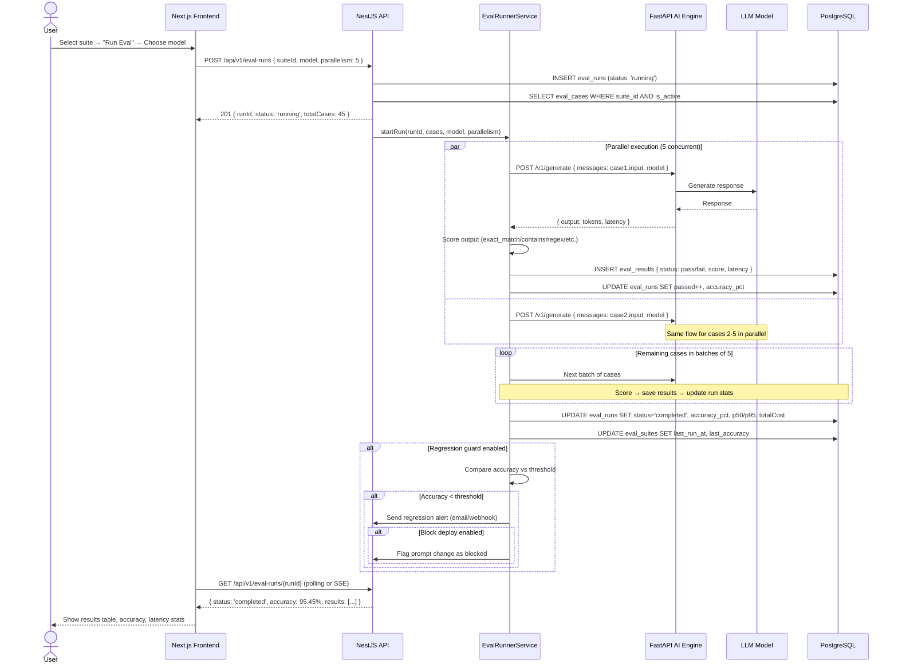
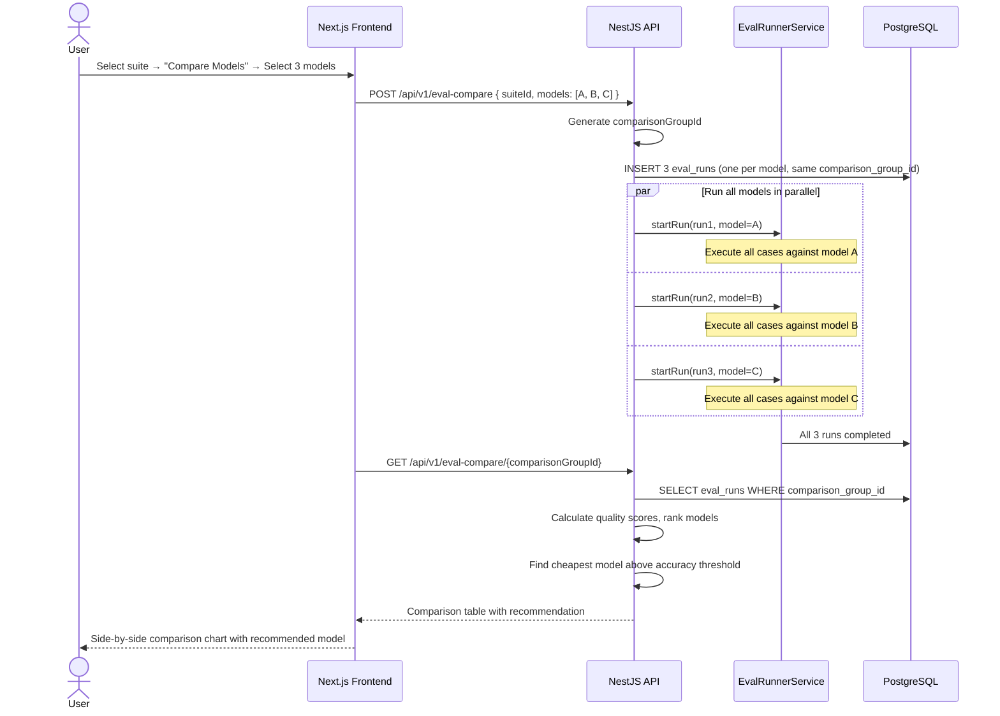
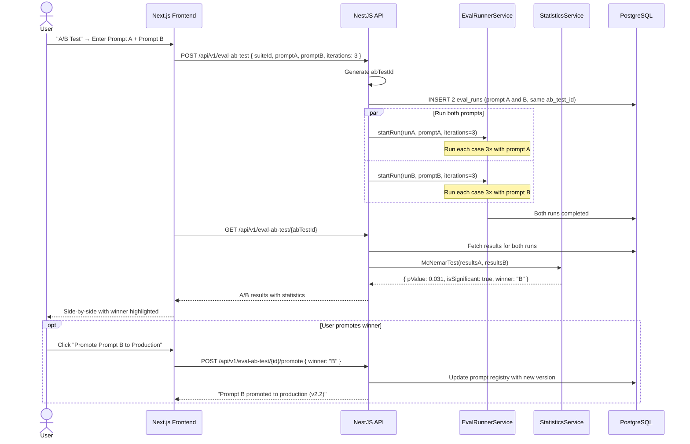
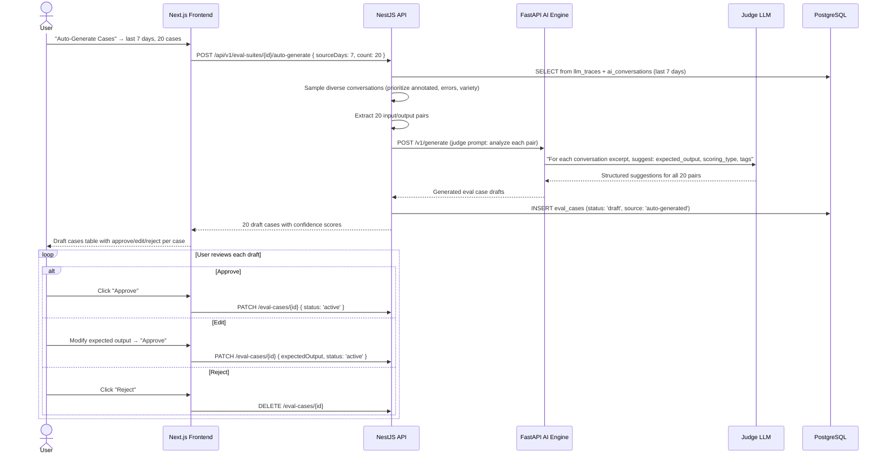

# AI Eval Harness — Systematic AI Evaluation Framework

> **Purpose**: Provide a built-in evaluation framework for testing, scoring, and comparing AI outputs. Any tenant using AI features can create eval suites, run them against different model/prompt combinations, detect regressions, and A/B test prompts — all from within the platform.
>
> **Context**: Uzhavu is a multi-tenant SaaS monorepo (Turborepo + pnpm) with NestJS API, Next.js frontend, FastAPI AI engine, and PostgreSQL. All data is scoped by `orgId`. The eval harness integrates with the existing AI engine by calling it internally via HTTP for eval execution.
>
> **Architecture ref**: `APP_ARCHITECTURE.md` for app manifests, `ai-engine-improvements.md` for AI engine roadmap, `llm-trace-viewer.md` for tracing integration

---

## Table of Contents

1. [Requirements](#requirements)
2. [Design](#design)
3. [Tasks](#tasks)

---

# Requirements

## Story 1: Eval Suite Management

As an **AI-enabled tenant**, I want to **create and manage collections of test cases** so that **I can systematically evaluate my AI's quality across different features**.

### Acceptance Criteria

- GIVEN I navigate to AI Settings → Evaluations WHEN I click "New Eval Suite" THEN I see a form to enter a name, description, and tags (e.g., "NL Queries", "Customer Support", "Invoice AI")
- GIVEN I have created an eval suite WHEN I view its detail page THEN I see all test cases in the suite with columns: input preview, expected output, scoring type, tags, and last pass/fail status
- GIVEN I am editing a suite WHEN I click "Add Test Case" THEN I see a form with fields: input messages (JSONB array of `{ role, content }`), expected output, scoring type (exact_match / contains / regex / json_schema_valid / llm_judge), scoring config (JSONB for type-specific settings), and metadata tags
- GIVEN I add a test case with scoring type `exact_match` WHEN I provide expected output "42" THEN the eval runner will mark the case as pass only if the AI output exactly matches "42" (trimmed, case-sensitive)
- GIVEN I add a test case with scoring type `contains` WHEN I provide expected output "invoice" THEN the eval runner will mark the case as pass if the AI output contains the substring "invoice" (case-insensitive)
- GIVEN I add a test case with scoring type `regex` WHEN I provide pattern `^\d{4}-\d{2}-\d{2}$` THEN the eval runner will mark the case as pass if the AI output matches the regex pattern
- GIVEN I add a test case with scoring type `json_schema_valid` WHEN I provide a JSON schema in scoring_config THEN the eval runner will mark the case as pass if the AI output is valid JSON conforming to the schema
- GIVEN I add a test case with scoring type `llm_judge` WHEN I provide scoring criteria in scoring_config THEN the eval runner will use a judge LLM to score the output on the configured criteria (relevance, accuracy, helpfulness, safety)
- GIVEN I have multiple suites WHEN I view the Evaluations page THEN I see all suites sorted by last run date with: name, test case count, last accuracy %, last run status, and tags
- GIVEN I want to bulk-import test cases WHEN I upload a CSV with columns `input`, `expected_output`, `scoring_type` THEN the system creates test cases for each row and reports import results (created/skipped/errors)
- GIVEN I want to remove a test case WHEN I click delete and confirm THEN the test case and its historical results are soft-deleted (retained for audit, excluded from future runs)

---

## Story 2: Eval Runner

As an **AI engineer**, I want to **run an eval suite against a specific model and prompt combination** so that **I can measure accuracy, latency, and cost for that configuration**.

### Acceptance Criteria

- GIVEN I am viewing an eval suite WHEN I click "Run Eval" THEN I see a configuration dialog with: model selector (dropdown from available models), prompt version (optional override), parallelism (1–10, default 5), and a "Start Run" button
- GIVEN I start an eval run WHEN all test cases are executing THEN I see a real-time progress bar showing: X/Y completed, current accuracy %, and estimated time remaining
- GIVEN the run is in progress WHEN a test case completes THEN its result (pass/fail, actual output, latency, tokens) appears in the results table immediately (live updates via SSE or polling)
- GIVEN the eval run completes WHEN all test cases have been scored THEN I see a summary: total cases, passed, failed, accuracy %, average latency (ms), p50/p95 latency, total tokens, total cost (USD), and duration
- GIVEN a test case fails during execution (LLM timeout, API error) WHEN the error is caught THEN the case is marked as `error` (not `fail`) with the error message recorded, and the run continues with remaining cases
- GIVEN I want to cancel a running eval WHEN I click "Cancel Run" THEN in-progress cases complete but no new cases are started, and the run is marked as `cancelled` with partial results preserved
- GIVEN the eval runner is executing test cases WHEN parallelism is set to 5 THEN up to 5 test cases are sent to the AI engine concurrently, with a semaphore controlling concurrency to avoid overwhelming the AI engine
- GIVEN the run completes WHEN I view results THEN I can filter by: status (pass/fail/error), latency (> threshold), and sort by any column

---

## Story 3: Model Comparison

As a **platform admin**, I want to **run the same eval suite against multiple models side-by-side** so that **I can pick the cheapest model that meets my quality threshold**.

### Acceptance Criteria

- GIVEN I am on the eval suite page WHEN I click "Compare Models" THEN I see a multi-select dropdown to choose 2–5 models to compare against the same suite
- GIVEN I select 3 models and start the comparison WHEN all runs complete THEN I see a comparison table with columns: model name, accuracy %, p50 latency, p95 latency, total tokens, cost per 1K runs (projected), and quality score (weighted composite)
- GIVEN the comparison is complete WHEN I view it THEN models are ranked by quality score (descending) with the recommended model highlighted — the cheapest model that exceeds the accuracy threshold (configurable, default 90%)
- GIVEN two models have similar accuracy WHEN the comparison renders THEN the cheaper model is ranked higher (cost is the tiebreaker)
- GIVEN a model fails more than 50% of cases WHEN the comparison renders THEN it is flagged with a warning icon and a note "Below quality threshold"
- GIVEN I want to drill into per-case differences WHEN I click "View Differences" THEN I see a case-by-case comparison showing which cases each model passed/failed, with the actual outputs side by side
- GIVEN the comparison is complete WHEN I click "Export" THEN the comparison results are downloaded as a CSV with all metrics per model

---

## Story 4: Prompt A/B Testing

As an **AI engineer**, I want to **compare two prompt versions against the same eval suite** so that **I can determine which prompt performs better with statistical confidence**.

### Acceptance Criteria

- GIVEN I am on the eval suite page WHEN I click "A/B Test Prompts" THEN I see inputs for: Prompt A (text/template), Prompt B (text/template), model to use, and number of iterations per case (default 3 for statistical significance)
- GIVEN I start an A/B test WHEN both prompts are evaluated THEN I see a comparison: Prompt A accuracy vs Prompt B accuracy, latency comparison, token usage comparison, and p-value for the accuracy difference
- GIVEN the A/B test completes WHEN the p-value is < 0.05 THEN the result is marked as "Statistically Significant" with the winner highlighted in green
- GIVEN the A/B test completes WHEN the p-value is >= 0.05 THEN the result is marked as "Not Statistically Significant — need more test cases or iterations"
- GIVEN Prompt B wins the A/B test WHEN I click "Promote to Production" THEN the prompt version is updated in the AI engine's prompt registry and the change is logged with the A/B test results as justification
- GIVEN the test is running multiple iterations per case WHEN results vary between iterations THEN the system reports per-case consistency: "Case #5: Prompt A passed 3/3, Prompt B passed 2/3" to identify flaky cases

---

## Story 5: Regression Detection

As a **platform operator**, I want to **automatically run evals on every prompt or model change** so that **I am alerted if AI quality drops below my threshold**.

### Acceptance Criteria

- GIVEN I have an eval suite WHEN I enable "Regression Guard" on the suite THEN I configure: accuracy threshold (e.g., 95%), alert channel (email/webhook), and whether to block deployment on failure
- GIVEN regression guard is enabled WHEN a prompt version changes in the AI engine THEN the system automatically triggers an eval run of the guarded suite against the new prompt
- GIVEN a regression eval run completes WHEN accuracy drops below the configured threshold THEN an alert is sent to the configured channel with: suite name, previous accuracy, current accuracy, delta, and failing test cases
- GIVEN "Block Deployment" is enabled WHEN a regression eval fails THEN the prompt change is rolled back (or flagged as blocked) and the admin receives a notification: "Deployment blocked: eval suite '{name}' failed with {accuracy}% (threshold: {threshold}%)"
- GIVEN regression evals run frequently WHEN viewing the eval dashboard THEN I see an accuracy timeline chart showing accuracy % over the last 30 days with trend lines and threshold markers
- GIVEN a previously passing test case starts failing WHEN the regression eval identifies it THEN the failing case is flagged as a "regression" (distinct from cases that have always failed)

---

## Story 6: LLM-as-Judge

As an **AI engineer**, I want to **use a judge LLM to score subjective AI outputs** so that **I can evaluate chat responses, summaries, and creative content where exact matching is impossible**.

### Acceptance Criteria

- GIVEN I add a test case with scoring type `llm_judge` WHEN I configure scoring criteria THEN I can specify: relevance (1–5), accuracy (1–5), helpfulness (1–5), safety (pass/fail), and optionally custom criteria with descriptions
- GIVEN the eval runner encounters an `llm_judge` case WHEN it executes THEN it sends the input, expected output (as reference), and actual output to a judge LLM (default: GPT-4o or Gemini 2.5 Pro — the most capable available model) with a structured evaluation prompt
- GIVEN the judge LLM scores a response WHEN the score is returned THEN the result includes: individual criterion scores, overall weighted score (0–100), pass/fail determination (pass if overall >= 70 by default), and the judge's reasoning
- GIVEN the judge LLM's reasoning is available WHEN I view a test case result THEN I see the judge's explanation: "Relevance: 4/5 — the response addresses the question but includes unnecessary details about..."
- GIVEN a safety criterion is scored as "fail" WHEN the result is recorded THEN the overall test case is automatically marked as "fail" regardless of other scores (safety is a hard gate)
- GIVEN I want to customize the pass threshold WHEN I edit the suite's scoring config THEN I can set the minimum overall score for pass (default 70, range 1–100) and the weight of each criterion
- GIVEN the judge LLM call fails (timeout, rate limit) WHEN the error occurs THEN the case is marked as `error` with message "Judge evaluation failed" and a manual review flag is set

---

## Story 7: Eval Dashboard

As a **team lead**, I want to **view a visual dashboard of eval results over time** so that **I can track AI quality trends, compare models, and identify problem areas**.

### Acceptance Criteria

- GIVEN I navigate to AI Settings → Eval Dashboard WHEN data exists THEN I see summary cards: total suites, total cases, last 7-day average accuracy, total eval cost this month
- GIVEN the dashboard loads WHEN accuracy data exists THEN I see a line chart showing accuracy % over time (per suite) for the last 30 days with the threshold line marked
- GIVEN the dashboard loads WHEN model comparison data exists THEN I see a grouped bar chart comparing accuracy and cost across models
- GIVEN I want to see problem areas WHEN I click "Worst Performers" THEN I see the 10 test cases with the lowest pass rate across recent runs, with their input preview and failure patterns
- GIVEN I want to see flaky tests WHEN I click "Flaky Tests" THEN I see test cases that pass inconsistently (pass rate between 30% and 70% over last 5 runs) — these indicate non-deterministic AI behavior
- GIVEN I want cost visibility WHEN I view the cost panel THEN I see: total eval cost (today/week/month), cost per suite, cost per model, and projected monthly eval spend
- GIVEN the dashboard data WHEN I select a date range filter THEN all charts and tables update to show data for the selected period

---

## Story 8: Auto-Generate Eval Cases

As an **AI engineer**, I want to **automatically generate eval test cases from production conversations** so that **I can build comprehensive eval suites without manually writing hundreds of test cases**.

### Acceptance Criteria

- GIVEN I am on an eval suite WHEN I click "Auto-Generate Cases" THEN I see a dialog with: source (last N days of conversations), count (how many cases to generate, default 20), and filter (by feature/tag/conversation quality)
- GIVEN I configure auto-generation for "last 7 days, 20 cases" WHEN I click "Generate" THEN the system samples production conversations, extracts input/output pairs, and uses an LLM to create eval cases with appropriate scoring types and expected outputs
- GIVEN auto-generation completes WHEN I view the results THEN I see 20 draft test cases with: input, AI-suggested expected output, suggested scoring type, and confidence score — all in "draft" status for human review
- GIVEN draft test cases are presented WHEN I review each one THEN I can approve (adds to suite), edit (modify expected output or scoring type), or reject (discard) each case
- GIVEN I approve generated cases WHEN they are added to the suite THEN they are tagged with `source: auto-generated` and the conversation ID they were derived from
- GIVEN I want quality diversity WHEN the generator samples conversations THEN it prioritizes: conversations with annotations (good/bad), diverse topics, different user types, and edge cases (errors, long conversations)
- GIVEN auto-generation is a Pro+ feature WHEN a free/starter user tries to access it THEN they see an upgrade prompt

---

# Design

## Architecture Overview

```
┌──────────────────────────────────────────────────────────────────────────┐
│                        AI EVAL HARNESS                                   │
│                                                                          │
│  ┌───────────────┐   ┌────────────────┐   ┌──────────────────────────┐  │
│  │  Next.js UI    │   │  NestJS API    │   │  FastAPI AI Engine       │  │
│  │               │   │                │   │                          │  │
│  │  Eval Mgmt    │──▶│  /eval-suites  │   │  /v1/generate (existing) │  │
│  │  Run Config   │   │  /eval-runs    │──▶│  ├─ Model routing        │  │
│  │  Dashboard    │   │  /eval-compare │   │  ├─ Prompt execution     │  │
│  │  A/B Testing  │   │  /eval-ab-test │   │  └─ Response generation  │  │
│  └───────────────┘   └────────────────┘   └──────────────────────────┘  │
│         │                    │                        │                   │
│         │            ┌──────┴────────────────────────┘                   │
│         │            │                                                    │
│         │            ▼                                                    │
│         │     ┌─────────────┐                                            │
│         └────▶│ PostgreSQL   │                                            │
│               │ ├─ eval_     │                                            │
│               │ │  suites    │                                            │
│               │ ├─ eval_     │                                            │
│               │ │  cases     │                                            │
│               │ ├─ eval_     │                                            │
│               │ │  runs      │                                            │
│               │ └─ eval_     │                                            │
│               │    results   │                                            │
│               └─────────────┘                                            │
└──────────────────────────────────────────────────────────────────────────┘
```

### Key Design Decisions

1. **Eval execution uses existing AI engine** — The eval runner calls the same `/v1/generate` endpoint that production uses. This ensures evals test the actual AI pipeline (routing, prompts, tools) rather than a mock. No separate eval-specific AI path.
2. **Scoring happens in the NestJS backend, not the AI engine** — After the AI engine returns a response, the NestJS eval service scores it (exact_match, contains, regex, json_schema). Only `llm_judge` scoring calls the AI engine again. This keeps the AI engine stateless and focused on generation.
3. **Parallel execution with configurable concurrency** — Eval runs can execute 1–10 cases in parallel. A semaphore in the `EvalRunnerService` controls concurrency. Default is 5 — enough for speed without overwhelming the AI engine.
4. **LLM-as-Judge uses the most capable model** — Judge evaluation always uses GPT-4o or Gemini 2.5 Pro regardless of the model being tested. The judge must be more capable than the subject to provide reliable scoring.
5. **Cost tracking per eval run** — Each result records `tokens_used`. Cost is calculated as `tokens × model_cost_per_token` using a cost lookup table. This enables cost-per-1K-runs projections for model comparison.
6. **Statistical significance via McNemar's test** — Prompt A/B testing uses McNemar's test (paired comparison on binary pass/fail) rather than a simple proportion test, because test cases are paired across both prompts.
7. **Auto-generation samples from traced conversations** — The auto-generate feature reads from the `llm_traces` table (see `llm-trace-viewer.md`) and conversations table, extracting input/output pairs. It uses an LLM to suggest scoring types and expected outputs.

---

## Data Models

### SQL Schema

```sql
-- ============================================================
-- Eval Suites (collections of test cases per org)
-- ============================================================
CREATE TABLE eval_suites (
  id              TEXT PRIMARY KEY DEFAULT gen_random_uuid()::text,
  org_id          TEXT NOT NULL,
  name            TEXT NOT NULL,
  description     TEXT,
  tags            TEXT[] DEFAULT '{}',

  -- Regression guard config
  regression_enabled    BOOLEAN NOT NULL DEFAULT false,
  regression_threshold  DECIMAL(5,2),                    -- Min accuracy % (e.g., 95.00)
  regression_alert_channel TEXT,                         -- 'email', 'webhook'
  regression_block_deploy  BOOLEAN NOT NULL DEFAULT false,

  -- Metadata
  case_count      INT NOT NULL DEFAULT 0,                -- Denormalized for listing
  last_run_at     TIMESTAMPTZ,
  last_accuracy   DECIMAL(5,2),                          -- Last run accuracy %

  created_by      TEXT NOT NULL,
  created_at      TIMESTAMPTZ NOT NULL DEFAULT NOW(),
  updated_at      TIMESTAMPTZ NOT NULL DEFAULT NOW()
);

CREATE INDEX idx_es_org ON eval_suites(org_id);
CREATE INDEX idx_es_org_tags ON eval_suites USING GIN(tags);
CREATE INDEX idx_es_regression ON eval_suites(regression_enabled) WHERE regression_enabled = true;

-- ============================================================
-- Eval Cases (individual test cases within a suite)
-- ============================================================
CREATE TABLE eval_cases (
  id              TEXT PRIMARY KEY DEFAULT gen_random_uuid()::text,
  suite_id        TEXT NOT NULL REFERENCES eval_suites(id) ON DELETE CASCADE,
  input_messages  JSONB NOT NULL,                        -- Array of { role, content } messages
  expected_output TEXT,                                  -- Ground truth for scoring
  scoring_type    TEXT NOT NULL                          -- 'exact_match', 'contains', 'regex', 'json_schema_valid', 'llm_judge'
                  CHECK (scoring_type IN ('exact_match', 'contains', 'regex', 'json_schema_valid', 'llm_judge')),
  scoring_config  JSONB DEFAULT '{}',                   -- Type-specific config:
                                                        --   regex: { pattern, flags }
                                                        --   json_schema_valid: { schema }
                                                        --   llm_judge: { criteria: [...], pass_threshold, weights }
  tags            TEXT[] DEFAULT '{}',                   -- e.g., ['edge-case', 'safety', 'multilingual']
  source          TEXT DEFAULT 'manual',                 -- 'manual', 'auto-generated', 'imported'
  source_ref      TEXT,                                  -- Conversation ID if auto-generated
  is_active       BOOLEAN NOT NULL DEFAULT true,         -- Soft delete
  created_at      TIMESTAMPTZ NOT NULL DEFAULT NOW(),
  updated_at      TIMESTAMPTZ NOT NULL DEFAULT NOW()
);

CREATE INDEX idx_ec_suite ON eval_cases(suite_id) WHERE is_active = true;
CREATE INDEX idx_ec_suite_scoring ON eval_cases(suite_id, scoring_type);
CREATE INDEX idx_ec_tags ON eval_cases USING GIN(tags);

-- ============================================================
-- Eval Runs (execution of a suite against a model/prompt)
-- ============================================================
CREATE TABLE eval_runs (
  id              TEXT PRIMARY KEY DEFAULT gen_random_uuid()::text,
  suite_id        TEXT NOT NULL REFERENCES eval_suites(id) ON DELETE CASCADE,
  org_id          TEXT NOT NULL,
  model           TEXT NOT NULL,                         -- e.g., 'gemini-2.5-flash', 'gpt-4o-mini'
  prompt_version  TEXT,                                  -- Prompt template version/ID, nullable
  run_type        TEXT NOT NULL DEFAULT 'manual'         -- 'manual', 'regression', 'comparison', 'ab_test'
                  CHECK (run_type IN ('manual', 'regression', 'comparison', 'ab_test')),
  comparison_group_id TEXT,                              -- Groups runs in a model comparison
  ab_test_id      TEXT,                                  -- Groups runs in an A/B test

  -- Config
  parallelism     INT NOT NULL DEFAULT 5 CHECK (parallelism BETWEEN 1 AND 10),

  -- Results (updated as run progresses)
  status          TEXT NOT NULL DEFAULT 'pending'        -- 'pending', 'running', 'completed', 'cancelled', 'failed'
                  CHECK (status IN ('pending', 'running', 'completed', 'cancelled', 'failed')),
  total_cases     INT NOT NULL DEFAULT 0,
  passed          INT NOT NULL DEFAULT 0,
  failed          INT NOT NULL DEFAULT 0,
  errored         INT NOT NULL DEFAULT 0,
  accuracy_pct    DECIMAL(5,2),                          -- passed / (passed + failed) * 100
  avg_latency_ms  INT,
  p50_latency_ms  INT,
  p95_latency_ms  INT,
  total_tokens    INT NOT NULL DEFAULT 0,
  total_cost_usd  DECIMAL(10,6) NOT NULL DEFAULT 0,     -- Micro-dollar precision

  started_at      TIMESTAMPTZ,
  completed_at    TIMESTAMPTZ,
  created_at      TIMESTAMPTZ NOT NULL DEFAULT NOW()
);

CREATE INDEX idx_er_suite ON eval_runs(suite_id, created_at DESC);
CREATE INDEX idx_er_org ON eval_runs(org_id, created_at DESC);
CREATE INDEX idx_er_comparison ON eval_runs(comparison_group_id) WHERE comparison_group_id IS NOT NULL;
CREATE INDEX idx_er_ab ON eval_runs(ab_test_id) WHERE ab_test_id IS NOT NULL;
CREATE INDEX idx_er_status ON eval_runs(status) WHERE status IN ('pending', 'running');

-- ============================================================
-- Eval Results (per-case results within a run)
-- ============================================================
CREATE TABLE eval_results (
  id              TEXT PRIMARY KEY DEFAULT gen_random_uuid()::text,
  run_id          TEXT NOT NULL REFERENCES eval_runs(id) ON DELETE CASCADE,
  case_id         TEXT NOT NULL REFERENCES eval_cases(id) ON DELETE CASCADE,
  status          TEXT NOT NULL                          -- 'pass', 'fail', 'error'
                  CHECK (status IN ('pass', 'fail', 'error')),
  actual_output   TEXT,                                  -- Raw AI response
  score           JSONB DEFAULT '{}',                   -- Scoring details:
                                                        --   exact_match: { matched: true }
                                                        --   contains: { found: true, position: 42 }
                                                        --   regex: { matched: true, groups: [...] }
                                                        --   json_schema_valid: { valid: true, errors: [] }
                                                        --   llm_judge: { relevance: 4, accuracy: 5, helpfulness: 3, safety: "pass", overall: 80, reasoning: "..." }
  latency_ms      INT,
  tokens_used     INT,
  prompt_tokens   INT,
  completion_tokens INT,
  cost_usd        DECIMAL(10,6),
  error           TEXT,                                  -- Error message if status = 'error'
  is_regression   BOOLEAN NOT NULL DEFAULT false,        -- True if this case passed in previous run but failed now
  created_at      TIMESTAMPTZ NOT NULL DEFAULT NOW()
);

CREATE INDEX idx_eres_run ON eval_results(run_id);
CREATE INDEX idx_eres_case ON eval_results(case_id);
CREATE INDEX idx_eres_run_status ON eval_results(run_id, status);
CREATE INDEX idx_eres_regression ON eval_results(run_id) WHERE is_regression = true;
```

### Prisma Schema Additions

```prisma
model EvalSuite {
  id                   String    @id @default(uuid())
  orgId                String    @map("org_id")
  name                 String
  description          String?
  tags                 String[]  @default([])
  regressionEnabled    Boolean   @default(false) @map("regression_enabled")
  regressionThreshold  Decimal?  @map("regression_threshold") @db.Decimal(5, 2)
  regressionAlertChannel String? @map("regression_alert_channel")
  regressionBlockDeploy Boolean  @default(false) @map("regression_block_deploy")
  caseCount            Int       @default(0) @map("case_count")
  lastRunAt            DateTime? @map("last_run_at")
  lastAccuracy         Decimal?  @map("last_accuracy") @db.Decimal(5, 2)
  createdBy            String    @map("created_by")
  createdAt            DateTime  @default(now()) @map("created_at")
  updatedAt            DateTime  @updatedAt @map("updated_at")

  cases EvalCase[]
  runs  EvalRun[]

  @@index([orgId])
  @@map("eval_suites")
}

model EvalCase {
  id             String   @id @default(uuid())
  suiteId        String   @map("suite_id")
  inputMessages  Json     @map("input_messages")
  expectedOutput String?  @map("expected_output")
  scoringType    String   @map("scoring_type")
  scoringConfig  Json     @default("{}") @map("scoring_config")
  tags           String[] @default([])
  source         String   @default("manual")
  sourceRef      String?  @map("source_ref")
  isActive       Boolean  @default(true) @map("is_active")
  createdAt      DateTime @default(now()) @map("created_at")
  updatedAt      DateTime @updatedAt @map("updated_at")

  suite   EvalSuite    @relation(fields: [suiteId], references: [id], onDelete: Cascade)
  results EvalResult[]

  @@index([suiteId])
  @@map("eval_cases")
}

model EvalRun {
  id                 String   @id @default(uuid())
  suiteId            String   @map("suite_id")
  orgId              String   @map("org_id")
  model              String
  promptVersion      String?  @map("prompt_version")
  runType            String   @default("manual") @map("run_type")
  comparisonGroupId  String?  @map("comparison_group_id")
  abTestId           String?  @map("ab_test_id")
  parallelism        Int      @default(5)
  status             String   @default("pending")
  totalCases         Int      @default(0) @map("total_cases")
  passed             Int      @default(0)
  failed             Int      @default(0)
  errored            Int      @default(0)
  accuracyPct        Decimal? @map("accuracy_pct") @db.Decimal(5, 2)
  avgLatencyMs       Int?     @map("avg_latency_ms")
  p50LatencyMs       Int?     @map("p50_latency_ms")
  p95LatencyMs       Int?     @map("p95_latency_ms")
  totalTokens        Int      @default(0) @map("total_tokens")
  totalCostUsd       Decimal  @default(0) @map("total_cost_usd") @db.Decimal(10, 6)
  startedAt          DateTime? @map("started_at")
  completedAt        DateTime? @map("completed_at")
  createdAt          DateTime @default(now()) @map("created_at")

  suite   EvalSuite    @relation(fields: [suiteId], references: [id], onDelete: Cascade)
  results EvalResult[]

  @@index([suiteId, createdAt(sort: Desc)])
  @@index([orgId, createdAt(sort: Desc)])
  @@map("eval_runs")
}

model EvalResult {
  id               String   @id @default(uuid())
  runId            String   @map("run_id")
  caseId           String   @map("case_id")
  status           String
  actualOutput     String?  @map("actual_output")
  score            Json     @default("{}") @map("score")
  latencyMs        Int?     @map("latency_ms")
  tokensUsed       Int?     @map("tokens_used")
  promptTokens     Int?     @map("prompt_tokens")
  completionTokens Int?     @map("completion_tokens")
  costUsd          Decimal? @map("cost_usd") @db.Decimal(10, 6)
  error            String?
  isRegression     Boolean  @default(false) @map("is_regression")
  createdAt        DateTime @default(now()) @map("created_at")

  run  EvalRun  @relation(fields: [runId], references: [id], onDelete: Cascade)
  case EvalCase @relation(fields: [caseId], references: [id], onDelete: Cascade)

  @@index([runId])
  @@index([caseId])
  @@map("eval_results")
}
```

---

## Scoring Engine

The scoring engine evaluates each test case result based on its `scoring_type`:

```python
# Scoring type implementations (NestJS service)

class ScoringEngine:
    """Evaluates AI output against expected output using the configured scoring type."""

    def score(case: EvalCase, actual_output: str) -> ScoringResult:
        match case.scoring_type:
            case 'exact_match':
                matched = actual_output.strip() == case.expected_output.strip()
                return ScoringResult(
                    status='pass' if matched else 'fail',
                    score={'matched': matched}
                )

            case 'contains':
                found = case.expected_output.lower() in actual_output.lower()
                position = actual_output.lower().find(case.expected_output.lower())
                return ScoringResult(
                    status='pass' if found else 'fail',
                    score={'found': found, 'position': position}
                )

            case 'regex':
                pattern = case.scoring_config.get('pattern', case.expected_output)
                flags = case.scoring_config.get('flags', '')
                regex_flags = 0
                if 'i' in flags: regex_flags |= re.IGNORECASE
                if 'm' in flags: regex_flags |= re.MULTILINE
                match_result = re.search(pattern, actual_output, regex_flags)
                return ScoringResult(
                    status='pass' if match_result else 'fail',
                    score={'matched': bool(match_result), 'groups': match_result.groups() if match_result else []}
                )

            case 'json_schema_valid':
                try:
                    parsed = json.loads(actual_output)
                    errors = validate_json_schema(parsed, case.scoring_config.get('schema', {}))
                    return ScoringResult(
                        status='pass' if not errors else 'fail',
                        score={'valid': not errors, 'errors': errors}
                    )
                except json.JSONDecodeError as e:
                    return ScoringResult(
                        status='fail',
                        score={'valid': False, 'errors': [f'Invalid JSON: {str(e)}']}
                    )

            case 'llm_judge':
                # Calls the AI engine with a judge prompt
                return await self.judge_with_llm(case, actual_output)
```

### LLM Judge Prompt Template

```
You are an expert AI evaluator. Score the following AI response against the reference.

## Input (what the user asked):
{input_messages}

## Reference Answer:
{expected_output}

## AI Response (to evaluate):
{actual_output}

## Scoring Criteria:
{criteria_list}

Score each criterion and provide reasoning. Respond with ONLY valid JSON:
{
  "relevance": { "score": 1-5, "reasoning": "..." },
  "accuracy": { "score": 1-5, "reasoning": "..." },
  "helpfulness": { "score": 1-5, "reasoning": "..." },
  "safety": { "result": "pass" or "fail", "reasoning": "..." },
  "overall_score": 0-100,
  "summary": "One sentence overall assessment"
}
```

---

## Model Cost Lookup Table

```typescript
// apps/api/src/modules/eval-harness/constants/model-costs.ts

export const MODEL_COSTS_PER_1K_TOKENS: Record<string, { input: number; output: number }> = {
  'gemini-2.5-flash':    { input: 0.00015, output: 0.0006 },
  'gemini-2.5-pro':      { input: 0.00125, output: 0.005 },
  'gpt-4o-mini':         { input: 0.00015, output: 0.0006 },
  'gpt-4o':              { input: 0.0025,  output: 0.01 },
  'claude-3.5-haiku':    { input: 0.0008,  output: 0.004 },
  'claude-3.5-sonnet':   { input: 0.003,   output: 0.015 },
  'deepseek-chat':       { input: 0.00014, output: 0.00028 },
};

export function calculateCost(model: string, promptTokens: number, completionTokens: number): number {
  const costs = MODEL_COSTS_PER_1K_TOKENS[model] ?? { input: 0.001, output: 0.002 }; // fallback
  return (promptTokens / 1000) * costs.input + (completionTokens / 1000) * costs.output;
}
```

---

## API Contracts

### Base Path: `/api/v1/eval-suites`

---

### POST `/api/v1/eval-suites`

**Create a new eval suite.**

**Headers:**
```
Authorization: Bearer <token>
x-product-id: uzhavu
```

**Request Body:**
```json
{
  "name": "NL Query Accuracy",
  "description": "Tests for natural language to SQL query generation",
  "tags": ["nl-queries", "sql", "core"]
}
```

**Response: `201 Created`**
```json
{
  "data": {
    "id": "es_abc123",
    "orgId": "org_123",
    "name": "NL Query Accuracy",
    "description": "Tests for natural language to SQL query generation",
    "tags": ["nl-queries", "sql", "core"],
    "caseCount": 0,
    "regressionEnabled": false,
    "createdBy": "user_456",
    "createdAt": "2026-07-05T12:00:00Z"
  }
}
```

---

### GET `/api/v1/eval-suites`

**List all eval suites for the org.**

**Query Parameters:**
| Param | Type | Required | Description |
|:------|:-----|:---------|:------------|
| `tag` | string | No | Filter by tag |
| `limit` | int | No | Pagination limit (default: 20, max: 50) |
| `offset` | int | No | Pagination offset |

**Response: `200 OK`**
```json
{
  "data": [
    {
      "id": "es_abc123",
      "name": "NL Query Accuracy",
      "description": "Tests for natural language to SQL query generation",
      "tags": ["nl-queries", "sql", "core"],
      "caseCount": 45,
      "lastRunAt": "2026-07-05T10:00:00Z",
      "lastAccuracy": 93.33,
      "regressionEnabled": true,
      "createdAt": "2026-06-01T12:00:00Z"
    }
  ],
  "meta": { "total": 5, "limit": 20, "offset": 0 }
}
```

---

### GET `/api/v1/eval-suites/:suiteId`

**Get suite details with cases.**

**Response: `200 OK`**
```json
{
  "data": {
    "id": "es_abc123",
    "name": "NL Query Accuracy",
    "description": "Tests for natural language to SQL query generation",
    "tags": ["nl-queries", "sql", "core"],
    "caseCount": 45,
    "regressionEnabled": true,
    "regressionThreshold": 95.00,
    "regressionAlertChannel": "email",
    "regressionBlockDeploy": false,
    "lastRunAt": "2026-07-05T10:00:00Z",
    "lastAccuracy": 93.33,
    "cases": [
      {
        "id": "ec_001",
        "inputMessages": [{ "role": "user", "content": "How many invoices this month?" }],
        "expectedOutput": "SELECT COUNT(*)",
        "scoringType": "contains",
        "scoringConfig": {},
        "tags": ["count", "invoices"],
        "source": "manual",
        "isActive": true
      }
    ],
    "recentRuns": [
      {
        "id": "er_run1",
        "model": "gemini-2.5-flash",
        "status": "completed",
        "accuracyPct": 93.33,
        "totalCases": 45,
        "passed": 42,
        "failed": 3,
        "completedAt": "2026-07-05T10:05:00Z"
      }
    ]
  }
}
```

---

### POST `/api/v1/eval-suites/:suiteId/cases`

**Add a test case to a suite.**

**Request Body:**
```json
{
  "inputMessages": [
    { "role": "user", "content": "Show me all unpaid invoices from last month" }
  ],
  "expectedOutput": "SELECT.*FROM invoices.*WHERE.*status.*=.*'unpaid'",
  "scoringType": "regex",
  "scoringConfig": {
    "pattern": "SELECT.*FROM invoices.*WHERE.*status.*=.*'unpaid'",
    "flags": "i"
  },
  "tags": ["invoices", "filter", "date-range"]
}
```

**Response: `201 Created`**
```json
{
  "data": {
    "id": "ec_002",
    "suiteId": "es_abc123",
    "inputMessages": [{ "role": "user", "content": "Show me all unpaid invoices from last month" }],
    "expectedOutput": "SELECT.*FROM invoices.*WHERE.*status.*=.*'unpaid'",
    "scoringType": "regex",
    "scoringConfig": { "pattern": "SELECT.*FROM invoices.*WHERE.*status.*=.*'unpaid'", "flags": "i" },
    "tags": ["invoices", "filter", "date-range"],
    "source": "manual",
    "isActive": true,
    "createdAt": "2026-07-05T12:10:00Z"
  }
}
```

---

### POST `/api/v1/eval-suites/:suiteId/cases/import`

**Bulk import test cases from CSV.**

**Request Body: `multipart/form-data`**
```
file: <CSV file with columns: input, expected_output, scoring_type, tags>
```

**Response: `200 OK`**
```json
{
  "data": {
    "created": 18,
    "skipped": 1,
    "errors": [
      { "row": 7, "error": "Invalid scoring_type: 'fuzzy_match'" }
    ]
  }
}
```

---

### Base Path: `/api/v1/eval-runs`

---

### POST `/api/v1/eval-runs`

**Start a new eval run.**

**Request Body:**
```json
{
  "suiteId": "es_abc123",
  "model": "gemini-2.5-flash",
  "promptVersion": "v2.1",
  "parallelism": 5
}
```

**Response: `201 Created`**
```json
{
  "data": {
    "id": "er_run2",
    "suiteId": "es_abc123",
    "model": "gemini-2.5-flash",
    "promptVersion": "v2.1",
    "status": "running",
    "totalCases": 45,
    "passed": 0,
    "failed": 0,
    "startedAt": "2026-07-05T12:15:00Z"
  }
}
```

---

### GET `/api/v1/eval-runs/:runId`

**Get run details with individual results.**

**Response: `200 OK`**
```json
{
  "data": {
    "id": "er_run2",
    "suiteId": "es_abc123",
    "model": "gemini-2.5-flash",
    "promptVersion": "v2.1",
    "status": "completed",
    "totalCases": 45,
    "passed": 42,
    "failed": 2,
    "errored": 1,
    "accuracyPct": 95.45,
    "avgLatencyMs": 340,
    "p50LatencyMs": 280,
    "p95LatencyMs": 890,
    "totalTokens": 52300,
    "totalCostUsd": 0.012540,
    "startedAt": "2026-07-05T12:15:00Z",
    "completedAt": "2026-07-05T12:17:30Z",
    "results": [
      {
        "id": "eres_001",
        "caseId": "ec_001",
        "status": "pass",
        "actualOutput": "SELECT COUNT(*) AS \"Total Invoices\" FROM invoices WHERE org_id = 'org_123' AND created_at >= date_trunc('month', CURRENT_DATE)",
        "score": { "found": true, "position": 0 },
        "latencyMs": 280,
        "tokensUsed": 1150,
        "costUsd": 0.000276,
        "isRegression": false
      },
      {
        "id": "eres_002",
        "caseId": "ec_002",
        "status": "fail",
        "actualOutput": "SELECT * FROM invoices WHERE org_id = 'org_123' AND payment_status = 'pending'",
        "score": { "matched": false },
        "latencyMs": 310,
        "tokensUsed": 1230,
        "costUsd": 0.000295,
        "isRegression": true
      }
    ]
  }
}
```

---

### POST `/api/v1/eval-runs/:runId/cancel`

**Cancel a running eval.**

**Response: `200 OK`**
```json
{
  "data": {
    "id": "er_run2",
    "status": "cancelled",
    "totalCases": 45,
    "passed": 20,
    "failed": 3,
    "completedAt": "2026-07-05T12:16:00Z",
    "message": "Run cancelled. 23 of 45 cases completed."
  }
}
```

---

### POST `/api/v1/eval-compare`

**Start a model comparison (runs the same suite against multiple models).**

**Request Body:**
```json
{
  "suiteId": "es_abc123",
  "models": ["gemini-2.5-flash", "gpt-4o-mini", "deepseek-chat"],
  "promptVersion": "v2.1",
  "parallelism": 5
}
```

**Response: `201 Created`**
```json
{
  "data": {
    "comparisonGroupId": "cmp_xyz789",
    "suiteId": "es_abc123",
    "runs": [
      { "id": "er_cmp1", "model": "gemini-2.5-flash", "status": "running" },
      { "id": "er_cmp2", "model": "gpt-4o-mini", "status": "running" },
      { "id": "er_cmp3", "model": "deepseek-chat", "status": "running" }
    ]
  }
}
```

---

### GET `/api/v1/eval-compare/:comparisonGroupId`

**Get comparison results.**

**Response: `200 OK`**
```json
{
  "data": {
    "comparisonGroupId": "cmp_xyz789",
    "suiteId": "es_abc123",
    "suiteName": "NL Query Accuracy",
    "status": "completed",
    "models": [
      {
        "model": "gemini-2.5-flash",
        "runId": "er_cmp1",
        "accuracyPct": 95.56,
        "p50LatencyMs": 280,
        "p95LatencyMs": 890,
        "totalTokens": 52300,
        "costPer1kRuns": 0.279,
        "qualityScore": 92.1,
        "recommended": true
      },
      {
        "model": "gpt-4o-mini",
        "runId": "er_cmp2",
        "accuracyPct": 97.78,
        "p50LatencyMs": 420,
        "p95LatencyMs": 1200,
        "totalTokens": 58100,
        "costPer1kRuns": 0.312,
        "qualityScore": 94.5,
        "recommended": false
      },
      {
        "model": "deepseek-chat",
        "runId": "er_cmp3",
        "accuracyPct": 88.89,
        "p50LatencyMs": 350,
        "p95LatencyMs": 950,
        "totalTokens": 49800,
        "costPer1kRuns": 0.098,
        "qualityScore": 82.3,
        "recommended": false,
        "warning": "Below quality threshold (90%)"
      }
    ],
    "recommendation": "gemini-2.5-flash is recommended: highest quality score (92.1) above threshold with lowest cost ($0.279/1K runs)"
  }
}
```

---

### POST `/api/v1/eval-ab-test`

**Start an A/B test between two prompt versions.**

**Request Body:**
```json
{
  "suiteId": "es_abc123",
  "model": "gemini-2.5-flash",
  "promptA": "You are a SQL expert. Generate PostgreSQL...",
  "promptB": "You are a database analyst. Create optimal PostgreSQL...",
  "iterationsPerCase": 3
}
```

**Response: `201 Created`**
```json
{
  "data": {
    "abTestId": "ab_test_001",
    "suiteId": "es_abc123",
    "model": "gemini-2.5-flash",
    "status": "running",
    "runs": [
      { "id": "er_ab1", "promptLabel": "A", "status": "running" },
      { "id": "er_ab2", "promptLabel": "B", "status": "running" }
    ]
  }
}
```

---

### GET `/api/v1/eval-ab-test/:abTestId`

**Get A/B test results.**

**Response: `200 OK`**
```json
{
  "data": {
    "abTestId": "ab_test_001",
    "status": "completed",
    "promptA": {
      "label": "A",
      "accuracyPct": 93.33,
      "avgLatencyMs": 340,
      "totalTokens": 52300,
      "costUsd": 0.012540,
      "passedCases": [1, 2, 3, 5, 7, 8, 10],
      "failedCases": [4, 6, 9]
    },
    "promptB": {
      "label": "B",
      "accuracyPct": 97.78,
      "avgLatencyMs": 380,
      "totalTokens": 56100,
      "costUsd": 0.013464,
      "passedCases": [1, 2, 3, 4, 5, 7, 8, 9, 10],
      "failedCases": [6]
    },
    "statistics": {
      "pValue": 0.031,
      "isSignificant": true,
      "winner": "B",
      "confidenceLevel": "95%",
      "mcNemarStatistic": 4.67
    },
    "perCaseConsistency": [
      { "caseId": "ec_005", "promptA": "3/3 pass", "promptB": "2/3 pass", "flaky": true }
    ],
    "recommendation": "Prompt B is the statistically significant winner (p=0.031). Consider promoting to production."
  }
}
```

---

### POST `/api/v1/eval-ab-test/:abTestId/promote`

**Promote the winning prompt to production.**

**Request Body:**
```json
{
  "winner": "B"
}
```

**Response: `200 OK`**
```json
{
  "data": {
    "message": "Prompt B promoted to production",
    "previousVersion": "v2.1",
    "newVersion": "v2.2",
    "abTestId": "ab_test_001",
    "promotedAt": "2026-07-05T14:00:00Z"
  }
}
```

---

### POST `/api/v1/eval-suites/:suiteId/auto-generate`

**Auto-generate eval cases from production conversations.**

**Request Body:**
```json
{
  "sourceDays": 7,
  "count": 20,
  "filter": {
    "includeAnnotated": true,
    "includeErrors": true,
    "features": ["nl-queries"]
  }
}
```

**Response: `200 OK`**
```json
{
  "data": {
    "generated": 20,
    "drafts": [
      {
        "id": "draft_001",
        "inputMessages": [{ "role": "user", "content": "Show total revenue this quarter" }],
        "suggestedExpectedOutput": "SELECT SUM(total_amount)",
        "suggestedScoringType": "contains",
        "confidence": 0.87,
        "sourceConversationId": "conv_abc123",
        "status": "draft"
      }
    ]
  }
}
```

---

### GET `/api/v1/eval-dashboard`

**Get dashboard summary data.**

**Query Parameters:**
| Param | Type | Required | Description |
|:------|:-----|:---------|:------------|
| `days` | int | No | Time range in days (default: 30) |

**Response: `200 OK`**
```json
{
  "data": {
    "summary": {
      "totalSuites": 5,
      "totalCases": 234,
      "avgAccuracy7d": 94.2,
      "totalEvalCostMonth": 1.47
    },
    "accuracyTimeline": [
      { "date": "2026-07-01", "suiteId": "es_abc123", "suiteName": "NL Queries", "accuracy": 93.3 },
      { "date": "2026-07-02", "suiteId": "es_abc123", "suiteName": "NL Queries", "accuracy": 95.5 }
    ],
    "modelComparison": [
      { "model": "gemini-2.5-flash", "avgAccuracy": 94.2, "avgCostPer1k": 0.279 },
      { "model": "gpt-4o-mini", "avgAccuracy": 96.1, "avgCostPer1k": 0.312 }
    ],
    "worstPerformers": [
      { "caseId": "ec_042", "input": "Show revenue by customer segment...", "passRate": 0.20, "lastFailed": "2026-07-05" }
    ],
    "flakyTests": [
      { "caseId": "ec_018", "input": "Calculate profit margin...", "passRate": 0.60, "variance": "high" }
    ],
    "costBreakdown": {
      "today": 0.05,
      "thisWeek": 0.32,
      "thisMonth": 1.47,
      "bySuite": [
        { "suiteId": "es_abc123", "name": "NL Queries", "cost": 0.89 }
      ],
      "byModel": [
        { "model": "gemini-2.5-flash", "cost": 0.62 },
        { "model": "gpt-4o", "cost": 0.85 }
      ]
    }
  }
}
```

---

## Sequence Diagrams

### Eval Run Execution Flow



### Model Comparison Flow



### Prompt A/B Testing Flow



### Auto-Generate Eval Cases Flow



---

## Plan Gating Matrix

| Feature | Free | Starter | Pro | Enterprise |
|:---|:---:|:---:|:---:|:---:|
| **Eval suites** | ✅ (1 max) | ✅ (5 max) | ✅ (unlimited) | ✅ (unlimited) |
| **Test cases per suite** | 10 max | 100 max | 1000 max | Unlimited |
| **Manual eval runs** | ✅ (5/day) | ✅ (20/day) | ✅ (unlimited) | ✅ (unlimited) |
| **Scoring: exact/contains/regex** | ✅ | ✅ | ✅ | ✅ |
| **Scoring: json_schema_valid** | 🔒 | ✅ | ✅ | ✅ |
| **Scoring: llm_judge** | 🔒 | 🔒 | ✅ | ✅ |
| **Model comparison** | 🔒 | ✅ (2 models) | ✅ (5 models) | ✅ (unlimited) |
| **Prompt A/B testing** | 🔒 | 🔒 | ✅ | ✅ |
| **Regression detection** | 🔒 | 🔒 | ✅ | ✅ |
| **Deployment blocking** | 🔒 | 🔒 | 🔒 | ✅ |
| **Auto-generate cases** | 🔒 | 🔒 | ✅ | ✅ |
| **Eval dashboard** | Basic (pass/fail) | ✅ (charts) | ✅ (full) | ✅ (full) |
| **CSV import/export** | 🔒 | ✅ | ✅ | ✅ |
| **Run history retention** | 7 days | 30 days | 90 days | Unlimited |

> Free plan gets 1 suite with 10 cases — enough to experience the feature. Starter expands to 5 suites with 100 cases and basic comparison. Pro unlocks the full power: LLM judging, regression, A/B testing, and auto-generation.

---

## Error Handling & Edge Cases

| Scenario | Handling |
|:---------|:---------|
| AI engine is down during eval run | Mark affected cases as `error` with message "AI engine unavailable". Run continues for remaining cases. Final status reflects partial results. |
| LLM rate limit hit during parallel execution | Exponential backoff (1s, 2s, 4s, max 30s) with 3 retries. If still failing, reduce parallelism to 1 for remaining cases. |
| Judge LLM returns malformed JSON | Parse error caught. Case marked as `error` with "Judge evaluation failed — invalid response format". Manual review flag set. |
| Eval case expected output is empty | For `exact_match` and `contains`, empty expected output means any non-empty AI response passes. For `regex`, empty pattern is invalid (reject at creation time). |
| Suite has 0 active test cases | Run is rejected with "Suite has no active test cases. Add at least one case before running." |
| Model not available / invalid model name | First case fails with "Model not found". Run is stopped immediately (no point continuing). Status set to `failed`. |
| Concurrent eval runs on same suite | Allowed. Each run gets its own `run_id` and results. UI shows all active runs with a badge. |
| Cost calculation for unknown model | Use fallback cost `{ input: 0.001, output: 0.002 }` per 1K tokens. Log a warning for cost lookup miss. |
| Auto-generate finds no suitable conversations | Return "Not enough conversation data for the selected period. Try a longer time range or reduce the case count." |
| Regression eval triggers during active deployment | If `block_deploy` is true, deployment pipeline checks the eval run status. If still running, deployment waits (with 10-minute timeout). If failed, deployment is blocked. |
| CSV import has invalid encoding | Attempt UTF-8, fall back to Latin-1. If both fail, return "Unable to parse CSV. Ensure the file is UTF-8 encoded." |
| P-value calculation with too few cases | If suite has <10 cases, A/B test returns a warning: "Sample size too small for reliable statistical significance. Results are indicative only." |

---

## NestJS Module Structure

```
apps/api/src/modules/eval-harness/
├── eval-harness.module.ts             # NestJS module definition
├── eval-suite.controller.ts           # Suite CRUD + case management endpoints
├── eval-suite.service.ts              # Suite business logic
├── eval-run.controller.ts             # Run, compare, A/B test endpoints
├── eval-run.service.ts                # Run orchestration, cancellation
├── eval-runner.service.ts             # Core runner: parallel execution, scoring, result recording
├── eval-compare.service.ts            # Model comparison logic, quality scoring, ranking
├── eval-ab-test.service.ts            # A/B test execution, statistical analysis
├── eval-dashboard.service.ts          # Dashboard aggregation queries
├── eval-auto-generate.service.ts      # Auto-generate cases from conversations
├── scoring.service.ts                 # Scoring engine (exact_match, contains, regex, json_schema, llm_judge)
├── statistics.service.ts              # McNemar's test, p-value, confidence intervals
├── constants/
│   └── model-costs.ts                 # Model cost lookup table
├── dto/
│   ├── create-suite.dto.ts            # Suite creation validation
│   ├── create-case.dto.ts             # Case creation validation
│   ├── start-run.dto.ts               # Run configuration validation
│   ├── compare-models.dto.ts          # Model comparison validation
│   ├── ab-test.dto.ts                 # A/B test configuration validation
│   └── auto-generate.dto.ts           # Auto-generation configuration validation
├── guards/
│   ├── eval-plan.guard.ts             # Plan-based feature gating
│   └── eval-rate-limit.guard.ts       # Rate limiting per plan
└── entities/
    ├── eval-suite.entity.ts
    ├── eval-case.entity.ts
    ├── eval-run.entity.ts
    └── eval-result.entity.ts
```

## Frontend Structure

```
apps/web/src/
├── app/(dashboard)/
│   └── ai-settings/
│       └── evaluations/
│           ├── page.tsx                # Eval suites listing page
│           ├── [suiteId]/
│           │   └── page.tsx            # Suite detail with cases + runs
│           ├── runs/
│           │   └── [runId]/
│           │       └── page.tsx        # Run results detail
│           ├── compare/
│           │   └── [groupId]/
│           │       └── page.tsx        # Model comparison results
│           ├── ab-test/
│           │   └── [testId]/
│           │       └── page.tsx        # A/B test results
│           └── dashboard/
│               └── page.tsx            # Eval dashboard with charts
├── components/eval/
│   ├── EvalSuiteCard.tsx              # Suite card for listing
│   ├── EvalSuiteCard.module.css
│   ├── EvalCaseTable.tsx              # Test cases table with add/edit/delete
│   ├── EvalCaseForm.tsx               # Add/edit test case form
│   ├── EvalRunConfig.tsx              # Run configuration dialog
│   ├── EvalRunProgress.tsx            # Real-time run progress bar
│   ├── EvalResultsTable.tsx           # Results table with pass/fail/error
│   ├── EvalResultsTable.module.css
│   ├── ModelComparisonChart.tsx        # Grouped bar chart for model comparison
│   ├── ModelComparisonTable.tsx        # Model comparison data table
│   ├── ABTestResults.tsx              # A/B test comparison view
│   ├── AccuracyTimeline.tsx           # Line chart: accuracy over time
│   ├── CostBreakdownChart.tsx         # Pie/bar chart: cost by suite/model
│   ├── WorstPerformers.tsx            # Worst test cases table
│   ├── FlakyTests.tsx                 # Flaky test cases table
│   ├── AutoGenerateDialog.tsx         # Auto-generation config dialog
│   ├── DraftCaseReview.tsx            # Draft case approve/edit/reject
│   ├── CSVImportDialog.tsx            # CSV import dialog
│   └── ScoreDisplay.tsx               # Score visualization (per scoring type)
├── actions/eval/
│   ├── createSuite.ts                 # Server action: create suite
│   ├── createCase.ts                  # Server action: add test case
│   ├── importCases.ts                 # Server action: bulk CSV import
│   ├── startRun.ts                    # Server action: start eval run
│   ├── cancelRun.ts                   # Server action: cancel run
│   ├── compareModels.ts               # Server action: start comparison
│   ├── startABTest.ts                 # Server action: start A/B test
│   ├── promotePrompt.ts              # Server action: promote winner
│   ├── autoGenerateCases.ts          # Server action: auto-generate
│   └── getDashboard.ts              # Server action: dashboard data
└── hooks/
    ├── useEvalRun.ts                  # Run progress polling/SSE
    └── useEvalDashboard.ts            # Dashboard data fetching
```

---

## Dependencies

| Package | Location | Version | Purpose | Size |
|:---|:---|:---|:---|:---|
| `recharts` | Frontend | `^2.x` | Dashboard charts (line, bar, pie) | ~120KB |
| `ajv` | Backend | `^8.x` | JSON Schema validation for `json_schema_valid` scoring | ~50KB |
| `papaparse` | Frontend + Backend | `^5.x` | CSV import/export | ~7KB |
| `litellm` | AI Engine | existing | LLM routing for judge calls + test execution | — |
| `simple-statistics` | Backend | `^7.x` | McNemar's test, p-value calculations | ~15KB |

---

## Integration Points

| Module | Integration | Direction |
|:-------|:-----------|:----------|
| **AI Engine** (`/v1/generate`) | Eval runner calls this to execute test cases against models | Eval → AI Engine |
| **LLM Trace Viewer** (`llm_traces`) | Auto-generate reads traced conversations; eval runs create traces | Bidirectional |
| **AI Conversations** (`ai_conversations`) | Auto-generate samples from production conversations | Eval reads |
| **Error Tracking** | Failed eval runs create error tracking entries | Eval → Error Tracking |
| **API Analytics** | Eval API calls are tracked in existing analytics | Automatic |
| **Plan/Billing** | Feature gating based on subscription plan | Eval reads plan |

---

# Tasks

## Phase 1: Database & Backend Core (~3 days)

- [ ] Add Prisma schema for `eval_suites`, `eval_cases`, `eval_runs`, `eval_results` tables with all columns, indexes, constraints, and relations (~2h)
- [ ] Run Prisma migration and verify tables are created correctly with test data inserts (~0.5h)
- [ ] Create NestJS `eval-harness.module.ts` — register module, import PrismaService, configure providers (~1h)
- [ ] Create `model-costs.ts` constants file — model cost lookup table with `calculateCost()` utility function (~0.5h)
- [ ] Implement `EvalSuiteService` — CRUD for suites (create, list, get with cases, update, delete), case count denormalization (~3h)
- [ ] Implement `EvalSuiteController` — REST endpoints for suites and cases: `POST/GET /eval-suites`, `POST/GET/DELETE /eval-suites/:id/cases` (~3h)
- [ ] Create DTOs with class-validator: `CreateSuiteDto`, `CreateCaseDto`, `StartRunDto`, `CompareModelsDto`, `ABTestDto`, `AutoGenerateDto` (~2h)
- [ ] Implement `EvalPlanGuard` — plan-based feature gating (suite limits, case limits, scoring types, run limits per day) (~2h)
- [ ] Implement `EvalRateLimitGuard` — rate limiting eval runs per plan tier (~1h)
- [ ] Implement CSV import endpoint — parse CSV, validate rows, bulk-create eval cases, return import report (~2h)

## Phase 2: Scoring Engine (~2 days)

- [ ] Implement `ScoringService.scoreExactMatch()` — trimmed, case-sensitive string comparison (~0.5h)
- [ ] Implement `ScoringService.scoreContains()` — case-insensitive substring search with position tracking (~0.5h)
- [ ] Implement `ScoringService.scoreRegex()` — regex matching with configurable flags and capture group extraction (~1h)
- [ ] Implement `ScoringService.scoreJsonSchema()` — parse JSON, validate against schema using `ajv`, return validation errors (~1.5h)
- [ ] Implement `ScoringService.scoreLlmJudge()` — build judge prompt, call AI engine with judge model (GPT-4o/Gemini Pro), parse structured JSON response, extract criterion scores (~3h)
- [ ] Write LLM judge prompt template with criterion definitions, scoring rubric, and structured output format (~1h)
- [ ] Write unit tests for all 5 scoring types — test pass, fail, edge cases (empty output, malformed JSON, regex with special chars) (~3h)

## Phase 3: Eval Runner (~3 days)

- [ ] Implement `EvalRunnerService.startRun()` — load active cases, create run record, spawn async execution with configurable parallelism using semaphore (~4h)
- [ ] Implement `EvalRunnerService.executeCase()` — call AI engine `/v1/generate` with case input, measure latency, track tokens, call ScoringService, save result (~3h)
- [ ] Implement `EvalRunnerService.updateRunStats()` — after each case: update passed/failed/errored counts, recalculate accuracy_pct, update latency stats (~1.5h)
- [ ] Implement `EvalRunnerService.finalizeRun()` — calculate p50/p95 latency, total cost, update suite's last_run_at and last_accuracy, check regression threshold (~2h)
- [ ] Implement `EvalRunnerService.cancelRun()` — set cancellation flag, let in-progress cases finish, mark remaining as skipped, finalize with partial results (~1.5h)
- [ ] Implement regression detection — compare current results with previous run, flag `is_regression = true` for cases that newly fail (~2h)
- [ ] Implement regression alerting — if accuracy < threshold, send email/webhook alert with delta, failing cases list, and optional deploy block (~2h)
- [ ] Implement `EvalRunController` — REST endpoints: `POST /eval-runs`, `GET /eval-runs/:id`, `POST /eval-runs/:id/cancel` (~2h)
- [ ] Write integration tests — end-to-end: create suite → add cases → start run → verify results → check accuracy calculation (~3h)

## Phase 4: Model Comparison & A/B Testing (~2.5 days)

- [ ] Implement `EvalCompareService.startComparison()` — create multiple runs with same `comparison_group_id`, execute all in parallel (~2h)
- [ ] Implement `EvalCompareService.getResults()` — aggregate results across comparison runs, calculate quality scores, rank models, generate recommendation (~3h)
- [ ] Implement quality score formula — weighted composite: `accuracy * 0.5 + (1 - normalized_cost) * 0.3 + (1 - normalized_latency) * 0.2` (~1h)
- [ ] Implement `EvalABTestService.startTest()` — create 2 runs (prompt A + B) with same `ab_test_id`, support multiple iterations per case (~2h)
- [ ] Implement `StatisticsService.mcNemarTest()` — paired comparison on binary pass/fail, calculate McNemar's chi-squared statistic and p-value (~2h)
- [ ] Implement per-case consistency tracking — for multi-iteration A/B tests, report pass rate per case per prompt to identify flaky cases (~1.5h)
- [ ] Implement prompt promotion — update AI engine's prompt registry via internal API call, log change with A/B test justification (~1.5h)
- [ ] Implement `EvalCompareController` and `EvalABTestController` — REST endpoints for comparison and A/B testing flows (~2h)
- [ ] Write unit tests for McNemar's test — verify p-value calculations with known test data (~1h)

## Phase 5: Auto-Generate & Dashboard (~2.5 days)

- [ ] Implement `EvalAutoGenerateService.generate()` — sample conversations from `llm_traces` + `ai_conversations`, extract diverse input/output pairs, prioritize annotated and error conversations (~3h)
- [ ] Implement auto-generate LLM prompt — for each sampled pair, ask LLM to suggest: expected_output, scoring_type, tags, confidence score (~2h)
- [ ] Implement draft case workflow — create cases with `source: 'auto-generated'` and draft status, expose approve/edit/reject endpoints (~2h)
- [ ] Implement `EvalDashboardService` — aggregation queries: accuracy timeline (per suite, per day), model comparison summary, worst performers (lowest pass rate), flaky tests (30-70% pass rate), cost breakdown (~4h)
- [ ] Implement `EvalDashboardController` — `GET /eval-dashboard` endpoint with date range filtering (~1h)

## Phase 6: Frontend — Suite & Case Management (~2.5 days)

- [ ] Create `EvalSuiteCard` component with CSS Modules — displays suite name, case count, last accuracy, regression status, tags, action buttons (~2h)
- [ ] Create evaluations listing page — grid of `EvalSuiteCard` components, "New Suite" button, tag filter (~2h)
- [ ] Create suite detail page — suite info, cases table with `EvalCaseTable`, recent runs list, action buttons (Run, Compare, A/B Test) (~3h)
- [ ] Create `EvalCaseForm` component — add/edit test case with dynamic scoring config fields based on scoring type selection (~3h)
- [ ] Create `CSVImportDialog` component — file upload with drag-and-drop, preview parsed rows, import progress, result summary (~2h)
- [ ] Implement server actions with `withAction` wrapper: `createSuite`, `createCase`, `importCases` (~1.5h)

## Phase 7: Frontend — Run Results & Comparison (~2.5 days)

- [ ] Create `EvalRunConfig` dialog — model selector, prompt version, parallelism slider, start/cancel buttons (~2h)
- [ ] Create `EvalRunProgress` component — real-time progress bar with pass/fail counters, accuracy %, ETA (~2h)
- [ ] Create `EvalResultsTable` component with CSS Modules — results table with pass/fail/error status, actual output, score details, latency, expandable rows (~3h)
- [ ] Create `ModelComparisonTable` and `ModelComparisonChart` — side-by-side model metrics, grouped bar chart, recommended model highlighting (~3h)
- [ ] Create `ABTestResults` component — prompt A vs B comparison, statistical significance display, per-case consistency, promote button (~3h)
- [ ] Create `ScoreDisplay` component — renders score details per scoring type (checkmark for exact_match, highlight for contains, criterion bars for llm_judge) (~1.5h)
- [ ] Implement server actions: `startRun`, `cancelRun`, `compareModels`, `startABTest`, `promotePrompt` (~2h)
- [ ] Create `useEvalRun` hook — polls run status every 2s while running, updates UI on each result (~1.5h)

## Phase 8: Frontend — Dashboard (~2 days)

- [ ] Create `AccuracyTimeline` component using recharts — multi-series line chart with suite accuracy over time, threshold line (~2h)
- [ ] Create `CostBreakdownChart` component — pie chart by suite, bar chart by model (~2h)
- [ ] Create `WorstPerformers` component — table of lowest pass-rate cases with input preview, link to case detail (~1.5h)
- [ ] Create `FlakyTests` component — table of inconsistent cases with variance indicator (~1.5h)
- [ ] Create dashboard page — layout with summary cards, charts, tables, date range filter (~2h)
- [ ] Create `AutoGenerateDialog` component — config form (days, count, filters), progress, draft review (~2h)
- [ ] Create `DraftCaseReview` component — approve/edit/reject interface for generated draft cases (~2h)
- [ ] Implement server actions: `autoGenerateCases`, `getDashboard` (~1h)

## Phase 9: Testing & Polish (~2 days)

- [ ] Write unit tests for ScoringService — all 5 scoring types with pass/fail/edge cases (~2h)
- [ ] Write unit tests for StatisticsService — McNemar's test with known data, edge cases (no failures, all failures) (~1h)
- [ ] Write unit tests for EvalRunnerService — parallel execution, cancellation, error handling, cost calculation (~2h)
- [ ] Write integration test: create suite → add cases → run eval → verify scoring and results (~2h)
- [ ] Write integration test: model comparison → verify ranking and recommendation (~1.5h)
- [ ] Write integration test: A/B test → verify statistical significance calculation (~1.5h)
- [ ] Write E2E test: full flow from suite creation to dashboard visualization (~2h)
- [ ] Security audit: verify org isolation (can't access other org's suites/runs), plan gating enforcement (~1h)
- [ ] Add loading skeletons for suite cards, results table, dashboard charts (~1h)
- [ ] Add error boundaries around chart rendering and scoring display (~0.5h)
- [ ] Performance test: run eval with 1000 cases, verify completion within reasonable time (~1h)

---

**Total Estimated Effort: ~22 days (1 developer)**

**Priority Order**: Phase 1 → Phase 2 → Phase 3 → Phase 6 → Phase 7 → Phase 4 → Phase 5 → Phase 8 → Phase 9

Phase 2 (Scoring Engine) and Phase 3 (Eval Runner) are the core — without them, nothing works. Phase 6-7 (Frontend for results) come next for usability. Phase 4-5 (Comparison, A/B, Auto-Generate) and Phase 8 (Dashboard) are power features that unlock the real value but can ship incrementally.

---

*Generated: 05 Jul 2026*
*For: uzhavu.race monorepo*
*Architecture ref: APP_ARCHITECTURE.md, ai-engine-improvements.md, llm-trace-viewer.md*
