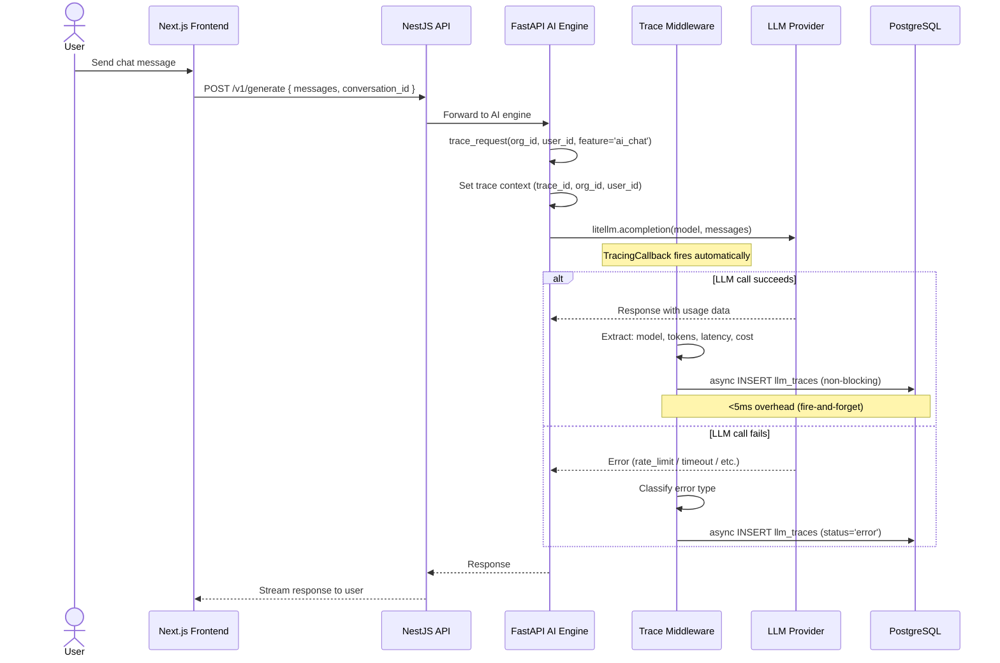
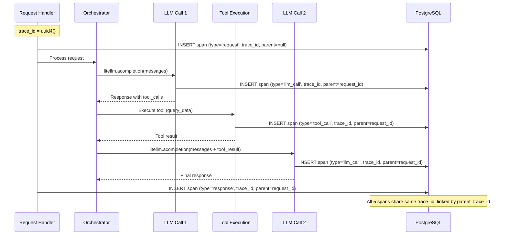
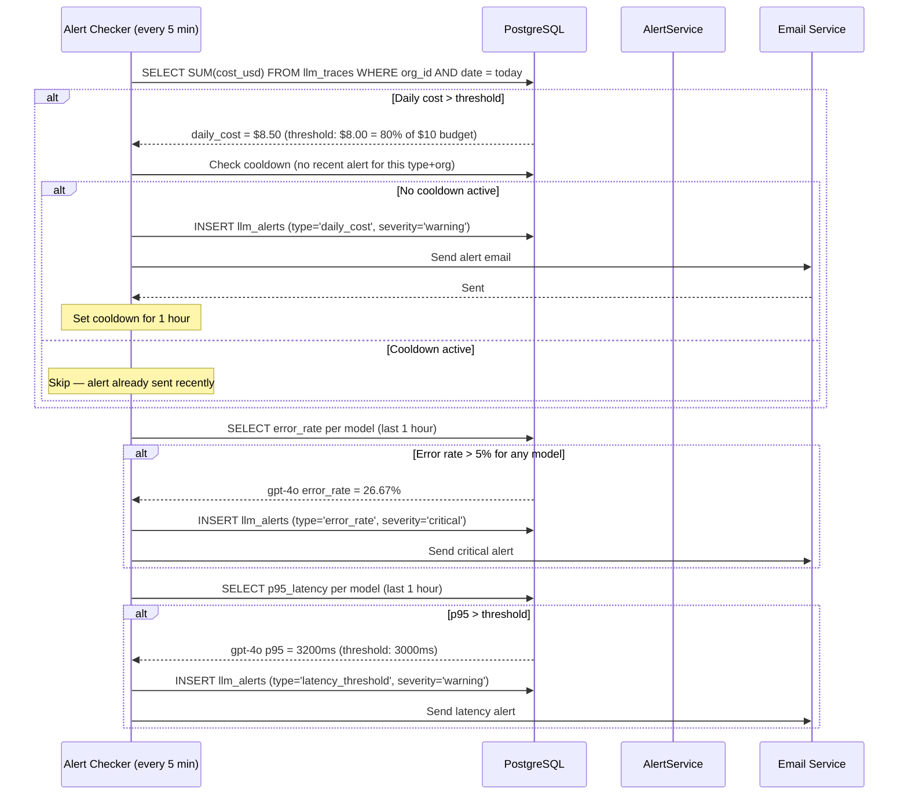
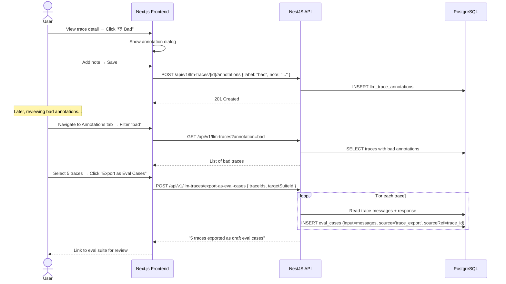
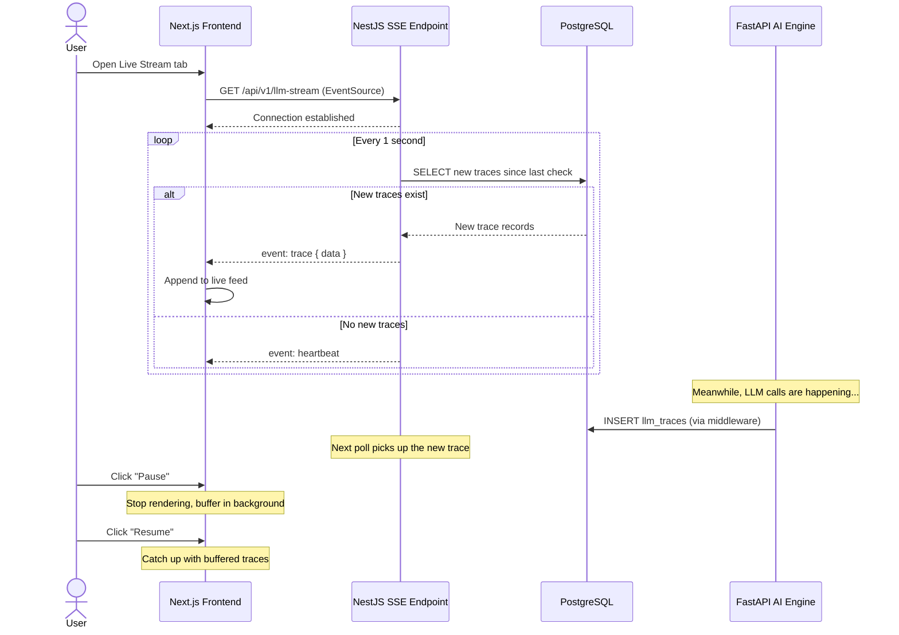

# LLM Trace Viewer — AI Observability & Tracing System

> **Purpose**: Provide built-in tracing and observability for all AI/LLM calls across the platform. Every LLM call is automatically traced end-to-end with full context — like Langfuse, but built into the uzhavu platform. Enables cost monitoring, latency analysis, error tracking, and quality annotation.
>
> **Context**: Uzhavu is a multi-tenant SaaS monorepo (Turborepo + pnpm) with NestJS API, Next.js frontend, FastAPI AI engine, and PostgreSQL. All data is scoped by `orgId`. Tracing is implemented as middleware in the AI engine that wraps every LiteLLM call.
>
> **Architecture ref**: `APP_ARCHITECTURE.md` for app manifests, `ai-engine-improvements.md` for AI engine roadmap, `eval-harness.md` for eval integration

---

## Table of Contents

1. [Requirements](#requirements)
2. [Design](#design)
3. [Tasks](#tasks)

---

# Requirements

## Story 1: Automatic Trace Collection

As a **platform operator**, I want **every LLM call to be automatically traced** so that **I have full visibility into what my AI is doing without instrumenting each call manually**.

### Acceptance Criteria

- GIVEN the AI engine receives a request WHEN any LiteLLM call is made during processing THEN a trace record is automatically created with: model, input messages, response, prompt_tokens, completion_tokens, total_tokens, latency_ms, cost_usd, status (success/error), and timestamp
- GIVEN a trace is created WHEN the LLM call includes tool_calls THEN the trace also captures: tool_name, tool_args (JSONB), and tool_result (JSONB)
- GIVEN a trace is created WHEN the LLM call fails (timeout, rate limit, content filter) THEN the trace captures: status=error, error_message, and the partial response (if any)
- GIVEN tracing middleware is active WHEN a normal LLM call completes THEN the overhead added by tracing is less than 5ms (async write to DB, non-blocking)
- GIVEN the user has not opted out of tracing WHEN any AI feature is used (chat, NL queries, eval runs) THEN all underlying LLM calls are automatically traced without any code changes required by feature developers
- GIVEN a trace is created WHEN the request originated from a specific user THEN the trace includes the `user_id` and `conversation_id` for attribution

---

## Story 2: Trace Hierarchy & Waterfall View

As a **developer debugging an AI interaction**, I want to **see the full hierarchy of operations within a request** so that **I can understand the sequence of LLM calls, tool executions, and orchestration steps**.

### Acceptance Criteria

- GIVEN a user sends a message that triggers multiple LLM calls WHEN the request is processed THEN all related traces share a common `trace_id` (UUID) and are linked via `parent_trace_id` to form a tree structure
- GIVEN a trace hierarchy exists WHEN I view it on the trace detail page THEN I see a waterfall/flame chart showing: Request (parent) → Orchestrator → LLM Call 1 → Tool Execution → LLM Call 2 → Response, with each span's duration visualized as a horizontal bar
- GIVEN the waterfall view is displayed WHEN I hover over a span THEN I see a tooltip with: span type, model, latency, tokens, cost, and status
- GIVEN the waterfall has nested spans WHEN I click on an individual span THEN a detail panel shows: full input messages, full response, tool call details (if applicable), error message (if error), and timing breakdown
- GIVEN a request has 5 LLM calls WHEN I view the waterfall THEN the total request duration is shown at the top, with each child span positioned proportionally along the timeline
- GIVEN the trace hierarchy is deep (3+ levels) WHEN I view the waterfall THEN spans are indented to show parent-child relationships, and I can collapse/expand subtrees

---

## Story 3: Trace Search & Filtering

As a **developer investigating issues**, I want to **search and filter traces by multiple criteria** so that **I can quickly find the specific interactions I'm looking for**.

### Acceptance Criteria

- GIVEN I navigate to the Trace Viewer page WHEN the page loads THEN I see a paginated table of recent traces with columns: timestamp, model, span type, latency, tokens, cost, status, and user
- GIVEN the trace list is displayed WHEN I use the search bar THEN I can search by: content within messages (full-text), user ID, conversation ID, or trace ID
- GIVEN I want to filter traces WHEN I apply filters THEN I can filter by: model (multi-select), span type (request/llm_call/tool_call/response), status (success/error), date range (picker), latency range (> X ms), cost range (> $X), tool name (if tool_call)
- GIVEN I apply a filter for "latency > 500ms" WHEN results are returned THEN only traces with latency exceeding 500ms are shown, sorted by latency descending (slowest first)
- GIVEN I apply a filter for "status = error" WHEN results are returned THEN I see all failed LLM calls with their error messages, sorted by most recent
- GIVEN I want to see traces for a specific conversation WHEN I enter a `conversation_id` in the search THEN I see all traces (including child spans) for that conversation in chronological order
- GIVEN the search returns many results WHEN paginating THEN results are paginated at 50 per page with cursor-based pagination for performance

---

## Story 4: Cost Dashboard

As a **platform administrator**, I want to **see real-time cost analytics for AI operations** so that **I can control spending and identify cost optimization opportunities**.

### Acceptance Criteria

- GIVEN I navigate to AI Settings → Cost Dashboard WHEN cost data exists THEN I see summary cards: total spend today, this week, this month, and projected monthly spend (based on daily average × remaining days)
- GIVEN the cost dashboard loads WHEN viewing cost breakdown THEN I see a grouped bar chart showing cost per model (e.g., Gemini 2.5 Flash: $2.30, GPT-4o: $8.50)
- GIVEN the cost dashboard loads WHEN viewing cost per feature THEN I see cost attribution by feature: AI Chat: $5.20, NL Queries: $2.10, Eval Runs: $1.80, Auto-Title: $0.30
- GIVEN the cost dashboard loads WHEN viewing cost per user THEN I see the top 10 users by AI cost with their total tokens, calls, and spend
- GIVEN I have budget limits configured WHEN daily spend exceeds the alert threshold (e.g., 80% of daily budget) THEN I receive an alert notification (email/in-app)
- GIVEN I want historical cost trends WHEN I view the cost timeline THEN I see a line chart of daily cost for the last 30 days with trend line and weekly averages
- GIVEN I want to export cost data WHEN I click "Export" THEN a CSV is downloaded with: date, model, feature, tokens, cost per call for the selected period

---

## Story 5: Latency Analysis

As a **performance engineer**, I want to **analyze LLM call latency patterns** so that **I can identify slow calls, compare models, and optimize response times**.

### Acceptance Criteria

- GIVEN I navigate to the Latency tab WHEN latency data exists THEN I see summary cards: p50, p95, p99 latency (in ms) for the last 24 hours, with comparison to previous 24h (↑/↓ trend)
- GIVEN the latency tab loads WHEN viewing per-model latency THEN I see a table: model name, call count, p50 latency, p95 latency, p99 latency, avg latency, with the slowest model highlighted in amber
- GIVEN the latency tab loads WHEN viewing latency distribution THEN I see a histogram showing the distribution of latency values with buckets: 0-200ms, 200-500ms, 500-1000ms, 1000-2000ms, 2000-5000ms, 5000ms+
- GIVEN a latency threshold is configured (e.g., p95 > 3000ms) WHEN the threshold is exceeded THEN a "Slow Trace" alert is created with the model, endpoint, and specific trace IDs
- GIVEN I want to compare latency across models WHEN I view the comparison chart THEN I see box plots for each model showing min, p25, median, p75, max latency
- GIVEN the latency timeline is displayed WHEN I select a time range THEN I see a line chart of p50 and p95 latency over time, with spikes highlighted

---

## Story 6: Token Analysis

As an **AI engineer**, I want to **analyze token usage patterns** so that **I can detect prompt bloat, optimize context window usage, and control costs**.

### Acceptance Criteria

- GIVEN I navigate to the Token tab WHEN token data exists THEN I see summary cards: total tokens today (input + output), average tokens per call, input/output ratio, and context window utilization %
- GIVEN the token tab loads WHEN viewing input vs output breakdown THEN I see a stacked bar chart per model showing input tokens (blue) vs output tokens (orange) over time
- GIVEN the token tab loads WHEN viewing prompt trends THEN I see a line chart of average input tokens per call over the last 30 days, with a trend line — if the trend is increasing, a warning badge says "Prompt token usage is growing — check for prompt bloat"
- GIVEN I want context window utilization WHEN viewing per-model stats THEN I see: model name, context window size, average tokens used per call, and utilization % — models consistently above 80% are flagged
- GIVEN I click on a high-token trace WHEN the detail panel opens THEN I see the full input messages with token counts per message, highlighting which messages contribute most to the token count
- GIVEN I want to find expensive calls WHEN I sort by tokens THEN I see the top 20 most expensive calls (by total tokens) with their input preview, model, and cost

---

## Story 7: Error Tracking

As a **DevOps engineer**, I want to **track and categorize LLM-specific errors** so that **I can quickly identify and resolve AI service issues**.

### Acceptance Criteria

- GIVEN I navigate to the Errors tab WHEN errors exist THEN I see summary cards: total errors today, error rate % (errors / total calls), and top error type
- GIVEN the errors tab loads WHEN viewing error breakdown THEN I see errors categorized by type: rate_limit, timeout, content_filter, invalid_tool_call, model_unavailable, context_length_exceeded, invalid_response, with count and percentage per type
- GIVEN the errors tab loads WHEN viewing error rate per model THEN I see a table: model name, total calls, error count, error rate %, with models exceeding 5% error rate highlighted in red
- GIVEN I view an error trace WHEN I click on it THEN I see: error type, error message, the request that caused it (input messages), model, timestamp, and suggested remediation
- GIVEN a model's error rate exceeds 5% within a 1-hour window WHEN the threshold is breached THEN an alert is created: "Model {model} error rate is {rate}% — {count} errors in the last hour"
- GIVEN errors are related to rate limiting WHEN viewing rate limit errors THEN I see: which model, time of day pattern, suggested action ("Consider adding a fallback model" or "Implement request queuing")
- GIVEN the error timeline is displayed WHEN I view it THEN I see a bar chart of errors per hour over the last 24 hours, colored by error type

---

## Story 8: Trace Annotations

As a **quality reviewer**, I want to **annotate traces as good, bad, or needs-review** so that **I can build a feedback loop and export bad traces as eval cases**.

### Acceptance Criteria

- GIVEN I am viewing a trace detail WHEN I want to annotate it THEN I see annotation buttons: 👍 Good, 👎 Bad, 🔍 Needs Review
- GIVEN I click "Bad" WHEN the annotation dialog appears THEN I can add an optional note explaining why (e.g., "Incorrect SQL generated — used wrong table name")
- GIVEN a trace is annotated as "Bad" WHEN I view annotated traces THEN I can filter by annotation label (good/bad/review) across all traces
- GIVEN a trace is annotated WHEN I view the annotation THEN I see: label, note, annotated by (user name), and annotated at (timestamp)
- GIVEN I have multiple "Bad" annotations WHEN I click "Export as Eval Cases" THEN the system creates draft eval cases from the annotated traces (input → test case input, actual output → reference for review) in the specified eval suite (links to eval-harness)
- GIVEN I want to review annotations WHEN I navigate to the Annotations tab THEN I see a table: trace preview, label, note, annotated by, date, with filters by label
- GIVEN multiple users can annotate WHEN two users annotate the same trace THEN both annotations are preserved (a trace can have multiple annotations)

---

## Story 9: Live Trace Stream

As a **developer debugging in real-time**, I want to **see traces as they happen in a live feed** so that **I can monitor AI behavior during testing and troubleshooting**.

### Acceptance Criteria

- GIVEN I navigate to the Live Stream tab WHEN new LLM calls are made THEN traces appear in the feed within 2 seconds of completion (real-time via SSE/WebSocket)
- GIVEN the live stream is active WHEN I apply a filter (model, user, status) THEN only matching traces appear in the real-time feed
- GIVEN the live stream is showing traces WHEN I see an interesting trace THEN I can click it to open the full trace detail in a side panel without stopping the stream
- GIVEN the live stream has been running WHEN I scroll up THEN I can review past traces that scrolled by, with a "Jump to live" button to return to the latest
- GIVEN the live stream receives high volume WHEN more than 50 traces per second are generated THEN the UI batches them (shows count badge "23 new traces") and loads them on scroll-up to prevent UI lag
- GIVEN I want to pause the stream WHEN I click "Pause" THEN the stream stops updating (traces are still collected server-side), and I can resume with "Resume" to catch up

---

## Story 10: Alerts & Budgets

As a **platform administrator**, I want to **configure alerts for cost, latency, and error conditions** so that **I am proactively notified when something goes wrong with my AI operations**.

### Acceptance Criteria

- GIVEN I navigate to AI Settings → Alerts WHEN I click "New Alert" THEN I see alert type options: error_rate, latency_threshold, daily_cost, monthly_cost, model_failure, with configuration fields per type
- GIVEN I create an "error rate > 5%" alert WHEN the error rate exceeds 5% in a 1-hour window THEN an alert is fired with: severity (warning/critical), message, affected model, and link to error traces
- GIVEN I create a "p95 latency > 3000ms" alert WHEN the p95 latency exceeds 3s for any model THEN an alert is fired with the model name, current p95, and sample slow trace IDs
- GIVEN I create a "daily cost > $10" alert WHEN today's cumulative cost exceeds $10 THEN an alert is fired with: current spend, budget, percentage, and top-cost models/features
- GIVEN an alert is fired WHEN I view the Alerts page THEN I see the alert with: type, severity, message, timestamp, trace link (if applicable), and an "Acknowledge" button
- GIVEN I acknowledge an alert WHEN the same condition persists THEN the alert is not re-fired for 1 hour (cooldown period) to prevent alert fatigue
- GIVEN I configure a monthly cost budget WHEN I set $50/month THEN the system calculates the daily budget ($50/30 = $1.67/day) and projects monthly spend, alerting at configurable threshold (default: 80%)
- GIVEN I want budget visibility WHEN I view the budget panel THEN I see: daily budget, monthly budget, current daily spend, current monthly spend, projected monthly spend, and a progress bar with threshold markers

---

# Design

## Architecture Overview

```
┌──────────────────────────────────────────────────────────────────────────┐
│                     LLM TRACE VIEWER SYSTEM                              │
│                                                                          │
│  ┌───────────────┐   ┌────────────────┐   ┌──────────────────────────┐  │
│  │  Next.js UI    │   │  NestJS API    │   │  FastAPI AI Engine       │  │
│  │               │   │                │   │                          │  │
│  │  Trace List   │   │  /llm-traces   │   │  Trace Middleware        │  │
│  │  Waterfall    │◀──│  /llm-costs    │   │  ├─ LiteLLM callback     │  │
│  │  Cost Dash    │   │  /llm-alerts   │   │  ├─ Span collector       │  │
│  │  Live Stream  │   │  /llm-stream   │──▶│  ├─ Cost calculator      │  │
│  │  Annotations  │   │               │   │  └─ Async DB writer       │  │
│  └───────────────┘   └────────────────┘   └──────────────────────────┘  │
│         │                    │                        │                   │
│         │            ┌──────┴────────────────────────┘                   │
│         │            │                                                    │
│         │            ▼                                                    │
│         │     ┌─────────────┐                                            │
│         └────▶│ PostgreSQL   │                                            │
│               │ ├─ llm_      │                                            │
│               │ │  traces    │                                            │
│               │ ├─ llm_trace │                                            │
│               │ │  annotations│                                           │
│               │ ├─ llm_cost  │                                            │
│               │ │  budgets   │                                            │
│               │ └─ llm_      │                                            │
│               │    alerts    │                                            │
│               └─────────────┘                                            │
└──────────────────────────────────────────────────────────────────────────┘
```

### Key Design Decisions

1. **Trace collection via LiteLLM callback** — LiteLLM supports custom callbacks. The tracing middleware registers a callback that fires on every `completion()` and `acompletion()` call. No manual instrumentation needed — any code that uses LiteLLM is automatically traced.
2. **Async, non-blocking writes** — Trace data is written to PostgreSQL asynchronously via a background task queue (Python `asyncio.create_task`). The LLM call returns immediately; the trace write happens in the background. This ensures tracing adds <5ms overhead.
3. **Hierarchical spans via trace_id + parent_trace_id** — Each request generates a unique `trace_id`. All LLM calls and tool executions within that request share the `trace_id` and are linked via `parent_trace_id`. This creates a tree structure visualized as a waterfall.
4. **Cost calculation at write time** — Cost is calculated immediately when the trace is written, using a model cost lookup table. This avoids expensive aggregation queries later. The lookup table is the same one used by the eval harness.
5. **NestJS serves the dashboard API, Python collects traces** — The FastAPI AI engine is responsible for trace collection (it's where LLM calls happen). The NestJS API is responsible for serving trace data to the frontend (search, filtering, dashboard, alerts). They share the same PostgreSQL tables.
6. **JSONB for flexible trace data** — Messages, response, tool_args, tool_result, and metadata are stored as JSONB. This accommodates varying LLM response formats without schema changes. Indexed with GIN indexes for search.
7. **Data retention with auto-cleanup** — A scheduled job deletes traces older than the plan's retention period. This prevents unbounded storage growth. Annotated traces are exempt from cleanup.
8. **Live stream via Server-Sent Events (SSE)** — The live trace feed uses SSE from the NestJS API, which polls for new traces every 1 second. The AI engine notifies the NestJS API of new traces via an internal webhook (or the NestJS API polls the DB).

---

## Data Models

### SQL Schema

```sql
-- ============================================================
-- LLM Traces (every LLM call, tool call, and orchestration step)
-- ============================================================
CREATE TABLE llm_traces (
  id              TEXT PRIMARY KEY DEFAULT gen_random_uuid()::text,
  org_id          TEXT NOT NULL,

  -- Hierarchy
  trace_id        UUID NOT NULL,                         -- Groups all spans in a single request
  parent_trace_id TEXT,                                  -- References parent span's id (not trace_id)
  span_type       TEXT NOT NULL                          -- 'request', 'llm_call', 'tool_call', 'response'
                  CHECK (span_type IN ('request', 'llm_call', 'tool_call', 'response')),

  -- LLM details
  model           TEXT,                                  -- e.g., 'gemini-2.5-flash', 'gpt-4o-mini'
  messages        JSONB,                                 -- Input messages array [{ role, content }]
  response        JSONB,                                 -- LLM response { content, tool_calls, finish_reason }
  system_prompt   TEXT,                                  -- System prompt (extracted for easy viewing)

  -- Tool call details (only for span_type = 'tool_call')
  tool_name       TEXT,                                  -- e.g., 'query_data', 'web_search', 'gmail'
  tool_args       JSONB,                                 -- Arguments passed to the tool
  tool_result     JSONB,                                 -- Result returned by the tool

  -- Token usage
  prompt_tokens   INT,
  completion_tokens INT,
  total_tokens    INT,
  cost_usd        DECIMAL(10,6),                         -- Calculated at write time

  -- Performance
  latency_ms      INT,                                   -- Total time for this span
  time_to_first_token_ms INT,                            -- TTFT for streaming calls

  -- Status
  status          TEXT NOT NULL DEFAULT 'success'        -- 'success', 'error'
                  CHECK (status IN ('success', 'error')),
  error_type      TEXT,                                  -- 'rate_limit', 'timeout', 'content_filter', 'context_length', 'invalid_tool_call', 'model_unavailable', 'unknown'
  error_message   TEXT,

  -- Attribution
  user_id         TEXT,
  conversation_id TEXT,
  feature         TEXT,                                  -- 'ai_chat', 'nl_query', 'eval_run', 'auto_title', etc.

  -- Metadata
  metadata        JSONB DEFAULT '{}',                   -- Flexible metadata: { prompt_version, eval_run_id, ... }

  created_at      TIMESTAMPTZ NOT NULL DEFAULT NOW()
);

CREATE INDEX idx_lt_org_created ON llm_traces(org_id, created_at DESC);
CREATE INDEX idx_lt_trace ON llm_traces(trace_id);
CREATE INDEX idx_lt_parent ON llm_traces(parent_trace_id) WHERE parent_trace_id IS NOT NULL;
CREATE INDEX idx_lt_org_model ON llm_traces(org_id, model, created_at DESC);
CREATE INDEX idx_lt_org_status ON llm_traces(org_id, status, created_at DESC) WHERE status = 'error';
CREATE INDEX idx_lt_org_user ON llm_traces(org_id, user_id, created_at DESC) WHERE user_id IS NOT NULL;
CREATE INDEX idx_lt_org_conv ON llm_traces(org_id, conversation_id) WHERE conversation_id IS NOT NULL;
CREATE INDEX idx_lt_org_feature ON llm_traces(org_id, feature, created_at DESC);
CREATE INDEX idx_lt_cost ON llm_traces(org_id, cost_usd DESC) WHERE cost_usd > 0;
CREATE INDEX idx_lt_latency ON llm_traces(org_id, latency_ms DESC);
CREATE INDEX idx_lt_messages ON llm_traces USING GIN(messages jsonb_path_ops);

-- ============================================================
-- LLM Trace Annotations (quality feedback on traces)
-- ============================================================
CREATE TABLE llm_trace_annotations (
  id              TEXT PRIMARY KEY DEFAULT gen_random_uuid()::text,
  trace_id        TEXT NOT NULL REFERENCES llm_traces(id) ON DELETE CASCADE,
  label           TEXT NOT NULL                          -- 'good', 'bad', 'review'
                  CHECK (label IN ('good', 'bad', 'review')),
  note            TEXT,                                  -- Optional explanation
  annotated_by    TEXT NOT NULL,                         -- User ID who annotated
  created_at      TIMESTAMPTZ NOT NULL DEFAULT NOW()
);

CREATE INDEX idx_lta_trace ON llm_trace_annotations(trace_id);
CREATE INDEX idx_lta_label ON llm_trace_annotations(label, created_at DESC);

-- ============================================================
-- LLM Cost Budgets (per-org spending limits)
-- ============================================================
CREATE TABLE llm_cost_budgets (
  id                  TEXT PRIMARY KEY DEFAULT gen_random_uuid()::text,
  org_id              TEXT NOT NULL UNIQUE,               -- One budget per org
  daily_budget_usd    DECIMAL(10,2),                     -- e.g., 10.00
  monthly_budget_usd  DECIMAL(10,2),                     -- e.g., 300.00
  alert_threshold_pct INT NOT NULL DEFAULT 80            -- Alert at this % of budget
                      CHECK (alert_threshold_pct BETWEEN 1 AND 100),
  alert_channel       TEXT NOT NULL DEFAULT 'email'      -- 'email', 'webhook', 'both'
                      CHECK (alert_channel IN ('email', 'webhook', 'both')),
  webhook_url         TEXT,                              -- Webhook URL if alert_channel includes webhook
  is_active           BOOLEAN NOT NULL DEFAULT true,

  created_at          TIMESTAMPTZ NOT NULL DEFAULT NOW(),
  updated_at          TIMESTAMPTZ NOT NULL DEFAULT NOW()
);

CREATE UNIQUE INDEX idx_lcb_org ON llm_cost_budgets(org_id);

-- ============================================================
-- LLM Alerts (triggered notifications)
-- ============================================================
CREATE TABLE llm_alerts (
  id              TEXT PRIMARY KEY DEFAULT gen_random_uuid()::text,
  org_id          TEXT NOT NULL,
  alert_type      TEXT NOT NULL                          -- 'error_rate', 'latency_threshold', 'daily_cost', 'monthly_cost', 'model_failure'
                  CHECK (alert_type IN ('error_rate', 'latency_threshold', 'daily_cost', 'monthly_cost', 'model_failure')),
  severity        TEXT NOT NULL DEFAULT 'warning'        -- 'warning', 'critical'
                  CHECK (severity IN ('warning', 'critical')),
  message         TEXT NOT NULL,                         -- Human-readable alert message
  details         JSONB DEFAULT '{}',                   -- Alert-specific data: { model, error_rate, threshold, trace_ids, ... }
  trace_id        TEXT,                                  -- Link to specific trace (if applicable)
  acknowledged    BOOLEAN NOT NULL DEFAULT false,
  acknowledged_by TEXT,                                  -- User who acknowledged
  acknowledged_at TIMESTAMPTZ,
  cooldown_until  TIMESTAMPTZ,                          -- Don't re-fire until this time
  created_at      TIMESTAMPTZ NOT NULL DEFAULT NOW()
);

CREATE INDEX idx_la_org ON llm_alerts(org_id, created_at DESC);
CREATE INDEX idx_la_org_unack ON llm_alerts(org_id, acknowledged, created_at DESC) WHERE acknowledged = false;
CREATE INDEX idx_la_type ON llm_alerts(alert_type, created_at DESC);
```

### Prisma Schema Additions

```prisma
model LlmTrace {
  id                  String    @id @default(uuid())
  orgId               String    @map("org_id")
  traceId             String    @map("trace_id") @db.Uuid
  parentTraceId       String?   @map("parent_trace_id")
  spanType            String    @map("span_type")
  model               String?
  messages            Json?
  response            Json?
  systemPrompt        String?   @map("system_prompt")
  toolName            String?   @map("tool_name")
  toolArgs            Json?     @map("tool_args")
  toolResult          Json?     @map("tool_result")
  promptTokens        Int?      @map("prompt_tokens")
  completionTokens    Int?      @map("completion_tokens")
  totalTokens         Int?      @map("total_tokens")
  costUsd             Decimal?  @map("cost_usd") @db.Decimal(10, 6)
  latencyMs           Int?      @map("latency_ms")
  timeToFirstTokenMs  Int?      @map("time_to_first_token_ms")
  status              String    @default("success")
  errorType           String?   @map("error_type")
  errorMessage        String?   @map("error_message")
  userId              String?   @map("user_id")
  conversationId      String?   @map("conversation_id")
  feature             String?
  metadata            Json      @default("{}") @map("metadata")
  createdAt           DateTime  @default(now()) @map("created_at")

  annotations LlmTraceAnnotation[]

  @@index([orgId, createdAt(sort: Desc)])
  @@index([traceId])
  @@index([orgId, model, createdAt(sort: Desc)])
  @@index([orgId, feature, createdAt(sort: Desc)])
  @@map("llm_traces")
}

model LlmTraceAnnotation {
  id          String   @id @default(uuid())
  traceId     String   @map("trace_id")
  label       String
  note        String?
  annotatedBy String   @map("annotated_by")
  createdAt   DateTime @default(now()) @map("created_at")

  trace LlmTrace @relation(fields: [traceId], references: [id], onDelete: Cascade)

  @@index([traceId])
  @@index([label, createdAt(sort: Desc)])
  @@map("llm_trace_annotations")
}

model LlmCostBudget {
  id                String   @id @default(uuid())
  orgId             String   @unique @map("org_id")
  dailyBudgetUsd    Decimal? @map("daily_budget_usd") @db.Decimal(10, 2)
  monthlyBudgetUsd  Decimal? @map("monthly_budget_usd") @db.Decimal(10, 2)
  alertThresholdPct Int      @default(80) @map("alert_threshold_pct")
  alertChannel      String   @default("email") @map("alert_channel")
  webhookUrl        String?  @map("webhook_url")
  isActive          Boolean  @default(true) @map("is_active")
  createdAt         DateTime @default(now()) @map("created_at")
  updatedAt         DateTime @updatedAt @map("updated_at")

  @@map("llm_cost_budgets")
}

model LlmAlert {
  id             String    @id @default(uuid())
  orgId          String    @map("org_id")
  alertType      String    @map("alert_type")
  severity       String    @default("warning")
  message        String
  details        Json      @default("{}") @map("details")
  traceId        String?   @map("trace_id")
  acknowledged   Boolean   @default(false)
  acknowledgedBy String?   @map("acknowledged_by")
  acknowledgedAt DateTime? @map("acknowledged_at")
  cooldownUntil  DateTime? @map("cooldown_until")
  createdAt      DateTime  @default(now()) @map("created_at")

  @@index([orgId, createdAt(sort: Desc)])
  @@index([alertType, createdAt(sort: Desc)])
  @@map("llm_alerts")
}
```

---

## Trace Middleware Implementation

The trace middleware wraps every LiteLLM call in the AI engine:

```python
# ai-engine/app/middleware/tracing.py

import asyncio
import time
import uuid
from contextvars import ContextVar
from decimal import Decimal

import litellm
from app.storage.database import get_db

# Context variables for trace hierarchy
current_trace_id: ContextVar[str] = ContextVar('current_trace_id')
current_parent_id: ContextVar[str | None] = ContextVar('current_parent_id', default=None)
current_org_id: ContextVar[str] = ContextVar('current_org_id')
current_user_id: ContextVar[str | None] = ContextVar('current_user_id', default=None)
current_conversation_id: ContextVar[str | None] = ContextVar('current_conversation_id', default=None)
current_feature: ContextVar[str | None] = ContextVar('current_feature', default=None)

# Model cost lookup (same as eval-harness)
MODEL_COSTS_PER_1K = {
    'gemini-2.5-flash':    {'input': 0.00015, 'output': 0.0006},
    'gemini-2.5-pro':      {'input': 0.00125, 'output': 0.005},
    'gpt-4o-mini':         {'input': 0.00015, 'output': 0.0006},
    'gpt-4o':              {'input': 0.0025,  'output': 0.01},
    'claude-3.5-haiku':    {'input': 0.0008,  'output': 0.004},
    'claude-3.5-sonnet':   {'input': 0.003,   'output': 0.015},
    'deepseek-chat':       {'input': 0.00014, 'output': 0.00028},
}


def calculate_cost(model: str, prompt_tokens: int, completion_tokens: int) -> Decimal:
    costs = MODEL_COSTS_PER_1K.get(model, {'input': 0.001, 'output': 0.002})
    return Decimal(str(
        (prompt_tokens / 1000) * costs['input'] +
        (completion_tokens / 1000) * costs['output']
    ))


class TracingCallback(litellm.Callback):
    """LiteLLM callback that automatically traces every LLM call."""

    async def async_log_success_event(self, kwargs, response_obj, start_time, end_time):
        """Called after every successful LLM call."""
        try:
            latency_ms = int((end_time - start_time).total_seconds() * 1000)
            usage = response_obj.get('usage', {})
            prompt_tokens = usage.get('prompt_tokens', 0)
            completion_tokens = usage.get('completion_tokens', 0)
            total_tokens = usage.get('total_tokens', 0)
            model = kwargs.get('model', 'unknown')

            trace_data = {
                'org_id': current_org_id.get(''),
                'trace_id': current_trace_id.get(str(uuid.uuid4())),
                'parent_trace_id': current_parent_id.get(None),
                'span_type': 'llm_call',
                'model': model,
                'messages': kwargs.get('messages', []),
                'response': {
                    'content': response_obj.get('choices', [{}])[0].get('message', {}).get('content'),
                    'tool_calls': response_obj.get('choices', [{}])[0].get('message', {}).get('tool_calls'),
                    'finish_reason': response_obj.get('choices', [{}])[0].get('finish_reason'),
                },
                'prompt_tokens': prompt_tokens,
                'completion_tokens': completion_tokens,
                'total_tokens': total_tokens,
                'cost_usd': float(calculate_cost(model, prompt_tokens, completion_tokens)),
                'latency_ms': latency_ms,
                'status': 'success',
                'user_id': current_user_id.get(None),
                'conversation_id': current_conversation_id.get(None),
                'feature': current_feature.get(None),
                'metadata': kwargs.get('metadata', {}),
            }

            # Async, non-blocking write
            asyncio.create_task(_write_trace(trace_data))

        except Exception as e:
            # Never let tracing errors affect the main flow
            import logging
            logging.error(f"Tracing error: {e}")

    async def async_log_failure_event(self, kwargs, response_obj, start_time, end_time):
        """Called after every failed LLM call."""
        try:
            latency_ms = int((end_time - start_time).total_seconds() * 1000)
            error = kwargs.get('exception', '')
            error_type = _classify_error(str(error))

            trace_data = {
                'org_id': current_org_id.get(''),
                'trace_id': current_trace_id.get(str(uuid.uuid4())),
                'parent_trace_id': current_parent_id.get(None),
                'span_type': 'llm_call',
                'model': kwargs.get('model', 'unknown'),
                'messages': kwargs.get('messages', []),
                'response': None,
                'prompt_tokens': 0,
                'completion_tokens': 0,
                'total_tokens': 0,
                'cost_usd': 0,
                'latency_ms': latency_ms,
                'status': 'error',
                'error_type': error_type,
                'error_message': str(error)[:2000],  # Truncate long errors
                'user_id': current_user_id.get(None),
                'conversation_id': current_conversation_id.get(None),
                'feature': current_feature.get(None),
                'metadata': kwargs.get('metadata', {}),
            }

            asyncio.create_task(_write_trace(trace_data))

        except Exception as e:
            import logging
            logging.error(f"Tracing error on failure: {e}")


def _classify_error(error_str: str) -> str:
    """Classify LLM errors into categories."""
    error_lower = error_str.lower()
    if 'rate limit' in error_lower or '429' in error_lower:
        return 'rate_limit'
    elif 'timeout' in error_lower or 'timed out' in error_lower:
        return 'timeout'
    elif 'content filter' in error_lower or 'content_policy' in error_lower:
        return 'content_filter'
    elif 'context length' in error_lower or 'max.*token' in error_lower:
        return 'context_length'
    elif 'tool' in error_lower and 'invalid' in error_lower:
        return 'invalid_tool_call'
    elif 'model' in error_lower and ('not found' in error_lower or 'unavailable' in error_lower):
        return 'model_unavailable'
    else:
        return 'unknown'


async def _write_trace(trace_data: dict):
    """Write trace to PostgreSQL asynchronously."""
    db = await get_db()
    await db.execute(
        """
        INSERT INTO llm_traces (
            org_id, trace_id, parent_trace_id, span_type, model,
            messages, response, prompt_tokens, completion_tokens, total_tokens,
            cost_usd, latency_ms, status, error_type, error_message,
            user_id, conversation_id, feature, metadata
        ) VALUES (
            $1, $2, $3, $4, $5,
            $6, $7, $8, $9, $10,
            $11, $12, $13, $14, $15,
            $16, $17, $18, $19
        )
        """,
        *trace_data.values()
    )


# Register the callback globally
litellm.callbacks = [TracingCallback()]
```

### Trace Context Manager

```python
# ai-engine/app/middleware/trace_context.py

import uuid
from contextlib import asynccontextmanager
from .tracing import current_trace_id, current_parent_id, current_org_id, current_user_id, current_conversation_id, current_feature


@asynccontextmanager
async def trace_request(org_id: str, user_id: str = None, conversation_id: str = None, feature: str = None):
    """Context manager to set trace context for a request."""
    trace_id = str(uuid.uuid4())
    token_trace = current_trace_id.set(trace_id)
    token_org = current_org_id.set(org_id)
    token_user = current_user_id.set(user_id)
    token_conv = current_conversation_id.set(conversation_id)
    token_feature = current_feature.set(feature)

    try:
        yield trace_id
    finally:
        current_trace_id.reset(token_trace)
        current_org_id.reset(token_org)
        current_user_id.reset(token_user)
        current_conversation_id.reset(token_conv)
        current_feature.reset(token_feature)


@asynccontextmanager
async def trace_span(parent_id: str):
    """Context manager to create a child span."""
    token = current_parent_id.set(parent_id)
    try:
        yield
    finally:
        current_parent_id.reset(token)
```

### Usage in AI Engine

```python
# ai-engine/app/api/chat.py (modified to use tracing)

from app.middleware.trace_context import trace_request

@router.post("/v1/generate")
async def generate(request: GenerateRequest):
    async with trace_request(
        org_id=request.org_id,
        user_id=request.user_id,
        conversation_id=request.conversation_id,
        feature='ai_chat'
    ) as trace_id:
        # All LiteLLM calls within this context are automatically traced
        result = await orchestrator.process(request.messages, request.model)
        return {"result": result, "trace_id": trace_id}
```

---

## API Contracts

### Base Path: `/api/v1/llm-traces`

---

### GET `/api/v1/llm-traces`

**List and search traces with filtering.**

**Headers:**
```
Authorization: Bearer <token>
x-product-id: uzhavu
```

**Query Parameters:**
| Param | Type | Required | Description |
|:------|:-----|:---------|:------------|
| `model` | string | No | Filter by model name (supports comma-separated for multi-select) |
| `spanType` | string | No | Filter by span type: request, llm_call, tool_call, response |
| `status` | string | No | Filter by status: success, error |
| `feature` | string | No | Filter by feature: ai_chat, nl_query, eval_run |
| `userId` | string | No | Filter by user ID |
| `conversationId` | string | No | Filter by conversation ID |
| `traceId` | string | No | Filter by trace group ID |
| `minLatencyMs` | int | No | Minimum latency filter |
| `maxLatencyMs` | int | No | Maximum latency filter |
| `minCostUsd` | number | No | Minimum cost filter |
| `errorType` | string | No | Filter by error type |
| `toolName` | string | No | Filter by tool name |
| `search` | string | No | Full-text search in messages |
| `startDate` | ISO8601 | No | Start of date range |
| `endDate` | ISO8601 | No | End of date range |
| `limit` | int | No | Results per page (default: 50, max: 100) |
| `cursor` | string | No | Cursor for pagination (trace ID) |

**Response: `200 OK`**
```json
{
  "data": [
    {
      "id": "lt_001",
      "traceId": "550e8400-e29b-41d4-a716-446655440000",
      "parentTraceId": null,
      "spanType": "llm_call",
      "model": "gemini-2.5-flash",
      "messagePreview": "Show me all unpaid invoices...",
      "responsePreview": "SELECT i.invoice_number AS...",
      "promptTokens": 850,
      "completionTokens": 120,
      "totalTokens": 970,
      "costUsd": 0.000200,
      "latencyMs": 340,
      "status": "success",
      "userId": "user_456",
      "feature": "nl_query",
      "hasAnnotations": false,
      "childCount": 2,
      "createdAt": "2026-07-05T12:00:00Z"
    }
  ],
  "meta": {
    "total": 1234,
    "limit": 50,
    "nextCursor": "lt_051",
    "filters": {
      "models": ["gemini-2.5-flash", "gpt-4o-mini", "gpt-4o"],
      "features": ["ai_chat", "nl_query", "eval_run"],
      "errorTypes": ["rate_limit", "timeout", "content_filter"]
    }
  }
}
```

---

### GET `/api/v1/llm-traces/:traceId`

**Get a single trace with full details.**

**Response: `200 OK`**
```json
{
  "data": {
    "id": "lt_001",
    "traceId": "550e8400-e29b-41d4-a716-446655440000",
    "parentTraceId": null,
    "spanType": "llm_call",
    "model": "gemini-2.5-flash",
    "messages": [
      { "role": "system", "content": "You are a SQL expert..." },
      { "role": "user", "content": "Show me all unpaid invoices from last month" }
    ],
    "response": {
      "content": "SELECT i.invoice_number AS \"Invoice #\"...",
      "tool_calls": null,
      "finish_reason": "stop"
    },
    "systemPrompt": "You are a SQL expert...",
    "promptTokens": 850,
    "completionTokens": 120,
    "totalTokens": 970,
    "costUsd": 0.000200,
    "latencyMs": 340,
    "timeToFirstTokenMs": 180,
    "status": "success",
    "userId": "user_456",
    "conversationId": "conv_abc123",
    "feature": "nl_query",
    "metadata": { "prompt_version": "v2.1" },
    "annotations": [
      {
        "id": "lta_001",
        "label": "good",
        "note": "Correctly generated the SQL with proper date filtering",
        "annotatedBy": "user_456",
        "createdAt": "2026-07-05T14:00:00Z"
      }
    ],
    "children": [
      {
        "id": "lt_002",
        "spanType": "tool_call",
        "toolName": "query_data",
        "latencyMs": 45,
        "status": "success"
      }
    ],
    "createdAt": "2026-07-05T12:00:00Z"
  }
}
```

---

### GET `/api/v1/llm-traces/waterfall/:traceGroupId`

**Get the full trace hierarchy for a request (waterfall view).**

**Response: `200 OK`**
```json
{
  "data": {
    "traceId": "550e8400-e29b-41d4-a716-446655440000",
    "totalDurationMs": 890,
    "totalTokens": 2340,
    "totalCostUsd": 0.000567,
    "spans": [
      {
        "id": "lt_req",
        "spanType": "request",
        "label": "POST /v1/generate",
        "startMs": 0,
        "durationMs": 890,
        "children": [
          {
            "id": "lt_001",
            "spanType": "llm_call",
            "label": "gemini-2.5-flash",
            "model": "gemini-2.5-flash",
            "startMs": 5,
            "durationMs": 340,
            "tokens": 970,
            "cost": 0.000200,
            "status": "success",
            "children": []
          },
          {
            "id": "lt_002",
            "spanType": "tool_call",
            "label": "query_data",
            "toolName": "query_data",
            "startMs": 350,
            "durationMs": 45,
            "status": "success",
            "children": []
          },
          {
            "id": "lt_003",
            "spanType": "llm_call",
            "label": "gemini-2.5-flash (summary)",
            "model": "gemini-2.5-flash",
            "startMs": 400,
            "durationMs": 280,
            "tokens": 1370,
            "cost": 0.000367,
            "status": "success",
            "children": []
          }
        ]
      }
    ]
  }
}
```

---

### POST `/api/v1/llm-traces/:traceId/annotations`

**Annotate a trace.**

**Request Body:**
```json
{
  "label": "bad",
  "note": "Generated SQL referenced non-existent column 'payment_status' instead of 'status'"
}
```

**Response: `201 Created`**
```json
{
  "data": {
    "id": "lta_002",
    "traceId": "lt_001",
    "label": "bad",
    "note": "Generated SQL referenced non-existent column 'payment_status' instead of 'status'",
    "annotatedBy": "user_456",
    "createdAt": "2026-07-05T14:30:00Z"
  }
}
```

---

### POST `/api/v1/llm-traces/export-as-eval-cases`

**Export annotated traces as eval cases.**

**Request Body:**
```json
{
  "traceIds": ["lt_001", "lt_005", "lt_012"],
  "targetSuiteId": "es_abc123",
  "scoringType": "contains"
}
```

**Response: `201 Created`**
```json
{
  "data": {
    "exported": 3,
    "evalCases": [
      {
        "id": "ec_new_001",
        "suiteId": "es_abc123",
        "inputMessages": [{ "role": "user", "content": "Show me all unpaid invoices..." }],
        "expectedOutput": null,
        "scoringType": "contains",
        "source": "trace_export",
        "sourceRef": "lt_001"
      }
    ],
    "message": "3 traces exported as draft eval cases. Review and set expected outputs."
  }
}
```

---

### Base Path: `/api/v1/llm-costs`

---

### GET `/api/v1/llm-costs/summary`

**Get cost summary and breakdown.**

**Query Parameters:**
| Param | Type | Required | Description |
|:------|:-----|:---------|:------------|
| `days` | int | No | Time range in days (default: 30, max: 90) |

**Response: `200 OK`**
```json
{
  "data": {
    "summary": {
      "today": 3.45,
      "thisWeek": 18.72,
      "thisMonth": 67.89,
      "projectedMonthly": 89.50
    },
    "byModel": [
      { "model": "gemini-2.5-flash", "cost": 12.30, "calls": 8200, "tokens": 9800000 },
      { "model": "gpt-4o-mini", "cost": 8.50, "calls": 3100, "tokens": 5200000 },
      { "model": "gpt-4o", "cost": 42.10, "calls": 450, "tokens": 2100000 }
    ],
    "byFeature": [
      { "feature": "ai_chat", "cost": 38.20, "calls": 5800, "pct": 56.3 },
      { "feature": "nl_query", "cost": 15.60, "calls": 3200, "pct": 23.0 },
      { "feature": "eval_run", "cost": 10.80, "calls": 2100, "pct": 15.9 },
      { "feature": "auto_title", "cost": 3.29, "calls": 650, "pct": 4.8 }
    ],
    "byUser": [
      { "userId": "user_456", "userName": "Rajan", "cost": 28.50, "calls": 4200 },
      { "userId": "user_789", "userName": "Kumar", "cost": 15.30, "calls": 2800 }
    ],
    "dailyTimeline": [
      { "date": "2026-07-01", "cost": 2.10 },
      { "date": "2026-07-02", "cost": 2.45 },
      { "date": "2026-07-03", "cost": 3.12 },
      { "date": "2026-07-04", "cost": 1.80 },
      { "date": "2026-07-05", "cost": 3.45 }
    ],
    "budget": {
      "dailyBudget": 10.00,
      "monthlyBudget": 300.00,
      "dailyUsedPct": 34.5,
      "monthlyUsedPct": 22.6,
      "alertThreshold": 80
    }
  }
}
```

---

### GET `/api/v1/llm-costs/export`

**Export cost data as CSV.**

**Query Parameters:**
| Param | Type | Required | Description |
|:------|:-----|:---------|:------------|
| `startDate` | ISO8601 | Yes | Start of export range |
| `endDate` | ISO8601 | Yes | End of export range |
| `groupBy` | string | No | Group by: day, model, feature, user (default: day) |

**Response: `200 OK` (text/csv)**
```csv
date,model,feature,calls,prompt_tokens,completion_tokens,total_tokens,cost_usd
2026-07-01,gemini-2.5-flash,ai_chat,450,380000,95000,475000,0.114
2026-07-01,gpt-4o,ai_chat,25,52000,18000,70000,0.310
```

---

### Base Path: `/api/v1/llm-latency`

---

### GET `/api/v1/llm-latency/summary`

**Get latency analysis data.**

**Query Parameters:**
| Param | Type | Required | Description |
|:------|:-----|:---------|:------------|
| `hours` | int | No | Time range in hours (default: 24, max: 168) |

**Response: `200 OK`**
```json
{
  "data": {
    "overall": {
      "p50": 280,
      "p95": 890,
      "p99": 2100,
      "avg": 420,
      "callCount": 1250,
      "trendVsPrevious": { "p50Delta": -15, "p95Delta": +45 }
    },
    "byModel": [
      {
        "model": "gemini-2.5-flash",
        "callCount": 820,
        "p50": 250,
        "p95": 650,
        "p99": 1200,
        "avg": 340
      },
      {
        "model": "gpt-4o",
        "callCount": 45,
        "p50": 890,
        "p95": 2800,
        "p99": 4500,
        "avg": 1200,
        "warning": "p95 exceeds 2000ms"
      }
    ],
    "distribution": [
      { "bucket": "0-200ms", "count": 380, "pct": 30.4 },
      { "bucket": "200-500ms", "count": 520, "pct": 41.6 },
      { "bucket": "500-1000ms", "count": 230, "pct": 18.4 },
      { "bucket": "1000-2000ms", "count": 85, "pct": 6.8 },
      { "bucket": "2000-5000ms", "count": 30, "pct": 2.4 },
      { "bucket": "5000ms+", "count": 5, "pct": 0.4 }
    ],
    "timeline": [
      { "hour": "2026-07-05T00:00:00Z", "p50": 260, "p95": 800 },
      { "hour": "2026-07-05T01:00:00Z", "p50": 275, "p95": 850 }
    ]
  }
}
```

---

### Base Path: `/api/v1/llm-errors`

---

### GET `/api/v1/llm-errors/summary`

**Get error tracking summary.**

**Query Parameters:**
| Param | Type | Required | Description |
|:------|:-----|:---------|:------------|
| `hours` | int | No | Time range in hours (default: 24) |

**Response: `200 OK`**
```json
{
  "data": {
    "summary": {
      "totalErrors": 23,
      "errorRate": 1.84,
      "totalCalls": 1250,
      "topErrorType": "rate_limit"
    },
    "byType": [
      { "type": "rate_limit", "count": 12, "pct": 52.2, "suggestedAction": "Consider adding a fallback model or implementing request queuing" },
      { "type": "timeout", "count": 6, "pct": 26.1, "suggestedAction": "Reduce prompt size or switch to a faster model" },
      { "type": "content_filter", "count": 3, "pct": 13.0, "suggestedAction": "Review prompts for flagged content" },
      { "type": "context_length", "count": 2, "pct": 8.7, "suggestedAction": "Implement prompt truncation or summarization" }
    ],
    "byModel": [
      { "model": "gemini-2.5-flash", "totalCalls": 820, "errors": 8, "errorRate": 0.98 },
      { "model": "gpt-4o", "totalCalls": 45, "errors": 12, "errorRate": 26.67, "alert": "Error rate exceeds 5%" }
    ],
    "timeline": [
      { "hour": "2026-07-05T08:00:00Z", "errors": 0, "rate_limit": 0, "timeout": 0 },
      { "hour": "2026-07-05T09:00:00Z", "errors": 5, "rate_limit": 4, "timeout": 1 },
      { "hour": "2026-07-05T10:00:00Z", "errors": 2, "rate_limit": 1, "timeout": 1 }
    ],
    "recentErrors": [
      {
        "traceId": "lt_err_001",
        "model": "gpt-4o",
        "errorType": "rate_limit",
        "errorMessage": "Rate limit exceeded. Retry after 30s.",
        "createdAt": "2026-07-05T12:15:30Z"
      }
    ]
  }
}
```

---

### Base Path: `/api/v1/llm-tokens`

---

### GET `/api/v1/llm-tokens/summary`

**Get token analysis data.**

**Query Parameters:**
| Param | Type | Required | Description |
|:------|:-----|:---------|:------------|
| `days` | int | No | Time range in days (default: 30) |

**Response: `200 OK`**
```json
{
  "data": {
    "summary": {
      "totalTokensToday": 1250000,
      "avgTokensPerCall": 970,
      "inputOutputRatio": 7.1,
      "contextUtilizationPct": 42.5
    },
    "byModel": [
      {
        "model": "gemini-2.5-flash",
        "contextWindow": 1048576,
        "avgPromptTokens": 820,
        "avgCompletionTokens": 150,
        "avgTotalTokens": 970,
        "utilizationPct": 0.09,
        "calls": 820
      },
      {
        "model": "gpt-4o",
        "contextWindow": 128000,
        "avgPromptTokens": 12500,
        "avgCompletionTokens": 2800,
        "avgTotalTokens": 15300,
        "utilizationPct": 11.95,
        "calls": 45,
        "warning": null
      }
    ],
    "inputOutputTimeline": [
      { "date": "2026-07-01", "inputTokens": 380000, "outputTokens": 95000, "ratio": 4.0 },
      { "date": "2026-07-02", "inputTokens": 420000, "outputTokens": 105000, "ratio": 4.0 }
    ],
    "promptTrend": {
      "direction": "increasing",
      "avgLast7d": 850,
      "avgPrevious7d": 780,
      "deltaPct": 8.97,
      "warning": "Prompt token usage is growing 9% week-over-week — check for prompt bloat"
    },
    "topTokenConsumers": [
      {
        "traceId": "lt_heavy_001",
        "model": "gpt-4o",
        "totalTokens": 48000,
        "costUsd": 0.120,
        "messagePreview": "Analyze this 50-page contract...",
        "createdAt": "2026-07-05T10:30:00Z"
      }
    ]
  }
}
```

---

### Base Path: `/api/v1/llm-alerts`

---

### POST `/api/v1/llm-alerts/config`

**Configure alert rules.**

**Request Body:**
```json
{
  "rules": [
    {
      "type": "error_rate",
      "threshold": 5,
      "windowMinutes": 60,
      "severity": "critical",
      "channel": "email"
    },
    {
      "type": "latency_threshold",
      "p95ThresholdMs": 3000,
      "severity": "warning",
      "channel": "email"
    },
    {
      "type": "daily_cost",
      "thresholdUsd": 10.00,
      "severity": "warning",
      "channel": "both"
    }
  ]
}
```

**Response: `200 OK`**
```json
{
  "data": {
    "configured": 3,
    "rules": [
      { "type": "error_rate", "threshold": "5% per hour", "severity": "critical" },
      { "type": "latency_threshold", "threshold": "p95 > 3000ms", "severity": "warning" },
      { "type": "daily_cost", "threshold": "$10.00/day", "severity": "warning" }
    ]
  }
}
```

---

### GET `/api/v1/llm-alerts`

**List alerts.**

**Query Parameters:**
| Param | Type | Required | Description |
|:------|:-----|:---------|:------------|
| `acknowledged` | boolean | No | Filter by acknowledged status |
| `type` | string | No | Filter by alert type |
| `severity` | string | No | Filter by severity |
| `limit` | int | No | Results per page (default: 20) |

**Response: `200 OK`**
```json
{
  "data": [
    {
      "id": "la_001",
      "alertType": "error_rate",
      "severity": "critical",
      "message": "Model gpt-4o error rate is 26.67% — 12 errors in the last hour",
      "details": {
        "model": "gpt-4o",
        "errorRate": 26.67,
        "errorCount": 12,
        "totalCalls": 45,
        "topError": "rate_limit",
        "traceIds": ["lt_err_001", "lt_err_002"]
      },
      "acknowledged": false,
      "createdAt": "2026-07-05T12:30:00Z"
    }
  ],
  "meta": { "total": 5, "unacknowledged": 3 }
}
```

---

### POST `/api/v1/llm-alerts/:alertId/acknowledge`

**Acknowledge an alert.**

**Response: `200 OK`**
```json
{
  "data": {
    "id": "la_001",
    "acknowledged": true,
    "acknowledgedBy": "user_456",
    "acknowledgedAt": "2026-07-05T12:35:00Z",
    "cooldownUntil": "2026-07-05T13:35:00Z",
    "message": "Alert acknowledged. Same alert will not re-fire for 1 hour."
  }
}
```

---

### Base Path: `/api/v1/llm-budgets`

---

### PUT `/api/v1/llm-budgets`

**Set or update cost budgets.**

**Request Body:**
```json
{
  "dailyBudgetUsd": 10.00,
  "monthlyBudgetUsd": 300.00,
  "alertThresholdPct": 80,
  "alertChannel": "email"
}
```

**Response: `200 OK`**
```json
{
  "data": {
    "id": "lcb_001",
    "dailyBudgetUsd": 10.00,
    "monthlyBudgetUsd": 300.00,
    "alertThresholdPct": 80,
    "alertChannel": "email",
    "currentDailySpend": 3.45,
    "currentMonthlySpend": 67.89,
    "message": "Budget updated. You'll be alerted when daily spend reaches $8.00 (80% of $10.00)."
  }
}
```

---

### GET `/api/v1/llm-stream`

**Live trace stream via Server-Sent Events.**

**Query Parameters:**
| Param | Type | Required | Description |
|:------|:-----|:---------|:------------|
| `model` | string | No | Filter by model |
| `userId` | string | No | Filter by user |
| `status` | string | No | Filter by status |
| `feature` | string | No | Filter by feature |

**Response: SSE stream**
```
event: trace
data: {"id":"lt_new_001","spanType":"llm_call","model":"gemini-2.5-flash","latencyMs":280,"tokens":970,"cost":0.000200,"status":"success","preview":"Show me all unpaid...","createdAt":"2026-07-05T12:30:01Z"}

event: trace
data: {"id":"lt_new_002","spanType":"tool_call","toolName":"query_data","latencyMs":45,"status":"success","createdAt":"2026-07-05T12:30:01.350Z"}

event: heartbeat
data: {"timestamp":"2026-07-05T12:30:05Z","queueSize":0}
```

---

## Sequence Diagrams

### Automatic Trace Collection Flow



### Trace Hierarchy Building



### Cost Alert Flow



### Annotation to Eval Case Export Flow



### Live Stream Flow



---

## Plan Gating Matrix

| Feature | Free | Starter | Pro | Enterprise |
|:---|:---:|:---:|:---:|:---:|
| **Automatic tracing** | ✅ | ✅ | ✅ | ✅ |
| **Traces per day** | 100 | 10,000 | 100,000 | Unlimited |
| **Trace retention** | 7 days | 30 days | 90 days | Unlimited |
| **Trace search & filter** | Basic (model, status) | ✅ (full filters) | ✅ (full + search) | ✅ |
| **Waterfall view** | 🔒 | ✅ | ✅ | ✅ |
| **Cost dashboard** | Summary only | ✅ (by model) | ✅ (full breakdown) | ✅ |
| **Latency analysis** | 🔒 | Basic (p50/p95) | ✅ (full + distribution) | ✅ |
| **Token analysis** | 🔒 | 🔒 | ✅ | ✅ |
| **Error tracking** | Error count only | ✅ (by type) | ✅ (full + remediation) | ✅ |
| **Annotations** | 🔒 | ✅ | ✅ | ✅ |
| **Export as eval cases** | 🔒 | 🔒 | ✅ | ✅ |
| **Live stream** | 🔒 | 🔒 | ✅ | ✅ |
| **Alerts** | 🔒 | 🔒 | ✅ (3 rules) | ✅ (unlimited) |
| **Cost budgets** | 🔒 | 🔒 | ✅ | ✅ |
| **CSV export** | 🔒 | ✅ | ✅ | ✅ |

> Free plan includes basic tracing (100/day, 7 days) — enough for developers to see value. Pro unlocks the full observability stack.

---

## Error Handling & Edge Cases

| Scenario | Handling |
|:---------|:---------|
| Trace write fails (DB error) | Silently swallowed — tracing NEVER affects the main LLM call. Error logged to application logger. |
| Trace volume exceeds plan limit | After limit is reached, traces are sampled (1 in 10) for the rest of the day. A warning is shown: "Trace limit reached — switching to sampling mode." |
| Very large messages (>100KB) | Messages JSONB is truncated to 50KB with a note `"[truncated — original: 120KB]"`. Full message available via separate fetch. |
| Trace middleware adds latency | Async write ensures <5ms overhead. If DB is slow, writes are queued in-memory (max 1000) and flushed in batch. |
| Live stream client disconnects | SSE connection closed gracefully. Server stops polling for that client. Reconnect creates new SSE session. |
| Concurrent annotations on same trace | Both are preserved — a trace can have multiple annotations from different users. UI shows all. |
| Cost calculation for unknown model | Fallback cost: `{ input: 0.001, output: 0.002 }` per 1K tokens. Warning logged for cost accuracy. |
| Data retention cleanup | Scheduled job runs daily at 3 AM: `DELETE FROM llm_traces WHERE created_at < retention_cutoff AND id NOT IN (SELECT trace_id FROM llm_trace_annotations)`. Annotated traces are exempt. |
| Alert storm (many alerts in short time) | 1-hour cooldown per alert type per org. After acknowledge, same alert won't re-fire for 1 hour. Max 10 alerts per hour per org. |
| SSE connection timeout (proxy/CDN) | Heartbeat sent every 15 seconds to keep connection alive. If client doesn't receive heartbeat for 30s, reconnect. |
| Trace search on large datasets | Cursor-based pagination (not offset) for performance. GIN indexes on JSONB fields. Partitioning by month if >10M traces. |
| Budget exceeds 100% | At 100% of daily budget, an additional critical alert fires. Tracing continues but a banner is shown in the dashboard. |
| Multiple orgs sharing same model | Cost and traces are strictly isolated by `org_id`. Each org's dashboard shows only their data. |
| Streaming LLM responses | TTFT (time to first token) captured separately from total latency. Both stored in trace. Streaming flag in metadata. |

---

## NestJS Module Structure

```
apps/api/src/modules/llm-traces/
├── llm-traces.module.ts               # NestJS module definition
├── llm-trace.controller.ts            # Trace CRUD, search, waterfall endpoints
├── llm-trace.service.ts               # Trace query, filtering, search logic
├── llm-cost.controller.ts             # Cost dashboard, summary, export endpoints
├── llm-cost.service.ts                # Cost aggregation, projections, budget checks
├── llm-latency.controller.ts          # Latency analysis endpoints
├── llm-latency.service.ts             # Latency percentile calculations, distribution
├── llm-token.controller.ts            # Token analysis endpoints
├── llm-token.service.ts               # Token trend analysis, bloat detection
├── llm-error.controller.ts            # Error tracking endpoints
├── llm-error.service.ts               # Error categorization, rate calculation
├── llm-annotation.controller.ts       # Annotation CRUD, export-as-eval endpoints
├── llm-annotation.service.ts          # Annotation logic, eval case export
├── llm-alert.controller.ts            # Alert config, listing, acknowledge endpoints
├── llm-alert.service.ts               # Alert rule evaluation, notification dispatch
├── llm-budget.controller.ts           # Budget CRUD endpoints
├── llm-budget.service.ts              # Budget management, threshold checks
├── llm-stream.controller.ts           # SSE live stream endpoint
├── llm-stream.service.ts              # Real-time trace polling, SSE event emission
├── llm-retention.service.ts           # Data retention cleanup scheduler
├── dto/
│   ├── search-traces.dto.ts           # Trace search/filter query validation
│   ├── create-annotation.dto.ts       # Annotation creation validation
│   ├── export-eval-cases.dto.ts       # Export-to-eval validation
│   ├── configure-alerts.dto.ts        # Alert rule configuration validation
│   ├── set-budget.dto.ts              # Budget configuration validation
│   └── cost-export.dto.ts             # Cost export parameters validation
├── guards/
│   ├── trace-plan.guard.ts            # Plan-based feature gating
│   └── trace-rate-limit.guard.ts      # Trace query rate limiting
└── entities/
    ├── llm-trace.entity.ts
    ├── llm-trace-annotation.entity.ts
    ├── llm-cost-budget.entity.ts
    └── llm-alert.entity.ts
```

## AI Engine Structure

```
ai-engine/app/middleware/
├── tracing.py                         # TracingCallback — LiteLLM callback for auto-tracing
├── trace_context.py                   # Context managers: trace_request(), trace_span()
└── trace_writer.py                    # Async DB writer with batching and error handling
```

## Frontend Structure

```
apps/web/src/
├── app/(dashboard)/
│   └── ai-settings/
│       └── traces/
│           ├── page.tsx               # Trace list with search & filters
│           ├── [traceId]/
│           │   └── page.tsx           # Trace detail with waterfall view
│           ├── costs/
│           │   └── page.tsx           # Cost dashboard
│           ├── latency/
│           │   └── page.tsx           # Latency analysis
│           ├── tokens/
│           │   └── page.tsx           # Token analysis
│           ├── errors/
│           │   └── page.tsx           # Error tracking
│           ├── live/
│           │   └── page.tsx           # Live trace stream
│           ├── annotations/
│           │   └── page.tsx           # Annotations management
│           └── alerts/
│               └── page.tsx           # Alerts & budgets
├── components/traces/
│   ├── TraceList.tsx                  # Paginated trace table with filters
│   ├── TraceList.module.css
│   ├── TraceDetail.tsx                # Full trace detail panel
│   ├── TraceDetail.module.css
│   ├── TraceWaterfall.tsx             # Waterfall/flame chart visualization
│   ├── TraceWaterfall.module.css
│   ├── TraceSearchBar.tsx             # Search with filter chips
│   ├── TraceFilters.tsx               # Filter panel (model, status, date, latency, cost)
│   ├── CostSummaryCards.tsx           # Cost summary cards (today/week/month/projected)
│   ├── CostByModelChart.tsx           # Bar chart: cost per model
│   ├── CostByFeatureChart.tsx         # Pie chart: cost per feature
│   ├── CostTimelineChart.tsx          # Line chart: daily cost over time
│   ├── CostByUserTable.tsx            # Top users by cost
│   ├── LatencySummaryCards.tsx         # Latency p50/p95/p99 cards
│   ├── LatencyByModelTable.tsx        # Per-model latency table
│   ├── LatencyDistribution.tsx        # Histogram: latency distribution
│   ├── LatencyTimeline.tsx            # Line chart: p50/p95 over time
│   ├── TokenSummaryCards.tsx          # Token usage summary cards
│   ├── TokenInputOutputChart.tsx      # Stacked bar: input vs output tokens
│   ├── TokenTrendChart.tsx            # Line chart: prompt token trend
│   ├── TokenConsumersTable.tsx        # Top token consumers table
│   ├── ErrorSummaryCards.tsx          # Error summary cards
│   ├── ErrorByTypeChart.tsx           # Bar chart: errors by type
│   ├── ErrorByModelTable.tsx          # Error rate per model
│   ├── ErrorTimeline.tsx              # Bar chart: errors per hour
│   ├── AnnotationButtons.tsx          # Good/Bad/Review annotation buttons
│   ├── AnnotationDialog.tsx           # Annotation note input dialog
│   ├── AnnotationList.tsx             # Annotations table with filters
│   ├── ExportEvalDialog.tsx           # Export traces as eval cases dialog
│   ├── LiveTraceStream.tsx            # Real-time trace feed (SSE)
│   ├── LiveTraceStream.module.css
│   ├── AlertConfigForm.tsx            # Alert rule configuration form
│   ├── AlertList.tsx                  # Alerts table with acknowledge
│   ├── BudgetConfigForm.tsx           # Budget configuration form
│   └── BudgetProgressBar.tsx          # Budget usage progress bar
├── actions/traces/
│   ├── searchTraces.ts                # Server action: search/filter traces
│   ├── getTraceDetail.ts              # Server action: get trace detail
│   ├── getWaterfall.ts                # Server action: get trace hierarchy
│   ├── createAnnotation.ts            # Server action: annotate trace
│   ├── exportAsEvalCases.ts           # Server action: export to eval suite
│   ├── getCostSummary.ts              # Server action: cost dashboard data
│   ├── exportCosts.ts                 # Server action: cost CSV export
│   ├── getLatencySummary.ts           # Server action: latency analysis
│   ├── getTokenSummary.ts             # Server action: token analysis
│   ├── getErrorSummary.ts             # Server action: error tracking
│   ├── configureAlerts.ts             # Server action: set alert rules
│   ├── getAlerts.ts                   # Server action: list alerts
│   ├── acknowledgeAlert.ts            # Server action: acknowledge alert
│   └── setBudget.ts                   # Server action: configure budget
└── hooks/
    ├── useLiveTraceStream.ts          # SSE hook for live trace feed
    ├── useTraceFilters.ts             # Filter state management
    └── useTraceDashboard.ts           # Dashboard data fetching
```

---

## Dependencies

| Package | Location | Version | Purpose | Size |
|:---|:---|:---|:---|:---|
| `recharts` | Frontend | `^2.x` | Dashboard charts (line, bar, pie, histogram) | ~120KB |
| `react-use-websocket` | Frontend | `^4.x` | SSE/WebSocket hook for live stream | ~5KB |
| `litellm` | AI Engine | existing | LLM routing + callback system for tracing | — |
| `asyncpg` | AI Engine | `^0.29.x` | Async PostgreSQL for non-blocking trace writes | ~15KB |
| `node-cron` | Backend | `^3.x` | Scheduled alert checks and retention cleanup | ~5KB |
| `papaparse` | Backend | `^5.x` | CSV export for cost data | ~7KB |

---

## Integration Points

| Module | Integration | Direction |
|:-------|:-----------|:----------|
| **AI Engine** (all LLM calls) | Trace middleware wraps every LiteLLM call automatically | AI Engine → Traces |
| **Eval Harness** (`eval_runs`) | Eval runs create traces (tagged with `feature: eval_run`); bad annotations export as eval cases | Bidirectional |
| **NL Queries** | NL query LLM calls are traced with `feature: nl_query` | NL Queries → Traces |
| **AI Chat** | Chat LLM calls are traced with `feature: ai_chat` | AI Chat → Traces |
| **Error Tracking** (existing module) | Critical LLM errors create entries in existing error tracking | Traces → Error Tracking |
| **API Analytics** (existing module) | Trace API calls are tracked in existing analytics | Automatic |
| **Plan/Billing** | Feature gating based on subscription plan | Traces reads plan |

---

# Tasks

## Phase 1: Database & Trace Middleware (~3 days)

- [ ] Add Prisma schema for `llm_traces`, `llm_trace_annotations`, `llm_cost_budgets`, `llm_alerts` tables with all columns, indexes, constraints, and relations (~2h)
- [ ] Run Prisma migration and verify tables are created correctly with test data inserts (~0.5h)
- [ ] Create `ai-engine/app/middleware/tracing.py` — implement `TracingCallback` class with `async_log_success_event` and `async_log_failure_event` methods (~4h)
- [ ] Create `ai-engine/app/middleware/trace_context.py` — implement `trace_request()` and `trace_span()` context managers with ContextVar for trace hierarchy (~2h)
- [ ] Create `ai-engine/app/middleware/trace_writer.py` — async PostgreSQL writer with batching (buffer up to 10 traces, flush every 1s or on buffer full) and error handling (~3h)
- [ ] Implement error classification — `_classify_error()` function mapping LLM errors to categories: rate_limit, timeout, content_filter, context_length, invalid_tool_call, model_unavailable (~1h)
- [ ] Implement cost calculation — `calculate_cost()` function with model cost lookup table (shared with eval-harness) (~0.5h)
- [ ] Register `TracingCallback` in LiteLLM global callbacks and verify auto-tracing works with a test LLM call (~1h)
- [ ] Modify `/v1/generate` endpoint — wrap request processing in `trace_request()` context manager, pass org_id, user_id, conversation_id, feature (~2h)
- [ ] Write unit tests for trace middleware — verify trace data capture for success, failure, tool calls, and error classification (~3h)

## Phase 2: NestJS Trace API (~3 days)

- [ ] Create NestJS `llm-traces.module.ts` — register module, import PrismaService, configure providers (~1h)
- [ ] Implement `LlmTraceService.search()` — query builder supporting all filters (model, status, feature, userId, date range, latency range, cost range), cursor-based pagination, full-text search on messages JSONB (~4h)
- [ ] Implement `LlmTraceService.getDetail()` — fetch single trace with annotations and child spans (~1h)
- [ ] Implement `LlmTraceService.getWaterfall()` — fetch all spans for a trace_id, build hierarchical tree structure with timing offsets relative to root span (~3h)
- [ ] Implement `LlmTraceController` — REST endpoints: `GET /llm-traces` (list/search), `GET /llm-traces/:id` (detail), `GET /llm-traces/waterfall/:traceGroupId` (hierarchy) (~3h)
- [ ] Create DTOs with class-validator: `SearchTracesDto`, `CreateAnnotationDto`, `ExportEvalCasesDto`, `ConfigureAlertsDto`, `SetBudgetDto`, `CostExportDto` (~2h)
- [ ] Implement `TracePlanGuard` — plan-based feature gating (trace count, retention, features) (~2h)
- [ ] Implement `TraceRateLimitGuard` — rate limiting trace queries to prevent abuse (~1h)

## Phase 3: Annotations & Eval Export (~1.5 days)

- [ ] Implement `LlmAnnotationService.create()` — create annotation on a trace, validate label (good/bad/review) (~1h)
- [ ] Implement `LlmAnnotationService.list()` — list annotations with filter by label, paginated (~1h)
- [ ] Implement `LlmAnnotationService.exportAsEvalCases()` — read traces by IDs, extract input messages, create draft eval cases in specified suite with source='trace_export', sourceRef=trace_id (~3h)
- [ ] Implement `LlmAnnotationController` — REST endpoints: `POST /llm-traces/:id/annotations`, `POST /llm-traces/export-as-eval-cases` (~2h)
- [ ] Write integration test: annotate trace → export as eval case → verify case exists in eval suite (~2h)

## Phase 4: Cost Dashboard API (~2 days)

- [ ] Implement `LlmCostService.getSummary()` — aggregate queries: total cost today/week/month, projected monthly, by model, by feature, by user, daily timeline (~4h)
- [ ] Implement `LlmCostService.export()` — generate CSV with cost data grouped by day/model/feature/user (~2h)
- [ ] Implement `LlmBudgetService` — CRUD for cost budgets, current spend calculation, threshold check (~2h)
- [ ] Implement `LlmCostController` — REST endpoints: `GET /llm-costs/summary`, `GET /llm-costs/export` (~1.5h)
- [ ] Implement `LlmBudgetController` — REST endpoints: `PUT /llm-budgets`, `GET /llm-budgets` (~1h)
- [ ] Write unit tests for cost aggregation — verify correct cost rollup, projection calculation, budget threshold (~2h)

## Phase 5: Latency, Token & Error Analysis APIs (~2 days)

- [ ] Implement `LlmLatencyService.getSummary()` — percentile calculations (p50/p95/p99) per model and overall, latency distribution buckets, timeline, trend comparison (~3h)
- [ ] Implement `LlmLatencyController` — REST endpoint: `GET /llm-latency/summary` (~1h)
- [ ] Implement `LlmTokenService.getSummary()` — token usage analysis: input/output breakdown, prompt trend detection, context window utilization, top consumers (~3h)
- [ ] Implement `LlmTokenController` — REST endpoint: `GET /llm-tokens/summary` (~1h)
- [ ] Implement `LlmErrorService.getSummary()` — error categorization, rate calculation per model, timeline, suggested remediation per error type (~3h)
- [ ] Implement `LlmErrorController` — REST endpoint: `GET /llm-errors/summary` (~1h)
- [ ] Write unit tests for latency percentile calculations and error rate calculations (~2h)

## Phase 6: Alerts & Retention (~2 days)

- [ ] Implement `LlmAlertService.configureRules()` — save alert rules per org (error_rate, latency_threshold, daily_cost, monthly_cost, model_failure) (~2h)
- [ ] Implement `LlmAlertService.evaluateRules()` — scheduled job (every 5 minutes) checks all active rules against current metrics, fires alerts with cooldown period (~4h)
- [ ] Implement `LlmAlertService.acknowledge()` — mark alert as acknowledged, set 1-hour cooldown, record acknowledger (~1h)
- [ ] Implement `LlmAlertController` — REST endpoints: `POST /llm-alerts/config`, `GET /llm-alerts`, `POST /llm-alerts/:id/acknowledge` (~2h)
- [ ] Implement `LlmRetentionService` — daily cron job to delete traces older than plan retention period, exempt annotated traces, log cleanup stats (~3h)
- [ ] Write integration test: configure alert → trigger condition → verify alert created → acknowledge → verify cooldown (~2h)

## Phase 7: Live Stream & SSE (~1.5 days)

- [ ] Implement `LlmStreamService` — polls for new traces every 1 second, emits SSE events, supports filters (model, user, status, feature) (~3h)
- [ ] Implement `LlmStreamController` — SSE endpoint: `GET /llm-stream` with query parameter filtering, heartbeat every 15 seconds (~2h)
- [ ] Implement client-side buffering — when >50 traces/second, batch into count badge, load on scroll (~2h)
- [ ] Write integration test: create traces → verify they appear in SSE stream within 2 seconds (~1.5h)

## Phase 8: Frontend — Trace List & Detail (~3 days)

- [ ] Create `TraceList` component with CSS Modules — paginated table with columns: timestamp, model, span type, latency, tokens, cost, status, user, annotation badge (~3h)
- [ ] Create `TraceSearchBar` component — search input with filter chip display (~1.5h)
- [ ] Create `TraceFilters` component — filter panel: model multi-select, span type, status, date range picker, latency slider, cost slider, feature, tool name (~3h)
- [ ] Create trace listing page — layout with search bar, filters, trace table, pagination (~2h)
- [ ] Create `TraceDetail` component with CSS Modules — full trace info: messages, response, tokens, cost, timing, annotations, children (~3h)
- [ ] Create `TraceWaterfall` component with CSS Modules — flame chart visualization: horizontal bars proportional to duration, color-coded by span type, hover tooltips, click-to-expand (~4h)
- [ ] Create trace detail page — layout with waterfall view and detail panel (~2h)
- [ ] Implement server actions with `withAction` wrapper: `searchTraces`, `getTraceDetail`, `getWaterfall` (~1.5h)

## Phase 9: Frontend — Cost Dashboard (~2 days)

- [ ] Create `CostSummaryCards` component — cards for today/week/month/projected spend with trend indicators (~1.5h)
- [ ] Create `CostByModelChart` using recharts — grouped bar chart of cost per model (~1.5h)
- [ ] Create `CostByFeatureChart` using recharts — pie/donut chart of cost per feature (~1.5h)
- [ ] Create `CostTimelineChart` using recharts — line chart of daily cost with weekly average overlay (~2h)
- [ ] Create `CostByUserTable` component — top 10 users by cost with token counts and call counts (~1.5h)
- [ ] Create `BudgetConfigForm` and `BudgetProgressBar` components — budget setup and visual progress (~2h)
- [ ] Create cost dashboard page — layout combining all cost components (~1.5h)
- [ ] Implement server actions: `getCostSummary`, `exportCosts`, `setBudget` (~1h)

## Phase 10: Frontend — Latency, Tokens, Errors (~2.5 days)

- [ ] Create `LatencySummaryCards` component — p50/p95/p99 with trend arrows (~1h)
- [ ] Create `LatencyByModelTable` component — per-model latency table with warnings (~1.5h)
- [ ] Create `LatencyDistribution` component using recharts — histogram of latency buckets (~2h)
- [ ] Create `LatencyTimeline` component using recharts — line chart of p50/p95 over time (~1.5h)
- [ ] Create latency page — layout combining latency components (~1h)
- [ ] Create `TokenSummaryCards`, `TokenInputOutputChart`, `TokenTrendChart`, `TokenConsumersTable` components (~4h)
- [ ] Create tokens page — layout combining token components (~1h)
- [ ] Create `ErrorSummaryCards`, `ErrorByTypeChart`, `ErrorByModelTable`, `ErrorTimeline` components (~4h)
- [ ] Create errors page — layout combining error components (~1h)
- [ ] Implement server actions: `getLatencySummary`, `getTokenSummary`, `getErrorSummary` (~1.5h)

## Phase 11: Frontend — Annotations, Live Stream, Alerts (~2.5 days)

- [ ] Create `AnnotationButtons` component — Good/Bad/Review buttons with active state (~1h)
- [ ] Create `AnnotationDialog` component — note input with label selector (~1h)
- [ ] Create `AnnotationList` component — annotations table with label filter, bulk select for export (~2h)
- [ ] Create `ExportEvalDialog` component — target suite selector, scoring type, export button (~1.5h)
- [ ] Create annotations page — layout with annotation list and export functionality (~1h)
- [ ] Create `LiveTraceStream` component with CSS Modules — real-time feed using SSE, pause/resume, filter chips, click-to-detail (~4h)
- [ ] Create `useLiveTraceStream` hook — EventSource connection management, reconnection, buffering (~2h)
- [ ] Create live stream page — layout with live feed and filters (~1h)
- [ ] Create `AlertConfigForm`, `AlertList` components — alert rule configuration and listing with acknowledge (~3h)
- [ ] Create alerts page — layout with alert config and active alerts (~1h)
- [ ] Implement server actions: `createAnnotation`, `exportAsEvalCases`, `configureAlerts`, `getAlerts`, `acknowledgeAlert` (~2h)

## Phase 12: Testing & Polish (~2 days)

- [ ] Write unit tests for trace middleware — verify auto-tracing for success, failure, tool calls, hierarchy building (~2h)
- [ ] Write unit tests for cost aggregation — verify daily/weekly/monthly rollups, projections, budget thresholds (~1.5h)
- [ ] Write unit tests for latency percentiles — verify p50/p95/p99 calculations with known data (~1h)
- [ ] Write unit tests for alert evaluation — verify each alert type fires correctly with cooldown (~1.5h)
- [ ] Write integration test: AI call → trace auto-created → search by model → view detail → annotate → export as eval case (~2h)
- [ ] Write integration test: cost budget exceeded → alert fired → acknowledged → cooldown respected (~1.5h)
- [ ] Write E2E test: trace list → filter by error → view detail → waterfall → annotate as bad (~2h)
- [ ] Security audit: verify org isolation (can't see other org's traces), plan gating, annotation permissions (~1h)
- [ ] Performance test: query performance with 100K+ traces, verify index usage, pagination speed (~1.5h)
- [ ] Add loading skeletons for trace list, waterfall, dashboard charts (~1h)
- [ ] Add error boundaries around chart rendering and waterfall visualization (~0.5h)
- [ ] Implement responsive design for dashboard components (mobile-friendly cost summary) (~1h)

---

**Total Estimated Effort: ~27 days (1 developer)**

**Priority Order**: Phase 1 → Phase 2 → Phase 4 → Phase 8 → Phase 5 → Phase 9 → Phase 3 → Phase 6 → Phase 10 → Phase 7 → Phase 11 → Phase 12

Phase 1 (Trace Middleware) is the foundation — without it, there's no data. Phase 2 (Trace API) and Phase 8 (Trace UI) make the data visible. Phase 4 (Cost Dashboard) and Phase 9 (Cost UI) are the highest business value — cost visibility directly saves money. Everything else builds on this foundation.

---

*Generated: 05 Jul 2026*
*For: uzhavu.race monorepo*
*Architecture ref: APP_ARCHITECTURE.md, ai-engine-improvements.md, eval-harness.md*
