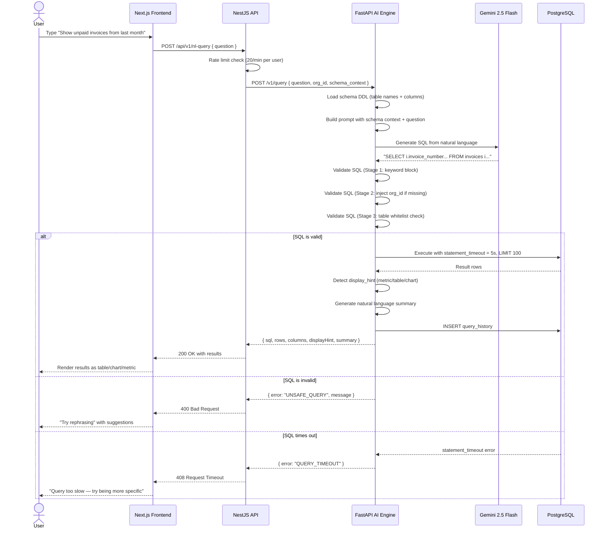
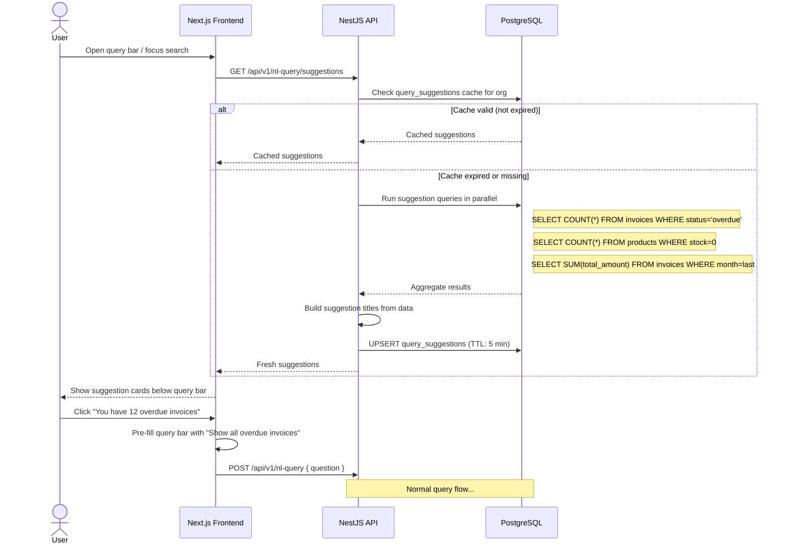
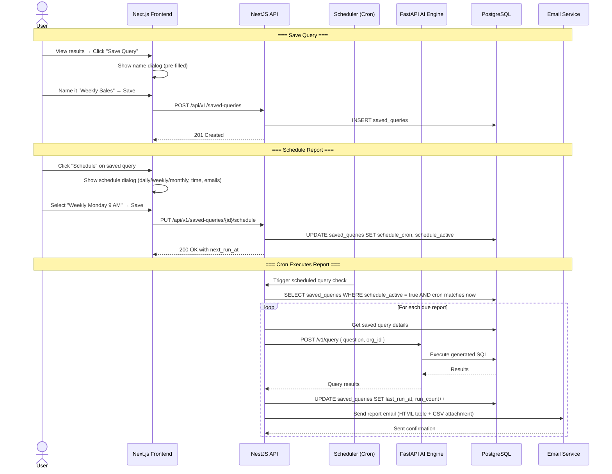
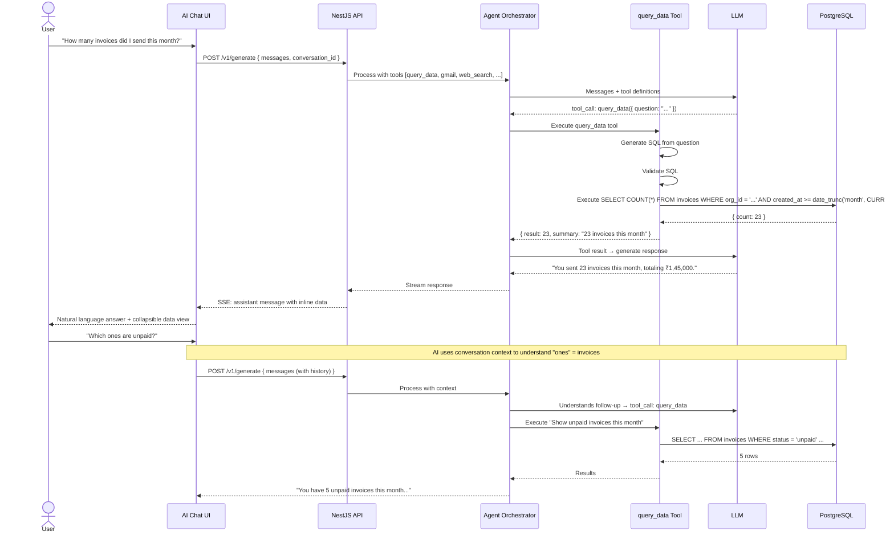

# Natural Language Queries — AI-Powered Business Data Querying

> **Purpose**: Allow users to query their business data using plain language. The AI engine translates natural language to SQL, validates and executes it safely, and returns formatted results as tables, charts, or summary cards. Users can save frequently used queries and schedule automated reports.
>
> **Context**: Uzhavu is a multi-tenant SaaS monorepo (Turborepo + pnpm) with NestJS API, Next.js frontend, FastAPI AI engine, and PostgreSQL. All data is scoped by `orgId`. The natural language query system extends the existing AI chat by adding a data querying tool to the agent's tool registry.
>
> **Architecture ref**: `APP_ARCHITECTURE.md` for app manifests, `ai-engine-improvements.md` for AI engine roadmap, `product-factory-implementation.md` for product/domain system

---

## Table of Contents

1. [Requirements](#requirements)
2. [Design](#design)
3. [Tasks](#tasks)

---

# Requirements

## Story 1: Natural Language to SQL

As a **business owner**, I want to **ask questions about my data in plain English** so that **I can get answers without writing SQL or navigating multiple pages**.

### Acceptance Criteria

- GIVEN a user types "Show me all unpaid invoices from last month" in the query bar WHEN they press Enter THEN the AI generates a safe SELECT query scoped by the user's orgId, executes it, and displays the results as a table
- GIVEN the AI generates a SQL query WHEN the query is displayed to the user THEN the generated SQL is shown in a collapsible "View SQL" section below the results for transparency
- GIVEN the user asks "How many products do I have?" WHEN the AI generates SQL THEN the result is displayed as a single metric card (e.g., "Products: 142") instead of a table
- GIVEN the user asks a question that doesn't relate to their data WHEN the AI processes it THEN it responds with "I can only answer questions about your business data. Try asking about invoices, products, contacts, or expenses." without generating any SQL
- GIVEN the user asks "What's the weather today?" WHEN the AI processes it THEN it recognizes this as a non-data question and responds conversationally without attempting SQL generation
- GIVEN the user's question is ambiguous (e.g., "show me everything") WHEN the AI processes it THEN it asks a clarifying question: "Could you be more specific? For example: 'Show all invoices from this week' or 'List products with low stock'"
- GIVEN the generated SQL contains a syntax error WHEN execution fails THEN the user sees "I couldn't understand that query. Try rephrasing — for example: 'Show unpaid invoices' or 'Total revenue this month'" with no raw error exposed
- GIVEN the query returns zero results WHEN the results are displayed THEN the user sees "No results found for your query" with a suggestion to broaden the search

---

## Story 2: Smart Suggestions

As a **user opening the query bar**, I want to **see smart suggestions based on my actual data** so that **I can discover insights I didn't think to ask about**.

### Acceptance Criteria

- GIVEN a user opens the query bar WHEN the suggestion panel loads THEN it shows 3-5 contextual suggestions based on the user's data, such as "You have 12 overdue invoices totaling ₹45,000" or "Top 5 products by revenue this month"
- GIVEN the user's org has overdue invoices WHEN suggestions are generated THEN one suggestion highlights overdue invoices with count and total amount
- GIVEN the user's org has products with zero stock WHEN suggestions are generated THEN one suggestion highlights "5 products are out of stock"
- GIVEN the user starts typing "show" WHEN the autocomplete activates THEN it shows previous queries matching the prefix and common templates: "Show all invoices from...", "Show products where...", "Show contacts in..."
- GIVEN it's the first of the month WHEN the user opens the query bar THEN a suggestion shows "Monthly summary: Revenue ₹X, Expenses ₹Y, Profit ₹Z for last month"
- GIVEN suggestions require data aggregation WHEN the suggestion panel loads THEN suggestions are cached for 5 minutes per org to avoid expensive queries on every open

---

## Story 3: Chart Generation

As a **business owner**, I want to **ask for charts and visualizations** so that **I can see trends and patterns in my data visually**.

### Acceptance Criteria

- GIVEN a user types "Show monthly revenue chart for the last 6 months" WHEN the AI processes it THEN it generates a SQL query with GROUP BY month, and the results are rendered as a bar chart
- GIVEN a user types "Show daily sales trend this week" WHEN the AI processes it THEN results are rendered as a line chart with dates on the x-axis and amounts on the y-axis
- GIVEN a user types "Show product category breakdown" WHEN the AI processes it THEN results are rendered as a pie/donut chart showing percentage distribution
- GIVEN the AI determines the result type WHEN rendering results THEN it automatically chooses the display format: single value → metric card, 2-column with category+value → chart, multi-column → table
- GIVEN a chart is displayed WHEN the user clicks "View as Table" THEN the same data is shown in a tabular format, and vice versa
- GIVEN the chart has more than 20 data points WHEN rendering THEN the chart adds scroll/zoom controls for readability

---

## Story 4: Saved Queries

As a **user who frequently checks the same data**, I want to **save queries as bookmarks** so that **I can re-run them with one click without retyping**.

### Acceptance Criteria

- GIVEN query results are displayed WHEN the user clicks the "Save Query" bookmark icon THEN a dialog asks for a name (pre-filled with a generated name from the question) and saves the query
- GIVEN the user has saved queries WHEN they open the query bar THEN a "Saved Queries" section shows their bookmarks with name, last run time, and a play button
- GIVEN the user clicks a saved query WHEN it executes THEN the original natural language question is re-processed (not the cached SQL) to account for schema changes, and fresh results are returned
- GIVEN a user has 10+ saved queries WHEN the saved queries panel loads THEN queries are sorted by most recently used, with a search filter
- GIVEN a user wants to delete a saved query WHEN they click the delete icon and confirm THEN the query is removed from the saved list
- GIVEN a saved query is shared by an admin WHEN another user in the same org views saved queries THEN they see a "Shared" tab with org-wide saved queries alongside their personal ones

---

## Story 5: Scheduled Reports

As a **business owner**, I want to **schedule a query to run automatically and email me the results** so that **I receive daily/weekly reports without manual effort**.

### Acceptance Criteria

- GIVEN a user has a saved query WHEN they click "Schedule" on the saved query THEN a scheduling dialog shows options: frequency (daily, weekly, monthly), time of day, and email recipients
- GIVEN a scheduled report is configured for "Daily at 9:00 AM" WHEN the cron job runs at 9:00 AM THEN the query is executed and results are emailed to the configured recipients as an HTML table with a CSV attachment
- GIVEN a scheduled report runs WHEN the query returns results THEN the email subject is "[Product Name] Report: {query_name} — {date}" and the body contains the results formatted as an HTML table
- GIVEN a scheduled report runs WHEN the query returns zero results THEN the email still sends with body "No results for this period" to confirm the report ran
- GIVEN the user wants to pause a scheduled report WHEN they toggle the schedule off THEN the cron job is paused but the saved query and schedule config are preserved
- GIVEN a scheduled report fails (query error, email error) WHEN the failure occurs THEN the error is logged in `saved_queries.last_error` and the user is notified on next app visit

---

## Story 6: Safety & Guardrails

As the **platform operator**, I want **strict safety guardrails on NL queries** so that **users cannot modify data, access other orgs' data, or overwhelm the database**.

### Acceptance Criteria

- GIVEN the AI generates SQL WHEN the SQL contains any mutation keyword (DROP, DELETE, ALTER, INSERT, UPDATE, TRUNCATE, CREATE, GRANT, REVOKE) THEN the query is blocked with error "Only data retrieval queries are allowed. I cannot modify your data."
- GIVEN the AI generates a SELECT query WHEN the query does NOT contain a `WHERE org_id = '{orgId}'` clause (or equivalent) THEN the backend injects the org_id filter before execution to guarantee tenant isolation
- GIVEN the query is executing WHEN it exceeds 5 seconds THEN the query is cancelled via `statement_timeout` and the user sees "This query is taking too long. Try a more specific question to narrow the results."
- GIVEN the query returns more than 100 rows WHEN results are fetched THEN only the first 100 rows are returned with a note "Showing 100 of {total} results. Narrow your query for more specific data."
- GIVEN the AI generates SQL WHEN the SQL attempts to query system tables (`pg_catalog`, `information_schema`, `pg_stat`) THEN the query is blocked with "I can only query your business data tables."
- GIVEN the AI generates SQL with subqueries or JOINs WHEN the query plan is analyzed THEN queries with more than 3 JOINs are blocked with "This query is too complex. Try breaking it into simpler questions."
- GIVEN a user runs queries WHEN they exceed the rate limit (20 queries per minute) THEN subsequent queries are throttled with "You're querying too fast. Please wait a moment."
- GIVEN the query contains SQL injection attempts (e.g., `'; DROP TABLE users; --`) WHEN the AI processes it THEN the AI treats it as natural language and generates a safe parameterized query, and the backend's SQL validator rejects any remaining injection patterns

---

## Story 7: AI Chat Integration

As a **user chatting with the AI assistant**, I want to **ask data questions in the same chat** so that **I don't need to switch between the AI chat and a separate query interface**.

### Acceptance Criteria

- GIVEN the user is in the AI chat WHEN they ask "How many invoices did I send this month?" THEN the AI uses the `query_data` tool from its tool registry to generate SQL, execute it, and return the answer inline in the chat
- GIVEN the AI uses the `query_data` tool WHEN results are returned THEN the chat message includes both a natural language summary ("You sent 23 invoices this month, totaling ₹1,45,000") and a collapsible table/chart view
- GIVEN the user asks a follow-up question "Which ones are unpaid?" WHEN the AI processes it THEN it uses conversation context to understand "ones" refers to invoices and generates the appropriate query
- GIVEN the user asks a non-data question in the same chat (e.g., "Draft a payment reminder email") WHEN the AI processes it THEN it responds normally without invoking the query tool
- GIVEN the query bar in the dashboard header accepts natural language WHEN the user types a question there THEN it opens a mini-results panel below the search bar (not a full chat) for quick answers

---

# Design

## Architecture Overview

```
┌──────────────────────────────────────────────────────────────────────────┐
│                     NATURAL LANGUAGE QUERY SYSTEM                         │
│                                                                           │
│  ┌───────────────┐   ┌────────────────┐   ┌───────────────────────────┐  │
│  │  Next.js UI    │   │  NestJS API     │   │  FastAPI AI Engine        │  │
│  │               │   │               │   │                           │  │
│  │  Query Bar    │──▶│  /nl-query    │──▶│  /v1/query               │  │
│  │  Results View │   │  /saved-queries│   │  ├─ Schema Loader         │  │
│  │  Chart Render │   │  /query-history│   │  ├─ SQL Generator (LLM)   │  │
│  │  AI Chat Tool │   │               │   │  ├─ SQL Validator          │  │
│  └───────────────┘   └────────────────┘   │  ├─ Query Executor        │  │
│         │                    │             │  └─ Result Formatter      │  │
│         │                    │             └───────────────────────────┘  │
│         │                    │                          │                  │
│         │            ┌───────┴──────────────────────────┘                  │
│         │            │                                                     │
│         │            ▼                                                     │
│         │     ┌─────────────┐                                             │
│         └────▶│ PostgreSQL   │                                             │
│               │ ├─ saved_    │                                             │
│               │ │  queries   │                                             │
│               │ ├─ query_    │                                             │
│               │ │  history   │                                             │
│               │ └─ business  │                                             │
│               │    data      │                                             │
│               └─────────────┘                                             │
└──────────────────────────────────────────────────────────────────────────┘
```

### Key Design Decisions

1. **AI generates SQL, backend validates** — The AI engine receives the schema (table names + column names only, no data) as context and generates SQL. The NestJS backend validates the SQL (no mutations, has orgId) before executing it. Defense in depth.
2. **Tool in agent registry** — The NL query is registered as a `query_data` tool in the existing AI agent tool registry. The AI decides when to use it based on the user's question. This means data queries work in the existing AI chat without a separate interface.
3. **Cheap model for SQL generation** — Use Gemini 2.5 Flash or DeepSeek for SQL generation. SQL generation is a structured, well-understood task that doesn't need expensive models. Saves 60-70% vs GPT-4.
4. **Re-use Database Studio query runner** — The existing Database Studio module already has a safe SQL executor with injection protection and result formatting. The NL query system wraps it with additional validation.
5. **Result type detection** — The AI returns a `display_hint` with each result: `metric` (single value), `table` (multi-row), `bar_chart`, `line_chart`, `pie_chart`. The frontend renders accordingly.
6. **Schema context is table+column names only** — No data is sent to the LLM. Only the DDL schema (CREATE TABLE statements with column names and types). This minimizes token usage and prevents data leaks.
7. **Saved queries store the NL question, not the SQL** — On re-run, the question is re-processed through the AI to generate fresh SQL. This handles schema changes gracefully. The last-generated SQL is cached for reference only.

---

## Data Models

### SQL Schema

```sql
-- ============================================================
-- Saved Queries (per-org bookmarked queries)
-- ============================================================
CREATE TABLE saved_queries (
  id              TEXT PRIMARY KEY DEFAULT gen_random_uuid()::text,
  org_id          TEXT NOT NULL,
  created_by      TEXT NOT NULL,                   -- User ID who saved it
  name            TEXT NOT NULL,                   -- Display name, e.g., "Weekly Sales Report"
  question        TEXT NOT NULL,                   -- Original NL question
  last_sql        TEXT,                            -- Last generated SQL (cached, not authoritative)
  display_hint    TEXT DEFAULT 'table',            -- 'metric', 'table', 'bar_chart', 'line_chart', 'pie_chart'
  is_shared       BOOLEAN NOT NULL DEFAULT false,  -- Visible to all org users
  is_pinned       BOOLEAN NOT NULL DEFAULT false,  -- Pinned to top of saved list
  
  -- Scheduling
  schedule_cron   TEXT,                            -- Cron expression, e.g., '0 9 * * *' (daily at 9 AM)
  schedule_active BOOLEAN NOT NULL DEFAULT false,
  schedule_recipients TEXT[] DEFAULT '{}',         -- Email addresses for scheduled reports
  schedule_format TEXT DEFAULT 'html',             -- 'html', 'csv', 'both'
  
  -- Metadata
  run_count       INT NOT NULL DEFAULT 0,
  last_run_at     TIMESTAMPTZ,
  last_result_count INT,
  last_error      TEXT,
  
  created_at      TIMESTAMPTZ NOT NULL DEFAULT NOW(),
  updated_at      TIMESTAMPTZ NOT NULL DEFAULT NOW()
);

CREATE INDEX idx_sq_org ON saved_queries(org_id);
CREATE INDEX idx_sq_org_user ON saved_queries(org_id, created_by);
CREATE INDEX idx_sq_schedule ON saved_queries(schedule_active, schedule_cron) WHERE schedule_active = true;

-- ============================================================
-- Query History (per-user audit log)
-- ============================================================
CREATE TABLE query_history (
  id              TEXT PRIMARY KEY DEFAULT gen_random_uuid()::text,
  org_id          TEXT NOT NULL,
  user_id         TEXT NOT NULL,
  question        TEXT NOT NULL,                   -- Original NL question
  generated_sql   TEXT,                            -- SQL that was generated
  is_valid        BOOLEAN NOT NULL DEFAULT true,   -- Whether the SQL passed validation
  validation_error TEXT,                           -- Error message if validation failed
  result_count    INT,                             -- Number of rows returned
  display_hint    TEXT,                            -- How results were displayed
  execution_time_ms INT,                           -- Query execution time
  model_used      TEXT,                            -- Which LLM model generated the SQL
  tokens_used     INT,                             -- Tokens consumed for generation
  created_at      TIMESTAMPTZ NOT NULL DEFAULT NOW()
);

CREATE INDEX idx_qh_org_user ON query_history(org_id, user_id, created_at DESC);
CREATE INDEX idx_qh_org_recent ON query_history(org_id, created_at DESC);

-- ============================================================
-- Query Suggestions Cache (pre-computed per org)
-- ============================================================
CREATE TABLE query_suggestions (
  id              TEXT PRIMARY KEY DEFAULT gen_random_uuid()::text,
  org_id          TEXT NOT NULL,
  suggestion_type TEXT NOT NULL,                   -- 'overdue_invoices', 'out_of_stock', 'monthly_summary', etc.
  title           TEXT NOT NULL,                   -- Display text, e.g., "You have 12 overdue invoices"
  question        TEXT NOT NULL,                   -- Pre-filled NL question to run
  data_snapshot   JSONB DEFAULT '{}',             -- Cached aggregate data, e.g., { count: 12, total: 45000 }
  priority        INT NOT NULL DEFAULT 0,          -- Higher = shown first
  cached_at       TIMESTAMPTZ NOT NULL DEFAULT NOW(),
  expires_at      TIMESTAMPTZ NOT NULL             -- When to refresh, typically cached_at + 5 minutes
);

CREATE INDEX idx_qs_org ON query_suggestions(org_id, expires_at);
```

### Prisma Schema Additions

```prisma
model SavedQuery {
  id                String    @id @default(uuid())
  orgId             String    @map("org_id")
  createdBy         String    @map("created_by")
  name              String
  question          String
  lastSql           String?   @map("last_sql")
  displayHint       String    @default("table") @map("display_hint")
  isShared          Boolean   @default(false) @map("is_shared")
  isPinned          Boolean   @default(false) @map("is_pinned")
  scheduleCron      String?   @map("schedule_cron")
  scheduleActive    Boolean   @default(false) @map("schedule_active")
  scheduleRecipients String[] @map("schedule_recipients")
  scheduleFormat    String    @default("html") @map("schedule_format")
  runCount          Int       @default(0) @map("run_count")
  lastRunAt         DateTime? @map("last_run_at")
  lastResultCount   Int?      @map("last_result_count")
  lastError         String?   @map("last_error")
  createdAt         DateTime  @default(now()) @map("created_at")
  updatedAt         DateTime  @updatedAt @map("updated_at")

  @@index([orgId])
  @@index([orgId, createdBy])
  @@map("saved_queries")
}

model QueryHistory {
  id              String   @id @default(uuid())
  orgId           String   @map("org_id")
  userId          String   @map("user_id")
  question        String
  generatedSql    String?  @map("generated_sql")
  isValid         Boolean  @default(true) @map("is_valid")
  validationError String?  @map("validation_error")
  resultCount     Int?     @map("result_count")
  displayHint     String?  @map("display_hint")
  executionTimeMs Int?     @map("execution_time_ms")
  modelUsed       String?  @map("model_used")
  tokensUsed      Int?     @map("tokens_used")
  createdAt       DateTime @default(now()) @map("created_at")

  @@index([orgId, userId, createdAt(sort: Desc)])
  @@index([orgId, createdAt(sort: Desc)])
  @@map("query_history")
}

model QuerySuggestion {
  id             String   @id @default(uuid())
  orgId          String   @map("org_id")
  suggestionType String   @map("suggestion_type")
  title          String
  question       String
  dataSnapshot   Json     @default("{}") @map("data_snapshot")
  priority       Int      @default(0)
  cachedAt       DateTime @default(now()) @map("cached_at")
  expiresAt      DateTime @map("expires_at")

  @@index([orgId, expiresAt])
  @@map("query_suggestions")
}
```

---

## SQL Validation Pipeline

The generated SQL passes through a multi-stage validation pipeline before execution:

```
┌──────────┐   ┌──────────────┐   ┌──────────────┐   ┌────────────┐   ┌──────────┐
│ AI       │──▶│ Stage 1:     │──▶│ Stage 2:     │──▶│ Stage 3:   │──▶│ Stage 4: │
│ Generated│   │ Keyword      │   │ orgId        │   │ Table      │   │ Timeout  │
│ SQL      │   │ Block        │   │ Injection    │   │ Whitelist  │   │ Execute  │
└──────────┘   └──────────────┘   └──────────────┘   └────────────┘   └──────────┘
                     │                   │                  │                │
                 Block if:          Inject if:         Block if:       Cancel if:
                 DROP, DELETE,      no WHERE           pg_catalog,     > 5 seconds
                 ALTER, INSERT,     org_id =           information_
                 UPDATE, TRUNCATE,  clause found       schema, or
                 CREATE, GRANT,                        non-business
                 REVOKE, EXEC                          table names
```

### Validation Implementation

```python
# ai-engine/app/tools/nl_query/validator.py

BLOCKED_KEYWORDS = [
    'DROP', 'DELETE', 'ALTER', 'INSERT', 'UPDATE', 'TRUNCATE',
    'CREATE', 'GRANT', 'REVOKE', 'EXEC', 'EXECUTE',
    'INTO OUTFILE', 'LOAD_FILE', 'COPY',
]

BLOCKED_TABLES = [
    'pg_catalog', 'information_schema', 'pg_stat',
    'pg_shadow', 'pg_authid', 'pg_roles',
]

BUSINESS_TABLES = [
    'invoices', 'invoice_items', 'products', 'contacts',
    'categories', 'expenses', 'tasks', 'orders', 'order_items',
    'payments', 'organizations', 'custom_fields', 'custom_field_values',
]

MAX_JOINS = 3
MAX_RESULT_ROWS = 100
QUERY_TIMEOUT_SECONDS = 5

class SQLValidationResult:
    is_valid: bool
    error_message: str | None
    sanitized_sql: str | None
    warnings: list[str]

def validate_sql(sql: str, org_id: str) -> SQLValidationResult:
    """Multi-stage SQL validation pipeline."""
    
    # Stage 1: Keyword block
    upper_sql = sql.upper()
    for keyword in BLOCKED_KEYWORDS:
        if keyword in upper_sql:
            return SQLValidationResult(
                is_valid=False,
                error_message=f"Query contains blocked keyword: {keyword}"
            )
    
    # Must start with SELECT (or WITH for CTEs)
    stripped = sql.strip().upper()
    if not stripped.startswith('SELECT') and not stripped.startswith('WITH'):
        return SQLValidationResult(
            is_valid=False,
            error_message="Only SELECT queries are allowed."
        )
    
    # Stage 2: orgId injection
    if f"org_id = '{org_id}'" not in sql and f'org_id = $1' not in sql:
        # Inject orgId WHERE clause
        sql = inject_org_id_filter(sql, org_id)
    
    # Stage 3: Table whitelist
    referenced_tables = extract_table_names(sql)
    for table in referenced_tables:
        if table.lower() in [t.lower() for t in BLOCKED_TABLES]:
            return SQLValidationResult(
                is_valid=False,
                error_message="Cannot query system tables."
            )
        if table.lower() not in [t.lower() for t in BUSINESS_TABLES]:
            return SQLValidationResult(
                is_valid=False,
                error_message=f"Unknown table: {table}"
            )
    
    # Stage 3b: JOIN count check
    join_count = upper_sql.count(' JOIN ')
    if join_count > MAX_JOINS:
        return SQLValidationResult(
            is_valid=False,
            error_message="Query too complex. Max 3 JOINs allowed."
        )
    
    # Stage 4: Add LIMIT and timeout
    if 'LIMIT' not in upper_sql:
        sql = sql.rstrip(';') + f' LIMIT {MAX_RESULT_ROWS};'
    
    return SQLValidationResult(
        is_valid=True,
        sanitized_sql=sql,
        warnings=[]
    )
```

---

## AI Tool Registration

### Tool Definition for Agent Registry

```python
# ai-engine/app/tools/nl_query/tool.py

from app.agent.tools.base import BaseTool

class QueryDataTool(BaseTool):
    name = "query_data"
    description = """
    Query the user's business data using SQL. Use this tool when the user asks
    questions about their invoices, products, contacts, expenses, orders, tasks,
    or any business metrics.

    Input: A JSON object with:
    - question: The user's natural language question
    - display_hint: Suggested display format ('metric', 'table', 'bar_chart', 'line_chart', 'pie_chart')

    The tool will:
    1. Generate a safe SELECT query from the question
    2. Validate the query (no mutations, scoped by orgId)
    3. Execute the query with a 5-second timeout
    4. Return formatted results

    IMPORTANT:
    - ONLY generates SELECT queries
    - All queries are automatically scoped to the user's organization
    - Maximum 100 rows returned
    - If the question is not about data, do NOT use this tool
    """

    parameters = {
        "type": "object",
        "properties": {
            "question": {
                "type": "string",
                "description": "The natural language question about business data"
            },
            "display_hint": {
                "type": "string",
                "enum": ["metric", "table", "bar_chart", "line_chart", "pie_chart"],
                "description": "How to display the results"
            }
        },
        "required": ["question"]
    }
```

### Schema Context Template

The AI receives this schema context (table structures only, no data):

```python
SCHEMA_CONTEXT_TEMPLATE = """
You are a SQL expert for a business management application. Generate PostgreSQL SELECT queries.

DATABASE SCHEMA:
{schema_ddl}

RULES:
1. ONLY generate SELECT queries. Never generate INSERT, UPDATE, DELETE, DROP, or any mutation.
2. Always include WHERE org_id = '{org_id}' in every query.
3. Use proper PostgreSQL syntax (not MySQL).
4. For date ranges, use CURRENT_DATE, INTERVAL, date_trunc().
5. For "last month": WHERE created_at >= date_trunc('month', CURRENT_DATE - INTERVAL '1 month') AND created_at < date_trunc('month', CURRENT_DATE)
6. For "this month": WHERE created_at >= date_trunc('month', CURRENT_DATE)
7. For currency amounts, the database stores values in paise (smallest unit). Divide by 100 for display.
8. Return meaningful column aliases (e.g., AS "Total Revenue", AS "Customer Name").
9. Limit results to 100 rows unless the user asks for a specific count.
10. For chart queries, ensure the first column is the category/label and the second is the value.

Respond with ONLY the SQL query. No explanation, no markdown, no code fences.
"""
```

---

## API Contracts

### Base Path: `/api/v1/nl-query`

---

### POST `/api/v1/nl-query`

**Execute a natural language query against the user's business data.**

**Headers:**
```
Authorization: Bearer <token>
x-product-id: uzhavu  (set by middleware)
```

**Request Body:**
```json
{
  "question": "Show me all unpaid invoices from last month",
  "conversationId": "conv_abc123"
}
```

**Response: `200 OK` (Table result)**
```json
{
  "data": {
    "question": "Show me all unpaid invoices from last month",
    "generatedSql": "SELECT i.invoice_number AS \"Invoice #\", c.name AS \"Customer\", i.total_amount / 100 AS \"Amount (₹)\", i.due_date AS \"Due Date\" FROM invoices i JOIN contacts c ON i.contact_id = c.id WHERE i.org_id = 'org_123' AND i.status = 'unpaid' AND i.created_at >= date_trunc('month', CURRENT_DATE - INTERVAL '1 month') AND i.created_at < date_trunc('month', CURRENT_DATE) ORDER BY i.due_date ASC LIMIT 100;",
    "displayHint": "table",
    "summary": "Found 12 unpaid invoices from last month, totaling ₹45,230",
    "columns": ["Invoice #", "Customer", "Amount (₹)", "Due Date"],
    "rows": [
      ["INV-2026-089", "Rajan Textiles", 5200, "2026-06-15"],
      ["INV-2026-091", "Kumar Stores", 3800, "2026-06-18"]
    ],
    "totalRows": 12,
    "truncated": false,
    "executionTimeMs": 45,
    "modelUsed": "gemini-2.5-flash",
    "historyId": "qh_xyz789"
  }
}
```

**Response: `200 OK` (Metric result)**
```json
{
  "data": {
    "question": "How many products do I have?",
    "generatedSql": "SELECT COUNT(*) AS \"Total Products\" FROM products WHERE org_id = 'org_123';",
    "displayHint": "metric",
    "summary": "You have 142 products",
    "columns": ["Total Products"],
    "rows": [[142]],
    "totalRows": 1,
    "truncated": false,
    "executionTimeMs": 12,
    "modelUsed": "gemini-2.5-flash",
    "historyId": "qh_abc456"
  }
}
```

**Response: `200 OK` (Chart result)**
```json
{
  "data": {
    "question": "Show monthly revenue for the last 6 months",
    "generatedSql": "SELECT to_char(date_trunc('month', created_at), 'Mon YYYY') AS \"Month\", SUM(total_amount) / 100 AS \"Revenue (₹)\" FROM invoices WHERE org_id = 'org_123' AND status = 'paid' AND created_at >= CURRENT_DATE - INTERVAL '6 months' GROUP BY date_trunc('month', created_at) ORDER BY date_trunc('month', created_at);",
    "displayHint": "bar_chart",
    "summary": "Monthly revenue trend for the last 6 months. Total: ₹4,52,000",
    "columns": ["Month", "Revenue (₹)"],
    "rows": [
      ["Jan 2026", 65000],
      ["Feb 2026", 72000],
      ["Mar 2026", 58000],
      ["Apr 2026", 89000],
      ["May 2026", 95000],
      ["Jun 2026", 73000]
    ],
    "totalRows": 6,
    "truncated": false,
    "executionTimeMs": 78,
    "modelUsed": "gemini-2.5-flash",
    "historyId": "qh_def789"
  }
}
```

**Error: `400 Bad Request` (Unsafe query)**
```json
{
  "error": "UNSAFE_QUERY",
  "message": "Only data retrieval queries are allowed. I cannot modify your data.",
  "suggestion": "Try asking: 'Show all products' or 'How many invoices this month?'"
}
```

**Error: `400 Bad Request` (Generation failed)**
```json
{
  "error": "GENERATION_FAILED",
  "message": "I couldn't understand that query. Try rephrasing.",
  "suggestions": [
    "Show unpaid invoices",
    "Total revenue this month",
    "List all products"
  ]
}
```

**Error: `408 Request Timeout`**
```json
{
  "error": "QUERY_TIMEOUT",
  "message": "This query is taking too long. Try a more specific question to narrow the results.",
  "executionTimeMs": 5000
}
```

**Error: `429 Too Many Requests`**
```json
{
  "error": "RATE_LIMITED",
  "message": "You're querying too fast. Please wait a moment.",
  "retryAfterSeconds": 30
}
```

---

### GET `/api/v1/nl-query/suggestions`

**Get smart suggestions based on the user's data.**

**Response: `200 OK`**
```json
{
  "data": [
    {
      "type": "overdue_invoices",
      "title": "You have 12 overdue invoices totaling ₹45,000",
      "question": "Show all overdue invoices",
      "icon": "alert-triangle",
      "priority": 10
    },
    {
      "type": "out_of_stock",
      "title": "5 products are out of stock",
      "question": "Show products with zero stock",
      "icon": "package-x",
      "priority": 8
    },
    {
      "type": "monthly_summary",
      "title": "June 2026: Revenue ₹73,000 | Expenses ₹42,000",
      "question": "Show revenue and expenses summary for last month",
      "icon": "bar-chart-3",
      "priority": 5
    },
    {
      "type": "top_products",
      "title": "Top 5 products by revenue this month",
      "question": "Show top 5 products by revenue this month",
      "icon": "trending-up",
      "priority": 3
    }
  ],
  "meta": {
    "cachedAt": "2026-07-05T12:00:00Z",
    "expiresAt": "2026-07-05T12:05:00Z"
  }
}
```

---

### GET `/api/v1/nl-query/history`

**Get the user's query history.**

**Query Parameters:**
| Param | Type | Required | Description |
|:------|:-----|:---------|:------------|
| `limit` | int | No | Number of results (default: 20, max: 50) |
| `offset` | int | No | Pagination offset |

**Response: `200 OK`**
```json
{
  "data": [
    {
      "id": "qh_xyz789",
      "question": "Show me all unpaid invoices from last month",
      "displayHint": "table",
      "resultCount": 12,
      "executionTimeMs": 45,
      "createdAt": "2026-07-05T11:55:00Z"
    }
  ],
  "meta": {
    "total": 45,
    "limit": 20,
    "offset": 0
  }
}
```

---

### Base Path: `/api/v1/saved-queries`

---

### POST `/api/v1/saved-queries`

**Save a query as a bookmark.**

**Request Body:**
```json
{
  "name": "Weekly Unpaid Invoices",
  "question": "Show all unpaid invoices from this week",
  "displayHint": "table",
  "isShared": false
}
```

**Response: `201 Created`**
```json
{
  "data": {
    "id": "sq_abc123",
    "name": "Weekly Unpaid Invoices",
    "question": "Show all unpaid invoices from this week",
    "displayHint": "table",
    "isShared": false,
    "isPinned": false,
    "runCount": 0,
    "createdAt": "2026-07-05T12:00:00Z"
  }
}
```

---

### GET `/api/v1/saved-queries`

**List saved queries for the current user (personal + shared).**

**Response: `200 OK`**
```json
{
  "data": {
    "personal": [
      {
        "id": "sq_abc123",
        "name": "Weekly Unpaid Invoices",
        "question": "Show all unpaid invoices from this week",
        "displayHint": "table",
        "isPinned": true,
        "runCount": 15,
        "lastRunAt": "2026-07-05T09:00:00Z",
        "lastResultCount": 8,
        "scheduleActive": false,
        "createdAt": "2026-06-15T10:00:00Z"
      }
    ],
    "shared": [
      {
        "id": "sq_def456",
        "name": "Daily Sales Summary",
        "question": "Show total sales today with count and amount",
        "displayHint": "metric",
        "createdBy": "Admin",
        "runCount": 120,
        "lastRunAt": "2026-07-05T09:00:00Z",
        "scheduleActive": true,
        "scheduleCron": "0 9 * * *"
      }
    ]
  }
}
```

---

### POST `/api/v1/saved-queries/:queryId/run`

**Re-run a saved query (re-generates SQL from the stored question).**

**Response: `200 OK`**
Same response format as `POST /api/v1/nl-query`.

---

### PUT `/api/v1/saved-queries/:queryId/schedule`

**Set or update the schedule for a saved query.**

**Request Body:**
```json
{
  "cron": "0 9 * * 1",
  "active": true,
  "recipients": ["owner@example.com", "manager@example.com"],
  "format": "both"
}
```

**Response: `200 OK`**
```json
{
  "data": {
    "id": "sq_abc123",
    "scheduleCron": "0 9 * * 1",
    "scheduleActive": true,
    "scheduleRecipients": ["owner@example.com", "manager@example.com"],
    "scheduleFormat": "both",
    "nextRunAt": "2026-07-07T09:00:00Z",
    "message": "Report scheduled: Weekly on Monday at 9:00 AM"
  }
}
```

---

### DELETE `/api/v1/saved-queries/:queryId`

**Delete a saved query.**

**Response: `200 OK`**
```json
{
  "data": {
    "id": "sq_abc123",
    "message": "Saved query deleted."
  }
}
```

---

### GET `/api/v1/nl-query/schema`

**Get the database schema context sent to the AI (for debugging/transparency).**

**Response: `200 OK`**
```json
{
  "data": {
    "tables": [
      {
        "name": "invoices",
        "columns": [
          { "name": "id", "type": "text" },
          { "name": "org_id", "type": "text" },
          { "name": "invoice_number", "type": "text" },
          { "name": "contact_id", "type": "text" },
          { "name": "status", "type": "text" },
          { "name": "total_amount", "type": "integer" },
          { "name": "due_date", "type": "date" },
          { "name": "created_at", "type": "timestamptz" }
        ]
      }
    ],
    "tableCount": 12,
    "totalColumns": 87
  }
}
```

---

## Sequence Diagrams

### Natural Language Query Flow



### Smart Suggestions Flow



### Saved Query & Scheduled Report Flow



### AI Chat Integration Flow



---

## Plan Gating Matrix

| Feature | Free | Starter | Pro | Enterprise |
|:---|:---:|:---:|:---:|:---:|
| **NL queries (basic)** | ✅ (5/day) | ✅ (50/day) | ✅ (unlimited) | ✅ (unlimited) |
| **Query history** | ✅ (7 days) | ✅ (30 days) | ✅ (90 days) | ✅ (unlimited) |
| **Smart suggestions** | ✅ | ✅ | ✅ | ✅ |
| **Chart generation** | 🔒 | ✅ | ✅ | ✅ |
| **Saved queries** | 🔒 | ✅ (10 max) | ✅ (50 max) | ✅ (unlimited) |
| **Shared queries** | 🔒 | 🔒 | ✅ | ✅ |
| **Scheduled reports** | 🔒 | 🔒 | ✅ (5 max) | ✅ (unlimited) |
| **AI chat integration** | 🔒 | ✅ | ✅ | ✅ |
| **Export results (CSV)** | 🔒 | ✅ | ✅ | ✅ |
| **View generated SQL** | 🔒 | 🔒 | ✅ | ✅ |

> Free plan gets 5 basic queries per day with 7-day history. This is enough for users to experience the feature and upgrade.

---

## Error Handling & Edge Cases

| Scenario | Handling |
|:---------|:---------|
| AI generates invalid SQL syntax | Backend SQL parser catches it before execution; return "GENERATION_FAILED" with rephrase suggestions |
| AI generates SQL referencing non-existent column | PostgreSQL returns error; catch and return "I couldn't find that data. Check if you're asking about a valid field." |
| User asks the same question repeatedly | Return cached result from `query_history` if <1 minute old (dedup); otherwise re-execute for fresh data |
| User asks about another org's data | orgId is always injected server-side from the auth token — AI cannot override this; query will return empty results |
| Schema changes (new table/column added) | Schema context is loaded fresh on each query — new tables/columns are automatically available |
| Custom fields are queried | Custom fields use EAV pattern — AI must JOIN `custom_field_values` table; schema context includes custom field definitions per org |
| Query returns exactly 100 rows (limit hit) | Response includes `truncated: true` and total row count if available; user is told to narrow their query |
| LLM API is down / unavailable | Return "AI service temporarily unavailable. Try again in a moment." with HTTP 503; do not retry automatically |
| User's query is in a non-English language (e.g., Tamil) | The LLM handles multilingual input natively; SQL generation still works; results are returned with English column headers |
| Concurrent scheduled reports overwhelm the database | Reports are queued and executed serially with a max concurrency of 3; use `pg_advisory_lock` to prevent overlap |
| User types SQL directly instead of natural language | AI treats it as a question and generates its own SQL; the raw SQL input is not executed directly |
| Saved query references deleted tables (schema migration) | On re-run, AI generates new SQL from the question; if the table no longer exists, return "This data is no longer available" |
| Email delivery fails for scheduled report | Log error in `saved_queries.last_error`; retry once after 5 minutes; show failure status on next login |

---

## NestJS Module Structure

```
apps/api/src/modules/nl-query/
├── nl-query.module.ts              # NestJS module definition
├── nl-query.controller.ts          # REST endpoints (query, suggestions, history)
├── nl-query.service.ts             # Business logic (rate limiting, forwarding to AI)
├── query-validator.service.ts      # SQL validation pipeline (keyword block, orgId, whitelist)
├── suggestion.service.ts           # Smart suggestion generation and caching
├── saved-query.controller.ts       # CRUD + schedule endpoints for saved queries
├── saved-query.service.ts          # Saved query business logic
├── report-scheduler.service.ts     # Cron-based scheduled report execution + email
├── dto/
│   ├── execute-query.dto.ts        # Query request validation
│   ├── save-query.dto.ts           # Save query request validation
│   └── schedule-query.dto.ts       # Schedule configuration validation
├── guards/
│   ├── query-rate-limit.guard.ts   # Per-user rate limiting
│   └── query-plan.guard.ts         # Plan-based feature gating
└── entities/
    ├── saved-query.entity.ts
    ├── query-history.entity.ts
    └── query-suggestion.entity.ts
```

## AI Engine Structure

```
ai-engine/app/tools/nl_query/
├── __init__.py
├── tool.py                         # QueryDataTool — agent tool registration
├── generator.py                    # SQL generation (LLM prompt + call)
├── validator.py                    # Multi-stage SQL validation pipeline
├── executor.py                     # Safe query execution with timeout
├── formatter.py                    # Result formatting + display_hint detection
└── schema_loader.py               # Load org-scoped schema DDL for context
```

## Frontend Structure

```
apps/web/src/
├── app/(dashboard)/
│   └── query/
│       └── page.tsx                # Full-page query interface (alternative to bar)
├── components/query/
│   ├── QueryBar.tsx                # Dashboard header search bar
│   ├── QueryBar.module.css
│   ├── QueryResults.tsx            # Results renderer (table/chart/metric)
│   ├── QueryResults.module.css
│   ├── QueryTable.tsx              # Sortable results table
│   ├── QueryChart.tsx              # Chart renderer (uses recharts)
│   ├── QueryMetricCard.tsx         # Single value metric display
│   ├── QuerySuggestions.tsx        # Smart suggestion cards
│   ├── QuerySuggestions.module.css
│   ├── SaveQueryDialog.tsx         # Save/name query dialog
│   ├── ScheduleDialog.tsx          # Schedule configuration dialog
│   ├── SavedQueriesList.tsx        # Saved queries sidebar panel
│   ├── SavedQueriesList.module.css
│   ├── QueryHistory.tsx            # Recent query history list
│   └── SqlPreview.tsx              # Collapsible generated SQL viewer
├── actions/query/
│   ├── executeQuery.ts             # Server action: run NL query
│   ├── getSuggestions.ts           # Server action: get suggestions
│   ├── getHistory.ts               # Server action: get query history
│   ├── saveQuery.ts                # Server action: save query
│   ├── runSavedQuery.ts            # Server action: re-run saved query
│   ├── scheduleQuery.ts            # Server action: set schedule
│   └── deleteSavedQuery.ts         # Server action: delete saved query
└── hooks/
    ├── useQueryBar.ts              # Query bar state management
    └── useQueryResults.ts          # Results state + display logic
```

---

## Dependencies

| Package | Location | Version | Purpose | Size |
|:---|:---|:---|:---|:---|
| `recharts` | Frontend | `^2.x` | Chart rendering (bar, line, pie) | ~120KB |
| `@tanstack/react-table` | Frontend | `^8.x` | Sortable, filterable results table | ~50KB |
| `papaparse` | Frontend | `^5.x` | CSV export from query results | ~7KB |
| `litellm` | AI Engine | existing | LLM routing (Gemini Flash for SQL gen) | — |
| `sqlparse` | AI Engine | `^0.5.x` | Python SQL parser for validation | ~30KB |
| `node-cron` | Backend | `^3.x` | Scheduled report cron jobs | ~5KB |
| `nodemailer` | Backend | `^6.x` | Email delivery for scheduled reports | ~20KB |

> Chart rendering uses `recharts` (React-native charting library) — no external charting service.

---

# Tasks

## Phase 1: AI Engine — SQL Generation Tool (~3 days)

- [ ] Create `ai-engine/app/tools/nl_query/` directory with `__init__.py` and module structure (~0.5h)
- [ ] Implement `schema_loader.py` — load org-scoped schema DDL from PostgreSQL `information_schema.columns`, filter to `BUSINESS_TABLES` only, cache for 10 minutes per org (~3h)
- [ ] Implement `generator.py` — build prompt with schema context + user question, call Gemini 2.5 Flash via LiteLLM, extract raw SQL from response, handle generation failures (~3h)
- [ ] Implement `validator.py` — multi-stage validation pipeline: keyword block, orgId injection, table whitelist, JOIN count check, LIMIT enforcement (~4h)
- [ ] Implement `executor.py` — safe SQL execution with `statement_timeout = 5000`, result row capping at 100, execution time tracking (~2h)
- [ ] Implement `formatter.py` — detect display_hint from result shape (1 row 1 col → metric, 2 cols → chart candidate, else → table), generate natural language summary (~2h)
- [ ] Implement `tool.py` — register `QueryDataTool` in agent tool registry, wire generator → validator → executor → formatter pipeline (~2h)
- [ ] Add `/v1/query` endpoint to FastAPI — accepts `{ question, org_id }`, returns `{ sql, rows, columns, displayHint, summary }` (~2h)
- [ ] Write unit tests for SQL validator — test all blocked keywords, orgId injection, table whitelist, JOIN limits, edge cases (~3h)
- [ ] Write integration tests — end-to-end NL question → SQL → execution → results with test database fixtures (~2h)

## Phase 2: Database & Backend Core (~3 days)

- [ ] Add Prisma schema for `saved_queries`, `query_history`, `query_suggestions` tables with all columns, indexes, and constraints (~2h)
- [ ] Run Prisma migration and verify tables are created correctly (~0.5h)
- [ ] Create NestJS `nl-query.module.ts` — register module, import PrismaService and AI engine client (~1h)
- [ ] Implement `NlQueryService.executeQuery()` — forward question to AI engine, validate response, log to query_history, apply rate limiting (~3h)
- [ ] Implement `QueryValidatorService` — server-side SQL validation as defense-in-depth (duplicate of AI engine validation for security) (~2h)
- [ ] Implement `SuggestionService` — generate smart suggestions by running predefined aggregate queries, cache in `query_suggestions` with 5-minute TTL (~3h)
- [ ] Implement `SavedQueryService` — CRUD for saved queries, re-run logic (re-process NL question, not cached SQL), sharing (org-wide flag) (~3h)
- [ ] Implement `ReportSchedulerService` — cron job that checks `saved_queries WHERE schedule_active = true`, executes queries, sends email via nodemailer (~4h)
- [ ] Create DTOs with class-validator: `ExecuteQueryDto`, `SaveQueryDto`, `ScheduleQueryDto` (~1.5h)
- [ ] Implement `NlQueryController` — REST endpoints: `/nl-query` (execute), `/nl-query/suggestions`, `/nl-query/history`, `/nl-query/schema` (~3h)
- [ ] Implement `SavedQueryController` — REST endpoints: CRUD + `/run` + `/schedule` (~2h)
- [ ] Implement `QueryRateLimitGuard` — per-user rate limiting based on plan (5/day free, 50/day starter, unlimited pro) (~2h)
- [ ] Implement `QueryPlanGuard` — feature gating (charts, saved queries, schedules by plan) (~1.5h)

## Phase 3: Frontend — Query Bar & Results (~3 days)

- [ ] Create `QueryBar` component with CSS Modules — input field in dashboard header, handles Enter key, shows loading spinner, displays mini-results panel below (~4h)
- [ ] Create `QueryResults` component — dispatches rendering to `QueryTable`, `QueryChart`, or `QueryMetricCard` based on `displayHint` from response (~2h)
- [ ] Create `QueryTable` component using `@tanstack/react-table` — sortable columns, row highlighting, "Export CSV" button using papaparse (~3h)
- [ ] Create `QueryChart` component using `recharts` — renders `bar_chart` as BarChart, `line_chart` as LineChart, `pie_chart` as PieChart, responsive sizing (~4h)
- [ ] Create `QueryMetricCard` component — large number display with label, icon, and optional trend indicator (~1.5h)
- [ ] Create `SqlPreview` component — collapsible code block showing generated SQL with syntax highlighting and copy button (~1.5h)
- [ ] Implement server actions with `withAction` wrapper: `executeQuery`, `getSuggestions`, `getHistory` (~2h)
- [ ] Create `QuerySuggestions` component — horizontal scrollable cards below query bar when empty/focused, click to pre-fill query (~2h)

## Phase 4: Frontend — Saved Queries & History (~2 days)

- [ ] Create `SaveQueryDialog` component — modal with name input (pre-filled from AI), display hint selector, shared toggle (~2h)
- [ ] Create `SavedQueriesList` component — sidebar panel showing personal + shared saved queries, sorted by recent use, search filter, run/delete buttons (~3h)
- [ ] Create `ScheduleDialog` component — frequency picker (daily/weekly/monthly), time picker, email recipients input (multi-value), format selector (HTML/CSV/both) (~3h)
- [ ] Create `QueryHistory` component — recent queries list with question, result count, time ago, click to re-run (~2h)
- [ ] Implement server actions: `saveQuery`, `runSavedQuery`, `scheduleQuery`, `deleteSavedQuery` (~2h)
- [ ] Create full-page `/query` route — combines query bar, results, saved queries sidebar, and history into a dedicated query workspace (~2h)

## Phase 5: AI Chat Integration (~1.5 days)

- [ ] Register `query_data` tool in the existing agent orchestrator tool registry — ensure it's available alongside gmail, web_search, etc. (~1h)
- [ ] Modify AI chat response rendering — detect when response includes query results (tool_call: query_data), render inline table/chart/metric within chat bubbles (~3h)
- [ ] Add follow-up query context — when AI uses `query_data` tool, include previous query results in conversation context so follow-up questions work ("Which ones are unpaid?") (~2h)
- [ ] Add "Ask about your data" quick action button in AI chat — pre-populates a data question template to guide users (~1h)
- [ ] Test chat integration end-to-end — conversational data queries, follow-ups, mixed data + non-data questions in same conversation (~2h)

## Phase 6: Scheduled Reports (~1.5 days)

- [ ] Implement email template for scheduled reports — HTML table layout with product branding, query name, run timestamp, result count (~2h)
- [ ] Implement CSV attachment generation — convert query results to CSV using papaparse, attach to email (~1.5h)
- [ ] Set up nodemailer transport configuration — SMTP settings from environment variables, connection pooling (~1h)
- [ ] Implement cron scheduler — runs every minute, checks for due scheduled queries, executes with max concurrency of 3, handles failures gracefully (~3h)
- [ ] Add scheduled report status tracking — `last_run_at`, `last_error`, show status badge on saved query card in UI (~1.5h)
- [ ] Write integration test for scheduled report flow — schedule → cron trigger → query execution → email sent (mock SMTP) (~2h)

## Phase 7: Testing & Polish (~2 days)

- [ ] Write unit tests for SQL generator — verify correct SQL for 20 common question patterns (date ranges, aggregations, joins, counts) (~3h)
- [ ] Write unit tests for SQL validator — test all blocked keywords, orgId injection, table whitelist, injection attempts (~2h)
- [ ] Write E2E test: type question → see results → save query → re-run → schedule → verify email (~2h)
- [ ] Write E2E test: query bar suggestions → click suggestion → see results (~1h)
- [ ] Write E2E test: AI chat → ask data question → see inline results → follow-up question (~2h)
- [ ] Security audit: attempt SQL injection via NL questions, verify orgId isolation, test rate limiting (~2h)
- [ ] Performance test: concurrent queries from multiple users, verify <2s average response time for simple queries (~1h)
- [ ] Add loading skeletons for query bar, results table, and suggestion cards (~1h)
- [ ] Add error boundary around chart rendering — graceful fallback to table if chart rendering fails (~1h)

---

**Total Estimated Effort: ~16.5 days (1 developer)**

**Priority Order**: Phase 1 → Phase 2 → Phase 3 → Phase 5 → Phase 4 → Phase 6 → Phase 7

Phase 5 (AI Chat Integration) is prioritized over Phase 4 (Saved Queries) because inline data queries in the existing chat is the highest-value user experience — it makes the AI assistant dramatically more useful. Saved queries and scheduling are power-user features that can follow.

---

*Generated: 05 Jul 2026*
*For: uzhavu.race monorepo*
*Architecture ref: APP_ARCHITECTURE.md, ai-engine-improvements.md, product-factory-implementation.md*
