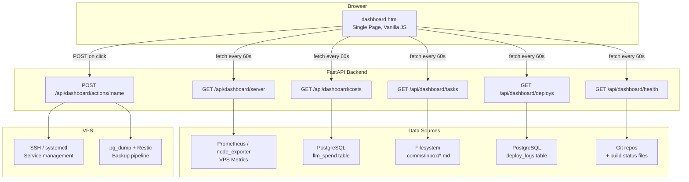
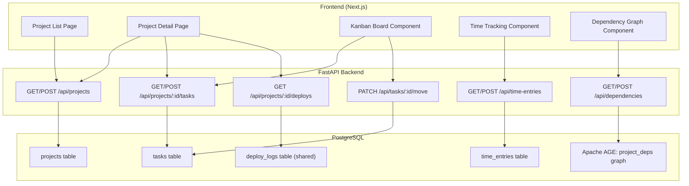
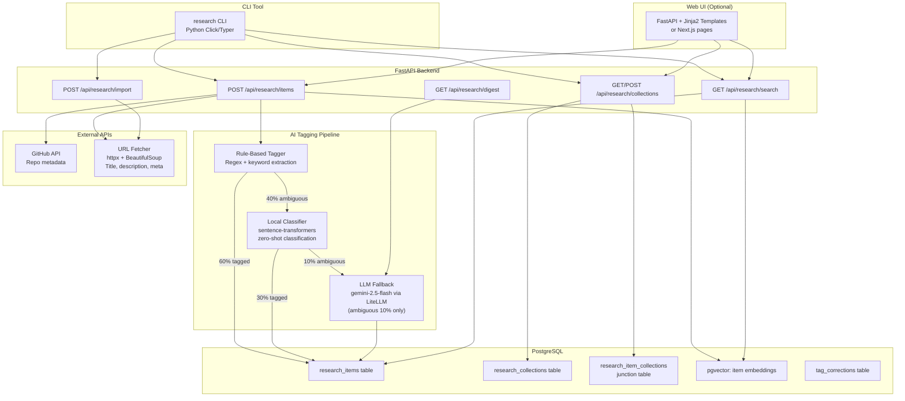

# Personal Productivity Tools — Standalone Developer Toolkit

> **Purpose**: Three standalone personal productivity tools for a solo developer. These are NOT part of uzhavu — they are independent, self-hosted tools for managing servers, projects, research, and daily workflow. All tools share a single PostgreSQL database and follow the same design principles: cost-efficient, self-hosted, no vendor lock-in.
>
> **Context**: Solo developer (Race Raja) running Windows 11 ARM (Snapdragon X, 16GB RAM, no GPU). Deploys on self-hosted VPS. Uses Python (FastAPI), Next.js, PostgreSQL (pgvector + Apache AGE), LiteLLM for AI features. All tools should be lightweight, fast, and runnable locally on the dev machine or the VPS.
>
> **Architecture ref**: `KNOWLEDGE.md` for tech stack, `.comms/context/shared-knowledge.md` for developer preferences, `llm-trace-viewer.md` for LLM cost tracking patterns

---

## Table of Contents

1. [Feature 1: Personal Dashboard](#feature-1-personal-dashboard)
   - [Requirements](#feature-1-requirements)
   - [Design](#feature-1-design)
   - [Tasks](#feature-1-tasks)
2. [Feature 2: Project Manager](#feature-2-project-manager)
   - [Requirements](#feature-2-requirements)
   - [Design](#feature-2-design)
   - [Tasks](#feature-2-tasks)
3. [Feature 3: Research & Bookmark Manager](#feature-3-research--bookmark-manager)
   - [Requirements](#feature-3-requirements)
   - [Design](#feature-3-design)
   - [Tasks](#feature-3-tasks)
4. [Shared Infrastructure](#shared-infrastructure)
5. [Total Effort Summary](#total-effort-summary)

---

# Feature 1: Personal Dashboard

> A single-page, real-time overview of everything the developer cares about: server health, API costs, pending tasks, recent deploys, project health, and quick actions. Built as a static HTML page with vanilla JS — no framework, no build step, just open in a browser.

---

## Feature 1: Requirements

### Story 1.1: Server Status Monitoring

As a **solo developer**, I want to **see my VPS server health at a glance** so that **I know immediately if something is down or resources are running low**.

#### Acceptance Criteria

- GIVEN the dashboard loads WHEN Prometheus/node_exporter is reachable THEN I see a "Server Status" card showing: hostname, uptime (e.g., "47d 12h 33m"), CPU usage % (with color: green <60%, amber 60-85%, red >85%), RAM usage % (with same color thresholds), disk usage % per mount point, and a green/red status dot
- GIVEN the VPS is unreachable WHEN the dashboard polls the metrics API THEN the server card shows a red "OFFLINE" badge with the last successful check timestamp and the error reason (timeout, DNS, connection refused)
- GIVEN the dashboard is open WHEN 60 seconds pass THEN the server metrics auto-refresh without a full page reload (fetch API + DOM update), with a subtle pulse animation on updated values
- GIVEN the VPS CPU exceeds 85% WHEN the dashboard refreshes THEN the CPU value pulses red and the card border turns red to draw immediate attention
- GIVEN the VPS disk usage exceeds 90% WHEN the dashboard refreshes THEN a warning banner appears at the top: "⚠️ Disk usage critical: /dev/sda1 at 93% — consider cleanup"
- GIVEN I want historical context WHEN I hover over any metric THEN a tooltip shows: current value, 1h average, 24h average, and peak value (sourced from Prometheus range queries)

---

### Story 1.2: API Cost Tracking

As a **cost-conscious developer**, I want to **see my LLM API spending in real-time** so that **I can catch runaway costs before they become expensive**.

#### Acceptance Criteria

- GIVEN the dashboard loads WHEN LLM cost data exists THEN I see an "API Costs" card showing: today's spend (e.g., "$2.34"), this week's spend, this month's total, monthly budget (configurable), and budget remaining with a progress bar
- GIVEN today's spend exceeds 80% of the daily budget WHEN the dashboard refreshes THEN the cost card turns amber with a warning icon
- GIVEN today's spend exceeds the daily budget WHEN the dashboard refreshes THEN the cost card turns red with text "OVER BUDGET" and the overage amount (e.g., "$3.12 over $5.00 daily limit")
- GIVEN I want cost breakdown WHEN I click the cost card THEN a dropdown expands showing: cost per model (e.g., "gemini-2.5-flash: $0.82, gpt-4o: $1.52"), cost per project (Life Graph, Uzhavu), and top 5 most expensive calls today
- GIVEN cost data comes from LiteLLM WHEN the dashboard fetches costs THEN it reads from the `llm_spend` table or LiteLLM's spend tracking API, aggregated by day/model/project
- GIVEN I want to configure budgets WHEN I click the gear icon on the cost card THEN a small settings panel lets me set: daily budget ($), monthly budget ($), and alert threshold (%)

---

### Story 1.3: Pending Tasks from .comms

As a **developer managing multiple projects**, I want to **see all pending tasks from my .comms/inbox/ across projects** so that **I never miss an assigned task**.

#### Acceptance Criteria

- GIVEN the dashboard loads WHEN .comms/inbox/ directories have YAML/MD task files THEN I see a "Pending Tasks" card showing: task count badge, list of tasks with title, priority (🔴/🟡/🟢), source project, and creation date
- GIVEN there are tasks from multiple projects WHEN viewing the card THEN tasks are grouped by project (Life Graph, Uzhavu) and sorted by priority (high → medium → low), then by creation date (oldest first)
- GIVEN a task file contains YAML frontmatter with `priority: high` WHEN the dashboard renders THEN the task row has a red left border and a 🔴 icon
- GIVEN there are no pending tasks WHEN the dashboard renders THEN the card shows "✅ No pending tasks" with a green checkmark
- GIVEN I want to see task details WHEN I click a task title THEN a tooltip/panel shows the full task description from the markdown body
- GIVEN a new task appears in .comms/inbox/ WHEN the dashboard refreshes (every 60s) THEN the task count badge pulses briefly to indicate new items
- GIVEN the dashboard needs to scan .comms directories WHEN it fetches tasks THEN it reads from a FastAPI endpoint that scans configured project paths for `.comms/inbox/*.md` files and parses their YAML frontmatter

---

### Story 1.4: Recent Deployments

As a **developer who deploys frequently**, I want to **see my last 5 deployments with status** so that **I can quickly verify if the latest deploy succeeded**.

#### Acceptance Criteria

- GIVEN the dashboard loads WHEN deployment records exist THEN I see a "Recent Deploys" card showing the last 5 deployments with: project name, environment (prod/staging), status (✅ success / ❌ failed / 🔄 deploying), deploy time (relative, e.g., "2h ago"), commit hash (short, linkable), and duration
- GIVEN a deployment failed WHEN viewing the card THEN the failed deploy row is highlighted in red with an expandable error message (last 5 lines of deploy log)
- GIVEN a deployment is currently in progress WHEN viewing the card THEN the row shows a spinning indicator with elapsed time, and auto-updates every 10 seconds
- GIVEN I want to see the deploy diff WHEN I click the commit hash THEN it opens the Git diff URL in a new tab (e.g., GitHub/Gitea compare link)
- GIVEN deployment records come from various sources WHEN the API aggregates them THEN it reads from: deploy scripts that write to a deploy_log table, or git tags, or CI/CD webhook payloads

---

### Story 1.5: Project Health Overview

As a **developer managing multiple projects**, I want to **see build status and test results per project** so that **I can spot broken builds without checking each project individually**.

#### Acceptance Criteria

- GIVEN the dashboard loads WHEN project health data exists THEN I see a "Project Health" card with a row per project: project name, build status (✅ passing / ❌ failing / ⚠️ warnings), last build time, test pass rate (e.g., "47/50 tests passing"), and last commit message (truncated to 60 chars)
- GIVEN a project's build is failing WHEN viewing the card THEN the project row is highlighted in red with the failure reason (first line of build error)
- GIVEN a project has no recent builds WHEN viewing the card THEN the row shows "No recent builds" in gray with the last known status
- GIVEN I want more detail WHEN I click a project row THEN it expands to show: last 3 build results, test failure details (which tests failed), and a link to the project directory
- GIVEN health data comes from multiple sources WHEN the API collects it THEN it reads from: `git log` (last commit), build scripts that write status to a JSON file or DB table, and pytest/jest result files

---

### Story 1.6: Quick Actions

As a **developer who repeats common operations**, I want to **trigger deployments, service restarts, and backups from the dashboard** so that **I don't have to SSH into the VPS for routine tasks**.

#### Acceptance Criteria

- GIVEN the dashboard loads WHEN quick actions are configured THEN I see a "Quick Actions" bar with buttons: "Deploy [project]" (dropdown for project selection), "Restart Service" (dropdown: API, web, DB, all), "Run Backup", "Clear Cache", and custom actions
- GIVEN I click "Deploy Life Graph" WHEN the action triggers THEN the dashboard sends a POST request to the actions API, which executes the deploy script in the background, and the Recent Deploys card updates in real-time with the new deploy status
- GIVEN I click "Restart Service → API" WHEN the action triggers THEN the API sends a `systemctl restart` command via SSH to the VPS and returns the result (success/failure) within 10 seconds
- GIVEN I click "Run Backup" WHEN the action triggers THEN the API starts `pg_dump` + Restic backup in the background, and the button shows a spinner with progress updates (dumping → uploading → done)
- GIVEN a quick action fails WHEN the error is caught THEN a red toast notification appears with the error message and a "View Logs" link
- GIVEN I want to add custom actions WHEN I edit the config file THEN I can define actions as: `{ name, command, confirm: true/false, icon, color }` — actions with `confirm: true` show a confirmation dialog before executing
- GIVEN quick actions execute commands on the VPS WHEN security is considered THEN all action endpoints require an API key header, actions are logged to an audit table, and dangerous actions (restart DB, delete data) require explicit confirmation

---

### Story 1.7: Dashboard Layout & Auto-Refresh

As a **developer who leaves the dashboard open**, I want to **see a well-organized, auto-refreshing single page** so that **it serves as my always-on command center**.

#### Acceptance Criteria

- GIVEN I open the dashboard WHEN the page loads THEN I see a dark-themed, responsive single-page layout with cards arranged in a grid: top row (Server Status, API Costs), middle row (Pending Tasks, Recent Deploys), bottom row (Project Health, Quick Actions)
- GIVEN the dashboard is open WHEN 60 seconds pass THEN all cards auto-refresh their data without a full page reload (each card fetches independently, staggered by 2 seconds to avoid burst requests)
- GIVEN the browser tab is not focused WHEN the dashboard would normally refresh THEN it pauses auto-refresh to save resources (using `document.visibilitychange` API), and resumes + immediately refreshes when the tab is re-focused
- GIVEN the dashboard needs to be lightweight WHEN implemented THEN it uses: single HTML file (<500 lines), vanilla JS (no React, no framework), CSS variables for theming, fetch API for data, and no build step — just open `index.html` in a browser
- GIVEN the dashboard is served WHEN the user accesses it THEN it can be served from the FastAPI backend as a static file at `/dashboard` or opened directly as a local file
- GIVEN the developer wants customization WHEN they edit the config THEN they can: reorder cards, hide cards, change refresh interval, set custom color themes (dark/light/auto), and configure which projects/servers to monitor

---

### Wireframe Description: Personal Dashboard

```
┌──────────────────────────────────────────────────────────────────────────────────┐
│  🖥️  RACE DASHBOARD              Last refresh: 2 sec ago    ⚙️ Settings    🔄   │
├──────────────────────────────────────────────────────────────────────────────────┤
│                                                                                  │
│  ┌─────────────────────────────┐  ┌──────────────────────────────────────────┐   │
│  │ 🟢 SERVER STATUS            │  │ 💰 API COSTS                             │   │
│  │                             │  │                                          │   │
│  │ race-vps │ UP 47d 12h      │  │  Today      $2.34  ████████░░  47%      │   │
│  │                             │  │  This Week  $14.20                       │   │
│  │ CPU   ████████░░░  72%     │  │  This Month $38.50 / $80.00 budget      │   │
│  │ RAM   ██████░░░░░  58%     │  │                                          │   │
│  │ Disk  █████████░░  87%     │  │  ┌────────────────────────────────────┐  │   │
│  │                             │  │  │ gemini-flash  $0.82  ▓▓▓▓░░░░░░  │  │   │
│  │ Load: 1.2 │ Swap: 12%     │  │  │ gpt-4o        $1.52  ▓▓▓▓▓▓▓░░░  │  │   │
│  └─────────────────────────────┘  │  └────────────────────────────────────┘  │   │
│                                    └──────────────────────────────────────────┘   │
│                                                                                  │
│  ┌─────────────────────────────┐  ┌──────────────────────────────────────────┐   │
│  │ 📋 PENDING TASKS        (4) │  │ 🚀 RECENT DEPLOYS                       │   │
│  │                             │  │                                          │   │
│  │ Life Graph                  │  │  ✅ life-graph   prod   2h ago    12s   │   │
│  │  🔴 Fix memory retrieval   │  │  ✅ uzhavu       prod   1d ago    45s   │   │
│  │  🟡 Add tag extraction     │  │  ❌ life-graph   stg    1d ago    8s    │   │
│  │                             │  │  ✅ uzhavu       stg    2d ago    38s   │   │
│  │ Uzhavu                     │  │  ✅ life-graph   prod   3d ago    15s   │   │
│  │  🔴 WhatsApp bot setup     │  │                                          │   │
│  │  🟢 Update API docs        │  │  Commit: a3f8b2c "fix: memory decay..."  │   │
│  └─────────────────────────────┘  └──────────────────────────────────────────┘   │
│                                                                                  │
│  ┌─────────────────────────────┐  ┌──────────────────────────────────────────┐   │
│  │ 🏥 PROJECT HEALTH           │  │ ⚡ QUICK ACTIONS                         │   │
│  │                             │  │                                          │   │
│  │ Life Graph  ✅ passing      │  │  [🚀 Deploy ▾]  [🔄 Restart ▾]         │   │
│  │  47/50 tests │ 2h ago      │  │                                          │   │
│  │  "fix: memory decay scor…" │  │  [💾 Run Backup] [🧹 Clear Cache]       │   │
│  │                             │  │                                          │   │
│  │ Uzhavu      ⚠️ warnings    │  │  [📊 Rebuild Index] [🔍 Health Check]   │   │
│  │  112/115 tests │ 5h ago    │  │                                          │   │
│  │  "feat: product factory…"  │  │  Last action: Backup completed 3h ago    │   │
│  └─────────────────────────────┘  └──────────────────────────────────────────┘   │
│                                                                                  │
│  ┌──────────────────────────────────────────────────────────────────────────────┐ │
│  │ 📊 ACTIVITY TIMELINE (24h)                                                   │ │
│  │  ▂▃▅▇█▇▅▃▂▁▁▂▃▄▅▆▇█▇▅▃▂▁  commits  ░░▓▓░░▓░░░░░▓▓░▓░░░░▓░░░░  deploys  │ │
│  │  12am    4am    8am    12pm    4pm    8pm    12am                             │ │
│  └──────────────────────────────────────────────────────────────────────────────┘ │
└──────────────────────────────────────────────────────────────────────────────────┘
```

---

## Feature 1: Design

### Architecture Overview



### Key Design Decisions

1. **Single HTML file with no build step** — The dashboard is a single `dashboard.html` file with inline CSS and JS. No React, no npm, no Webpack. Open it in a browser or serve it from FastAPI. This maximizes simplicity and minimizes maintenance.
2. **FastAPI as the data aggregation layer** — The dashboard doesn't talk to Prometheus, Git, or the filesystem directly. A lightweight FastAPI app aggregates all data sources into clean JSON endpoints. This means the dashboard can be served anywhere (local, VPS, CDN) while the API handles the complexity.
3. **Staggered refresh** — Each card refreshes independently with a 2-second stagger: server at 0s, costs at 2s, tasks at 4s, deploys at 6s, health at 8s. This avoids burst requests and makes the dashboard feel alive with cascading updates.
4. **Quick actions via SSH** — The FastAPI backend SSHes into the VPS (using paramiko) to execute commands. Actions are defined in a YAML config file. All actions are logged to an audit table. Dangerous actions require a `confirm: true` flag.
5. **CSS variables for theming** — The entire color scheme is controlled by CSS custom properties. Switching between dark/light mode is a single class toggle. No CSS framework needed.
6. **Prometheus integration via PromQL** — Server metrics are fetched by querying Prometheus's HTTP API with PromQL expressions. This gives us instant access to CPU, RAM, disk, network, load average, and any custom metrics.

### Data Models

```sql
-- ============================================================
-- LLM Spend Tracking (aggregated daily costs)
-- ============================================================
CREATE TABLE llm_spend (
  id              TEXT PRIMARY KEY DEFAULT gen_random_uuid()::text,
  date            DATE NOT NULL,
  model           TEXT NOT NULL,
  project         TEXT,                                    -- 'life-graph', 'uzhavu', 'personal-tools'
  prompt_tokens   INT NOT NULL DEFAULT 0,
  completion_tokens INT NOT NULL DEFAULT 0,
  total_tokens    INT NOT NULL DEFAULT 0,
  cost_usd        DECIMAL(10,6) NOT NULL DEFAULT 0,
  call_count      INT NOT NULL DEFAULT 0,
  created_at      TIMESTAMPTZ NOT NULL DEFAULT NOW(),
  updated_at      TIMESTAMPTZ NOT NULL DEFAULT NOW(),

  UNIQUE(date, model, project)
);

CREATE INDEX idx_ls_date ON llm_spend(date DESC);
CREATE INDEX idx_ls_date_model ON llm_spend(date, model);
CREATE INDEX idx_ls_date_project ON llm_spend(date, project);

-- ============================================================
-- Deploy Logs (deployment history)
-- ============================================================
CREATE TABLE deploy_logs (
  id              TEXT PRIMARY KEY DEFAULT gen_random_uuid()::text,
  project         TEXT NOT NULL,                           -- 'life-graph', 'uzhavu'
  environment     TEXT NOT NULL DEFAULT 'production',      -- 'production', 'staging'
  status          TEXT NOT NULL DEFAULT 'deploying'        -- 'deploying', 'success', 'failed', 'rolled_back'
                  CHECK (status IN ('deploying', 'success', 'failed', 'rolled_back')),
  commit_hash     TEXT,                                    -- Short git hash
  commit_message  TEXT,                                    -- First line of commit message
  branch          TEXT DEFAULT 'main',
  duration_sec    INT,                                     -- Deploy duration in seconds
  error_log       TEXT,                                    -- Last N lines of error output if failed
  triggered_by    TEXT DEFAULT 'manual',                   -- 'manual', 'webhook', 'scheduled'
  started_at      TIMESTAMPTZ NOT NULL DEFAULT NOW(),
  completed_at    TIMESTAMPTZ,
  created_at      TIMESTAMPTZ NOT NULL DEFAULT NOW()
);

CREATE INDEX idx_dl_project ON deploy_logs(project, created_at DESC);
CREATE INDEX idx_dl_status ON deploy_logs(status, created_at DESC);

-- ============================================================
-- Quick Action Audit Log
-- ============================================================
CREATE TABLE action_audit_log (
  id              TEXT PRIMARY KEY DEFAULT gen_random_uuid()::text,
  action_name     TEXT NOT NULL,                           -- 'deploy', 'restart', 'backup', etc.
  action_config   JSONB DEFAULT '{}',                     -- Parameters passed to the action
  status          TEXT NOT NULL DEFAULT 'started'          -- 'started', 'success', 'failed'
                  CHECK (status IN ('started', 'success', 'failed')),
  output          TEXT,                                    -- Command output (stdout/stderr)
  error           TEXT,                                    -- Error message if failed
  duration_ms     INT,
  created_at      TIMESTAMPTZ NOT NULL DEFAULT NOW()
);

CREATE INDEX idx_aal_name ON action_audit_log(action_name, created_at DESC);

-- ============================================================
-- Dashboard Config (budgets, refresh intervals, card order)
-- ============================================================
CREATE TABLE dashboard_config (
  key             TEXT PRIMARY KEY,                        -- e.g., 'daily_budget', 'monthly_budget', 'refresh_interval'
  value           JSONB NOT NULL,
  updated_at      TIMESTAMPTZ NOT NULL DEFAULT NOW()
);
```

### API Endpoints

**Base Path: `/api/dashboard`**

---

#### GET `/api/dashboard/server`

**Fetch VPS server metrics from Prometheus.**

```python
# Response: 200 OK
{
  "hostname": "race-vps",
  "status": "online",                    # "online" | "offline"
  "uptime_seconds": 4108800,
  "uptime_human": "47d 12h 33m",
  "cpu": {
    "usage_pct": 72.3,
    "cores": 4,
    "load_1m": 1.2,
    "load_5m": 0.9,
    "load_15m": 0.7
  },
  "memory": {
    "usage_pct": 58.2,
    "total_gb": 8.0,
    "used_gb": 4.66,
    "available_gb": 3.34
  },
  "disk": [
    {
      "mount": "/",
      "usage_pct": 87.1,
      "total_gb": 100,
      "used_gb": 87.1,
      "available_gb": 12.9
    }
  ],
  "swap_usage_pct": 12.0,
  "last_checked": "2026-07-06T05:10:00Z"
}
```

**Implementation:**
```python
# app/api/dashboard/server.py
from prometheus_api_client import PrometheusConnect

async def get_server_metrics():
    prom = PrometheusConnect(url=settings.PROMETHEUS_URL)

    cpu = prom.custom_query('100 - (avg(rate(node_cpu_seconds_total{mode="idle"}[5m])) * 100)')
    memory = prom.custom_query('(1 - node_memory_MemAvailable_bytes / node_memory_MemTotal_bytes) * 100')
    disk = prom.custom_query('(1 - node_filesystem_avail_bytes{mountpoint="/"} / node_filesystem_size_bytes{mountpoint="/"}) * 100')
    uptime = prom.custom_query('node_time_seconds - node_boot_time_seconds')

    return ServerMetrics(
        hostname="race-vps",
        status="online",
        uptime_seconds=int(float(uptime[0]['value'][1])),
        cpu=CpuMetrics(usage_pct=round(float(cpu[0]['value'][1]), 1)),
        memory=MemoryMetrics(usage_pct=round(float(memory[0]['value'][1]), 1)),
        disk=[DiskMetrics(mount="/", usage_pct=round(float(disk[0]['value'][1]), 1))]
    )
```

---

#### GET `/api/dashboard/costs`

**Fetch LLM API spend aggregated by day/model/project.**

**Query Parameters:**
```
period=today|week|month (default: today)
```

```python
# Response: 200 OK
{
  "today": {
    "total_usd": 2.34,
    "by_model": {
      "gemini-2.5-flash": 0.82,
      "gpt-4o": 1.52
    },
    "by_project": {
      "life-graph": 1.80,
      "uzhavu": 0.54
    },
    "call_count": 147,
    "total_tokens": 285000
  },
  "week": { "total_usd": 14.20 },
  "month": { "total_usd": 38.50 },
  "budget": {
    "daily_usd": 5.00,
    "monthly_usd": 80.00,
    "daily_pct": 46.8,
    "monthly_pct": 48.1,
    "daily_remaining": 2.66,
    "monthly_remaining": 41.50
  },
  "top_expensive_calls": [
    {
      "model": "gpt-4o",
      "tokens": 12500,
      "cost_usd": 0.35,
      "project": "life-graph",
      "timestamp": "2026-07-06T04:23:00Z"
    }
  ]
}
```

---

#### GET `/api/dashboard/tasks`

**Scan .comms/inbox/ directories for pending task files.**

```python
# Response: 200 OK
{
  "total": 4,
  "by_project": {
    "life-graph": [
      {
        "id": "task-001",
        "title": "Fix memory retrieval latency",
        "priority": "high",
        "created": "2026-07-05T10:00:00Z",
        "file_path": "d:/DevTools/Projects/agents/.comms/inbox/task-001.md",
        "description_preview": "Memory retrieval is taking 3s+ for complex queries..."
      },
      {
        "id": "task-002",
        "title": "Add tag extraction pipeline",
        "priority": "medium",
        "created": "2026-07-04T14:00:00Z",
        "file_path": "d:/DevTools/Projects/agents/.comms/inbox/task-002.md",
        "description_preview": "Implement rule-based tag extraction using spaCy..."
      }
    ],
    "uzhavu": [
      {
        "id": "task-003",
        "title": "WhatsApp bot setup",
        "priority": "high",
        "created": "2026-07-03T09:00:00Z"
      }
    ]
  }
}
```

---

#### GET `/api/dashboard/deploys`

**Fetch last N deployment records.**

**Query Parameters:**
```
limit=5 (default: 5, max: 20)
```

```python
# Response: 200 OK
{
  "deploys": [
    {
      "id": "dep_abc123",
      "project": "life-graph",
      "environment": "production",
      "status": "success",
      "commit_hash": "a3f8b2c",
      "commit_message": "fix: memory decay scoring edge case",
      "branch": "main",
      "duration_sec": 12,
      "started_at": "2026-07-06T03:15:00Z",
      "completed_at": "2026-07-06T03:15:12Z"
    }
  ]
}
```

---

#### GET `/api/dashboard/health`

**Fetch build status and test results per project.**

```python
# Response: 200 OK
{
  "projects": [
    {
      "name": "Life Graph",
      "slug": "life-graph",
      "repo_path": "d:/DevTools/Projects/agents",
      "build_status": "passing",           # "passing" | "failing" | "warnings" | "unknown"
      "last_build_at": "2026-07-06T03:10:00Z",
      "tests": {
        "total": 50,
        "passed": 47,
        "failed": 3,
        "skipped": 0,
        "pass_rate_pct": 94.0
      },
      "last_commit": {
        "hash": "a3f8b2c",
        "message": "fix: memory decay scoring edge case",
        "author": "Race Raja",
        "date": "2026-07-06T03:00:00Z"
      },
      "failing_tests": [
        "test_memory_consolidation_cycle",
        "test_proactive_recall_timeout",
        "test_graph_traversal_depth"
      ]
    }
  ]
}
```

---

#### POST `/api/dashboard/actions/{action_name}`

**Execute a quick action (deploy, restart, backup, etc.).**

**Headers:**
```
X-API-Key: <dashboard-api-key>
```

**Request Body:**
```json
{
  "params": {
    "project": "life-graph",
    "environment": "production"
  }
}
```

**Response: `202 Accepted`**
```json
{
  "action_id": "act_xyz789",
  "action_name": "deploy",
  "status": "started",
  "message": "Deployment started for life-graph (production)"
}
```

### Quick Action Config File

```yaml
# config/actions.yaml
actions:
  deploy:
    name: "Deploy"
    icon: "🚀"
    command: "cd /opt/{project} && git pull && ./deploy.sh {environment}"
    confirm: true
    params:
      - name: project
        type: select
        options: ["life-graph", "uzhavu"]
      - name: environment
        type: select
        options: ["production", "staging"]

  restart:
    name: "Restart Service"
    icon: "🔄"
    command: "systemctl restart {service}"
    confirm: true
    params:
      - name: service
        type: select
        options: ["life-graph-api", "uzhavu-api", "uzhavu-web", "postgresql", "nginx"]

  backup:
    name: "Run Backup"
    icon: "💾"
    command: "/opt/scripts/backup.sh"
    confirm: false
    timeout_sec: 600

  clear_cache:
    name: "Clear Cache"
    icon: "🧹"
    command: "redis-cli FLUSHDB && echo 'Cache cleared'"
    confirm: true

  health_check:
    name: "Health Check"
    icon: "🔍"
    command: "/opt/scripts/health-check.sh"
    confirm: false
```

### Tech Stack

| Component | Technology | Rationale |
|:----------|:-----------|:----------|
| Frontend | Single HTML + vanilla JS + CSS variables | No build step, instant load, zero dependencies |
| Backend API | FastAPI (Python) | Already the developer's preferred backend |
| Server Metrics | Prometheus + node_exporter | Industry standard, already running on VPS |
| Database | PostgreSQL | Shared with all other tools |
| VPS Commands | paramiko (SSH) | Execute remote commands securely |
| Config | YAML files | Human-readable, easy to edit |

---

## Feature 1: Tasks

### Phase 1.1: Backend API (~2.5 days)

- [ ] Create FastAPI project structure: `personal-tools/dashboard/` with `main.py`, `config.py`, `models.py`, `routers/` (~1h)
- [ ] Implement `config.py` — load dashboard config from YAML: projects list, Prometheus URL, SSH credentials, budget settings, action definitions (~1.5h)
- [ ] Implement `/api/dashboard/server` endpoint — connect to Prometheus HTTP API, execute PromQL queries for CPU/RAM/disk/uptime/load, handle connection failures gracefully (~3h)
- [ ] Implement `/api/dashboard/costs` endpoint — query `llm_spend` table with date aggregation, group by model/project, calculate budget percentages, find top expensive calls (~3h)
- [ ] Implement `/api/dashboard/tasks` endpoint — scan configured `.comms/inbox/` directories, parse YAML frontmatter from `.md` files, sort by priority/date, group by project (~2h)
- [ ] Implement `/api/dashboard/deploys` endpoint — query `deploy_logs` table, return last N deploys with all fields (~1h)
- [ ] Implement `/api/dashboard/health` endpoint — for each configured project: run `git log -1`, read build status file (JSON), read test results file (pytest JSON / jest JSON), aggregate (~3h)
- [ ] Implement `/api/dashboard/actions/{name}` endpoint — load action from config YAML, validate params, execute via SSH (paramiko) in background task, write to audit log, return action ID (~4h)
- [ ] Create SQL migration script for `llm_spend`, `deploy_logs`, `action_audit_log`, `dashboard_config` tables (~1h)
- [ ] Add API key authentication middleware for action endpoints (~1h)

### Phase 1.2: Frontend Dashboard (~2 days)

- [ ] Create `dashboard.html` — base HTML structure with CSS variables for dark theme, responsive grid layout, Google Fonts (Inter) (~2h)
- [ ] Implement server status card — fetch `/server`, render CPU/RAM/disk bars with color thresholds, uptime display, status dot (~2h)
- [ ] Implement API costs card — fetch `/costs`, render budget progress bar, model breakdown, expandable detail section (~2h)
- [ ] Implement pending tasks card — fetch `/tasks`, render grouped task list with priority icons, count badge, click-to-expand description (~1.5h)
- [ ] Implement recent deploys card — fetch `/deploys`, render deploy rows with status icons, relative time, commit hash links (~1.5h)
- [ ] Implement project health card — fetch `/health`, render build status with test counts, expandable failure details (~1.5h)
- [ ] Implement quick actions bar — render action buttons from API, dropdown selectors for params, confirmation dialogs, loading spinners (~2h)
- [ ] Implement auto-refresh system — staggered 60s refresh per card, visibility API pause/resume, pulse animation on updated values (~1.5h)
- [ ] Implement toast notification system — success/error toasts for quick actions, auto-dismiss after 5 seconds (~1h)

### Phase 1.3: Testing & Polish (~1 day)

- [ ] Write unit tests for each API endpoint with mocked Prometheus, filesystem, and DB responses (~2h)
- [ ] Test dashboard in Chrome and Firefox — verify responsive layout, dark mode, auto-refresh (~1h)
- [ ] Test quick actions end-to-end — deploy, restart, backup with mock SSH (~1.5h)
- [ ] Add error states for all cards — network errors, empty data, partial failures (~1h)
- [ ] Add loading skeletons for initial page load (~0.5h)
- [ ] Write deployment script for the dashboard API (systemd service file) (~0.5h)
- [ ] Document configuration in README.md (~0.5h)

**Feature 1 Total: ~5.5 days**

---

# Feature 2: Project Manager

> A centralized project management tool to track all projects (Life Graph, Uzhavu, future apps) with task boards, time tracking, dependency mapping, and deploy status. Replaces scattered notes and .comms task files with a proper system.

---

## Feature 2: Requirements

### Story 2.1: Project Registry

As a **developer managing multiple projects**, I want to **see all my projects in one place with their current status** so that **I have a single source of truth for what I'm working on**.

#### Acceptance Criteria

- GIVEN I navigate to the Project Manager WHEN projects exist THEN I see a project list/grid with: project name, status badge (active/paused/archived), tech stack tags, git repo link, last commit (date + message), deploy status (last deploy result), and a health indicator
- GIVEN I click "New Project" WHEN the creation form appears THEN I can enter: name, slug, description, git repo URL, local path, tech stack tags, status, deploy config (server, branch, script path), and related projects
- GIVEN I edit a project WHEN I update the git repo URL THEN the system validates the URL is accessible and shows the current branch and last commit
- GIVEN a project has `status: active` WHEN viewing the project list THEN it appears at the top with full details; archived projects are collapsed at the bottom with minimal info
- GIVEN I want to see project details WHEN I click a project card THEN I navigate to the project detail page showing: overview, task board, time log, dependencies, and deploy history
- GIVEN the project registry stores data WHEN I query the database THEN all project metadata is stored in a `projects` table with JSONB `config` for flexible per-project settings

---

### Story 2.2: Task Board (Kanban)

As a **developer tracking work**, I want to **a kanban board with columns for each project** so that **I can see what's in progress, what's blocked, and what's done**.

#### Acceptance Criteria

- GIVEN I open a project's task board WHEN tasks exist THEN I see a kanban board with 4 columns: Backlog, In Progress, Review, Done — each showing task cards with: title, priority (🔴🟡🟢), tags, assignee (if applicable), due date, and time spent
- GIVEN I want to create a task WHEN I click "+" on any column THEN a task creation form appears with: title, description (markdown), priority (high/medium/low), tags, estimated hours, due date, and column placement
- GIVEN I want to move a task WHEN I drag a task card from "Backlog" to "In Progress" THEN the task's status updates to `in_progress` and the move is logged with a timestamp
- GIVEN I click a task card WHEN the detail panel opens THEN I see: full description (rendered markdown), time log entries, status history (with timestamps), comments/notes, subtasks (checkbox list), and related tasks
- GIVEN I want to filter tasks WHEN I use the filter bar THEN I can filter by: priority, tag, status, date range, and search by title/description (full-text search)
- GIVEN I want to see tasks across all projects WHEN I navigate to "All Tasks" THEN I see a unified view of all tasks across projects, filterable by project
- GIVEN I complete a task WHEN I drag it to "Done" THEN the completion time is recorded and the time tracking for that task is stopped automatically
- GIVEN the task board uses drag-and-drop WHEN implementing THEN use the HTML5 Drag and Drop API (no library needed) with smooth animations and visual drop targets

---

### Story 2.3: Time Tracking

As a **developer wanting to understand where my time goes**, I want to **track time spent per project and per task** so that **I can optimize my work allocation**.

#### Acceptance Criteria

- GIVEN I am on a task detail WHEN I click "Start Timer" THEN a timer starts counting (displayed in the task card as "⏱ 1h 23m") and a time entry is created with `start_time = NOW()`
- GIVEN a timer is running WHEN I click "Stop Timer" THEN the timer stops, `end_time` is recorded, and the duration is added to the task's total time
- GIVEN I forgot to start a timer WHEN I click "Add Manual Entry" THEN I can enter: date, start time, end time, and a note describing what I worked on
- GIVEN I want to see my time allocation WHEN I view the "Time" tab THEN I see: today's total hours, this week's total, a bar chart showing hours per project per day (last 7 days), and a breakdown of time per task
- GIVEN I want weekly time reports WHEN I view "Weekly Report" THEN I see: total hours, hours per project, hours per priority (how much time on high-priority vs low-priority), and a comparison to the previous week
- GIVEN time entries are stored WHEN querying THEN each entry has: task_id, project_id, start_time, end_time, duration_minutes, and note

---

### Story 2.4: Project Dependencies

As a **developer with interconnected projects**, I want to **see which projects depend on which** so that **I know the impact of changes across my ecosystem**.

#### Acceptance Criteria

- GIVEN I open the Dependencies view WHEN dependencies exist THEN I see a directed graph showing projects as nodes and dependencies as edges (e.g., "Uzhavu → Life Graph" meaning Uzhavu uses Life Graph's memory API)
- GIVEN I edit a project's dependencies WHEN I add a dependency THEN I specify: depends_on project, dependency type (API, shared DB, shared code, data flow), and a description of the relationship
- GIVEN the graph is rendered WHEN I hover over an edge THEN a tooltip shows the dependency type and description
- GIVEN I want to see upstream/downstream WHEN I click a project node THEN it highlights all direct and transitive dependencies (upstream: what this depends on, downstream: what depends on this)
- GIVEN the dependency graph is implemented WHEN rendering THEN it uses Apache AGE's graph queries to store and traverse relationships, and Mermaid.js or a simple SVG renderer for the visual graph
- GIVEN dependencies change impact assessment WHEN I select a project and click "Impact Analysis" THEN I see: "Changing Life Graph will affect: Uzhavu (API dependency), Personal Dashboard (data dependency)"

---

### Story 2.5: Deploy Status Integration

As a **developer who deploys from the project manager**, I want to **see deploy history and trigger deploys per project** so that **I have deployment context alongside my task board**.

#### Acceptance Criteria

- GIVEN I view a project's detail page WHEN deploy history exists THEN I see a "Deploys" tab showing the last 10 deployments with: status, environment, commit, duration, and timestamp (reuses the `deploy_logs` table from Feature 1)
- GIVEN I want to deploy WHEN I click "Deploy" on a project THEN the system uses the project's deploy config (server, branch, script) to trigger a deployment via the same quick actions API from the dashboard
- GIVEN a deploy is in progress WHEN viewing the project THEN a banner shows "🔄 Deploying to production... (45s elapsed)" with a cancel button
- GIVEN I want to rollback WHEN I click "Rollback" on a failed deploy THEN the system deploys the previous successful commit using `git checkout <previous_hash> && ./deploy.sh`

---

### Wireframe Description: Project Manager

```
┌──────────────────────────────────────────────────────────────────────────────────┐
│  📁 PROJECT MANAGER                    [+ New Project]    [All Tasks]  [Time]   │
├──────────────────────────────────────────────────────────────────────────────────┤
│                                                                                  │
│  ┌─────────────────────────────────────────────────────────────────────────────┐ │
│  │ 🔍 Search projects...    Filter: [Active ▾] [All Tags ▾]                   │ │
│  └─────────────────────────────────────────────────────────────────────────────┘ │
│                                                                                  │
│  ┌──────────────────────┐  ┌──────────────────────┐  ┌──────────────────────┐   │
│  │ 🧠 Life Graph        │  │ 🌱 Uzhavu            │  │ 🔧 Personal Tools    │   │
│  │ ● Active             │  │ ● Active             │  │ ● Active             │   │
│  │                      │  │                      │  │                      │   │
│  │ Python • FastAPI     │  │ Next.js • NestJS     │  │ FastAPI • HTML       │   │
│  │ PostgreSQL • CrewAI  │  │ FastAPI • PostgreSQL │  │ PostgreSQL           │   │
│  │                      │  │                      │  │                      │   │
│  │ 📊 47/50 tests ✅    │  │ 📊 112/115 tests ⚠️  │  │ 📊 No tests yet     │   │
│  │ 🚀 Deployed 2h ago  │  │ 🚀 Deployed 1d ago  │  │ 🚀 Not deployed     │   │
│  │ 📝 a3f8b2c 3h ago   │  │ 📝 f1e2d3a 5h ago   │  │ 📝 New project      │   │
│  │                      │  │                      │  │                      │   │
│  │ Tasks: 12 (3 active) │  │ Tasks: 28 (5 active) │  │ Tasks: 8 (2 active)  │   │
│  │ Time: 4.5h today    │  │ Time: 2h today       │  │ Time: 1h today      │   │
│  │ [Open Board] [Deploy]│  │ [Open Board] [Deploy]│  │ [Open Board]        │   │
│  └──────────────────────┘  └──────────────────────┘  └──────────────────────┘   │
│                                                                                  │
├──────────────────────────────────────────────────────────────────────────────────┤
│                                                                                  │
│  ── Life Graph Task Board ──────────────────────────────────────────────────     │
│                                                                                  │
│  Backlog (5)          In Progress (3)     Review (1)          Done (3)           │
│  ┌────────────────┐   ┌────────────────┐  ┌────────────────┐ ┌────────────────┐ │
│  │ 🟡 Add decay   │   │ 🔴 Fix memory  │  │ 🟡 Update CLI  │ │ ✅ Setup DB    │ │
│  │ scoring logic  │   │ retrieval      │  │ help docs      │ │ migrations     │ │
│  │ ~3h  #memory   │   │ ⏱ 2h 15m      │  │ ~1h  #docs     │ │ 1.5h  ✓       │ │
│  ├────────────────┤   │ ~4h  #core     │  └────────────────┘ ├────────────────┤ │
│  │ 🟢 Write tests │   ├────────────────┤                     │ ✅ Init pgvec  │ │
│  │ for graph API  │   │ 🔴 Tag extract │                     │ 2h  ✓         │ │
│  │ ~2h  #testing  │   │ pipeline       │                     ├────────────────┤ │
│  ├────────────────┤   │ ⏱ 45m         │                     │ ✅ Docker      │ │
│  │ 🟢 Add config  │   │ ~6h  #nlp      │                     │ compose setup  │ │
│  │ validation     │   ├────────────────┤                     │ 3h  ✓         │ │
│  │ ~1h  #infra    │   │ 🟡 CrewAI      │                     └────────────────┘ │
│  ├────────────────┤   │ agent setup    │                                         │
│  │ [+ Add Task]   │   │ ⏱ 1h 30m      │                                         │
│  └────────────────┘   │ ~8h  #agents   │                                         │
│                        └────────────────┘                                         │
└──────────────────────────────────────────────────────────────────────────────────┘
```

---

## Feature 2: Design

### Architecture Overview



### Key Design Decisions

1. **Next.js frontend for the Project Manager** — Unlike the dashboard (which is a single HTML page), the Project Manager has multiple pages, interactive components (kanban drag-and-drop, time tracking, graphs), and needs routing. Next.js is the developer's preferred frontend framework.
2. **FastAPI backend (shared with Dashboard)** — The same FastAPI app serves both the dashboard API and the project manager API. Different routers, same process. This minimizes infrastructure.
3. **Apache AGE for dependency graph** — Project dependencies are a natural graph problem. Rather than a junction table, we use Apache AGE (already in the stack) to store and traverse dependency relationships. This enables transitive dependency queries ("what breaks if I change Life Graph?") with a single Cypher query.
4. **HTML5 Drag and Drop for Kanban** — No library needed. The HTML5 Drag and Drop API is sufficient for a single-user kanban board. We add CSS transitions for smooth card movement and visual drop zone highlighting.
5. **Time tracking with active timer** — The backend stores time entries with start/end times. The frontend manages the active timer state. If the browser closes with a timer running, the entry stays open and can be closed manually later ("You have an open timer from 3h ago — stop or discard?").
6. **Shared deploy_logs table** — Both the Dashboard and Project Manager read from the same `deploy_logs` table. Deploys triggered from either UI write to the same table. Single source of truth.

### Data Models

```sql
-- ============================================================
-- Projects (registry of all projects)
-- ============================================================
CREATE TABLE projects (
  id              TEXT PRIMARY KEY DEFAULT gen_random_uuid()::text,
  name            TEXT NOT NULL,
  slug            TEXT NOT NULL UNIQUE,                    -- URL-safe identifier
  description     TEXT,
  status          TEXT NOT NULL DEFAULT 'active'           -- 'active', 'paused', 'archived'
                  CHECK (status IN ('active', 'paused', 'archived')),
  git_repo_url    TEXT,                                    -- e.g., 'https://github.com/user/repo'
  local_path      TEXT,                                    -- e.g., 'd:/DevTools/Projects/agents'
  tech_stack      TEXT[] DEFAULT '{}',                     -- e.g., ['python', 'fastapi', 'postgresql']
  config          JSONB DEFAULT '{}',                     -- Flexible config: deploy settings, build commands, etc.
  -- config schema:
  -- {
  --   "deploy": { "server": "race-vps", "branch": "main", "script": "/opt/deploy.sh" },
  --   "build": { "command": "pytest", "results_file": "test-results.json" },
  --   "comms_path": ".comms"
  -- }

  icon            TEXT DEFAULT '📁',                       -- Emoji icon for the project
  color           TEXT DEFAULT '#6366f1',                  -- Accent color (hex)

  created_at      TIMESTAMPTZ NOT NULL DEFAULT NOW(),
  updated_at      TIMESTAMPTZ NOT NULL DEFAULT NOW()
);

CREATE INDEX idx_proj_status ON projects(status);
CREATE INDEX idx_proj_slug ON projects(slug);

-- ============================================================
-- Tasks (kanban cards)
-- ============================================================
CREATE TABLE tasks (
  id              TEXT PRIMARY KEY DEFAULT gen_random_uuid()::text,
  project_id      TEXT NOT NULL REFERENCES projects(id) ON DELETE CASCADE,
  title           TEXT NOT NULL,
  description     TEXT,                                    -- Markdown content
  status          TEXT NOT NULL DEFAULT 'backlog'          -- 'backlog', 'in_progress', 'review', 'done'
                  CHECK (status IN ('backlog', 'in_progress', 'review', 'done')),
  priority        TEXT NOT NULL DEFAULT 'medium'           -- 'high', 'medium', 'low'
                  CHECK (priority IN ('high', 'medium', 'low')),
  tags            TEXT[] DEFAULT '{}',                     -- e.g., ['memory', 'core', 'bug']
  estimated_hours DECIMAL(5,1),                            -- Estimated effort in hours
  actual_hours    DECIMAL(5,1) DEFAULT 0,                  -- Accumulated from time_entries
  due_date        DATE,
  sort_order      INT NOT NULL DEFAULT 0,                  -- Position within column
  completed_at    TIMESTAMPTZ,                             -- When moved to 'done'

  -- Subtasks stored as JSONB array: [{ "text": "...", "done": true }, ...]
  subtasks        JSONB DEFAULT '[]',

  -- Status history for audit: [{ "from": "backlog", "to": "in_progress", "at": "..." }, ...]
  status_history  JSONB DEFAULT '[]',

  created_at      TIMESTAMPTZ NOT NULL DEFAULT NOW(),
  updated_at      TIMESTAMPTZ NOT NULL DEFAULT NOW()
);

CREATE INDEX idx_task_project ON tasks(project_id, status, sort_order);
CREATE INDEX idx_task_project_priority ON tasks(project_id, priority);
CREATE INDEX idx_task_status ON tasks(status);
CREATE INDEX idx_task_tags ON tasks USING GIN(tags);
CREATE INDEX idx_task_due ON tasks(due_date) WHERE due_date IS NOT NULL;
CREATE INDEX idx_task_search ON tasks USING GIN(to_tsvector('english', title || ' ' || COALESCE(description, '')));

-- ============================================================
-- Time Entries (time tracking per task)
-- ============================================================
CREATE TABLE time_entries (
  id              TEXT PRIMARY KEY DEFAULT gen_random_uuid()::text,
  task_id         TEXT REFERENCES tasks(id) ON DELETE SET NULL,
  project_id      TEXT NOT NULL REFERENCES projects(id) ON DELETE CASCADE,
  start_time      TIMESTAMPTZ NOT NULL,
  end_time        TIMESTAMPTZ,                             -- NULL if timer is still running
  duration_minutes INT,                                    -- Calculated: end_time - start_time
  note            TEXT,                                    -- What was done during this period
  is_manual       BOOLEAN NOT NULL DEFAULT false,          -- True if manually entered (not timer)

  created_at      TIMESTAMPTZ NOT NULL DEFAULT NOW()
);

CREATE INDEX idx_te_task ON time_entries(task_id) WHERE task_id IS NOT NULL;
CREATE INDEX idx_te_project ON time_entries(project_id, start_time DESC);
CREATE INDEX idx_te_date ON time_entries(DATE(start_time), project_id);
CREATE INDEX idx_te_open ON time_entries(id) WHERE end_time IS NULL;

-- ============================================================
-- Project Dependencies (Apache AGE graph)
-- ============================================================
-- Using Apache AGE for graph-native dependency tracking:
-- SELECT * FROM cypher('project_deps', $$
--   CREATE (lg:Project {slug: 'life-graph', name: 'Life Graph'})
--   CREATE (uz:Project {slug: 'uzhavu', name: 'Uzhavu'})
--   CREATE (uz)-[:DEPENDS_ON {type: 'api', description: 'Uses Life Graph memory API'}]->(lg)
-- $$) AS (result agtype);
--
-- Query transitive dependencies:
-- SELECT * FROM cypher('project_deps', $$
--   MATCH (p:Project {slug: 'life-graph'})<-[:DEPENDS_ON*]-(dependent)
--   RETURN dependent.name, dependent.slug
-- $$) AS (name agtype, slug agtype);
```

### API Endpoints

**Base Path: `/api/projects`**

---

#### GET `/api/projects`

**List all projects with summary stats.**

```python
# Response: 200 OK
{
  "projects": [
    {
      "id": "proj_abc",
      "name": "Life Graph",
      "slug": "life-graph",
      "status": "active",
      "icon": "🧠",
      "color": "#8b5cf6",
      "tech_stack": ["python", "fastapi", "postgresql", "crewai"],
      "task_counts": { "backlog": 5, "in_progress": 3, "review": 1, "done": 12 },
      "time_today_hours": 4.5,
      "last_commit": { "hash": "a3f8b2c", "message": "fix: memory decay...", "date": "2026-07-06T03:00:00Z" },
      "last_deploy": { "status": "success", "environment": "production", "at": "2026-07-06T03:15:00Z" },
      "health": { "build_status": "passing", "tests_passed": 47, "tests_total": 50 }
    }
  ]
}
```

---

#### POST `/api/projects`

**Create a new project.**

```python
# Request Body
{
  "name": "Personal Tools",
  "slug": "personal-tools",
  "description": "Standalone developer productivity tools",
  "git_repo_url": "https://github.com/raceraja/personal-tools",
  "local_path": "d:/DevTools/Projects/personal-tools",
  "tech_stack": ["python", "fastapi", "html", "postgresql"],
  "icon": "🔧",
  "color": "#10b981",
  "config": {
    "deploy": { "server": "race-vps", "branch": "main", "script": "/opt/personal-tools/deploy.sh" },
    "build": { "command": "pytest tests/", "results_file": "test-results.json" }
  }
}
```

---

#### GET `/api/projects/{project_id}/tasks`

**Get all tasks for a project, grouped by status.**

**Query Parameters:**
```
status=backlog,in_progress,review,done  (comma-separated, default: all)
priority=high,medium,low                (comma-separated, default: all)
tags=memory,core                        (comma-separated, default: all)
search=memory retrieval                 (full-text search)
```

```python
# Response: 200 OK
{
  "columns": {
    "backlog": [
      {
        "id": "task_001",
        "title": "Add decay scoring logic",
        "priority": "medium",
        "tags": ["memory"],
        "estimated_hours": 3.0,
        "actual_hours": 0,
        "sort_order": 0,
        "due_date": null,
        "subtasks": [
          { "text": "Design scoring formula", "done": true },
          { "text": "Implement in Python", "done": false }
        ]
      }
    ],
    "in_progress": [ ... ],
    "review": [ ... ],
    "done": [ ... ]
  },
  "total": 12
}
```

---

#### PATCH `/api/tasks/{task_id}/move`

**Move a task to a different column (drag-and-drop).**

```python
# Request Body
{
  "status": "in_progress",
  "sort_order": 0
}

# Response: 200 OK
{
  "id": "task_001",
  "status": "in_progress",
  "sort_order": 0,
  "status_history": [
    { "from": "backlog", "to": "in_progress", "at": "2026-07-06T05:15:00Z" }
  ]
}
```

---

#### POST `/api/time-entries`

**Start a timer or add a manual time entry.**

```python
# Start timer
{
  "task_id": "task_001",
  "project_id": "proj_abc",
  "action": "start"
}

# Stop timer
{
  "entry_id": "te_xyz",
  "action": "stop",
  "note": "Worked on decay scoring formula"
}

# Manual entry
{
  "task_id": "task_001",
  "project_id": "proj_abc",
  "action": "manual",
  "start_time": "2026-07-06T10:00:00+05:30",
  "end_time": "2026-07-06T12:30:00+05:30",
  "note": "Pair debugging memory retrieval"
}
```

---

#### GET `/api/time-entries/report`

**Get time tracking report.**

**Query Parameters:**
```
period=today|week|month (default: week)
project_id=proj_abc     (optional, default: all)
```

```python
# Response: 200 OK
{
  "period": "week",
  "total_hours": 32.5,
  "by_project": {
    "life-graph": 18.0,
    "uzhavu": 10.5,
    "personal-tools": 4.0
  },
  "by_day": [
    { "date": "2026-07-01", "hours": 6.5, "by_project": { "life-graph": 4.0, "uzhavu": 2.5 } },
    { "date": "2026-07-02", "hours": 7.0, "by_project": { "life-graph": 3.5, "uzhavu": 2.0, "personal-tools": 1.5 } }
  ],
  "by_priority": { "high": 14.0, "medium": 12.5, "low": 6.0 },
  "previous_week_total": 28.0,
  "change_pct": 16.1
}
```

---

#### GET `/api/dependencies`

**Get project dependency graph.**

```python
# Response: 200 OK
{
  "nodes": [
    { "id": "life-graph", "name": "Life Graph", "icon": "🧠", "status": "active" },
    { "id": "uzhavu", "name": "Uzhavu", "icon": "🌱", "status": "active" },
    { "id": "personal-tools", "name": "Personal Tools", "icon": "🔧", "status": "active" }
  ],
  "edges": [
    {
      "from": "uzhavu",
      "to": "life-graph",
      "type": "api",
      "description": "Uses Life Graph memory API for AI features"
    },
    {
      "from": "personal-tools",
      "to": "life-graph",
      "type": "data",
      "description": "Reads .comms/ task data from Life Graph project"
    }
  ]
}
```

### Tech Stack

| Component | Technology | Rationale |
|:----------|:-----------|:----------|
| Frontend | Next.js (App Router) | Multiple pages, interactive components, developer's preferred framework |
| Backend API | FastAPI (shared with Dashboard) | Same process, different routers |
| Database | PostgreSQL (relational tables) | Tasks, projects, time entries |
| Graph DB | Apache AGE (within PostgreSQL) | Project dependency graph |
| Drag & Drop | HTML5 Drag and Drop API | No library needed for single-user kanban |
| Charts | Chart.js (lightweight) or recharts | Time tracking visualizations |

---

## Feature 2: Tasks

### Phase 2.1: Database & Backend (~3 days)

- [ ] Create SQL migration for `projects`, `tasks`, `time_entries` tables with all columns, indexes, constraints (~2h)
- [ ] Create Apache AGE graph `project_deps` with Cypher DDL for project nodes and dependency edges (~1.5h)
- [ ] Implement `ProjectService` — CRUD for projects: create, list (with summary stats via subqueries), get, update, archive (~3h)
- [ ] Implement `ProjectController` — REST endpoints: `GET/POST /api/projects`, `GET/PATCH /api/projects/:id` (~2h)
- [ ] Implement `TaskService` — CRUD for tasks: create, list (grouped by status), get, update, delete, move (with status history and sort_order rebalancing) (~4h)
- [ ] Implement `TaskController` — REST endpoints: `GET/POST /api/projects/:id/tasks`, `PATCH /api/tasks/:id`, `PATCH /api/tasks/:id/move`, `DELETE /api/tasks/:id` (~2h)
- [ ] Implement `TimeEntryService` — start timer (create open entry), stop timer (set end_time, calculate duration, update task.actual_hours), manual entry, get open timers, weekly report aggregation (~4h)
- [ ] Implement `TimeEntryController` — REST endpoints: `POST /api/time-entries`, `GET /api/time-entries/report`, `GET /api/time-entries/open` (~2h)
- [ ] Implement `DependencyService` — add/remove dependency edges via Apache AGE Cypher, get dependency graph, transitive impact analysis query (~3h)
- [ ] Implement `DependencyController` — REST endpoints: `GET/POST/DELETE /api/dependencies` (~1h)
- [ ] Implement full-text search for tasks using PostgreSQL `to_tsvector` and `plainto_tsquery` (~1h)

### Phase 2.2: Frontend — Project List & Detail (~2.5 days)

- [ ] Initialize Next.js app (or add pages to existing app if shared): project list page, project detail page, task board page (~1h)
- [ ] Create `ProjectCard` component — displays project summary: name, icon, status, tech tags, task counts, time today, last commit, deploy status (~2h)
- [ ] Create project list page — grid of `ProjectCard` components, search bar, status filter, "New Project" button (~2h)
- [ ] Create project creation/edit form — all fields: name, slug, description, git URL, local path, tech stack (tag input), icon picker (emoji), color picker, deploy config JSON editor (~3h)
- [ ] Create project detail page — tabs: Overview, Task Board, Time, Dependencies, Deploys (~2h)
- [ ] Create project overview tab — summary stats cards (total tasks, time this week, health), recent activity feed (~2h)
- [ ] Style all pages with dark theme matching dashboard aesthetic, responsive layout (~2h)

### Phase 2.3: Frontend — Kanban Board (~2.5 days)

- [ ] Create `KanbanBoard` component — 4-column layout with column headers showing count, horizontal scroll on mobile (~2h)
- [ ] Create `TaskCard` component — displays title, priority icon, tags, estimated hours, timer status, subtask progress bar (~2h)
- [ ] Implement HTML5 drag-and-drop — drag start (opacity change, ghost image), drag over (drop zone highlighting with dashed border), drop (call PATCH /move API, animate card to new position) (~4h)
- [ ] Create task detail panel (slide-in from right) — full description (markdown rendered), subtasks (interactive checkboxes), time log, status history timeline, edit button (~3h)
- [ ] Create task creation form — title, description (markdown editor), priority selector, tag input, estimated hours, due date picker, column selector (~2h)
- [ ] Implement filter bar — priority filter, tag filter, search input, "Show completed" toggle (~1.5h)
- [ ] Create "All Tasks" unified view — table view of all tasks across projects, sortable columns, project filter (~2h)

### Phase 2.4: Frontend — Time Tracking & Dependencies (~2 days)

- [ ] Create timer widget — start/stop button with elapsed time display, task selector dropdown, note input on stop (~2h)
- [ ] Create time tracking dashboard — today's hours card, week summary, bar chart (hours per project per day using Chart.js), task breakdown table (~3h)
- [ ] Create weekly report view — comparison vs previous week, hours by priority, project allocation pie chart (~2h)
- [ ] Create dependency graph view — render project nodes and edges using SVG or Mermaid.js, hover tooltips, click to highlight connected nodes (~3h)
- [ ] Create dependency edit form — add/remove edges, dependency type selector, description input (~1.5h)
- [ ] Create impact analysis panel — shows upstream/downstream projects when a node is selected (~1.5h)

### Phase 2.5: Testing & Polish (~1.5 days)

- [ ] Write unit tests for ProjectService, TaskService, TimeEntryService — CRUD operations, edge cases (~3h)
- [ ] Write integration tests — create project → add tasks → move tasks → track time → verify aggregations (~2h)
- [ ] Write integration test for Apache AGE dependency queries — add edges, query transitive deps, impact analysis (~1.5h)
- [ ] Test kanban drag-and-drop in Chrome and Firefox — verify smooth animations, correct sort_order updates (~1h)
- [ ] Add loading skeletons for project cards, kanban columns, time charts (~1h)
- [ ] Add error handling for all API calls — toast notifications, retry logic, optimistic UI updates for kanban moves (~1.5h)
- [ ] Document API in README.md with example curl commands (~1h)

**Feature 2 Total: ~11.5 days**

---

# Feature 3: Research & Bookmark Manager

> Save, organize, and search research materials with AI-powered tagging and semantic search. Replaces scattered browser bookmarks, saved GitHub repos, and random notes with a searchable, AI-enhanced knowledge base.

---

## Feature 3: Requirements

### Story 3.1: Save Research Items

As a **developer who researches constantly**, I want to **save URLs, code snippets, articles, and repo links in one place** so that **I never lose useful resources I've found**.

#### Acceptance Criteria

- GIVEN I find a useful resource WHEN I use the CLI `research save <url>` THEN the system saves: URL, page title (auto-fetched), description (auto-extracted from meta tags), content type (article/repo/docs/video/tool), creation date, and source (CLI/web/import)
- GIVEN I save a GitHub repo URL WHEN the URL matches `github.com/:owner/:repo` THEN the system also fetches: stars count, language, description, last updated, and topics (tags) from the GitHub API
- GIVEN I save a URL WHEN AI tagging is enabled THEN the system auto-generates 3-5 tags using a local classifier (sentence-transformers) based on the page title, description, and content — e.g., "agent-patterns", "memory-systems", "devops", "python-library"
- GIVEN I want to save a code snippet WHEN I use `research save --type snippet --content "..."` THEN the system saves the code with language detection, optional title, and tags
- GIVEN I want to save with explicit tags WHEN I use `research save https://github.com/mem0ai/mem0 --tags memory,agents,inspiration` THEN the system saves with my tags AND adds AI-suggested tags (merged, deduplicated)
- GIVEN I save a URL WHEN the content is fetchable THEN the system also generates a vector embedding (sentence-transformers) of the title + description for semantic search and stores it in pgvector
- GIVEN the save operation completes WHEN the CLI responds THEN it shows: "✅ Saved: 'Mem0 - Memory Layer for AI' [memory, agents, inspiration, oss-library] (ID: res_abc123)"

---

### Story 3.2: Collections & Organization

As a **developer with diverse research**, I want to **group bookmarks into collections** so that **I can organize research by project, topic, or whatever makes sense**.

#### Acceptance Criteria

- GIVEN I want to organize research WHEN I create a collection THEN I specify: name, description, icon (emoji), and color — e.g., "🧠 Memory Systems", "🤖 Agent Patterns", "📦 DevOps"
- GIVEN a collection exists WHEN I save a new item THEN I can optionally assign it to one or more collections: `research save <url> --collection "Memory Systems"`
- GIVEN I view a collection WHEN items exist THEN I see all items in the collection with: title, URL, tags, date saved, and a snippet/preview
- GIVEN I want auto-collections WHEN AI tagging has been running THEN the system suggests collections based on tag clusters: "You have 12 items tagged 'agent-patterns' — create an 'Agent Patterns' collection?"
- GIVEN items can belong to multiple collections WHEN I add an item to a second collection THEN it appears in both collections (many-to-many relationship)
- GIVEN I want project-specific collections WHEN I link a collection to a project THEN the collection is associated with a project from the Project Manager (optional foreign key)

---

### Story 3.3: Full-Text & Semantic Search

As a **developer looking for a specific resource**, I want to **search by keywords or by meaning** so that **I can find relevant items even when I don't remember the exact title**.

#### Acceptance Criteria

- GIVEN I want to find a resource WHEN I use `research search "memory consolidation"` THEN the system returns items matching by: title (full-text), description (full-text), tags (exact match), and URL (contains)
- GIVEN full-text search returns few results WHEN the query has semantic meaning THEN the system ALSO performs a pgvector cosine similarity search on the item embeddings, returning semantically similar items ranked by similarity score
- GIVEN I search WHEN results are returned THEN each result shows: title, URL, relevance score (0-1), matched field (title/description/tags/semantic), tags, collection, and date saved
- GIVEN I want to filter search results WHEN I apply filters THEN I can filter by: collection, tags, content type (article/repo/snippet/docs), date range, and minimum relevance score
- GIVEN I want CLI search WHEN I use `research search "vector databases" --type repo --tags databases` THEN the search applies both keyword + semantic matching with the specified filters
- GIVEN I want web search WHEN I use the web UI THEN I see a search bar with instant results (debounced 300ms), faceted filtering, and result previews

---

### Story 3.4: Browser Bookmark Import

As a **developer with years of bookmarks**, I want to **import my existing browser bookmarks** so that **I don't start from zero**.

#### Acceptance Criteria

- GIVEN I have Chrome/Firefox bookmarks WHEN I export them as HTML (standard bookmark export format) THEN I can import them using: `research import bookmarks.html`
- GIVEN the import file is parsed WHEN bookmarks are processed THEN each bookmark is saved with: URL, title (from bookmark), folder path (as tags), and date added (from bookmark metadata)
- GIVEN import processes many bookmarks WHEN importing 500+ items THEN the CLI shows progress: "Importing... 127/523 (24%) — 12 duplicates skipped, 3 failed (unreachable URL)"
- GIVEN a bookmark URL already exists in the system WHEN importing THEN the duplicate is skipped (matched by normalized URL) and counted in the skip report
- GIVEN AI tagging is enabled for imports WHEN importing bookmarks THEN tags are generated in batches (20 at a time) using the local sentence-transformers model to avoid overwhelming the system
- GIVEN the import completes WHEN the CLI responds THEN it shows: "✅ Import complete: 508 saved, 12 duplicates skipped, 3 failed. AI tagging queued for 508 items (est. 5 min)."

---

### Story 3.5: AI Auto-Tagging

As a **developer who hates manual organization**, I want to **AI to automatically tag my saved items** so that **everything is organized without effort**.

#### Acceptance Criteria

- GIVEN a new item is saved WHEN AI tagging runs THEN the system generates tags using this pipeline: (1) extract keywords from title/description (TF-IDF, rule-based), (2) classify into predefined categories using sentence-transformers zero-shot classification, (3) add technology-specific tags using regex patterns (e.g., URL contains "github.com" → "oss", description mentions "React" → "react")
- GIVEN the tagging pipeline runs WHEN it generates tags THEN it produces tags in three categories: topic tags ("agent-patterns", "memory-systems"), tech tags ("python", "postgresql", "docker"), and meta tags ("tutorial", "library", "research-paper", "tool")
- GIVEN I disagree with a tag WHEN I remove it and add a better one THEN the system learns: next time it sees a similar item, it adjusts its tag predictions (feedback stored in a corrections table, used to fine-tune the local classifier)
- GIVEN tagging should minimize LLM API calls WHEN implementing THEN use this hierarchy: (1) regex/rule-based patterns (catches 60%), (2) local sentence-transformers classification (catches 30%), (3) LLM API call only for ambiguous items (10%) — matching the 85% rule-based philosophy from KNOWLEDGE.md
- GIVEN tagging happens asynchronously WHEN an item is saved THEN the item is immediately visible with placeholder tags, and full AI tags appear within 30 seconds (background task)

---

### Story 3.6: CLI Interface

As a **developer who lives in the terminal**, I want to **a comprehensive CLI for managing research** so that **I can save and search without leaving my workflow**.

#### Acceptance Criteria

- GIVEN I want to save a URL WHEN I run `research save https://github.com/mem0ai/mem0 --tags memory,agents` THEN the item is saved with the specified tags plus AI-generated tags
- GIVEN I want to search WHEN I run `research search "graph databases"` THEN I see a formatted table of results: rank, title (truncated), URL (truncated), tags, date, and relevance score
- GIVEN I want to list my collections WHEN I run `research collections` THEN I see all collections with item count and last updated date
- GIVEN I want to view a collection WHEN I run `research collection "Memory Systems"` THEN I see all items in the collection sorted by date (newest first)
- GIVEN I want to import bookmarks WHEN I run `research import bookmarks.html` THEN the import runs with progress output
- GIVEN I want to tag an existing item WHEN I run `research tag res_abc123 --add "important" --remove "misc"` THEN the tags are updated
- GIVEN I want today's saved items WHEN I run `research today` THEN I see all items saved today with title, URL, and tags
- GIVEN the CLI is implemented WHEN installing THEN it's a Python package installable via `pip install -e .` with a `research` entry point

**Full CLI Command Reference:**

```
research save <url> [--tags tag1,tag2] [--collection "name"] [--type article|repo|snippet|docs|video|tool]
research save --type snippet --content "code here" --title "Example" --tags python,utility
research search <query> [--type type] [--tags tags] [--collection name] [--limit N] [--semantic-only]
research get <id>                          # View full details of an item
research tag <id> --add tag1,tag2 --remove tag3
research delete <id>                       # Soft delete (recoverable)
research collections                       # List all collections
research collection <name>                 # View items in a collection
research collection create <name> [--icon emoji] [--color hex]
research import <file.html>                # Import browser bookmarks
research export [--format json|csv|md]     # Export all items
research stats                             # Total items, tags, collections, recent activity
research today                             # Items saved today
research digest                            # Generate weekly AI digest
```

---

### Story 3.7: Weekly AI Digest

As a **developer who saves many resources**, I want to **a weekly AI summary of what I've saved** so that **I can review and reflect on my research patterns**.

#### Acceptance Criteria

- GIVEN it's Sunday evening (or configured day/time) WHEN the weekly digest job runs THEN the system generates a markdown digest containing: (1) "📊 This Week's Stats" — items saved, top 5 tags, new collections, (2) "🔗 Highlights" — top 5 items by relevance/recency with one-sentence AI summaries, (3) "📈 Trends" — emerging topics (tags with increasing frequency), (4) "🤔 Suggestions" — "You saved 8 agent-related items but haven't created an 'Agent Patterns' collection — want to create one?"
- GIVEN the digest is generated WHEN the LLM processes it THEN it uses a cheap model (gemini-2.5-flash) with a single prompt containing this week's saved items (titles + descriptions + tags) — estimated cost: <$0.01 per digest
- GIVEN the digest is ready WHEN it's delivered THEN it's saved as a markdown file in `~/.research/digests/2026-W27.md` and optionally sent via webhook (to Telegram, Discord, or email)
- GIVEN I want to see past digests WHEN I run `research digest --week 2026-W26` THEN I see the saved digest for that week
- GIVEN the digest runs automatically WHEN configured THEN it uses a cron job (or APScheduler in the FastAPI backend) to run weekly

---

### Wireframe Description: Research Manager Web UI

```
┌──────────────────────────────────────────────────────────────────────────────────┐
│  🔬 RESEARCH MANAGER                         [+ Save URL]  [Import]  [Export]   │
├──────────────────────────────────────────────────────────────────────────────────┤
│                                                                                  │
│  ┌─────────────────────────────────────────────────────────────────────────────┐ │
│  │ 🔍 Search research...  "memory systems"                                     │ │
│  │ Filters: [All Types ▾] [All Tags ▾] [All Collections ▾] [Date Range 📅]    │ │
│  └─────────────────────────────────────────────────────────────────────────────┘ │
│                                                                                  │
│  ┌─── Collections ────────┐  ┌─── Results (23 items) ─────────────────────────┐ │
│  │                        │  │                                                 │ │
│  │  📚 All Items    (147) │  │  ┌──────────────────────────────────────────┐   │ │
│  │                        │  │  │ 🧠 Mem0 - Memory Layer for AI           │   │ │
│  │  🧠 Memory       (23) │  │  │ github.com/mem0ai/mem0                   │   │ │
│  │  🤖 Agent Pat.   (18) │  │  │ ⭐ 25.3k  Python  Updated 2d ago         │   │ │
│  │  📦 DevOps       (12) │  │  │ memory  agents  oss-library  python      │   │ │
│  │  🗄️ Databases     (9) │  │  │ Saved 3d ago │ 📁 Memory Systems        │   │ │
│  │  🌐 Web Dev       (8) │  │  │ Relevance: ████████░░ 0.92               │   │ │
│  │  📝 Articles     (15) │  │  └──────────────────────────────────────────┘   │ │
│  │  🔧 Tools        (11) │  │                                                 │ │
│  │  ⭐ Favorites    (14) │  │  ┌──────────────────────────────────────────┐   │ │
│  │  📖 Tutorials     (8) │  │  │ 📄 Memory Consolidation in AI Systems   │   │ │
│  │                        │  │  │ arxiv.org/abs/2026.12345                  │   │ │
│  │  ── By Project ──      │  │  │ research-paper  memory  consolidation    │   │ │
│  │  🧠 Life Graph   (31) │  │  │ Saved 1w ago │ 📁 Memory Systems        │   │ │
│  │  🌱 Uzhavu       (22) │  │  │ Relevance: ███████░░░ 0.78               │   │ │
│  │                        │  │  └──────────────────────────────────────────┘   │ │
│  │  [+ New Collection]    │  │                                                 │ │
│  └────────────────────────┘  │  ┌──────────────────────────────────────────┐   │ │
│                               │  │ 💻 Graphiti - Graph-based Memory        │   │ │
│                               │  │ github.com/getzep/graphiti               │   │ │
│                               │  │ ⭐ 8.1k  Python  Updated 5d ago          │   │ │
│                               │  │ graph  memory  knowledge-graph  python   │   │ │
│                               │  │ Saved 5d ago │ 📁 Memory, Agent Pat.    │   │ │
│                               │  │ Relevance: ██████░░░░ 0.71               │   │ │
│                               │  └──────────────────────────────────────────┘   │ │
│                               │                                                 │ │
│                               │  ◀ 1  2  3  4  5 ▶                             │ │
│                               └─────────────────────────────────────────────────┘ │
│                                                                                  │
├──────────────────────────────────────────────────────────────────────────────────┤
│  📊 Stats: 147 items │ 42 tags │ 9 collections │ 12 saved this week            │
└──────────────────────────────────────────────────────────────────────────────────┘
```

---

## Feature 3: Design

### Architecture Overview



### Key Design Decisions

1. **CLI-first, web UI optional** — The CLI is the primary interface. The web UI (using FastAPI + Jinja2 templates or Next.js) is a nice-to-have for visual browsing. Both hit the same FastAPI backend.
2. **Three-tier tagging pipeline** — Matches the 85% LLM-reduction philosophy from KNOWLEDGE.md: (1) Regex/rule-based catches 60% (GitHub URLs → "oss", URLs with "arxiv" → "research-paper", tech keywords in title), (2) sentence-transformers zero-shot classification catches 30% (classifies into predefined categories), (3) LLM API call only for the truly ambiguous 10%. Total LLM cost for tagging: near zero.
3. **pgvector for semantic search** — Each item's title + description is embedded using `sentence-transformers/all-MiniLM-L6-v2` (runs locally, no API cost) and stored in pgvector. Search queries are also embedded and compared via cosine similarity. This enables "find me things related to memory consolidation" even when the exact words don't appear.
4. **Feedback loop for tagging** — When the user corrects a tag (removes wrong tag, adds right one), the correction is stored in `tag_corrections`. Over time, these corrections can fine-tune the local classifier or update the rule-based patterns.
5. **Browser bookmark import** — Chrome and Firefox both export bookmarks as a standard HTML format (`<DT><A HREF="..." ADD_DATE="...">Title</A>`). We parse this with BeautifulSoup and import in batches. Folder structure becomes tags.
6. **Weekly digest with minimal LLM cost** — The digest uses a single LLM call with gemini-2.5-flash (cheapest available) to summarize the week's items. Input is ~500 tokens of titles/descriptions, output is ~300 tokens of summary. Cost: <$0.001 per digest.

### Data Models

```sql
-- ============================================================
-- Research Items (saved URLs, snippets, articles)
-- ============================================================
CREATE TABLE research_items (
  id              TEXT PRIMARY KEY DEFAULT gen_random_uuid()::text,
  url             TEXT,                                    -- NULL for snippets
  url_normalized  TEXT,                                    -- Normalized URL for dedup (lowercase, no trailing slash, no query params)
  title           TEXT NOT NULL,
  description     TEXT,                                    -- Meta description or AI-generated summary
  content         TEXT,                                    -- Full content for snippets, or extracted article text
  content_type    TEXT NOT NULL DEFAULT 'article'          -- 'article', 'repo', 'snippet', 'docs', 'video', 'tool', 'paper'
                  CHECK (content_type IN ('article', 'repo', 'snippet', 'docs', 'video', 'tool', 'paper')),

  -- Tags (AI-generated + manual)
  tags            TEXT[] DEFAULT '{}',                     -- All tags (merged)
  tags_ai         TEXT[] DEFAULT '{}',                     -- AI-generated tags only
  tags_manual     TEXT[] DEFAULT '{}',                     -- User-specified tags only
  tags_status     TEXT NOT NULL DEFAULT 'pending'          -- 'pending', 'processing', 'done', 'failed'
                  CHECK (tags_status IN ('pending', 'processing', 'done', 'failed')),

  -- GitHub metadata (only for repos)
  github_metadata JSONB,                                   -- { stars, language, topics, last_updated, owner, description }

  -- Embedding for semantic search
  embedding       vector(384),                             -- sentence-transformers/all-MiniLM-L6-v2 output

  -- Source tracking
  source          TEXT NOT NULL DEFAULT 'cli'              -- 'cli', 'web', 'import', 'api'
                  CHECK (source IN ('cli', 'web', 'import', 'api')),
  import_batch_id TEXT,                                    -- Links items from same import

  -- Soft delete
  is_deleted      BOOLEAN NOT NULL DEFAULT false,
  deleted_at      TIMESTAMPTZ,

  created_at      TIMESTAMPTZ NOT NULL DEFAULT NOW(),
  updated_at      TIMESTAMPTZ NOT NULL DEFAULT NOW()
);

CREATE INDEX idx_ri_url ON research_items(url_normalized) WHERE url_normalized IS NOT NULL;
CREATE INDEX idx_ri_type ON research_items(content_type, created_at DESC);
CREATE INDEX idx_ri_tags ON research_items USING GIN(tags);
CREATE INDEX idx_ri_search ON research_items USING GIN(to_tsvector('english', title || ' ' || COALESCE(description, '')));
CREATE INDEX idx_ri_embedding ON research_items USING ivfflat(embedding vector_cosine_ops) WITH (lists = 20);
CREATE INDEX idx_ri_created ON research_items(created_at DESC) WHERE is_deleted = false;
CREATE INDEX idx_ri_tags_status ON research_items(tags_status) WHERE tags_status IN ('pending', 'processing');

-- ============================================================
-- Research Collections (grouping of items)
-- ============================================================
CREATE TABLE research_collections (
  id              TEXT PRIMARY KEY DEFAULT gen_random_uuid()::text,
  name            TEXT NOT NULL UNIQUE,
  description     TEXT,
  icon            TEXT DEFAULT '📁',
  color           TEXT DEFAULT '#6366f1',
  project_id      TEXT REFERENCES projects(id) ON DELETE SET NULL,  -- Optional link to a project
  item_count      INT NOT NULL DEFAULT 0,                 -- Denormalized for listing

  created_at      TIMESTAMPTZ NOT NULL DEFAULT NOW(),
  updated_at      TIMESTAMPTZ NOT NULL DEFAULT NOW()
);

-- ============================================================
-- Research Item ↔ Collection (many-to-many)
-- ============================================================
CREATE TABLE research_item_collections (
  item_id         TEXT NOT NULL REFERENCES research_items(id) ON DELETE CASCADE,
  collection_id   TEXT NOT NULL REFERENCES research_collections(id) ON DELETE CASCADE,
  added_at        TIMESTAMPTZ NOT NULL DEFAULT NOW(),

  PRIMARY KEY (item_id, collection_id)
);

CREATE INDEX idx_ric_collection ON research_item_collections(collection_id);
CREATE INDEX idx_ric_item ON research_item_collections(item_id);

-- ============================================================
-- Tag Corrections (feedback loop for AI tagging)
-- ============================================================
CREATE TABLE tag_corrections (
  id              TEXT PRIMARY KEY DEFAULT gen_random_uuid()::text,
  item_id         TEXT NOT NULL REFERENCES research_items(id) ON DELETE CASCADE,
  tag_removed     TEXT,                                    -- Tag that was removed by user
  tag_added       TEXT,                                    -- Tag that was added by user
  item_title      TEXT,                                    -- Snapshot of title for training
  item_description TEXT,                                   -- Snapshot of description for training
  created_at      TIMESTAMPTZ NOT NULL DEFAULT NOW()
);

CREATE INDEX idx_tc_tag_removed ON tag_corrections(tag_removed) WHERE tag_removed IS NOT NULL;
CREATE INDEX idx_tc_tag_added ON tag_corrections(tag_added) WHERE tag_added IS NOT NULL;

-- ============================================================
-- Research Digests (weekly AI summaries)
-- ============================================================
CREATE TABLE research_digests (
  id              TEXT PRIMARY KEY DEFAULT gen_random_uuid()::text,
  week            TEXT NOT NULL UNIQUE,                    -- ISO week: '2026-W27'
  items_count     INT NOT NULL DEFAULT 0,
  top_tags        TEXT[] DEFAULT '{}',
  highlights      JSONB DEFAULT '[]',                     -- [{ title, url, summary }]
  trends          JSONB DEFAULT '[]',                     -- [{ tag, count, trend }]
  suggestions     JSONB DEFAULT '[]',                     -- [{ type, message }]
  digest_markdown TEXT,                                    -- Full rendered markdown digest
  llm_cost_usd    DECIMAL(10,6),                          -- Cost of generating this digest
  generated_at    TIMESTAMPTZ NOT NULL DEFAULT NOW()
);
```

### API Endpoints

**Base Path: `/api/research`**

---

#### POST `/api/research/items`

**Save a new research item (URL, snippet, or article).**

```python
# Request Body
{
  "url": "https://github.com/mem0ai/mem0",
  "tags": ["memory", "agents"],                 # Optional manual tags
  "collection": "Memory Systems",               # Optional collection name
  "content_type": "repo"                        # Optional, auto-detected if omitted
}

# Response: 201 Created
{
  "id": "res_abc123",
  "url": "https://github.com/mem0ai/mem0",
  "title": "Mem0 - Memory Layer for AI",
  "description": "The Memory layer for your AI apps. Gives LLMs and Agents memory.",
  "content_type": "repo",
  "tags": ["memory", "agents"],                 # Manual tags (AI tags pending)
  "tags_status": "pending",
  "github_metadata": {
    "stars": 25300,
    "language": "Python",
    "topics": ["llm", "memory", "ai-agents"],
    "last_updated": "2026-07-04T10:00:00Z"
  },
  "collections": ["Memory Systems"],
  "created_at": "2026-07-06T05:15:00Z"
}
```

**Implementation:**
```python
# app/api/research/service.py

async def save_item(data: SaveItemRequest) -> ResearchItem:
    # 1. Fetch URL metadata
    metadata = await fetch_url_metadata(data.url)  # title, description, content_type

    # 2. If GitHub repo, fetch GitHub API metadata
    github_meta = None
    if 'github.com' in data.url:
        github_meta = await fetch_github_metadata(data.url)

    # 3. Normalize URL for dedup check
    normalized = normalize_url(data.url)
    existing = await db.get_by_url(normalized)
    if existing:
        raise DuplicateError(f"URL already saved as '{existing.title}' (ID: {existing.id})")

    # 4. Generate embedding (local, no API cost)
    text_for_embedding = f"{metadata.title} {metadata.description}"
    embedding = embedding_model.encode(text_for_embedding)  # sentence-transformers

    # 5. Save to database
    item = await db.create_item(
        url=data.url,
        url_normalized=normalized,
        title=metadata.title,
        description=metadata.description,
        content_type=data.content_type or metadata.content_type,
        tags_manual=data.tags or [],
        tags=data.tags or [],
        embedding=embedding,
        github_metadata=github_meta,
        source='cli'
    )

    # 6. Queue AI tagging (background task)
    background_tasks.add_task(ai_tag_item, item.id)

    # 7. Add to collection if specified
    if data.collection:
        await add_to_collection(item.id, data.collection)

    return item
```

---

#### GET `/api/research/search`

**Search items using full-text + semantic search.**

**Query Parameters:**
```
q=memory consolidation        # Search query (required)
type=repo,article             # Filter by content type
tags=memory,python            # Filter by tags
collection=Memory Systems     # Filter by collection
limit=20                      # Max results (default: 20)
offset=0                      # Pagination offset
semantic_only=false           # If true, skip full-text, only semantic
min_relevance=0.5             # Minimum relevance score (0-1)
```

```python
# Response: 200 OK
{
  "query": "memory consolidation",
  "total": 23,
  "results": [
    {
      "id": "res_abc123",
      "title": "Mem0 - Memory Layer for AI",
      "url": "https://github.com/mem0ai/mem0",
      "description": "The Memory layer for your AI apps...",
      "content_type": "repo",
      "tags": ["memory", "agents", "oss-library", "python"],
      "collections": ["Memory Systems"],
      "relevance": 0.92,
      "match_type": "semantic",               # "full_text" | "semantic" | "both"
      "github_metadata": { "stars": 25300, "language": "Python" },
      "created_at": "2026-07-03T10:00:00Z"
    }
  ],
  "facets": {
    "types": { "repo": 8, "article": 10, "paper": 5 },
    "top_tags": { "memory": 15, "python": 12, "agents": 9 }
  }
}
```

**Implementation:**
```python
# Hybrid search: combine full-text + semantic results

async def search_items(query: str, filters: SearchFilters) -> SearchResults:
    # 1. Full-text search (PostgreSQL tsvector)
    ft_results = await db.execute("""
        SELECT id, title, url, description, tags, content_type,
               ts_rank(to_tsvector('english', title || ' ' || COALESCE(description, '')),
                       plainto_tsquery('english', :query)) AS ft_score
        FROM research_items
        WHERE to_tsvector('english', title || ' ' || COALESCE(description, ''))
              @@ plainto_tsquery('english', :query)
          AND is_deleted = false
        ORDER BY ft_score DESC
        LIMIT :limit
    """, {"query": query, "limit": filters.limit})

    # 2. Semantic search (pgvector cosine similarity)
    query_embedding = embedding_model.encode(query)
    sem_results = await db.execute("""
        SELECT id, title, url, description, tags, content_type,
               1 - (embedding <=> :embedding) AS sem_score
        FROM research_items
        WHERE is_deleted = false
          AND embedding IS NOT NULL
        ORDER BY embedding <=> :embedding
        LIMIT :limit
    """, {"embedding": query_embedding, "limit": filters.limit})

    # 3. Merge and rank (RRF - Reciprocal Rank Fusion)
    merged = reciprocal_rank_fusion(ft_results, sem_results, k=60)

    # 4. Apply filters (type, tags, collection, min_relevance)
    filtered = apply_filters(merged, filters)

    return SearchResults(results=filtered, total=len(filtered))
```

---

#### POST `/api/research/import`

**Import browser bookmarks from HTML file.**

```python
# Request: multipart/form-data
# file: bookmarks.html

# Response: 200 OK (streamed progress)
{
  "status": "completed",
  "total_found": 523,
  "saved": 508,
  "duplicates_skipped": 12,
  "failed": 3,
  "failed_urls": [
    "https://dead-link.example.com",
    "https://another-dead.example.com"
  ],
  "import_batch_id": "imp_xyz789",
  "tagging_status": "queued",
  "tagging_eta_minutes": 5
}
```

---

#### GET `/api/research/digest`

**Get or generate the weekly digest.**

**Query Parameters:**
```
week=2026-W27     # ISO week (default: current week)
regenerate=false  # Force regeneration even if cached
```

```python
# Response: 200 OK
{
  "week": "2026-W27",
  "items_count": 12,
  "digest_markdown": "## 📊 Week 27 Research Digest\n\n### Stats\n- 12 new items saved\n- Top tags: memory (5), agents (4), python (3)\n\n### 🔗 Highlights\n1. **Mem0 - Memory Layer for AI** — Production-ready memory system for LLMs with multi-store support...\n2. **Graphiti - Graph-based Memory** — Temporal knowledge graph approach to LLM memory...\n\n### 📈 Trends\n- 'agent-patterns' is trending (5 items this week vs 1 last week)\n\n### 🤔 Suggestions\n- You saved 5 memory-related items — consider creating a 'Memory Research 2026' collection",
  "top_tags": ["memory", "agents", "python", "graph", "devops"],
  "highlights": [
    { "title": "Mem0 - Memory Layer for AI", "url": "https://github.com/mem0ai/mem0", "summary": "Production-ready memory system..." }
  ],
  "llm_cost_usd": 0.0008,
  "generated_at": "2026-07-06T18:00:00Z"
}
```

### AI Tagging Pipeline Detail

```python
# app/services/tagging.py

class TaggingPipeline:
    """Three-tier tagging: rules → local model → LLM fallback."""

    # Tier 1: Rule-based patterns (catches ~60%)
    RULE_PATTERNS = {
        # URL-based rules
        r"github\.com": ["oss-project"],
        r"arxiv\.org": ["research-paper"],
        r"docs\.(python|rust|go)": ["documentation"],
        r"medium\.com|dev\.to|hashnode": ["blog-post"],
        r"youtube\.com|youtu\.be": ["video"],
        r"npmjs\.com|pypi\.org|crates\.io": ["package"],

        # Title/description keyword rules
        r"\b(docker|kubernetes|k8s)\b": ["devops", "containers"],
        r"\b(react|vue|angular|svelte)\b": ["frontend", "javascript"],
        r"\b(fastapi|flask|django|express)\b": ["backend", "web-framework"],
        r"\b(postgresql|mysql|mongodb|redis)\b": ["database"],
        r"\b(llm|gpt|claude|gemini|transformer)\b": ["ai", "llm"],
        r"\b(agent|multi-agent|crew|autogen)\b": ["agents"],
        r"\b(memory|memor|recall|remember)\b": ["memory-systems"],
        r"\b(vector|embedding|similarity)\b": ["embeddings"],
        r"\b(graph|neo4j|cypher|age)\b": ["graph"],
        r"\b(tutorial|guide|how.to|getting.started)\b": ["tutorial"],
    }

    # Tier 2: Zero-shot classification categories
    CATEGORIES = [
        "agent-patterns", "memory-systems", "devops", "databases",
        "web-development", "machine-learning", "nlp", "infrastructure",
        "security", "testing", "api-design", "data-engineering",
        "developer-tools", "architecture", "open-source"
    ]

    async def tag_item(self, item: ResearchItem) -> list[str]:
        text = f"{item.title} {item.description or ''} {item.url or ''}"
        tags = set()

        # Tier 1: Rule-based (60% of items get fully tagged here)
        rule_tags = self._apply_rules(text)
        tags.update(rule_tags)

        if len(tags) >= 3:
            return list(tags)  # Enough tags, skip ML

        # Tier 2: Local sentence-transformers (30% of items)
        classifier = pipeline("zero-shot-classification",
                            model="facebook/bart-large-mnli",
                            device="cpu")  # No GPU, CPU inference
        result = classifier(text, self.CATEGORIES, multi_label=True)
        for label, score in zip(result['labels'], result['scores']):
            if score > 0.5:
                tags.add(label)

        if len(tags) >= 3:
            return list(tags)

        # Tier 3: LLM fallback (10% of items — truly ambiguous)
        llm_tags = await self._llm_tag(text)
        tags.update(llm_tags)

        return list(tags)
```

### Tech Stack

| Component | Technology | Rationale |
|:----------|:-----------|:----------|
| CLI | Python (Typer + Rich) | Developer-friendly CLI with colors and tables |
| Backend API | FastAPI (shared with other tools) | Same process, different router |
| Database | PostgreSQL + pgvector | Full-text search + vector similarity |
| Embeddings | sentence-transformers/all-MiniLM-L6-v2 | Local, no API cost, 384-dim vectors |
| Tagging (local) | sentence-transformers zero-shot classification | Runs on CPU (Snapdragon X compatible) |
| Tagging (fallback) | gemini-2.5-flash via LiteLLM | Cheapest model for the 10% ambiguous cases |
| URL Metadata | httpx + BeautifulSoup4 | Fetch title, description, meta tags |
| GitHub API | httpx | Fetch repo stars, language, topics |
| Bookmark Parsing | BeautifulSoup4 | Parse browser export HTML format |
| Weekly Digest | gemini-2.5-flash via LiteLLM | Single cheap LLM call per week |
| Web UI (optional) | FastAPI + Jinja2 or Next.js | Visual browsing and search |

---

## Feature 3: Tasks

### Phase 3.1: Database & Core Backend (~3 days)

- [ ] Create SQL migration for `research_items`, `research_collections`, `research_item_collections`, `tag_corrections`, `research_digests` tables with all columns, indexes, vector index (~2h)
- [ ] Install and configure pgvector extension in PostgreSQL (verify `CREATE EXTENSION vector` works) (~0.5h)
- [ ] Implement `ResearchItemService` — save item: fetch URL metadata (httpx + BeautifulSoup), normalize URL, check dedup, generate embedding (sentence-transformers), save to DB (~4h)
- [ ] Implement GitHub metadata fetcher — parse GitHub URLs, call GitHub API for repo info (stars, language, topics, description), handle rate limits (~2h)
- [ ] Implement URL normalizer — lowercase, remove trailing slash, remove tracking params (utm_*, fbclid), remove fragments — for dedup matching (~1h)
- [ ] Implement embedding generator — load `all-MiniLM-L6-v2` model (runs on CPU), encode text, return 384-dim vector (~1.5h)
- [ ] Implement `ResearchItemController` — REST endpoints: `POST /api/research/items`, `GET /api/research/items/:id`, `PATCH /api/research/items/:id`, `DELETE /api/research/items/:id` (~2h)
- [ ] Implement `CollectionService` — CRUD for collections: create, list (with item counts), get (with items), update, delete, add/remove items (~3h)
- [ ] Implement `CollectionController` — REST endpoints: `GET/POST /api/research/collections`, `POST /api/research/collections/:id/items` (~1.5h)
- [ ] Implement search endpoint — hybrid full-text + semantic search with RRF ranking, faceted filtering, pagination (~4h)

### Phase 3.2: AI Tagging Pipeline (~2.5 days)

- [ ] Implement rule-based tagger — regex pattern matching for URLs, keywords in title/description, technology detection (~2h)
- [ ] Implement local zero-shot classifier — load sentence-transformers model, define category list, classify items with confidence threshold (~3h)
- [ ] Test local model performance on Snapdragon X CPU — measure inference time per item, batch processing throughput (~1h)
- [ ] Implement LLM fallback tagger — build prompt for gemini-2.5-flash via LiteLLM, parse tag response, handle errors (~2h)
- [ ] Implement tagging pipeline orchestrator — tier 1 → tier 2 → tier 3 with early exit, background task execution, update item tags and status (~2h)
- [ ] Implement tag correction service — record corrections (tag added/removed), store with item context for future training (~1.5h)
- [ ] Implement batch tagging for imports — process items in batches of 20, update progress, handle failures gracefully (~2h)
- [ ] Write unit tests for each tagging tier — verify rule patterns, classifier output, LLM fallback, pipeline flow (~2h)

### Phase 3.3: CLI Tool (~2 days)

- [ ] Set up Python package structure: `research_cli/` with `__main__.py`, `cli.py`, `api_client.py` — installable via `pip install -e .` with `research` entry point (~1h)
- [ ] Implement `research save <url>` — parse URL, optional `--tags`, `--collection`, `--type`, call backend API, display result with Rich formatting (~2h)
- [ ] Implement `research save --type snippet` — save code snippet with `--content`, `--title`, `--tags` (~1h)
- [ ] Implement `research search <query>` — call search API, display results as Rich table with title, URL, tags, relevance, truncated to terminal width (~2h)
- [ ] Implement `research collections` and `research collection <name>` — list collections, view items in collection (~1.5h)
- [ ] Implement `research import <file.html>` — parse bookmark HTML, display progress bar, call import API in batches, show final report (~3h)
- [ ] Implement `research tag <id> --add/--remove` — update tags on an existing item (~1h)
- [ ] Implement `research today`, `research stats`, `research get <id>`, `research delete <id>`, `research export` (~2h)
- [ ] Implement `research digest` — call digest API, display formatted markdown in terminal or open in browser (~1h)
- [ ] Write CLI help text and `--help` for all commands (~0.5h)

### Phase 3.4: Bookmark Import Engine (~1.5 days)

- [ ] Implement Chrome/Firefox bookmark HTML parser — parse `<DT><A HREF="..." ADD_DATE="...">Title</A>` format using BeautifulSoup, extract folder hierarchy as tags (~3h)
- [ ] Implement import pipeline — batch processing: parse HTML → deduplicate (check existing URLs) → save items → queue AI tagging → report results (~3h)
- [ ] Handle edge cases: empty titles, dead URLs (optional validation), bookmark folders as tags, duplicate handling with skip count (~2h)
- [ ] Write import tests with sample bookmark HTML files (Chrome format, Firefox format, nested folders) (~1.5h)

### Phase 3.5: Weekly Digest (~1 day)

- [ ] Implement digest generator — query items from the past week, compute stats (count, top tags, tag frequency change), identify highlights by recency/relevance (~2h)
- [ ] Implement LLM digest prompt — send titles + descriptions to gemini-2.5-flash, receive structured summary with highlights, trends, suggestions (~2h)
- [ ] Implement digest scheduling — APScheduler cron job in FastAPI backend (configurable day/time), or standalone cron script (~1h)
- [ ] Implement digest storage and retrieval — save markdown to DB + file, CLI access via `research digest --week` (~1h)
- [ ] Implement optional webhook delivery — send digest to configured webhook URL (Discord, Telegram) (~1h)

### Phase 3.6: Web UI (Optional) (~2 days)

- [ ] Create search page with FastAPI + Jinja2 — search bar, filters (type, tags, collection, date), result cards (~3h)
- [ ] Create collection sidebar — list collections with item counts, click to filter (~2h)
- [ ] Create item detail view — full metadata, tags (editable), collections, GitHub metadata, related items (semantic similarity) (~2h)
- [ ] Create "Save URL" dialog — URL input, auto-fetch preview, tag input, collection selector (~2h)
- [ ] Create import page — file upload with drag-and-drop, progress display, import report (~2h)
- [ ] Style with dark theme matching dashboard aesthetic (~1.5h)
- [ ] Add responsive layout for mobile viewing (~1h)

### Phase 3.7: Testing & Polish (~1.5 days)

- [ ] Write unit tests for ResearchItemService — save, search, dedup, embedding generation (~2h)
- [ ] Write unit tests for tagging pipeline — all three tiers, edge cases (empty title, no description, ambiguous content) (~2h)
- [ ] Write integration test — save item → AI tag → search (both full-text and semantic) → verify results (~2h)
- [ ] Write integration test — import bookmarks → verify items created → verify tags generated (~1.5h)
- [ ] Test CLI end-to-end — all commands with expected output verification (~1.5h)
- [ ] Performance test — semantic search with 1000+ items, verify query time <200ms (~1h)
- [ ] Document all CLI commands in README.md with examples (~1h)

**Feature 3 Total: ~13.5 days**

---

# Shared Infrastructure

## Shared FastAPI Application

All three tools share a single FastAPI application with separate routers:

```
personal-tools/
├── app/
│   ├── main.py                        # FastAPI app with all routers mounted
│   ├── config.py                      # Unified config (YAML-based)
│   ├── database.py                    # PostgreSQL connection (asyncpg)
│   ├── models/                        # Shared Pydantic models
│   │   ├── __init__.py
│   │   ├── server.py
│   │   ├── cost.py
│   │   └── common.py
│   ├── routers/
│   │   ├── dashboard.py               # Dashboard API endpoints
│   │   ├── projects.py                # Project Manager API endpoints
│   │   ├── tasks.py                   # Task board API endpoints
│   │   ├── time_entries.py            # Time tracking API endpoints
│   │   ├── dependencies.py            # Dependency graph API endpoints
│   │   ├── research.py                # Research Manager API endpoints
│   │   └── actions.py                 # Quick actions API endpoints
│   ├── services/
│   │   ├── prometheus.py              # Prometheus client
│   │   ├── ssh.py                     # SSH command executor (paramiko)
│   │   ├── tagging.py                 # AI tagging pipeline
│   │   ├── embedding.py               # Sentence-transformers embedding
│   │   ├── github_api.py              # GitHub API client
│   │   ├── url_fetcher.py             # URL metadata fetcher
│   │   ├── bookmark_parser.py         # Browser bookmark HTML parser
│   │   └── digest.py                  # Weekly digest generator
│   └── static/
│       └── dashboard.html             # Single-page dashboard
├── research_cli/
│   ├── __init__.py
│   ├── __main__.py
│   ├── cli.py                         # Typer CLI definitions
│   └── api_client.py                  # HTTP client for FastAPI backend
├── config/
│   ├── dashboard.yaml                 # Dashboard config (budgets, actions, projects)
│   ├── research.yaml                  # Research config (tagging rules, categories)
│   └── projects.yaml                  # Initial project definitions
├── migrations/
│   ├── 001_dashboard_tables.sql
│   ├── 002_project_manager_tables.sql
│   ├── 003_research_tables.sql
│   └── 004_apache_age_graph.sql
├── tests/
│   ├── test_dashboard.py
│   ├── test_projects.py
│   ├── test_tasks.py
│   ├── test_research.py
│   ├── test_tagging.py
│   └── test_cli.py
├── pyproject.toml                     # Package config with CLI entry point
├── requirements.txt
├── Dockerfile
├── docker-compose.yml                 # PostgreSQL + pgvector + Apache AGE + FastAPI
└── README.md
```

## Shared Database

All three tools use the same PostgreSQL database:

```
personal_tools_db
├── llm_spend                   (Dashboard)
├── deploy_logs                 (Dashboard + Project Manager)
├── action_audit_log            (Dashboard)
├── dashboard_config            (Dashboard)
├── projects                    (Project Manager)
├── tasks                       (Project Manager)
├── time_entries                (Project Manager)
├── research_items              (Research Manager)
├── research_collections        (Research Manager)
├── research_item_collections   (Research Manager)
├── tag_corrections             (Research Manager)
├── research_digests            (Research Manager)
└── Apache AGE graph: project_deps  (Project Manager)
```

## Shared Dependencies

```
# requirements.txt
fastapi>=0.115.0
uvicorn[standard]>=0.30.0
asyncpg>=0.30.0
sqlalchemy[asyncio]>=2.0
pydantic>=2.0
pyyaml>=6.0
httpx>=0.27.0
beautifulsoup4>=4.12
paramiko>=3.4                   # SSH for quick actions
prometheus-api-client>=0.5      # Prometheus queries
typer[all]>=0.12                # CLI framework
rich>=13.0                      # CLI formatting
sentence-transformers>=3.0      # Local embeddings + classification
pgvector>=0.3                   # pgvector Python client
litellm>=1.40                   # LLM routing (for tagging fallback + digest)
apscheduler>=3.10               # Scheduled tasks (digest cron)
python-multipart>=0.0.9         # File uploads (bookmark import)
```

## Docker Compose

```yaml
# docker-compose.yml
version: '3.8'

services:
  db:
    image: pgvector/pgvector:pg16
    environment:
      POSTGRES_DB: personal_tools
      POSTGRES_USER: race
      POSTGRES_PASSWORD: ${DB_PASSWORD}
    ports:
      - "5432:5432"
    volumes:
      - pgdata:/var/lib/postgresql/data
      - ./migrations:/docker-entrypoint-initdb.d
    healthcheck:
      test: ["CMD-SHELL", "pg_isready -U race -d personal_tools"]
      interval: 5s
      timeout: 5s
      retries: 5

  api:
    build: .
    ports:
      - "8000:8000"
    environment:
      DATABASE_URL: postgresql+asyncpg://race:${DB_PASSWORD}@db:5432/personal_tools
      PROMETHEUS_URL: http://${VPS_IP}:9090
      SSH_HOST: ${VPS_IP}
      SSH_KEY_PATH: /app/ssh/id_rsa
      LITELLM_API_KEY: ${LITELLM_API_KEY}
    volumes:
      - ./config:/app/config
      - ~/.ssh:/app/ssh:ro
    depends_on:
      db:
        condition: service_healthy

volumes:
  pgdata:
```

---

# Total Effort Summary

| Feature | Phase | Effort (days) |
|:--------|:------|:-------------|
| **Feature 1: Personal Dashboard** | Backend API | 2.5 |
| | Frontend Dashboard | 2.0 |
| | Testing & Polish | 1.0 |
| | **Subtotal** | **5.5** |
| **Feature 2: Project Manager** | Database & Backend | 3.0 |
| | Frontend — Project List & Detail | 2.5 |
| | Frontend — Kanban Board | 2.5 |
| | Frontend — Time Tracking & Dependencies | 2.0 |
| | Testing & Polish | 1.5 |
| | **Subtotal** | **11.5** |
| **Feature 3: Research & Bookmark Manager** | Database & Core Backend | 3.0 |
| | AI Tagging Pipeline | 2.5 |
| | CLI Tool | 2.0 |
| | Bookmark Import Engine | 1.5 |
| | Weekly Digest | 1.0 |
| | Web UI (Optional) | 2.0 |
| | Testing & Polish | 1.5 |
| | **Subtotal** | **13.5** |
| **Shared Infrastructure** | Project setup, Docker, config | 1.0 |
| | **GRAND TOTAL** | **~31.5 days** |

---

## Priority Order

1. **Feature 1: Personal Dashboard** (5.5 days) — Fastest to build, highest daily utility, provides the monitoring foundation
2. **Feature 3: Research Manager CLI** (Phases 3.1-3.3 only: ~7.5 days) — CLI-first, immediately useful for saving and searching research
3. **Feature 2: Project Manager** (11.5 days) — Most complex, but provides the task management and time tracking backbone
4. **Feature 3: Web UI + Digest** (Phases 3.4-3.7: ~6 days) — Polish after CLI is working

**Recommended MVP (2 weeks):** Dashboard + Research CLI (Phases 1.1-1.3 + 3.1-3.3) = ~13 days

---

*Generated: 06 Jul 2026*
*For: Personal developer tools (standalone, NOT uzhavu)*
*Developer: Race Raja*
*Architecture ref: KNOWLEDGE.md, shared-knowledge.md*
