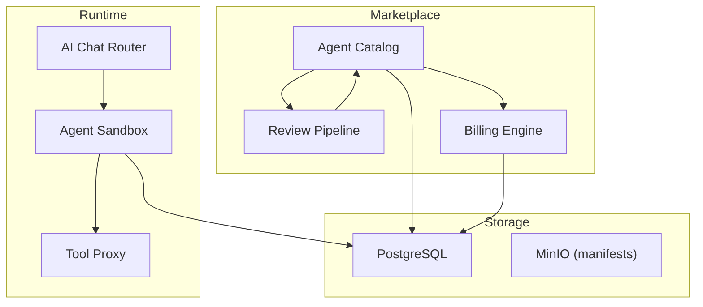
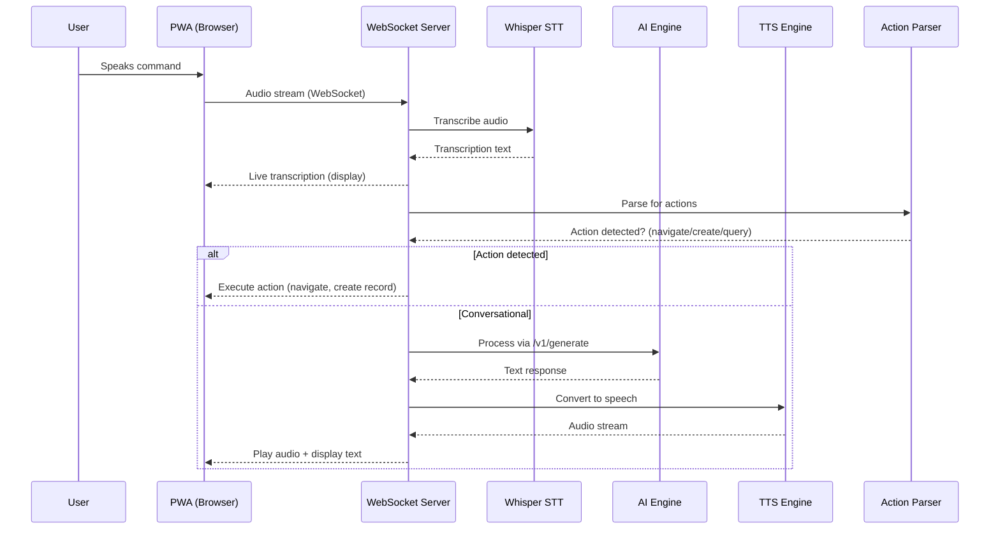
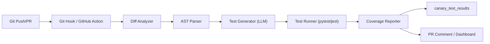
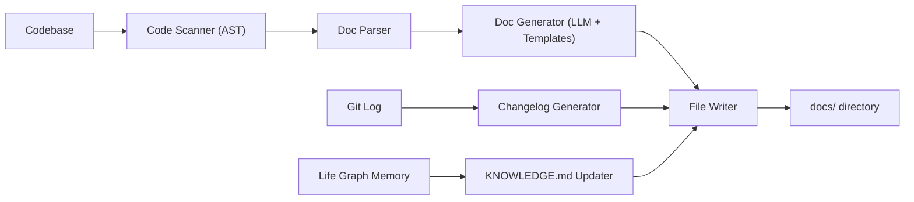
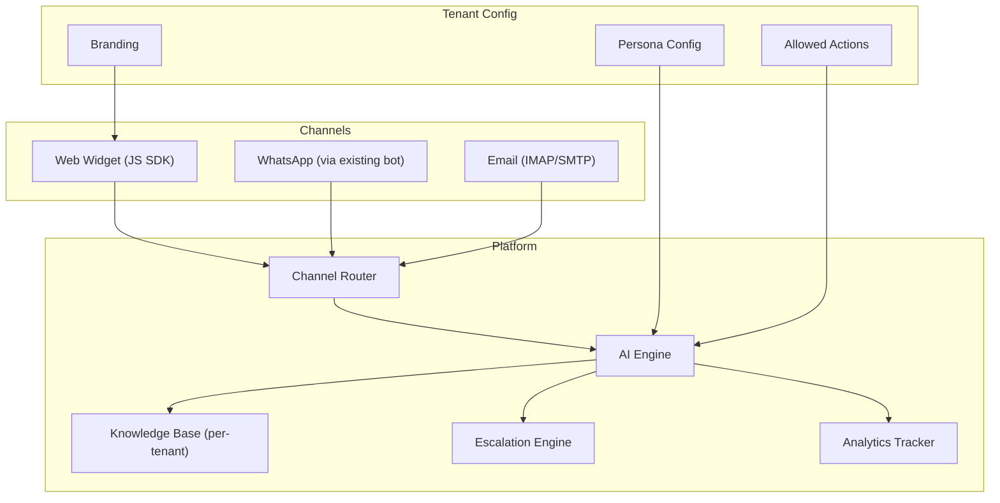
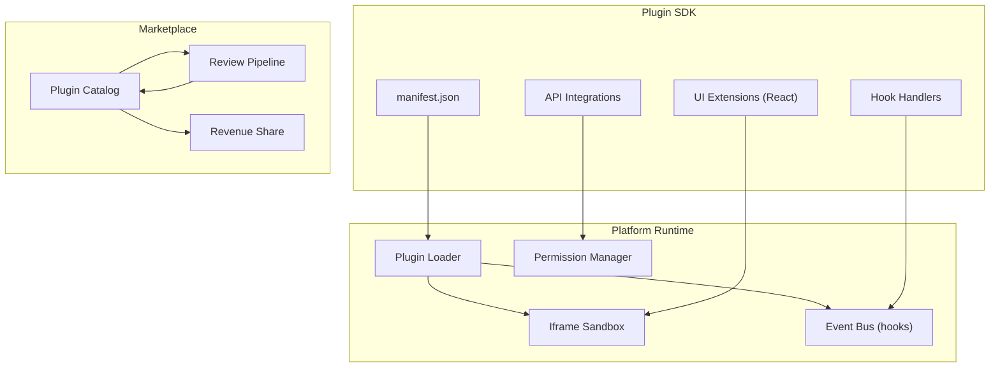
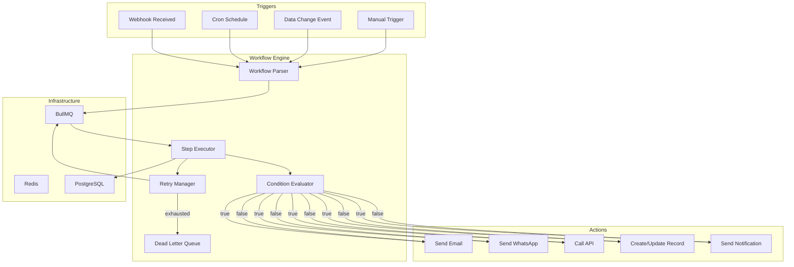

# Platform Extensions — Feature Spec

> **Purpose**: Blueprint for 7 platform extension features that transform uzhavu from a SaaS platform into an extensible ecosystem — marketplace, voice interface, AI testing, documentation automation, white-label AI, plugins, and visual workflows.
>
> **Architecture ref**: `APP_ARCHITECTURE.md` — manifest + module config + plan-based gating
>
> **AI Engine ref**: `ai-engine-improvements.md` — existing AI capabilities (chat, voice STT+TTS, RAG, tools)
>
> **Audit ref**: `.comms/context/uzhavu-audit.md` — full inventory of what's already built
>
> **Context**: Uzhavu is a multi-tenant SaaS monorepo (NestJS + Next.js + FastAPI AI engine + PostgreSQL + Redis + BullMQ) with ~110 models, 62 API modules, 79 pages, and 22 dev tools already built. These 7 features extend it into a platform ecosystem.

---

## Feature 1: Agent Marketplace

**Priority**: P2 (Medium) — Depends on Life Graph agent system being built first
**Effort Estimate**: 18 developer-days

### Overview

Package AI agents as installable extensions — like a Shopify App Store but for AI capabilities. Creators publish agents, tenants install them, and the platform handles sandboxing, billing, and reviews.

### Requirements

#### Story 1.1: Creator Publishes an Agent

As an **agent creator**, I want to publish my AI agent to the marketplace so that other tenants can install and use it.

##### Acceptance Criteria

- GIVEN I am a registered creator WHEN I navigate to Developer → Publish Agent THEN I see a form to define: name, description, category, persona (role/goal/backstory), tools, pricing (free/monthly/per-use), and a demo video URL
- GIVEN I fill in the agent manifest WHEN I click "Submit for Review" THEN the agent enters `pending_review` status and I see an estimated review time of 3-5 business days
- GIVEN my agent is approved WHEN the reviewer approves it THEN the agent status changes to `published` and it appears in the marketplace with my creator profile
- GIVEN my agent uses custom tools WHEN I define them THEN I provide: tool name, description, API endpoint, authentication method, and request/response schema in the manifest
- GIVEN I want to update my published agent WHEN I submit a new version THEN the update goes through review and existing installs are notified of the update

---

#### Story 1.2: Tenant Installs an Agent

As a **tenant admin**, I want to install agents from the marketplace so that my AI assistant gains new capabilities.

##### Acceptance Criteria

- GIVEN I am on the Agent Marketplace page WHEN I browse agents THEN I see cards with: agent name, description, category, rating (1-5 stars), install count, pricing, and creator name
- GIVEN I find an agent I want WHEN I click "Install" THEN the system shows: required permissions, pricing, and a confirmation dialog
- GIVEN I confirm the installation WHEN the agent installs THEN it appears in my AI Assistant's capabilities and I can invoke it via chat: "Hey [agent_name], do X"
- GIVEN the agent has a monthly fee WHEN I install it THEN it's added to my subscription billing and I see the charge in my next invoice
- GIVEN I want to remove an agent WHEN I click "Uninstall" THEN the agent is removed from my AI assistant, all agent-specific data is archived (not deleted), and billing stops at the next cycle

---

#### Story 1.3: Installed Agent Answers Queries

As a **tenant user**, I want to interact with installed marketplace agents via the AI chat so that I get specialized help.

##### Acceptance Criteria

- GIVEN I have "TaxHelper" agent installed WHEN I type "Calculate GST on ₹50,000" THEN the AI routes to TaxHelper and returns the correct calculation with breakdown
- GIVEN the installed agent needs external API access WHEN it processes my request THEN it runs in a sandboxed context with only the permissions I approved during installation
- GIVEN the agent's API endpoint is down WHEN I invoke it THEN I see a friendly error: "TaxHelper is temporarily unavailable. Try again later." and the failure is logged

---

#### Story 1.4: Agent Rating and Reviews

As a **tenant user**, I want to rate and review installed agents so that other tenants can make informed decisions.

##### Acceptance Criteria

- GIVEN I have used an agent for at least 7 days WHEN I navigate to the agent's detail page THEN I see an option to rate (1-5 stars) and write a review
- GIVEN I submit a review WHEN it's published THEN other tenants can see it on the agent's marketplace listing
- GIVEN reviews exist WHEN I browse the marketplace THEN agents are sortable by: rating, installs, newest, and price

---

#### Story 1.5: Creator Revenue Reporting

As an **agent creator**, I want to see my earnings from marketplace agents so that I can track my revenue.

##### Acceptance Criteria

- GIVEN I have published agents with paid tiers WHEN I navigate to Developer → Revenue THEN I see: total earnings, earnings per agent, install count per agent, and monthly trend chart
- GIVEN revenue is generated WHEN the billing cycle completes THEN I receive 70% of the agent's revenue and the platform retains 30%
- GIVEN my earnings exceed ₹1,000 WHEN I request a payout THEN the platform initiates a bank transfer within 7 business days

---

### Architecture



### Data Model

```prisma
model MarketplaceAgent {
  id            String   @id @default(uuid())
  creatorId     String
  creator       User     @relation(fields: [creatorId], references: [id])
  name          String
  slug          String   @unique
  description   String
  category      String   // 'customer-service', 'data-analysis', 'content', 'devops'
  persona       Json     // {role, goal, backstory}
  tools         Json     // [{name, description, endpoint, auth}]
  manifest      Json     // Full agent manifest
  pricing       Json     // {type: 'free'|'monthly'|'per-use', amount: number, currency: 'INR'}
  status        String   @default("draft") // draft, pending_review, approved, published, suspended
  version       String   @default("1.0.0")
  rating        Float    @default(0)
  ratingCount   Int      @default(0)
  installCount  Int      @default(0)
  demoVideoUrl  String?
  iconUrl       String?
  orgId         String
  org           Org      @relation(fields: [orgId], references: [id])
  createdAt     DateTime @default(now())
  updatedAt     DateTime @updatedAt

  installs      AgentInstall[]
  reviews       AgentReview[]
}

model AgentInstall {
  id        String   @id @default(uuid())
  agentId   String
  agent     MarketplaceAgent @relation(fields: [agentId], references: [id])
  orgId     String
  org       Org      @relation(fields: [orgId], references: [id])
  status    String   @default("active") // active, paused, uninstalled
  config    Json     @default("{}") // Tenant-specific config overrides
  installedAt DateTime @default(now())
  uninstalledAt DateTime?

  @@unique([agentId, orgId])
}

model AgentReview {
  id        String   @id @default(uuid())
  agentId   String
  agent     MarketplaceAgent @relation(fields: [agentId], references: [id])
  userId    String
  user      User     @relation(fields: [userId], references: [id])
  rating    Int      // 1-5
  review    String?
  orgId     String
  createdAt DateTime @default(now())

  @@unique([agentId, userId])
}
```

### Implementation Checklist

- [ ] `MarketplaceAgent`, `AgentInstall`, `AgentReview` Prisma models + migration (1 day)
- [ ] NestJS `marketplace-agents` module: CRUD + publish + review pipeline (3 days)
- [ ] Agent manifest schema validation (JSON Schema) (0.5 days)
- [ ] Agent sandbox runtime in AI engine (FastAPI) (3 days)
- [ ] AI chat router: detect installed agents and route (1 day)
- [ ] Marketplace UI: browse, search, filter, install (3 days)
- [ ] Creator dashboard: publish, manage, revenue (2 days)
- [ ] Rating/review system (1 day)
- [ ] Billing integration: monthly + per-use pricing (2 days)
- [ ] Review admin panel for platform approvals (1.5 days)

---

## Feature 2: Voice-First Interface

**Priority**: P1 (High) — Voice STT+TTS already exists in AI engine
**Effort Estimate**: 12 developer-days

### Overview

Talk to your AI team via voice — natural voice commands, voice notes that become tasks, multi-language support (Tamil, Hindi, English), and PWA-compatible mobile experience. Builds on existing Whisper STT and ElevenLabs TTS in the AI engine.

### Requirements

#### Story 2.1: Voice Command with Spoken Response

As a **user**, I want to speak a command and hear the AI's response so that I can interact hands-free.

##### Acceptance Criteria

- GIVEN I am on the AI Assistant page WHEN I click the microphone button and say "Show me today's revenue" THEN the system transcribes my speech, processes it through the AI, and plays back the spoken response
- GIVEN the voice pipeline is active WHEN I speak THEN I see real-time transcription text appearing as I talk (live feedback)
- GIVEN the AI generates a response WHEN it includes data (numbers, tables) THEN the response is both spoken aloud AND displayed as text/chart on screen
- GIVEN my internet is slow WHEN the TTS response takes >5 seconds THEN the text response appears immediately and voice plays when ready (don't block on TTS)

---

#### Story 2.2: Voice Notes → Tasks

As a **user**, I want to record a voice note that automatically becomes a task or note so that I can capture ideas instantly.

##### Acceptance Criteria

- GIVEN I am on any page WHEN I long-press the microphone button THEN I enter "voice note" mode with a recording indicator and timer
- GIVEN I finish recording WHEN I release the button THEN the audio is transcribed and the system asks: "Create as: Task / Note / Reminder?" with auto-detected suggestion
- GIVEN I confirm "Task" WHEN the task is created THEN it includes: the transcription as description, the original audio as attachment, and auto-detected priority/due date from content
- GIVEN I say "Remind me to review the PR tomorrow at 9 AM" WHEN the system processes it THEN it creates a reminder with the correct date/time extracted via NLP

---

#### Story 2.3: Multi-Language Voice

As a **Tamil-speaking user**, I want to interact in Tamil so that I can use the platform in my native language.

##### Acceptance Criteria

- GIVEN I set my language preference to Tamil WHEN I speak in Tamil THEN the system correctly transcribes Tamil speech using Whisper's multilingual support
- GIVEN the system detects Tamil input WHEN it generates a response THEN the TTS response is in Tamil (using a Tamil voice model)
- GIVEN I mix languages (Tamil + English) WHEN I speak THEN the system handles code-switching and transcribes accurately
- GIVEN supported languages WHEN I check settings THEN available languages are: English, Tamil, Hindi with an option to add more

---

#### Story 2.4: Voice Commands Trigger Actions

As a **user**, I want to use voice commands to navigate and create records so that I don't need to type or click.

##### Acceptance Criteria

- GIVEN I say "Create a new invoice for Lakshmi Stores" WHEN the system processes the command THEN it navigates to the new invoice page with "Lakshmi Stores" pre-selected as the customer
- GIVEN I say "Show me unpaid invoices" WHEN the command is processed THEN the dashboard navigates to the invoices list filtered by status=unpaid
- GIVEN a voice command doesn't match any known action WHEN it's processed THEN the system falls back to the AI chat and answers conversationally

---

#### Story 2.5: Wake Word Detection (Optional)

As a **user**, I want to activate voice with a wake word so that I don't need to click the microphone button.

##### Acceptance Criteria

- GIVEN I enable wake word in settings WHEN I say "Hey assistant" THEN the microphone activates and the system starts listening
- GIVEN the wake word is detected WHEN I give a command THEN the system processes it identically to button-activated voice
- GIVEN wake word is enabled WHEN the browser tab is in the background THEN the system does NOT listen (privacy — only active tab)
- GIVEN wake word detection is running WHEN my device battery is below 20% THEN wake word detection auto-pauses with a notification

---

### Architecture



### Data Model

```prisma
model VoiceNote {
  id            String   @id @default(uuid())
  userId        String
  user          User     @relation(fields: [userId], references: [id])
  orgId         String
  audioUrl      String   // MinIO path to original audio
  transcription String
  language      String   @default("en")
  duration      Int      // seconds
  actionType    String?  // 'task', 'note', 'reminder', null
  actionId      String?  // ID of created task/note/reminder
  metadata      Json     @default("{}")
  createdAt     DateTime @default(now())
}

model VoiceCommand {
  id            String   @id @default(uuid())
  userId        String
  orgId         String
  transcription String
  language      String
  intent        String   // 'navigate', 'create', 'query', 'chat'
  action        Json     // {type: 'navigate', target: '/invoices?status=unpaid'}
  confidence    Float
  executedAt    DateTime @default(now())
}
```

### Implementation Checklist

- [ ] WebSocket audio streaming endpoint (`/ws/voice`) (2 days)
- [ ] Live transcription with Whisper (extend existing STT) (1 day)
- [ ] Action parser: NLP-based intent detection for voice commands (2 days)
- [ ] Voice note recording UI component (React) (1 day)
- [ ] Voice note → Task/Note creation pipeline (1 day)
- [ ] Multi-language support: Tamil, Hindi voice models (1 day)
- [ ] TTS response streaming (extend existing TTS) (1 day)
- [ ] Wake word detection (browser-based, optional) (1.5 days)
- [ ] PWA microphone permissions + mobile optimization (1 day)
- [ ] Voice command → navigation mapping (0.5 days)

**Dependencies**: Existing AI engine (STT + TTS), PWA spec (`pwa-mobile.md`)

---

## Feature 3: Automated Testing Agent

**Priority**: P2 (Medium) — Depends on agent system
**Effort Estimate**: 14 developer-days

### Overview

An AI agent that analyzes code changes, generates unit tests, runs them on every commit, tracks coverage, and detects potential regressions. Integrates with the existing canary test infrastructure.

### Requirements

#### Story 3.1: Auto-Generate Tests on Code Push

As a **developer**, I want tests automatically generated for my code changes so that I don't have to write them manually.

##### Acceptance Criteria

- GIVEN I push a commit to a branch WHEN the git hook triggers THEN the testing agent analyzes the diff and generates unit tests for new/changed functions
- GIVEN the agent generates tests WHEN they are created THEN they are written to the corresponding `tests/` directory following the project's existing test naming convention
- GIVEN the generated tests exist WHEN they run THEN they achieve at least 80% branch coverage for the changed code
- GIVEN a function has complex logic WHEN the agent generates tests THEN it creates edge case tests (null inputs, boundary values, error paths) in addition to happy path tests

---

#### Story 3.2: Run Tests and Report Results

As a **developer**, I want to see test results automatically after every commit so that I know if my changes broke anything.

##### Acceptance Criteria

- GIVEN tests were generated WHEN the test runner executes them THEN results are reported in a structured format: passed ✅, failed ❌, skipped ⏭️ with error details
- GIVEN all tests pass WHEN the report is shown THEN I see a green summary: "12 tests passed, 0 failed, 94% coverage"
- GIVEN some tests fail WHEN the report is shown THEN I see: test name, error message, expected vs actual, and a suggested fix from the AI
- GIVEN the test run completes WHEN results are saved THEN they're stored in the `canary_test_results` table with commit SHA, branch, and timestamp

---

#### Story 3.3: Coverage Improvement Suggestions

As a **developer**, I want coverage improvement suggestions so that I can identify untested code paths.

##### Acceptance Criteria

- GIVEN the overall test coverage is below 80% WHEN I view the coverage report THEN I see a list of uncovered functions/branches sorted by importance (most-called first)
- GIVEN uncovered functions are identified WHEN I click "Generate Tests" THEN the agent creates tests for the selected functions
- GIVEN coverage improves WHEN new tests are added THEN the coverage percentage updates in real-time on the dashboard

---

#### Story 3.4: Regression Detection on PR

As a **developer**, I want the agent to warn me about potential regressions before I merge so that I don't break production.

##### Acceptance Criteria

- GIVEN I open a PR WHEN the testing agent analyzes it THEN it identifies functions that are called by the changed code but don't have tests
- GIVEN a potential regression is detected WHEN the analysis completes THEN I see a warning: "⚠️ This change modifies `calculateTotal()` which is used by 5 other modules. Existing tests may not cover the new behavior."
- GIVEN the warning is shown WHEN I review it THEN I can click "Generate Regression Tests" to create targeted tests for the affected modules

---

#### Story 3.5: CI Pipeline Integration

As a **developer**, I want the testing agent integrated into my CI pipeline so that tests block merges when they fail.

##### Acceptance Criteria

- GIVEN a GitHub Actions workflow exists WHEN a PR is opened THEN the testing agent runs as a CI step: generate tests → run all tests → report coverage
- GIVEN any test fails WHEN the CI completes THEN the PR is blocked from merging with a clear failure message
- GIVEN all tests pass and coverage meets threshold WHEN the CI completes THEN the PR gets a green checkmark and is ready to merge

---

### Architecture



### Data Model

```sql
-- Extends existing canary test infrastructure
CREATE TABLE ai_generated_tests (
    id TEXT PRIMARY KEY DEFAULT gen_random_uuid()::text,
    commit_sha TEXT NOT NULL,
    branch TEXT NOT NULL,
    file_path TEXT NOT NULL,           -- Source file being tested
    test_file_path TEXT NOT NULL,      -- Generated test file
    test_content TEXT NOT NULL,
    functions_covered TEXT[],          -- Function names
    coverage_percent FLOAT,
    status TEXT DEFAULT 'generated',   -- generated, passed, failed, skipped
    error_message TEXT,
    model_used TEXT,
    generation_cost_usd NUMERIC(10,6),
    created_at TIMESTAMPTZ DEFAULT NOW()
);

CREATE TABLE regression_warnings (
    id TEXT PRIMARY KEY DEFAULT gen_random_uuid()::text,
    commit_sha TEXT NOT NULL,
    pr_number INT,
    affected_function TEXT NOT NULL,
    affected_modules TEXT[],
    severity TEXT DEFAULT 'medium',    -- low, medium, high
    description TEXT NOT NULL,
    resolved BOOLEAN DEFAULT false,
    created_at TIMESTAMPTZ DEFAULT NOW()
);
```

### Implementation Checklist

- [ ] Git diff analyzer: parse changed files, extract function signatures (2 days)
- [ ] AST parser: Python (ast module) + TypeScript (ts-morph) function analysis (2 days)
- [ ] Test generator: LLM prompt templates for pytest + jest test generation (3 days)
- [ ] Test runner integration: pytest subprocess + result parsing (1 day)
- [ ] Coverage tracking: coverage.py integration + persistence (1 day)
- [ ] Regression detector: dependency graph analysis (2 days)
- [ ] GitHub Actions workflow template (0.5 days)
- [ ] Dashboard UI: coverage report, test results, regression warnings (2 days)
- [ ] Integration with existing canary test infrastructure (0.5 days)

**Dependencies**: Life Graph agent system, existing canary test infrastructure

---

## Feature 4: Documentation Agent

**Priority**: P2 (Medium)
**Effort Estimate**: 10 developer-days

### Overview

An AI agent that auto-generates documentation from code, keeps it in sync with changes, generates changelogs from git history, and maintains the project's knowledge base.

### Requirements

#### Story 4.1: Auto-Generate API Documentation

As a **developer**, I want API docs automatically generated from my code so that I don't have to write them manually.

##### Acceptance Criteria

- GIVEN I run `docs generate --scope api` WHEN the agent scans the codebase THEN it generates OpenAPI-compatible docs for every FastAPI endpoint and NestJS controller
- GIVEN a FastAPI route is decorated with proper type hints WHEN the agent processes it THEN the generated doc includes: endpoint URL, method, request body schema, response schema, query params, and description
- GIVEN docs are generated WHEN I view them THEN they are saved to `docs/api/` in Markdown format and also available as JSON (OpenAPI 3.0)

---

#### Story 4.2: Docs Stay in Sync with Code

As a **developer**, I want documentation to auto-update when code changes so that docs never go stale.

##### Acceptance Criteria

- GIVEN I modify a FastAPI endpoint WHEN I commit the change THEN the documentation agent detects the diff and updates the corresponding doc file
- GIVEN a new API endpoint is added WHEN the agent runs THEN it creates a new doc page for the endpoint
- GIVEN an endpoint is removed WHEN the agent runs THEN it marks the doc as deprecated (not deleted) with a note about the removal commit

---

#### Story 4.3: Changelog from Git History

As a **developer**, I want a changelog auto-generated from my git commits so that I have a running record of changes.

##### Acceptance Criteria

- GIVEN I use conventional commits (`feat:`, `fix:`, `refactor:`) WHEN I run `docs changelog` THEN the agent generates a grouped changelog: Features, Bug Fixes, Refactors, with commit messages and dates
- GIVEN a new version is tagged WHEN the changelog is generated THEN it creates a new section for the version with all commits since the last tag
- GIVEN the changelog is generated WHEN I view it THEN it's saved to `CHANGELOG.md` in Keep a Changelog format

---

#### Story 4.4: Onboarding Guide Creation

As a **new developer**, I want an auto-generated onboarding guide so that I can understand the project quickly.

##### Acceptance Criteria

- GIVEN I run `docs onboard` WHEN the agent analyzes the codebase THEN it generates a guide covering: project structure, tech stack, how to set up locally, key modules, and architecture overview
- GIVEN the onboarding guide exists WHEN the project structure changes significantly THEN the agent updates the relevant sections

---

#### Story 4.5: KNOWLEDGE.md Auto-Update

As a **developer**, I want KNOWLEDGE.md automatically updated when key decisions are made so that context is always current.

##### Acceptance Criteria

- GIVEN I make a significant architectural decision in a conversation WHEN the agent detects it (via memory system) THEN it proposes an update to KNOWLEDGE.md
- GIVEN the update is proposed WHEN I approve it THEN the agent commits the change to KNOWLEDGE.md with a conventional commit message
- GIVEN KNOWLEDGE.md is updated WHEN other agents reference it THEN they see the latest version

---

### Architecture



### Implementation Checklist

- [ ] Code scanner: FastAPI route extractor + NestJS controller parser (2 days)
- [ ] Doc generator: Markdown templates + LLM enrichment for descriptions (2 days)
- [ ] Git diff watcher: detect doc-relevant changes (1 day)
- [ ] Changelog generator from conventional commits (1 day)
- [ ] Onboarding guide generator (1 day)
- [ ] KNOWLEDGE.md auto-update from memory system (1 day)
- [ ] CLI commands: `docs generate`, `docs changelog`, `docs onboard` (1 day)
- [ ] Dashboard page: doc coverage metrics, stale docs list (1 day)

**Dependencies**: Life Graph agent system, git history

---

## Feature 5: Client-Facing AI Assistant

**Priority**: P1 (High) — Major revenue driver for tenant retention
**Effort Estimate**: 20 developer-days

### Overview

White-label AI assistant that tenants configure for their customers. Supports web widget, WhatsApp, and email channels. Handles FAQs, order status, appointments, and escalation to humans.

### Requirements

#### Story 5.1: Tenant Configures AI Assistant

As a **tenant admin**, I want to configure a customer-facing AI assistant so that my customers get instant help.

##### Acceptance Criteria

- GIVEN I am a tenant admin WHEN I navigate to Settings → AI Assistant → Customer-Facing THEN I see a configuration page with: persona name, avatar, greeting message, primary language, and tone (formal/casual/friendly)
- GIVEN I configure the persona WHEN I set it to "Lakshmi - Your Friendly Assistant" with a casual tone THEN the AI uses this persona when responding to customers
- GIVEN I want to restrict actions WHEN I configure allowed actions THEN I can toggle: FAQ answers, order status lookup, appointment booking, contact form, and custom actions
- GIVEN the configuration is saved WHEN a customer interacts THEN the AI uses the tenant's persona, knowledge base, and allowed actions

---

#### Story 5.2: Customer Asks FAQ via Web Widget

As a **customer**, I want to ask questions via a chat widget on the business's website so that I get instant answers.

##### Acceptance Criteria

- GIVEN a business has installed the web widget WHEN I visit their website THEN I see a chat bubble in the bottom-right corner with the business's branding
- GIVEN I click the widget and type "What are your business hours?" WHEN the AI processes my question THEN it answers from the tenant's knowledge base within 3 seconds
- GIVEN the widget is open WHEN I interact THEN I see: business logo, persona name, typing indicator, and message timestamps
- GIVEN the widget is embedded WHEN the page loads THEN the widget script is < 50KB and does not affect page load performance

---

#### Story 5.3: Customer Checks Order Status

As a **customer**, I want to check my order status via the AI assistant so that I don't have to call the business.

##### Acceptance Criteria

- GIVEN I have an order with the business WHEN I type "Where is my order #12345?" THEN the AI looks up the order and responds with: current status, last update date, and estimated delivery
- GIVEN my order has tracking info WHEN the AI responds THEN it includes the tracking number and carrier link
- GIVEN I provide a wrong order number WHEN the AI can't find it THEN it asks me to verify the number or provide my registered phone/email for lookup

---

#### Story 5.4: AI Escalates to Human

As a **customer**, I want to talk to a human when the AI can't help so that I'm not stuck in a loop.

##### Acceptance Criteria

- GIVEN I ask a question the AI can't answer WHEN it detects low confidence (< 0.5) THEN the AI says: "I'm not sure about that. Let me connect you with a team member." and creates a support ticket
- GIVEN I explicitly request a human WHEN I type "Talk to a human" or "I want to speak to someone" THEN the AI immediately escalates with the conversation history attached
- GIVEN the conversation is escalated WHEN a human agent takes over THEN the customer sees: "You're now connected with [Agent Name]" and the agent sees the full AI conversation history
- GIVEN it's outside business hours WHEN an escalation happens THEN the AI says: "Our team is available [hours]. I've created a ticket and someone will reach out when we're back."

---

#### Story 5.5: Tenant Views Conversation Analytics

As a **tenant admin**, I want to see analytics on customer interactions so that I can improve my AI assistant.

##### Acceptance Criteria

- GIVEN I navigate to AI Assistant → Analytics WHEN data exists THEN I see: total conversations, resolution rate (AI-resolved vs escalated), top questions, average response time, and satisfaction score
- GIVEN I view top questions WHEN I click one THEN I see the AI's responses and can add/improve knowledge base entries for better answers
- GIVEN analytics are available WHEN I filter by date range THEN all metrics update to reflect the selected period

---

#### Story 5.6: Multi-Channel Interaction

As a **customer**, I want to interact with the business's AI via WhatsApp, web widget, or email so that I can use my preferred channel.

##### Acceptance Criteria

- GIVEN a business has WhatsApp configured WHEN I message their number THEN the customer-facing AI responds (not the tenant's internal AI)
- GIVEN I started a conversation on WhatsApp WHEN I switch to the web widget THEN my conversation history is available (cross-channel continuity)
- GIVEN I email the business's support address WHEN the AI can answer THEN it sends an email reply. If not, it creates a ticket for human follow-up
- GIVEN the tenant views their inbox WHEN they check conversations THEN all channels (widget, WhatsApp, email) appear in a unified inbox

---

### Architecture



### Data Model

```prisma
model CustomerAssistantConfig {
  id              String   @id @default(uuid())
  orgId           String   @unique
  org             Org      @relation(fields: [orgId], references: [id])
  personaName     String   @default("AI Assistant")
  personaAvatar   String?
  greeting        String   @default("Hi! How can I help you today?")
  tone            String   @default("friendly") // formal, casual, friendly
  primaryLanguage String   @default("en")
  allowedActions  Json     @default("[]") // ['faq', 'order_status', 'booking', 'contact']
  widgetConfig    Json     @default("{}") // {position, color, size}
  channels        Json     @default("[]") // ['widget', 'whatsapp', 'email']
  businessHours   Json?    // {mon: {start: '09:00', end: '18:00'}, ...}
  isActive        Boolean  @default(false)
  createdAt       DateTime @default(now())
  updatedAt       DateTime @updatedAt
}

model CustomerConversation {
  id              String   @id @default(uuid())
  orgId           String
  org             Org      @relation(fields: [orgId], references: [id])
  customerId      String?  // Linked customer record if identified
  channel         String   // 'widget', 'whatsapp', 'email'
  channelId       String?  // WhatsApp number, email address, widget session
  status          String   @default("active") // active, escalated, resolved, closed
  escalatedTo     String?  // User ID of human agent
  escalatedAt     DateTime?
  satisfaction    Int?     // 1-5 rating from customer
  messageCount    Int      @default(0)
  aiResolved      Boolean  @default(false)
  metadata        Json     @default("{}")
  createdAt       DateTime @default(now())
  updatedAt       DateTime @updatedAt
  closedAt        DateTime?

  messages        CustomerMessage[]
}

model CustomerMessage {
  id              String   @id @default(uuid())
  conversationId  String
  conversation    CustomerConversation @relation(fields: [conversationId], references: [id], onDelete: Cascade)
  role            String   // 'customer', 'assistant', 'agent' (human)
  content         String
  channel         String
  metadata        Json     @default("{}")
  createdAt       DateTime @default(now())
}
```

### Implementation Checklist

- [ ] `CustomerAssistantConfig` Prisma model + configuration API (2 days)
- [ ] `CustomerConversation` + `CustomerMessage` models + API (2 days)
- [ ] AI engine: customer-facing mode with tenant persona + knowledge base (3 days)
- [ ] Web widget SDK: embeddable JS snippet (3 days)
- [ ] Widget configuration UI in tenant dashboard (2 days)
- [ ] Escalation engine: confidence threshold + human handoff (2 days)
- [ ] WhatsApp channel integration (extend existing bot) (2 days)
- [ ] Email channel: IMAP reader + auto-reply (2 days)
- [ ] Analytics dashboard: resolution rate, top questions, satisfaction (2 days)
- [ ] Widget branding: custom colors, logo, position (1 day)

**Dependencies**: WhatsApp bot (`whatsapp-bot.md`), AI engine with RAG/knowledge base

---

## Feature 6: Plugin Marketplace

**Priority**: P2 (Medium) — Platform maturity feature
**Effort Estimate**: 22 developer-days

### Overview

Community-built extensions (like Shopify apps) with a full SDK, hook system, UI extension points, and sandboxed execution. Plugins can add data sources, automations, UI widgets, and reports.

### Requirements

#### Story 6.1: Developer Creates and Publishes a Plugin

As a **plugin developer**, I want to create a plugin using the SDK so that I can extend the platform for other tenants.

##### Acceptance Criteria

- GIVEN I initialize a plugin project WHEN I run `npx create-uzhavu-plugin my-plugin` THEN I get a scaffold with: manifest.json, hooks/, ui/, and README
- GIVEN my plugin is ready WHEN I run `uzhavu-plugin publish` THEN the plugin is packaged, validated against the manifest schema, and submitted for review
- GIVEN the plugin is submitted WHEN the reviewer approves it THEN it appears in the Plugin Marketplace with my developer profile

---

#### Story 6.2: Tenant Installs a Plugin

As a **tenant admin**, I want to install plugins from the marketplace so that I can extend my platform.

##### Acceptance Criteria

- GIVEN I browse the Plugin Marketplace WHEN I find a plugin THEN I see: name, description, type (data source / automation / widget / report), rating, install count, and pricing
- GIVEN I click "Install" WHEN the plugin requires permissions THEN I see a consent screen: "This plugin will access: Contacts, Orders" with Approve/Deny
- GIVEN I approve WHEN the plugin installs THEN it appears in Settings → Plugins as active and its features become available

---

#### Story 6.3: Plugin Extends Dashboard with Widget

As a **tenant user**, I want to see plugin-added widgets on my dashboard so that I get extra functionality without changing the core app.

##### Acceptance Criteria

- GIVEN a "Weather Widget" plugin is installed WHEN I view my dashboard THEN I see the weather widget in the widget area with current weather for my business location
- GIVEN the widget renders WHEN it loads THEN it runs in an iframe sandbox with limited communication to the parent page via `postMessage`
- GIVEN I want to rearrange WHEN I enter dashboard edit mode THEN I can drag plugin widgets to different positions

---

#### Story 6.4: Plugin Adds Automation Workflow

As a **tenant admin**, I want a plugin to add automation rules so that common business processes are automated.

##### Acceptance Criteria

- GIVEN a "Smart Invoice Reminders" plugin is installed WHEN an invoice becomes overdue THEN the plugin's hook fires and sends a personalized reminder via the tenant's preferred channel
- GIVEN the plugin's automation runs WHEN it executes THEN the execution is logged with: trigger event, actions taken, and result

---

#### Story 6.5: Plugin Review and Approval

As a **platform admin**, I want to review plugins before they're published so that quality and security are maintained.

##### Acceptance Criteria

- GIVEN a plugin is submitted WHEN I review it THEN I see: manifest, source code, permissions requested, and automated security scan results
- GIVEN I approve WHEN the status changes to "published" THEN the developer is notified and the plugin appears in the marketplace
- GIVEN I reject WHEN I provide a reason THEN the developer sees the rejection reason and can resubmit

---

### Architecture



### Plugin Manifest Schema

```json
{
  "name": "smart-invoice-reminders",
  "displayName": "Smart Invoice Reminders",
  "version": "1.0.0",
  "description": "AI-powered invoice reminder scheduling",
  "author": "Race Raja",
  "type": "automation",
  "permissions": ["contacts:read", "invoices:read", "notifications:send"],
  "hooks": {
    "invoice.overdue": "hooks/onInvoiceOverdue.ts",
    "invoice.created": "hooks/onInvoiceCreated.ts"
  },
  "ui": {
    "settings": "ui/SettingsPanel.tsx",
    "widget": "ui/ReminderWidget.tsx"
  },
  "pricing": {
    "type": "monthly",
    "amount": 299,
    "currency": "INR"
  }
}
```

### Data Model

```prisma
model Plugin {
  id              String   @id @default(uuid())
  developerId     String
  developer       User     @relation(fields: [developerId], references: [id])
  name            String   @unique
  displayName     String
  description     String
  type            String   // 'data-source', 'automation', 'widget', 'report'
  version         String
  manifest        Json
  permissions     String[] // ['contacts:read', 'invoices:read']
  status          String   @default("draft") // draft, pending_review, approved, published, suspended
  rating          Float    @default(0)
  ratingCount     Int      @default(0)
  installCount    Int      @default(0)
  pricing         Json     // {type, amount, currency}
  iconUrl         String?
  screenshotUrls  String[]
  sourceUrl       String?  // GitHub repo
  reviewNotes     String?
  createdAt       DateTime @default(now())
  updatedAt       DateTime @updatedAt

  installs        PluginInstall[]
  reviews         PluginReview[]
}

model PluginInstall {
  id          String   @id @default(uuid())
  pluginId    String
  plugin      Plugin   @relation(fields: [pluginId], references: [id])
  orgId       String
  org         Org      @relation(fields: [orgId], references: [id])
  status      String   @default("active") // active, paused, uninstalled
  config      Json     @default("{}")
  installedAt DateTime @default(now())
  uninstalledAt DateTime?

  @@unique([pluginId, orgId])
}

model PluginReview {
  id        String   @id @default(uuid())
  pluginId  String
  plugin    Plugin   @relation(fields: [pluginId], references: [id])
  userId    String
  user      User     @relation(fields: [userId], references: [id])
  orgId     String
  rating    Int
  review    String?
  createdAt DateTime @default(now())

  @@unique([pluginId, userId])
}

model PluginExecutionLog {
  id          String   @id @default(uuid())
  pluginId    String
  orgId       String
  hookName    String
  triggerData Json
  result      Json
  status      String   // 'success', 'error', 'timeout'
  durationMs  Int
  errorMessage String?
  executedAt  DateTime @default(now())
}
```

### Implementation Checklist

- [ ] Plugin manifest schema (JSON Schema) + validator (1 day)
- [ ] `Plugin`, `PluginInstall`, `PluginReview`, `PluginExecutionLog` Prisma models (1 day)
- [ ] NestJS `plugins` module: CRUD + install + uninstall + permissions (3 days)
- [ ] Plugin SDK: `create-uzhavu-plugin` scaffolding CLI (2 days)
- [ ] Event bus: hook registration + sandboxed execution (3 days)
- [ ] UI extension system: iframe sandbox + postMessage API (3 days)
- [ ] Plugin Marketplace page: browse, search, filter, install (2 days)
- [ ] Developer portal: publish, manage, revenue tracking (2 days)
- [ ] Review admin panel (1 day)
- [ ] Permission consent screen UI (1 day)
- [ ] Plugin execution logger + monitoring dashboard (1 day)
- [ ] Billing: monthly + per-use plugin pricing integration (2 days)

**Dependencies**: Event bus system (partially exists in webhooks module)

---

## Feature 7: Webhook Workflow Builder

**Priority**: P1 (High) — High user value, builds on existing webhook infrastructure
**Effort Estimate**: 18 developer-days

### Overview

Visual drag-and-drop automation builder (like n8n embedded in the platform). Tenants create workflows with triggers, conditions, and actions — no coding required. Powered by BullMQ for reliable execution.

### Requirements

#### Story 7.1: Create a Workflow from Scratch

As a **tenant admin**, I want to create an automation workflow visually so that I can automate business processes without coding.

##### Acceptance Criteria

- GIVEN I navigate to Automations → Create Workflow WHEN the builder loads THEN I see a canvas with a drag-and-drop interface, a node palette (triggers, actions, conditions), and a toolbar
- GIVEN I drag a "Webhook Trigger" node WHEN I configure it THEN I get a unique webhook URL that I can share with external services
- GIVEN I add an "If/Else" condition node WHEN I configure it THEN I can define conditions based on webhook payload fields (e.g., `payload.amount > 1000`)
- GIVEN I add a "Send Email" action WHEN I configure it THEN I set: to address (or dynamic from payload), subject, body template with `{{variables}}`
- GIVEN my workflow has trigger → condition → action WHEN I click "Activate" THEN the workflow becomes live and starts processing incoming events

---

#### Story 7.2: Use a Pre-Built Template

As a **tenant admin**, I want to start from a template so that I don't have to build common workflows from scratch.

##### Acceptance Criteria

- GIVEN I click "Templates" WHEN the gallery loads THEN I see pre-built workflows: "New Order → Send Confirmation Email", "Invoice Overdue → WhatsApp Reminder", "Contact Created → Welcome Email", "Appointment Booked → Calendar + SMS"
- GIVEN I select a template WHEN I click "Use Template" THEN the workflow is copied to my account with all nodes pre-configured and I can customize it before activating
- GIVEN the template has placeholder values WHEN I open it THEN highlighted fields show what I need to fill in (e.g., email address, WhatsApp number)

---

#### Story 7.3: Workflow Triggers and Executes

As a **tenant admin**, I want my workflow to automatically trigger and run actions so that business processes happen without manual intervention.

##### Acceptance Criteria

- GIVEN an active workflow with a "Data Change" trigger on Orders WHEN a new order is created THEN the workflow fires within 5 seconds
- GIVEN the workflow has a "Send WhatsApp" action WHEN it executes THEN it sends the configured WhatsApp message to the customer
- GIVEN a workflow has multiple sequential actions WHEN it runs THEN actions execute in order and each action receives the output of the previous one
- GIVEN an action fails WHEN the error occurs THEN the workflow retries based on the retry policy (default: 3 retries with exponential backoff)

---

#### Story 7.4: View Execution Logs

As a **tenant admin**, I want to see workflow execution logs so that I can debug issues and monitor performance.

##### Acceptance Criteria

- GIVEN I navigate to Automations → [Workflow] → Logs WHEN executions exist THEN I see a list with: timestamp, trigger event, status (success/failed/retrying), duration, and error details
- GIVEN I click on a log entry WHEN it expands THEN I see the step-by-step execution: each node's input data, output data, and duration
- GIVEN a workflow failed WHEN I view the log THEN I see: which node failed, the error message, input data that caused the failure, and a "Retry" button

---

#### Story 7.5: Conditional Branching

As a **tenant admin**, I want to add if/else conditions so that workflows can handle different scenarios.

##### Acceptance Criteria

- GIVEN I add an "If/Else" node WHEN I configure conditions THEN I can use: equals, not equals, greater than, less than, contains, is empty, and combine with AND/OR
- GIVEN the condition evaluates to TRUE WHEN the workflow executes THEN it follows the "true" branch
- GIVEN the condition evaluates to FALSE WHEN the workflow executes THEN it follows the "false" branch
- GIVEN I need multiple branches WHEN I add a "Switch" node THEN I can define N conditions and N branches (like a switch/case)

---

#### Story 7.6: Error Handling and Retry

As a **tenant admin**, I want workflow errors handled gracefully so that temporary failures don't break my automations.

##### Acceptance Criteria

- GIVEN an action fails with a network error WHEN the retry policy triggers THEN it retries 3 times with exponential backoff (1s, 4s, 16s)
- GIVEN all retries are exhausted WHEN the workflow still fails THEN the execution moves to a dead-letter queue and I receive a notification: "Workflow 'Order Confirmation' failed after 3 retries"
- GIVEN a dead-lettered execution WHEN I view it THEN I can: inspect the error, fix the issue, and "Retry from failed step" without re-running the entire workflow
- GIVEN I want custom error handling WHEN I add an "On Error" node THEN I can define fallback actions (e.g., send alert email, log to Slack)

---

### Architecture



### Visual Builder

The visual builder uses React Flow for the drag-and-drop canvas:

```
┌─────────────────────────────────────────────────┐
│ Workflow Builder                    [Save] [Run] │
├─────────┬───────────────────────────────────────┤
│ Nodes   │                                       │
│         │   ┌──────────┐                        │
│ Triggers│   │ Webhook   │                        │
│ ──────  │   │ Trigger   │                        │
│ Webhook │   └────┬──────┘                        │
│ Schedule│        │                               │
│ Event   │   ┌────▼──────┐                        │
│         │   │ If/Else   │                        │
│ Actions │   │ amount>1k │                        │
│ ──────  │   └───┬───┬───┘                        │
│ Email   │     T │   │ F                          │
│ WhatsApp│  ┌────▼─┐ ┌▼─────┐                    │
│ API Call│  │Email │ │Email  │                    │
│ Record  │  │VIP   │ │Normal │                    │
│ Notify  │  └──────┘ └──────┘                     │
│         │                                       │
│ Logic   │                                       │
│ ──────  │                                       │
│ If/Else │                                       │
│ Switch  │                                       │
│ Delay   │                                       │
│ Loop    │                                       │
└─────────┴───────────────────────────────────────┘
```

### Data Model

```prisma
model Workflow {
  id            String   @id @default(uuid())
  orgId         String
  org           Org      @relation(fields: [orgId], references: [id])
  name          String
  description   String?
  status        String   @default("draft") // draft, active, paused, archived
  triggerType   String   // 'webhook', 'schedule', 'event', 'manual'
  triggerConfig Json     // {webhookPath, cronExpression, eventType, etc.}
  nodes         Json     // React Flow nodes array
  edges         Json     // React Flow edges array
  retryPolicy   Json     @default("{\"maxRetries\": 3, \"backoffMs\": 1000, \"backoffMultiplier\": 4}")
  version       Int      @default(1)
  templateId    String?  // If created from template
  createdBy     String
  createdAt     DateTime @default(now())
  updatedAt     DateTime @updatedAt

  executions    WorkflowExecution[]
}

model WorkflowExecution {
  id            String   @id @default(uuid())
  workflowId    String
  workflow      Workflow @relation(fields: [workflowId], references: [id])
  orgId         String
  status        String   @default("running") // running, success, failed, retrying, dead_letter
  triggerData   Json     // The payload that triggered the execution
  currentNode   String?  // Node ID currently executing
  retryCount    Int      @default(0)
  error         String?
  durationMs    Int?
  startedAt     DateTime @default(now())
  completedAt   DateTime?

  steps         WorkflowExecutionStep[]
}

model WorkflowExecutionStep {
  id            String   @id @default(uuid())
  executionId   String
  execution     WorkflowExecution @relation(fields: [executionId], references: [id], onDelete: Cascade)
  nodeId        String   // React Flow node ID
  nodeType      String   // 'trigger', 'condition', 'action'
  nodeName      String
  inputData     Json
  outputData    Json?
  status        String   // 'success', 'failed', 'skipped'
  error         String?
  durationMs    Int?
  executedAt    DateTime @default(now())
}

model WorkflowTemplate {
  id            String   @id @default(uuid())
  name          String
  description   String
  category      String   // 'sales', 'support', 'notifications', 'operations'
  nodes         Json
  edges         Json
  triggerType   String
  triggerConfig Json
  isOfficial    Boolean  @default(false) // Platform-provided vs community
  useCount      Int      @default(0)
  createdAt     DateTime @default(now())
}
```

### Implementation Checklist

- [ ] `Workflow`, `WorkflowExecution`, `WorkflowExecutionStep`, `WorkflowTemplate` Prisma models (1 day)
- [ ] NestJS `workflows` module: CRUD + activate/pause + versioning (2 days)
- [ ] Workflow engine: BullMQ-based step executor (3 days)
- [ ] Condition evaluator: expression parser for if/else/switch (1.5 days)
- [ ] Action implementations: email, WhatsApp, API call, record CRUD, notification (3 days)
- [ ] Trigger implementations: webhook, cron (BullMQ repeatable), data change event, manual (2 days)
- [ ] Visual builder UI: React Flow canvas + node palette + configuration panels (3 days)
- [ ] Retry policy + dead-letter queue + error handling (1 day)
- [ ] Execution logs UI: timeline view with step details (1 day)
- [ ] Template gallery: pre-built workflows + "Use Template" flow (1 day)
- [ ] Webhook URL generation + validation (0.5 days)

**Dependencies**: BullMQ (already in stack), Redis (already in stack), existing webhook module

---

## Implementation Summary

| # | Feature | Priority | Effort | Dependencies | Phase |
|:--|:--------|:---------|:-------|:-------------|:------|
| 1 | Agent Marketplace | P2 | 18 days | Life Graph agent system | Q3 |
| 2 | Voice-First Interface | P1 | 12 days | Existing AI engine STT/TTS, PWA | Q2 |
| 3 | Automated Testing Agent | P2 | 14 days | Life Graph agent system | Q3 |
| 4 | Documentation Agent | P2 | 10 days | Life Graph agent system | Q3 |
| 5 | Client-Facing AI Assistant | P1 | 20 days | WhatsApp bot, AI engine RAG | Q2 |
| 6 | Plugin Marketplace | P2 | 22 days | Event bus, billing | Q3–Q4 |
| 7 | Webhook Workflow Builder | P1 | 18 days | BullMQ, Redis | Q2 |
| | **Total** | | **114 days** | | |

### Recommended Implementation Order

```
Q2 (Now → 3 months):
  ├── Feature 7: Webhook Workflow Builder (18 days) — immediate value, no agent dependency
  ├── Feature 2: Voice-First Interface (12 days) — builds on existing STT/TTS
  └── Feature 5: Client-Facing AI Assistant (20 days) — revenue driver

Q3 (3–6 months):
  ├── Feature 3: Automated Testing Agent (14 days) — after agent system exists
  ├── Feature 4: Documentation Agent (10 days) — after agent system exists
  └── Feature 1: Agent Marketplace (18 days) — needs agent ecosystem

Q4 (6–9 months):
  └── Feature 6: Plugin Marketplace (22 days) — platform maturity feature
```

### Cost Impact

| Feature | Monthly API Cost | Revenue Potential |
|:--------|:----------------|:------------------|
| Agent Marketplace | ~$5 (sandboxed execution) | Revenue share income |
| Voice Interface | ~$10 (STT/TTS API calls) | Premium plan feature |
| Testing Agent | ~$15 (LLM test generation) | Developer productivity |
| Documentation Agent | ~$5 (LLM doc generation) | Developer productivity |
| Client-Facing AI | ~$20 (per-tenant AI usage) | ₹499-1999/tenant/month |
| Plugin Marketplace | ~$2 (hook execution) | Revenue share income |
| Workflow Builder | ~$0 (no LLM needed) | Premium plan feature |

---

*Generated: 06 Jul 2026*
*Based on: Uzhavu platform audit, existing AI engine capabilities, shared knowledge context*
*Total estimated effort: ~114 developer-days (~23 weeks)*
