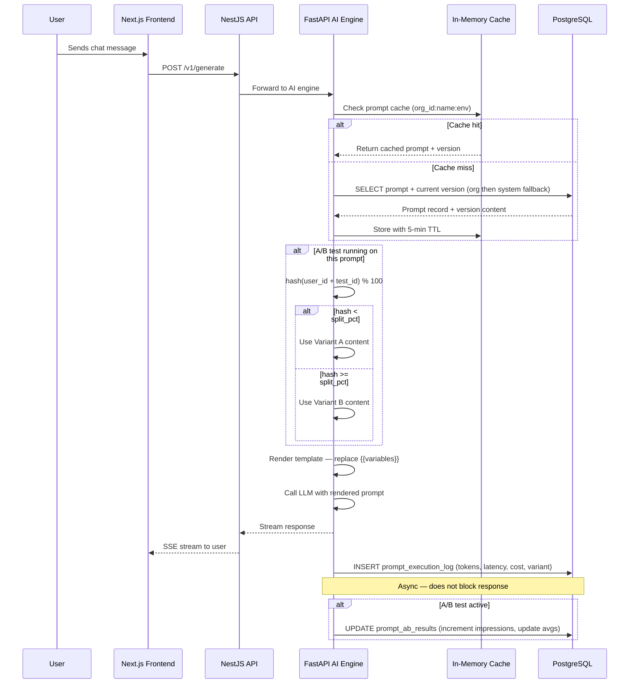
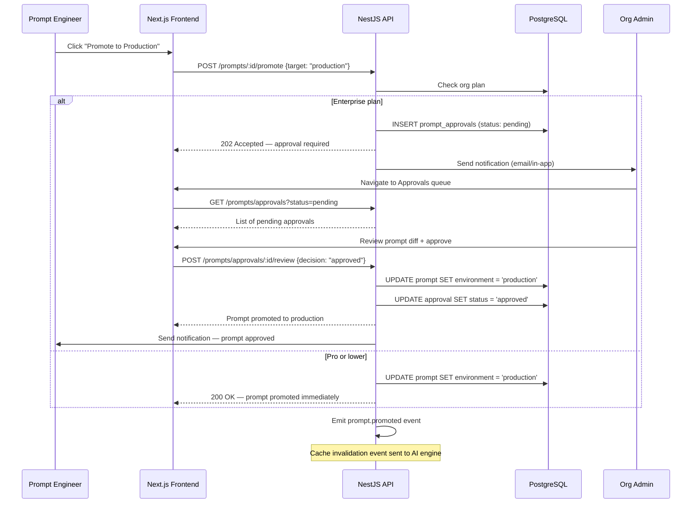
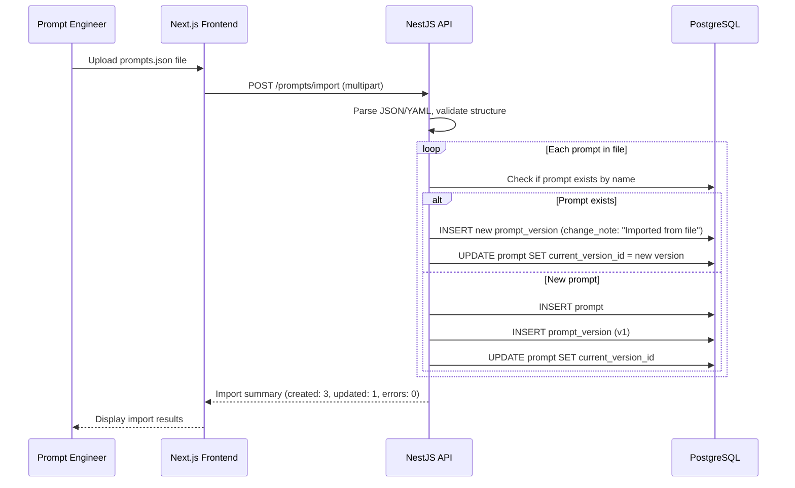

# Prompt Registry & Version Control — Feature Spec

> **Purpose**: Version, test, and manage all AI prompts across the uzhavu platform. Like Git for prompts — full version history, A/B testing, environment promotion, and analytics.
>
> **Architecture ref**: `APP_ARCHITECTURE.md` — follows manifest + module config pattern
>
> **AI Engine ref**: `ai-engine-improvements.md` — AI engine loads active prompts from DB instead of markdown files
>
> **Multi-tenant**: System-level prompts (`org_id = NULL`) are shared defaults. Each org can override with org-specific prompts. All org data scoped by `orgId`.

---

## Requirements

### Story 1: Prompt CRUD & Storage

As a **platform admin or org admin**, I want to store all AI prompts in the database instead of files so that prompts are versioned, searchable, and manageable from a UI.

#### Acceptance Criteria

- GIVEN I am an org admin WHEN I navigate to AI → Prompt Registry THEN I see a list of all prompts for my org (including system defaults) with columns: name, category, environment, current version, last modified, and status
- GIVEN I click "Create Prompt" WHEN I fill in name, description, category, content, and optional variables THEN the system creates a new prompt with version 1 and stores it in `prompts` and `prompt_versions`
- GIVEN a prompt with the same name already exists in my org WHEN I try to create it THEN the system returns an error: "A prompt with this name already exists in your organization."
- GIVEN I am viewing a prompt WHEN I edit the content and save THEN the system creates a new version (incrementing `version_number`), preserves the old version, and updates `current_version_id` on the prompt
- GIVEN I want to delete a prompt WHEN I click "Delete" and confirm THEN the prompt is soft-deleted (`is_active = false`) — not hard-deleted — so that references from analytics and A/B tests remain valid
- GIVEN I am on the free plan WHEN I try to create more than 5 prompts THEN I see an upgrade prompt: "Free plan supports up to 5 prompts. Upgrade to Starter for 50 prompts with version history."
- GIVEN a system-level prompt exists (`org_id = NULL`) WHEN my org has no override for that prompt THEN the AI engine uses the system default
- GIVEN a system-level prompt exists WHEN my org creates a prompt with the same name THEN my org's prompt overrides the system default for all AI operations in my org

---

### Story 2: Version History & Diff View

As a **prompt engineer**, I want to see the full version history of any prompt and compare versions side-by-side so that I can track changes and understand what was modified.

#### Acceptance Criteria

- GIVEN I am viewing a prompt WHEN I click "Version History" THEN I see a list of all versions with: version number, change note, author, timestamp, and a "View" button
- GIVEN I am viewing version history WHEN I select two versions and click "Compare" THEN I see a side-by-side diff view highlighting additions (green), deletions (red), and unchanged lines
- GIVEN I am viewing an older version WHEN I click "Rollback to this version" THEN the system creates a new version with the content of the selected version (does NOT delete intermediate versions) and updates `current_version_id`
- GIVEN a version was created WHEN I view it THEN I see the full content, all template variables used, and the change note provided by the author
- GIVEN I am on the free plan WHEN I try to view version history THEN I see an upgrade prompt: "Version history requires Starter plan or above."

---

### Story 3: Template Variables

As a **prompt engineer**, I want to use `{{variable}}` syntax in prompts so that prompts are reusable across different contexts without duplication.

#### Acceptance Criteria

- GIVEN I am editing a prompt WHEN I type `{{org_name}}` or `{{user_name}}` in the content THEN the editor highlights the variable and adds it to the detected variables list
- GIVEN a prompt contains `{{org_name}}`, `{{persona}}`, and `{{context}}` WHEN the AI engine loads this prompt at runtime THEN the variables are replaced with actual values from the request context
- GIVEN a prompt has required variables WHEN the AI engine tries to render it without all required variables THEN the system logs a warning and uses empty string for missing variables (does not crash)
- GIVEN I save a prompt with variables WHEN the system saves the version THEN the `variables` JSONB column stores an array of detected variable names with optional default values: `[{"name": "org_name", "required": true, "default": null}, {"name": "context", "required": false, "default": "general"}]`
- GIVEN I am previewing a prompt WHEN I click "Preview with sample data" THEN the system renders the prompt with sample values for all variables and shows the final output

---

### Story 4: Environment Promotion

As a **prompt engineer**, I want prompts to have environments (draft → staging → production) so that I can test changes safely before they affect live users.

#### Acceptance Criteria

- GIVEN I create a new prompt WHEN it is saved THEN its environment is set to `draft` by default
- GIVEN a prompt is in `draft` WHEN I click "Promote to Staging" THEN the prompt's environment changes to `staging` and it becomes available in the staging AI engine
- GIVEN a prompt is in `staging` WHEN I click "Promote to Production" on the Pro plan THEN the prompt goes live immediately
- GIVEN a prompt is in `staging` WHEN I click "Promote to Production" on the Enterprise plan THEN the system creates an approval request and the prompt remains in `staging` until an admin approves
- GIVEN an approval request exists WHEN an admin reviews and approves it THEN the prompt is promoted to `production` and a notification is sent to the requester
- GIVEN an approval request exists WHEN an admin rejects it THEN the prompt stays in `staging`, the rejection reason is recorded, and the requester is notified
- GIVEN a prompt is in `production` WHEN I need to make changes THEN I edit the prompt (creating a new version in `draft`) while the current production version continues serving traffic
- GIVEN I am on the free or starter plan WHEN I try to use environment promotion THEN all prompts are automatically in `production` (no staging workflow)

---

### Story 5: A/B Testing

As a **prompt engineer**, I want to run A/B tests between two prompt versions so that I can measure which version performs better before rolling it out.

#### Acceptance Criteria

- GIVEN I am viewing a prompt with multiple versions WHEN I click "Start A/B Test" THEN I see a form to select Variant A (version), Variant B (version), and traffic split percentage (default 50/50)
- GIVEN I configure an A/B test WHEN I start it THEN the system creates a `prompt_ab_tests` record with status `running` and begins routing traffic according to the split
- GIVEN an A/B test is running WHEN a user triggers the prompt THEN the system deterministically assigns the user to a variant using `hash(user_id + test_id) % 100 < split_pct` — the same user always gets the same variant
- GIVEN an A/B test is running WHEN I view the test dashboard THEN I see real-time metrics for both variants: impressions, thumbs up, thumbs down, avg tokens, avg latency, avg cost, and satisfaction score
- GIVEN an A/B test has collected sufficient data (min 100 impressions per variant) WHEN I click "Declare Winner" THEN the system sets `winner_version_id`, updates the prompt's `current_version_id` to the winner, and ends the test
- GIVEN an A/B test is running WHEN I click "Stop Test" THEN the system ends the test without declaring a winner and reverts to the original version
- GIVEN I am on the free or starter plan WHEN I try to create an A/B test THEN I see an upgrade prompt: "A/B testing requires Pro plan or above."

---

### Story 6: Prompt Analytics

As a **platform admin**, I want to see per-prompt usage metrics so that I can identify expensive, slow, or underperforming prompts.

#### Acceptance Criteria

- GIVEN I navigate to AI → Prompt Analytics WHEN data exists THEN I see a dashboard with: total prompt executions, avg tokens across all prompts, avg latency, avg cost, and overall satisfaction score
- GIVEN I am viewing the analytics dashboard WHEN I click on a specific prompt THEN I see its detailed metrics: total uses, avg tokens, avg latency, avg cost, satisfaction score (thumbs up/down ratio), and a time-series chart showing trends over the last 30 days
- GIVEN the AI engine executes a prompt WHEN the response completes THEN the system records: prompt_id, version_id, org_id, tokens used, latency (ms), estimated cost (USD), and links to the LLM trace if the trace viewer module is active
- GIVEN I am viewing prompt analytics WHEN I sort by "avg cost" descending THEN I see the most expensive prompts first — useful for optimization
- GIVEN I am on the free or starter plan WHEN I try to view analytics THEN I see an upgrade prompt: "Prompt analytics requires Pro plan or above."

---

### Story 7: Prompt Library & Sharing

As a **platform admin**, I want to maintain a library of system-level prompts that all orgs can use so that best practices are shared and org admins don't start from scratch.

#### Acceptance Criteria

- GIVEN I am a platform admin WHEN I create a prompt with `org_id = NULL` THEN it becomes a system-level prompt visible to all orgs as a read-only default
- GIVEN I am an org admin WHEN I view the Prompt Library THEN I see all system-level prompts with a badge "System Default" and a button "Copy to My Org" to create an editable org-specific copy
- GIVEN an org has no custom prompt for "customer_support_persona" WHEN the AI engine loads prompts for that org THEN it falls back to the system-level "customer_support_persona" prompt
- GIVEN an org has customized "customer_support_persona" WHEN the AI engine loads prompts THEN it uses the org's version (org-specific overrides system default)
- GIVEN I am on the Enterprise plan WHEN I navigate to Prompt Library THEN I also see a "Share with Platform" button that submits my org's prompt for review as a system-level contribution
- GIVEN I am on the free or starter plan WHEN I try to access the Prompt Library THEN I can still see and use system defaults but cannot share prompts

---

### Story 8: Import/Export

As a **prompt engineer**, I want to export prompts as JSON/YAML and import from files so that I can back up prompts, share them across environments, or version them in Git.

#### Acceptance Criteria

- GIVEN I select one or more prompts WHEN I click "Export" and choose JSON format THEN the system downloads a JSON file containing each prompt's name, description, category, content, variables, and version history
- GIVEN I select prompts WHEN I click "Export" and choose YAML format THEN the system downloads a YAML file with the same structure
- GIVEN I have a valid prompt JSON/YAML file WHEN I click "Import" and upload it THEN the system creates new prompts (or updates existing ones by name match) and shows a preview before confirming
- GIVEN I import a prompt that already exists by name WHEN I confirm the import THEN the system creates a new version with the imported content (does not overwrite — adds a version with change note "Imported from file")
- GIVEN I import a file with invalid structure WHEN the system parses it THEN I see specific validation errors: "Missing required field 'content' on prompt 'xyz'"
- GIVEN I configure a Git webhook URL in settings WHEN a push event is received for files matching `prompts/*.yaml` THEN the system auto-imports updated prompts from the webhook payload

---

## Design

### Architecture Overview

```
┌─────────────┐    ┌──────────────┐    ┌──────────────────┐
│  Next.js     │───▶│  NestJS API  │───▶│  PostgreSQL      │
│  Frontend    │    │  /prompts/*  │    │  prompt_*        │
│              │    │              │    │  tables          │
└─────────────┘    └──────┬───────┘    └──────────────────┘
                          │
              ┌───────────┼───────────┐
              │           │           │
              ▼           ▼           ▼
       ┌────────────┐ ┌──────────┐ ┌─────────────┐
       │ FastAPI AI  │ │ LLM      │ │ Event Bus   │
       │ Engine      │ │ Trace    │ │ (internal)  │
       │ (consumer)  │ │ Viewer   │ │             │
       └────────────┘ └──────────┘ └─────────────┘
```

**Key flows:**
1. **Management** (CRUD, versioning, A/B tests): Next.js → NestJS API → PostgreSQL
2. **Runtime Loading**: FastAPI AI engine → PostgreSQL (cached in memory with 5-min TTL)
3. **Analytics**: FastAPI AI engine emits metrics after each prompt execution → NestJS aggregates via cron
4. **Events**: Prompt changes emit `prompt.updated` / `prompt.promoted` events for cache invalidation

---

### Data Models

```sql
-- ============================================================
-- Prompts — the master record for each prompt
-- ============================================================
CREATE TABLE prompts (
  id                    TEXT PRIMARY KEY DEFAULT gen_random_uuid()::text,
  org_id                TEXT,                              -- NULL = system-level (shared across all orgs)
  name                  TEXT NOT NULL,                     -- Unique per org (or system-level)
  description           TEXT,
  category              TEXT NOT NULL DEFAULT 'general',   -- system|persona|tool|workflow|custom
  current_version_id    TEXT,                              -- FK to prompt_versions.id (set after first version)
  environment           TEXT NOT NULL DEFAULT 'draft',     -- draft|staging|production
  is_active             BOOLEAN DEFAULT true,
  created_by            TEXT,                              -- User ID who created
  created_at            TIMESTAMPTZ DEFAULT NOW(),
  updated_at            TIMESTAMPTZ DEFAULT NOW()
);

-- Name must be unique within an org (or within system-level prompts)
CREATE UNIQUE INDEX idx_prompt_name_org ON prompts(org_id, name) WHERE org_id IS NOT NULL;
CREATE UNIQUE INDEX idx_prompt_name_system ON prompts(name) WHERE org_id IS NULL;
CREATE INDEX idx_prompt_org ON prompts(org_id) WHERE org_id IS NOT NULL;
CREATE INDEX idx_prompt_category ON prompts(org_id, category);
CREATE INDEX idx_prompt_env ON prompts(org_id, environment);
CREATE INDEX idx_prompt_active ON prompts(org_id, is_active) WHERE is_active = true;

-- ============================================================
-- Prompt versions — every edit creates a new version
-- ============================================================
CREATE TABLE prompt_versions (
  id                    TEXT PRIMARY KEY DEFAULT gen_random_uuid()::text,
  prompt_id             TEXT NOT NULL REFERENCES prompts(id) ON DELETE CASCADE,
  version_number        INT NOT NULL,                     -- Auto-incremented per prompt
  content               TEXT NOT NULL,                    -- The actual prompt text with {{variables}}
  variables             JSONB DEFAULT '[]',               -- Detected variables: [{"name": "org_name", "required": true, "default": null}]
  change_note           TEXT,                             -- "Updated tone to be more professional"
  created_by            TEXT,                             -- User ID who created this version
  created_at            TIMESTAMPTZ DEFAULT NOW()
);

CREATE UNIQUE INDEX idx_prompt_version_num ON prompt_versions(prompt_id, version_number);
CREATE INDEX idx_prompt_version_prompt ON prompt_versions(prompt_id, created_at DESC);

-- Add FK constraint after both tables exist
ALTER TABLE prompts ADD CONSTRAINT fk_prompt_current_version
  FOREIGN KEY (current_version_id) REFERENCES prompt_versions(id);

-- ============================================================
-- A/B tests — run two versions simultaneously
-- ============================================================
CREATE TABLE prompt_ab_tests (
  id                      TEXT PRIMARY KEY DEFAULT gen_random_uuid()::text,
  prompt_id               TEXT NOT NULL REFERENCES prompts(id) ON DELETE CASCADE,
  org_id                  TEXT NOT NULL,
  name                    TEXT,                             -- "Formal vs casual tone test"
  variant_a_version_id    TEXT NOT NULL REFERENCES prompt_versions(id),
  variant_b_version_id    TEXT NOT NULL REFERENCES prompt_versions(id),
  traffic_split_pct       INT NOT NULL DEFAULT 50,          -- % of traffic to Variant A (remainder goes to B)
  status                  TEXT NOT NULL DEFAULT 'draft',     -- draft|running|completed|cancelled
  winner_version_id       TEXT REFERENCES prompt_versions(id),
  min_impressions         INT DEFAULT 100,                  -- Min impressions per variant before declaring winner
  started_at              TIMESTAMPTZ,
  ended_at                TIMESTAMPTZ,
  created_by              TEXT,
  created_at              TIMESTAMPTZ DEFAULT NOW()
);

CREATE INDEX idx_ab_test_prompt ON prompt_ab_tests(prompt_id);
CREATE INDEX idx_ab_test_org ON prompt_ab_tests(org_id, status);
CREATE INDEX idx_ab_test_running ON prompt_ab_tests(prompt_id, status) WHERE status = 'running';

-- ============================================================
-- A/B test results — aggregated metrics per variant
-- ============================================================
CREATE TABLE prompt_ab_results (
  id                    TEXT PRIMARY KEY DEFAULT gen_random_uuid()::text,
  test_id               TEXT NOT NULL REFERENCES prompt_ab_tests(id) ON DELETE CASCADE,
  version_id            TEXT NOT NULL REFERENCES prompt_versions(id),
  impressions           INT DEFAULT 0,
  thumbs_up             INT DEFAULT 0,
  thumbs_down           INT DEFAULT 0,
  avg_tokens            FLOAT DEFAULT 0,
  avg_latency_ms        FLOAT DEFAULT 0,
  avg_cost_usd          FLOAT DEFAULT 0,
  updated_at            TIMESTAMPTZ DEFAULT NOW(),
  created_at            TIMESTAMPTZ DEFAULT NOW()
);

CREATE UNIQUE INDEX idx_ab_result_test_version ON prompt_ab_results(test_id, version_id);

-- ============================================================
-- Prompt analytics — per-prompt, per-period usage metrics
-- ============================================================
CREATE TABLE prompt_analytics (
  id                    TEXT PRIMARY KEY DEFAULT gen_random_uuid()::text,
  prompt_id             TEXT NOT NULL REFERENCES prompts(id) ON DELETE CASCADE,
  version_id            TEXT REFERENCES prompt_versions(id),
  org_id                TEXT NOT NULL,
  total_uses            INT DEFAULT 0,
  avg_tokens            FLOAT DEFAULT 0,
  avg_latency_ms        FLOAT DEFAULT 0,
  avg_cost_usd          FLOAT DEFAULT 0,
  satisfaction_score    FLOAT DEFAULT 0,                  -- (thumbs_up / (thumbs_up + thumbs_down)) * 100
  thumbs_up             INT DEFAULT 0,
  thumbs_down           INT DEFAULT 0,
  period_start          TIMESTAMPTZ NOT NULL,
  period_end            TIMESTAMPTZ NOT NULL,
  created_at            TIMESTAMPTZ DEFAULT NOW()
);

CREATE INDEX idx_analytics_prompt ON prompt_analytics(prompt_id, period_start DESC);
CREATE INDEX idx_analytics_org ON prompt_analytics(org_id, period_start DESC);
CREATE UNIQUE INDEX idx_analytics_unique ON prompt_analytics(prompt_id, version_id, org_id, period_start);

-- ============================================================
-- Prompt approvals — for enterprise environment promotion
-- ============================================================
CREATE TABLE prompt_approvals (
  id                    TEXT PRIMARY KEY DEFAULT gen_random_uuid()::text,
  prompt_id             TEXT NOT NULL REFERENCES prompts(id) ON DELETE CASCADE,
  version_id            TEXT NOT NULL REFERENCES prompt_versions(id),
  org_id                TEXT NOT NULL,
  from_environment      TEXT NOT NULL,                    -- staging
  to_environment        TEXT NOT NULL,                    -- production
  requested_by          TEXT NOT NULL,                    -- User ID
  reviewed_by           TEXT,                             -- Admin user ID
  status                TEXT NOT NULL DEFAULT 'pending',  -- pending|approved|rejected
  rejection_reason      TEXT,
  requested_at          TIMESTAMPTZ DEFAULT NOW(),
  reviewed_at           TIMESTAMPTZ
);

CREATE INDEX idx_approval_org ON prompt_approvals(org_id, status);
CREATE INDEX idx_approval_pending ON prompt_approvals(org_id, status) WHERE status = 'pending';

-- ============================================================
-- Prompt execution log — raw per-execution data (feeds analytics)
-- ============================================================
CREATE TABLE prompt_execution_log (
  id                    TEXT PRIMARY KEY DEFAULT gen_random_uuid()::text,
  prompt_id             TEXT NOT NULL,
  version_id            TEXT NOT NULL,
  org_id                TEXT NOT NULL,
  user_id               TEXT,
  ab_test_id            TEXT,                             -- NULL if not part of A/B test
  tokens_used           INT NOT NULL,
  latency_ms            INT NOT NULL,
  cost_usd              FLOAT NOT NULL,
  trace_id              TEXT,                             -- Link to LLM trace viewer
  created_at            TIMESTAMPTZ DEFAULT NOW()
);

CREATE INDEX idx_exec_log_prompt ON prompt_execution_log(prompt_id, created_at DESC);
CREATE INDEX idx_exec_log_org ON prompt_execution_log(org_id, created_at DESC);
-- Partition by month for large-scale deployments (optional)
-- This table can grow fast — consider retention policy (90 days)
```

---

### API Contracts

#### Module Structure

```
apps/api/src/modules/prompts/
├── prompts.module.ts
├── prompts.controller.ts           # CRUD, version history, environment promotion
├── prompts.ab-test.controller.ts   # A/B test management
├── prompts.analytics.controller.ts # Analytics endpoints
├── prompts.import-export.controller.ts # Import/export endpoints
├── prompts.service.ts              # Core business logic
├── prompts.version.service.ts      # Version management + diff
├── prompts.ab-test.service.ts      # A/B test logic + variant assignment
├── prompts.analytics.service.ts    # Aggregation + metrics
├── prompts.approval.service.ts     # Enterprise approval workflow
├── prompts.cache.service.ts        # In-memory cache management
├── dto/
│   ├── create-prompt.dto.ts
│   ├── update-prompt.dto.ts
│   ├── create-version.dto.ts
│   ├── create-ab-test.dto.ts
│   ├── promote-prompt.dto.ts
│   └── import-prompts.dto.ts
├── interfaces/
│   └── prompt-variables.interface.ts
└── prompts.service.spec.ts
```

```
# FastAPI AI engine — prompt loading middleware
ai-engine/app/prompts/
├── prompt_loader.py                # Load prompts from DB with caching
├── prompt_renderer.py              # Replace {{variables}} with runtime values
├── prompt_ab_router.py             # Deterministic A/B variant assignment
└── prompt_metrics.py               # Record execution metrics
```

---

#### Prompt CRUD

```
POST /business/:orgId/prompts
Authorization: Bearer <token>
```

**Request:**
```json
{
  "name": "customer_support_persona",
  "description": "Persona prompt for customer support AI agent",
  "category": "persona",
  "content": "You are a helpful customer support agent for {{org_name}}. Your tone is {{tone}}. Today's date is {{date}}.\n\nYou have access to the following context:\n{{context}}",
  "changeNote": "Initial version",
  "variables": [
    {"name": "org_name", "required": true, "default": null},
    {"name": "tone", "required": false, "default": "professional and friendly"},
    {"name": "date", "required": true, "default": null},
    {"name": "context", "required": false, "default": ""}
  ]
}
```

**Response (201):**
```json
{
  "success": true,
  "data": {
    "id": "prm_abc123",
    "orgId": "org_xyz",
    "name": "customer_support_persona",
    "description": "Persona prompt for customer support AI agent",
    "category": "persona",
    "environment": "draft",
    "currentVersion": {
      "id": "pv_001",
      "versionNumber": 1,
      "changeNote": "Initial version",
      "createdAt": "2026-07-05T12:00:00Z"
    },
    "isActive": true,
    "createdAt": "2026-07-05T12:00:00Z"
  }
}
```

**Errors:**
- `400` — Missing required fields (name, content)
- `409` — Prompt with this name already exists for this org
- `429` — Prompt quota exceeded for current plan

```
GET /business/:orgId/prompts?category=persona&environment=production&page=1&limit=20
Authorization: Bearer <token>
```

**Response (200):**
```json
{
  "success": true,
  "data": [
    {
      "id": "prm_abc123",
      "name": "customer_support_persona",
      "description": "Persona prompt for customer support AI agent",
      "category": "persona",
      "environment": "production",
      "currentVersionNumber": 3,
      "isActive": true,
      "isSystemDefault": false,
      "updatedAt": "2026-07-05T14:30:00Z"
    }
  ],
  "pagination": { "page": 1, "limit": 20, "total": 12 }
}
```

```
GET /business/:orgId/prompts/:promptId
```

**Response (200):**
```json
{
  "success": true,
  "data": {
    "id": "prm_abc123",
    "orgId": "org_xyz",
    "name": "customer_support_persona",
    "description": "Persona prompt for customer support AI agent",
    "category": "persona",
    "environment": "production",
    "isActive": true,
    "isSystemDefault": false,
    "currentVersion": {
      "id": "pv_003",
      "versionNumber": 3,
      "content": "You are a helpful customer support agent for {{org_name}}...",
      "variables": [
        {"name": "org_name", "required": true, "default": null},
        {"name": "tone", "required": false, "default": "professional and friendly"}
      ],
      "changeNote": "Made tone more conversational",
      "createdBy": "user_123",
      "createdAt": "2026-07-05T14:30:00Z"
    },
    "totalVersions": 3,
    "createdAt": "2026-07-05T12:00:00Z"
  }
}
```

```
PATCH /business/:orgId/prompts/:promptId
Authorization: Bearer <token>
```

**Request (metadata update — no new version):**
```json
{
  "description": "Updated description",
  "category": "workflow"
}
```

```
DELETE /business/:orgId/prompts/:promptId
Authorization: Bearer <token>
```

Soft-delete: sets `is_active = false`. Returns `200 OK`.

---

#### Version Management

```
POST /business/:orgId/prompts/:promptId/versions
Authorization: Bearer <token>
```

**Request:**
```json
{
  "content": "You are a warm, helpful customer support agent for {{org_name}}. Always greet the customer by name ({{user_name}}).\n\nContext:\n{{context}}",
  "changeNote": "Added user name greeting, warmer tone"
}
```

**Response (201):**
```json
{
  "success": true,
  "data": {
    "id": "pv_004",
    "promptId": "prm_abc123",
    "versionNumber": 4,
    "content": "You are a warm, helpful customer support agent for...",
    "variables": [
      {"name": "org_name", "required": true, "default": null},
      {"name": "user_name", "required": true, "default": null},
      {"name": "context", "required": false, "default": ""}
    ],
    "changeNote": "Added user name greeting, warmer tone",
    "createdBy": "user_123",
    "createdAt": "2026-07-05T15:00:00Z"
  }
}
```

```
GET /business/:orgId/prompts/:promptId/versions
Authorization: Bearer <token>
```

**Response (200):**
```json
{
  "success": true,
  "data": [
    {
      "id": "pv_004",
      "versionNumber": 4,
      "changeNote": "Added user name greeting, warmer tone",
      "createdBy": "user_123",
      "createdAt": "2026-07-05T15:00:00Z",
      "isCurrent": true
    },
    {
      "id": "pv_003",
      "versionNumber": 3,
      "changeNote": "Made tone more conversational",
      "createdBy": "user_123",
      "createdAt": "2026-07-05T14:30:00Z",
      "isCurrent": false
    }
  ]
}
```

```
GET /business/:orgId/prompts/:promptId/versions/:versionId
```

Returns full version content.

```
GET /business/:orgId/prompts/:promptId/diff?from=pv_002&to=pv_004
```

**Response (200):**
```json
{
  "success": true,
  "data": {
    "from": { "id": "pv_002", "versionNumber": 2 },
    "to": { "id": "pv_004", "versionNumber": 4 },
    "diff": [
      { "type": "unchanged", "content": "You are a " },
      { "type": "removed", "content": "helpful" },
      { "type": "added", "content": "warm, helpful" },
      { "type": "unchanged", "content": " customer support agent for {{org_name}}." },
      { "type": "added", "content": " Always greet the customer by name ({{user_name}})." }
    ],
    "variablesAdded": ["user_name"],
    "variablesRemoved": ["tone"]
  }
}
```

```
POST /business/:orgId/prompts/:promptId/rollback
Authorization: Bearer <token>
```

**Request:**
```json
{
  "targetVersionId": "pv_002",
  "changeNote": "Rollback to version 2 — warmer tone caused confusion"
}
```

Creates a new version (v5) with v2's content. Does not delete v3 or v4.

---

#### Environment Promotion

```
POST /business/:orgId/prompts/:promptId/promote
Authorization: Bearer <token>
```

**Request:**
```json
{
  "targetEnvironment": "staging"
}
```

**Response (200):**
```json
{
  "success": true,
  "data": {
    "id": "prm_abc123",
    "environment": "staging",
    "promotedAt": "2026-07-05T16:00:00Z"
  }
}
```

**Response (202 — Enterprise approval required):**
```json
{
  "success": true,
  "data": {
    "approvalId": "appr_001",
    "status": "pending",
    "message": "Promotion to production requires admin approval. Request submitted."
  }
}
```

**Errors:**
- `400` — Invalid promotion path (e.g., draft → production, must go through staging)
- `403` — Approval required (Enterprise plan, staging → production)
- `409` — An active A/B test is running on this prompt — end it first

```
POST /business/:orgId/prompts/approvals/:approvalId/review
Authorization: Bearer <token>
```

**Request:**
```json
{
  "decision": "approved",
  "note": "Looks good, approved for production"
}
```

or:

```json
{
  "decision": "rejected",
  "reason": "The tone is too informal for our customer base"
}
```

```
GET /business/:orgId/prompts/approvals?status=pending
```

---

#### A/B Testing

```
POST /business/:orgId/prompts/:promptId/ab-tests
Authorization: Bearer <token>
```

**Request:**
```json
{
  "name": "Formal vs Casual Tone",
  "variantAVersionId": "pv_003",
  "variantBVersionId": "pv_004",
  "trafficSplitPct": 50,
  "minImpressions": 200
}
```

**Response (201):**
```json
{
  "success": true,
  "data": {
    "id": "ab_001",
    "promptId": "prm_abc123",
    "name": "Formal vs Casual Tone",
    "variantA": { "id": "pv_003", "versionNumber": 3 },
    "variantB": { "id": "pv_004", "versionNumber": 4 },
    "trafficSplitPct": 50,
    "status": "draft",
    "minImpressions": 200,
    "createdAt": "2026-07-05T16:00:00Z"
  }
}
```

```
POST /business/:orgId/prompts/ab-tests/:testId/start
```

Sets status to `running`, records `started_at`.

```
POST /business/:orgId/prompts/ab-tests/:testId/stop
```

Sets status to `cancelled`, records `ended_at`. Reverts to original version.

```
POST /business/:orgId/prompts/ab-tests/:testId/declare-winner
Authorization: Bearer <token>
```

**Request:**
```json
{
  "winnerVersionId": "pv_004"
}
```

Sets `winner_version_id`, updates prompt's `current_version_id`, sets status to `completed`.

```
GET /business/:orgId/prompts/ab-tests/:testId
```

**Response (200):**
```json
{
  "success": true,
  "data": {
    "id": "ab_001",
    "name": "Formal vs Casual Tone",
    "status": "running",
    "trafficSplitPct": 50,
    "startedAt": "2026-07-05T16:30:00Z",
    "results": {
      "variantA": {
        "versionId": "pv_003",
        "versionNumber": 3,
        "impressions": 147,
        "thumbsUp": 52,
        "thumbsDown": 8,
        "satisfactionScore": 86.7,
        "avgTokens": 342,
        "avgLatencyMs": 1240,
        "avgCostUsd": 0.0042
      },
      "variantB": {
        "versionId": "pv_004",
        "versionNumber": 4,
        "impressions": 153,
        "thumbsUp": 71,
        "thumbsDown": 5,
        "satisfactionScore": 93.4,
        "avgTokens": 387,
        "avgLatencyMs": 1380,
        "avgCostUsd": 0.0048
      }
    },
    "recommendation": "Variant B has higher satisfaction (93.4% vs 86.7%) but costs 14% more per execution."
  }
}
```

---

#### Analytics

```
GET /business/:orgId/prompts/analytics?period=30d&sortBy=avg_cost_usd&order=desc
Authorization: Bearer <token>
```

**Response (200):**
```json
{
  "success": true,
  "data": {
    "summary": {
      "totalExecutions": 12450,
      "avgTokens": 385,
      "avgLatencyMs": 1150,
      "avgCostUsd": 0.0041,
      "overallSatisfaction": 88.3,
      "totalCostUsd": 51.05
    },
    "prompts": [
      {
        "promptId": "prm_abc123",
        "name": "customer_support_persona",
        "totalUses": 3200,
        "avgTokens": 420,
        "avgLatencyMs": 1350,
        "avgCostUsd": 0.0052,
        "satisfactionScore": 91.2,
        "trend": "improving"
      }
    ]
  }
}
```

```
GET /business/:orgId/prompts/:promptId/analytics?period=30d
```

Returns detailed per-prompt analytics with daily time series.

---

#### Import/Export

```
POST /business/:orgId/prompts/export
Authorization: Bearer <token>
```

**Request:**
```json
{
  "promptIds": ["prm_abc123", "prm_def456"],
  "format": "json",
  "includeVersionHistory": true
}
```

**Response (200):** Returns file download.

```json
{
  "exportedAt": "2026-07-05T17:00:00Z",
  "orgId": "org_xyz",
  "prompts": [
    {
      "name": "customer_support_persona",
      "description": "Persona prompt for customer support AI agent",
      "category": "persona",
      "versions": [
        {
          "versionNumber": 1,
          "content": "...",
          "variables": [...],
          "changeNote": "Initial version",
          "createdAt": "2026-07-05T12:00:00Z"
        }
      ]
    }
  ]
}
```

```
POST /business/:orgId/prompts/import
Authorization: Bearer <token>
Content-Type: multipart/form-data
```

**Request:** Upload JSON or YAML file.

**Response (200):**
```json
{
  "success": true,
  "data": {
    "imported": 3,
    "updated": 1,
    "skipped": 0,
    "errors": [],
    "details": [
      { "name": "customer_support_persona", "action": "created", "promptId": "prm_new1" },
      { "name": "sales_outreach", "action": "version_added", "promptId": "prm_existing", "newVersion": 5 }
    ]
  }
}
```

**Errors:**
- `400` — Invalid file format or structure
- `413` — File too large (max 5MB)

---

#### AI Engine — Prompt Loading (FastAPI Internal)

```
GET /internal/prompts/resolve?org_id=org_xyz&name=customer_support_persona&environment=production
```

**Response (200):**
```json
{
  "prompt_id": "prm_abc123",
  "version_id": "pv_004",
  "content": "You are a warm, helpful customer support agent for {{org_name}}...",
  "variables": [
    {"name": "org_name", "required": true, "default": null},
    {"name": "user_name", "required": true, "default": null},
    {"name": "context", "required": false, "default": ""}
  ],
  "ab_test": {
    "test_id": "ab_001",
    "variant": "B"
  },
  "source": "org_override"
}
```

Resolution order:
1. Check org-specific prompt by name + environment → if found, use it
2. Check system-level prompt by name + environment → if found, use it as fallback
3. If A/B test is running → deterministically assign variant
4. Cache result for 5 minutes (keyed by `org_id:name:environment`)

---

### Sequence Diagrams

#### Prompt Execution with A/B Test



#### Environment Promotion (Enterprise Approval)



#### Import from File



---

### Frontend Structure

```
apps/web/src/apps/prompts/
├── manifest.ts
├── modules/
│   ├── registry.ts              # Prompt list/CRUD config
│   ├── versions.ts              # Version history config
│   ├── ab-tests.ts              # A/B test management config
│   ├── analytics.ts             # Analytics dashboard config
│   └── library.ts               # Prompt library config
├── pages/
│   ├── PromptListPage.tsx       # Main prompt list with filters
│   ├── PromptDetailPage.tsx     # View/edit prompt + version history
│   ├── PromptEditorPage.tsx     # Full-screen editor with preview
│   ├── VersionHistoryPage.tsx   # Version list + diff view
│   ├── AbTestListPage.tsx       # A/B test list
│   ├── AbTestDetailPage.tsx     # A/B test results dashboard
│   ├── AnalyticsDashboard.tsx   # Per-prompt metrics
│   ├── PromptLibraryPage.tsx    # System-level prompt browser
│   ├── ApprovalsPage.tsx        # Enterprise approval queue
│   └── ImportExportPage.tsx     # Bulk import/export
├── components/
│   ├── PromptEditor.tsx         # CodeMirror-based editor with variable highlighting
│   ├── PromptPreview.tsx        # Rendered preview with sample variable values
│   ├── VersionDiff.tsx          # Side-by-side diff viewer
│   ├── VersionTimeline.tsx      # Vertical timeline of versions
│   ├── VariableBadge.tsx        # {{variable}} chip/tag display
│   ├── EnvironmentBadge.tsx     # draft/staging/production colored badge
│   ├── AbTestChart.tsx          # Bar chart comparing variant metrics
│   ├── SatisfactionMeter.tsx    # Thumbs up/down ratio visual
│   ├── AnalyticsCard.tsx        # Metric card (tokens, latency, cost)
│   └── CategoryFilter.tsx       # Category dropdown filter
├── actions/
│   └── prompts.ts               # Server actions with withAction()
└── styles/
    ├── PromptEditor.module.css
    ├── VersionDiff.module.css
    ├── AbTest.module.css
    └── Analytics.module.css
```

**Manifest:**
```typescript
export const manifest: AppManifest = {
  id: 'prompts',
  name: 'Prompt Registry',
  description: 'Version, test, and manage AI prompts — with A/B testing and analytics',
  icon: 'file-code-2',
  version: '1.0.0',
  plans: ['free', 'starter', 'pro', 'enterprise'],
  dependencies: [],
  models: ['Prompt', 'PromptVersion', 'PromptAbTest', 'PromptAnalytics'],
  nav: { section: 'ai', order: 1 },
  routes: [
    { path: '/prompts/registry', label: 'Registry', icon: 'file-code-2' },
    { path: '/prompts/ab-tests', label: 'A/B Tests', icon: 'split' },
    { path: '/prompts/analytics', label: 'Analytics', icon: 'bar-chart-3' },
    { path: '/prompts/library', label: 'Library', icon: 'library' },
    { path: '/prompts/approvals', label: 'Approvals', icon: 'check-circle' },
  ],
};
```

---

### Plan Gating Matrix

| Feature | Free | Starter (₹499) | Pro (₹1,499) | Enterprise (₹4,999) |
|:--------|:-----|:----------------|:--------------|:---------------------|
| **Prompt Count** | 5 | 50 | Unlimited | Unlimited |
| **Version History** | ✗ (always v1) | ✓ | ✓ | ✓ |
| **Template Variables** | ✓ | ✓ | ✓ | ✓ |
| **Environments** | Production only | Production only | Draft → Staging → Prod | Draft → Staging → Prod |
| **A/B Testing** | ✗ | ✗ | ✓ | ✓ |
| **Analytics** | ✗ | ✗ | ✓ | ✓ + custom reports |
| **Approval Workflow** | ✗ | ✗ | ✗ | ✓ |
| **Prompt Library** | Read-only defaults | Read-only defaults | Read + copy | Read + copy + share |
| **Import/Export** | ✗ | JSON export only | JSON + YAML | JSON + YAML + Git sync |
| **Diff View** | ✗ | ✓ | ✓ | ✓ |
| **Rollback** | ✗ | ✓ | ✓ | ✓ |

---

### Dependencies & Integrations

| Dependency | Purpose | Notes |
|:-----------|:--------|:------|
| **FastAPI AI Engine** | Runtime prompt loading + rendering | Internal call: `GET http://ai-engine:8000/internal/prompts/resolve` |
| **LLM Trace Viewer** | Link prompt executions to traces | `trace_id` in `prompt_execution_log` links to existing trace viewer |
| **API Key Management** | Authenticate AI engine requests | Internal API keys for engine ↔ API communication |
| **EventBusService** | Cache invalidation events | Emit `prompt.updated` / `prompt.promoted` events |
| **Encryption Service** | N/A for this module | Prompts are not encrypted (not secrets) |
| **Plan Gating Service** | Enforce prompt quotas and feature limits | Check `prompt_count` vs plan limit on create |

### Error Handling

| Scenario | Action |
|:---------|:-------|
| Prompt name already exists in org | Return 409 with clear error message |
| Prompt quota exceeded for plan | Return 429 with upgrade prompt |
| Rollback target version not found | Return 404: "Version not found" |
| A/B test started on prompt in draft env | Return 400: "Promote prompt to staging or production before A/B testing" |
| Promote while A/B test running | Return 409: "End the running A/B test before promoting" |
| Declare winner with insufficient impressions | Return 400: "Minimum 100 impressions per variant required. Currently: A=47, B=53" |
| Import file exceeds 5MB | Return 413: "Import file too large. Maximum size: 5MB" |
| Import file has invalid structure | Return 400 with per-prompt validation errors |
| AI engine can't find prompt (cache miss + DB miss) | Use hardcoded fallback, log error, alert admin |
| Template variable missing at runtime | Use empty string, log warning (don't crash) |
| Concurrent version creation (race condition) | DB unique constraint on `(prompt_id, version_number)` — retry with incremented number |
| Approval request for non-enterprise plan | Return 403: "Approval workflow is available on Enterprise plan" |

### Security Considerations

| Concern | Mitigation |
|:--------|:-----------|
| IDOR (accessing another org's prompts) | All queries scoped by `orgId` from auth token |
| Prompt injection in template variables | Variables are only inserted into prompt text, not executed as code. Sanitize for control characters |
| System prompt tampering | Only platform admins can create/edit system-level prompts (`org_id = NULL`) |
| Import of malicious content | Validate JSON/YAML structure, limit content size, sanitize HTML/script tags |
| A/B test data leakage | Test results scoped by org — one org cannot see another's test results |

---

## Tasks

### Phase 1: Foundation — Schema & CRUD (~3 days)

- [ ] Create Prisma schema for `prompts`, `prompt_versions`, `prompt_ab_tests`, `prompt_ab_results`, `prompt_analytics`, `prompt_approvals`, `prompt_execution_log` tables (~3h)
- [ ] Run migration, verify tables, indexes, and unique constraints in PostgreSQL (~30m)
- [ ] Create NestJS module skeleton: `prompts.module.ts` with all service/controller registrations (~1h)
- [ ] Implement `PromptsService` — prompt CRUD (create with auto-version-1, get, update metadata, soft-delete) (~4h)
- [ ] Implement `PromptsController` — prompt endpoints: `POST/GET/PATCH/DELETE /business/:orgId/prompts` with pagination and filters (~3h)
- [ ] Implement unique name validation per org (including system-level collision check) (~1h)
- [ ] Add plan-based guard: check prompt count quota (free=5, starter=50, pro/enterprise=unlimited) (~2h)
- [ ] Implement template variable auto-detection: parse `{{variable_name}}` from content using regex, store in `variables` JSONB (~2h)
- [ ] Write unit tests for CRUD, name uniqueness, quota enforcement, and variable detection (~3h)

### Phase 2: Version Management (~3 days)

- [ ] Implement `PromptsVersionService` — create new version (auto-increment version_number), list versions, get version (~3h)
- [ ] Implement version diff endpoint: compare two versions using `diff-match-patch` library, return structured diff (~4h)
- [ ] Implement rollback endpoint: create new version with content from target version, update `current_version_id` (~2h)
- [ ] Implement version history endpoint with pagination, sorted by version_number DESC (~2h)
- [ ] Implement version controller: `POST /versions`, `GET /versions`, `GET /versions/:id`, `GET /diff`, `POST /rollback` (~3h)
- [ ] Add plan-based guard: free plan users skip versioning (always overwrite v1) (~1h)
- [ ] Write unit tests for version creation, diff generation, rollback, and plan gating (~3h)

### Phase 3: Environment Promotion & Approvals (~2 days)

- [ ] Implement environment promotion logic: validate promotion path (draft→staging→production), update environment field (~3h)
- [ ] Implement `PromptsApprovalService` — create approval request, list pending, review (approve/reject) (~3h)
- [ ] Implement approval controller: `POST /promote`, `GET /approvals`, `POST /approvals/:id/review` (~2h)
- [ ] Add enterprise-only approval gating: direct promote for free/starter/pro, approval required for enterprise staging→production (~2h)
- [ ] Emit `prompt.promoted` event via EventBusService on successful promotion (~1h)
- [ ] Write unit tests for promotion paths, approval workflow, and plan-based behavior (~2h)

### Phase 4: A/B Testing (~3 days)

- [ ] Implement `PromptsAbTestService` — create test, start, stop, declare winner (~4h)
- [ ] Implement deterministic variant assignment: `hash(user_id + test_id) % 100` using SHA-256 (~2h)
- [ ] Implement A/B results tracking: increment impressions/thumbs/token averages on each execution (~3h)
- [ ] Implement A/B test controller: `POST /ab-tests`, `POST /start`, `POST /stop`, `POST /declare-winner`, `GET /:testId` (~3h)
- [ ] Add validation: only one running test per prompt, min impressions check before declaring winner (~2h)
- [ ] Implement auto-recommendation: compare satisfaction scores and costs between variants (~2h)
- [ ] Add plan-based guard: A/B testing requires Pro plan or above (~1h)
- [ ] Write unit tests for variant assignment determinism, result aggregation, and winner declaration (~3h)

### Phase 5: AI Engine Integration (~3 days)

- [ ] Implement `prompt_loader.py` in FastAPI: load prompt by org_id + name + environment from DB (~3h)
- [ ] Implement prompt resolution order: org-specific → system fallback → hardcoded fallback (~2h)
- [ ] Implement in-memory cache with 5-minute TTL using `cachetools.TTLCache`, keyed by `org_id:name:env` (~2h)
- [ ] Implement `prompt_renderer.py`: replace `{{variable}}` with runtime values from request context (~2h)
- [ ] Implement `prompt_ab_router.py`: check for running A/B test, deterministically select variant (~2h)
- [ ] Implement `prompt_metrics.py`: record execution to `prompt_execution_log` asynchronously (fire-and-forget) (~2h)
- [ ] Implement cache invalidation: listen for `prompt.promoted` events from NestJS and clear affected cache keys (~2h)
- [ ] Modify existing `/v1/generate` to use `prompt_loader` instead of hardcoded prompt files (~3h)
- [ ] Write unit tests for prompt loading, caching, rendering, A/B routing, and cache invalidation (~3h)

### Phase 6: Analytics (~2 days)

- [ ] Implement `PromptsAnalyticsService` — aggregate `prompt_execution_log` into `prompt_analytics` records per day (~4h)
- [ ] Implement analytics cron job: run daily at midnight, aggregate previous day's execution logs (~2h)
- [ ] Implement analytics endpoints: summary stats, per-prompt stats, time-series data, sortable by any metric (~3h)
- [ ] Implement satisfaction tracking: record thumbs up/down from user feedback endpoint, calculate ratio (~2h)
- [ ] Link analytics to LLM trace viewer: include `trace_id` in execution logs for drill-down (~1h)
- [ ] Add plan-based guard: analytics requires Pro plan or above (~1h)
- [ ] Write unit tests for aggregation logic, time-series generation, and satisfaction scoring (~2h)

### Phase 7: Import/Export (~2 days)

- [ ] Implement export endpoint: serialize selected prompts to JSON/YAML with optional version history (~3h)
- [ ] Implement import endpoint: parse JSON/YAML file, validate structure, create/update prompts (~4h)
- [ ] Implement import preview: return what would be created/updated without committing (~2h)
- [ ] Implement name-matching import: if prompt name exists, create new version; if new, create prompt (~2h)
- [ ] Implement Git webhook handler: receive push events, auto-import `prompts/*.yaml` files (~3h)
- [ ] Add plan-based guard: free=no export, starter=JSON only, pro+=JSON+YAML, enterprise+=Git sync (~1h)
- [ ] Write unit tests for export serialization, import validation, and Git webhook processing (~2h)

### Phase 8: Frontend (~6 days)

- [ ] Create app manifest and register in app registry (~1h)
- [ ] Build Prompt List Page: filterable/sortable table with category, environment, and version badges (~4h)
- [ ] Build Prompt Editor Page: CodeMirror editor with `{{variable}}` syntax highlighting and auto-detection (~6h)
- [ ] Build Prompt Preview component: render prompt with sample variable values, show final output (~3h)
- [ ] Build Version History Page: version timeline + diff viewer (side-by-side with color-coded changes) (~5h)
- [ ] Build Version Diff component: `diff-match-patch` based visual diff with green/red highlighting (~4h)
- [ ] Build A/B Test List Page: test list with status badges, variant names, impression counts (~3h)
- [ ] Build A/B Test Detail Page: bar charts comparing variant metrics, winner recommendation banner (~4h)
- [ ] Build Analytics Dashboard: summary cards, per-prompt table sortable by cost/latency/satisfaction, time-series chart (~5h)
- [ ] Build Prompt Library Page: browse system defaults, "Copy to My Org" action, category filter (~3h)
- [ ] Build Approvals Page: pending approval queue with prompt diff view and approve/reject buttons (~3h)
- [ ] Build Import/Export Page: file upload dropzone, export format selector, import preview table (~3h)
- [ ] Build EnvironmentBadge, VariableBadge, SatisfactionMeter, AnalyticsCard shared components (~3h)
- [ ] Create server actions with `withAction()` wrapper for all prompt operations (~3h)
- [ ] CSS Modules for all components (PromptEditor, VersionDiff, AbTest, Analytics) (~3h)
- [ ] Write component tests for PromptEditor, VersionDiff, EnvironmentBadge, VariableBadge (~2h)

### Phase 9: Testing & Polish (~2 days)

- [ ] End-to-end test: create prompt → edit (new version) → view history → diff → rollback (~3h)
- [ ] End-to-end test: create prompt → promote draft → staging → production (~2h)
- [ ] End-to-end test: create A/B test → simulate executions → verify variant assignment determinism → declare winner (~3h)
- [ ] End-to-end test: export prompts → delete → import from file → verify restored (~2h)
- [ ] End-to-end test: AI engine loads prompt from DB (cache miss) → verify cache hit on second call (~2h)
- [ ] Test plan gating: verify free=5 prompts no versioning, starter=50 with versioning, pro=A/B+analytics, enterprise=approvals (~2h)
- [ ] Test prompt resolution: system default → org override → verify correct precedence (~1h)
- [ ] Test concurrent operations: two users editing same prompt → verify no version number conflicts (~1h)
- [ ] Load test: simulate 1000 concurrent prompt resolutions → verify cache performance (~2h)
- [ ] Documentation: API docs, prompt authoring guide with variable reference, A/B testing best practices (~2h)

**Total estimated effort: ~26 days**

---

*Generated: 05 Jul 2026*
*Ref: APP_ARCHITECTURE.md, ai-engine-improvements.md, product-factory-implementation.md*
