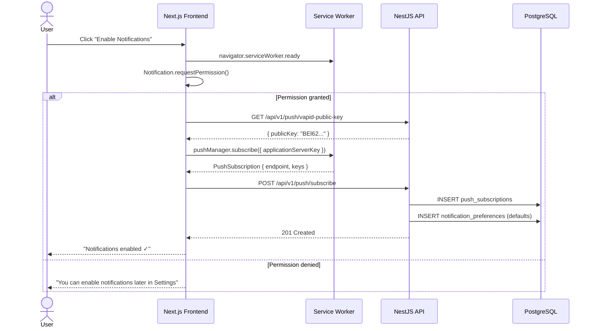
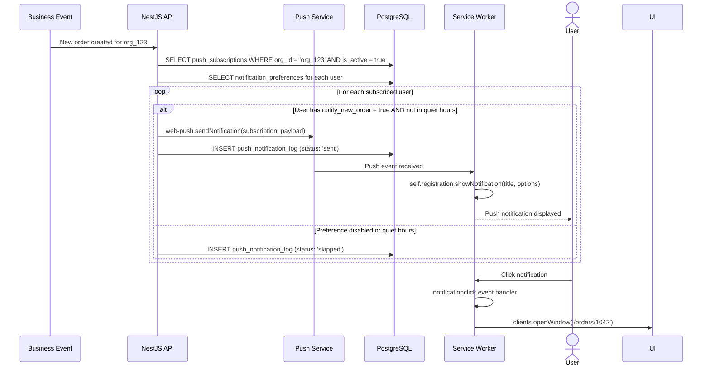
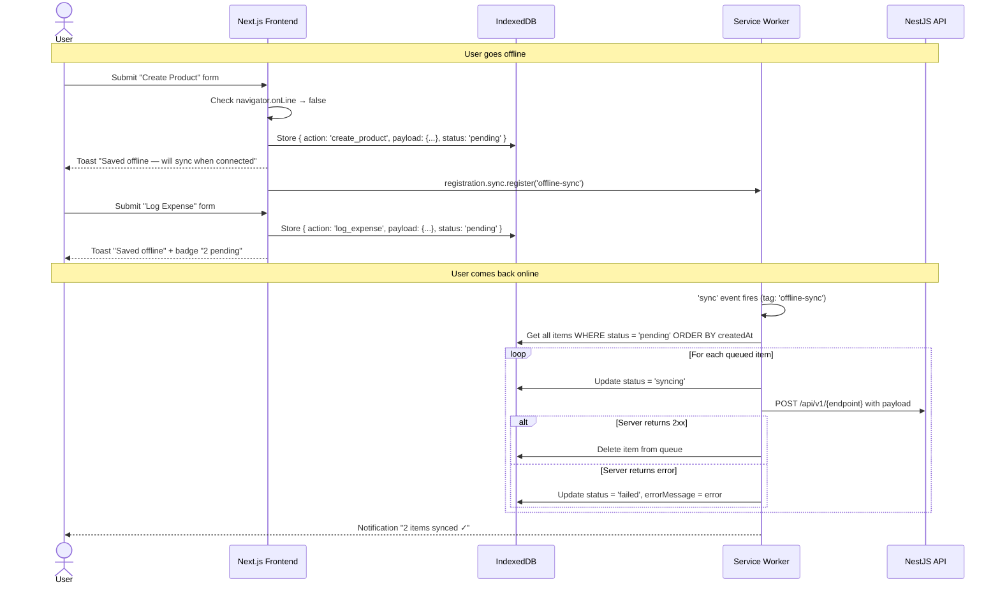
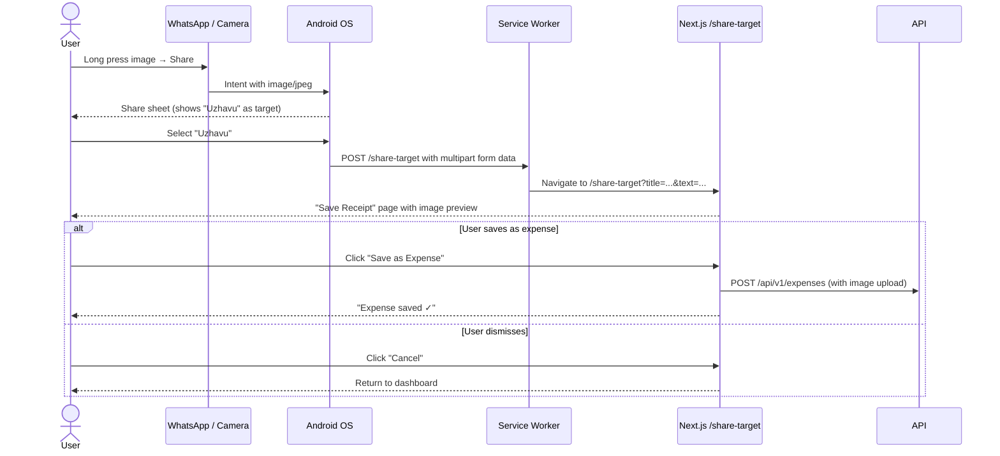

# PWA Mobile App — Progressive Web App Conversion

> **Purpose**: Convert the existing Next.js frontend into a fully installable Progressive Web App with offline support, push notifications, background sync, camera integration, and share target capabilities. Users should be able to install the app on Android/iOS home screens and use core features without an internet connection.
>
> **Context**: Uzhavu is a multi-tenant SaaS monorepo (Turborepo + pnpm) with NestJS API, Next.js frontend, FastAPI AI engine, and PostgreSQL. All data is scoped by `orgId`. The PWA must integrate with the product factory system — each product domain gets its own manifest with correct branding.
>
> **Architecture ref**: `APP_ARCHITECTURE.md` for app manifests, `product-factory-implementation.md` for product/domain system

---

## Table of Contents

1. [Requirements](#requirements)
2. [Design](#design)
3. [Tasks](#tasks)

---

# Requirements

## Story 1: Installable App

As a **mobile user**, I want to **install the app to my home screen** so that **I can launch it like a native app without opening a browser**.

### Acceptance Criteria

- GIVEN a user visits the app on a supported browser (Chrome Android, Safari iOS) WHEN the PWA installability criteria are met (manifest + service worker + HTTPS) THEN the browser shows the native install prompt or a custom in-app install banner
- GIVEN a user clicks "Install" on the install banner WHEN the installation completes THEN the app icon appears on the home screen with the product's branding (name, icon, theme_color)
- GIVEN the app is launched from the home screen WHEN it opens THEN it runs in standalone display mode (no browser chrome — no URL bar, no navigation buttons)
- GIVEN the current product is "InvoiceSimple" (domain: invoicesimple.in) WHEN the user installs the PWA THEN the home screen icon shows InvoiceSimple's logo, name, and blue theme — not Uzhavu's branding
- GIVEN the user has installed the app WHEN the device is restarted and the user taps the app icon THEN the app launches immediately showing a splash screen with the product logo and theme_color before the main UI loads
- GIVEN a user visits the app on iOS Safari WHEN they use "Add to Home Screen" from the share menu THEN the app installs correctly with the correct icon (apple-touch-icon) and splash screen (apple-startup-image)

---

## Story 2: Offline Page Access

As a **user with intermittent connectivity**, I want to **access critical pages even when offline** so that **I can view my dashboard, products, and recent invoices without an internet connection**.

### Acceptance Criteria

- GIVEN the user has previously visited the dashboard page WHEN they go offline and navigate to the dashboard THEN the cached version is displayed with a subtle "Offline" indicator badge
- GIVEN the user has previously loaded the products list page WHEN they go offline and navigate to products THEN the cached product list is displayed from the last successful fetch
- GIVEN the user has previously viewed specific invoices WHEN they go offline THEN the last 20 viewed invoices are available from cache
- GIVEN the user is offline WHEN they navigate to a page that has never been cached THEN a branded offline fallback page is shown with message "You're offline. This page hasn't been cached yet." and links to cached pages
- GIVEN the user goes back online WHEN they are viewing a cached page THEN a toast notification says "You're back online" and the page automatically refreshes with fresh data in the background
- GIVEN the service worker is installed WHEN a new version of the app is deployed THEN the user sees a "New version available — tap to update" banner, and clicking it activates the new service worker

---

## Story 3: Push Notifications

As a **business owner**, I want to **receive push notifications for important events** so that **I don't miss new orders, payments, task assignments, or overdue invoices**.

### Acceptance Criteria

- GIVEN a user is logged in WHEN they are prompted for push notification permission THEN a contextual modal explains what notifications they'll receive with a "Enable Notifications" button and a "Maybe Later" dismiss option
- GIVEN a user grants push permission WHEN the subscription is created THEN the VAPID public key is used to create a PushSubscription and the endpoint + keys are sent to the backend and stored in `push_subscriptions` table scoped by org_id + user_id
- GIVEN a new order is placed for the user's org WHEN the backend processes the order THEN a push notification is sent to all subscribed users in that org with title "New Order 🛒" and body showing order summary
- GIVEN a payment is received WHEN the backend records the payment THEN subscribed users receive a push notification with title "Payment Received 💰" and body showing amount and payer name
- GIVEN a task is assigned to a user WHEN the assignment is saved THEN that specific user receives a push notification with title "Task Assigned 📋" and body showing task name and due date
- GIVEN an invoice is overdue by 1+ days WHEN the daily overdue check runs (cron job) THEN the invoice creator receives a push notification with title "Invoice Overdue ⏰" and body showing customer name and amount
- GIVEN a user has multiple devices with push enabled WHEN a notification is sent THEN all devices receive the notification (fan-out to all subscriptions for that user)
- GIVEN a user wants to manage notification preferences WHEN they go to Settings → Notifications THEN they can toggle each notification type on/off (orders, payments, tasks, invoices, system alerts)
- GIVEN a user clicks on a push notification WHEN the app opens THEN it navigates to the relevant page (order detail, invoice detail, task detail)

---

## Story 4: Background Sync

As a **field worker or delivery person**, I want to **create products and log expenses while offline** so that **my work is not blocked by poor connectivity and syncs automatically when I'm back online**.

### Acceptance Criteria

- GIVEN the user is offline WHEN they submit the "Create Product" form THEN the product is saved to an IndexedDB offline queue with a "pending sync" badge, and a toast says "Saved offline — will sync when connected"
- GIVEN the user is offline WHEN they submit the "Log Expense" form THEN the expense is saved to the IndexedDB offline queue with timestamp and form data
- GIVEN there are items in the offline queue WHEN the device regains connectivity THEN the Background Sync API triggers and all queued items are replayed to the server in order (FIFO)
- GIVEN a queued item is synced successfully WHEN the server responds with 2xx THEN the item is removed from the queue and the user sees "3 items synced ✓" toast
- GIVEN a queued item fails to sync (server error, validation) WHEN the sync is attempted THEN the item is marked as "failed" in the queue with the error message, and the user can retry or discard from a "Pending Sync" page
- GIVEN the user has 5 items in the offline queue WHEN they view the app header/navbar THEN a badge shows "5" on a sync icon indicating pending items
- GIVEN Background Sync API is not supported (iOS Safari) WHEN the user comes back online THEN a manual sync is triggered via online/offline event listeners as a fallback
- GIVEN two offline-created products have the same SKU WHEN they sync THEN the second sync fails with a duplicate error and is flagged for user resolution

---

## Story 5: App-Like Navigation

As a **mobile user**, I want to **experience smooth, app-like navigation** so that **the PWA feels native and not like a website in a wrapper**.

### Acceptance Criteria

- GIVEN the app is launched in standalone mode WHEN the user navigates between pages THEN transitions use a smooth slide animation (no full page reloads)
- GIVEN the app is in standalone mode WHEN there is no browser back button THEN the app provides its own back navigation via a header back arrow on all sub-pages
- GIVEN the user pulls down on the dashboard WHEN they release THEN a pull-to-refresh triggers data reload (using overscroll-behavior CSS)
- GIVEN the user taps the bottom navigation bar WHEN switching between Dashboard, Products, Invoices, and More THEN the active tab is highlighted and the transition is instant (client-side routing)
- GIVEN the app is in standalone mode WHEN the user swipes from the left edge THEN the sidebar/drawer opens (gesture-based navigation)
- GIVEN the viewport is resized (rotation) WHEN the app re-renders THEN the layout adapts responsively without breaking

---

## Story 6: Camera Integration

As a **shop owner**, I want to **scan barcodes and QR codes using my camera** so that **I can quickly look up products and add items to invoices**.

### Acceptance Criteria

- GIVEN the user is on the product search page WHEN they tap the camera/scan icon THEN the device camera opens in a viewfinder overlay for barcode/QR scanning
- GIVEN the camera is scanning WHEN a valid barcode (EAN-13, UPC-A, Code 128) is detected THEN the app searches for a product with that barcode in the org's inventory and navigates to the product detail page
- GIVEN a scanned barcode has no matching product WHEN the scan completes THEN the app shows "Product not found" with an option to "Create product with this barcode" pre-filling the barcode field
- GIVEN the user is on the expense form WHEN they tap "Attach Receipt" THEN the device camera opens to take a photo, which is attached to the expense record as a JPEG
- GIVEN the camera permission is denied WHEN the user taps the scan button THEN a helpful message explains how to enable camera permission in device settings
- GIVEN the device has no camera (desktop) WHEN the scan button would normally appear THEN it is hidden and replaced with a manual barcode input field

---

## Story 7: Share Target

As a **user who receives business content via WhatsApp or email**, I want to **share URLs and images directly to the app** so that **I can quickly save receipts or reference links without copy-pasting**.

### Acceptance Criteria

- GIVEN the PWA is installed WHEN the user uses the OS share sheet from another app (e.g., WhatsApp) THEN "Uzhavu" (or the product name) appears as a share target option
- GIVEN the user shares a URL to the app WHEN the share target receives it THEN the app opens a "Save Link" page with the URL pre-filled and options to attach it to a contact, invoice, or note
- GIVEN the user shares an image to the app WHEN the share target receives it THEN the app opens a "Save Receipt" page with the image displayed and options to create an expense entry from it
- GIVEN the user shares text content WHEN the share target receives it THEN the app opens a quick-create dialog where the text is pre-filled in a notes field
- GIVEN the app is not installed as a PWA WHEN the user tries to share to it THEN the share target is not available (only works when installed)

---

## Story 8: Product-Aware Manifests

As the **platform operator**, I want **each product domain to serve its own manifest.json** so that **installed PWAs have correct branding per product (icon, name, theme_color, start_url)**.

### Acceptance Criteria

- GIVEN the user visits `invoicesimple.in` WHEN the browser fetches `/manifest.json` THEN the manifest contains `name: "InvoiceSimple"`, `theme_color: "#2563eb"`, InvoiceSimple icons, and `start_url: "/"` scoped to that domain
- GIVEN the user visits `app.uzhavu.com` WHEN the browser fetches `/manifest.json` THEN the manifest contains `name: "Uzhavu"`, `theme_color: "#16a34a"`, Uzhavu icons
- GIVEN a new product "GymTrack" is added to the product factory WHEN its domain is configured THEN `/manifest.json` on that domain automatically serves GymTrack branding without code changes (dynamic generation)
- GIVEN the manifest is generated dynamically WHEN the browser checks for updates THEN the manifest includes `id` field matching the product ID for stable identity across manifest changes

---

# Design

## Architecture Overview

```
┌────────────────────────────────────────────────────────────────────────┐
│                          PWA ARCHITECTURE                              │
│                                                                        │
│  ┌──────────────────┐  ┌─────────────────┐  ┌──────────────────────┐  │
│  │  Next.js Frontend │  │  Service Worker  │  │  NestJS API          │  │
│  │                  │  │                 │  │                      │  │
│  │  manifest.json   │  │  sw.js          │  │  /push/subscribe     │  │
│  │  (dynamic/route) │  │  ├─ CacheFirst  │  │  /push/send          │  │
│  │                  │  │  ├─ NetworkFirst │  │  /push/preferences   │  │
│  │  Install Banner  │  │  ├─ StaleWhile  │  │                      │  │
│  │  Offline UI      │  │  │  Revalidate  │  │  Push Worker (cron)  │  │
│  │  Camera Scanner  │  │  ├─ BG Sync     │  │  ├─ overdue invoices │  │
│  │  Share Target    │  │  └─ Push Handler │  │  └─ uptime alerts    │  │
│  └──────────────────┘  └─────────────────┘  └──────────────────────┘  │
│         │                       │                       │              │
│         │              ┌────────┴────────┐              │              │
│         │              │   IndexedDB      │              │              │
│         └──────────────│   ├─ offline-q   │──────────────┘              │
│                        │   ├─ cached-data │                            │
│                        │   └─ push-prefs  │                            │
│                        └─────────────────┘                             │
└────────────────────────────────────────────────────────────────────────┘
```

### Key Design Decisions

1. **@serwist/next over next-pwa** — `next-pwa` is unmaintained. `@serwist/next` is the actively maintained successor with first-class Next.js App Router support, Workbox 7 strategies, and built-in TypeScript.
2. **Dynamic manifest.json via API route** — Not a static file. Served via `app/manifest.ts` (Next.js metadata API) which reads the current product config to generate product-specific manifests at request time.
3. **IndexedDB via `idb` library** — Lightweight (~1.2KB) promise-based wrapper. Used for offline queue and cached data snapshots. No heavyweight state management library needed.
4. **Web Push with VAPID** — Server-generated VAPID keys. The NestJS backend uses the `web-push` npm package to send notifications. No third-party push services (OneSignal, Firebase) — self-hosted, no vendor lock-in.
5. **Background Sync with fallback** — Use the Background Sync API where available (Chrome Android). Fall back to `navigator.onLine` event listeners on iOS/Safari where Background Sync is not supported.
6. **Camera via html5-qrcode** — Well-maintained library (~50KB) supporting barcode/QR scanning without native dependencies. Falls back gracefully on unsupported devices.
7. **Share Target API** — Declared in `manifest.json`. Only works when the PWA is installed. Share target routes to a dedicated `/share-target` page that processes the shared content.

---

## Data Models

### SQL Schema

```sql
-- ============================================================
-- Push Notification Subscriptions (per-user, per-device)
-- ============================================================
CREATE TABLE push_subscriptions (
  id              TEXT PRIMARY KEY DEFAULT gen_random_uuid()::text,
  org_id          TEXT NOT NULL,
  user_id         TEXT NOT NULL,
  endpoint        TEXT NOT NULL,                   -- Push service endpoint URL
  keys_p256dh     TEXT NOT NULL,                   -- P-256 ECDH public key
  keys_auth       TEXT NOT NULL,                   -- Authentication secret
  user_agent      TEXT,                            -- Browser/device info
  device_label    TEXT,                            -- e.g., "Chrome on Pixel 7"
  is_active       BOOLEAN NOT NULL DEFAULT true,
  created_at      TIMESTAMPTZ NOT NULL DEFAULT NOW(),
  updated_at      TIMESTAMPTZ NOT NULL DEFAULT NOW(),

  CONSTRAINT uq_push_endpoint UNIQUE (endpoint)
);

CREATE INDEX idx_push_org_user ON push_subscriptions(org_id, user_id);
CREATE INDEX idx_push_org_active ON push_subscriptions(org_id, is_active);

-- ============================================================
-- Notification Preferences (per-user notification toggles)
-- ============================================================
CREATE TABLE notification_preferences (
  id              TEXT PRIMARY KEY DEFAULT gen_random_uuid()::text,
  org_id          TEXT NOT NULL,
  user_id         TEXT NOT NULL,
  notify_new_order      BOOLEAN NOT NULL DEFAULT true,
  notify_payment        BOOLEAN NOT NULL DEFAULT true,
  notify_task_assigned  BOOLEAN NOT NULL DEFAULT true,
  notify_invoice_overdue BOOLEAN NOT NULL DEFAULT true,
  notify_system_alerts  BOOLEAN NOT NULL DEFAULT true,
  notify_uptime_alerts  BOOLEAN NOT NULL DEFAULT true,
  quiet_hours_start     TIME,                      -- e.g., '22:00' — no notifications after this
  quiet_hours_end       TIME,                      -- e.g., '07:00' — notifications resume
  created_at      TIMESTAMPTZ NOT NULL DEFAULT NOW(),
  updated_at      TIMESTAMPTZ NOT NULL DEFAULT NOW(),

  CONSTRAINT uq_notif_pref_user UNIQUE (org_id, user_id)
);

CREATE INDEX idx_notif_pref_org ON notification_preferences(org_id);

-- ============================================================
-- Push Notification Log (audit trail)
-- ============================================================
CREATE TABLE push_notification_log (
  id              TEXT PRIMARY KEY DEFAULT gen_random_uuid()::text,
  org_id          TEXT NOT NULL,
  user_id         TEXT,                            -- NULL for org-wide notifications
  notification_type TEXT NOT NULL,                 -- 'new_order', 'payment', 'task_assigned', 'invoice_overdue', 'system', 'uptime'
  title           TEXT NOT NULL,
  body            TEXT NOT NULL,
  data_payload    JSONB DEFAULT '{}',             -- { url: '/invoices/123', entity_id: '...' }
  status          TEXT NOT NULL DEFAULT 'sent',    -- 'sent', 'delivered', 'failed', 'clicked'
  error_message   TEXT,
  sent_at         TIMESTAMPTZ NOT NULL DEFAULT NOW()
);

CREATE INDEX idx_push_log_org ON push_notification_log(org_id, sent_at DESC);
CREATE INDEX idx_push_log_user ON push_notification_log(user_id, sent_at DESC);
CREATE INDEX idx_push_log_type ON push_notification_log(notification_type);
```

### Prisma Schema Additions

```prisma
model PushSubscription {
  id          String   @id @default(uuid())
  orgId       String   @map("org_id")
  userId      String   @map("user_id")
  endpoint    String   @unique
  keysP256dh  String   @map("keys_p256dh")
  keysAuth    String   @map("keys_auth")
  userAgent   String?  @map("user_agent")
  deviceLabel String?  @map("device_label")
  isActive    Boolean  @default(true) @map("is_active")
  createdAt   DateTime @default(now()) @map("created_at")
  updatedAt   DateTime @updatedAt @map("updated_at")

  @@index([orgId, userId])
  @@index([orgId, isActive])
  @@map("push_subscriptions")
}

model NotificationPreference {
  id                   String   @id @default(uuid())
  orgId                String   @map("org_id")
  userId               String   @map("user_id")
  notifyNewOrder       Boolean  @default(true) @map("notify_new_order")
  notifyPayment        Boolean  @default(true) @map("notify_payment")
  notifyTaskAssigned   Boolean  @default(true) @map("notify_task_assigned")
  notifyInvoiceOverdue Boolean  @default(true) @map("notify_invoice_overdue")
  notifySystemAlerts   Boolean  @default(true) @map("notify_system_alerts")
  notifyUptimeAlerts   Boolean  @default(true) @map("notify_uptime_alerts")
  quietHoursStart      DateTime? @map("quiet_hours_start") @db.Time
  quietHoursEnd        DateTime? @map("quiet_hours_end") @db.Time
  createdAt            DateTime @default(now()) @map("created_at")
  updatedAt            DateTime @updatedAt @map("updated_at")

  @@unique([orgId, userId])
  @@map("notification_preferences")
}

model PushNotificationLog {
  id               String   @id @default(uuid())
  orgId            String   @map("org_id")
  userId           String?  @map("user_id")
  notificationType String   @map("notification_type")
  title            String
  body             String
  dataPayload      Json     @default("{}") @map("data_payload")
  status           String   @default("sent")
  errorMessage     String?  @map("error_message")
  sentAt           DateTime @default(now()) @map("sent_at")

  @@index([orgId, sentAt(sort: Desc)])
  @@index([userId, sentAt(sort: Desc)])
  @@index([notificationType])
  @@map("push_notification_log")
}
```

---

## Service Worker Strategy Map

| Resource Type | Strategy | Cache Name | TTL | Rationale |
|:---|:---|:---|:---|:---|
| Static assets (JS, CSS, images) | **CacheFirst** | `static-assets-v1` | 30 days | Immutable hashed filenames — cache indefinitely until new deploy |
| App shell (HTML pages) | **StaleWhileRevalidate** | `pages-v1` | 7 days | Show cached page instantly, update in background |
| API calls (`/api/*`) | **NetworkFirst** | `api-cache-v1` | 1 hour | Always try fresh data; fall back to cache when offline |
| Product images / uploads | **CacheFirst** | `images-v1` | 30 days | Rarely change; cache aggressively |
| Google Fonts | **CacheFirst** | `google-fonts-v1` | 365 days | Never change |
| Manifest / icons | **NetworkFirst** | — | — | Must stay fresh for branding updates |

### Pre-cached Pages (App Shell)

These pages are pre-cached during service worker installation:

```
/dashboard
/products
/invoices
/expenses
/offline (fallback page)
```

---

## Dynamic Manifest Generation

### File: `apps/web/src/app/manifest.ts`

```typescript
import { getCurrentProduct } from '@/products/registry';
import type { MetadataRoute } from 'next';

export default function manifest(): MetadataRoute.Manifest {
  const product = getCurrentProduct();

  return {
    id: product.id,
    name: product.name,
    short_name: product.name,
    description: product.tagline,
    start_url: '/',
    scope: '/',
    display: 'standalone',
    orientation: 'portrait-primary',
    theme_color: product.branding.primaryColor,
    background_color: '#ffffff',
    categories: ['business', 'finance', 'productivity'],
    icons: [
      {
        src: `/products/${product.id}/icon-192.png`,
        sizes: '192x192',
        type: 'image/png',
        purpose: 'any',
      },
      {
        src: `/products/${product.id}/icon-512.png`,
        sizes: '512x512',
        type: 'image/png',
        purpose: 'any',
      },
      {
        src: `/products/${product.id}/icon-maskable-512.png`,
        sizes: '512x512',
        type: 'image/png',
        purpose: 'maskable',
      },
    ],
    screenshots: [
      {
        src: `/products/${product.id}/screenshot-mobile.png`,
        sizes: '1080x1920',
        type: 'image/png',
        form_factor: 'narrow',
        label: `${product.name} Dashboard`,
      },
    ],
    share_target: {
      action: '/share-target',
      method: 'POST',
      enctype: 'multipart/form-data',
      params: {
        title: 'title',
        text: 'text',
        url: 'url',
        files: [
          {
            name: 'images',
            accept: ['image/jpeg', 'image/png', 'image/webp'],
          },
        ],
      },
    },
  };
}
```

---

## IndexedDB Schema (Offline Queue)

```typescript
// apps/web/src/lib/offline-queue.ts
import { openDB, type DBSchema } from 'idb';

interface OfflineQueueDB extends DBSchema {
  'sync-queue': {
    key: string;                    // UUID
    value: {
      id: string;
      action: 'create_product' | 'log_expense' | 'create_invoice' | 'update_contact';
      endpoint: string;             // API endpoint to replay to
      method: 'POST' | 'PUT' | 'PATCH';
      payload: Record<string, any>; // Request body
      orgId: string;
      userId: string;
      status: 'pending' | 'syncing' | 'failed';
      errorMessage?: string;
      retryCount: number;
      createdAt: number;             // Unix timestamp ms
      syncedAt?: number;
    };
    indexes: {
      'by-status': string;
      'by-created': number;
    };
  };
  'data-snapshots': {
    key: string;                    // Cache key, e.g., 'products-list'
    value: {
      key: string;
      data: any;
      cachedAt: number;
      orgId: string;
    };
    indexes: {
      'by-org': string;
    };
  };
}

const DB_NAME = 'uzhavu-offline';
const DB_VERSION = 1;

export async function getDB() {
  return openDB<OfflineQueueDB>(DB_NAME, DB_VERSION, {
    upgrade(db) {
      const syncStore = db.createObjectStore('sync-queue', { keyPath: 'id' });
      syncStore.createIndex('by-status', 'status');
      syncStore.createIndex('by-created', 'createdAt');

      const dataStore = db.createObjectStore('data-snapshots', { keyPath: 'key' });
      dataStore.createIndex('by-org', 'orgId');
    },
  });
}
```

---

## API Contracts

### Base Path: `/api/v1/push`

---

### POST `/api/v1/push/subscribe`

**Register a push subscription for the current user + device.**

**Headers:**
```
Authorization: Bearer <token>
```

**Request Body:**
```json
{
  "subscription": {
    "endpoint": "https://fcm.googleapis.com/fcm/send/...",
    "keys": {
      "p256dh": "BLJ4...",
      "auth": "aW4..."
    }
  },
  "deviceLabel": "Chrome on Pixel 7"
}
```

**Response: `201 Created`**
```json
{
  "data": {
    "id": "sub_abc123",
    "endpoint": "https://fcm.googleapis.com/fcm/send/...",
    "deviceLabel": "Chrome on Pixel 7",
    "isActive": true,
    "createdAt": "2026-07-05T12:00:00Z"
  }
}
```

**Error: `409 Conflict`**
```json
{
  "error": "SUBSCRIPTION_EXISTS",
  "message": "This device is already subscribed.",
  "subscriptionId": "sub_abc123"
}
```

---

### DELETE `/api/v1/push/subscribe/:subscriptionId`

**Unsubscribe a device from push notifications.**

**Response: `200 OK`**
```json
{
  "data": {
    "id": "sub_abc123",
    "isActive": false,
    "message": "Push subscription deactivated."
  }
}
```

---

### GET `/api/v1/push/subscriptions`

**List all push subscriptions for the current user.**

**Response: `200 OK`**
```json
{
  "data": [
    {
      "id": "sub_abc123",
      "deviceLabel": "Chrome on Pixel 7",
      "userAgent": "Mozilla/5.0...",
      "isActive": true,
      "createdAt": "2026-07-05T12:00:00Z"
    },
    {
      "id": "sub_def456",
      "deviceLabel": "Safari on iPhone 14",
      "isActive": true,
      "createdAt": "2026-07-04T08:00:00Z"
    }
  ]
}
```

---

### GET `/api/v1/push/preferences`

**Get notification preferences for the current user.**

**Response: `200 OK`**
```json
{
  "data": {
    "notifyNewOrder": true,
    "notifyPayment": true,
    "notifyTaskAssigned": true,
    "notifyInvoiceOverdue": true,
    "notifySystemAlerts": true,
    "notifyUptimeAlerts": true,
    "quietHoursStart": "22:00",
    "quietHoursEnd": "07:00"
  }
}
```

---

### PUT `/api/v1/push/preferences`

**Update notification preferences for the current user.**

**Request Body:**
```json
{
  "notifyNewOrder": true,
  "notifyPayment": true,
  "notifyTaskAssigned": false,
  "notifyInvoiceOverdue": true,
  "notifySystemAlerts": true,
  "notifyUptimeAlerts": false,
  "quietHoursStart": "22:00",
  "quietHoursEnd": "07:00"
}
```

**Response: `200 OK`**
```json
{
  "data": {
    "message": "Preferences updated.",
    "updatedAt": "2026-07-05T12:00:00Z"
  }
}
```

---

### POST `/api/v1/push/send` *(Internal / Admin only)*

**Send a push notification to specific users or org-wide.**

**Request Body:**
```json
{
  "orgId": "org_123",
  "userIds": ["user_456"],
  "type": "new_order",
  "title": "New Order 🛒",
  "body": "Order #1042 from Rajan — ₹3,500",
  "data": {
    "url": "/orders/1042",
    "entityId": "order_1042"
  }
}
```

**Response: `200 OK`**
```json
{
  "data": {
    "sent": 3,
    "failed": 0,
    "skippedByPreference": 1,
    "skippedByQuietHours": 0
  }
}
```

---

### GET `/api/v1/push/vapid-public-key`

**Get the VAPID public key for client-side subscription.**

**Response: `200 OK`**
```json
{
  "data": {
    "publicKey": "BEl62iUYgUiv..."
  }
}
```

---

## Sequence Diagrams

### Push Notification Subscription Flow



### Push Notification Delivery Flow



### Offline Queue & Background Sync Flow



### Share Target Flow



---

## Plan Gating Matrix

| Feature | Free | Starter | Pro | Enterprise |
|:---|:---:|:---:|:---:|:---:|
| **Installable PWA** | ✅ | ✅ | ✅ | ✅ |
| **Offline page caching** | ✅ | ✅ | ✅ | ✅ |
| **Push notifications (3 types)** | ✅ | ✅ | ✅ | ✅ |
| **Push notifications (all types)** | 🔒 | ✅ | ✅ | ✅ |
| **Background sync** | 🔒 | ✅ | ✅ | ✅ |
| **Camera / barcode scanning** | 🔒 | ✅ | ✅ | ✅ |
| **Share target** | 🔒 | ✅ | ✅ | ✅ |
| **Notification preferences** | 🔒 | ✅ | ✅ | ✅ |
| **Quiet hours** | 🔒 | 🔒 | ✅ | ✅ |
| **Notification history / log** | 🔒 | 🔒 | ✅ | ✅ |
| **Max push devices** | 1 | 3 | 10 | Unlimited |

> Free plan gets install + offline + basic push (new order, payment, task). Sync, camera, and share target require Starter.

---

## Error Handling & Edge Cases

| Scenario | Handling |
|:---------|:---------|
| Push subscription endpoint becomes invalid (user uninstalls browser) | `web-push` throws `410 Gone` → auto-deactivate subscription in DB, set `is_active = false` |
| User denies notification permission | Show "Notifications blocked" state in Settings with instructions to re-enable in browser settings |
| iOS Safari doesn't support Background Sync API | Fall back to `window.addEventListener('online', manualSync)` — sync on reconnect event |
| Offline queue has >50 pending items | Show warning "50 items pending sync" and disable offline form submissions to prevent excessive queue growth |
| Offline-created product conflicts with server data (duplicate SKU) | Mark as "failed" in queue, show conflict resolution UI where user can rename or discard |
| Service worker update while user is mid-form | Don't `skipWaiting()` automatically — show "Update available" banner, activate on next navigation |
| Camera permission denied on first attempt | Show one-time educational modal explaining why camera access is needed before `getUserMedia()` call |
| Share target receives unsupported file type | Show "Unsupported file type" error with list of accepted types (JPEG, PNG, WebP) |
| VAPID keys are rotated | All existing subscriptions become invalid — need re-subscribe flow, show "Re-enable notifications" prompt |
| Multiple tabs open when push notification arrives | Only show in-app notification badge in the focused tab; push notification still shows in OS notification center |
| Manifest.json cached by browser after product branding change | Use `id` field in manifest for stable identity; browser periodically re-fetches manifest on its own schedule |
| User installs PWA then visits same URL in browser | Both work independently; data syncs via the same API and org_id scoping |

---

## NestJS Module Structure

```
apps/api/src/modules/push/
├── push.module.ts               # NestJS module definition
├── push.controller.ts           # REST endpoints (subscribe, preferences, send)
├── push.service.ts              # Business logic (subscribe, unsubscribe, send)
├── push-sender.service.ts       # web-push integration (VAPID, send notification)
├── push-scheduler.service.ts    # Cron jobs (overdue invoice check, uptime alerts)
├── dto/
│   ├── subscribe-push.dto.ts    # Subscription request validation
│   ├── update-preferences.dto.ts # Preferences update validation
│   └── send-notification.dto.ts # Send request validation (admin)
├── guards/
│   └── push-admin.guard.ts      # Only admins can use /send endpoint
└── entities/
    ├── push-subscription.entity.ts
    ├── notification-preference.entity.ts
    └── push-notification-log.entity.ts
```

## Frontend Structure

```
apps/web/src/
├── app/
│   ├── manifest.ts                    # Dynamic manifest (Next.js metadata API)
│   ├── (dashboard)/
│   │   └── share-target/
│   │       └── page.tsx               # Share target receiver page
│   └── (dashboard)/settings/
│       └── notifications/
│           └── page.tsx               # Notification preferences page
├── components/pwa/
│   ├── InstallBanner.tsx              # PWA install prompt banner
│   ├── InstallBanner.module.css
│   ├── OfflineIndicator.tsx           # "You're offline" badge
│   ├── OfflineIndicator.module.css
│   ├── UpdateBanner.tsx               # "New version available" banner
│   ├── UpdateBanner.module.css
│   ├── SyncStatusBadge.tsx            # Pending sync count badge
│   ├── SyncStatusBadge.module.css
│   ├── PendingSyncPage.tsx            # List of queued offline items
│   ├── PendingSyncPage.module.css
│   ├── BarcodeScanner.tsx             # Camera barcode/QR scanner
│   ├── BarcodeScanner.module.css
│   ├── ReceiptCapture.tsx             # Camera receipt photo capture
│   ├── NotificationPrompt.tsx         # Permission request modal
│   └── NotificationPrompt.module.css
├── lib/
│   ├── push-notifications.ts          # Client-side push subscription logic
│   ├── offline-queue.ts               # IndexedDB queue manager (idb)
│   ├── service-worker-register.ts     # SW registration + update handling
│   └── camera-utils.ts               # html5-qrcode wrapper
├── hooks/
│   ├── useInstallPrompt.ts            # beforeinstallprompt event hook
│   ├── useOnlineStatus.ts             # Online/offline status hook
│   ├── usePushNotifications.ts        # Push subscription state hook
│   └── useSyncQueue.ts               # Offline queue status hook
├── actions/push/
│   ├── subscribePush.ts               # Server action: subscribe
│   ├── unsubscribePush.ts             # Server action: unsubscribe
│   ├── getPreferences.ts              # Server action: get preferences
│   └── updatePreferences.ts           # Server action: update preferences
└── public/
    ├── sw.js                          # Compiled service worker (output)
    └── products/
        ├── uzhavu/
        │   ├── icon-192.png
        │   ├── icon-512.png
        │   └── icon-maskable-512.png
        └── invoice-simple/
            ├── icon-192.png
            ├── icon-512.png
            └── icon-maskable-512.png
```

---

## Dependencies

| Package | Version | Purpose | Size |
|:---|:---|:---|:---|
| `@serwist/next` | `^9.x` | Service worker generation for Next.js | ~15KB |
| `serwist` | `^9.x` | Workbox successor — caching strategies | ~25KB |
| `idb` | `^8.x` | Promise-based IndexedDB wrapper | ~1.2KB |
| `web-push` | `^3.x` | Server-side VAPID push notifications (NestJS) | ~50KB |
| `html5-qrcode` | `^2.x` | Client-side barcode/QR scanning | ~50KB |

> No Firebase, no OneSignal — all self-hosted with VAPID.

---

# Tasks

## Phase 1: Service Worker & Installability (~3 days)

- [ ] Install `@serwist/next` and `serwist` packages, configure in `next.config.js` with TypeScript service worker entry point (~2h)
- [ ] Create service worker entry `apps/web/src/sw.ts` with Serwist — register precache manifest, define runtime caching routes for static assets (CacheFirst), pages (StaleWhileRevalidate), and API calls (NetworkFirst) (~4h)
- [ ] Implement `apps/web/src/app/manifest.ts` — dynamic manifest generation reading from `getCurrentProduct()`, including icons, theme_color, share_target declaration (~2h)
- [ ] Create product icon sets: 192x192, 512x512, and maskable 512x512 for `uzhavu` and `invoice-simple` in `public/products/` directories (~2h)
- [ ] Implement `service-worker-register.ts` — SW registration logic with update detection, `controllerchange` listener, and "New version available" event dispatch (~2h)
- [ ] Create `InstallBanner` component — listens for `beforeinstallprompt`, shows contextual install CTA, handles iOS "Add to Home Screen" instructions fallback (~3h)
- [ ] Create `useInstallPrompt` hook — stores deferred prompt, tracks if app is already installed via `display-mode: standalone` media query (~1.5h)
- [ ] Create `UpdateBanner` component — shows "New version available — tap to update" when new SW is waiting, triggers `skipWaiting()` on click (~2h)
- [ ] Create branded offline fallback page `/offline` — product logo, "You're offline" message, links to cached pages (~1.5h)
- [ ] Add `<meta name="apple-mobile-web-app-capable">` and `apple-touch-icon` link tags to root layout for iOS PWA support (~1h)

## Phase 2: Offline Support & Caching (~2.5 days)

- [ ] Create `offline-queue.ts` with IndexedDB schema — `sync-queue` and `data-snapshots` object stores using `idb` library (~3h)
- [ ] Implement `OfflineQueueManager` class — `enqueue()`, `dequeue()`, `getAll()`, `markFailed()`, `retry()`, `clear()` methods (~3h)
- [ ] Create `useOnlineStatus` hook — tracks `navigator.onLine` with event listeners, provides reactive online/offline state (~1h)
- [ ] Create `useSyncQueue` hook — reads pending queue count from IndexedDB, provides `enqueueAction()` function for forms (~2h)
- [ ] Create `OfflineIndicator` component — subtle floating badge when offline, shows "Back online" toast on reconnect (~1.5h)
- [ ] Create `SyncStatusBadge` component — shows pending sync count in navbar with animated sync icon (~1.5h)
- [ ] Create `PendingSyncPage` component — lists all queued items with status (pending/syncing/failed), retry and discard buttons (~3h)
- [ ] Modify "Create Product" form — detect offline state, save to IndexedDB queue instead of API call, show pending badge (~2h)
- [ ] Modify "Log Expense" form — same offline queueing pattern as Create Product (~1.5h)
- [ ] Implement Background Sync handler in service worker — listen for `sync` event, replay queued items to API, handle success/failure per item (~3h)
- [ ] Implement manual sync fallback for iOS — trigger sync on `online` event when Background Sync API is not available (~1h)

## Phase 3: Push Notifications Backend (~3 days)

- [ ] Add Prisma schema for `push_subscriptions`, `notification_preferences`, `push_notification_log` tables, run migration (~2h)
- [ ] Create NestJS `push.module.ts` — register module, import PrismaService, configure VAPID keys from environment variables (~1h)
- [ ] Implement `PushSenderService` — wraps `web-push` library, sends notifications with VAPID credentials, handles 410 Gone (auto-deactivate dead subscriptions) (~3h)
- [ ] Generate VAPID key pair — store `VAPID_PUBLIC_KEY` and `VAPID_PRIVATE_KEY` in `.env`, add to `.env.example` (~0.5h)
- [ ] Implement `PushService.subscribe()` — validate subscription object, upsert into DB, create default notification preferences (~2h)
- [ ] Implement `PushService.unsubscribe()` — soft-delete (set `is_active = false`) to preserve audit trail (~1h)
- [ ] Implement `PushService.sendToUser()` — fan-out to all active subscriptions for a user, check preferences and quiet hours before sending (~3h)
- [ ] Implement `PushService.sendToOrg()` — send to all subscribed users in an org, respecting per-user preferences (~2h)
- [ ] Create `SubscribePushDto`, `UpdatePreferencesDto`, `SendNotificationDto` with class-validator decorators (~1.5h)
- [ ] Implement `PushController` — all REST endpoints (subscribe, unsubscribe, list subscriptions, get/update preferences, vapid-public-key) (~3h)
- [ ] Implement `PushSchedulerService` — cron job running daily at 9 AM to check overdue invoices and send push notifications (~2h)
- [ ] Add push notification triggers to existing services: order creation, payment recording, task assignment — emit events or call PushService directly (~3h)

## Phase 4: Push Notifications Frontend (~2 days)

- [ ] Implement `push-notifications.ts` — client-side push subscription logic: request permission, create PushSubscription, send to backend, store state in localStorage (~3h)
- [ ] Create `usePushNotifications` hook — tracks permission state, subscription status, provides `subscribe()` / `unsubscribe()` methods (~2h)
- [ ] Create `NotificationPrompt` component — contextual modal explaining notification types with "Enable" and "Maybe Later" buttons, shown after first login or on Settings page (~2h)
- [ ] Add push event handler in service worker — parse notification payload, show `self.registration.showNotification()` with icon, badge, actions, and click URL (~2h)
- [ ] Add `notificationclick` event handler in service worker — open app to the URL from notification data payload, focus existing window if open (~1.5h)
- [ ] Create Settings → Notifications page — toggle switches for each notification type, quiet hours time pickers, list of subscribed devices with remove button (~3h)
- [ ] Implement server actions with `withAction` wrapper: `subscribePush`, `unsubscribePush`, `getPreferences`, `updatePreferences` (~2h)

## Phase 5: Camera & Barcode Scanning (~1.5 days)

- [ ] Install `html5-qrcode` package, create `camera-utils.ts` wrapper with `startScanner()`, `stopScanner()`, `isCameraAvailable()` utilities (~2h)
- [ ] Create `BarcodeScanner` component — full-screen camera overlay with viewfinder, scan result callback, close button, flash toggle (~4h)
- [ ] Integrate barcode scanner into product search — scan icon button, on scan result search products by barcode, navigate to product or show "Create new" option (~2h)
- [ ] Create `ReceiptCapture` component — camera capture button for expense form, preview captured image, compress before upload (~2h)
- [ ] Add capability detection — hide camera features when `navigator.mediaDevices` is unavailable (desktop fallback to manual input) (~1h)

## Phase 6: Share Target (~1 day)

- [ ] Add `share_target` configuration to dynamic manifest.ts — action `/share-target`, method POST, accept images/text/URLs (~1h)
- [ ] Create `/share-target` page component — parses shared data from URL params (text/url) or FormData (files), displays appropriate creation form (~3h)
- [ ] Implement share-target routing logic — URL shares → "Save Link" form, image shares → "Save Receipt" form, text shares → "Quick Note" form (~2h)
- [ ] Add service worker fetch handler for POST to `/share-target` — intercept, extract shared data, redirect to share-target page with data (~1.5h)

## Phase 7: App-Like Navigation (~1 day)

- [ ] Add CSS `overscroll-behavior-y: contain` to prevent pull-to-refresh conflicts on Android Chrome (~0.5h)
- [ ] Implement custom pull-to-refresh for dashboard — touch event handling with animated spinner, triggers data refetch (~2h)
- [ ] Add page transition animations using CSS view transitions API or Framer Motion — slide-in for forward navigation, slide-out for back (~2h)
- [ ] Add mobile-optimized bottom navigation bar for standalone display mode — Dashboard, Products, Invoices, More (~2h)
- [ ] Configure viewport meta tag for standalone PWA — `viewport-fit=cover`, handle safe area insets for notch devices (~1h)

## Phase 8: Testing & Polish (~2 days)

- [ ] Write unit tests for `OfflineQueueManager` — enqueue, dequeue, retry, clear, max queue size enforcement (~2h)
- [ ] Write unit tests for `PushService` — subscribe, unsubscribe, preference filtering, quiet hours logic, dead subscription cleanup (~3h)
- [ ] Write integration tests for push notification flow — subscribe → send → verify delivery (mock web-push) (~2h)
- [ ] Write E2E test: install PWA → go offline → create product → go online → verify sync (~2h)
- [ ] Lighthouse PWA audit — verify score > 90 for installability, offline support, and performance (~1h)
- [ ] Test on Android Chrome, iOS Safari, and Samsung Internet — verify install, offline, push, and camera work per platform (~2h)
- [ ] Add loading skeletons for offline-cached pages and sync status UI (~1h)
- [ ] Performance optimization — ensure service worker doesn't block main thread, lazy-load camera dependencies (~1.5h)
- [ ] Create PWA testing guide documenting how to test each feature on each platform (Android/iOS/Desktop) (~1h)

---

**Total Estimated Effort: ~16 days (1 developer)**

**Priority Order**: Phase 1 → Phase 2 → Phase 3 → Phase 4 → Phase 7 → Phase 5 → Phase 6 → Phase 8

Phase 7 (App-Like Navigation) is prioritized before Camera and Share Target because the standalone display mode needs proper navigation before adding advanced input methods. Push notification backend (Phase 3) and frontend (Phase 4) are back-to-back to avoid context switching.

---

*Generated: 05 Jul 2026*
*For: uzhavu.race monorepo*
*Architecture ref: APP_ARCHITECTURE.md, product-factory-implementation.md*
