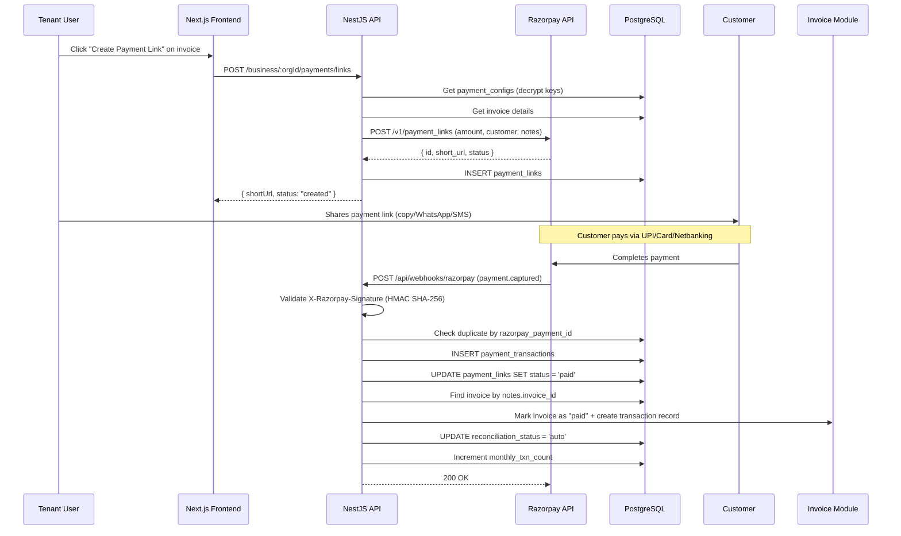
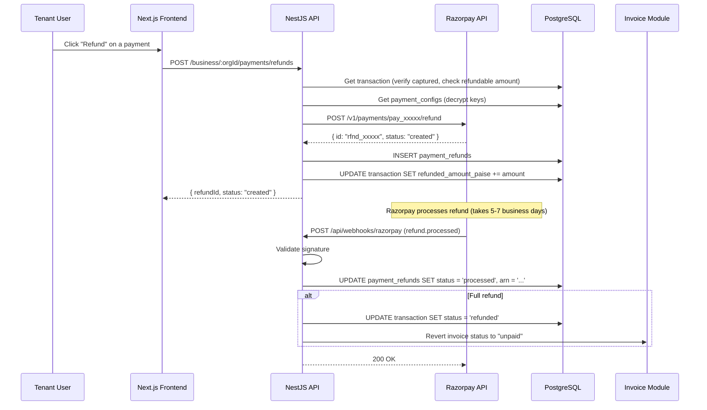
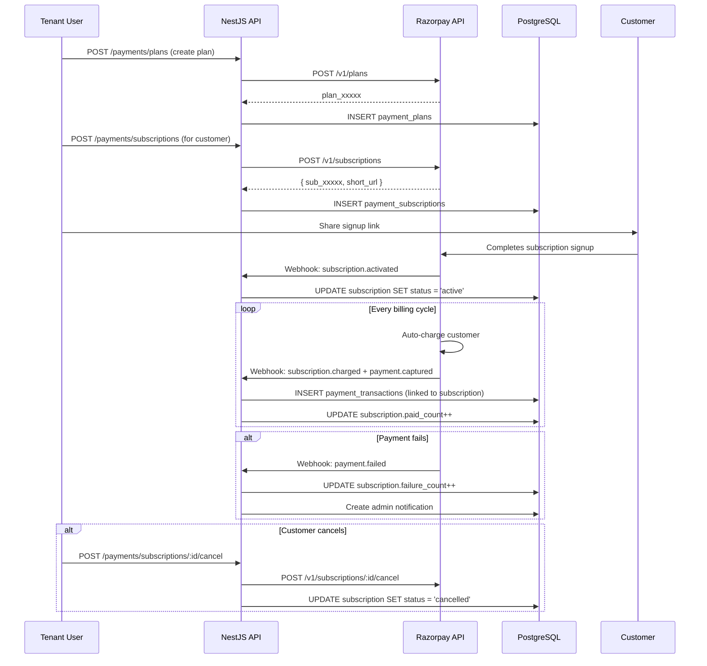
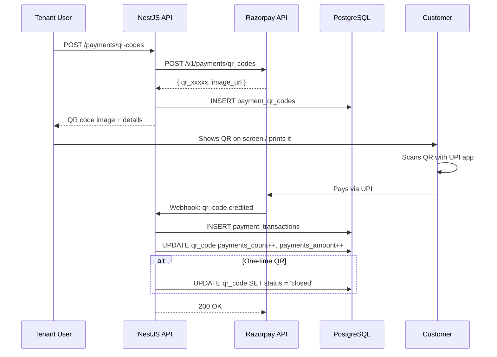

# Razorpay UPI Payment Integration — Feature Spec

> **Purpose**: Integrate Razorpay payment gateway into the uzhavu platform so tenants can collect payments via UPI, cards, and netbanking — with auto-reconciliation, QR codes, refunds, and subscription billing.
>
> **Architecture ref**: `APP_ARCHITECTURE.md` — follows manifest + module config pattern
>
> **Multi-tenant**: Each org stores their own Razorpay credentials (encrypted). All data scoped by `orgId`.
>
> **Money convention**: All amounts stored in **paise** (Int) — ₹100.50 = `10050`. Follows existing uzhavu convention.

---

## Requirements

### Story 1: Razorpay Account Connection

As an **org admin**, I want to connect my Razorpay account to the platform so that my organization can collect payments from customers.

#### Acceptance Criteria

- GIVEN I am an org admin on a plan that includes payments WHEN I navigate to Settings → Integrations → Payments THEN I see a setup form to enter Razorpay Key ID, Key Secret, and Webhook Secret
- GIVEN I enter valid Razorpay credentials WHEN I submit the form THEN the system validates the credentials by calling the Razorpay API (`GET /v1/payments?count=1`), encrypts and stores the keys, and displays a success message
- GIVEN the credentials are invalid WHEN I submit the form THEN the system displays an error: "Invalid Razorpay credentials. Please check your Key ID and Key Secret."
- GIVEN I am on the free plan WHEN I try to access payment settings THEN I see an upgrade prompt explaining payments are available on Starter plan and above
- GIVEN my Razorpay account is already connected WHEN I view payment settings THEN I see the Key ID (masked: `rzp_live_****xxxx`), webhook status, and options to update credentials or disconnect
- GIVEN I update the Webhook Secret WHEN the system saves it THEN the system verifies webhook connectivity by sending a test event and displays the result

---

### Story 2: Payment Link Generation

As a **tenant user**, I want to generate a Razorpay payment link from an invoice so that my customer can pay via UPI, card, or netbanking.

#### Acceptance Criteria

- GIVEN I am viewing an unpaid invoice WHEN I click "Create Payment Link" THEN the system generates a Razorpay payment link with the invoice amount, description, and customer details
- GIVEN the payment link is created WHEN the response is received THEN the system stores the link in `payment_links` and shows the short URL and expiry date
- GIVEN a payment link exists for an invoice WHEN I view the invoice detail THEN I see the payment link URL, creation date, expiry, and click count
- GIVEN a payment link has already been created for this invoice WHEN I click "Create Payment Link" again THEN the system asks: "A payment link already exists. Create a new one or copy the existing link?"
- GIVEN the invoice has zero amount or negative amount WHEN I try to create a payment link THEN the system returns an error: "Cannot create payment link for a zero or negative amount."
- GIVEN I create a payment link WHEN I choose to share it THEN I can copy the link to clipboard, or send it via WhatsApp (if WhatsApp module is active)

---

### Story 3: Auto-Reconciliation

As a **tenant user**, I want payments to be automatically marked on invoices when customers pay so that I don't have to manually update invoice statuses.

#### Acceptance Criteria

- GIVEN a customer pays via a Razorpay payment link WHEN Razorpay sends a `payment.captured` webhook THEN the system validates the webhook signature, matches the payment to an invoice via `payment_link_id` or `notes.invoice_id`, creates a `payment_transactions` record, and marks the invoice as "paid"
- GIVEN a payment webhook is received WHEN the signature validation fails THEN the system returns `401 Unauthorized`, logs the attempt with IP and headers, and does not process the payment
- GIVEN a payment is captured WHEN the amount matches the invoice total THEN the invoice status changes to "paid" and a transaction record is created with `reconciliation_status = 'auto'`
- GIVEN a payment is captured WHEN the amount is less than the invoice total (partial payment) THEN the system creates the transaction record, updates the invoice `paid_amount`, but keeps the invoice status as "partially_paid"
- GIVEN a payment is captured WHEN no matching invoice is found THEN the system creates an "unmatched" transaction record with `reconciliation_status = 'unmatched'` and creates an admin notification
- GIVEN a duplicate webhook is received (same `payment_id`) WHEN processing THEN the system returns `200 OK` without creating duplicate records (idempotent)

---

### Story 4: UPI QR Code Payments

As a **tenant user**, I want to generate UPI QR codes for in-person payments so that customers can pay by scanning a QR code.

#### Acceptance Criteria

- GIVEN I am on the payment dashboard WHEN I click "Generate QR Code" THEN I see a form to enter the payment amount, description, and optional customer reference
- GIVEN I submit the QR form with a valid amount WHEN the system processes it THEN it calls Razorpay's QR Code API, generates a QR code image, and displays it on screen with a download option
- GIVEN a QR code is generated WHEN a customer scans and pays THEN the payment is captured via webhook and linked to the QR code record
- GIVEN a QR code is displayed WHEN I click "Print" THEN the system generates a printable version with the amount, business name, and UPI ID
- GIVEN a QR code has expired (configurable: 15 min default) WHEN a customer tries to scan it THEN the payment fails and the merchant is shown "QR code expired — generate a new one"
- GIVEN I want a fixed static QR code WHEN I toggle "Reusable QR" THEN the system generates a permanent QR code linked to the merchant's VPA that accepts any amount

---

### Story 5: Payment Dashboard

As a **tenant user**, I want to view all payments, refunds, and settlement status in a dashboard so that I have full visibility into my payment operations.

#### Acceptance Criteria

- GIVEN I navigate to the Payments dashboard WHEN transactions exist THEN I see a paginated table with columns: date, amount, customer, method (UPI/card/netbanking), status, invoice #, and settlement status
- GIVEN I am on the dashboard WHEN I view the summary cards THEN I see: total collected (today/week/month), pending settlements, refunded amount, and success rate percentage
- GIVEN I want to find a specific payment WHEN I use filters (date range, status, method, amount range) THEN the table shows matching transactions
- GIVEN I click on a payment row WHEN the detail panel opens THEN I see: Razorpay payment ID, method details (UPI VPA / card last 4 / bank name), timeline (created → authorized → captured), fee breakdown (Razorpay fee, GST, net amount), and linked invoice
- GIVEN I want to export payments WHEN I click "Export CSV" THEN the system downloads a CSV of filtered transactions with all columns
- GIVEN I view the dashboard WHEN settlements have been processed by Razorpay THEN I see settlement IDs, settlement dates, and UTR numbers for each batch

---

### Story 6: Refund Management

As a **tenant user**, I want to process full or partial refunds from the dashboard so that I can handle customer refund requests without logging into Razorpay.

#### Acceptance Criteria

- GIVEN I am viewing a captured payment WHEN I click "Refund" THEN I see a refund form pre-filled with the full amount and a field for refund reason
- GIVEN I submit a full refund WHEN the amount equals the original payment THEN the system calls Razorpay's Refund API, creates a `payment_refunds` record, updates the payment status to "refunded", and reverses the invoice status to "unpaid"
- GIVEN I submit a partial refund WHEN the amount is less than the original payment THEN the system creates a refund record for the partial amount, updates the payment's `refunded_amount`, and keeps the invoice status as "paid" (with a note about partial refund)
- GIVEN I try to refund more than the original amount WHEN I submit THEN the system returns an error: "Refund amount cannot exceed the original payment amount."
- GIVEN a refund is processed WHEN Razorpay sends a `refund.processed` webhook THEN the system updates the refund status to "processed" and records the ARN (Acquirer Reference Number)
- GIVEN a refund fails at Razorpay WHEN the `refund.failed` webhook is received THEN the system updates the refund status to "failed", logs the failure reason, and creates an admin notification
- GIVEN a payment has already been fully refunded WHEN I try to refund it again THEN the system returns an error: "This payment has already been fully refunded."

---

### Story 7: Subscription Billing

As a **tenant user**, I want to set up recurring payments for memberships, fees, or rentals so that customers are automatically charged on a schedule.

#### Acceptance Criteria

- GIVEN I navigate to Payments → Subscriptions WHEN I click "Create Plan" THEN I see a form with: plan name, amount, billing interval (weekly/monthly/quarterly/yearly), description, and trial period (days)
- GIVEN I create a plan WHEN I submit valid details THEN the system creates a plan in Razorpay via API and stores it in `payment_subscriptions` with status "active"
- GIVEN a plan exists WHEN I create a subscription for a customer THEN the system creates a Razorpay subscription, generates a signup link, and stores the subscription record
- GIVEN a customer completes subscription signup WHEN Razorpay sends `subscription.activated` webhook THEN the system updates subscription status to "active" and records the start date
- GIVEN an active subscription WHEN the billing cycle occurs THEN Razorpay auto-charges the customer and sends `payment.captured` webhook → system creates transaction record linked to the subscription
- GIVEN a subscription payment fails WHEN Razorpay sends `payment.failed` webhook THEN the system updates the subscription with failure count and creates an admin notification
- GIVEN I want to cancel a subscription WHEN I click "Cancel" THEN the system calls Razorpay's cancel API, updates status to "cancelled", and records the cancellation date
- GIVEN a subscription has a trial period WHEN the trial ends THEN Razorpay automatically charges the first billing amount

---

## Design

### Architecture Overview

```
┌─────────────┐    ┌──────────────┐    ┌──────────────────┐
│  Next.js     │───▶│  NestJS API  │───▶│  PostgreSQL      │
│  Frontend    │    │  /payments/* │    │  payment_*       │
│              │    │              │    │  tables          │
└─────────────┘    └──────┬───────┘    └──────────────────┘
                          │
              ┌───────────┼───────────┐
              │           │           │
              ▼           ▼           ▼
       ┌────────────┐ ┌──────────┐ ┌─────────────┐
       │ Razorpay    │ │ Invoice  │ │ WhatsApp    │
       │ API v1      │ │ Module   │ │ Module      │
       │             │ │ (events) │ │ (optional)  │
       └────────────┘ └──────────┘ └─────────────┘
```

**Key flows:**
1. **Payment Link** → NestJS creates link via Razorpay API → customer pays → webhook confirms → invoice auto-reconciled
2. **QR Code** → NestJS generates QR via Razorpay API → customer scans → webhook confirms
3. **Refund** → NestJS calls Razorpay Refund API → webhook confirms processing
4. **Subscription** → NestJS creates plan/subscription → Razorpay auto-charges → webhook creates transaction records

---

### Data Models

```sql
-- ============================================================
-- Razorpay configuration per organization (encrypted credentials)
-- ============================================================
CREATE TABLE payment_configs (
  id                    TEXT PRIMARY KEY DEFAULT gen_random_uuid()::text,
  org_id                TEXT NOT NULL UNIQUE,
  provider              TEXT NOT NULL DEFAULT 'razorpay',  -- Future: stripe, paytm
  key_id                TEXT NOT NULL,                     -- rzp_live_xxxxx (not secret, can store plain)
  key_secret_encrypted  TEXT NOT NULL,                     -- AES-256 encrypted
  webhook_secret_encrypted TEXT NOT NULL,                  -- AES-256 encrypted
  is_active             BOOLEAN DEFAULT true,
  is_test_mode          BOOLEAN DEFAULT false,             -- true = rzp_test_*, false = rzp_live_*
  merchant_name         TEXT,
  monthly_txn_count     INT DEFAULT 0,
  txn_count_reset_at    TIMESTAMPTZ,
  created_at            TIMESTAMPTZ DEFAULT NOW(),
  updated_at            TIMESTAMPTZ DEFAULT NOW()
);

CREATE INDEX idx_pay_config_org ON payment_configs(org_id);

-- ============================================================
-- Payment links — generated from invoices
-- ============================================================
CREATE TABLE payment_links (
  id                    TEXT PRIMARY KEY DEFAULT gen_random_uuid()::text,
  org_id                TEXT NOT NULL,
  config_id             TEXT NOT NULL REFERENCES payment_configs(id) ON DELETE CASCADE,
  invoice_id            TEXT NOT NULL,                     -- FK to invoices table
  razorpay_link_id      TEXT NOT NULL UNIQUE,              -- plink_xxxxx
  short_url             TEXT NOT NULL,                     -- https://rzp.io/i/xxxxx
  amount_paise          INT NOT NULL,                      -- Amount in paise
  currency              TEXT NOT NULL DEFAULT 'INR',
  description           TEXT,
  customer_name         TEXT,
  customer_email        TEXT,
  customer_phone        TEXT,                              -- E.164 format
  status                TEXT DEFAULT 'created',            -- created|paid|partially_paid|expired|cancelled
  expire_by             TIMESTAMPTZ,
  paid_amount_paise     INT DEFAULT 0,
  payment_id            TEXT,                              -- Set when paid: pay_xxxxx
  reminder_enabled      BOOLEAN DEFAULT true,              -- Razorpay's built-in reminders
  notes                 JSONB DEFAULT '{}',                -- Passed to Razorpay for reconciliation
  created_at            TIMESTAMPTZ DEFAULT NOW(),
  updated_at            TIMESTAMPTZ DEFAULT NOW()
);

CREATE INDEX idx_pay_link_org ON payment_links(org_id, created_at DESC);
CREATE INDEX idx_pay_link_invoice ON payment_links(invoice_id);
CREATE INDEX idx_pay_link_rz_id ON payment_links(razorpay_link_id);
CREATE INDEX idx_pay_link_status ON payment_links(org_id, status) WHERE status != 'paid';

-- ============================================================
-- Payment transactions — one record per payment captured
-- ============================================================
CREATE TABLE payment_transactions (
  id                      TEXT PRIMARY KEY DEFAULT gen_random_uuid()::text,
  org_id                  TEXT NOT NULL,
  config_id               TEXT NOT NULL REFERENCES payment_configs(id) ON DELETE CASCADE,
  razorpay_payment_id     TEXT NOT NULL UNIQUE,            -- pay_xxxxx
  razorpay_order_id       TEXT,                            -- order_xxxxx (if via order flow)
  payment_link_id         TEXT REFERENCES payment_links(id),
  invoice_id              TEXT,                            -- FK to invoices table
  subscription_id         TEXT,                            -- FK to payment_subscriptions (if recurring)
  amount_paise            INT NOT NULL,
  currency                TEXT NOT NULL DEFAULT 'INR',
  method                  TEXT NOT NULL,                   -- upi|card|netbanking|wallet|emi
  method_details          JSONB DEFAULT '{}',              -- { "vpa": "user@upi", "card_last4": "1234", "bank": "HDFC" }
  status                  TEXT NOT NULL,                   -- created|authorized|captured|failed|refunded
  fee_paise               INT DEFAULT 0,                   -- Razorpay fee
  tax_paise               INT DEFAULT 0,                   -- GST on fee
  net_amount_paise        INT DEFAULT 0,                   -- amount - fee - tax
  settlement_id           TEXT,                            -- settle_xxxxx
  settlement_status       TEXT DEFAULT 'pending',          -- pending|processed|on_hold
  settled_at              TIMESTAMPTZ,
  utr                     TEXT,                            -- UTR number for bank transfer
  refunded_amount_paise   INT DEFAULT 0,
  reconciliation_status   TEXT DEFAULT 'pending',          -- pending|auto|manual|unmatched
  customer_name           TEXT,
  customer_email          TEXT,
  customer_phone          TEXT,
  error_code              TEXT,                            -- If failed
  error_description       TEXT,
  error_reason            TEXT,
  notes                   JSONB DEFAULT '{}',
  captured_at             TIMESTAMPTZ,
  created_at              TIMESTAMPTZ DEFAULT NOW(),
  updated_at              TIMESTAMPTZ DEFAULT NOW()
);

CREATE INDEX idx_pay_txn_org ON payment_transactions(org_id, created_at DESC);
CREATE INDEX idx_pay_txn_invoice ON payment_transactions(invoice_id) WHERE invoice_id IS NOT NULL;
CREATE INDEX idx_pay_txn_rz_id ON payment_transactions(razorpay_payment_id);
CREATE INDEX idx_pay_txn_status ON payment_transactions(org_id, status);
CREATE INDEX idx_pay_txn_method ON payment_transactions(org_id, method, created_at DESC);
CREATE INDEX idx_pay_txn_settlement ON payment_transactions(settlement_id) WHERE settlement_id IS NOT NULL;
CREATE INDEX idx_pay_txn_recon ON payment_transactions(org_id, reconciliation_status)
  WHERE reconciliation_status IN ('pending', 'unmatched');

-- ============================================================
-- Refunds — full or partial
-- ============================================================
CREATE TABLE payment_refunds (
  id                      TEXT PRIMARY KEY DEFAULT gen_random_uuid()::text,
  org_id                  TEXT NOT NULL,
  transaction_id          TEXT NOT NULL REFERENCES payment_transactions(id) ON DELETE CASCADE,
  razorpay_refund_id      TEXT NOT NULL UNIQUE,            -- rfnd_xxxxx
  razorpay_payment_id     TEXT NOT NULL,                   -- pay_xxxxx (denormalized for lookup)
  amount_paise            INT NOT NULL,
  currency                TEXT NOT NULL DEFAULT 'INR',
  reason                  TEXT,                            -- User-provided reason
  status                  TEXT DEFAULT 'created',          -- created|processed|failed
  speed                   TEXT DEFAULT 'normal',           -- normal|optimum (instant refund)
  arn                     TEXT,                            -- Acquirer Reference Number
  receipt                 TEXT,
  initiated_by            TEXT,                            -- User ID who initiated
  processed_at            TIMESTAMPTZ,
  failed_reason           TEXT,
  notes                   JSONB DEFAULT '{}',
  created_at              TIMESTAMPTZ DEFAULT NOW(),
  updated_at              TIMESTAMPTZ DEFAULT NOW()
);

CREATE INDEX idx_pay_refund_org ON payment_refunds(org_id, created_at DESC);
CREATE INDEX idx_pay_refund_txn ON payment_refunds(transaction_id);
CREATE INDEX idx_pay_refund_rz_id ON payment_refunds(razorpay_refund_id);
CREATE INDEX idx_pay_refund_status ON payment_refunds(org_id, status) WHERE status != 'processed';

-- ============================================================
-- Subscription plans and active subscriptions
-- ============================================================
CREATE TABLE payment_plans (
  id                      TEXT PRIMARY KEY DEFAULT gen_random_uuid()::text,
  org_id                  TEXT NOT NULL,
  razorpay_plan_id        TEXT NOT NULL UNIQUE,            -- plan_xxxxx
  name                    TEXT NOT NULL,
  description             TEXT,
  amount_paise            INT NOT NULL,
  currency                TEXT NOT NULL DEFAULT 'INR',
  interval                TEXT NOT NULL,                   -- weekly|monthly|quarterly|yearly
  interval_count          INT DEFAULT 1,                   -- e.g., 2 = every 2 months
  is_active               BOOLEAN DEFAULT true,
  subscriber_count        INT DEFAULT 0,
  created_at              TIMESTAMPTZ DEFAULT NOW(),
  updated_at              TIMESTAMPTZ DEFAULT NOW()
);

CREATE INDEX idx_pay_plan_org ON payment_plans(org_id);

CREATE TABLE payment_subscriptions (
  id                      TEXT PRIMARY KEY DEFAULT gen_random_uuid()::text,
  org_id                  TEXT NOT NULL,
  plan_id                 TEXT NOT NULL REFERENCES payment_plans(id) ON DELETE CASCADE,
  razorpay_subscription_id TEXT NOT NULL UNIQUE,           -- sub_xxxxx
  customer_id             TEXT,                            -- FK to customers table
  customer_name           TEXT,
  customer_email          TEXT,
  customer_phone          TEXT,
  status                  TEXT DEFAULT 'created',          -- created|authenticated|active|paused|pending|halted|cancelled|completed|expired
  short_url               TEXT,                            -- Signup link
  total_count             INT,                             -- Total billing cycles (NULL = infinite)
  paid_count              INT DEFAULT 0,
  remaining_count         INT,
  start_at                TIMESTAMPTZ,
  end_at                  TIMESTAMPTZ,
  charge_at               TIMESTAMPTZ,                     -- Next charge date
  trial_days              INT DEFAULT 0,
  trial_ends_at           TIMESTAMPTZ,
  current_period_start    TIMESTAMPTZ,
  current_period_end      TIMESTAMPTZ,
  has_scheduled_changes   BOOLEAN DEFAULT false,
  failure_count           INT DEFAULT 0,
  cancelled_at            TIMESTAMPTZ,
  cancel_reason           TEXT,
  notes                   JSONB DEFAULT '{}',
  created_at              TIMESTAMPTZ DEFAULT NOW(),
  updated_at              TIMESTAMPTZ DEFAULT NOW()
);

CREATE INDEX idx_pay_sub_org ON payment_subscriptions(org_id, created_at DESC);
CREATE INDEX idx_pay_sub_plan ON payment_subscriptions(plan_id);
CREATE INDEX idx_pay_sub_rz_id ON payment_subscriptions(razorpay_subscription_id);
CREATE INDEX idx_pay_sub_status ON payment_subscriptions(org_id, status);
CREATE INDEX idx_pay_sub_customer ON payment_subscriptions(customer_id) WHERE customer_id IS NOT NULL;
CREATE INDEX idx_pay_sub_charge ON payment_subscriptions(charge_at)
  WHERE status = 'active';

-- ============================================================
-- QR codes — for in-person payments
-- ============================================================
CREATE TABLE payment_qr_codes (
  id                      TEXT PRIMARY KEY DEFAULT gen_random_uuid()::text,
  org_id                  TEXT NOT NULL,
  config_id               TEXT NOT NULL REFERENCES payment_configs(id) ON DELETE CASCADE,
  razorpay_qr_id          TEXT NOT NULL UNIQUE,            -- qr_xxxxx
  name                    TEXT,
  qr_type                 TEXT NOT NULL DEFAULT 'one_time', -- one_time|reusable
  amount_paise            INT,                              -- NULL for reusable (any amount)
  currency                TEXT NOT NULL DEFAULT 'INR',
  description             TEXT,
  image_url               TEXT NOT NULL,                    -- QR code image URL from Razorpay
  status                  TEXT DEFAULT 'active',            -- active|closed|expired
  payments_count          INT DEFAULT 0,
  payments_amount_paise   INT DEFAULT 0,
  customer_id             TEXT,                              -- Optional: link to customer
  expire_at               TIMESTAMPTZ,
  closed_at               TIMESTAMPTZ,
  close_reason            TEXT,
  created_at              TIMESTAMPTZ DEFAULT NOW()
);

CREATE INDEX idx_pay_qr_org ON payment_qr_codes(org_id, created_at DESC);
CREATE INDEX idx_pay_qr_rz_id ON payment_qr_codes(razorpay_qr_id);
CREATE INDEX idx_pay_qr_status ON payment_qr_codes(org_id, status) WHERE status = 'active';
```

---

### API Contracts

#### Module Structure

```
apps/api/src/modules/payments/
├── payments.module.ts
├── payments.controller.ts          # Admin endpoints (auth required)
├── payments.webhook.controller.ts  # Webhook endpoint (no auth, HMAC validation)
├── payments.service.ts             # Core business logic
├── payments.razorpay.service.ts    # Razorpay API wrapper
├── payments.reconciliation.service.ts  # Auto-reconciliation logic
├── payments.subscription.service.ts    # Subscription/plan management
├── payments.qr.service.ts         # QR code generation
├── payments.listener.service.ts    # Event bus listeners (invoice events)
├── dto/
│   ├── create-config.dto.ts
│   ├── create-payment-link.dto.ts
│   ├── create-refund.dto.ts
│   ├── create-plan.dto.ts
│   ├── create-subscription.dto.ts
│   └── create-qr-code.dto.ts
├── interfaces/
│   └── razorpay-webhook.interface.ts
└── payments.service.spec.ts
```

#### Webhook — Payment Events

```
POST /api/webhooks/razorpay
```

No auth guard — validated via HMAC SHA-256 signature.

**Webhook validation:**
```
Header: X-Razorpay-Signature
Body: raw JSON body
Secret: webhook_secret from payment_configs
Validation: SHA256 HMAC(raw_body, webhook_secret) === X-Razorpay-Signature
```

**Supported events:**

| Event | Action |
|:------|:-------|
| `payment.captured` | Create transaction record, reconcile with invoice |
| `payment.failed` | Create failed transaction record, notify admin |
| `payment_link.paid` | Update payment link status, trigger reconciliation |
| `refund.processed` | Update refund status + ARN |
| `refund.failed` | Update refund status, notify admin |
| `subscription.activated` | Update subscription status |
| `subscription.charged` | Create transaction record linked to subscription |
| `subscription.halted` | Update subscription status, notify admin |
| `subscription.cancelled` | Update subscription status |
| `qr_code.credited` | Create transaction, update QR payment count |
| `settlement.processed` | Update transactions with settlement ID and UTR |

**Payload example (`payment.captured`):**
```json
{
  "entity": "event",
  "account_id": "acc_xxxxx",
  "event": "payment.captured",
  "contains": ["payment"],
  "payload": {
    "payment": {
      "entity": {
        "id": "pay_xxxxx",
        "entity": "payment",
        "amount": 50000,
        "currency": "INR",
        "status": "captured",
        "order_id": "order_xxxxx",
        "method": "upi",
        "vpa": "user@ybl",
        "description": "Invoice #INV-1042",
        "fee": 1180,
        "tax": 180,
        "notes": {
          "invoice_id": "inv_abc123",
          "org_id": "org_xyz"
        },
        "created_at": 1720180800
      }
    }
  }
}
```

**Processing flow:**
1. Read raw body and `X-Razorpay-Signature` header
2. Lookup `payment_configs` by `notes.org_id` (from payload) or iterate active configs
3. Validate HMAC: `SHA256(raw_body, webhook_secret)`
4. Route to handler based on `event` type
5. Check for duplicate `razorpay_payment_id` (idempotency)
6. Process and return `200 OK`

**Response:** `200 OK` with `{ "status": "ok" }`

---

#### Config — Connect Razorpay Account

```
POST /business/:orgId/payments/config
Authorization: Bearer <token>
```

**Request:**
```json
{
  "keyId": "rzp_live_xxxxx",
  "keySecret": "xxxxxxxxxxxxxxxxxx",
  "webhookSecret": "xxxxxxxxxxxxxxxxxx",
  "merchantName": "Ravi's Farm Store",
  "isTestMode": false
}
```

**Response (201):**
```json
{
  "success": true,
  "data": {
    "id": "cfg_pay_001",
    "orgId": "org_xyz",
    "keyId": "rzp_live_xxxxx",
    "merchantName": "Ravi's Farm Store",
    "isActive": true,
    "isTestMode": false,
    "createdAt": "2026-07-05T12:00:00Z"
  }
}
```

**Errors:**
- `400` — Missing required fields
- `401` — Invalid Razorpay credentials (API validation failed)
- `409` — Payment config already exists for this org

```
GET /business/:orgId/payments/config
```

**Response (200):**
```json
{
  "success": true,
  "data": {
    "id": "cfg_pay_001",
    "keyId": "rzp_live_****xxxx",
    "merchantName": "Ravi's Farm Store",
    "isActive": true,
    "isTestMode": false,
    "monthlyTxnCount": 32,
    "monthlyTxnLimit": 50,
    "webhookStatus": "verified"
  }
}
```

```
PATCH /business/:orgId/payments/config
```

```
DELETE /business/:orgId/payments/config
```

---

#### Payment Links

```
POST /business/:orgId/payments/links
Authorization: Bearer <token>
```

**Request:**
```json
{
  "invoiceId": "inv_abc123",
  "amountPaise": 50000,
  "description": "Invoice #INV-1042 — Farm Supplies",
  "customerName": "Ravi Kumar",
  "customerEmail": "ravi@example.com",
  "customerPhone": "+919999888877",
  "expireDays": 7,
  "reminderEnabled": true,
  "notifyViaSms": true,
  "notifyViaEmail": true
}
```

**Response (201):**
```json
{
  "success": true,
  "data": {
    "id": "pl_001",
    "razorpayLinkId": "plink_xxxxx",
    "shortUrl": "https://rzp.io/i/xxxxx",
    "amountPaise": 50000,
    "status": "created",
    "expireBy": "2026-07-12T12:00:00Z",
    "invoiceId": "inv_abc123",
    "createdAt": "2026-07-05T12:00:00Z"
  }
}
```

**Errors:**
- `400` — Invalid amount (zero, negative, or exceeds ₹5,00,000 limit)
- `404` — Invoice not found
- `409` — Active payment link already exists for this invoice
- `429` — Monthly transaction quota exceeded

```
GET /business/:orgId/payments/links?invoiceId=inv_abc123&status=created&page=1&limit=20
```

```
POST /business/:orgId/payments/links/:linkId/cancel
```

---

#### Transactions

```
GET /business/:orgId/payments/transactions?page=1&limit=20
Authorization: Bearer <token>
```

**Query params:**
- `status` — created|authorized|captured|failed|refunded
- `method` — upi|card|netbanking|wallet|emi
- `dateFrom` / `dateTo` — ISO date range
- `amountMin` / `amountMax` — in paise
- `invoiceId` — filter by invoice
- `settlementStatus` — pending|processed|on_hold
- `reconciliationStatus` — pending|auto|manual|unmatched

**Response (200):**
```json
{
  "success": true,
  "data": [
    {
      "id": "txn_001",
      "razorpayPaymentId": "pay_xxxxx",
      "amountPaise": 50000,
      "currency": "INR",
      "method": "upi",
      "methodDetails": { "vpa": "ravi@ybl" },
      "status": "captured",
      "feePaise": 1180,
      "taxPaise": 180,
      "netAmountPaise": 48820,
      "settlementStatus": "processed",
      "reconciliationStatus": "auto",
      "invoiceId": "inv_abc123",
      "customerName": "Ravi Kumar",
      "capturedAt": "2026-07-05T12:05:00Z",
      "createdAt": "2026-07-05T12:04:50Z"
    }
  ],
  "pagination": { "page": 1, "limit": 20, "total": 156 }
}
```

```
GET /business/:orgId/payments/transactions/:transactionId
```

**Response (200):**
```json
{
  "success": true,
  "data": {
    "id": "txn_001",
    "razorpayPaymentId": "pay_xxxxx",
    "razorpayOrderId": null,
    "amountPaise": 50000,
    "currency": "INR",
    "method": "upi",
    "methodDetails": { "vpa": "ravi@ybl" },
    "status": "captured",
    "feePaise": 1180,
    "taxPaise": 180,
    "netAmountPaise": 48820,
    "settlementId": "settle_xxxxx",
    "settlementStatus": "processed",
    "settledAt": "2026-07-07T06:00:00Z",
    "utr": "UTR123456789",
    "reconciliationStatus": "auto",
    "invoiceId": "inv_abc123",
    "customerName": "Ravi Kumar",
    "customerEmail": "ravi@example.com",
    "customerPhone": "+919999888877",
    "refundedAmountPaise": 0,
    "paymentLink": {
      "id": "pl_001",
      "shortUrl": "https://rzp.io/i/xxxxx"
    },
    "refunds": [],
    "timeline": [
      { "event": "created", "at": "2026-07-05T12:04:50Z" },
      { "event": "authorized", "at": "2026-07-05T12:04:55Z" },
      { "event": "captured", "at": "2026-07-05T12:05:00Z" }
    ],
    "notes": { "invoice_id": "inv_abc123" },
    "capturedAt": "2026-07-05T12:05:00Z",
    "createdAt": "2026-07-05T12:04:50Z"
  }
}
```

#### Dashboard Stats

```
GET /business/:orgId/payments/stats?period=month
Authorization: Bearer <token>
```

**Response (200):**
```json
{
  "success": true,
  "data": {
    "totalCollectedPaise": 1250000,
    "totalTransactions": 45,
    "pendingSettlementPaise": 50000,
    "refundedPaise": 25000,
    "successRate": 94.5,
    "methodBreakdown": {
      "upi": { "count": 30, "amountPaise": 800000 },
      "card": { "count": 10, "amountPaise": 350000 },
      "netbanking": { "count": 5, "amountPaise": 100000 }
    },
    "dailyTrend": [
      { "date": "2026-07-01", "amountPaise": 125000, "count": 5 },
      { "date": "2026-07-02", "amountPaise": 200000, "count": 8 }
    ]
  }
}
```

---

#### Refunds

```
POST /business/:orgId/payments/refunds
Authorization: Bearer <token>
```

**Request:**
```json
{
  "transactionId": "txn_001",
  "amountPaise": 50000,
  "reason": "Customer requested refund — defective product",
  "speed": "normal"
}
```

**Response (201):**
```json
{
  "success": true,
  "data": {
    "id": "ref_001",
    "razorpayRefundId": "rfnd_xxxxx",
    "razorpayPaymentId": "pay_xxxxx",
    "amountPaise": 50000,
    "status": "created",
    "speed": "normal",
    "reason": "Customer requested refund — defective product",
    "createdAt": "2026-07-05T14:00:00Z"
  }
}
```

**Errors:**
- `400` — Amount exceeds refundable amount (`original - already_refunded`)
- `400` — Refund amount is zero or negative
- `404` — Transaction not found
- `409` — Payment already fully refunded
- `422` — Payment not in "captured" status (can't refund uncaptured payments)

```
GET /business/:orgId/payments/refunds?page=1&limit=20
```

```
GET /business/:orgId/payments/refunds/:refundId
```

---

#### Subscriptions & Plans

```
POST /business/:orgId/payments/plans
Authorization: Bearer <token>
```

**Request:**
```json
{
  "name": "Monthly Gym Membership",
  "description": "Full gym access with trainer",
  "amountPaise": 200000,
  "interval": "monthly",
  "intervalCount": 1
}
```

**Response (201):**
```json
{
  "success": true,
  "data": {
    "id": "plan_001",
    "razorpayPlanId": "plan_xxxxx",
    "name": "Monthly Gym Membership",
    "amountPaise": 200000,
    "interval": "monthly",
    "isActive": true,
    "subscriberCount": 0,
    "createdAt": "2026-07-05T12:00:00Z"
  }
}
```

```
GET /business/:orgId/payments/plans
```

```
POST /business/:orgId/payments/subscriptions
Authorization: Bearer <token>
```

**Request:**
```json
{
  "planId": "plan_001",
  "customerId": "cust_abc",
  "customerName": "Ravi Kumar",
  "customerEmail": "ravi@example.com",
  "customerPhone": "+919999888877",
  "totalCount": 12,
  "trialDays": 7,
  "notifyCustomer": true
}
```

**Response (201):**
```json
{
  "success": true,
  "data": {
    "id": "sub_001",
    "razorpaySubscriptionId": "sub_xxxxx",
    "shortUrl": "https://rzp.io/i/xxxxx",
    "planId": "plan_001",
    "status": "created",
    "totalCount": 12,
    "trialDays": 7,
    "trialEndsAt": "2026-07-12T12:00:00Z",
    "createdAt": "2026-07-05T12:00:00Z"
  }
}
```

```
GET /business/:orgId/payments/subscriptions?status=active&page=1&limit=20
```

```
POST /business/:orgId/payments/subscriptions/:subscriptionId/cancel
Authorization: Bearer <token>
```

**Request:**
```json
{
  "cancelAtCycleEnd": true,
  "reason": "Customer requested cancellation"
}
```

---

#### QR Codes

```
POST /business/:orgId/payments/qr-codes
Authorization: Bearer <token>
```

**Request:**
```json
{
  "name": "Counter Payment",
  "qrType": "one_time",
  "amountPaise": 50000,
  "description": "Payment for Order #1042",
  "customerId": "cust_abc",
  "expireMinutes": 15
}
```

**Response (201):**
```json
{
  "success": true,
  "data": {
    "id": "qr_001",
    "razorpayQrId": "qr_xxxxx",
    "qrType": "one_time",
    "amountPaise": 50000,
    "imageUrl": "https://rzp.io/qr/xxxxx.png",
    "status": "active",
    "expireAt": "2026-07-05T12:15:00Z",
    "createdAt": "2026-07-05T12:00:00Z"
  }
}
```

```
GET /business/:orgId/payments/qr-codes?status=active&page=1&limit=20
```

```
POST /business/:orgId/payments/qr-codes/:qrCodeId/close
```

---

### Sequence Diagrams

#### Payment Link → Auto-Reconciliation



#### Refund Flow



#### Subscription Lifecycle



#### QR Code Payment



---

### Frontend Structure

```
apps/web/src/apps/payments/
├── manifest.ts
├── modules/
│   ├── config.ts             # Payment setup config
│   ├── transactions.ts       # Transaction list module config
│   ├── refunds.ts            # Refund list module config
│   ├── plans.ts              # Subscription plan CRUD config
│   ├── subscriptions.ts      # Subscription list config
│   └── qr-codes.ts           # QR code list config
├── pages/
│   ├── PaymentSetupPage.tsx   # Razorpay credential setup
│   ├── DashboardPage.tsx      # Payment overview with stats cards
│   ├── TransactionsPage.tsx   # Transaction list with filters
│   ├── TransactionDetailPage.tsx  # Single transaction detail + timeline
│   ├── RefundsPage.tsx        # Refund list
│   ├── RefundFormModal.tsx    # Refund form (full/partial)
│   ├── PlansPage.tsx          # Subscription plan management
│   ├── SubscriptionsPage.tsx  # Active subscriptions
│   ├── QrCodesPage.tsx        # QR code generation and list
│   └── SettingsPage.tsx       # Payment configuration
├── components/
│   ├── StatsCard.tsx          # Summary metric card
│   ├── PaymentMethodBadge.tsx # UPI/Card/Netbanking badge
│   ├── StatusBadge.tsx        # Payment status indicator
│   ├── AmountDisplay.tsx      # Paise → Rupees formatter
│   ├── QrCodeDisplay.tsx      # QR code image with print/download
│   ├── PaymentTimeline.tsx    # Created → Authorized → Captured timeline
│   ├── MethodBreakdownChart.tsx  # Pie chart for payment methods
│   └── DailyTrendChart.tsx    # Line chart for daily collection
├── actions/
│   └── payments.ts            # Server actions with withAction()
└── styles/
    ├── Dashboard.module.css
    ├── Transactions.module.css
    ├── QrCode.module.css
    └── Subscriptions.module.css
```

**Manifest:**
```typescript
export const manifest: AppManifest = {
  id: 'payments',
  name: 'Payments',
  description: 'Razorpay payment collection — UPI, cards, netbanking, QR codes, and subscriptions',
  icon: 'indian-rupee',
  version: '1.0.0',
  plans: ['starter', 'pro', 'enterprise'],
  dependencies: [],
  models: ['PaymentConfig', 'PaymentLink', 'PaymentTransaction', 'PaymentRefund', 'PaymentSubscription', 'PaymentQrCode'],
  nav: { section: 'finance', order: 2 },
  routes: [
    { path: '/payments/dashboard', label: 'Dashboard', icon: 'bar-chart-3' },
    { path: '/payments/transactions', label: 'Transactions', icon: 'receipt' },
    { path: '/payments/refunds', label: 'Refunds', icon: 'rotate-ccw' },
    { path: '/payments/subscriptions', label: 'Subscriptions', icon: 'repeat' },
    { path: '/payments/qr-codes', label: 'QR Codes', icon: 'qr-code' },
    { path: '/payments/settings', label: 'Settings', icon: 'settings' },
  ],
};
```

---

### Plan Gating Matrix

| Feature | Free | Starter (₹499) | Pro (₹1,499) | Enterprise (₹4,999) |
|:--------|:-----|:----------------|:--------------|:---------------------|
| **Payment Access** | ✗ | ✓ | ✓ | ✓ |
| **Transactions/month** | 0 | 50 | 500 | Unlimited |
| **Payment Links** | ✗ | ✓ | ✓ | ✓ |
| **Auto-Reconciliation** | ✗ | ✓ | ✓ | ✓ |
| **QR Code Payments** | ✗ | One-time only | One-time + Reusable | All types |
| **Refunds** | ✗ | Full only | Full + Partial | All + Instant |
| **Subscriptions** | ✗ | ✗ | 10 plans, 50 subs | Unlimited |
| **Payment Dashboard** | ✗ | Basic stats | Full analytics | Custom reports |
| **CSV Export** | ✗ | ✗ | ✓ | ✓ |
| **Settlement Tracking** | ✗ | ✗ | ✓ | ✓ |
| **Multi-Currency** | ✗ | ✗ | ✗ | ✓ |
| **WhatsApp Integration** | ✗ | ✗ | Payment link via WA | Full integration |

---

### Dependencies & Integrations

| Dependency | Purpose | Notes |
|:-----------|:--------|:------|
| **Razorpay API v1** | Payment processing | Test mode: `rzp_test_*`, Live: `rzp_live_*` |
| **Invoice Module** | Link payments to invoices | Event: `invoice.created` → auto-generate link |
| **Transaction Module** | Create accounting records | Write to existing Transaction model on payment capture |
| **WhatsApp Module** | Send payment links via WA | Optional — only if WhatsApp module is active |
| **Customer Module** | Customer details lookup | Phone, email, name for payment links |
| **EventBusService** | Cross-module events | Emit: `payment.captured`, `payment.refunded` |
| **Encryption Service** | AES-256 for Razorpay keys | Existing `EncryptionService` |

### Error Handling

| Scenario | Action |
|:---------|:-------|
| Razorpay API returns 401 (bad credentials) | Deactivate config, notify admin via email |
| Razorpay API returns 400 (bad request) | Return specific error to user with Razorpay's error description |
| Razorpay API rate limit (429) | Retry with exponential backoff (max 3, base 1s) |
| Webhook signature mismatch | Return 401, log attempt with IP, do NOT process |
| Duplicate webhook (`razorpay_payment_id` exists) | Return 200 OK, skip processing (idempotent) |
| Payment amount mismatch (link amount ≠ captured amount) | Create transaction as "unmatched", notify admin |
| Invoice already paid (duplicate payment) | Create transaction, link to invoice, notify admin of potential double-payment |
| Refund amount > refundable amount | Return 400 with clear error message |
| Subscription charge fails 3x | Razorpay halts subscription → webhook marks as "halted" → admin notified |
| QR code expired | Razorpay handles expiry → return error to customer |
| Monthly transaction quota exceeded | Block new payment link creation, return 429 |
| Network timeout to Razorpay API | Retry once after 2s, then return 503 with "Payment service temporarily unavailable" |

### Security Considerations

| Concern | Mitigation |
|:--------|:-----------|
| Razorpay Key Secret exposure | AES-256 encrypted at rest, never returned in API responses |
| Webhook tampering | HMAC SHA-256 signature validation on every webhook |
| Payment amount manipulation | Server-side amount validation against invoice; ignore client-provided amounts |
| IDOR (accessing another org's payments) | All queries scoped by `orgId` from auth token, never from request params |
| PCI compliance | No card data touches our servers — Razorpay handles all card processing |
| Refund abuse | Rate limit refunds (max 5/hour per org), require admin role |
| Replay attacks | Deduplicate by `razorpay_payment_id` / `razorpay_refund_id` |

---

## Tasks

### Phase 1: Foundation (~3 days)

- [ ] Create Prisma schema for `payment_configs`, `payment_links`, `payment_transactions`, `payment_refunds`, `payment_plans`, `payment_subscriptions`, `payment_qr_codes` tables (~3h)
- [ ] Run migration, verify tables and indexes in PostgreSQL (~30m)
- [ ] Create NestJS module skeleton: `payments.module.ts` with all service/controller registrations (~1h)
- [ ] Implement `PaymentsService` — config CRUD (create, get, update, delete) with AES-256 encryption for key_secret and webhook_secret (~3h)
- [ ] Implement `PaymentsController` — config endpoints: `POST/GET/PATCH/DELETE /business/:orgId/payments/config` (~2h)
- [ ] Implement `RazorpayService` — wrapper around Razorpay API: authenticated requests, error mapping, retry logic (~4h)
- [ ] Add plan-based guard: check org plan allows payments before any operation (~1h)
- [ ] Add monthly transaction quota tracking: increment on each captured payment, reset via cron on 1st of month (~2h)
- [ ] Write unit tests for config CRUD, encryption, and Razorpay API wrapper (~3h)

### Phase 2: Payment Links & Webhook (~4 days)

- [ ] Implement payment link creation: validate invoice → call Razorpay API → store in `payment_links` (~4h)
- [ ] Implement payment link list/get/cancel endpoints (~2h)
- [ ] Implement webhook controller: `POST /api/webhooks/razorpay` with HMAC SHA-256 signature validation (~3h)
- [ ] Implement `payment.captured` webhook handler: create transaction record, update payment link status (~4h)
- [ ] Implement `payment.failed` webhook handler: create failed transaction record, admin notification (~2h)
- [ ] Implement `payment_link.paid` webhook handler: update link status, trigger reconciliation (~2h)
- [ ] Implement auto-reconciliation: match payment to invoice via `notes.invoice_id` → mark invoice paid → create accounting transaction (~4h)
- [ ] Handle unmatched payments: create transaction with `reconciliation_status = 'unmatched'`, notify admin (~2h)
- [ ] Implement duplicate webhook protection: check `razorpay_payment_id` uniqueness before processing (~1h)
- [ ] Write unit tests for webhook validation, payment processing, and reconciliation (~3h)

### Phase 3: Refunds (~2 days)

- [ ] Implement refund creation: validate refundable amount → call Razorpay Refund API → store record (~3h)
- [ ] Implement refund list/get endpoints with pagination and filters (~2h)
- [ ] Implement `refund.processed` webhook handler: update status + ARN, revert invoice if full refund (~3h)
- [ ] Implement `refund.failed` webhook handler: update status, log reason, notify admin (~2h)
- [ ] Implement refund guards: prevent double refund, validate amount <= refundable, require admin role (~2h)
- [ ] Write unit tests for refund flow, edge cases (partial, full, over-refund) (~2h)

### Phase 4: QR Codes (~2 days)

- [ ] Implement QR code generation: one-time and reusable types via Razorpay QR API (~3h)
- [ ] Implement QR code list/get/close endpoints (~2h)
- [ ] Implement `qr_code.credited` webhook handler: create transaction, update QR stats, close if one-time (~3h)
- [ ] Implement QR code image serving: proxy from Razorpay or cache locally (~2h)
- [ ] Implement print-friendly QR view with business name, amount, and UPI details (~2h)
- [ ] Write unit tests for QR code generation and payment processing (~2h)

### Phase 5: Subscriptions (~3 days)

- [ ] Implement plan CRUD: create, list, get, deactivate — each calls Razorpay Plan API (~3h)
- [ ] Implement subscription creation: create via Razorpay API, generate signup link (~3h)
- [ ] Implement subscription list/get/cancel endpoints (~2h)
- [ ] Implement `subscription.activated` webhook handler: update status, record start date (~2h)
- [ ] Implement `subscription.charged` webhook handler: create transaction linked to subscription, increment paid_count (~3h)
- [ ] Implement `subscription.halted` webhook handler: update status, notify admin (~1h)
- [ ] Implement `subscription.cancelled` webhook handler: update status, record cancellation date (~1h)
- [ ] Implement `settlement.processed` webhook handler: update transactions with settlement ID and UTR (~2h)
- [ ] Write unit tests for subscription lifecycle and recurring payment processing (~3h)

### Phase 6: Dashboard Stats & Export (~2 days)

- [ ] Implement stats endpoint: aggregate totals, success rate, method breakdown, daily trend (~4h)
- [ ] Implement CSV export: generate CSV from filtered transaction query, return as download (~3h)
- [ ] Implement `PaymentListenerService` — subscribe to `invoice.created` event → optionally auto-generate payment link (~2h)
- [ ] Emit `payment.captured` and `payment.refunded` events via EventBusService for other modules to consume (~2h)
- [ ] Write unit tests for stats calculation and event emission (~2h)

### Phase 7: Frontend (~6 days)

- [ ] Create app manifest and register in app registry (~1h)
- [ ] Build Payment Setup Page: Razorpay credential input, validation, connection status, test mode toggle (~4h)
- [ ] Build Dashboard Page: stats cards (total collected, pending, refunded, success rate) + method breakdown chart + daily trend chart (~6h)
- [ ] Build Transactions Page: filterable/sortable table with status badges, method icons, amounts in ₹ (~5h)
- [ ] Build Transaction Detail Page: full payment info, fee breakdown, timeline, refund history (~4h)
- [ ] Build Refund Form Modal: amount input (pre-filled), reason, speed selection, validation (~3h)
- [ ] Build Refunds Page: refund list with status badges and ARN display (~3h)
- [ ] Build QR Codes Page: generation form, QR display with download/print, payment status (~4h)
- [ ] Build Plans Page: plan CRUD form (name, amount, interval), subscriber count display (~3h)
- [ ] Build Subscriptions Page: subscription list with status, next charge date, paid/total cycles (~4h)
- [ ] Build AmountDisplay component: paise → ₹ formatter with locale support (~1h)
- [ ] Build PaymentMethodBadge component: UPI/Card/Netbanking/Wallet icons and labels (~1h)
- [ ] Add "Create Payment Link" button to Invoice Detail page (existing page integration) (~2h)
- [ ] Create server actions with `withAction()` wrapper for all payment operations (~3h)
- [ ] CSS Modules for all components (Dashboard, Transactions, QrCode, Subscriptions) (~3h)
- [ ] Write component tests for StatsCard, AmountDisplay, PaymentMethodBadge, StatusBadge (~2h)

### Phase 8: Testing & Polish (~2 days)

- [ ] End-to-end test: create payment link → simulate payment capture webhook → verify invoice marked paid (~3h)
- [ ] End-to-end test: process refund → simulate refund webhook → verify invoice status reverted (~2h)
- [ ] End-to-end test: create QR code → simulate QR payment webhook → verify transaction created (~2h)
- [ ] End-to-end test: create plan → create subscription → simulate charge webhook → verify transaction (~2h)
- [ ] Test webhook signature validation: valid signature passes, invalid signature returns 401 (~1h)
- [ ] Test idempotency: send same webhook twice → verify no duplicate records (~1h)
- [ ] Test plan gating: verify free plan blocked, starter quota enforced, pro subscription access (~2h)
- [ ] Test error scenarios: invalid credentials, network timeout, amount mismatch, double refund (~2h)
- [ ] Load test: simulate 50 concurrent webhook deliveries → verify no race conditions or data corruption (~2h)
- [ ] Documentation: API docs, Razorpay setup guide, webhook configuration walkthrough (~2h)

**Total estimated effort: ~24 days**

---

*Generated: 05 Jul 2026*
*Ref: APP_ARCHITECTURE.md, product-factory-implementation.md*
