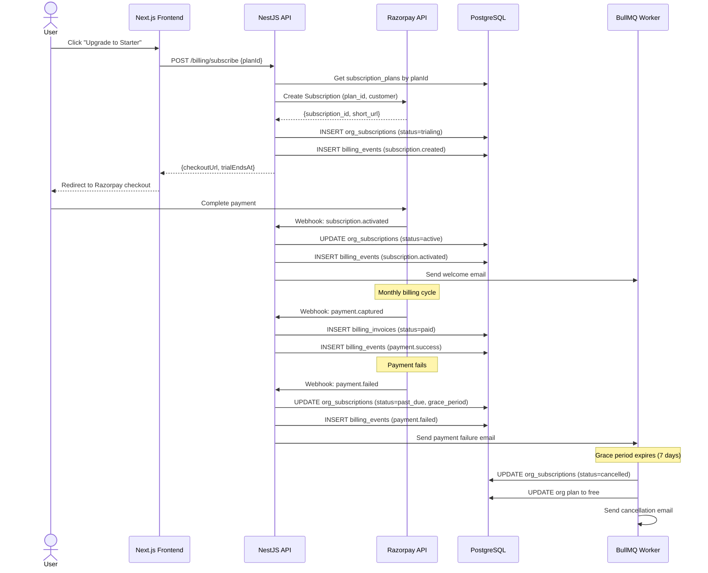
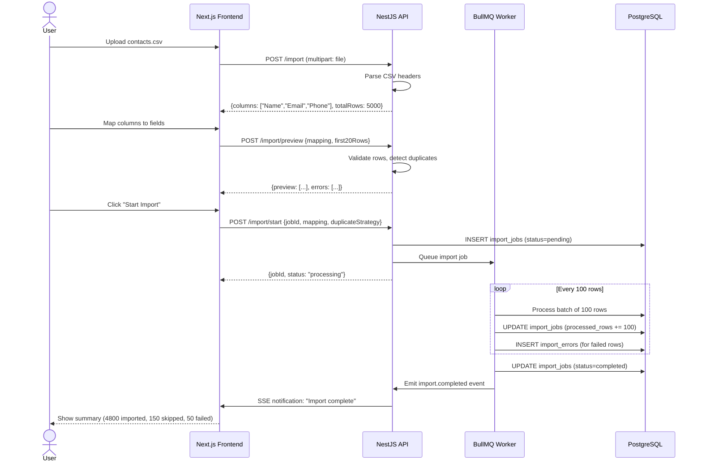
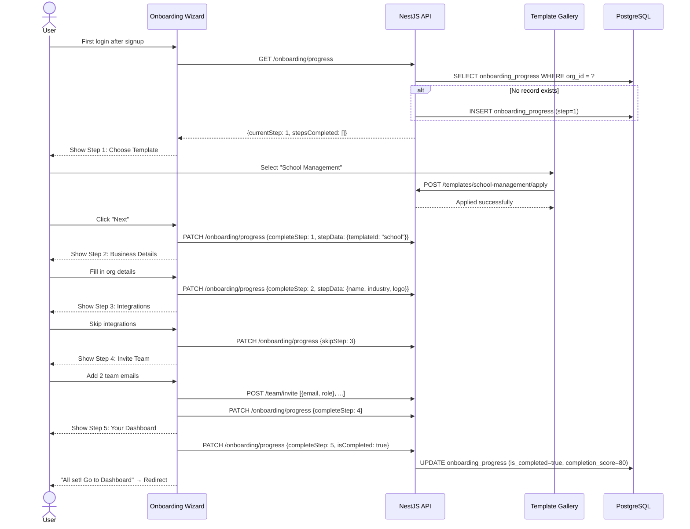

# Revenue & Growth Features — Feature Spec

> **Purpose**: Enable monetization and user acquisition for the uzhavu.race platform through billing, onboarding, localization, data migration, developer API, and a standalone product launcher.
>
> **Context**: Uzhavu is a multi-tenant SaaS monorepo (Turborepo + pnpm) with NestJS API, Next.js frontend, FastAPI AI engine, and PostgreSQL. All data is scoped by `orgId`. The platform already has ~110 Prisma models, 62 API modules, and 79 pages. These 6 features build on top of the existing product factory system (`SaasProduct` model) and Razorpay integration (`razorpay-upi.md`).
>
> **Architecture ref**: `APP_ARCHITECTURE.md`, `product-factory-implementation.md`, `razorpay-upi.md`, `template-gallery.md`

---

## Table of Contents

1. [Requirements](#requirements)
   - [Feature 1: Standalone App Launcher](#feature-1-standalone-app-launcher)
   - [Feature 2: Billing & Subscription System](#feature-2-billing--subscription-system)
   - [Feature 3: Onboarding Flow](#feature-3-onboarding-flow)
   - [Feature 4: Multi-language i18n](#feature-4-multi-language-i18n)
   - [Feature 5: Data Import/Export](#feature-5-data-importexport)
   - [Feature 6: Public API + Developer Docs](#feature-6-public-api--developer-docs)
2. [Design](#design)
3. [Tasks](#tasks)

---

# Requirements

## Feature 1: Standalone App Launcher

### Story 1.1: Create & Configure Standalone Product

As a **platform admin**, I want to **create a new standalone SaaS product from the admin panel** so that **I can launch branded single-purpose apps (school-mgmt, gym-tracker, etc.) without writing code**.

#### Acceptance Criteria

- GIVEN I am a platform admin WHEN I navigate to Admin → Products → Create New THEN I see a form with: product name, slug (auto-generated from name), tagline, primary domain, alias domains, and industry selector
- GIVEN I am creating a new product WHEN I configure the "Apps" section THEN I see a checkbox grid of all available apps (inventory, sales, invoicing, support, tasks) and can toggle which ones are included
- GIVEN I am creating a new product WHEN I configure "Branding" THEN I can upload a logo, set primary/secondary colors via color pickers, upload a favicon, and set footer text
- GIVEN I am creating a new product WHEN I configure "Pricing Plans" THEN I can define multiple plan tiers (free/starter/pro/enterprise) with monthly price (INR), feature limits (contacts, products, invoices, AI calls, storage), and which apps are available per tier
- GIVEN I submit the create form with valid data WHEN the product is saved THEN a new `SaasProduct` record is created in the database with status `draft` and I'm redirected to the product detail page
- GIVEN I try to create a product with a slug that already exists WHEN I submit THEN the system returns an error: "A product with this slug already exists."
- GIVEN I am editing an existing product WHEN I change any field and save THEN the product config is updated and changes take effect on the next page load for that product's domain

---

### Story 1.2: Domain Configuration & Landing Page Preview

As a **platform admin**, I want to **configure domains and preview the product landing page** so that **I can verify branding and content before publishing**.

#### Acceptance Criteria

- GIVEN I am on the product detail page WHEN I view the "Domains" section THEN I see the primary domain, alias domains, and DNS configuration instructions (CNAME record pointing to the VPS)
- GIVEN I add a new domain WHEN the system verifies it THEN it checks for a DNS TXT record `_uzhavu-verify.domain.com` with the product slug and shows verification status (pending/verified/failed)
- GIVEN a domain is verified WHEN SSL is provisioned THEN Caddy auto-provisions a Let's Encrypt certificate and the domain shows a green "SSL Active" badge
- GIVEN I click "Preview Landing Page" WHEN the preview loads THEN I see a live preview with the product's branding (logo, colors, favicon), marketing content (hero, description, features list), and pricing cards — rendered exactly as it would appear on the product domain
- GIVEN the preview is open WHEN I toggle between desktop/tablet/mobile viewports THEN the preview is responsive and adjusts layout accordingly

---

### Story 1.3: Publish & Unpublish Product

As a **platform admin**, I want to **publish or unpublish a standalone product** so that **I can control when products go live and take them offline if needed**.

#### Acceptance Criteria

- GIVEN a product is in `draft` status WHEN I click "Publish" THEN the system validates: at least one domain is verified, branding has a logo, at least one app is enabled, and at least one pricing plan exists
- GIVEN validation passes WHEN the product is published THEN its status changes to `published`, the domain starts serving the product landing page, and new users can sign up
- GIVEN validation fails WHEN I click "Publish" THEN I see a checklist of missing requirements with links to fix each one
- GIVEN a product is `published` WHEN I click "Unpublish" THEN a confirmation dialog warns: "Existing tenants will lose access. X organizations are currently using this product." — upon confirmation, the product status changes to `unpublished` and the domain shows a "Coming Soon" page
- GIVEN a product is `published` WHEN new users visit the product domain THEN they see the landing page with signup/login buttons that create organizations scoped to this product

---

### Story 1.4: Product Analytics Dashboard

As a **platform admin**, I want to **view analytics for each standalone product** so that **I can track signups, revenue, and engagement per product**.

#### Acceptance Criteria

- GIVEN I am on the product detail page WHEN I view the "Analytics" tab THEN I see summary cards: total signups, active users (30-day), MRR (Monthly Recurring Revenue), churn rate, and average revenue per user
- GIVEN I view analytics WHEN I select a date range THEN all metrics update to reflect that period with comparison to the previous period (e.g., "+12% vs last month")
- GIVEN I view analytics WHEN I scroll to the charts section THEN I see: signups over time (line chart), revenue over time (bar chart), plan distribution (pie chart), and top 10 organizations by usage
- GIVEN I view analytics WHEN I click "Export Report" THEN a PDF report is generated with all metrics and charts for the selected date range

---

## Feature 2: Billing & Subscription System

### Story 2.1: Plan Management

As a **platform admin**, I want to **create and manage subscription plan tiers** so that **each standalone product can offer differentiated pricing with feature limits**.

#### Acceptance Criteria

- GIVEN I am on Admin → Billing → Plans WHEN I click "Create Plan" THEN I see a form with: plan name, slug, description, monthly price (INR), annual price (INR, optional), trial period (days), and feature limits
- GIVEN I am configuring feature limits WHEN I view the limits section THEN I can set numeric limits for: max contacts, max products, max invoices/month, max AI calls/month, max storage (MB), max team members, and max API calls/day
- GIVEN I save a plan WHEN it is created THEN a corresponding plan is also created in Razorpay via the Subscriptions API (or Stripe for international) and the `razorpay_plan_id` is stored
- GIVEN I edit a plan's price WHEN existing subscribers are on this plan THEN a warning shows: "X active subscribers will NOT be affected. New subscribers will use the updated price."
- GIVEN I deactivate a plan WHEN subscribers exist THEN existing subscribers continue until cancellation but no new signups are allowed for this plan

---

### Story 2.2: Subscription Lifecycle

As a **tenant admin (org owner)**, I want to **subscribe to a plan for my organization** so that **I can access premium features and increase usage limits**.

#### Acceptance Criteria

- GIVEN I am a new org admin on the free plan WHEN I navigate to Settings → Billing THEN I see my current plan (Free), usage summary, and available upgrade options with pricing
- GIVEN I click "Upgrade to Starter" WHEN the payment flow starts THEN I am redirected to a Razorpay checkout page (or Stripe for international) with the plan amount pre-filled
- GIVEN payment succeeds WHEN Razorpay sends `subscription.activated` webhook THEN the org's subscription status changes to `active`, plan limits are updated, and a confirmation email is sent
- GIVEN a subscription has a trial period WHEN the org first subscribes THEN the trial starts immediately, full features are unlocked, and a "Trial ends in X days" banner is shown
- GIVEN a subscription is active WHEN the billing cycle renews THEN Razorpay auto-charges the payment method and the system creates a billing invoice record
- GIVEN a subscription renewal fails WHEN Razorpay sends `payment.failed` webhook THEN the subscription status changes to `past_due`, a grace period of 7 days starts, the org admin receives email + in-app notification, and a "Payment failed" banner is shown in the dashboard
- GIVEN the grace period expires WHEN no successful payment is made THEN the subscription status changes to `cancelled`, the org is downgraded to the free plan, and usage exceeding free limits is read-only (no new data creation)

---

### Story 2.3: Usage Metering & Enforcement

As the **system**, I want to **track resource usage against plan limits** so that **organizations cannot exceed their plan's allocation without upgrading**.

#### Acceptance Criteria

- GIVEN an org is on the Starter plan with max 500 contacts WHEN the org has 498 contacts THEN a warning banner shows: "You've used 498 of 500 contacts. Upgrade for more."
- GIVEN an org has reached its contact limit WHEN a user tries to create a new contact THEN the system returns a `402 PLAN_LIMIT_REACHED` error with message: "Contact limit reached. Upgrade your plan to add more contacts." and the UI shows an upgrade modal
- GIVEN an org is on the Pro plan WHEN the admin views Settings → Billing → Usage THEN they see a usage dashboard with progress bars for each metered resource: contacts, products, invoices this month, AI calls this month, storage used, team members
- GIVEN an org's usage is being tracked WHEN the system counts resources THEN it uses actual database counts (`SELECT COUNT(*) FROM contacts WHERE org_id = ?`) — not cached counters — for accuracy, with a 1-minute Redis cache for performance
- GIVEN usage data is requested via API WHEN the response is returned THEN each resource shows: current count, plan limit (-1 = unlimited), percentage used, and overage flag

---

### Story 2.4: Billing Invoices

As a **tenant admin**, I want to **view and download invoices for my subscription payments** so that **I have records for accounting and tax purposes**.

#### Acceptance Criteria

- GIVEN I navigate to Settings → Billing → Invoices WHEN invoices exist THEN I see a paginated table with: invoice number, date, amount, status (paid/pending/failed), and download PDF link
- GIVEN a subscription payment succeeds WHEN the invoice is generated THEN it includes: org name, GST number (if set), plan name, billing period, amount, tax breakdown (CGST/SGST/IGST), payment method, and transaction ID
- GIVEN I click "Download PDF" WHEN the PDF is generated THEN it follows Indian GST invoice format with all required fields and the platform's branding

---

### Story 2.5: Plan Upgrade & Downgrade

As a **tenant admin**, I want to **upgrade or downgrade my subscription plan** so that **I can adjust my plan as my business needs change**.

#### Acceptance Criteria

- GIVEN I am on the Starter plan WHEN I click "Upgrade to Pro" THEN the system calculates prorated charges for the remainder of the billing cycle and shows: "You'll be charged ₹X now (prorated for Y days). Next full charge: ₹1499 on [date]."
- GIVEN I confirm the upgrade WHEN payment succeeds THEN the org's plan limits are immediately updated to Pro limits and all Pro features are unlocked
- GIVEN I am on the Pro plan WHEN I click "Downgrade to Starter" THEN a warning shows: "Downgrade will take effect at the end of your current billing cycle ([date]). You'll retain Pro features until then."
- GIVEN a downgrade is scheduled WHEN the billing cycle ends THEN the org's plan is automatically changed to Starter and a "Plan changed" notification is sent
- GIVEN a downgrade is scheduled WHEN the org's usage exceeds the target plan's limits THEN the warning includes: "Your current usage exceeds Starter limits: 800/500 contacts. You'll need to reduce usage before the downgrade takes effect, or excess data will become read-only."

---

### Story 2.6: Payment Failure Handling

As the **system**, I want to **handle failed subscription payments gracefully** so that **tenants don't lose access immediately and have time to fix payment issues**.

#### Acceptance Criteria

- GIVEN a subscription payment fails WHEN the webhook is received THEN the system: sets subscription status to `past_due`, sends email notification with a payment retry link, shows in-app banner with retry button, and logs the failure event
- GIVEN a payment is past_due WHEN the org admin clicks "Retry Payment" THEN a new payment attempt is initiated via Razorpay
- GIVEN a payment retry succeeds WHEN the webhook confirms THEN the subscription status returns to `active`, the banner is dismissed, and a success notification is sent
- GIVEN 3 consecutive payment failures WHEN the 7-day grace period expires THEN the subscription is cancelled, org is downgraded to free plan, and a final "Subscription cancelled" email is sent with options to resubscribe
- GIVEN a cancelled subscription WHEN the org admin wants to resubscribe THEN they go through the normal subscription flow as a new subscriber (no automatic reactivation)

---

## Feature 3: Onboarding Flow

### Story 3.1: Wizard Navigation & Progress

As a **new user who just signed up**, I want to **see a guided setup wizard** so that **I can configure my organization step by step without feeling overwhelmed**.

#### Acceptance Criteria

- GIVEN I have just created an account and organization WHEN I first log in THEN I am redirected to the onboarding wizard instead of the dashboard
- GIVEN I am in the onboarding wizard WHEN I view the progress bar THEN I see 5 steps: "Choose Template", "Business Details", "Connect Integrations", "Invite Team", "Your Dashboard" — with the current step highlighted
- GIVEN I am on step 2 WHEN I click the step 1 indicator THEN I can navigate back to step 1 (previously completed steps are always accessible)
- GIVEN I am on step 3 WHEN I click step 5 THEN I cannot skip ahead — only completed steps and the current step are clickable
- GIVEN I close the browser during onboarding WHEN I log in again THEN I resume at the last incomplete step (progress is persisted in `onboarding_progress` table)

---

### Story 3.2: Template & Business Details Steps

As a **new user in the onboarding wizard**, I want to **choose a business template and enter my org details** so that **my workspace is pre-configured for my industry**.

#### Acceptance Criteria

- GIVEN I am on Step 1 "Choose Template" WHEN the gallery loads THEN I see a filtered grid of templates based on the product I signed up for (from product factory), with "Recommended" badges on relevant templates
- GIVEN I select a template WHEN I click "Use This Template" THEN the template is applied to my org (via the template gallery system) and I proceed to Step 2
- GIVEN I don't want a template WHEN I click "Skip — I'll set up manually" THEN Step 1 is marked as skipped and I proceed to Step 2
- GIVEN I am on Step 2 "Business Details" WHEN the form loads THEN I see fields for: business name (pre-filled from signup), logo upload, industry dropdown, address, phone, GST number (optional), and default currency
- GIVEN I fill in business details WHEN I click "Next" THEN the org profile is updated with the provided information

---

### Story 3.3: Integrations & Team Invite Steps

As a **new user in the onboarding wizard**, I want to **connect integrations and invite team members** so that **my workspace is fully functional from day one**.

#### Acceptance Criteria

- GIVEN I am on Step 3 "Connect Integrations" WHEN the page loads THEN I see integration cards for: WhatsApp Business (if whatsapp module enabled), Razorpay/Stripe (if payments module enabled), and Email (SMTP settings) — each with a "Connect" button and current status
- GIVEN I click "Connect" on WhatsApp WHEN the setup modal opens THEN I see fields for WhatsApp Business API credentials and a "Test Connection" button
- GIVEN I don't want to connect integrations now WHEN I click "Skip — I'll do this later" THEN Step 3 is marked as skipped and I proceed to Step 4
- GIVEN I am on Step 4 "Invite Team" WHEN the form loads THEN I see an email input with role selector (Admin/Manager/Staff) and an "Add Another" button for multiple invites
- GIVEN I enter team member emails WHEN I click "Send Invites" THEN invitation emails are sent, pending invites are shown, and I proceed to Step 5
- GIVEN I am on Step 5 "Your Dashboard" WHEN the page loads THEN I see a personalized summary: "Here's what we set up for you" with links to each configured feature, and a prominent "Go to Dashboard" button

---

### Story 3.4: Completion Tracking & Score

As the **system**, I want to **track onboarding completion and show a score** so that **users are motivated to complete setup and admins can track onboarding effectiveness**.

#### Acceptance Criteria

- GIVEN a user has completed 3 of 5 steps WHEN they view the dashboard THEN a "Complete your setup" card shows 60% completion with a checklist of remaining steps
- GIVEN a user has completed all 5 steps WHEN they view the dashboard THEN the onboarding card is dismissed and a congratulations toast is shown
- GIVEN the platform admin views Admin → Analytics WHEN they look at onboarding metrics THEN they see: average completion rate, step-by-step drop-off funnel, median time to complete, and percentage of users who skipped each step
- GIVEN an org has not completed onboarding after 3 days WHEN the background job runs THEN an automated reminder email is sent with a deep link to resume onboarding

---

## Feature 4: Multi-language (i18n)

### Story 4.1: Language Switching

As a **user**, I want to **switch the UI language to Tamil, Hindi, or English** so that **I can use the platform in my preferred language**.

#### Acceptance Criteria

- GIVEN I am on any page WHEN I click the language selector in the header/footer THEN I see options: English, தமிழ் (Tamil), हिन्दी (Hindi) — with the current language highlighted
- GIVEN I select Tamil WHEN the page reloads THEN all UI strings (buttons, labels, menus, tooltips, error messages) are displayed in Tamil
- GIVEN I have selected Hindi WHEN I navigate to any other page THEN the language preference persists across pages (stored in cookie + user profile)
- GIVEN I am a first-time visitor WHEN the app loads THEN the system detects my browser's preferred language and auto-selects it if supported, otherwise defaults to English
- GIVEN I switch language WHEN the page re-renders THEN the layout direction remains LTR (left-to-right) for all current languages, with RTL support reserved for future Arabic

---

### Story 4.2: Translation Management (Admin)

As a **platform admin**, I want to **manage translations via an admin panel** so that **I can add/edit translations without modifying code or deploying**.

#### Acceptance Criteria

- GIVEN I navigate to Admin → Settings → Translations WHEN the page loads THEN I see a table with columns: Key, English, Tamil, Hindi, Status (complete/partial/missing)
- GIVEN I search for "dashboard.welcome" WHEN results appear THEN I see the translation key and its values in all languages, with empty cells highlighted in red
- GIVEN I click on a Tamil cell WHEN the editor opens THEN I can type the Tamil translation with a character counter and preview of how it appears in context
- GIVEN I save a translation WHEN the change is persisted THEN it takes effect on the next page load without requiring a deployment
- GIVEN I view the translation table WHEN I filter by "missing" THEN I see all keys that have not been translated into one or more languages, sorted by page/component

---

### Story 4.3: Per-Org Language Configuration

As an **org admin**, I want to **set a default language for my organization** so that **all team members see the platform in the org's preferred language by default**.

#### Acceptance Criteria

- GIVEN I navigate to Settings → General WHEN I view the Language section THEN I see a "Default Language" dropdown with English, Tamil, Hindi options
- GIVEN I set the org default to Tamil WHEN a new team member joins THEN their initial language is set to Tamil (they can override it in their personal settings)
- GIVEN individual users have language preferences WHEN they log in THEN their personal preference takes priority over the org default

---

### Story 4.4: Translation Import/Export

As a **platform admin**, I want to **import and export translations as JSON files** so that **I can bulk-manage translations and share them with translators**.

#### Acceptance Criteria

- GIVEN I click "Export Translations" WHEN I select a language THEN a JSON file is downloaded with structure: `{ "namespace.key": "translated value" }` — organized by namespace (dashboard, settings, invoicing, etc.)
- GIVEN I have an edited JSON file WHEN I upload it via "Import Translations" THEN the system validates the JSON structure, shows a diff of changes (new keys, modified values, deleted keys), and asks for confirmation
- GIVEN the import is confirmed WHEN translations are saved THEN only changed/new keys are updated (existing unchanged translations are not touched), and an audit log entry is created
- GIVEN the JSON file has invalid keys WHEN the system validates THEN it shows errors: "Key 'invalid.key.name' does not exist in the translation registry" and allows partial import of valid keys

---

## Feature 5: Data Import/Export

### Story 5.1: Import Wizard

As a **tenant user**, I want to **import contacts, products, or invoices from a CSV/Excel file** so that **I can migrate my existing data into the platform without manual entry**.

#### Acceptance Criteria

- GIVEN I navigate to Contacts → Import WHEN I click "Import from File" THEN I see Step 1: Upload — a drag-and-drop zone accepting .csv, .xlsx, .xls files up to 10MB
- GIVEN I upload a CSV file WHEN the file is parsed THEN I see Step 2: Map Columns — a two-column mapping interface showing source columns (from CSV) on the left and target fields (platform fields) on the right, with auto-mapping for exact name matches
- GIVEN columns are mapped WHEN I click "Preview" THEN I see Step 3: Preview — a table showing the first 20 rows as they would be imported, with validation errors highlighted (missing required fields, invalid email formats, duplicate detection)
- GIVEN the preview looks correct WHEN I click "Start Import" THEN the import job is queued as a background task and I see Step 4: Progress — a progress bar with count of processed/succeeded/failed rows
- GIVEN the import completes WHEN I view the results THEN I see a summary: X imported, Y skipped (duplicates), Z failed — with a downloadable error report CSV showing failed rows and reasons

---

### Story 5.2: Import Processing & Error Handling

As the **system**, I want to **process imports in the background with robust error handling** so that **large files don't block the UI and failures are clearly reported**.

#### Acceptance Criteria

- GIVEN an import of 5000 contacts WHEN the job starts THEN it processes rows in batches of 100, updating the progress record after each batch
- GIVEN a row has an invalid email format WHEN it is processed THEN the row is marked as failed with error "Invalid email format" and processing continues with the next row (no full abort)
- GIVEN a row matches an existing contact by email WHEN duplicate detection is enabled THEN the system offers three strategies (set during mapping step): Skip duplicate, Overwrite existing, Merge (update empty fields only)
- GIVEN an import job fails midway (server crash) WHEN the server restarts THEN the job can be resumed from the last completed batch (checkpoint-based recovery)
- GIVEN an import is in progress WHEN the user navigates away THEN the import continues in the background and the user receives a notification when complete

---

### Story 5.3: Data Export

As a **tenant user**, I want to **export any list view to CSV, Excel, or PDF** so that **I can use my data in spreadsheets or share reports**.

#### Acceptance Criteria

- GIVEN I am on any list view (contacts, products, invoices) WHEN I click the "Export" button THEN I see format options: CSV, Excel (.xlsx), PDF
- GIVEN I select CSV export WHEN I have filters/search applied THEN only the filtered data is exported (not the entire dataset)
- GIVEN I select PDF export WHEN the PDF is generated THEN it includes: page header with org logo and name, column headers, formatted data rows, page numbers, and generation timestamp
- GIVEN the export has more than 10,000 rows WHEN I request it THEN the export runs as a background job and I receive a download notification when complete (instead of blocking the browser)
- GIVEN I export contacts WHEN the CSV is generated THEN it includes all standard fields plus any custom fields defined for contacts in this org

---

### Story 5.4: Scheduled Exports

As a **tenant admin**, I want to **schedule recurring data exports** so that **I receive weekly/monthly reports automatically via email**.

#### Acceptance Criteria

- GIVEN I navigate to Settings → Exports → Scheduled WHEN I click "Create Schedule" THEN I see a form with: export type (contacts/products/invoices), format (CSV/Excel), frequency (daily/weekly/monthly), day/time, recipient email(s), and optional filters
- GIVEN I create a weekly contacts export WHEN Monday arrives THEN the system generates a CSV of all contacts, attaches it to an email, and sends it to the configured recipients
- GIVEN a scheduled export fails WHEN the error occurs THEN the system retries once after 30 minutes and sends a failure notification if both attempts fail
- GIVEN I view my scheduled exports WHEN the list loads THEN I see: name, type, frequency, last run status/date, next run date, and actions (edit/pause/delete)

---

### Story 5.5: Import Templates

As a **tenant user**, I want to **download import template CSVs** so that **I know the correct column format before preparing my data**.

#### Acceptance Criteria

- GIVEN I am on the Import page WHEN I click "Download Template" THEN I can choose the entity type (contacts, products, invoices) and download a CSV with correct headers and 2 sample rows
- GIVEN the org has custom fields for contacts WHEN I download the contacts template THEN the CSV includes columns for both standard fields and custom fields defined for this org

---

## Feature 6: Public API + Developer Docs

### Story 6.1: API Documentation Portal

As a **developer integrating with the platform**, I want to **browse interactive API documentation** so that **I can understand available endpoints, request formats, and try API calls**.

#### Acceptance Criteria

- GIVEN I visit `api.uzhavu.com/docs` or the product's API docs URL WHEN the page loads THEN I see a Redoc or Swagger UI interface with all public API endpoints organized by module (contacts, products, invoices, payments, etc.)
- GIVEN I browse the docs WHEN I expand an endpoint THEN I see: HTTP method, path, description, request parameters, request body schema with examples, response schema with examples, and error codes
- GIVEN I am authenticated with an API key WHEN I click "Try it" on an endpoint THEN I can execute the API call directly from the docs and see the real response
- GIVEN the API has been updated WHEN a new version is deployed THEN the docs are auto-regenerated from NestJS decorators (`@ApiTags`, `@ApiOperation`, `@ApiResponse`, etc.) — no manual doc writing

---

### Story 6.2: API Key Management & Rate Limiting

As a **tenant admin**, I want to **create and manage API keys with rate limits** so that **I can control access to my organization's data via the API**.

#### Acceptance Criteria

- GIVEN I navigate to Settings → API Keys WHEN I click "Create API Key" THEN I see a form with: key name, description, permissions (read-only / read-write), IP whitelist (optional), and expiry date (optional)
- GIVEN I create an API key WHEN it is generated THEN the full key is shown ONCE (masked after page reload) with a "Copy" button, and a warning: "Store this key securely. You won't be able to see it again."
- GIVEN I view my API keys WHEN the list loads THEN I see: key name, prefix (first 8 chars), created date, last used date, status (active/revoked), and rate limit tier
- GIVEN I make an API call with a valid key WHEN the rate limit is exceeded THEN the API returns `429 Too Many Requests` with headers: `X-RateLimit-Limit`, `X-RateLimit-Remaining`, `X-RateLimit-Reset`
- GIVEN the org is on the Free plan WHEN API calls are made THEN the rate limit is 100 requests/hour; Starter: 1,000/hour; Pro: 10,000/hour; Enterprise: 100,000/hour

---

### Story 6.3: Webhook Management & Documentation

As a **developer**, I want to **configure webhooks and read webhook documentation** so that **I can receive real-time notifications when events happen in the platform**.

#### Acceptance Criteria

- GIVEN I navigate to Settings → Webhooks WHEN I click "Add Endpoint" THEN I see a form with: URL, description, events to subscribe to (contact.created, invoice.paid, etc.), and a secret for signature verification
- GIVEN a webhook endpoint is configured WHEN a subscribed event occurs THEN the system sends a POST request to the URL with a JSON payload, HMAC signature header, and event metadata
- GIVEN I view the webhook docs WHEN I browse event types THEN each event shows: event name, trigger description, payload schema (JSON example), and signature verification code snippets (Node.js, Python)
- GIVEN a webhook delivery fails WHEN the endpoint returns 4xx/5xx THEN the system retries 3 times with exponential backoff (1min, 5min, 30min) and logs each attempt
- GIVEN I view webhook delivery history WHEN I expand a delivery THEN I see: event type, payload sent, response code, response body, duration, and retry count

---

### Story 6.4: SDK Generation

As a **developer**, I want to **download auto-generated SDKs** so that **I can integrate with the API quickly using my preferred programming language**.

#### Acceptance Criteria

- GIVEN I visit the API docs WHEN I click "Download SDK" THEN I can choose: TypeScript/JavaScript (npm package), Python (pip package)
- GIVEN I download the TypeScript SDK WHEN I install it THEN it provides typed methods for all API endpoints: `client.contacts.list()`, `client.invoices.create({...})`, etc.
- GIVEN the API schema changes WHEN a new version is deployed THEN the SDK is auto-regenerated from the OpenAPI spec via a CI/CD job
- GIVEN I use the SDK WHEN I initialize the client THEN I pass my API key and optionally a base URL (for self-hosted instances): `new UzhavuClient({ apiKey: 'key_xxx', baseUrl: 'https://api.myapp.com' })`

---

# Design

## Architecture Overview

```
┌─────────────────────────────────────────────────────────────────────────────────┐
│                          REVENUE & GROWTH SYSTEM                                 │
│                                                                                   │
│  ┌──────────────────┐  ┌──────────────────┐  ┌─────────────────────────────┐     │
│  │  Next.js Frontend │  │   NestJS API      │  │   PostgreSQL                │     │
│  │                  │  │                  │  │                             │     │
│  │  Product Launcher │─▶│  /admin/products │─▶│  saas_products              │     │
│  │  Onboarding Wizard│  │  /billing/*      │  │  subscription_plans         │     │
│  │  Billing Pages   │  │  /onboarding/*   │  │  org_subscriptions          │     │
│  │  Import/Export UI │  │  /import/*       │  │  usage_meters               │     │
│  │  API Docs (Redoc)│  │  /export/*       │  │  billing_invoices           │     │
│  │  i18n Provider   │  │  /api-keys/*     │  │  import_jobs, export_jobs   │     │
│  └──────────────────┘  │  /webhooks/*     │  │  api_keys, translations     │     │
│         │              │  /translations/* │  │  onboarding_progress        │     │
│         │              └────────┬─────────┘  └─────────────────────────────┘     │
│         │                       │                                                 │
│         │           ┌───────────┼──────────────┐                                 │
│         │           │           │              │                                 │
│         │           ▼           ▼              ▼                                 │
│         │    ┌────────────┐ ┌──────────┐ ┌──────────────┐                       │
│         │    │ Razorpay/  │ │ BullMQ   │ │ OpenAPI/     │                       │
│         │    │ Stripe API │ │ Workers  │ │ Swagger Gen  │                       │
│         │    │ (billing)  │ │ (import/ │ │ (API docs)   │                       │
│         │    └────────────┘ │  export) │ └──────────────┘                       │
│         │                   └──────────┘                                         │
│         │                                                                         │
│  ┌──────▼─────────────────────────────────────────────────────────────────────┐  │
│  │  i18n Layer (next-intl)                                                     │  │
│  │  ├── messages/en.json    ← English translations                             │  │
│  │  ├── messages/ta.json    ← Tamil translations                               │  │
│  │  └── messages/hi.json    ← Hindi translations                               │  │
│  └────────────────────────────────────────────────────────────────────────────┘  │
└─────────────────────────────────────────────────────────────────────────────────┘
```

---

## Data Models

### SQL Schema

```sql
-- ============================================================
-- Product Analytics (per-product metrics tracking)
-- ============================================================
CREATE TABLE product_analytics (
  id              TEXT PRIMARY KEY DEFAULT gen_random_uuid()::text,
  product_id      TEXT NOT NULL,                    -- FK to SaasProduct
  date            DATE NOT NULL,                    -- Aggregation date
  signups         INT NOT NULL DEFAULT 0,           -- New org signups this day
  active_users    INT NOT NULL DEFAULT 0,           -- DAU for this product
  revenue_paise   BIGINT NOT NULL DEFAULT 0,        -- Revenue collected (paise)
  churned_orgs    INT NOT NULL DEFAULT 0,           -- Orgs that cancelled
  api_calls       INT NOT NULL DEFAULT 0,           -- Total API calls
  ai_calls        INT NOT NULL DEFAULT 0,           -- AI engine calls
  page_views      INT NOT NULL DEFAULT 0,           -- Landing page views
  created_at      TIMESTAMPTZ NOT NULL DEFAULT NOW(),

  CONSTRAINT uq_product_analytics_day UNIQUE (product_id, date)
);

CREATE INDEX idx_pa_product_date ON product_analytics(product_id, date DESC);

-- ============================================================
-- Subscription Plans (platform-managed plan tiers)
-- ============================================================
CREATE TABLE subscription_plans (
  id                    TEXT PRIMARY KEY DEFAULT gen_random_uuid()::text,
  product_id            TEXT,                          -- NULL = global plan, or FK to SaasProduct
  name                  TEXT NOT NULL,                  -- 'Starter', 'Pro', 'Enterprise'
  slug                  TEXT NOT NULL UNIQUE,           -- 'starter', 'pro', 'enterprise'
  description           TEXT,
  monthly_price_paise   INT NOT NULL DEFAULT 0,        -- Monthly price in paise (₹499 = 49900)
  annual_price_paise    INT,                           -- Annual price (NULL = no annual option)
  trial_days            INT NOT NULL DEFAULT 0,        -- Free trial period
  currency              TEXT NOT NULL DEFAULT 'INR',
  razorpay_plan_id      TEXT,                          -- plan_xxxxx (from Razorpay Subscriptions)
  stripe_price_id       TEXT,                          -- price_xxxxx (from Stripe)
  limits                JSONB NOT NULL DEFAULT '{}',   -- {"contacts":500,"products":1000,"invoices_per_month":200,"ai_calls_per_month":100,"storage_mb":500,"team_members":5,"api_calls_per_day":1000}
  features              JSONB NOT NULL DEFAULT '{}',   -- {"whatsapp":true,"api_access":false,"webhooks":false,"custom_branding":false}
  display_order         INT NOT NULL DEFAULT 0,        -- Sort order in pricing UI
  is_active             BOOLEAN NOT NULL DEFAULT true,
  is_recommended        BOOLEAN NOT NULL DEFAULT false,-- "Most Popular" badge
  created_at            TIMESTAMPTZ NOT NULL DEFAULT NOW(),
  updated_at            TIMESTAMPTZ NOT NULL DEFAULT NOW()
);

CREATE INDEX idx_sp_product ON subscription_plans(product_id) WHERE product_id IS NOT NULL;
CREATE INDEX idx_sp_active ON subscription_plans(is_active, display_order);

-- ============================================================
-- Organization Subscriptions (per-org billing state)
-- ============================================================
CREATE TABLE org_subscriptions (
  id                        TEXT PRIMARY KEY DEFAULT gen_random_uuid()::text,
  org_id                    TEXT NOT NULL UNIQUE,          -- One active subscription per org
  plan_id                   TEXT NOT NULL REFERENCES subscription_plans(id),
  status                    TEXT NOT NULL DEFAULT 'trialing',  -- trialing|active|past_due|cancelled|paused
  provider                  TEXT NOT NULL DEFAULT 'razorpay',  -- razorpay|stripe
  provider_subscription_id  TEXT,                          -- sub_xxxxx (Razorpay) or sub_xxxxx (Stripe)
  provider_customer_id      TEXT,                          -- cust_xxxxx
  current_period_start      TIMESTAMPTZ,
  current_period_end        TIMESTAMPTZ,
  trial_ends_at             TIMESTAMPTZ,
  cancel_at_period_end      BOOLEAN NOT NULL DEFAULT false, -- true = downgrade scheduled
  cancelled_at              TIMESTAMPTZ,
  cancel_reason             TEXT,
  pending_plan_id           TEXT REFERENCES subscription_plans(id), -- Set when downgrade is scheduled
  failure_count             INT NOT NULL DEFAULT 0,
  grace_period_ends_at      TIMESTAMPTZ,                   -- Set when payment fails
  metadata                  JSONB DEFAULT '{}',
  created_at                TIMESTAMPTZ NOT NULL DEFAULT NOW(),
  updated_at                TIMESTAMPTZ NOT NULL DEFAULT NOW()
);

CREATE INDEX idx_os_org ON org_subscriptions(org_id);
CREATE INDEX idx_os_status ON org_subscriptions(status);
CREATE INDEX idx_os_provider ON org_subscriptions(provider_subscription_id) WHERE provider_subscription_id IS NOT NULL;
CREATE INDEX idx_os_grace ON org_subscriptions(grace_period_ends_at) WHERE grace_period_ends_at IS NOT NULL;

-- ============================================================
-- Usage Meters (real-time usage tracking per org)
-- ============================================================
CREATE TABLE usage_meters (
  id              TEXT PRIMARY KEY DEFAULT gen_random_uuid()::text,
  org_id          TEXT NOT NULL,
  resource        TEXT NOT NULL,                    -- 'contacts', 'products', 'invoices', 'ai_calls', 'storage_mb', 'team_members', 'api_calls'
  current_count   BIGINT NOT NULL DEFAULT 0,
  period_start    DATE,                             -- For per-period resources (invoices/month, ai_calls/month)
  period_end      DATE,
  last_synced_at  TIMESTAMPTZ NOT NULL DEFAULT NOW(), -- Last time count was reconciled from actual data
  created_at      TIMESTAMPTZ NOT NULL DEFAULT NOW(),
  updated_at      TIMESTAMPTZ NOT NULL DEFAULT NOW(),

  CONSTRAINT uq_usage_meter UNIQUE (org_id, resource, period_start)
);

CREATE INDEX idx_um_org ON usage_meters(org_id);
CREATE INDEX idx_um_org_resource ON usage_meters(org_id, resource);

-- ============================================================
-- Billing Invoices (subscription payment records)
-- ============================================================
CREATE TABLE billing_invoices (
  id                    TEXT PRIMARY KEY DEFAULT gen_random_uuid()::text,
  org_id                TEXT NOT NULL,
  subscription_id       TEXT NOT NULL REFERENCES org_subscriptions(id),
  invoice_number        TEXT NOT NULL UNIQUE,           -- 'INV-BILL-0001'
  provider_invoice_id   TEXT,                           -- inv_xxxxx (from Razorpay/Stripe)
  plan_name             TEXT NOT NULL,                  -- Snapshot of plan name at billing time
  billing_period_start  TIMESTAMPTZ NOT NULL,
  billing_period_end    TIMESTAMPTZ NOT NULL,
  subtotal_paise        INT NOT NULL,
  tax_paise             INT NOT NULL DEFAULT 0,         -- GST amount
  total_paise           INT NOT NULL,
  currency              TEXT NOT NULL DEFAULT 'INR',
  status                TEXT NOT NULL DEFAULT 'pending', -- pending|paid|failed|refunded|void
  paid_at               TIMESTAMPTZ,
  payment_method        TEXT,                            -- 'upi', 'card', 'netbanking'
  payment_id            TEXT,                            -- pay_xxxxx
  pdf_url               TEXT,                            -- Generated PDF invoice URL
  org_gst_number        TEXT,                            -- Snapshot for tax purposes
  notes                 TEXT,
  created_at            TIMESTAMPTZ NOT NULL DEFAULT NOW(),
  updated_at            TIMESTAMPTZ NOT NULL DEFAULT NOW()
);

CREATE INDEX idx_bi_org ON billing_invoices(org_id, created_at DESC);
CREATE INDEX idx_bi_subscription ON billing_invoices(subscription_id);
CREATE INDEX idx_bi_status ON billing_invoices(status) WHERE status = 'pending';

-- ============================================================
-- Billing Events (audit log for subscription changes)
-- ============================================================
CREATE TABLE billing_events (
  id              TEXT PRIMARY KEY DEFAULT gen_random_uuid()::text,
  org_id          TEXT NOT NULL,
  subscription_id TEXT REFERENCES org_subscriptions(id),
  event_type      TEXT NOT NULL,                    -- 'subscription.created', 'payment.success', 'payment.failed', 'plan.upgraded', 'plan.downgraded', 'subscription.cancelled', 'trial.started', 'trial.ended', 'grace_period.started', 'grace_period.expired'
  event_data      JSONB NOT NULL DEFAULT '{}',      -- Event-specific payload
  provider_event_id TEXT,                           -- Razorpay/Stripe event ID for dedup
  created_at      TIMESTAMPTZ NOT NULL DEFAULT NOW()
);

CREATE INDEX idx_be_org ON billing_events(org_id, created_at DESC);
CREATE INDEX idx_be_type ON billing_events(event_type, created_at DESC);
CREATE INDEX idx_be_provider ON billing_events(provider_event_id) WHERE provider_event_id IS NOT NULL;

-- ============================================================
-- Onboarding Progress (per-org setup wizard state)
-- ============================================================
CREATE TABLE onboarding_progress (
  id                  TEXT PRIMARY KEY DEFAULT gen_random_uuid()::text,
  org_id              TEXT NOT NULL UNIQUE,
  user_id             TEXT NOT NULL,                    -- User who started onboarding
  current_step        INT NOT NULL DEFAULT 1,           -- 1-5
  steps_completed     JSONB NOT NULL DEFAULT '[]',      -- [1, 2] = steps 1 and 2 complete
  steps_skipped       JSONB NOT NULL DEFAULT '[]',      -- [3] = step 3 skipped
  step_data           JSONB NOT NULL DEFAULT '{}',      -- Per-step saved data: {"1":{"template_id":"school"},"2":{"industry":"education"}}
  is_completed        BOOLEAN NOT NULL DEFAULT false,
  completed_at        TIMESTAMPTZ,
  completion_score    INT NOT NULL DEFAULT 0,            -- 0-100 percentage
  reminder_sent_at    TIMESTAMPTZ,                       -- Last reminder email timestamp
  created_at          TIMESTAMPTZ NOT NULL DEFAULT NOW(),
  updated_at          TIMESTAMPTZ NOT NULL DEFAULT NOW()
);

CREATE INDEX idx_op_org ON onboarding_progress(org_id);
CREATE INDEX idx_op_incomplete ON onboarding_progress(is_completed, created_at) WHERE is_completed = false;

-- ============================================================
-- Translations (i18n key-value store)
-- ============================================================
CREATE TABLE translations (
  id              TEXT PRIMARY KEY DEFAULT gen_random_uuid()::text,
  namespace       TEXT NOT NULL,                    -- 'dashboard', 'settings', 'invoicing', 'contacts', 'common'
  key             TEXT NOT NULL,                    -- 'welcome_message', 'save_button', etc.
  locale          TEXT NOT NULL,                    -- 'en', 'ta', 'hi'
  value           TEXT NOT NULL,                    -- Translated string (may contain {placeholders})
  is_verified     BOOLEAN NOT NULL DEFAULT false,   -- true = reviewed by translator
  updated_by      TEXT,                              -- User ID of last editor
  created_at      TIMESTAMPTZ NOT NULL DEFAULT NOW(),
  updated_at      TIMESTAMPTZ NOT NULL DEFAULT NOW(),

  CONSTRAINT uq_translation UNIQUE (namespace, key, locale)
);

CREATE INDEX idx_tr_namespace_locale ON translations(namespace, locale);
CREATE INDEX idx_tr_key ON translations(key);
CREATE INDEX idx_tr_unverified ON translations(is_verified) WHERE is_verified = false;

-- ============================================================
-- Org Language Settings (per-org i18n config)
-- ============================================================
CREATE TABLE org_language_settings (
  id              TEXT PRIMARY KEY DEFAULT gen_random_uuid()::text,
  org_id          TEXT NOT NULL UNIQUE,
  default_locale  TEXT NOT NULL DEFAULT 'en',       -- 'en', 'ta', 'hi'
  enabled_locales JSONB NOT NULL DEFAULT '["en"]',  -- ["en", "ta", "hi"]
  created_at      TIMESTAMPTZ NOT NULL DEFAULT NOW(),
  updated_at      TIMESTAMPTZ NOT NULL DEFAULT NOW()
);

-- ============================================================
-- Import Jobs (background data import tracking)
-- ============================================================
CREATE TABLE import_jobs (
  id                  TEXT PRIMARY KEY DEFAULT gen_random_uuid()::text,
  org_id              TEXT NOT NULL,
  user_id             TEXT NOT NULL,                    -- Who initiated the import
  entity_type         TEXT NOT NULL,                    -- 'contacts', 'products', 'invoices'
  file_name           TEXT NOT NULL,                    -- Original filename
  file_path           TEXT NOT NULL,                    -- Server-side file path
  file_size_bytes     INT NOT NULL,
  total_rows          INT NOT NULL DEFAULT 0,
  processed_rows      INT NOT NULL DEFAULT 0,
  succeeded_rows      INT NOT NULL DEFAULT 0,
  failed_rows         INT NOT NULL DEFAULT 0,
  skipped_rows        INT NOT NULL DEFAULT 0,           -- Duplicates skipped
  column_mapping      JSONB NOT NULL DEFAULT '{}',      -- {"csv_col":"platform_field",...}
  duplicate_strategy  TEXT NOT NULL DEFAULT 'skip',     -- 'skip', 'overwrite', 'merge'
  status              TEXT NOT NULL DEFAULT 'pending',  -- pending|processing|completed|failed|cancelled
  error_message       TEXT,
  error_report_path   TEXT,                              -- Path to error CSV
  last_checkpoint     INT NOT NULL DEFAULT 0,           -- Last processed batch index for resume
  started_at          TIMESTAMPTZ,
  completed_at        TIMESTAMPTZ,
  created_at          TIMESTAMPTZ NOT NULL DEFAULT NOW(),
  updated_at          TIMESTAMPTZ NOT NULL DEFAULT NOW()
);

CREATE INDEX idx_ij_org ON import_jobs(org_id, created_at DESC);
CREATE INDEX idx_ij_status ON import_jobs(status) WHERE status IN ('pending', 'processing');

-- ============================================================
-- Import Errors (per-row error details)
-- ============================================================
CREATE TABLE import_errors (
  id              TEXT PRIMARY KEY DEFAULT gen_random_uuid()::text,
  job_id          TEXT NOT NULL REFERENCES import_jobs(id) ON DELETE CASCADE,
  row_number      INT NOT NULL,
  row_data        JSONB NOT NULL,                    -- The raw row data
  error_type      TEXT NOT NULL,                     -- 'validation', 'duplicate', 'reference', 'system'
  error_message   TEXT NOT NULL,
  field_name      TEXT,                               -- Which field caused the error
  created_at      TIMESTAMPTZ NOT NULL DEFAULT NOW()
);

CREATE INDEX idx_ie_job ON import_errors(job_id);

-- ============================================================
-- Export Jobs (background data export tracking)
-- ============================================================
CREATE TABLE export_jobs (
  id              TEXT PRIMARY KEY DEFAULT gen_random_uuid()::text,
  org_id          TEXT NOT NULL,
  user_id         TEXT NOT NULL,
  entity_type     TEXT NOT NULL,                    -- 'contacts', 'products', 'invoices'
  format          TEXT NOT NULL,                    -- 'csv', 'xlsx', 'pdf'
  filters         JSONB DEFAULT '{}',               -- Applied filters at time of export
  total_rows      INT NOT NULL DEFAULT 0,
  file_path       TEXT,                              -- Generated file path
  file_size_bytes INT,
  status          TEXT NOT NULL DEFAULT 'pending',  -- pending|processing|completed|failed
  error_message   TEXT,
  expires_at      TIMESTAMPTZ,                       -- File cleanup date (7 days after creation)
  started_at      TIMESTAMPTZ,
  completed_at    TIMESTAMPTZ,
  created_at      TIMESTAMPTZ NOT NULL DEFAULT NOW()
);

CREATE INDEX idx_ej_org ON export_jobs(org_id, created_at DESC);
CREATE INDEX idx_ej_cleanup ON export_jobs(expires_at) WHERE file_path IS NOT NULL;

-- ============================================================
-- Scheduled Exports (recurring export configurations)
-- ============================================================
CREATE TABLE scheduled_exports (
  id              TEXT PRIMARY KEY DEFAULT gen_random_uuid()::text,
  org_id          TEXT NOT NULL,
  user_id         TEXT NOT NULL,
  name            TEXT NOT NULL,                    -- 'Weekly Contacts Report'
  entity_type     TEXT NOT NULL,                    -- 'contacts', 'products', 'invoices'
  format          TEXT NOT NULL DEFAULT 'csv',      -- 'csv', 'xlsx'
  filters         JSONB DEFAULT '{}',               -- Fixed filters to apply
  frequency       TEXT NOT NULL,                    -- 'daily', 'weekly', 'monthly'
  day_of_week     INT,                              -- 0=Sun, 1=Mon, ..., 6=Sat (for weekly)
  day_of_month    INT,                              -- 1-28 (for monthly)
  time_utc        TEXT NOT NULL DEFAULT '06:00',    -- Time to run (UTC)
  recipients      JSONB NOT NULL DEFAULT '[]',      -- Email addresses
  is_active       BOOLEAN NOT NULL DEFAULT true,
  last_run_at     TIMESTAMPTZ,
  last_run_status TEXT,                              -- 'success', 'failed'
  next_run_at     TIMESTAMPTZ,
  created_at      TIMESTAMPTZ NOT NULL DEFAULT NOW(),
  updated_at      TIMESTAMPTZ NOT NULL DEFAULT NOW()
);

CREATE INDEX idx_se_org ON scheduled_exports(org_id);
CREATE INDEX idx_se_next_run ON scheduled_exports(next_run_at, is_active) WHERE is_active = true;

-- ============================================================
-- API Keys (developer access tokens)
-- ============================================================
CREATE TABLE api_keys (
  id              TEXT PRIMARY KEY DEFAULT gen_random_uuid()::text,
  org_id          TEXT NOT NULL,
  user_id         TEXT NOT NULL,                    -- Creator
  name            TEXT NOT NULL,                    -- 'Production Key', 'Test Key'
  description     TEXT,
  key_hash        TEXT NOT NULL UNIQUE,             -- SHA-256 hash of the key (never store plaintext)
  key_prefix      TEXT NOT NULL,                    -- First 8 chars for identification: 'uzv_live' or 'uzv_test'
  permissions     TEXT NOT NULL DEFAULT 'read',     -- 'read', 'read_write'
  ip_whitelist    JSONB DEFAULT '[]',               -- ["1.2.3.4", "10.0.0.0/8"]
  rate_limit_tier TEXT NOT NULL DEFAULT 'standard', -- 'free', 'standard', 'premium', 'unlimited'
  last_used_at    TIMESTAMPTZ,
  last_used_ip    TEXT,
  expires_at      TIMESTAMPTZ,                      -- NULL = never expires
  is_active       BOOLEAN NOT NULL DEFAULT true,
  revoked_at      TIMESTAMPTZ,
  revoke_reason   TEXT,
  created_at      TIMESTAMPTZ NOT NULL DEFAULT NOW(),
  updated_at      TIMESTAMPTZ NOT NULL DEFAULT NOW()
);

CREATE INDEX idx_ak_org ON api_keys(org_id);
CREATE INDEX idx_ak_hash ON api_keys(key_hash);
CREATE INDEX idx_ak_prefix ON api_keys(key_prefix);
CREATE INDEX idx_ak_active ON api_keys(is_active) WHERE is_active = true;

-- ============================================================
-- API Rate Limit Tiers (configurable rate limits)
-- ============================================================
CREATE TABLE api_rate_limits (
  id                    TEXT PRIMARY KEY DEFAULT gen_random_uuid()::text,
  tier                  TEXT NOT NULL UNIQUE,           -- 'free', 'standard', 'premium', 'unlimited'
  requests_per_second   INT NOT NULL DEFAULT 10,
  requests_per_minute   INT NOT NULL DEFAULT 60,
  requests_per_hour     INT NOT NULL DEFAULT 1000,
  requests_per_day      INT NOT NULL DEFAULT 10000,
  burst_limit           INT NOT NULL DEFAULT 20,        -- Max burst above per-second limit
  created_at            TIMESTAMPTZ NOT NULL DEFAULT NOW()
);

-- Seed default tiers
INSERT INTO api_rate_limits (tier, requests_per_second, requests_per_minute, requests_per_hour, requests_per_day, burst_limit) VALUES
  ('free',      2,   30,    100,     1000,    5),
  ('standard',  10,  60,    1000,    10000,   20),
  ('premium',   50,  300,   10000,   100000,  100),
  ('unlimited', 100, 6000,  100000,  1000000, 200);

-- ============================================================
-- Webhook Endpoints (developer-configured webhook receivers)
-- ============================================================
CREATE TABLE webhook_endpoints (
  id              TEXT PRIMARY KEY DEFAULT gen_random_uuid()::text,
  org_id          TEXT NOT NULL,
  url             TEXT NOT NULL,                    -- https://example.com/webhooks/uzhavu
  description     TEXT,
  secret_hash     TEXT NOT NULL,                    -- SHA-256 hash of signing secret
  events          JSONB NOT NULL DEFAULT '[]',      -- ["contact.created","invoice.paid",...]
  is_active       BOOLEAN NOT NULL DEFAULT true,
  failure_count   INT NOT NULL DEFAULT 0,           -- Consecutive failures
  disabled_at     TIMESTAMPTZ,                       -- Auto-disabled after 10 consecutive failures
  disable_reason  TEXT,
  last_delivery_at TIMESTAMPTZ,
  created_at      TIMESTAMPTZ NOT NULL DEFAULT NOW(),
  updated_at      TIMESTAMPTZ NOT NULL DEFAULT NOW()
);

CREATE INDEX idx_we_org ON webhook_endpoints(org_id);
CREATE INDEX idx_we_active ON webhook_endpoints(org_id, is_active) WHERE is_active = true;

-- ============================================================
-- Webhook Deliveries (delivery log with retry tracking)
-- ============================================================
CREATE TABLE webhook_deliveries (
  id              TEXT PRIMARY KEY DEFAULT gen_random_uuid()::text,
  endpoint_id     TEXT NOT NULL REFERENCES webhook_endpoints(id) ON DELETE CASCADE,
  org_id          TEXT NOT NULL,
  event_type      TEXT NOT NULL,                    -- 'contact.created', etc.
  event_id        TEXT NOT NULL,                    -- Unique event ID for dedup
  payload         JSONB NOT NULL,                   -- Full event payload sent
  status          TEXT NOT NULL DEFAULT 'pending',  -- pending|success|failed|retrying
  http_status     INT,                               -- Response status code
  response_body   TEXT,                              -- First 1KB of response
  response_time_ms INT,                              -- Response time in milliseconds
  attempt_count   INT NOT NULL DEFAULT 0,
  max_attempts    INT NOT NULL DEFAULT 4,            -- 1 initial + 3 retries
  next_retry_at   TIMESTAMPTZ,
  error_message   TEXT,
  created_at      TIMESTAMPTZ NOT NULL DEFAULT NOW(),
  completed_at    TIMESTAMPTZ
);

CREATE INDEX idx_wd_endpoint ON webhook_deliveries(endpoint_id, created_at DESC);
CREATE INDEX idx_wd_org ON webhook_deliveries(org_id, created_at DESC);
CREATE INDEX idx_wd_retry ON webhook_deliveries(next_retry_at) WHERE status = 'retrying';
CREATE INDEX idx_wd_event ON webhook_deliveries(event_id);
```

---

## API Contracts

### Billing Module

#### Create Subscription Plan

```
POST /api/admin/billing/plans
Authorization: Bearer <admin_token>
```

**Request:**
```json
{
  "name": "Starter",
  "slug": "starter",
  "description": "For growing businesses",
  "monthlyPricePaise": 49900,
  "annualPricePaise": 499000,
  "trialDays": 14,
  "limits": {
    "contacts": 500,
    "products": 1000,
    "invoices_per_month": 200,
    "ai_calls_per_month": 100,
    "storage_mb": 500,
    "team_members": 5,
    "api_calls_per_day": 1000
  },
  "features": {
    "whatsapp": true,
    "api_access": false,
    "webhooks": false,
    "custom_branding": false
  },
  "productId": "invoice-simple"
}
```

**Response (201):**
```json
{
  "success": true,
  "data": {
    "id": "plan_001",
    "name": "Starter",
    "slug": "starter",
    "monthlyPricePaise": 49900,
    "razorpayPlanId": "plan_xxxxx",
    "isActive": true,
    "createdAt": "2026-07-06T00:00:00Z"
  }
}
```

---

#### Subscribe to Plan

```
POST /business/:orgId/billing/subscribe
Authorization: Bearer <token>
```

**Request:**
```json
{
  "planId": "plan_001",
  "paymentMethod": "razorpay"
}
```

**Response (200):**
```json
{
  "success": true,
  "data": {
    "subscriptionId": "sub_001",
    "checkoutUrl": "https://rzp.io/i/xxxxx",
    "trialEndsAt": "2026-07-20T00:00:00Z",
    "status": "trialing"
  }
}
```

---

#### Get Usage Summary

```
GET /business/:orgId/billing/usage
Authorization: Bearer <token>
```

**Response (200):**
```json
{
  "success": true,
  "data": {
    "plan": {
      "name": "Starter",
      "slug": "starter"
    },
    "usage": [
      {
        "resource": "contacts",
        "current": 342,
        "limit": 500,
        "percentage": 68.4,
        "isOverLimit": false
      },
      {
        "resource": "products",
        "current": 89,
        "limit": 1000,
        "percentage": 8.9,
        "isOverLimit": false
      },
      {
        "resource": "invoices_per_month",
        "current": 45,
        "limit": 200,
        "percentage": 22.5,
        "isOverLimit": false,
        "periodStart": "2026-07-01",
        "periodEnd": "2026-07-31"
      },
      {
        "resource": "storage_mb",
        "current": 123,
        "limit": 500,
        "percentage": 24.6,
        "isOverLimit": false
      }
    ],
    "subscription": {
      "status": "active",
      "currentPeriodEnd": "2026-08-06T00:00:00Z",
      "cancelAtPeriodEnd": false
    }
  }
}
```

---

#### Upgrade/Downgrade Plan

```
POST /business/:orgId/billing/change-plan
Authorization: Bearer <token>
```

**Request:**
```json
{
  "targetPlanId": "plan_002",
  "immediate": true
}
```

**Response (200):**
```json
{
  "success": true,
  "data": {
    "changeType": "upgrade",
    "proratedAmountPaise": 15000,
    "effectiveDate": "2026-07-06T00:00:00Z",
    "checkoutUrl": "https://rzp.io/i/xxxxx",
    "message": "You'll be charged ₹150 now (prorated for 24 days). Next full charge: ₹1499 on Aug 1."
  }
}
```

---

### Onboarding Module

#### Get/Update Onboarding Progress

```
GET /business/:orgId/onboarding/progress
Authorization: Bearer <token>
```

**Response (200):**
```json
{
  "success": true,
  "data": {
    "currentStep": 2,
    "stepsCompleted": [1],
    "stepsSkipped": [],
    "completionScore": 20,
    "stepData": {
      "1": { "templateId": "school-management", "templateApplied": true }
    },
    "isCompleted": false
  }
}
```

```
PATCH /business/:orgId/onboarding/progress
Authorization: Bearer <token>
```

**Request:**
```json
{
  "currentStep": 3,
  "completeStep": 2,
  "stepData": {
    "2": {
      "businessName": "Ravi's School",
      "industry": "education",
      "logoUrl": "/uploads/logo.png"
    }
  }
}
```

---

### Import/Export Module

#### Create Import Job

```
POST /business/:orgId/import
Authorization: Bearer <token>
Content-Type: multipart/form-data
```

**Request (multipart):**
```
file: contacts.csv
entityType: contacts
duplicateStrategy: skip
columnMapping: {"Name":"name","Email":"email","Phone":"phone","Company":"company_name"}
```

**Response (201):**
```json
{
  "success": true,
  "data": {
    "jobId": "imp_001",
    "status": "pending",
    "totalRows": 5000,
    "estimatedTime": "~2 minutes"
  }
}
```

#### Get Import Job Status

```
GET /business/:orgId/import/:jobId
Authorization: Bearer <token>
```

**Response (200):**
```json
{
  "success": true,
  "data": {
    "jobId": "imp_001",
    "status": "processing",
    "totalRows": 5000,
    "processedRows": 2300,
    "succeededRows": 2250,
    "failedRows": 50,
    "skippedRows": 0,
    "progressPercent": 46,
    "startedAt": "2026-07-06T00:10:00Z"
  }
}
```

#### Create Export Job

```
POST /business/:orgId/export
Authorization: Bearer <token>
```

**Request:**
```json
{
  "entityType": "contacts",
  "format": "csv",
  "filters": {
    "search": "",
    "category": "customers",
    "dateFrom": "2026-01-01",
    "dateTo": "2026-06-30"
  }
}
```

**Response (201):**
```json
{
  "success": true,
  "data": {
    "jobId": "exp_001",
    "status": "processing",
    "totalRows": 342,
    "estimatedTime": "~10 seconds"
  }
}
```

#### Download Export

```
GET /business/:orgId/export/:jobId/download
Authorization: Bearer <token>
```

**Response:** File download (CSV/XLSX/PDF)

---

### API Keys Module

#### Create API Key

```
POST /business/:orgId/api-keys
Authorization: Bearer <token>
```

**Request:**
```json
{
  "name": "Production Key",
  "description": "Main API key for our mobile app",
  "permissions": "read_write",
  "ipWhitelist": ["203.0.113.0/24"],
  "expiresAt": "2027-01-01T00:00:00Z"
}
```

**Response (201):**
```json
{
  "success": true,
  "data": {
    "id": "key_001",
    "name": "Production Key",
    "keyPrefix": "uzv_live",
    "fullKey": "uzv_live_sk_a1b2c3d4e5f6g7h8i9j0k1l2m3n4o5p6",
    "permissions": "read_write",
    "rateLimitTier": "standard",
    "expiresAt": "2027-01-01T00:00:00Z",
    "createdAt": "2026-07-06T00:00:00Z"
  },
  "warning": "Store this key securely. You won't be able to see it again."
}
```

#### List API Keys

```
GET /business/:orgId/api-keys
Authorization: Bearer <token>
```

**Response (200):**
```json
{
  "success": true,
  "data": [
    {
      "id": "key_001",
      "name": "Production Key",
      "keyPrefix": "uzv_live",
      "permissions": "read_write",
      "lastUsedAt": "2026-07-05T14:30:00Z",
      "lastUsedIp": "203.0.113.42",
      "isActive": true,
      "expiresAt": "2027-01-01T00:00:00Z",
      "createdAt": "2026-07-06T00:00:00Z"
    }
  ]
}
```

---

### Webhook Module

#### Create Webhook Endpoint

```
POST /business/:orgId/webhooks
Authorization: Bearer <token>
```

**Request:**
```json
{
  "url": "https://example.com/webhooks/uzhavu",
  "description": "Main webhook receiver",
  "events": [
    "contact.created",
    "contact.updated",
    "invoice.created",
    "invoice.paid",
    "payment.received"
  ]
}
```

**Response (201):**
```json
{
  "success": true,
  "data": {
    "id": "wh_001",
    "url": "https://example.com/webhooks/uzhavu",
    "secret": "whsec_a1b2c3d4e5f6g7h8i9j0",
    "events": ["contact.created", "contact.updated", "invoice.created", "invoice.paid", "payment.received"],
    "isActive": true
  },
  "warning": "Store the webhook secret securely. You won't be able to see it again."
}
```

**Webhook Payload Example (contact.created):**
```json
{
  "id": "evt_a1b2c3d4",
  "type": "contact.created",
  "created_at": "2026-07-06T00:00:00Z",
  "data": {
    "id": "cnt_xyz",
    "name": "John Doe",
    "email": "john@example.com",
    "phone": "+919876543210",
    "company": "Acme Corp",
    "category": "Customer",
    "created_at": "2026-07-06T00:00:00Z"
  }
}
```

**Signature Verification:**
```
Header: X-Uzhavu-Signature
Algorithm: SHA-256 HMAC
Compute: HMAC-SHA256(request_body, webhook_secret)
Compare: X-Uzhavu-Signature header value
```

---

### i18n Module

#### Get Translations

```
GET /api/translations/:locale?namespace=dashboard
```

**Response (200):**
```json
{
  "success": true,
  "data": {
    "dashboard.welcome_message": "Welcome back, {name}!",
    "dashboard.total_revenue": "Total Revenue",
    "dashboard.active_customers": "Active Customers",
    "dashboard.recent_invoices": "Recent Invoices"
  }
}
```

#### Update Translation

```
PUT /api/admin/translations
Authorization: Bearer <admin_token>
```

**Request:**
```json
{
  "namespace": "dashboard",
  "key": "welcome_message",
  "locale": "ta",
  "value": "மீண்டும் வரவேற்கிறோம், {name}!"
}
```

#### Export Translations

```
GET /api/admin/translations/export?locale=ta
Authorization: Bearer <admin_token>
```

**Response:** JSON file download

#### Import Translations

```
POST /api/admin/translations/import
Authorization: Bearer <admin_token>
Content-Type: multipart/form-data
```

**Request:**
```
file: ta.json
locale: ta
mode: merge  (merge|overwrite)
```

---

## NestJS Module Structure

```
apps/api/src/modules/
├── billing/
│   ├── billing.module.ts
│   ├── billing.controller.ts           # Org-scoped billing endpoints
│   ├── billing.admin.controller.ts     # Admin plan management
│   ├── billing.webhook.controller.ts   # Razorpay/Stripe webhook handler
│   ├── billing.service.ts              # Subscription lifecycle management
│   ├── billing.usage.service.ts        # Usage metering & enforcement
│   ├── billing.invoice.service.ts      # Invoice generation & PDF
│   ├── billing.razorpay.service.ts     # Razorpay API wrapper
│   ├── billing.stripe.service.ts       # Stripe API wrapper (future)
│   ├── billing.cron.service.ts         # Grace period expiry, usage sync
│   ├── guards/
│   │   ├── plan-limit.guard.ts         # Enforce plan limits on create endpoints
│   │   └── billing-admin.guard.ts      # Platform admin only
│   ├── dto/
│   │   ├── create-plan.dto.ts
│   │   ├── subscribe.dto.ts
│   │   ├── change-plan.dto.ts
│   │   └── usage-query.dto.ts
│   └── billing.service.spec.ts
│
├── onboarding/
│   ├── onboarding.module.ts
│   ├── onboarding.controller.ts
│   ├── onboarding.service.ts
│   ├── onboarding.cron.service.ts      # Reminder emails for incomplete onboarding
│   ├── dto/
│   │   ├── update-progress.dto.ts
│   │   └── complete-step.dto.ts
│   └── onboarding.service.spec.ts
│
├── import-export/
│   ├── import-export.module.ts
│   ├── import.controller.ts
│   ├── export.controller.ts
│   ├── import.service.ts
│   ├── export.service.ts
│   ├── import.processor.ts             # BullMQ job processor for imports
│   ├── export.processor.ts             # BullMQ job processor for exports
│   ├── scheduled-export.service.ts     # Cron-based scheduled exports
│   ├── parsers/
│   │   ├── csv.parser.ts
│   │   ├── xlsx.parser.ts
│   │   └── pdf.generator.ts
│   ├── dto/
│   │   ├── create-import.dto.ts
│   │   ├── create-export.dto.ts
│   │   ├── column-mapping.dto.ts
│   │   └── create-scheduled-export.dto.ts
│   └── import.service.spec.ts
│
├── api-keys/
│   ├── api-keys.module.ts
│   ├── api-keys.controller.ts
│   ├── api-keys.service.ts
│   ├── guards/
│   │   ├── api-key.guard.ts            # Validates API key in X-Api-Key header
│   │   └── rate-limit.guard.ts         # Redis-based rate limiting
│   ├── dto/
│   │   ├── create-api-key.dto.ts
│   │   └── update-api-key.dto.ts
│   └── api-keys.service.spec.ts
│
├── developer-webhooks/
│   ├── developer-webhooks.module.ts
│   ├── developer-webhooks.controller.ts
│   ├── developer-webhooks.service.ts
│   ├── developer-webhooks.dispatcher.ts  # Dispatches events to webhook endpoints
│   ├── developer-webhooks.processor.ts   # BullMQ retry processor
│   ├── dto/
│   │   ├── create-webhook.dto.ts
│   │   └── webhook-events.dto.ts
│   └── developer-webhooks.service.spec.ts
│
├── translations/
│   ├── translations.module.ts
│   ├── translations.controller.ts       # Public: get translations by locale
│   ├── translations.admin.controller.ts  # Admin: CRUD translations
│   ├── translations.service.ts
│   ├── dto/
│   │   ├── get-translations.dto.ts
│   │   ├── update-translation.dto.ts
│   │   └── import-translations.dto.ts
│   └── translations.service.spec.ts
│
└── product-launcher/
    ├── product-launcher.module.ts
    ├── product-launcher.controller.ts   # Admin CRUD for SaasProduct
    ├── product-launcher.service.ts
    ├── product-analytics.service.ts     # Analytics aggregation
    ├── dto/
    │   ├── create-product.dto.ts
    │   ├── update-product.dto.ts
    │   └── product-analytics-query.dto.ts
    └── product-launcher.service.spec.ts
```

---

## Frontend Structure

```
apps/web/src/
├── app/
│   ├── (dashboard)/
│   │   ├── billing/
│   │   │   ├── page.tsx                  # Current plan, usage, upgrade options
│   │   │   ├── invoices/page.tsx         # Invoice history
│   │   │   └── change-plan/page.tsx      # Plan comparison + change flow
│   │   ├── import/
│   │   │   └── page.tsx                  # Import wizard
│   │   ├── export/
│   │   │   ├── page.tsx                  # Export + download
│   │   │   └── scheduled/page.tsx        # Scheduled exports management
│   │   └── settings/
│   │       ├── api-keys/page.tsx         # API key management
│   │       ├── webhooks/page.tsx         # Webhook endpoint management
│   │       └── language/page.tsx         # Org language settings
│   ├── (onboarding)/
│   │   └── setup/
│   │       ├── page.tsx                  # Onboarding wizard container
│   │       ├── template-step.tsx         # Step 1: Choose template
│   │       ├── business-step.tsx         # Step 2: Business details
│   │       ├── integrations-step.tsx     # Step 3: Connect integrations
│   │       ├── team-step.tsx             # Step 4: Invite team
│   │       └── complete-step.tsx         # Step 5: Dashboard preview
│   ├── (admin)/
│   │   ├── products/
│   │   │   ├── page.tsx                  # Product list (launcher)
│   │   │   ├── create/page.tsx           # Create product form
│   │   │   └── [productId]/
│   │   │       ├── page.tsx              # Product detail + edit
│   │   │       └── analytics/page.tsx    # Product analytics
│   │   ├── billing/
│   │   │   └── plans/page.tsx            # Plan management
│   │   └── translations/
│   │       └── page.tsx                  # Translation management
│   └── api-docs/
│       └── page.tsx                      # Redoc/Swagger UI embed
│
├── components/
│   ├── billing/
│   │   ├── PlanCard.tsx                  # Individual plan display
│   │   ├── PlanCard.module.css
│   │   ├── PlanComparison.tsx            # Side-by-side plan comparison
│   │   ├── UsageMeter.tsx               # Progress bar for resource usage
│   │   ├── UsageMeter.module.css
│   │   ├── UpgradeModal.tsx             # Upgrade prompt with proration
│   │   ├── BillingInvoiceTable.tsx      # Invoice list
│   │   └── PlanLimitBanner.tsx          # "You've used X of Y" warning
│   ├── import-export/
│   │   ├── ImportWizard.tsx             # Multi-step import flow
│   │   ├── ImportWizard.module.css
│   │   ├── ColumnMapper.tsx             # Column mapping interface
│   │   ├── ImportPreview.tsx            # Preview table with errors
│   │   ├── ImportProgress.tsx           # Progress bar + stats
│   │   ├── ExportButton.tsx             # Export dropdown (CSV/Excel/PDF)
│   │   └── ScheduledExportForm.tsx      # Scheduled export config
│   ├── onboarding/
│   │   ├── OnboardingWizard.tsx         # Wizard container + progress
│   │   ├── OnboardingWizard.module.css
│   │   ├── StepIndicator.tsx            # Step progress bar
│   │   ├── SetupChecklist.tsx           # Dashboard completion card
│   │   └── IntegrationCard.tsx          # Integration connect card
│   ├── api-keys/
│   │   ├── ApiKeyTable.tsx              # Key list with actions
│   │   ├── CreateApiKeyModal.tsx        # Key creation form
│   │   └── ApiKeyRevealOnce.tsx         # One-time key display
│   ├── webhooks/
│   │   ├── WebhookEndpointTable.tsx     # Endpoint list
│   │   ├── WebhookDeliveryLog.tsx       # Delivery history
│   │   └── CreateWebhookModal.tsx       # Endpoint creation
│   ├── i18n/
│   │   ├── LanguageSwitcher.tsx         # Language dropdown
│   │   ├── TranslationEditor.tsx        # Admin translation editor
│   │   └── TranslationTable.tsx         # Translation management table
│   └── product-launcher/
│       ├── ProductCard.tsx              # Product card in admin list
│       ├── ProductForm.tsx              # Create/edit product form
│       ├── ProductPreview.tsx           # Landing page preview
│       ├── BrandingEditor.tsx           # Logo, colors, favicon config
│       ├── PlanBuilder.tsx              # Plan tier configuration
│       └── ProductAnalytics.tsx         # Analytics charts
│
├── actions/
│   ├── billing/
│   │   ├── getUsage.ts
│   │   ├── subscribeToPlan.ts
│   │   ├── changePlan.ts
│   │   └── getInvoices.ts
│   ├── import-export/
│   │   ├── createImport.ts
│   │   ├── getImportStatus.ts
│   │   ├── createExport.ts
│   │   └── getScheduledExports.ts
│   ├── onboarding/
│   │   ├── getProgress.ts
│   │   └── updateProgress.ts
│   ├── api-keys/
│   │   ├── getApiKeys.ts
│   │   ├── createApiKey.ts
│   │   └── revokeApiKey.ts
│   └── webhooks/
│       ├── getWebhooks.ts
│       ├── createWebhook.ts
│       └── getDeliveries.ts
│
├── hooks/
│   ├── usePlanLimits.ts                 # Check current plan limits
│   ├── useUsageMeters.ts                # Real-time usage data
│   └── useOnboarding.ts                # Onboarding state
│
├── i18n/
│   ├── config.ts                        # next-intl configuration
│   ├── request.ts                       # Server-side locale detection
│   └── messages/
│       ├── en.json                      # English translations (~500 keys)
│       ├── ta.json                      # Tamil translations
│       └── hi.json                      # Hindi translations
│
└── middleware.ts                         # Add locale detection + i18n routing
```

---

## Sequence Diagrams

### Subscription Lifecycle Flow



### Import Wizard Flow



### Onboarding Wizard Flow



---

## Error Handling & Edge Cases

| Scenario | Handling |
|:---------|:---------|
| Org exceeds plan limit (e.g., contact creation) | Return `402 PLAN_LIMIT_REACHED` with resource name, current count, limit, and upgrade CTA |
| Razorpay webhook signature invalid | Return `401`, log attempt with IP/headers, do NOT process event |
| Duplicate webhook event (same provider_event_id) | Return `200 OK` without processing (idempotent) |
| Plan upgrade during grace period | Process upgrade normally, clear grace period, reset to `active` |
| Import file exceeds 10MB | Return `413 PAYLOAD_TOO_LARGE` with message: "File size exceeds 10MB limit" |
| Import CSV has no header row | Return `422` with message: "CSV file must have a header row" |
| Import CSV column not mapped | Skip unmapped columns, warn user in preview |
| Import row fails validation | Log error in `import_errors`, continue processing (no abort) |
| Import server crashes mid-job | Resume from `last_checkpoint` on restart |
| Export of 50K+ rows | Run as background BullMQ job, notify via SSE when complete |
| API key rate limit exceeded | Return `429 Too Many Requests` with `Retry-After` header |
| API key used from non-whitelisted IP | Return `403 Forbidden` with message: "IP not in whitelist" |
| Webhook endpoint returns 5xx 10 consecutive times | Auto-disable endpoint, notify org admin, log in webhook_endpoints |
| Webhook delivery timeout (>30s) | Mark as failed, schedule retry |
| Translation key doesn't exist | Return `404` for update; ignore on import with error log |
| User switches language mid-session | Re-render all components with new locale, persist in cookie + DB |
| Onboarding resumed after template was deleted | Show "Template no longer available" message, allow skip |
| Scheduled export email fails | Retry once after 30 min, then mark as failed |
| Product publish validation fails | Return `422 PUBLISH_VALIDATION_FAILED` with checklist of missing items |
| Downgrade with usage over new limits | Allow downgrade, set excess data to read-only |
| Concurrent subscription changes | Use `SELECT ... FOR UPDATE` on org_subscriptions row |
| API docs page with no endpoints documented | Show "No API endpoints available. Contact support." |

---

# Tasks

## Phase 1: Billing & Subscriptions Backend (~5 days)

- [ ] Create Prisma schema for `subscription_plans`, `org_subscriptions`, `usage_meters`, `billing_invoices`, `billing_events` tables with all columns, indexes, and constraints (~4h)
- [ ] Run Prisma migration and verify table creation (~0.5h)
- [ ] Create NestJS billing module structure: `billing.module.ts`, register in `AppModule` (~0.5h)
- [ ] Implement `BillingService.createPlan()` — create plan in DB + Razorpay Subscriptions API (~3h)
- [ ] Implement `BillingService.subscribeToPlan()` — create Razorpay subscription, return checkout URL (~4h)
- [ ] Implement `BillingService.changePlan()` — handle upgrade (immediate proration) and downgrade (end-of-period) (~4h)
- [ ] Implement `BillingService.cancelSubscription()` — cancel via Razorpay API, update status (~2h)
- [ ] Implement `BillingWebhookController` — handle Razorpay subscription webhooks: `subscription.activated`, `subscription.charged`, `payment.failed`, `subscription.cancelled` (~4h)
- [ ] Implement `BillingUsageService` — count resources from actual DB rows with 1-minute Redis cache (~4h)
- [ ] Implement `PlanLimitGuard` — injectable guard that checks plan limits before create operations (~3h)
- [ ] Implement `BillingInvoiceService` — generate invoice records from webhook events, PDF generation (~3h)
- [ ] Implement `BillingCronService` — grace period expiry check (run every hour), usage sync (run every 5 min) (~3h)
- [ ] Create all DTOs with class-validator decorators (~2h)
- [ ] Write unit tests for subscription lifecycle, usage enforcement, and webhook processing (~4h)

## Phase 2: Billing & Subscriptions Frontend (~3 days)

- [ ] Create `BillingPage` — current plan display, usage meters, upgrade options (~4h)
- [ ] Create `UsageMeter` component — animated progress bars with color thresholds (green/yellow/red) (~2h)
- [ ] Create `PlanComparison` component — side-by-side plan cards with feature checkmarks (~3h)
- [ ] Create `UpgradeModal` — proration calculation display, checkout redirect (~2h)
- [ ] Create `BillingInvoiceTable` — paginated invoice list with PDF download links (~2h)
- [ ] Create `PlanLimitBanner` — warning banner shown when approaching limits (~1h)
- [ ] Implement server actions: `getUsage`, `subscribeToPlan`, `changePlan`, `getInvoices` (~3h)
- [ ] Create `usePlanLimits` and `useUsageMeters` hooks (~2h)
- [ ] Wire plan limit checks into existing create flows (contacts, products, invoices) — show upgrade modal on limit hit (~3h)

## Phase 3: Standalone App Launcher (~3 days)

- [ ] Create Prisma schema for `product_analytics` table (~1h)
- [ ] Implement `ProductLauncherService` — CRUD for SaasProduct with validation (slug uniqueness, domain verification) (~4h)
- [ ] Implement `ProductAnalyticsService` — aggregate daily analytics from events, subscriptions, and usage data (~3h)
- [ ] Create Admin Products list page — grid of product cards with status badges (~3h)
- [ ] Create Product create/edit form — multi-tab form (basic info, apps, branding, plans, marketing) (~4h)
- [ ] Create `BrandingEditor` component — logo upload, color pickers, favicon, live preview (~3h)
- [ ] Create `ProductPreview` — iframe or rendered preview of landing page with product branding (~2h)
- [ ] Create Product Analytics page — summary cards + charts (signups, revenue, plan distribution) (~3h)
- [ ] Implement publish/unpublish workflow with validation checks (~2h)

## Phase 4: Onboarding Flow (~3 days)

- [ ] Create Prisma schema for `onboarding_progress` table (~1h)
- [ ] Implement `OnboardingService` — progress CRUD, step completion/skip, score calculation (~3h)
- [ ] Implement `OnboardingCronService` — reminder emails for incomplete onboarding after 3 days (~1.5h)
- [ ] Create `OnboardingWizard` container component with step navigation and progress bar (~4h)
- [ ] Create Step 1: Template selection (integrate with existing Template Gallery) (~2h)
- [ ] Create Step 2: Business details form with logo upload (~2h)
- [ ] Create Step 3: Integration cards (WhatsApp, Razorpay) with connect/skip flow (~3h)
- [ ] Create Step 4: Team invite with email input + role selector (~2h)
- [ ] Create Step 5: Completion summary with personalized dashboard preview (~2h)
- [ ] Create `SetupChecklist` dashboard widget — shows remaining onboarding steps with 60%/80%/100% progress (~2h)
- [ ] Wire onboarding redirect in auth middleware — redirect to `/setup` if onboarding not completed (~1h)

## Phase 5: Data Import/Export (~4 days)

- [ ] Create Prisma schema for `import_jobs`, `import_errors`, `export_jobs`, `scheduled_exports` tables (~2h)
- [ ] Implement `ImportService` — file parsing (CSV/XLSX), column detection, preview generation (~4h)
- [ ] Implement `ImportProcessor` (BullMQ) — batch processing with checkpoint recovery, error logging, duplicate detection (~6h)
- [ ] Implement `ExportService` — CSV/XLSX/PDF generation for contacts, products, invoices (~4h)
- [ ] Implement `ExportProcessor` (BullMQ) — background export for large datasets (~2h)
- [ ] Implement `ScheduledExportService` — cron-based export execution with email delivery (~3h)
- [ ] Create `ImportWizard` component — 4-step flow (upload, map, preview, progress) (~4h)
- [ ] Create `ColumnMapper` component — drag-and-drop or dropdown mapping interface (~3h)
- [ ] Create `ImportPreview` component — preview table with inline error highlighting (~2h)
- [ ] Create `ImportProgress` component — real-time progress bar with SSE updates (~2h)
- [ ] Create `ExportButton` dropdown component — format selection + async download (~1.5h)
- [ ] Create Scheduled Exports management page (~2h)
- [ ] Create import templates (downloadable CSVs with correct headers for each entity) (~1h)

## Phase 6: Multi-language i18n (~3 days)

- [ ] Set up `next-intl` in Next.js app — config, middleware, provider wrapping (~3h)
- [ ] Extract all UI strings into translation keys — create `en.json` base file (~6h)
- [ ] Create `ta.json` (Tamil) and `hi.json` (Hindi) translation files — initial translations for core pages (~4h)
- [ ] Create `LanguageSwitcher` component — dropdown with flag icons in header (~1.5h)
- [ ] Create Prisma schema for `translations`, `org_language_settings` tables (~1h)
- [ ] Implement `TranslationsService` — CRUD, export/import, merge logic (~3h)
- [ ] Create admin Translation Management page — searchable table with inline editing (~3h)
- [ ] Create Org Language Settings page — default language selector, enabled languages (~1.5h)
- [ ] Wire locale detection into middleware — browser detection → cookie → org default → English fallback (~1.5h)

## Phase 7: Public API & Developer Docs (~3 days)

- [ ] Add Swagger decorators (`@ApiTags`, `@ApiOperation`, `@ApiResponse`, `@ApiProperty`) to all public controller endpoints (~4h)
- [ ] Configure NestJS Swagger module with versioning (v1) and OpenAPI spec generation (~2h)
- [ ] Set up Redoc or Swagger UI page at `/api-docs` — styled to match product branding (~2h)
- [ ] Create Prisma schema for `api_keys`, `api_rate_limits`, `webhook_endpoints`, `webhook_deliveries` tables (~2h)
- [ ] Implement `ApiKeysService` — key generation (SHA-256 hash), validation, revocation (~3h)
- [ ] Implement `ApiKeyGuard` — validate `X-Api-Key` header, extract org context (~2h)
- [ ] Implement `RateLimitGuard` — Redis-based sliding window rate limiting per tier (~3h)
- [ ] Create API Key management page — create, list, revoke with one-time key reveal (~2h)
- [ ] Implement `DeveloperWebhooksService` — endpoint CRUD, event dispatch, retry logic (~4h)
- [ ] Implement `WebhookDispatcher` (BullMQ) — async delivery with HMAC signing and retry (~3h)
- [ ] Create Webhook management page — endpoint CRUD + delivery log viewer (~2h)
- [ ] Set up OpenAPI SDK generation pipeline (openapi-typescript-codegen for TS, openapi-python-client for Python) (~2h)

## Phase 8: Testing & Polish (~2 days)

- [ ] Write E2E tests: subscription lifecycle — free → upgrade → downgrade → cancel (~3h)
- [ ] Write E2E tests: import wizard — upload → map → preview → import → verify data (~2h)
- [ ] Write E2E tests: API key creation → API call with key → rate limit enforcement (~2h)
- [ ] Write E2E tests: onboarding wizard — complete all steps → verify dashboard state (~2h)
- [ ] Write integration tests: webhook delivery → retry → auto-disable on failure (~2h)
- [ ] Manual QA: billing flow end-to-end with Razorpay test mode (~2h)
- [ ] Manual QA: i18n — switch languages, verify all pages render correctly in Tamil/Hindi (~2h)
- [ ] Performance test: import 10,000 rows, verify < 5 minute processing time (~1h)
- [ ] Add loading skeletons for all new pages (~1.5h)
- [ ] Polish: error messages, empty states, micro-animations on plan cards and usage meters (~2h)

---

**Total Estimated Effort: ~26 days (1 developer)**

**Priority Order**: Phase 1 → Phase 2 → Phase 5 → Phase 4 → Phase 3 → Phase 6 → Phase 7 → Phase 8

Billing & subscriptions are prioritized because they're the revenue foundation. Import/Export is next because it's critical for user acquisition (first-run data migration). Onboarding follows because it drives activation. The launcher, i18n, and API docs are lower priority as they enhance the platform but don't block core functionality.

---

*Generated: 06 Jul 2026*
*For: uzhavu.race monorepo*
*Architecture ref: APP_ARCHITECTURE.md, product-factory-implementation.md, razorpay-upi.md*
