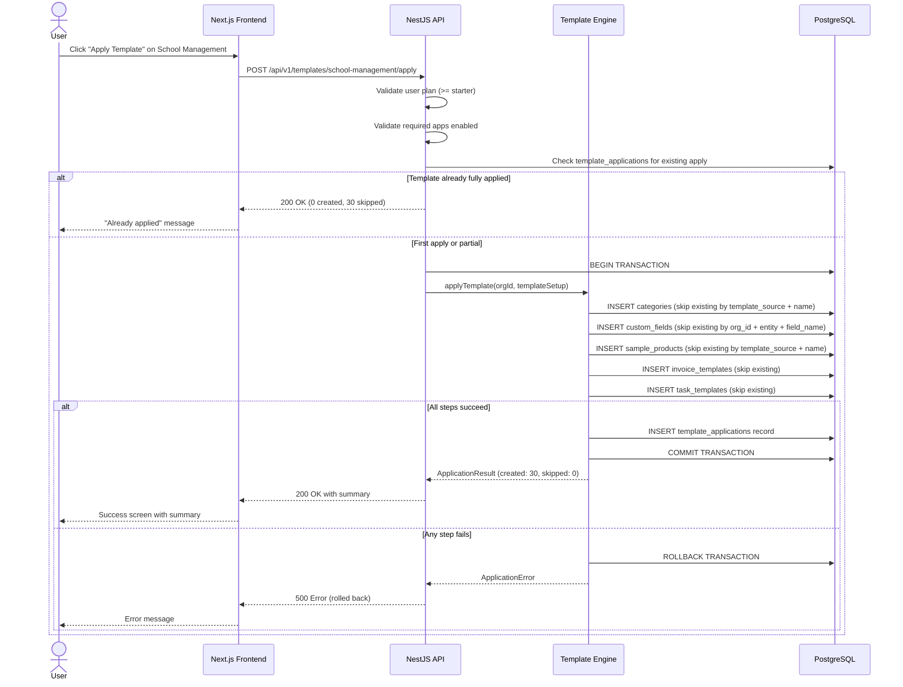
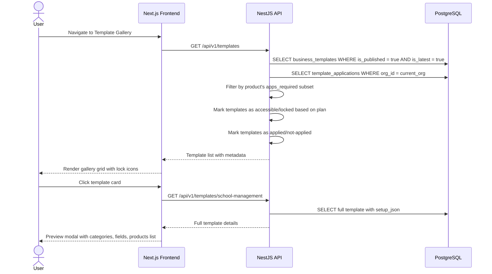
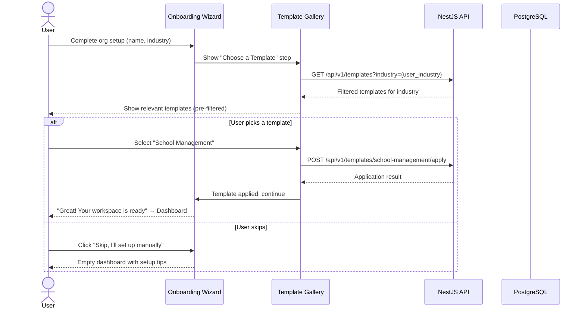
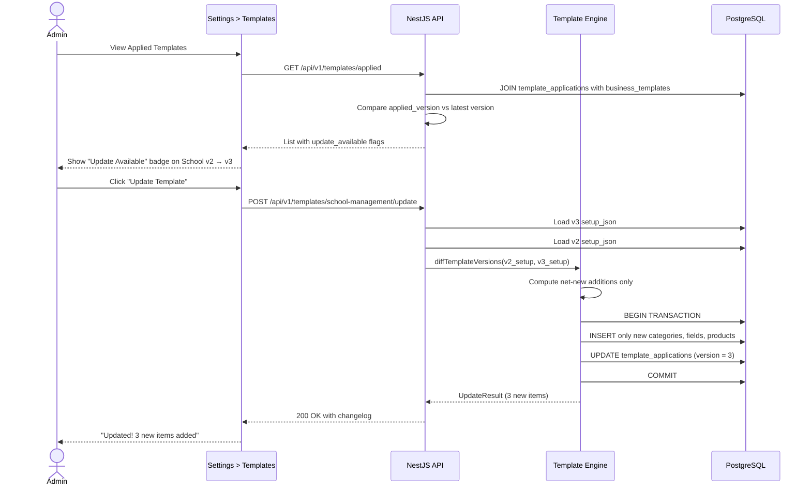

# Template Gallery — Pre-Built Business Configurations

> **Purpose**: Let new users pick a pre-configured business setup (School, Gym, Clinic, Restaurant, etc.) instead of starting from scratch. One click creates categories, custom fields, sample products, invoice templates, task templates, and dashboard widgets — giving them a fully configured workspace in seconds.
>
> **Context**: Uzhavu is a multi-tenant SaaS monorepo (Turborepo + pnpm) with NestJS API, Next.js frontend, FastAPI AI engine, and PostgreSQL. All data is scoped by `orgId`. Templates integrate with the product factory system — each product config can define which templates are available to its users.
>
> **Architecture ref**: `APP_ARCHITECTURE.md` for app manifests, `product-factory-implementation.md` for product/domain system

---

## Table of Contents

1. [Requirements](#requirements)
2. [Design](#design)
3. [Tasks](#tasks)

---

# Requirements

## Story 1: Browse Template Catalog

As a **new user completing onboarding**, I want to **browse a gallery of pre-built business templates** so that **I can quickly find one that matches my industry and skip manual setup**.

### Acceptance Criteria

- GIVEN a user has just created an organization WHEN they reach the onboarding "Choose a Template" step THEN they see a grid of template cards showing name, icon, description, and industry tag
- GIVEN the template gallery is displayed WHEN a user's subscription plan is "free" THEN only the templates gated for the free plan are clickable; other templates show a lock icon with an "Upgrade" tooltip
- GIVEN the template gallery is displayed WHEN a user types in the search/filter bar THEN templates are filtered by name, description, or industry in real-time (client-side)
- GIVEN the current product is "invoice-simple" (domain-based product) WHEN the template gallery loads THEN only templates whose `apps_required` are a subset of the product's enabled apps are shown
- GIVEN no templates match the filter criteria WHEN the gallery renders THEN an empty state is shown with "No templates match your search" and a "Browse All" reset link
- GIVEN the template gallery is displayed WHEN the user selects an industry filter chip (e.g., "Education", "Health") THEN only templates tagged with that industry are shown

---

## Story 2: Preview Template Details

As a **user evaluating a template**, I want to **preview what a template includes before applying it** so that **I can make an informed decision about whether it fits my business**.

### Acceptance Criteria

- GIVEN a user clicks on a template card WHEN the preview modal/drawer opens THEN it shows: template name, full description, list of apps required, categories that will be created, custom fields that will be added, sample products, dashboard widgets, and preview screenshots (if available)
- GIVEN a template requires apps the user's plan doesn't include WHEN the preview is displayed THEN a banner shows "This template requires [App X, App Y] — upgrade to [Plan] to use it" with an upgrade CTA
- GIVEN a template has been previously applied to this org WHEN the preview opens THEN a badge shows "Already Applied" with the date, and the apply button says "Re-apply" with a warning about idempotent behavior
- GIVEN the template preview is open WHEN the user scrolls through the "What's Included" section THEN each category is collapsible and shows itemized details (field names, types, sample values)

---

## Story 3: One-Click Template Application

As a **user who has chosen a template**, I want to **apply it with one click** so that **my workspace is instantly configured with relevant categories, fields, products, and workflows**.

### Acceptance Criteria

- GIVEN a user clicks "Apply Template" WHEN the application process starts THEN a progress indicator shows each step: "Creating categories…", "Adding custom fields…", "Seeding sample data…", "Configuring dashboard…"
- GIVEN the template application is in progress WHEN all setup steps complete successfully THEN the user sees a success screen with "Template applied! Here's what was created:" summary and a "Go to Dashboard" button
- GIVEN a template defines categories `["Students", "Teachers", "Parents"]` WHEN the template is applied THEN those categories are created under the org with `template_source = template_id`
- GIVEN a template defines custom fields for entity "contact" WHEN the template is applied THEN those fields are added to the org's custom field definitions with correct types, options, and display order
- GIVEN the template application fails midway (e.g., database error) WHEN the error occurs THEN all changes from that application are rolled back (transaction), an error message is shown, and the failure is logged
- GIVEN a template has already been applied to this org WHEN the user applies it again THEN existing resources with matching `template_source` are skipped (not duplicated), only missing resources are created, and the user sees "X items created, Y items already existed"
- GIVEN a template requires the "invoicing" app WHEN the org's plan doesn't include "invoicing" THEN the apply button is disabled with tooltip "Upgrade to [plan] to use this template"

---

## Story 4: Customize After Applying

As a **user who has applied a template**, I want to **freely modify all template-created resources** so that **I can tailor the setup to my exact needs**.

### Acceptance Criteria

- GIVEN a template has been applied WHEN the user navigates to categories/products/custom fields THEN all template-created resources appear alongside any manually created ones, with a subtle "From template: School Management" badge
- GIVEN a user edits a template-created category name WHEN they save THEN the change persists and the resource retains its `template_source` metadata for reference only (not locked)
- GIVEN a user deletes a template-created custom field WHEN they confirm deletion THEN the field is removed normally — template origin does not prevent deletion
- GIVEN a user wants to revert to the template's original setup WHEN they click "Re-apply Template" from the template management page THEN only missing items are re-created; modified items are NOT overwritten (preserving user customizations)

---

## Story 5: Template Management in Settings

As an **org admin**, I want to **see which templates have been applied to my organization** so that **I can manage, re-apply, or discover new templates**.

### Acceptance Criteria

- GIVEN an org admin navigates to Settings → Templates WHEN the page loads THEN they see two sections: "Applied Templates" (with apply date, applied by) and "Available Templates" (browse gallery)
- GIVEN the admin views applied templates WHEN they click on an applied template THEN they see what was created from it: count of categories, custom fields, sample products, with links to each
- GIVEN a new version of an applied template exists WHEN the admin views the applied template details THEN a notification shows "Version X available" with a changelog and "Update" button
- GIVEN the admin clicks "Update Template" WHEN the update runs THEN only net-new additions from the new version are applied; existing customizations are preserved

---

## Story 6: Plan-Gated Access

As the **platform operator**, I want to **gate template access by subscription plan** so that **templates serve as an incentive to upgrade**.

### Acceptance Criteria

- GIVEN a user is on the "free" plan WHEN they browse templates THEN they can access only: Retail Shop, Freelancer, General Business (3 basic templates)
- GIVEN a user is on the "starter" plan WHEN they browse templates THEN they can access all published templates
- GIVEN a user is on the "pro" plan WHEN they browse templates THEN they can access all templates PLUS the Custom Field Builder (create their own fields from scratch)
- GIVEN a user is on the "enterprise" plan WHEN they browse templates THEN they can access all templates PLUS community templates PLUS the ability to publish their own setup as a template
- GIVEN a user's plan changes from "starter" to "free" (downgrade) WHEN they view templates THEN previously applied templates remain functional (no data removed), but they cannot apply new plan-restricted templates

---

## Story 7: Template Versioning

As a **platform developer maintaining templates**, I want **templates to be versioned** so that **I can release improvements without breaking existing users' setups**.

### Acceptance Criteria

- GIVEN a template "school-management" is at version 3 WHEN version 4 is published THEN orgs that applied version 3 are NOT affected — their data stays unchanged
- GIVEN version 4 of a template adds new custom fields WHEN an admin opts in to update THEN only the new fields are added; existing fields are not modified or deleted
- GIVEN version 4 removes a category that version 3 had WHEN an admin updates THEN the category is NOT removed from their org (deletions are never applied automatically)
- GIVEN a template version is published WHEN an API call creates it THEN the previous version's `is_latest` flag is set to false and the new version gets `is_latest = true`

---

## Story 8: Community Templates (Future — Enterprise Only)

As an **enterprise user**, I want to **publish my customized business setup as a template** so that **other organizations can benefit from my configuration**.

### Acceptance Criteria

- GIVEN an enterprise user navigates to Settings → Templates → Publish WHEN they click "Publish My Setup" THEN a wizard collects: template name, description, industry, icon, and which resources to include
- GIVEN a user publishes a community template WHEN it's submitted THEN it enters a "pending review" state and is not visible to others until approved by a platform admin
- GIVEN a community template is approved WHEN other enterprise users browse the gallery THEN they see it in a "Community" section with the publisher's org name and a rating
- GIVEN a user applies a community template WHEN the template is applied THEN it follows the same idempotent application logic as built-in templates

---

# Design

## Architecture Overview

```
┌─────────────────────────────────────────────────────────────────────┐
│                        TEMPLATE GALLERY SYSTEM                       │
│                                                                       │
│  ┌──────────────┐   ┌─────────────────┐   ┌──────────────────────┐   │
│  │  Next.js UI   │   │   NestJS API     │   │   PostgreSQL DB      │   │
│  │              │   │                 │   │                      │   │
│  │  Gallery Page │──▶│  /templates     │──▶│  business_templates  │   │
│  │  Preview Modal│   │  /templates/:id │   │  template_applies    │   │
│  │  Settings Page│   │  /templates/    │   │  custom_fields       │   │
│  │  Onboarding  │   │    apply        │   │  (+ existing tables) │   │
│  └──────────────┘   └─────────────────┘   └──────────────────────┘   │
│         │                    │                                        │
│         │            ┌──────┴───────┐                                │
│         │            │ Template      │                                │
│         └───────────▶│ Engine        │                                │
│                      │ (Applies JSON │                                │
│                      │  definitions  │                                │
│                      │  to org data) │                                │
│                      └──────────────┘                                │
└─────────────────────────────────────────────────────────────────────┘
```

### Key Design Decisions

1. **Templates as JSON in DB** — Not filesystem JSON files. Stored in `business_templates.setup_json` as JSONB for queryability and versioning without deployments.
2. **Idempotent Application** — Each created resource stores `template_source = <template_id>`. On re-apply, existing resources with matching source are skipped.
3. **Transactional** — Template application wraps all DB writes in a single transaction. Failure → full rollback.
4. **Product Factory Integration** — Templates filter by `apps_required` vs the current product's `apps` list. A GymTrack product won't show Restaurant templates if it doesn't include the required apps.
5. **No Cascade on Delete** — If a template is unpublished or removed, applied resources stay in the org. The `template_source` is metadata only.

---

## Data Models

### SQL Schema

```sql
-- ============================================================
-- Template Definitions (platform-managed, not per-org)
-- ============================================================
CREATE TABLE business_templates (
  id              TEXT PRIMARY KEY,                -- e.g., 'school-management'
  name            TEXT NOT NULL,                   -- 'School Management'
  description     TEXT NOT NULL,
  long_description TEXT,                           -- Markdown, shown in preview
  icon            TEXT NOT NULL DEFAULT 'box',     -- Lucide icon name
  industry        TEXT NOT NULL,                   -- 'education', 'health', 'food', etc.
  industry_label  TEXT NOT NULL,                   -- 'Education', 'Health & Fitness', etc.
  apps_required   TEXT[] NOT NULL DEFAULT '{}',    -- Which app IDs must be enabled
  plan_tier       TEXT NOT NULL DEFAULT 'starter', -- Minimum plan: 'free', 'starter', 'pro', 'enterprise'
  setup_json      JSONB NOT NULL,                  -- The full template definition (see schema below)
  preview_images  TEXT[] DEFAULT '{}',             -- URLs to screenshot images
  version         INT NOT NULL DEFAULT 1,
  is_latest       BOOLEAN NOT NULL DEFAULT true,
  is_published    BOOLEAN NOT NULL DEFAULT false,
  is_community    BOOLEAN NOT NULL DEFAULT false,  -- true = user-submitted template
  publisher_org_id TEXT,                           -- Set if is_community = true
  tags            TEXT[] DEFAULT '{}',             -- Searchable tags
  created_at      TIMESTAMPTZ NOT NULL DEFAULT NOW(),
  updated_at      TIMESTAMPTZ NOT NULL DEFAULT NOW()
);

CREATE INDEX idx_bt_industry ON business_templates(industry);
CREATE INDEX idx_bt_plan_tier ON business_templates(plan_tier);
CREATE INDEX idx_bt_published ON business_templates(is_published, is_latest);
CREATE INDEX idx_bt_tags ON business_templates USING GIN(tags);

-- ============================================================
-- Template Application Log (per-org tracking)
-- ============================================================
CREATE TABLE template_applications (
  id              TEXT PRIMARY KEY DEFAULT gen_random_uuid()::text,
  org_id          TEXT NOT NULL,
  template_id     TEXT NOT NULL REFERENCES business_templates(id),
  template_version INT NOT NULL,                   -- Snapshot of version at apply time
  applied_by      TEXT NOT NULL,                   -- User ID who applied it
  status          TEXT NOT NULL DEFAULT 'completed', -- 'in_progress', 'completed', 'failed', 'rolled_back'
  items_created   INT NOT NULL DEFAULT 0,          -- Count of resources created
  items_skipped   INT NOT NULL DEFAULT 0,          -- Count of existing resources skipped
  error_message   TEXT,                            -- Set if status = 'failed'
  applied_at      TIMESTAMPTZ NOT NULL DEFAULT NOW()
);

CREATE INDEX idx_ta_org ON template_applications(org_id);
CREATE INDEX idx_ta_org_template ON template_applications(org_id, template_id);

-- ============================================================
-- Custom Fields (org-scoped, extensible entity fields)
-- ============================================================
CREATE TABLE custom_fields (
  id              TEXT PRIMARY KEY DEFAULT gen_random_uuid()::text,
  org_id          TEXT NOT NULL,
  entity          TEXT NOT NULL,                   -- 'contact', 'product', 'invoice', 'task'
  field_name      TEXT NOT NULL,                   -- 'roll_number', 'blood_group', etc.
  field_label     TEXT NOT NULL,                   -- 'Roll Number', 'Blood Group' (display)
  field_type      TEXT NOT NULL,                   -- 'text', 'number', 'select', 'multiselect', 'date', 'boolean', 'textarea', 'email', 'phone', 'url'
  field_options   JSONB DEFAULT '{}',              -- For select: {"choices": ["A+","B+",...]}, for number: {"min":0,"max":999}
  placeholder     TEXT,                            -- Input placeholder text
  is_required     BOOLEAN NOT NULL DEFAULT false,
  display_order   INT NOT NULL DEFAULT 0,
  display_section TEXT DEFAULT 'general',          -- UI section grouping: 'general', 'medical', 'academic', etc.
  template_source TEXT,                            -- FK to business_templates.id (NULL if user-created)
  is_active       BOOLEAN NOT NULL DEFAULT true,
  created_at      TIMESTAMPTZ NOT NULL DEFAULT NOW(),
  updated_at      TIMESTAMPTZ NOT NULL DEFAULT NOW(),

  CONSTRAINT uq_custom_field_per_org UNIQUE (org_id, entity, field_name)
);

CREATE INDEX idx_cf_org_entity ON custom_fields(org_id, entity);
CREATE INDEX idx_cf_template ON custom_fields(template_source);

-- ============================================================
-- Custom Field Values (EAV pattern for storing actual values)
-- ============================================================
CREATE TABLE custom_field_values (
  id              TEXT PRIMARY KEY DEFAULT gen_random_uuid()::text,
  org_id          TEXT NOT NULL,
  field_id        TEXT NOT NULL REFERENCES custom_fields(id) ON DELETE CASCADE,
  entity_id       TEXT NOT NULL,                   -- The ID of the contact/product/invoice/task
  value_text      TEXT,                            -- Stores the actual value as text (parsed by field_type)
  value_json      JSONB,                           -- For complex values (multiselect, etc.)
  created_at      TIMESTAMPTZ NOT NULL DEFAULT NOW(),
  updated_at      TIMESTAMPTZ NOT NULL DEFAULT NOW(),

  CONSTRAINT uq_field_value_per_entity UNIQUE (org_id, field_id, entity_id)
);

CREATE INDEX idx_cfv_entity ON custom_field_values(org_id, entity_id);
CREATE INDEX idx_cfv_field ON custom_field_values(field_id);
```

### Template Setup JSON Schema

```typescript
interface TemplateSetup {
  /** Categories to create (in inventory/contacts) */
  categories: TemplateCategoryDef[];

  /** Custom fields to add to entities */
  custom_fields: TemplateCustomFieldDef[];

  /** Sample products/services to seed */
  sample_products: TemplateSampleProductDef[];

  /** Invoice template configurations */
  invoice_templates: TemplateInvoiceTemplateDef[];

  /** Task/workflow templates */
  task_templates: TemplateTaskTemplateDef[];

  /** Dashboard widget IDs to enable */
  dashboard_widgets: string[];

  /** Suggested app sidebar order */
  sidebar_order?: string[];
}

interface TemplateCategoryDef {
  name: string;
  type: 'contact' | 'product' | 'expense';
  icon?: string;
  color?: string;
  children?: TemplateCategoryDef[];  // Nested sub-categories
}

interface TemplateCustomFieldDef {
  entity: 'contact' | 'product' | 'invoice' | 'task';
  field_name: string;         // snake_case, unique per entity
  field_label: string;        // Human-readable
  field_type: 'text' | 'number' | 'select' | 'multiselect' | 'date' | 'boolean' | 'textarea' | 'email' | 'phone' | 'url';
  field_options?: Record<string, any>;
  placeholder?: string;
  is_required?: boolean;
  display_order: number;
  display_section?: string;
}

interface TemplateSampleProductDef {
  name: string;
  price: number;              // In smallest currency unit (paise for INR)
  category?: string;          // References a category name from categories[]
  unit?: string;              // 'per_month', 'per_session', 'per_kg', etc.
  hsn_code?: string;          // GST HSN/SAC code
  tax_rate?: number;          // GST rate percentage
  description?: string;
}

interface TemplateInvoiceTemplateDef {
  name: string;
  layout: 'standard' | 'compact' | 'detailed';
  default_notes?: string;
  default_terms?: string;
  auto_fields?: string[];     // Custom fields to include on invoices
}

interface TemplateTaskTemplateDef {
  name: string;
  description?: string;
  priority: 'low' | 'medium' | 'high';
  default_assignee_role?: string;
  recurring?: {
    frequency: 'daily' | 'weekly' | 'monthly';
    day_of_week?: number;
    day_of_month?: number;
  };
  checklist?: string[];
}
```

---

## Template Definitions (5 Built-In Templates)

### Template 1: School Management

```json
{
  "id": "school-management",
  "name": "School Management",
  "description": "Complete school management with students, fees, attendance tracking, and parent communication.",
  "long_description": "Set up your school's digital workspace with pre-configured student categories, fee structures, and academic tracking fields. Includes sample fee products, attendance task templates, and a school-focused dashboard.",
  "icon": "graduation-cap",
  "industry": "education",
  "industry_label": "Education",
  "apps_required": ["inventory", "invoicing", "tasks"],
  "plan_tier": "starter",
  "tags": ["school", "education", "students", "fees", "attendance"],
  "setup_json": {
    "categories": [
      { "name": "Students", "type": "contact", "icon": "user", "children": [
        { "name": "Class 1-5 (Primary)", "type": "contact" },
        { "name": "Class 6-8 (Middle)", "type": "contact" },
        { "name": "Class 9-10 (Secondary)", "type": "contact" },
        { "name": "Class 11-12 (Senior Secondary)", "type": "contact" }
      ]},
      { "name": "Teachers", "type": "contact", "icon": "briefcase" },
      { "name": "Parents", "type": "contact", "icon": "users" },
      { "name": "Vendors", "type": "contact", "icon": "truck" },
      { "name": "Books & Stationery", "type": "product", "icon": "book" },
      { "name": "Uniforms", "type": "product", "icon": "shirt" },
      { "name": "Lab Equipment", "type": "product", "icon": "flask-conical" },
      { "name": "School Supplies", "type": "expense", "icon": "package" },
      { "name": "Maintenance", "type": "expense", "icon": "wrench" }
    ],
    "custom_fields": [
      { "entity": "contact", "field_name": "roll_number", "field_label": "Roll Number", "field_type": "text", "placeholder": "e.g., 2024-001", "display_order": 1, "display_section": "academic" },
      { "entity": "contact", "field_name": "class_section", "field_label": "Class & Section", "field_type": "select", "field_options": { "choices": ["1-A","1-B","2-A","2-B","3-A","3-B","4-A","4-B","5-A","5-B","6-A","6-B","7-A","7-B","8-A","8-B","9-A","9-B","10-A","10-B","11-Sci","11-Com","12-Sci","12-Com"] }, "display_order": 2, "display_section": "academic" },
      { "entity": "contact", "field_name": "admission_date", "field_label": "Admission Date", "field_type": "date", "display_order": 3, "display_section": "academic" },
      { "entity": "contact", "field_name": "parent_name", "field_label": "Parent/Guardian Name", "field_type": "text", "is_required": true, "display_order": 4, "display_section": "family" },
      { "entity": "contact", "field_name": "parent_phone", "field_label": "Parent Phone", "field_type": "phone", "is_required": true, "display_order": 5, "display_section": "family" },
      { "entity": "contact", "field_name": "parent_email", "field_label": "Parent Email", "field_type": "email", "display_order": 6, "display_section": "family" },
      { "entity": "contact", "field_name": "blood_group", "field_label": "Blood Group", "field_type": "select", "field_options": { "choices": ["A+","A-","B+","B-","AB+","AB-","O+","O-"] }, "display_order": 7, "display_section": "medical" },
      { "entity": "contact", "field_name": "medical_conditions", "field_label": "Medical Conditions", "field_type": "textarea", "placeholder": "Any allergies, conditions, medications...", "display_order": 8, "display_section": "medical" },
      { "entity": "contact", "field_name": "transport_route", "field_label": "Transport Route", "field_type": "text", "placeholder": "Bus route number or self-transport", "display_order": 9, "display_section": "general" }
    ],
    "sample_products": [
      { "name": "Tuition Fee - Primary (Class 1-5)", "price": 300000, "category": "Students", "unit": "per_month", "tax_rate": 0, "description": "Monthly tuition for primary classes" },
      { "name": "Tuition Fee - Secondary (Class 9-10)", "price": 500000, "category": "Students", "unit": "per_month", "tax_rate": 0, "description": "Monthly tuition for secondary classes" },
      { "name": "Tuition Fee - Senior Secondary (Class 11-12)", "price": 600000, "category": "Students", "unit": "per_month", "tax_rate": 0, "description": "Monthly tuition for senior secondary" },
      { "name": "Admission Fee", "price": 1500000, "category": "Students", "unit": "one_time", "tax_rate": 0 },
      { "name": "Annual Lab Fee", "price": 200000, "category": "Students", "unit": "per_year", "tax_rate": 0 },
      { "name": "Transport Fee", "price": 150000, "category": "Students", "unit": "per_month", "tax_rate": 0 },
      { "name": "Library Fee", "price": 50000, "category": "Students", "unit": "per_year", "tax_rate": 0 },
      { "name": "Exam Fee", "price": 100000, "category": "Students", "unit": "per_term", "tax_rate": 0 }
    ],
    "invoice_templates": [
      { "name": "Fee Receipt", "layout": "standard", "default_notes": "Fee paid for the current term.", "default_terms": "Fees once paid are non-refundable. Late payment attracts a penalty of ₹50/day.", "auto_fields": ["roll_number", "class_section", "parent_name"] }
    ],
    "task_templates": [
      { "name": "Daily Attendance", "description": "Mark attendance for all classes", "priority": "high", "recurring": { "frequency": "daily" }, "checklist": ["Primary classes (1-5)", "Middle classes (6-8)", "Secondary classes (9-10)", "Senior secondary (11-12)"] },
      { "name": "Monthly Fee Collection", "description": "Send fee reminders and collect pending fees", "priority": "high", "recurring": { "frequency": "monthly", "day_of_month": 1 }, "checklist": ["Generate fee invoices", "Send WhatsApp reminders", "Follow up on pending fees", "Update payment records"] },
      { "name": "PTM Preparation", "description": "Prepare for parent-teacher meeting", "priority": "medium", "recurring": { "frequency": "monthly", "day_of_month": 15 }, "checklist": ["Compile student progress reports", "Schedule meeting slots", "Send invitations to parents", "Prepare classroom setup"] }
    ],
    "dashboard_widgets": ["student_count", "fee_collection_this_month", "pending_fees", "attendance_rate", "upcoming_tasks"]
  }
}
```

### Template 2: Gym & Fitness

```json
{
  "id": "gym-fitness",
  "name": "Gym & Fitness Center",
  "description": "Membership tracking, trainer assignment, batch scheduling, and fitness progress monitoring.",
  "long_description": "Run your gym or fitness center with pre-configured membership plans, trainer management, batch timings, and member health tracking. Track payments, schedule classes, and monitor member progress.",
  "icon": "dumbbell",
  "industry": "fitness",
  "industry_label": "Health & Fitness",
  "apps_required": ["inventory", "invoicing", "tasks"],
  "plan_tier": "starter",
  "tags": ["gym", "fitness", "membership", "trainer", "health"],
  "setup_json": {
    "categories": [
      { "name": "Members", "type": "contact", "icon": "users", "children": [
        { "name": "Active Members", "type": "contact" },
        { "name": "Expired Members", "type": "contact" },
        { "name": "Trial Members", "type": "contact" }
      ]},
      { "name": "Trainers", "type": "contact", "icon": "user-check" },
      { "name": "Supplements", "type": "product", "icon": "pill" },
      { "name": "Equipment", "type": "product", "icon": "dumbbell" },
      { "name": "Rent & Utilities", "type": "expense", "icon": "building" },
      { "name": "Equipment Maintenance", "type": "expense", "icon": "wrench" }
    ],
    "custom_fields": [
      { "entity": "contact", "field_name": "membership_type", "field_label": "Membership Type", "field_type": "select", "field_options": { "choices": ["Monthly", "Quarterly", "Half-Yearly", "Annual", "Personal Training", "Group Class Only"] }, "is_required": true, "display_order": 1, "display_section": "membership" },
      { "entity": "contact", "field_name": "membership_start", "field_label": "Membership Start Date", "field_type": "date", "is_required": true, "display_order": 2, "display_section": "membership" },
      { "entity": "contact", "field_name": "membership_end", "field_label": "Membership End Date", "field_type": "date", "is_required": true, "display_order": 3, "display_section": "membership" },
      { "entity": "contact", "field_name": "assigned_trainer", "field_label": "Assigned Trainer", "field_type": "text", "display_order": 4, "display_section": "membership" },
      { "entity": "contact", "field_name": "batch_timing", "field_label": "Batch Timing", "field_type": "select", "field_options": { "choices": ["5:00 AM - 7:00 AM", "7:00 AM - 9:00 AM", "9:00 AM - 11:00 AM", "4:00 PM - 6:00 PM", "6:00 PM - 8:00 PM", "8:00 PM - 10:00 PM", "Flexible"] }, "display_order": 5, "display_section": "membership" },
      { "entity": "contact", "field_name": "fitness_goal", "field_label": "Fitness Goal", "field_type": "select", "field_options": { "choices": ["Weight Loss", "Muscle Gain", "Endurance", "Flexibility", "General Fitness", "Competition Prep"] }, "display_order": 6, "display_section": "fitness" },
      { "entity": "contact", "field_name": "height_cm", "field_label": "Height (cm)", "field_type": "number", "field_options": { "min": 100, "max": 250 }, "display_order": 7, "display_section": "fitness" },
      { "entity": "contact", "field_name": "weight_kg", "field_label": "Weight (kg)", "field_type": "number", "field_options": { "min": 30, "max": 300 }, "display_order": 8, "display_section": "fitness" },
      { "entity": "contact", "field_name": "blood_group", "field_label": "Blood Group", "field_type": "select", "field_options": { "choices": ["A+","A-","B+","B-","AB+","AB-","O+","O-"] }, "display_order": 9, "display_section": "medical" },
      { "entity": "contact", "field_name": "medical_conditions", "field_label": "Medical Conditions / Injuries", "field_type": "textarea", "placeholder": "Any conditions, injuries, or medications to be aware of", "display_order": 10, "display_section": "medical" },
      { "entity": "contact", "field_name": "emergency_contact", "field_label": "Emergency Contact", "field_type": "phone", "is_required": true, "display_order": 11, "display_section": "medical" }
    ],
    "sample_products": [
      { "name": "Monthly Membership", "price": 150000, "unit": "per_month", "tax_rate": 18, "hsn_code": "997212" },
      { "name": "Quarterly Membership", "price": 400000, "unit": "per_quarter", "tax_rate": 18, "hsn_code": "997212" },
      { "name": "Annual Membership", "price": 1200000, "unit": "per_year", "tax_rate": 18, "hsn_code": "997212" },
      { "name": "Personal Training (per session)", "price": 80000, "unit": "per_session", "tax_rate": 18, "hsn_code": "997212" },
      { "name": "Group Class Pass (10 classes)", "price": 300000, "unit": "per_pack", "tax_rate": 18, "hsn_code": "997212" },
      { "name": "Locker Rental", "price": 30000, "unit": "per_month", "tax_rate": 18 },
      { "name": "Joining Fee", "price": 200000, "unit": "one_time", "tax_rate": 18 }
    ],
    "invoice_templates": [
      { "name": "Membership Invoice", "layout": "standard", "default_notes": "Thank you for being a member!", "default_terms": "Membership fees are non-refundable. Freeze policy: max 30 days per year.", "auto_fields": ["membership_type", "batch_timing", "assigned_trainer"] }
    ],
    "task_templates": [
      { "name": "Equipment Inspection", "description": "Weekly inspection of all gym equipment for safety", "priority": "high", "recurring": { "frequency": "weekly", "day_of_week": 1 }, "checklist": ["Check all treadmills", "Inspect free weights", "Test cable machines", "Check emergency stops", "Verify first aid kit"] },
      { "name": "Membership Renewal Reminders", "description": "Send renewal reminders to members expiring this week", "priority": "medium", "recurring": { "frequency": "weekly", "day_of_week": 1 }, "checklist": ["Pull list of expiring members", "Send WhatsApp reminders", "Call members not renewed after 3 days", "Update renewal status"] },
      { "name": "Monthly Deep Cleaning", "description": "Deep cleaning of entire facility", "priority": "medium", "recurring": { "frequency": "monthly", "day_of_month": 1 }, "checklist": ["Steam clean all mats", "Sanitize locker rooms", "Deep clean shower areas", "Wipe down all equipment", "Clean mirrors and windows"] }
    ],
    "dashboard_widgets": ["active_members", "expiring_this_week", "revenue_this_month", "attendance_today", "pending_renewals"]
  }
}
```

### Template 3: Clinic / Healthcare

```json
{
  "id": "clinic-healthcare",
  "name": "Clinic & Healthcare",
  "description": "Patient management, appointment scheduling, prescription tracking, and billing for clinics and small hospitals.",
  "long_description": "Digitize your clinic operations with patient records, appointment scheduling, consultation fees, and medical history tracking. Pre-configured with essential medical fields and healthcare-specific billing.",
  "icon": "stethoscope",
  "industry": "health",
  "industry_label": "Healthcare",
  "apps_required": ["inventory", "invoicing", "tasks"],
  "plan_tier": "starter",
  "tags": ["clinic", "hospital", "healthcare", "patient", "doctor", "medical"],
  "setup_json": {
    "categories": [
      { "name": "Patients", "type": "contact", "icon": "heart-pulse", "children": [
        { "name": "Regular Patients", "type": "contact" },
        { "name": "Insurance Patients", "type": "contact" },
        { "name": "Walk-in Patients", "type": "contact" }
      ]},
      { "name": "Doctors", "type": "contact", "icon": "stethoscope" },
      { "name": "Staff", "type": "contact", "icon": "users" },
      { "name": "Medicines", "type": "product", "icon": "pill" },
      { "name": "Lab Tests", "type": "product", "icon": "flask-conical" },
      { "name": "Medical Supplies", "type": "product", "icon": "syringe" },
      { "name": "Medical Equipment", "type": "expense", "icon": "monitor" },
      { "name": "Clinic Maintenance", "type": "expense", "icon": "wrench" }
    ],
    "custom_fields": [
      { "entity": "contact", "field_name": "patient_id", "field_label": "Patient ID", "field_type": "text", "placeholder": "Auto-generated or manual", "display_order": 1, "display_section": "identity" },
      { "entity": "contact", "field_name": "date_of_birth", "field_label": "Date of Birth", "field_type": "date", "is_required": true, "display_order": 2, "display_section": "identity" },
      { "entity": "contact", "field_name": "gender", "field_label": "Gender", "field_type": "select", "field_options": { "choices": ["Male", "Female", "Other", "Prefer not to say"] }, "display_order": 3, "display_section": "identity" },
      { "entity": "contact", "field_name": "blood_group", "field_label": "Blood Group", "field_type": "select", "field_options": { "choices": ["A+","A-","B+","B-","AB+","AB-","O+","O-","Unknown"] }, "is_required": true, "display_order": 4, "display_section": "medical" },
      { "entity": "contact", "field_name": "allergies", "field_label": "Known Allergies", "field_type": "textarea", "placeholder": "Drug allergies, food allergies, environmental...", "display_order": 5, "display_section": "medical" },
      { "entity": "contact", "field_name": "chronic_conditions", "field_label": "Chronic Conditions", "field_type": "multiselect", "field_options": { "choices": ["Diabetes", "Hypertension", "Asthma", "Heart Disease", "Thyroid", "Arthritis", "None"] }, "display_order": 6, "display_section": "medical" },
      { "entity": "contact", "field_name": "current_medications", "field_label": "Current Medications", "field_type": "textarea", "placeholder": "List ongoing medications with dosage", "display_order": 7, "display_section": "medical" },
      { "entity": "contact", "field_name": "insurance_provider", "field_label": "Insurance Provider", "field_type": "text", "display_order": 8, "display_section": "insurance" },
      { "entity": "contact", "field_name": "insurance_id", "field_label": "Insurance Policy Number", "field_type": "text", "display_order": 9, "display_section": "insurance" },
      { "entity": "contact", "field_name": "insurance_validity", "field_label": "Insurance Valid Until", "field_type": "date", "display_order": 10, "display_section": "insurance" },
      { "entity": "contact", "field_name": "emergency_contact_name", "field_label": "Emergency Contact Name", "field_type": "text", "is_required": true, "display_order": 11, "display_section": "emergency" },
      { "entity": "contact", "field_name": "emergency_contact_phone", "field_label": "Emergency Contact Phone", "field_type": "phone", "is_required": true, "display_order": 12, "display_section": "emergency" }
    ],
    "sample_products": [
      { "name": "General Consultation", "price": 50000, "unit": "per_visit", "tax_rate": 0, "hsn_code": "999312", "description": "OPD consultation fee" },
      { "name": "Specialist Consultation", "price": 100000, "unit": "per_visit", "tax_rate": 0, "hsn_code": "999312" },
      { "name": "Follow-up Visit", "price": 30000, "unit": "per_visit", "tax_rate": 0, "hsn_code": "999312" },
      { "name": "Complete Blood Count (CBC)", "price": 40000, "category": "Lab Tests", "unit": "per_test", "tax_rate": 0 },
      { "name": "Blood Sugar (Fasting)", "price": 15000, "category": "Lab Tests", "unit": "per_test", "tax_rate": 0 },
      { "name": "Thyroid Profile", "price": 60000, "category": "Lab Tests", "unit": "per_test", "tax_rate": 0 },
      { "name": "X-Ray", "price": 50000, "unit": "per_test", "tax_rate": 0 },
      { "name": "ECG", "price": 30000, "unit": "per_test", "tax_rate": 0 }
    ],
    "invoice_templates": [
      { "name": "Patient Bill", "layout": "detailed", "default_notes": "Wishing you a speedy recovery.", "default_terms": "Payment due at the time of consultation. Insurance claims must be filed within 30 days.", "auto_fields": ["patient_id", "blood_group", "insurance_provider", "insurance_id"] }
    ],
    "task_templates": [
      { "name": "Daily Clinic Prep", "description": "Morning preparation for clinic operations", "priority": "high", "recurring": { "frequency": "daily" }, "checklist": ["Check today's appointments", "Verify medicine stock", "Prepare consultation rooms", "Review pending lab reports"] },
      { "name": "Weekly Inventory Check", "description": "Check and reorder medical supplies", "priority": "medium", "recurring": { "frequency": "weekly", "day_of_week": 6 }, "checklist": ["Count medicine stock", "Check expiry dates", "Order low-stock items", "Update inventory records"] },
      { "name": "Monthly Insurance Claims", "description": "Process insurance claims for the month", "priority": "high", "recurring": { "frequency": "monthly", "day_of_month": 28 }, "checklist": ["Compile insurance patient invoices", "Prepare claim documents", "Submit to providers", "Track claim status"] }
    ],
    "dashboard_widgets": ["patients_today", "appointments_this_week", "revenue_this_month", "pending_lab_reports", "low_stock_medicines"]
  }
}
```

### Template 4: Restaurant & Food Service

```json
{
  "id": "restaurant-food",
  "name": "Restaurant & Food Service",
  "description": "Menu management, table billing, order tracking, and inventory for restaurants, cafes, and cloud kitchens.",
  "long_description": "Set up your restaurant with pre-configured menu categories, table management, ingredient tracking, and food-specific billing. Includes GST-compliant invoicing with food allergen tracking.",
  "icon": "utensils",
  "industry": "food",
  "industry_label": "Food & Beverage",
  "apps_required": ["inventory", "invoicing"],
  "plan_tier": "starter",
  "tags": ["restaurant", "cafe", "food", "kitchen", "menu", "catering"],
  "setup_json": {
    "categories": [
      { "name": "Regular Customers", "type": "contact", "icon": "user" },
      { "name": "Corporate Clients", "type": "contact", "icon": "building" },
      { "name": "Catering Clients", "type": "contact", "icon": "truck" },
      { "name": "Starters", "type": "product", "icon": "salad" },
      { "name": "Main Course", "type": "product", "icon": "beef", "children": [
        { "name": "Vegetarian", "type": "product" },
        { "name": "Non-Vegetarian", "type": "product" },
        { "name": "Vegan", "type": "product" }
      ]},
      { "name": "Breads & Rice", "type": "product", "icon": "wheat" },
      { "name": "Beverages", "type": "product", "icon": "cup-soda", "children": [
        { "name": "Hot Beverages", "type": "product" },
        { "name": "Cold Beverages", "type": "product" },
        { "name": "Fresh Juices", "type": "product" }
      ]},
      { "name": "Desserts", "type": "product", "icon": "cake" },
      { "name": "Raw Materials", "type": "expense", "icon": "carrot" },
      { "name": "Kitchen Equipment", "type": "expense", "icon": "flame" }
    ],
    "custom_fields": [
      { "entity": "product", "field_name": "food_type", "field_label": "Veg / Non-Veg", "field_type": "select", "field_options": { "choices": ["🟢 Veg", "🔴 Non-Veg", "🟡 Egg", "🟢 Vegan", "🟢 Jain"] }, "is_required": true, "display_order": 1, "display_section": "food" },
      { "entity": "product", "field_name": "spice_level", "field_label": "Spice Level", "field_type": "select", "field_options": { "choices": ["Mild", "Medium", "Spicy", "Extra Spicy"] }, "display_order": 2, "display_section": "food" },
      { "entity": "product", "field_name": "allergens", "field_label": "Allergens", "field_type": "multiselect", "field_options": { "choices": ["Gluten", "Dairy", "Nuts", "Soy", "Eggs", "Shellfish", "Fish", "Sesame", "None"] }, "display_order": 3, "display_section": "food" },
      { "entity": "product", "field_name": "prep_time_mins", "field_label": "Prep Time (minutes)", "field_type": "number", "field_options": { "min": 1, "max": 120 }, "display_order": 4, "display_section": "kitchen" },
      { "entity": "product", "field_name": "is_available", "field_label": "Currently Available", "field_type": "boolean", "display_order": 5, "display_section": "kitchen" },
      { "entity": "product", "field_name": "serves", "field_label": "Serves (persons)", "field_type": "select", "field_options": { "choices": ["1", "2", "3-4", "5-6", "8-10"] }, "display_order": 6, "display_section": "food" },
      { "entity": "invoice", "field_name": "table_number", "field_label": "Table Number", "field_type": "text", "display_order": 1, "display_section": "order" },
      { "entity": "invoice", "field_name": "order_type", "field_label": "Order Type", "field_type": "select", "field_options": { "choices": ["Dine-in", "Takeaway", "Delivery", "Catering"] }, "is_required": true, "display_order": 2, "display_section": "order" },
      { "entity": "invoice", "field_name": "waiter_name", "field_label": "Served By", "field_type": "text", "display_order": 3, "display_section": "order" }
    ],
    "sample_products": [
      { "name": "Paneer Tikka", "price": 28000, "category": "Starters", "tax_rate": 5, "hsn_code": "996331", "description": "Marinated cottage cheese, grilled in tandoor" },
      { "name": "Chicken Tikka", "price": 32000, "category": "Starters", "tax_rate": 5, "hsn_code": "996331" },
      { "name": "Dal Makhani", "price": 24000, "category": "Vegetarian", "tax_rate": 5, "hsn_code": "996331" },
      { "name": "Butter Chicken", "price": 30000, "category": "Non-Vegetarian", "tax_rate": 5, "hsn_code": "996331" },
      { "name": "Naan", "price": 5000, "category": "Breads & Rice", "tax_rate": 5, "hsn_code": "996331" },
      { "name": "Biryani (Veg)", "price": 22000, "category": "Breads & Rice", "tax_rate": 5, "hsn_code": "996331" },
      { "name": "Masala Chai", "price": 4000, "category": "Hot Beverages", "tax_rate": 5, "hsn_code": "996331" },
      { "name": "Fresh Lime Soda", "price": 6000, "category": "Cold Beverages", "tax_rate": 5, "hsn_code": "996331" },
      { "name": "Gulab Jamun", "price": 10000, "category": "Desserts", "tax_rate": 5, "hsn_code": "996331" }
    ],
    "invoice_templates": [
      { "name": "Restaurant Bill", "layout": "compact", "default_notes": "Thank you for dining with us! 🙏", "default_terms": "Prices inclusive of GST. Service charge not included.", "auto_fields": ["table_number", "order_type", "waiter_name"] }
    ],
    "task_templates": [
      { "name": "Kitchen Opening Checklist", "description": "Daily kitchen prep before opening", "priority": "high", "recurring": { "frequency": "daily" }, "checklist": ["Check gas connections", "Verify ingredient stock", "Prepare mise en place", "Clean and sanitize stations", "Set up service counter"] },
      { "name": "Weekly Inventory Count", "description": "Count all perishable and non-perishable inventory", "priority": "high", "recurring": { "frequency": "weekly", "day_of_week": 1 }, "checklist": ["Count vegetables and fruits", "Count dairy and frozen items", "Count dry goods and spices", "Count beverages", "Update stock levels", "Create purchase order for low stock"] }
    ],
    "dashboard_widgets": ["orders_today", "revenue_today", "popular_items", "low_stock_ingredients", "pending_orders"]
  }
}
```

### Template 5: Farm Management

```json
{
  "id": "farm-management",
  "name": "Farm Management",
  "description": "Crop planning, harvest tracking, input management, and farm expense tracking for agricultural operations.",
  "long_description": "Manage your farm operations digitally — from crop planning and input purchases to harvest tracking and market sales. Track land usage, seasonal activities, and farm expenses with agriculture-specific fields.",
  "icon": "tractor",
  "industry": "agriculture",
  "industry_label": "Agriculture",
  "apps_required": ["inventory", "invoicing", "tasks"],
  "plan_tier": "starter",
  "tags": ["farm", "agriculture", "crop", "harvest", "organic", "dairy"],
  "setup_json": {
    "categories": [
      { "name": "Buyers", "type": "contact", "icon": "store", "children": [
        { "name": "Wholesale Buyers", "type": "contact" },
        { "name": "Retail Buyers", "type": "contact" },
        { "name": "Mandi Agents", "type": "contact" }
      ]},
      { "name": "Suppliers", "type": "contact", "icon": "truck", "children": [
        { "name": "Seed Suppliers", "type": "contact" },
        { "name": "Fertilizer Suppliers", "type": "contact" },
        { "name": "Equipment Suppliers", "type": "contact" }
      ]},
      { "name": "Farm Workers", "type": "contact", "icon": "hard-hat" },
      { "name": "Crops & Produce", "type": "product", "icon": "wheat", "children": [
        { "name": "Grains", "type": "product" },
        { "name": "Vegetables", "type": "product" },
        { "name": "Fruits", "type": "product" },
        { "name": "Pulses", "type": "product" }
      ]},
      { "name": "Farm Inputs", "type": "product", "icon": "flask-conical", "children": [
        { "name": "Seeds", "type": "product" },
        { "name": "Fertilizers", "type": "product" },
        { "name": "Pesticides", "type": "product" }
      ]},
      { "name": "Dairy Products", "type": "product", "icon": "milk" },
      { "name": "Land & Equipment", "type": "expense", "icon": "tractor" },
      { "name": "Labour", "type": "expense", "icon": "users" },
      { "name": "Irrigation", "type": "expense", "icon": "droplets" }
    ],
    "custom_fields": [
      { "entity": "product", "field_name": "crop_type", "field_label": "Crop Type", "field_type": "select", "field_options": { "choices": ["Kharif (Monsoon)", "Rabi (Winter)", "Zaid (Summer)", "Perennial"] }, "display_order": 1, "display_section": "agriculture" },
      { "entity": "product", "field_name": "season", "field_label": "Growing Season", "field_type": "select", "field_options": { "choices": ["Jun-Oct (Kharif)", "Oct-Mar (Rabi)", "Mar-Jun (Zaid)", "Year-round"] }, "display_order": 2, "display_section": "agriculture" },
      { "entity": "product", "field_name": "land_area_acres", "field_label": "Land Area (Acres)", "field_type": "number", "field_options": { "min": 0.1, "max": 10000 }, "display_order": 3, "display_section": "agriculture" },
      { "entity": "product", "field_name": "soil_type", "field_label": "Soil Type", "field_type": "select", "field_options": { "choices": ["Alluvial", "Black (Regur)", "Red", "Laterite", "Sandy", "Clay", "Loamy", "Mixed"] }, "display_order": 4, "display_section": "agriculture" },
      { "entity": "product", "field_name": "irrigation_type", "field_label": "Irrigation Method", "field_type": "select", "field_options": { "choices": ["Drip", "Sprinkler", "Flood", "Canal", "Rainfed", "Borewell", "Mixed"] }, "display_order": 5, "display_section": "agriculture" },
      { "entity": "product", "field_name": "organic_certified", "field_label": "Organic Certified", "field_type": "boolean", "display_order": 6, "display_section": "agriculture" },
      { "entity": "product", "field_name": "expected_yield_kg", "field_label": "Expected Yield (kg/acre)", "field_type": "number", "field_options": { "min": 0 }, "display_order": 7, "display_section": "harvest" },
      { "entity": "product", "field_name": "actual_yield_kg", "field_label": "Actual Yield (kg/acre)", "field_type": "number", "field_options": { "min": 0 }, "display_order": 8, "display_section": "harvest" },
      { "entity": "product", "field_name": "harvest_date", "field_label": "Harvest Date", "field_type": "date", "display_order": 9, "display_section": "harvest" },
      { "entity": "product", "field_name": "msp_price", "field_label": "MSP (₹/quintal)", "field_type": "number", "field_options": { "min": 0 }, "placeholder": "Minimum Support Price", "display_order": 10, "display_section": "pricing" },
      { "entity": "contact", "field_name": "land_holding_acres", "field_label": "Total Land Holding (Acres)", "field_type": "number", "display_order": 1, "display_section": "farm" },
      { "entity": "contact", "field_name": "village_taluk", "field_label": "Village / Taluk", "field_type": "text", "display_order": 2, "display_section": "farm" }
    ],
    "sample_products": [
      { "name": "Paddy (Rice)", "price": 220000, "category": "Grains", "unit": "per_quintal", "tax_rate": 0, "description": "Paddy rice, Kharif crop" },
      { "name": "Wheat", "price": 215000, "category": "Grains", "unit": "per_quintal", "tax_rate": 0 },
      { "name": "Tomato", "price": 3000, "category": "Vegetables", "unit": "per_kg", "tax_rate": 0 },
      { "name": "Onion", "price": 2500, "category": "Vegetables", "unit": "per_kg", "tax_rate": 0 },
      { "name": "Mango (Alphonso)", "price": 15000, "category": "Fruits", "unit": "per_kg", "tax_rate": 0 },
      { "name": "Urea Fertilizer (50kg bag)", "price": 27000, "category": "Fertilizers", "unit": "per_bag", "tax_rate": 5 },
      { "name": "DAP Fertilizer (50kg bag)", "price": 135000, "category": "Fertilizers", "unit": "per_bag", "tax_rate": 5 },
      { "name": "Hybrid Paddy Seeds (10kg)", "price": 60000, "category": "Seeds", "unit": "per_pack", "tax_rate": 0 },
      { "name": "Cow Milk", "price": 5000, "category": "Dairy Products", "unit": "per_litre", "tax_rate": 0 }
    ],
    "invoice_templates": [
      { "name": "Farm Sale Bill", "layout": "standard", "default_notes": "Fresh farm produce. Quality guaranteed.", "default_terms": "Payment on delivery. Returns within 24 hours for quality issues.", "auto_fields": ["crop_type", "organic_certified", "harvest_date"] }
    ],
    "task_templates": [
      { "name": "Daily Farm Rounds", "description": "Morning inspection of all farm areas", "priority": "high", "recurring": { "frequency": "daily" }, "checklist": ["Check irrigation systems", "Inspect crops for pests/disease", "Feed livestock", "Check fencing and boundaries", "Record weather conditions"] },
      { "name": "Weekly Spraying Schedule", "description": "Apply pesticides/fertilizers as per schedule", "priority": "high", "recurring": { "frequency": "weekly", "day_of_week": 2 }, "checklist": ["Check pest/disease report", "Prepare spray solution", "Apply to affected areas", "Record chemicals used", "Update spray log"] },
      { "name": "Monthly Expense Review", "description": "Review farm expenses and update records", "priority": "medium", "recurring": { "frequency": "monthly", "day_of_month": 30 }, "checklist": ["Compile labour costs", "Record input purchases", "Calculate fuel/power costs", "Update irrigation expenses", "Review P&L per crop"] }
    ],
    "dashboard_widgets": ["active_crops", "harvest_calendar", "input_costs_this_season", "revenue_this_season", "pending_payments"]
  }
}
```

### Additional Basic Templates (Free Tier)

#### Template 6: Retail Shop

```json
{
  "id": "retail-shop",
  "name": "Retail Shop",
  "description": "Quick setup for general retail — product categories, billing, and basic inventory management.",
  "icon": "store",
  "industry": "retail",
  "industry_label": "Retail",
  "apps_required": ["inventory", "invoicing"],
  "plan_tier": "free",
  "tags": ["retail", "shop", "store", "billing"],
  "setup_json": {
    "categories": [
      { "name": "Walk-in Customers", "type": "contact" },
      { "name": "Regular Customers", "type": "contact" },
      { "name": "General Products", "type": "product" },
      { "name": "Suppliers", "type": "contact" },
      { "name": "Purchases", "type": "expense" }
    ],
    "custom_fields": [],
    "sample_products": [
      { "name": "Sample Product 1", "price": 10000, "tax_rate": 18 },
      { "name": "Sample Product 2", "price": 25000, "tax_rate": 18 },
      { "name": "Sample Service", "price": 50000, "tax_rate": 18 }
    ],
    "invoice_templates": [
      { "name": "Sales Bill", "layout": "compact", "default_notes": "Thank you for your purchase!", "default_terms": "No returns after 7 days." }
    ],
    "task_templates": [],
    "dashboard_widgets": ["revenue_today", "products_count", "low_stock", "recent_invoices"]
  }
}
```

#### Template 7: Freelancer

```json
{
  "id": "freelancer",
  "name": "Freelancer",
  "description": "Lightweight setup for freelancers — client management, project invoicing, and task tracking.",
  "icon": "laptop",
  "industry": "services",
  "industry_label": "Professional Services",
  "apps_required": ["invoicing", "tasks"],
  "plan_tier": "free",
  "tags": ["freelancer", "consultant", "agency", "services"],
  "setup_json": {
    "categories": [
      { "name": "Clients", "type": "contact" },
      { "name": "Leads", "type": "contact" },
      { "name": "Services", "type": "product" }
    ],
    "custom_fields": [
      { "entity": "contact", "field_name": "company_name", "field_label": "Company Name", "field_type": "text", "display_order": 1 },
      { "entity": "contact", "field_name": "project_name", "field_label": "Current Project", "field_type": "text", "display_order": 2 }
    ],
    "sample_products": [
      { "name": "Web Development", "price": 5000000, "unit": "per_project", "tax_rate": 18, "hsn_code": "998314" },
      { "name": "Consulting (hourly)", "price": 200000, "unit": "per_hour", "tax_rate": 18, "hsn_code": "998311" },
      { "name": "Design Services", "price": 3000000, "unit": "per_project", "tax_rate": 18, "hsn_code": "998314" }
    ],
    "invoice_templates": [
      { "name": "Service Invoice", "layout": "standard", "default_notes": "Thank you for your business!", "default_terms": "Payment due within 15 days of invoice date. Late payments attract 1.5% monthly interest." }
    ],
    "task_templates": [
      { "name": "Weekly Client Update", "description": "Send progress update to all active clients", "priority": "medium", "recurring": { "frequency": "weekly", "day_of_week": 5 }, "checklist": ["Compile work done this week", "Update project timeline", "Send email/message to client"] }
    ],
    "dashboard_widgets": ["active_projects", "revenue_this_month", "pending_invoices", "upcoming_deadlines"]
  }
}
```

---

## Plan Gating Matrix

| Feature / Template | Free | Starter | Pro | Enterprise |
|:---|:---:|:---:|:---:|:---:|
| **Retail Shop** | ✅ | ✅ | ✅ | ✅ |
| **Freelancer** | ✅ | ✅ | ✅ | ✅ |
| **General Business** | ✅ | ✅ | ✅ | ✅ |
| **School Management** | 🔒 | ✅ | ✅ | ✅ |
| **Gym & Fitness** | 🔒 | ✅ | ✅ | ✅ |
| **Clinic & Healthcare** | 🔒 | ✅ | ✅ | ✅ |
| **Restaurant & Food** | 🔒 | ✅ | ✅ | ✅ |
| **Farm Management** | 🔒 | ✅ | ✅ | ✅ |
| **Custom Field Builder** | 🔒 | 🔒 | ✅ | ✅ |
| **Browse Community Templates** | 🔒 | 🔒 | 🔒 | ✅ |
| **Publish Own Template** | 🔒 | 🔒 | 🔒 | ✅ |
| **Max Templates Applied** | 1 | 3 | Unlimited | Unlimited |

---

## API Contracts

### Base Path: `/api/v1/templates`

---

### GET `/api/v1/templates`

**List available templates for the current user's plan and product.**

**Headers:**
```
Authorization: Bearer <token>
x-product-id: uzhavu  (set by middleware)
```

**Query Parameters:**
| Param | Type | Required | Description |
|:------|:-----|:---------|:------------|
| `industry` | string | No | Filter by industry slug |
| `search` | string | No | Search name/description/tags |
| `plan_tier` | string | No | Filter by plan tier (admin only) |
| `include_locked` | boolean | No | Include plan-locked templates (default: true) |

**Response: `200 OK`**
```json
{
  "data": [
    {
      "id": "school-management",
      "name": "School Management",
      "description": "Complete school management with students, fees, attendance",
      "icon": "graduation-cap",
      "industry": "education",
      "industry_label": "Education",
      "plan_tier": "starter",
      "version": 3,
      "tags": ["school", "education", "students"],
      "preview_images": ["/templates/school/preview-1.png"],
      "apps_required": ["inventory", "invoicing", "tasks"],
      "is_accessible": true,
      "is_applied": false,
      "applied_at": null,
      "stats": {
        "categories_count": 9,
        "custom_fields_count": 9,
        "sample_products_count": 8
      }
    }
  ],
  "meta": {
    "total": 8,
    "industries": [
      { "slug": "education", "label": "Education", "count": 1 },
      { "slug": "fitness", "label": "Health & Fitness", "count": 1 },
      { "slug": "health", "label": "Healthcare", "count": 1 },
      { "slug": "food", "label": "Food & Beverage", "count": 1 },
      { "slug": "agriculture", "label": "Agriculture", "count": 1 },
      { "slug": "retail", "label": "Retail", "count": 1 },
      { "slug": "services", "label": "Professional Services", "count": 1 }
    ]
  }
}
```

---

### GET `/api/v1/templates/:templateId`

**Get full template details including setup preview.**

**Response: `200 OK`**
```json
{
  "data": {
    "id": "school-management",
    "name": "School Management",
    "description": "Complete school management with students, fees, attendance",
    "long_description": "Set up your school's digital workspace...",
    "icon": "graduation-cap",
    "industry": "education",
    "industry_label": "Education",
    "plan_tier": "starter",
    "version": 3,
    "apps_required": ["inventory", "invoicing", "tasks"],
    "preview_images": ["/templates/school/preview-1.png"],
    "is_accessible": true,
    "is_applied": true,
    "applied_at": "2026-07-01T10:30:00Z",
    "applied_version": 2,
    "update_available": true,
    "setup_preview": {
      "categories": [
        { "name": "Students", "type": "contact", "children_count": 4 },
        { "name": "Teachers", "type": "contact", "children_count": 0 }
      ],
      "custom_fields": [
        { "entity": "contact", "field_name": "roll_number", "field_label": "Roll Number", "field_type": "text" }
      ],
      "sample_products_count": 8,
      "task_templates_count": 3,
      "dashboard_widgets": ["student_count", "fee_collection_this_month"]
    }
  }
}
```

**Error: `403 Forbidden`**
```json
{
  "error": "PLAN_REQUIRED",
  "message": "This template requires the 'starter' plan.",
  "required_plan": "starter",
  "upgrade_url": "/settings/billing"
}
```

**Error: `404 Not Found`**
```json
{
  "error": "TEMPLATE_NOT_FOUND",
  "message": "Template 'invalid-id' not found."
}
```

---

### POST `/api/v1/templates/:templateId/apply`

**Apply a template to the current organization.**

**Request Body:**
```json
{
  "skip_sample_data": false,
  "skip_task_templates": false
}
```

**Response: `200 OK`**
```json
{
  "data": {
    "application_id": "app_abc123",
    "template_id": "school-management",
    "template_version": 3,
    "status": "completed",
    "summary": {
      "categories_created": 9,
      "categories_skipped": 0,
      "custom_fields_created": 9,
      "custom_fields_skipped": 0,
      "sample_products_created": 8,
      "sample_products_skipped": 0,
      "task_templates_created": 3,
      "task_templates_skipped": 0,
      "invoice_templates_created": 1,
      "invoice_templates_skipped": 0,
      "total_created": 30,
      "total_skipped": 0
    },
    "applied_at": "2026-07-05T12:00:00Z"
  }
}
```

**Response: `200 OK` (idempotent re-apply)**
```json
{
  "data": {
    "application_id": "app_def456",
    "template_id": "school-management",
    "template_version": 3,
    "status": "completed",
    "summary": {
      "categories_created": 0,
      "categories_skipped": 9,
      "custom_fields_created": 0,
      "custom_fields_skipped": 9,
      "sample_products_created": 0,
      "sample_products_skipped": 8,
      "task_templates_created": 0,
      "task_templates_skipped": 3,
      "invoice_templates_created": 0,
      "invoice_templates_skipped": 1,
      "total_created": 0,
      "total_skipped": 30
    },
    "applied_at": "2026-07-05T12:05:00Z",
    "message": "Template already fully applied. No new items created."
  }
}
```

**Error: `403 Forbidden`**
```json
{
  "error": "PLAN_REQUIRED",
  "message": "Your 'free' plan allows a maximum of 1 template. Upgrade to apply more.",
  "required_plan": "starter"
}
```

**Error: `409 Conflict`**
```json
{
  "error": "MISSING_APPS",
  "message": "This template requires apps not available in your plan: invoicing, tasks",
  "missing_apps": ["invoicing", "tasks"],
  "required_plan": "starter"
}
```

**Error: `500 Internal Server Error`**
```json
{
  "error": "APPLICATION_FAILED",
  "message": "Template application failed. All changes have been rolled back.",
  "details": "Database constraint violation on custom_fields"
}
```

---

### GET `/api/v1/templates/applied`

**List templates applied to the current organization.**

**Response: `200 OK`**
```json
{
  "data": [
    {
      "application_id": "app_abc123",
      "template_id": "school-management",
      "template_name": "School Management",
      "template_icon": "graduation-cap",
      "template_version_applied": 2,
      "template_version_latest": 3,
      "update_available": true,
      "applied_by": "user_xyz",
      "applied_by_name": "Rajan",
      "applied_at": "2026-07-01T10:30:00Z",
      "items_created": 30,
      "items_skipped": 0
    }
  ]
}
```

---

### POST `/api/v1/templates/:templateId/update`

**Update an applied template to the latest version (applies only new additions).**

**Response: `200 OK`**
```json
{
  "data": {
    "application_id": "app_ghi789",
    "template_id": "school-management",
    "from_version": 2,
    "to_version": 3,
    "status": "completed",
    "summary": {
      "categories_created": 1,
      "custom_fields_created": 2,
      "sample_products_created": 0,
      "total_new_items": 3
    },
    "changelog": "Version 3: Added 'Transport Route' custom field, new 'Lab Equipment' category, updated fee structures."
  }
}
```

---

### Custom Fields API

### GET `/api/v1/custom-fields`

**List custom fields for the current org.**

**Query Parameters:**
| Param | Type | Required | Description |
|:------|:-----|:---------|:------------|
| `entity` | string | No | Filter by entity type ('contact', 'product', 'invoice', 'task') |

**Response: `200 OK`**
```json
{
  "data": [
    {
      "id": "cf_abc123",
      "entity": "contact",
      "field_name": "roll_number",
      "field_label": "Roll Number",
      "field_type": "text",
      "field_options": {},
      "placeholder": "e.g., 2024-001",
      "is_required": false,
      "display_order": 1,
      "display_section": "academic",
      "template_source": "school-management",
      "is_active": true
    }
  ]
}
```

### POST `/api/v1/custom-fields`

**Create a custom field (Pro plan required for manual creation).**

**Request Body:**
```json
{
  "entity": "contact",
  "field_name": "emergency_contact",
  "field_label": "Emergency Contact",
  "field_type": "phone",
  "is_required": true,
  "display_order": 10,
  "display_section": "medical"
}
```

**Response: `201 Created`**
```json
{
  "data": {
    "id": "cf_new456",
    "entity": "contact",
    "field_name": "emergency_contact",
    "field_label": "Emergency Contact",
    "field_type": "phone",
    "is_required": true,
    "display_order": 10,
    "display_section": "medical",
    "template_source": null,
    "is_active": true,
    "created_at": "2026-07-05T12:00:00Z"
  }
}
```

### PUT `/api/v1/custom-fields/:fieldId`

**Update a custom field.**

### DELETE `/api/v1/custom-fields/:fieldId`

**Delete a custom field (also deletes all associated values).**

---

### Custom Field Values API

### GET `/api/v1/custom-fields/values/:entityId`

**Get all custom field values for a specific entity (contact, product, etc.).**

**Response: `200 OK`**
```json
{
  "data": {
    "entity_id": "contact_abc",
    "fields": {
      "roll_number": "2024-042",
      "class_section": "10-A",
      "blood_group": "B+",
      "parent_name": "Suresh Kumar",
      "parent_phone": "+919876543210"
    }
  }
}
```

### PUT `/api/v1/custom-fields/values/:entityId`

**Upsert custom field values for an entity.**

**Request Body:**
```json
{
  "fields": {
    "roll_number": "2024-042",
    "class_section": "10-A",
    "blood_group": "B+"
  }
}
```

---

## Sequence Diagrams

### Template Application Flow



### Template Browsing & Preview Flow



### Onboarding Integration Flow



### Template Version Update Flow



---

## Error Handling & Edge Cases

| Scenario | Handling |
|:---------|:---------|
| Template requires apps not in user's plan | Return `409 MISSING_APPS` with list of missing apps and required plan |
| Template requires apps not in current product | Filter out from list; if accessed directly, return `404` |
| Duplicate `field_name` for same entity+org | Skip during template apply (idempotent); return error on manual creation |
| Template apply fails midway | Full transaction rollback; log error; return `500 APPLICATION_FAILED` |
| User downgrades plan after applying template | Applied data persists (no deletion); user can't apply new restricted templates |
| Template version diff has deletions | Never auto-delete on update; only add new items |
| Concurrent template applies for same org | Use `SELECT ... FOR UPDATE` on org row to serialize; second request waits |
| Custom field with values is deleted | Cascade delete `custom_field_values` rows (FK with `ON DELETE CASCADE`) |
| Template has >50 custom fields | Enforce max 50 custom fields per entity per org; return `422` if exceeded |
| User modifies template-created resource | Allowed; `template_source` is metadata only, not a lock |
| Product config changes (apps removed) | Re-filter template list on next load; applied templates unaffected |
| Template JSON schema is invalid/corrupt | Validate `setup_json` against TypeScript schema at publish time; reject invalid |

---

## NestJS Module Structure

```
apps/api/src/modules/templates/
├── templates.module.ts          # NestJS module definition
├── templates.controller.ts      # REST endpoints
├── templates.service.ts         # Business logic
├── template-engine.service.ts   # Template application engine
├── dto/
│   ├── list-templates.dto.ts    # Query params validation
│   ├── apply-template.dto.ts    # Apply request body
│   └── create-custom-field.dto.ts
├── guards/
│   └── template-plan.guard.ts   # Plan-based access guard
├── entities/
│   ├── business-template.entity.ts
│   ├── template-application.entity.ts
│   └── custom-field.entity.ts
└── seed/
    ├── school-management.json
    ├── gym-fitness.json
    ├── clinic-healthcare.json
    ├── restaurant-food.json
    ├── farm-management.json
    ├── retail-shop.json
    └── freelancer.json
```

## Frontend Structure

```
apps/web/src/
├── app/
│   ├── (dashboard)/templates/
│   │   ├── page.tsx              # Template gallery (also in settings)
│   │   └── [templateId]/
│   │       └── page.tsx          # Template detail/preview
│   └── (onboarding)/setup/
│       └── template-step.tsx     # Template selection during onboarding
├── components/templates/
│   ├── TemplateGallery.tsx       # Main gallery grid
│   ├── TemplateGallery.module.css
│   ├── TemplateCard.tsx          # Individual template card
│   ├── TemplateCard.module.css
│   ├── TemplatePreview.tsx       # Detail preview modal/drawer
│   ├── TemplatePreview.module.css
│   ├── TemplateApplyButton.tsx   # Apply button with plan checks
│   ├── AppliedTemplatesList.tsx  # Settings view of applied templates
│   ├── IndustryFilter.tsx        # Industry chip filter bar
│   └── CustomFieldRenderer.tsx   # Renders custom fields on entity forms
├── actions/templates/
│   ├── getTemplates.ts           # Server action: list templates
│   ├── getTemplateDetail.ts      # Server action: get template detail
│   ├── applyTemplate.ts         # Server action: apply template
│   └── getAppliedTemplates.ts    # Server action: list applied
└── hooks/
    └── useCustomFields.ts        # Client hook for custom field values
```

---

# Tasks

## Phase 1: Database & Backend Core (~4 days)

- [ ] Create Prisma schema for `business_templates`, `template_applications`, `custom_fields`, `custom_field_values` tables with all columns, indexes, and constraints (~3h)
- [ ] Run Prisma migration and verify tables are created correctly (~0.5h)
- [ ] Create NestJS module structure: `templates.module.ts`, register in `AppModule` (~0.5h)
- [ ] Implement `TemplatesService.listTemplates()` — query published templates, filter by product apps, annotate with plan accessibility and applied status (~3h)
- [ ] Implement `TemplatesService.getTemplateDetail()` — return full template with setup_json preview and version comparison (~2h)
- [ ] Implement `TemplateEngineService.applyTemplate()` — transactional engine that creates categories, custom fields, sample products, invoice templates, task templates with idempotent skip logic (~6h)
- [ ] Implement `TemplateEngineService.diffVersions()` — compare two template versions and compute net-new additions only (~3h)
- [ ] Implement `TemplatePlanGuard` — validate user's plan against template's `plan_tier` and max template limits (~2h)
- [ ] Create DTOs with class-validator decorators: `ListTemplatesDto`, `ApplyTemplateDto`, `CreateCustomFieldDto` (~1.5h)
- [ ] Implement `TemplatesController` — all REST endpoints (list, detail, apply, update, applied) with guards and error handling (~3h)
- [ ] Implement `CustomFieldsService` — CRUD for custom fields + EAV value storage/retrieval (~4h)
- [ ] Implement `CustomFieldsController` — REST endpoints for custom fields and values (~2h)

## Phase 2: Template Seed Data (~1.5 days)

- [ ] Create seed JSON files for all 7 templates (School, Gym, Clinic, Restaurant, Farm, Retail, Freelancer) from spec definitions (~3h)
- [ ] Build seed script that loads JSON files into `business_templates` table with `is_published = true` (~2h)
- [ ] Validate seed data against TypeScript schema — ensure all field_types, options, and references are valid (~1.5h)
- [ ] Write integration tests for template application with each seed template — verify idempotent behavior, rollback on failure (~4h)

## Phase 3: Frontend — Gallery & Preview (~3 days)

- [ ] Create `TemplateGallery` page component with CSS Modules — responsive grid layout, search bar, industry filter chips (~4h)
- [ ] Create `TemplateCard` component — icon, name, description, industry badge, plan lock overlay, "Applied" badge (~2h)
- [ ] Create `IndustryFilter` component — horizontal scrollable chip bar with counts (~1.5h)
- [ ] Create `TemplatePreview` modal/drawer component — full detail view with collapsible sections for categories, fields, products, tasks (~4h)
- [ ] Create `TemplateApplyButton` component — plan validation, loading state, progress indicator, success/error feedback (~2h)
- [ ] Implement server actions with `withAction` wrapper: `getTemplates`, `getTemplateDetail`, `applyTemplate`, `getAppliedTemplates` (~3h)
- [ ] Create `AppliedTemplatesList` component for Settings page — show applied templates with update badges (~2h)
- [ ] Add Template Gallery link to app sidebar navigation and settings menu (~1h)

## Phase 4: Onboarding Integration (~1 day)

- [ ] Create `TemplateStepPage` component for onboarding wizard — industry-filtered gallery with "Skip" option (~3h)
- [ ] Wire onboarding flow: after org creation → template step → dashboard. Store selected template in onboarding state (~2h)
- [ ] Add "Recommended for you" logic — pre-select templates based on industry chosen during org setup (~1.5h)

## Phase 5: Custom Fields UI (~2 days)

- [ ] Create `CustomFieldRenderer` component — dynamically renders form fields based on `field_type` (text, select, multiselect, date, boolean, etc.) (~4h)
- [ ] Integrate `CustomFieldRenderer` into Contact detail page — show custom fields in sections below standard fields (~2h)
- [ ] Integrate `CustomFieldRenderer` into Product detail page (~1.5h)
- [ ] Integrate `CustomFieldRenderer` into Invoice form — show template's `auto_fields` on invoices (~2h)
- [ ] Create `useCustomFields` hook — fetch field definitions + values for an entity, handle save via server action (~2h)
- [ ] Create Custom Field Builder page (Pro plan) — form to create/edit/reorder custom fields manually (~3h)

## Phase 6: Product Factory Integration (~0.5 day)

- [ ] Add optional `available_templates` field to `ProductConfig` type — restricts which templates are shown for that product (~1h)
- [ ] Update template list filtering to check both plan tier AND product config constraints (~1h)
- [ ] Write unit tests for product × plan × template filtering matrix (~1.5h)

## Phase 7: Testing & Polish (~1.5 days)

- [ ] Write E2E tests: browse gallery → preview → apply → verify data created → re-apply → verify idempotent (~3h)
- [ ] Write E2E tests: plan gating — free user can't apply starter templates, upgrade enables them (~2h)
- [ ] Write unit tests for `TemplateEngineService` — edge cases: concurrent apply, max fields exceeded, invalid JSON (~2h)
- [ ] Manual QA: test all 7 templates end-to-end, verify custom fields render correctly on entity pages (~2h)
- [ ] Performance test: apply template with 50 categories + 50 fields in single transaction, verify <3s response time (~1h)
- [ ] Add loading skeletons for gallery grid and preview modal (~1h)

---

**Total Estimated Effort: ~13.5 days (1 developer)**

**Priority Order**: Phase 1 → Phase 2 → Phase 3 → Phase 5 → Phase 4 → Phase 6 → Phase 7

Phase 5 (Custom Fields UI) is prioritized over Phase 4 (Onboarding) because custom fields are the primary value delivered by templates — without rendering them, templates are just category/product seeders.

---

*Generated: 05 Jul 2026*
*For: uzhavu.race monorepo*
*Architecture ref: APP_ARCHITECTURE.md, product-factory-implementation.md*
