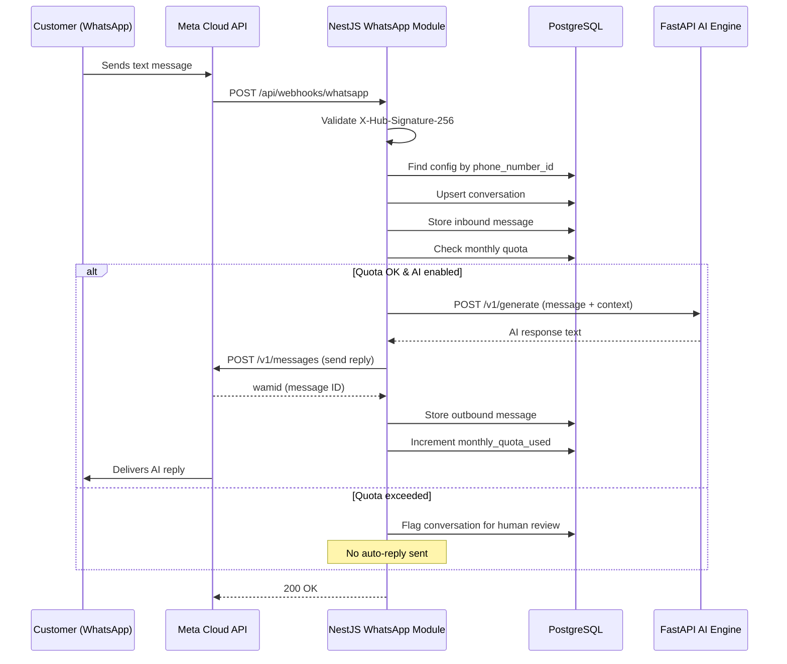
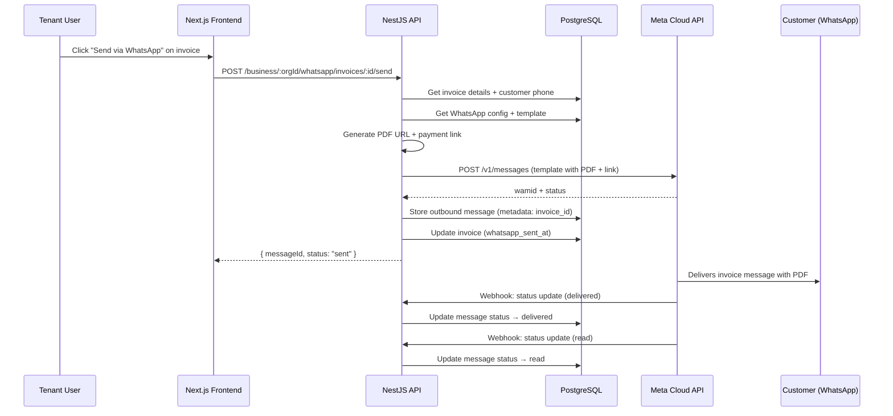
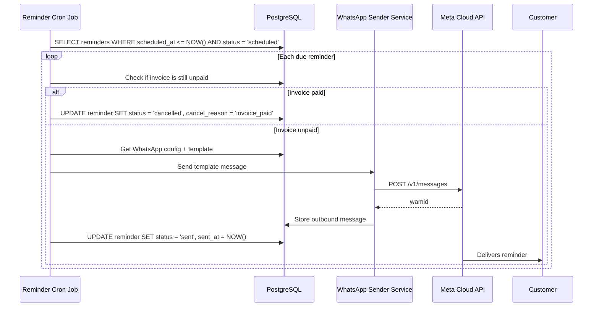

# WhatsApp Bot Integration — Feature Spec

> **Purpose**: Integrate WhatsApp Business Cloud API into the uzhavu platform so tenants can send invoices, payment reminders, order notifications, and run AI-powered customer chat — all via WhatsApp.
>
> **Architecture ref**: `APP_ARCHITECTURE.md` — follows manifest + module config pattern
>
> **AI Engine ref**: `ai-engine-improvements.md` — chat uses existing `/v1/generate` endpoint
>
> **Multi-tenant**: Every org connects their own WhatsApp Business number. All data scoped by `orgId`.

---

## Requirements

### Story 1: WhatsApp Business Account Connection

As an **org admin**, I want to connect my WhatsApp Business account to the platform so that my organization can send and receive WhatsApp messages.

#### Acceptance Criteria

- GIVEN I am an org admin on a plan that includes WhatsApp WHEN I navigate to Settings → Integrations → WhatsApp THEN I see a setup wizard to connect my WhatsApp Business account
- GIVEN I am on the WhatsApp setup wizard WHEN I enter my WhatsApp Business Account ID, Phone Number ID, and permanent access token THEN the system validates the credentials by calling the Meta Graph API and stores the encrypted config
- GIVEN the credentials are valid WHEN the system saves the config THEN it registers the webhook URL (`POST /api/webhooks/whatsapp`) with Meta and displays a success message with the connected phone number
- GIVEN I am on the free plan WHEN I try to access WhatsApp settings THEN I see an upgrade prompt explaining WhatsApp is available on Starter plan and above
- GIVEN my WhatsApp config is already connected WHEN I view the WhatsApp settings THEN I see the connected phone number, webhook status, and an option to disconnect or update credentials

---

### Story 2: AI Assistant on WhatsApp

As a **customer** of a tenant, I want to chat with the business on WhatsApp and get AI-powered responses so that I can get instant help without waiting for a human.

#### Acceptance Criteria

- GIVEN a customer sends a text message to the tenant's WhatsApp number WHEN the webhook receives the message THEN the system stores the message, forwards it to the AI engine (`POST /ai/v1/generate`), and sends the AI response back via WhatsApp
- GIVEN the AI engine returns a response WHEN the response is sent via WhatsApp THEN the customer sees the reply within 5 seconds
- GIVEN the AI engine is unavailable or returns an error WHEN a customer sends a message THEN the system sends a fallback message: "Sorry, I'm having trouble right now. A team member will get back to you shortly." and flags the conversation for human review
- GIVEN a customer sends an image, document, or voice note WHEN the webhook receives media THEN the system stores the media URL and metadata, and responds with "I received your file. Let me get a team member to help you with this."
- GIVEN the tenant has disabled AI auto-reply WHEN a customer sends a message THEN the message is stored and appears in the dashboard chat inbox without an auto-reply
- GIVEN the org has exceeded their monthly message quota WHEN a new message arrives THEN the system stores it but does not auto-reply, and notifies the admin that quota is exceeded

---

### Story 3: Invoice Sharing via WhatsApp

As a **tenant user**, I want to send invoices to customers via WhatsApp so that customers receive their invoice PDF and a payment link instantly.

#### Acceptance Criteria

- GIVEN I am viewing an invoice detail page WHEN I click "Send via WhatsApp" THEN the system shows a preview of the WhatsApp template message with the customer's phone number pre-filled
- GIVEN the invoice has a customer with a valid phone number (E.164 format) WHEN I confirm sending THEN the system sends a template message containing: invoice number, amount, due date, PDF attachment, and payment link
- GIVEN the customer's phone number is missing or invalid WHEN I click "Send via WhatsApp" THEN I see an error: "Customer phone number is missing or invalid. Please update the customer record."
- GIVEN the WhatsApp template has not been approved by Meta WHEN I try to send an invoice message THEN the system falls back to a session message (if within 24h window) or shows an error explaining the template needs approval
- GIVEN the invoice was successfully sent WHEN I view the invoice detail THEN I see a "Sent via WhatsApp" status with timestamp and delivery receipt (sent/delivered/read)

---

### Story 4: Payment Reminders

As a **tenant admin**, I want to configure automatic WhatsApp reminders for overdue invoices so that customers are reminded to pay without manual follow-up.

#### Acceptance Criteria

- GIVEN I am on the WhatsApp settings page WHEN I configure payment reminders THEN I can toggle reminders for: 1 day before due, on due date, 3 days after, 7 days after, and 14 days after
- GIVEN reminders are enabled for "1 day before due" WHEN an invoice's due date is tomorrow THEN the system sends a WhatsApp reminder to the customer at 9:00 AM in the tenant's timezone with the invoice amount and a payment link
- GIVEN a reminder is scheduled WHEN the invoice is already marked as paid THEN the reminder is cancelled and not sent
- GIVEN a reminder was sent WHEN I view the invoice detail THEN I see a timeline entry showing "Payment reminder sent via WhatsApp" with timestamp
- GIVEN the customer has received 3+ reminders for the same invoice WHEN the next reminder is due THEN the system still sends it (no cap) but includes escalation language: "This is a final reminder..."
- GIVEN a reminder fails to send (WhatsApp API error) WHEN the failure occurs THEN the system logs the error, retries once after 30 minutes, and if still failing, creates a notification for the admin

---

### Story 5: Order Status Notifications

As a **tenant user**, I want customers to receive WhatsApp notifications when their order status changes so that customers stay informed without needing to check the app.

#### Acceptance Criteria

- GIVEN an order's status changes to "confirmed" WHEN the update is saved THEN the system sends a WhatsApp message: "Your order #{orderNumber} has been confirmed! We'll notify you when it ships."
- GIVEN an order's status changes to "shipped" WHEN the update includes a tracking number THEN the WhatsApp message includes the tracking number and carrier name
- GIVEN an order's status changes to "delivered" WHEN the update is saved THEN the system sends: "Your order #{orderNumber} has been delivered! Thank you for your purchase."
- GIVEN the tenant has disabled order notifications WHEN an order status changes THEN no WhatsApp message is sent
- GIVEN the customer does not have a phone number on file WHEN an order status changes THEN no WhatsApp message is sent and no error is raised

---

### Story 6: Two-Way Chat Inbox

As a **tenant user**, I want to view and reply to customer WhatsApp messages from a chat inbox in the dashboard so that I can manage all customer conversations in one place.

#### Acceptance Criteria

- GIVEN I navigate to the WhatsApp Chat Inbox WHEN conversations exist THEN I see a list of conversations sorted by most recent message, showing: customer name/number, last message preview, timestamp, and unread count
- GIVEN I select a conversation WHEN it loads THEN I see the full message history with message status indicators (sent ✓, delivered ✓✓, read — blue ✓✓)
- GIVEN I type a reply in the chat input WHEN I press send THEN the message is sent via WhatsApp API and appears in the conversation with a "sending..." → "sent" status transition
- GIVEN the last customer message was more than 24 hours ago WHEN I try to send a free-form reply THEN the system warns: "The 24-hour window has expired. You can only send pre-approved template messages." and shows a template picker
- GIVEN a new message arrives from a customer WHEN I am viewing the inbox THEN the conversation list updates in real-time (via WebSocket or polling) and shows the new message with a notification badge
- GIVEN I search the inbox WHEN I type a customer name or phone number THEN the list filters to matching conversations

---

### Story 7: Template Message Management

As a **tenant admin**, I want to create and manage WhatsApp message templates so that I can send pre-approved messages outside the 24-hour conversation window.

#### Acceptance Criteria

- GIVEN I navigate to WhatsApp → Templates WHEN templates exist THEN I see a list with: template name, category, language, approval status (pending/approved/rejected), and last used date
- GIVEN I click "Create Template" WHEN I fill in the template form (name, category, language, header, body with {{variables}}, footer, buttons) THEN the system submits it to Meta's Template API for approval
- GIVEN a template is submitted WHEN Meta approves it THEN the status updates to "approved" and the template becomes available for sending
- GIVEN a template is approved WHEN I use it to send a message THEN the system maps invoice/order data to template variables automatically
- GIVEN a template is rejected WHEN I view it THEN I see the rejection reason from Meta and can edit and resubmit

---

## Design

### Architecture Overview

```
┌─────────────┐    ┌──────────────┐    ┌──────────────────┐
│  Next.js     │───▶│  NestJS API  │───▶│  PostgreSQL      │
│  Frontend    │    │  /whatsapp/* │    │  whatsapp_*      │
│              │    │              │    │  tables          │
└─────────────┘    └──────┬───────┘    └──────────────────┘
                          │
              ┌───────────┼───────────┐
              │           │           │
              ▼           ▼           ▼
       ┌────────────┐ ┌─────────┐ ┌─────────────┐
       │ Meta Cloud  │ │ AI      │ │ Event Bus   │
       │ API         │ │ Engine  │ │ (internal)  │
       │ (WhatsApp)  │ │ FastAPI │ │             │
       └────────────┘ └─────────┘ └─────────────┘
```

**Key flows:**
1. **Outbound** (platform → WhatsApp): NestJS → Meta Cloud API
2. **Inbound** (WhatsApp → platform): Meta Webhook → NestJS → AI Engine → Meta Cloud API
3. **Events**: Invoice/Order modules emit events → WhatsApp module listens and sends notifications

---

### Data Models

```sql
-- ============================================================
-- WhatsApp configuration per organization
-- ============================================================
CREATE TABLE whatsapp_configs (
  id                    TEXT PRIMARY KEY DEFAULT gen_random_uuid()::text,
  org_id                TEXT NOT NULL UNIQUE,
  phone_number_id       TEXT NOT NULL,         -- Meta Phone Number ID
  waba_id               TEXT NOT NULL,         -- WhatsApp Business Account ID
  access_token_encrypted TEXT NOT NULL,        -- AES-256 encrypted permanent token
  display_phone_number  TEXT NOT NULL,         -- Human-readable: +91 98765 43210
  business_name         TEXT,
  webhook_verify_token  TEXT NOT NULL,         -- Random token for webhook verification
  is_active             BOOLEAN DEFAULT true,
  ai_auto_reply         BOOLEAN DEFAULT true,  -- Toggle AI auto-responses
  reminder_config       JSONB DEFAULT '{
    "before_1d": true,
    "on_due": true,
    "after_3d": true,
    "after_7d": true,
    "after_14d": false
  }',
  reminder_time         TEXT DEFAULT '09:00',   -- Time to send reminders (HH:MM)
  timezone              TEXT DEFAULT 'Asia/Kolkata',
  order_notifications   BOOLEAN DEFAULT true,
  monthly_quota_used    INT DEFAULT 0,
  quota_reset_at        TIMESTAMPTZ,
  created_at            TIMESTAMPTZ DEFAULT NOW(),
  updated_at            TIMESTAMPTZ DEFAULT NOW()
);

CREATE INDEX idx_wa_config_org ON whatsapp_configs(org_id);

-- ============================================================
-- Message history — all inbound and outbound messages
-- ============================================================
CREATE TABLE whatsapp_messages (
  id                TEXT PRIMARY KEY DEFAULT gen_random_uuid()::text,
  org_id            TEXT NOT NULL,
  config_id         TEXT NOT NULL REFERENCES whatsapp_configs(id) ON DELETE CASCADE,
  conversation_id   TEXT NOT NULL,             -- Groups messages per customer conversation
  wamid             TEXT,                      -- WhatsApp Message ID (from Meta)
  direction         TEXT NOT NULL,             -- 'inbound' | 'outbound'
  from_number       TEXT NOT NULL,             -- Sender phone number (E.164)
  to_number         TEXT NOT NULL,             -- Recipient phone number (E.164)
  message_type      TEXT NOT NULL DEFAULT 'text', -- text|image|document|audio|video|template|interactive
  content           TEXT,                      -- Text content or caption
  media_url         TEXT,                      -- URL for media messages
  media_mime_type   TEXT,
  template_name     TEXT,                      -- If sent via template
  template_params   JSONB,                     -- Template variable values
  context_message_id TEXT,                     -- Reply-to message ID
  status            TEXT DEFAULT 'sent',       -- sent|delivered|read|failed
  error_code        TEXT,                      -- WhatsApp error code if failed
  error_message     TEXT,
  metadata          JSONB DEFAULT '{}',        -- Additional data (invoice_id, order_id, etc.)
  created_at        TIMESTAMPTZ DEFAULT NOW()
);

CREATE INDEX idx_wa_msg_org ON whatsapp_messages(org_id, created_at DESC);
CREATE INDEX idx_wa_msg_conv ON whatsapp_messages(conversation_id, created_at ASC);
CREATE INDEX idx_wa_msg_from ON whatsapp_messages(org_id, from_number);
CREATE INDEX idx_wa_msg_wamid ON whatsapp_messages(wamid) WHERE wamid IS NOT NULL;
CREATE INDEX idx_wa_msg_status ON whatsapp_messages(org_id, status) WHERE status = 'failed';

-- ============================================================
-- WhatsApp conversations (aggregated per customer)
-- ============================================================
CREATE TABLE whatsapp_conversations (
  id                TEXT PRIMARY KEY DEFAULT gen_random_uuid()::text,
  org_id            TEXT NOT NULL,
  customer_phone    TEXT NOT NULL,             -- E.164 format
  customer_name     TEXT,                      -- WhatsApp profile name
  customer_id       TEXT,                      -- Link to platform customer record
  last_message_at   TIMESTAMPTZ,
  last_message_preview TEXT,
  unread_count      INT DEFAULT 0,
  is_ai_handled     BOOLEAN DEFAULT true,      -- Whether AI is responding
  assigned_to       TEXT,                      -- User ID of assigned agent
  status            TEXT DEFAULT 'open',       -- open|closed|archived
  window_expires_at TIMESTAMPTZ,              -- 24h session window expiry
  created_at        TIMESTAMPTZ DEFAULT NOW(),
  updated_at        TIMESTAMPTZ DEFAULT NOW(),
  UNIQUE(org_id, customer_phone)
);

CREATE INDEX idx_wa_conv_org ON whatsapp_conversations(org_id, last_message_at DESC);
CREATE INDEX idx_wa_conv_status ON whatsapp_conversations(org_id, status);

-- ============================================================
-- WhatsApp message templates
-- ============================================================
CREATE TABLE whatsapp_templates (
  id                TEXT PRIMARY KEY DEFAULT gen_random_uuid()::text,
  org_id            TEXT NOT NULL,
  config_id         TEXT NOT NULL REFERENCES whatsapp_configs(id) ON DELETE CASCADE,
  meta_template_id  TEXT,                      -- Template ID from Meta
  name              TEXT NOT NULL,             -- Template name (lowercase, underscores)
  category          TEXT NOT NULL,             -- MARKETING|UTILITY|AUTHENTICATION
  language          TEXT NOT NULL DEFAULT 'en',
  header_type       TEXT,                      -- none|text|image|document|video
  header_content    TEXT,                      -- Header text or media URL
  body              TEXT NOT NULL,             -- Body text with {{1}}, {{2}} placeholders
  footer            TEXT,
  buttons           JSONB DEFAULT '[]',        -- Array of button configs
  sample_values     JSONB DEFAULT '[]',        -- Sample values for variables (required by Meta)
  approval_status   TEXT DEFAULT 'pending',    -- pending|approved|rejected
  rejection_reason  TEXT,
  use_count         INT DEFAULT 0,
  last_used_at      TIMESTAMPTZ,
  created_at        TIMESTAMPTZ DEFAULT NOW(),
  updated_at        TIMESTAMPTZ DEFAULT NOW()
);

CREATE INDEX idx_wa_tmpl_org ON whatsapp_templates(org_id);
CREATE INDEX idx_wa_tmpl_status ON whatsapp_templates(org_id, approval_status);
CREATE UNIQUE INDEX idx_wa_tmpl_name ON whatsapp_templates(org_id, name, language);

-- ============================================================
-- Payment reminder schedule tracking
-- ============================================================
CREATE TABLE whatsapp_reminders (
  id                TEXT PRIMARY KEY DEFAULT gen_random_uuid()::text,
  org_id            TEXT NOT NULL,
  invoice_id        TEXT NOT NULL,             -- FK to invoices table
  customer_phone    TEXT NOT NULL,             -- E.164 format
  reminder_type     TEXT NOT NULL,             -- before_1d|on_due|after_3d|after_7d|after_14d
  scheduled_at      TIMESTAMPTZ NOT NULL,
  sent_at           TIMESTAMPTZ,
  cancelled_at      TIMESTAMPTZ,
  cancel_reason     TEXT,                      -- 'invoice_paid' | 'manual' | 'quota_exceeded'
  message_id        TEXT REFERENCES whatsapp_messages(id),
  status            TEXT DEFAULT 'scheduled',  -- scheduled|sent|failed|cancelled
  retry_count       INT DEFAULT 0,
  error_message     TEXT,
  created_at        TIMESTAMPTZ DEFAULT NOW()
);

CREATE INDEX idx_wa_reminder_scheduled ON whatsapp_reminders(scheduled_at)
  WHERE status = 'scheduled';
CREATE INDEX idx_wa_reminder_invoice ON whatsapp_reminders(invoice_id);
CREATE INDEX idx_wa_reminder_org ON whatsapp_reminders(org_id, status);
```

---

### API Contracts

#### Module Structure

```
apps/api/src/modules/whatsapp/
├── whatsapp.module.ts
├── whatsapp.controller.ts          # Admin endpoints (auth required)
├── whatsapp.webhook.controller.ts  # Webhook endpoint (no auth, signature validation)
├── whatsapp.service.ts             # Core business logic
├── whatsapp.sender.service.ts      # Sends messages via Meta API
├── whatsapp.reminder.service.ts    # Cron-based reminder scheduling
├── whatsapp.template.service.ts    # Template CRUD + Meta API sync
├── whatsapp.listener.service.ts    # Event bus listeners (invoice, order events)
├── dto/
│   ├── create-config.dto.ts
│   ├── send-message.dto.ts
│   ├── create-template.dto.ts
│   └── update-reminder-config.dto.ts
├── interfaces/
│   └── meta-webhook.interface.ts
└── whatsapp.service.spec.ts
```

#### Webhook — Incoming Messages

```
POST /api/webhooks/whatsapp
```

Meta sends webhook events here. No auth guard — validated via HMAC signature.

**Verification (GET):**
```
GET /api/webhooks/whatsapp?hub.mode=subscribe&hub.verify_token=xxx&hub.challenge=yyy
→ Returns: hub.challenge (plain text)
```

**Incoming message payload (from Meta):**
```json
{
  "object": "whatsapp_business_account",
  "entry": [{
    "id": "WABA_ID",
    "changes": [{
      "value": {
        "messaging_product": "whatsapp",
        "metadata": {
          "display_phone_number": "+919876543210",
          "phone_number_id": "123456"
        },
        "messages": [{
          "from": "919999888877",
          "id": "wamid.xxx",
          "timestamp": "1688900000",
          "text": { "body": "Hi, what's my order status?" },
          "type": "text"
        }],
        "contacts": [{
          "profile": { "name": "Ravi Kumar" },
          "wa_id": "919999888877"
        }]
      },
      "field": "messages"
    }]
  }]
}
```

**Processing flow:**
1. Validate `X-Hub-Signature-256` header (HMAC SHA-256 of body with app secret)
2. Find `whatsapp_configs` by `phone_number_id`
3. Upsert `whatsapp_conversations` for the customer phone
4. Store inbound message in `whatsapp_messages`
5. Check quota — if exceeded, skip AI reply
6. If `ai_auto_reply` is enabled → call AI engine → send response
7. Return `200 OK` immediately (Meta requires fast response)

**Response:** `200 OK` (empty body)

---

#### Config — Connect WhatsApp Account

```
POST /business/:orgId/whatsapp/config
Authorization: Bearer <token>
```

**Request:**
```json
{
  "phoneNumberId": "123456789",
  "wabaId": "987654321",
  "accessToken": "EAAxxxxx...",
  "displayPhoneNumber": "+919876543210",
  "businessName": "Ravi's Farm Store"
}
```

**Response (201):**
```json
{
  "success": true,
  "data": {
    "id": "cfg_abc123",
    "orgId": "org_xyz",
    "phoneNumberId": "123456789",
    "displayPhoneNumber": "+919876543210",
    "businessName": "Ravi's Farm Store",
    "isActive": true,
    "aiAutoReply": true,
    "webhookRegistered": true,
    "createdAt": "2026-07-05T12:00:00Z"
  }
}
```

**Errors:**
- `400` — Invalid phone number format or missing fields
- `401` — Invalid access token (Meta API validation failed)
- `409` — WhatsApp already configured for this org

```
GET /business/:orgId/whatsapp/config
Authorization: Bearer <token>
```

**Response (200):**
```json
{
  "success": true,
  "data": {
    "id": "cfg_abc123",
    "displayPhoneNumber": "+919876543210",
    "businessName": "Ravi's Farm Store",
    "isActive": true,
    "aiAutoReply": true,
    "monthlyQuotaUsed": 47,
    "monthlyQuotaLimit": 100,
    "reminderConfig": {
      "before_1d": true,
      "on_due": true,
      "after_3d": true,
      "after_7d": true,
      "after_14d": false
    },
    "reminderTime": "09:00",
    "timezone": "Asia/Kolkata",
    "orderNotifications": true
  }
}
```

```
PATCH /business/:orgId/whatsapp/config
Authorization: Bearer <token>
```

**Request (partial update):**
```json
{
  "aiAutoReply": false,
  "reminderConfig": { "before_1d": true, "on_due": true, "after_3d": false, "after_7d": false, "after_14d": false },
  "orderNotifications": true
}
```

**Response (200):**
```json
{
  "success": true,
  "data": { "...updated config..." }
}
```

```
DELETE /business/:orgId/whatsapp/config
Authorization: Bearer <token>
```

**Response (200):**
```json
{
  "success": true,
  "message": "WhatsApp configuration removed. Webhook deregistered."
}
```

---

#### Conversations & Messages

```
GET /business/:orgId/whatsapp/conversations?status=open&page=1&limit=20
Authorization: Bearer <token>
```

**Response (200):**
```json
{
  "success": true,
  "data": [
    {
      "id": "conv_abc",
      "customerPhone": "+919999888877",
      "customerName": "Ravi Kumar",
      "lastMessageAt": "2026-07-05T11:30:00Z",
      "lastMessagePreview": "Hi, what's my order status?",
      "unreadCount": 2,
      "isAiHandled": true,
      "status": "open",
      "windowExpiresAt": "2026-07-06T11:30:00Z"
    }
  ],
  "pagination": { "page": 1, "limit": 20, "total": 45 }
}
```

```
GET /business/:orgId/whatsapp/conversations/:conversationId/messages?page=1&limit=50
Authorization: Bearer <token>
```

**Response (200):**
```json
{
  "success": true,
  "data": [
    {
      "id": "msg_001",
      "direction": "inbound",
      "fromNumber": "+919999888877",
      "messageType": "text",
      "content": "Hi, what's my order status?",
      "status": "delivered",
      "createdAt": "2026-07-05T11:30:00Z"
    },
    {
      "id": "msg_002",
      "direction": "outbound",
      "toNumber": "+919999888877",
      "messageType": "text",
      "content": "Hi Ravi! Your order #ORD-1042 is currently being packed and will ship today.",
      "status": "read",
      "createdAt": "2026-07-05T11:30:03Z"
    }
  ],
  "pagination": { "page": 1, "limit": 50, "total": 2 }
}
```

#### Send Message (Manual Reply)

```
POST /business/:orgId/whatsapp/messages/send
Authorization: Bearer <token>
```

**Request (free-form text — within 24h window):**
```json
{
  "conversationId": "conv_abc",
  "toNumber": "+919999888877",
  "type": "text",
  "content": "Your order will ship by tomorrow. Tracking number: TRK123456"
}
```

**Request (template — outside 24h window):**
```json
{
  "conversationId": "conv_abc",
  "toNumber": "+919999888877",
  "type": "template",
  "templateName": "order_update",
  "templateLanguage": "en",
  "templateParams": {
    "body": ["ORD-1042", "shipped", "TRK123456"]
  }
}
```

**Response (200):**
```json
{
  "success": true,
  "data": {
    "id": "msg_003",
    "wamid": "wamid.HBxxx...",
    "status": "sent"
  }
}
```

**Errors:**
- `400` — Invalid phone number or missing content
- `403` — 24h window expired (for non-template messages)
- `429` — Monthly message quota exceeded

---

#### Send Invoice via WhatsApp

```
POST /business/:orgId/whatsapp/invoices/:invoiceId/send
Authorization: Bearer <token>
```

**Request:**
```json
{
  "phoneNumber": "+919999888877",
  "includePaymentLink": true
}
```

**Response (200):**
```json
{
  "success": true,
  "data": {
    "messageId": "msg_inv_001",
    "wamid": "wamid.HBxxx...",
    "templateUsed": "invoice_share",
    "status": "sent"
  }
}
```

---

#### Templates CRUD

```
POST /business/:orgId/whatsapp/templates
Authorization: Bearer <token>
```

**Request:**
```json
{
  "name": "invoice_reminder",
  "category": "UTILITY",
  "language": "en",
  "headerType": "text",
  "headerContent": "Payment Reminder",
  "body": "Hi {{1}}, your invoice #{{2}} for ₹{{3}} is due on {{4}}. Pay now: {{5}}",
  "footer": "Thank you for your business!",
  "buttons": [
    { "type": "URL", "text": "Pay Now", "url": "{{5}}" }
  ],
  "sampleValues": ["Ravi", "INV-001", "5,000", "15 Jul 2026", "https://pay.example.com/xxx"]
}
```

**Response (201):**
```json
{
  "success": true,
  "data": {
    "id": "tmpl_001",
    "name": "invoice_reminder",
    "approvalStatus": "pending",
    "metaTemplateId": "123456789",
    "createdAt": "2026-07-05T12:00:00Z"
  }
}
```

```
GET /business/:orgId/whatsapp/templates?status=approved
```

```
DELETE /business/:orgId/whatsapp/templates/:templateId
```

---

#### Reminders Configuration

```
GET /business/:orgId/whatsapp/reminders?invoiceId=inv_123
Authorization: Bearer <token>
```

**Response (200):**
```json
{
  "success": true,
  "data": [
    {
      "id": "rem_001",
      "invoiceId": "inv_123",
      "reminderType": "before_1d",
      "scheduledAt": "2026-07-14T03:30:00Z",
      "status": "scheduled"
    },
    {
      "id": "rem_002",
      "invoiceId": "inv_123",
      "reminderType": "on_due",
      "scheduledAt": "2026-07-15T03:30:00Z",
      "status": "sent",
      "sentAt": "2026-07-15T03:30:05Z"
    }
  ]
}
```

```
POST /business/:orgId/whatsapp/reminders/:reminderId/cancel
Authorization: Bearer <token>
```

---

### Sequence Diagrams

#### Inbound Message → AI Reply



#### Invoice Sharing via WhatsApp



#### Payment Reminder Cron Flow



---

### Frontend Structure

```
apps/web/src/apps/whatsapp/
├── manifest.ts
├── modules/
│   ├── config.ts             # WhatsApp setup config
│   ├── conversations.ts      # Chat inbox module config
│   ├── templates.ts          # Template CRUD config
│   └── reminders.ts          # Reminder settings config
├── pages/
│   ├── WhatsAppSetupPage.tsx  # Setup wizard
│   ├── ChatInboxPage.tsx      # Two-way chat inbox
│   ├── ChatDetailPage.tsx     # Individual conversation
│   ├── TemplatesPage.tsx      # Template management
│   └── SettingsPage.tsx       # Reminder & notification settings
├── components/
│   ├── ChatBubble.tsx         # Message bubble (inbound/outbound)
│   ├── ChatInput.tsx          # Message input with template picker
│   ├── ConversationList.tsx   # Sidebar conversation list
│   ├── TemplatePicker.tsx     # Template selection modal
│   ├── MessageStatus.tsx      # ✓ ✓✓ indicators
│   └── QuotaBar.tsx           # Monthly usage bar
├── actions/
│   └── whatsapp.ts            # Server actions with withAction()
└── styles/
    ├── ChatInbox.module.css
    ├── ChatBubble.module.css
    └── Templates.module.css
```

**Manifest:**
```typescript
export const manifest: AppManifest = {
  id: 'whatsapp',
  name: 'WhatsApp',
  description: 'AI-powered WhatsApp chat, invoice sharing, and payment reminders',
  icon: 'message-circle',
  version: '1.0.0',
  plans: ['starter', 'pro', 'enterprise'],
  dependencies: [],
  models: ['WhatsAppConfig', 'WhatsAppMessage', 'WhatsAppTemplate', 'WhatsAppReminder'],
  nav: { section: 'communication', order: 1 },
  routes: [
    { path: '/whatsapp/inbox', label: 'Chat Inbox', icon: 'message-circle' },
    { path: '/whatsapp/templates', label: 'Templates', icon: 'file-text' },
    { path: '/whatsapp/settings', label: 'Settings', icon: 'settings' },
  ],
};
```

---

### Plan Gating Matrix

| Feature | Free | Starter (₹499) | Pro (₹1,499) | Enterprise (₹4,999) |
|:--------|:-----|:----------------|:--------------|:---------------------|
| **WhatsApp Access** | ✗ | ✓ | ✓ | ✓ |
| **Messages/month** | 0 | 100 | 1,000 | Unlimited |
| **AI Auto-reply** | ✗ | ✓ | ✓ | ✓ |
| **Invoice Sharing** | ✗ | ✓ | ✓ | ✓ |
| **Payment Reminders** | ✗ | 2 types | All 5 types | All + custom |
| **Order Notifications** | ✗ | ✓ | ✓ | ✓ |
| **Chat Inbox** | ✗ | ✓ | ✓ | ✓ |
| **Templates** | ✗ | 5 templates | 25 templates | Unlimited |
| **Custom AI Persona** | ✗ | ✗ | ✓ | ✓ |
| **Chat Assignment** | ✗ | ✗ | ✓ | ✓ |
| **Analytics** | ✗ | Basic | Advanced | Full |

---

### Dependencies & Integrations

| Dependency | Purpose | Notes |
|:-----------|:--------|:------|
| **Meta Cloud API v18+** | WhatsApp messaging | Free tier: 1,000 service conversations/month |
| **AI Engine (FastAPI)** | Generate AI responses | Internal call: `POST http://ai-engine:8000/v1/generate` |
| **Invoice Module** | Invoice data + PDF URL | Event: `invoice.created`, `invoice.paid` |
| **Order Module** | Order status changes | Event: `order.status_changed` |
| **Customer Module** | Phone number lookup | Shared customer records |
| **EventBusService** | Cross-module events | Subscribe to invoice/order events |
| **Encryption Service** | AES-256 for tokens | Existing `EncryptionService` |

### Error Handling

| Scenario | Action |
|:---------|:-------|
| Meta API returns 401 (invalid token) | Deactivate config, notify admin via email |
| Meta API returns 429 (rate limit) | Retry with exponential backoff (max 3 attempts) |
| Meta API returns 131049 (24h window) | Switch to template message, return 403 to caller |
| Webhook signature invalid | Return 401, log attempt with IP |
| AI Engine timeout (>10s) | Send fallback message, flag for human review |
| AI Engine 5xx error | Send fallback message, retry AI call once after 5s |
| Duplicate webhook delivery | Deduplicate by `wamid` — skip if already stored |
| Phone number not E.164 | Return 400 with format guidance |
| Monthly quota exceeded | Skip auto-reply, notify admin, still store inbound messages |

---

## Tasks

### Phase 1: Foundation (~3 days)

- [ ] Create Prisma schema for `whatsapp_configs`, `whatsapp_conversations`, `whatsapp_messages`, `whatsapp_templates`, `whatsapp_reminders` tables (~2h)
- [ ] Run migration, verify tables and indexes in PostgreSQL (~30m)
- [ ] Create NestJS module skeleton: `whatsapp.module.ts` with all service/controller registrations (~1h)
- [ ] Implement `WhatsAppService` — config CRUD (create, get, update, delete) with AES-256 encryption for access token (~3h)
- [ ] Implement `WhatsAppController` — config endpoints: `POST/GET/PATCH/DELETE /business/:orgId/whatsapp/config` (~2h)
- [ ] Implement webhook verification endpoint: `GET /api/webhooks/whatsapp` (hub.verify_token challenge) (~1h)
- [ ] Implement webhook receiver: `POST /api/webhooks/whatsapp` with HMAC signature validation (~3h)
- [ ] Implement `WhatsAppSenderService` — wrapper around Meta Cloud API for sending text, template, and media messages (~4h)
- [ ] Add plan-based guard: check org plan allows WhatsApp access before any operation (~1h)
- [ ] Write unit tests for config CRUD and webhook validation (~2h)

### Phase 2: Messaging & AI (~4 days)

- [ ] Implement inbound message processing: parse webhook payload → upsert conversation → store message (~3h)
- [ ] Implement AI auto-reply flow: forward message to AI engine → send response via WhatsApp → store outbound message (~4h)
- [ ] Implement monthly quota tracking: increment on each outbound message, reset via cron on 1st of month (~2h)
- [ ] Implement fallback handling: AI timeout/error → send fallback message → flag conversation (~2h)
- [ ] Implement message status updates: process delivery/read webhooks → update message status (~2h)
- [ ] Implement conversation list endpoint with pagination, search, and unread counts (~3h)
- [ ] Implement message history endpoint with pagination (~2h)
- [ ] Implement manual reply endpoint with 24h window validation (~3h)
- [ ] Implement media message handling (image, document, audio): store media URL, send acknowledgment (~2h)
- [ ] Write unit tests for message processing, AI integration, and quota logic (~3h)

### Phase 3: Invoice & Order Integration (~3 days)

- [ ] Implement `WhatsAppListenerService` — subscribe to `invoice.created` event → create reminder schedule (~3h)
- [ ] Implement invoice sharing endpoint: `POST /business/:orgId/whatsapp/invoices/:invoiceId/send` (~3h)
- [ ] Subscribe to `invoice.paid` event → cancel all pending reminders for that invoice (~2h)
- [ ] Implement `WhatsAppReminderService` — cron job (every 5 minutes) to check and send due reminders (~4h)
- [ ] Implement reminder retry logic: retry once after 30m on failure, create admin notification on second failure (~2h)
- [ ] Subscribe to `order.status_changed` event → send order notification if enabled (~3h)
- [ ] Implement order notification templates: confirmed, shipped (with tracking), delivered (~2h)
- [ ] Write unit tests for event listeners, reminder cron, and order notifications (~3h)

### Phase 4: Templates (~2 days)

- [ ] Implement template CRUD: create, list, get, delete endpoints (~3h)
- [ ] Implement Meta Template API integration: submit template for approval, sync approval status (~4h)
- [ ] Implement template status webhook: process `message_template_status_update` events from Meta (~2h)
- [ ] Implement template picker: given an action (invoice, reminder, order), return matching approved templates (~2h)
- [ ] Implement variable auto-mapping: map invoice/order fields to template `{{1}}, {{2}}` placeholders (~2h)
- [ ] Write unit tests for template CRUD and Meta API integration (~2h)

### Phase 5: Frontend (~5 days)

- [ ] Create app manifest and register in app registry (~1h)
- [ ] Build WhatsApp Setup Page: setup wizard with credential input, validation, and connection status (~4h)
- [ ] Build Chat Inbox Page: conversation list sidebar + message detail pane (split layout) (~6h)
- [ ] Build ChatBubble component: inbound/outbound styling, message status indicators (✓✓), timestamps (~3h)
- [ ] Build ChatInput component: text input with send button, template picker trigger, 24h window warning (~3h)
- [ ] Build TemplatePicker modal: searchable list of approved templates, variable input fields (~3h)
- [ ] Build Templates Management Page: CRUD table with status badges (pending/approved/rejected) (~4h)
- [ ] Build Settings Page: reminder toggles, AI auto-reply toggle, order notification toggle, quota display (~3h)
- [ ] Build QuotaBar component: visual progress bar showing monthly usage vs limit (~1h)
- [ ] Add "Send via WhatsApp" button to Invoice Detail page (existing page integration) (~2h)
- [ ] Create server actions with `withAction()` wrapper for all WhatsApp operations (~3h)
- [ ] CSS Modules for all components (ChatInbox, ChatBubble, Templates, Settings) (~3h)
- [ ] Write component tests for ChatBubble, ConversationList, and QuotaBar (~2h)

### Phase 6: Testing & Polish (~2 days)

- [ ] End-to-end test: connect account → receive message → AI reply → verify in inbox (~3h)
- [ ] End-to-end test: create invoice → send via WhatsApp → receive delivery receipt (~2h)
- [ ] End-to-end test: reminder cron → sends on schedule → cancels when paid (~2h)
- [ ] Load test: simulate 100 concurrent webhook deliveries → verify no message loss (~2h)
- [ ] Test plan gating: verify free plan blocked, starter quota enforced, pro limits correct (~2h)
- [ ] Test error scenarios: invalid token, expired window, quota exceeded, AI timeout (~2h)
- [ ] Documentation: API docs, setup guide for connecting WhatsApp Business account (~2h)

**Total estimated effort: ~19 days**

---

*Generated: 05 Jul 2026*
*Ref: APP_ARCHITECTURE.md, product-factory-implementation.md, ai-engine-improvements.md*
