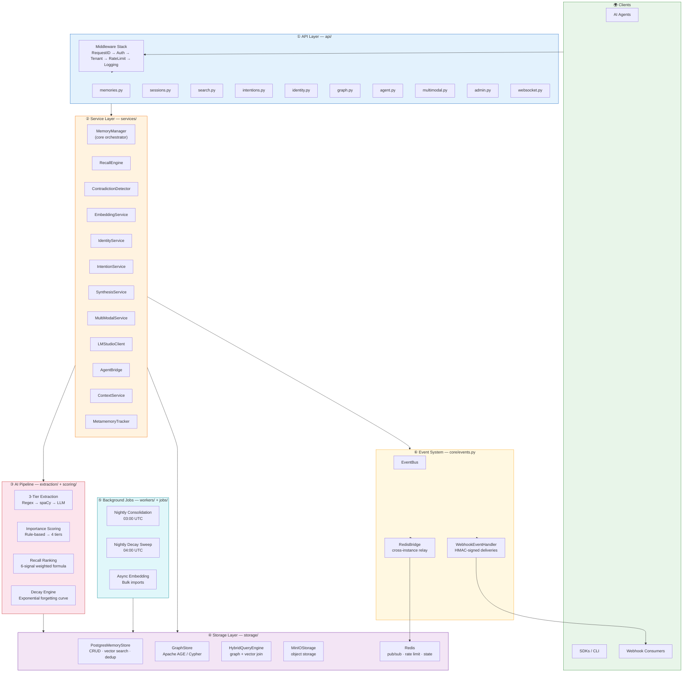
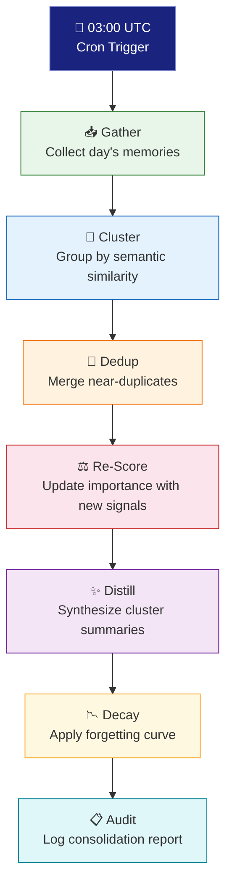
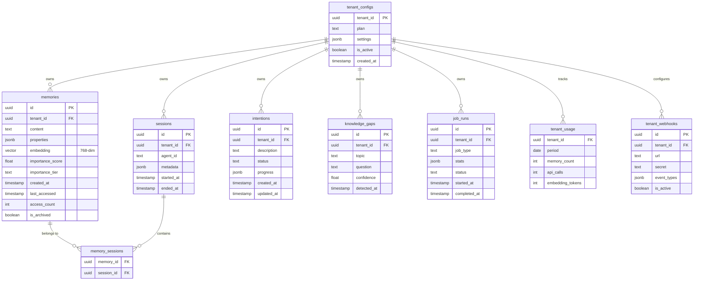
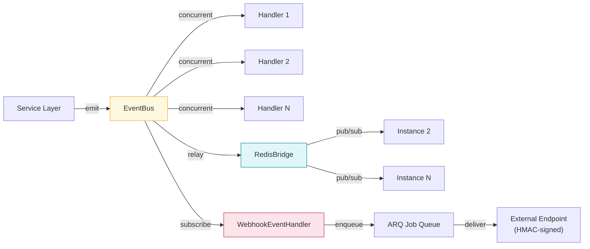
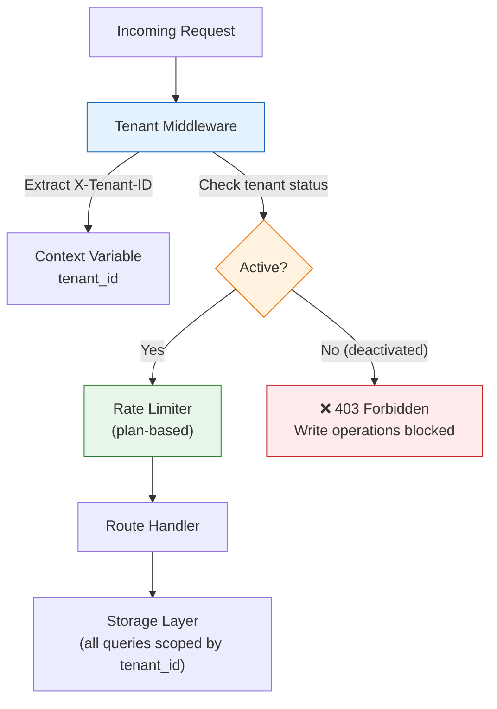

# 🧠 Life Graph — Architecture

> **Brain-inspired memory microservice for AI agents.**
> FastAPI backend · Multi-tenant SaaS · Python 3.11+

---

## Table of Contents

- [Overview](#-overview)
- [Tech Stack](#-tech-stack)
- [Architecture Layers](#-architecture-layers)
- [Data Flow — Memory Ingestion](#-data-flow--memory-ingestion)
- [Data Flow — Proactive Recall](#-data-flow--proactive-recall)
- [Data Flow — Nightly Consolidation](#-data-flow--nightly-consolidation)
- [Database Schema](#-database-schema)
- [Event System](#-event-system)
- [Multi-Tenancy Model](#-multi-tenancy-model)
- [Background Jobs](#-background-jobs)
- [Design Principles](#-design-principles)

---

## 🌐 Overview

Life Graph gives AI agents a **persistent, structured memory** that mirrors how biological brains work — storing experiences, extracting meaning, consolidating knowledge overnight, and proactively recalling relevant context when needed.

| Attribute           | Value                                       |
|---------------------|---------------------------------------------|
| **Type**            | Memory microservice (REST + WebSocket)      |
| **Runtime**         | Python 3.11+ / FastAPI + Uvicorn (async)    |
| **Tenancy**         | Multi-tenant SaaS (free / pro / enterprise) |
| **API Surface**     | 45 endpoints across 9 route files + WS      |
| **LLM Philosophy**  | Advisor, not authority — 85 % rule-based    |
| **License**         | Proprietary                                 |

---

## 🛠 Tech Stack

| Layer               | Technology                                          | Role                                           |
|---------------------|-----------------------------------------------------|-------------------------------------------------|
| **API**             | FastAPI + Uvicorn                                   | Async HTTP/WS server                            |
| **Database**        | PostgreSQL + pgvector                               | Relational storage + 768-dim vector search       |
| **Graph**           | Apache AGE (PostgreSQL extension)                   | Knowledge graph via Cypher queries               |
| **Cache / Queue**   | Redis                                               | Rate limiting, pub/sub, ARQ job queue            |
| **Object Storage**  | MinIO (S3-compatible)                               | Voice, image, and document files                 |
| **NLP**             | spaCy                                               | NER, dependency parsing                          |
| **Embeddings**      | sentence-transformers                               | 768-dimensional semantic embeddings              |
| **LLM Routing**     | LiteLLM                                             | Routes to LM Studio (local) or OpenRouter/Gemini |
| **Background Jobs** | ARQ (Redis-backed)                                  | 2 nightly crons + async bulk tasks               |
| **Observability**   | Prometheus + structured JSON logging                | Metrics, tracing, audit                          |

---

## 🏗 Architecture Layers



### ① API Layer — `api/`

| Route File        | Responsibility                           | Example Endpoints                     |
|-------------------|------------------------------------------|---------------------------------------|
| `memories.py`     | CRUD for memories                        | `POST /memories`, `GET /memories/{id}` |
| `sessions.py`     | Session lifecycle                        | `POST /sessions/start`, `POST /sessions/end` |
| `search.py`       | Semantic + keyword + hybrid search       | `POST /search`, `POST /search/hybrid` |
| `intentions.py`   | Goal & intention tracking                | `POST /intentions`, `PATCH /intentions/{id}` |
| `identity.py`     | Identity graph management                | `GET /identity/summary`, `POST /identity/traits` |
| `graph.py`        | Knowledge graph queries                  | `POST /graph/query`, `GET /graph/neighbors` |
| `agent.py`        | Agent integration bridge                 | `POST /agent/context`, `POST /agent/ingest` |
| `multimodal.py`   | File upload/processing                   | `POST /multimodal/upload`, `GET /multimodal/{id}` |
| `admin.py`        | Tenant admin & diagnostics               | `GET /admin/health`, `GET /admin/metrics` |
| `websocket.py`    | Real-time streaming                      | `WS /ws/stream`                        |

**Middleware stack** (bottom-to-top execution order):

```
┌──────────────────────────┐
│      Logging             │  ← outermost (runs last on request, first on response)
├──────────────────────────┤
│      RateLimit           │
├──────────────────────────┤
│      Tenant              │
├──────────────────────────┤
│      Auth                │
├──────────────────────────┤
│      RequestID           │  ← innermost (runs first on request)
└──────────────────────────┘
```

### ② Service Layer — `services/`

| Service                | Role                                                                  |
|------------------------|-----------------------------------------------------------------------|
| **MemoryManager**      | Core orchestrator — coordinates ingestion, recall, and updates        |
| **RecallEngine**       | Proactive context retrieval with anti-annoyance filtering             |
| **ContradictionDetector** | Detects and resolves conflicting memories                          |
| **EmbeddingService**   | Generates 768-dim vectors via sentence-transformers                   |
| **IdentityService**    | Maintains the evolving identity model (traits, preferences, beliefs)  |
| **IntentionService**   | Tracks goals, plans, and their progress                               |
| **SynthesisService**   | Produces summaries and distillations from memory clusters             |
| **MultiModalService**  | Processes voice, images, and documents via MinIO                      |
| **LMStudioClient**     | Local LLM inference client (via LiteLLM routing)                     |
| **AgentBridge**        | Protocol adapter for different AI agent frameworks                   |
| **ContextService**     | Builds rich context windows for agent consumption                     |
| **MetamemoryTracker**  | Tracks memory-about-memory (what was recalled, when, how useful)     |

### ③ AI Pipeline — `extraction/` + `scoring/`

**3-Tier Extraction** — cost-efficient cascade:

```
Input Text
   │
   ▼
┌──────────────────────┐
│  Tier 1: Regex       │  40+ patterns (dates, names, emails, URLs, quantities)
│  (< 1ms, free)       │  Catches ~60 % of entities
└──────────┬───────────┘
           │ uncovered spans
           ▼
┌──────────────────────┐
│  Tier 2: spaCy NLP   │  NER + dependency parsing
│  (< 10ms, free)      │  Catches ~30 % more
└──────────┬───────────┘
           │ ambiguous / complex only
           ▼
┌──────────────────────┐
│  Tier 3: LLM         │  LiteLLM → LM Studio / OpenRouter / Gemini
│  (~200ms, costly)    │  Last-resort, ≤ 10 % of inputs
└──────────────────────┘
```

**Importance Scoring** — additive/subtractive rule signals:

| Tier        | Score Range | Description                                | Example                          |
|-------------|-------------|--------------------------------------------|----------------------------------|
| 🔴 Critical | 0.85 – 1.00 | Life events, identity-defining moments     | "I got married", "I was diagnosed with…" |
| 🟠 High     | 0.60 – 0.84 | Preferences, goals, significant events     | "I'm switching to veganism"      |
| 🟡 Medium   | 0.30 – 0.59 | Contextual facts, routine updates          | "I had pasta for dinner"         |
| 🟢 Low      | 0.00 – 0.29 | Filler, small talk, acknowledgements       | "Okay", "Got it"                 |

**Recall Ranking** — 6-signal weighted formula:

| Signal            | Weight | Description                                         |
|-------------------|--------|-----------------------------------------------------|
| Semantic similarity | 0.35 | Cosine distance in 768-dim embedding space          |
| Recency            | 0.20 | Exponential decay from creation time                |
| Importance         | 0.20 | The memory's importance score                       |
| Access frequency   | 0.10 | How often this memory has been recalled             |
| Graph proximity    | 0.10 | Hops from current context in the knowledge graph    |
| Session relevance  | 0.05 | Bonus if memory belongs to the active session       |

> [!NOTE]
> **Anti-annoyance filter**: Memories recalled within the last *N* turns are suppressed to prevent repetition. Critical-tier memories are exempt.

---

## 📥 Data Flow — Memory Ingestion

```mermaid
flowchart LR
    A["📝 Raw Text"] --> B["🔍 Extract<br/>Regex → spaCy → LLM"]
    B --> C["⚖️ Score<br/>Rule-based importance"]
    C --> D["🧮 Embed<br/>768-dim vector"]
    D --> E["🔁 Dedup<br/>Cosine similarity > 0.95"]
    E --> F["⚡ Contradict<br/>Conflict detection"]
    F --> G["💾 Store<br/>Postgres + Graph + Events"]

    style A fill:#e8f5e9,stroke:#2e7d32
    style B fill:#e3f2fd,stroke:#1565c0
    style C fill:#fff3e0,stroke:#ef6c00
    style D fill:#fce4ec,stroke:#c62828
    style E fill:#f3e5f5,stroke:#6a1b9a
    style F fill:#fff8e1,stroke:#f9a825
    style G fill:#e0f7fa,stroke:#00838f
```



| Step            | Module                      | What Happens                                                                 |
|-----------------|-----------------------------|------------------------------------------------------------------------------|
| **Extract**     | `extraction/`               | Entities, relations, dates, and metadata pulled via 3-tier cascade           |
| **Score**       | `scoring/`                  | Additive/subtractive signals assign importance tier (0.0 – 1.0)             |
| **Embed**       | `EmbeddingService`          | Text → 768-dim vector via sentence-transformers                              |
| **Dedup**       | `PostgresMemoryStore`       | Cosine similarity check; memories > 0.95 similarity are merged               |
| **Contradict**  | `ContradictionDetector`     | Cross-references existing memories; flags or auto-resolves conflicts         |
| **Store**       | `PostgresMemoryStore` + `GraphStore` | Memory row inserted, graph edges created, `MEMORY_CREATED` event emitted |

---

## 🔎 Data Flow — Proactive Recall

```mermaid
flowchart LR
    A["🎯 Context<br/>Current conversation"] --> B["📡 Retrieve<br/>Vector + graph + keyword"]
    B --> C["📊 Rank<br/>6-signal weighted formula"]
    C --> D["🔄 Rerank<br/>Cross-encoder (optional)"]
    D --> E["🚫 Anti-Annoyance<br/>Suppress recent recalls"]
    E --> F["🏷️ Categorize<br/>Group by type/topic"]
    F --> G["📦 Return<br/>Ranked memory set"]

    style A fill:#e8f5e9,stroke:#2e7d32
    style B fill:#e3f2fd,stroke:#1565c0
    style C fill:#fff3e0,stroke:#ef6c00
    style D fill:#fce4ec,stroke:#c62828
    style E fill:#f3e5f5,stroke:#6a1b9a
    style F fill:#fff8e1,stroke:#f9a825
    style G fill:#e0f7fa,stroke:#00838f
```



| Step               | Module                 | What Happens                                                               |
|--------------------|------------------------|----------------------------------------------------------------------------|
| **Context**        | `ContextService`       | Builds a context window from the current conversation state                |
| **Retrieve**       | `HybridQueryEngine`    | Parallel fan-out: vector search (pgvector), graph traversal (AGE), keyword |
| **Rank**           | `RecallEngine`         | 6-signal weighted formula produces a composite score per memory            |
| **Rerank**         | `RecallEngine`         | Optional cross-encoder pass for high-stakes queries                        |
| **Anti-Annoyance** | `RecallEngine`         | Suppresses memories surfaced within the last N turns (critical exempt)     |
| **Categorize**     | `RecallEngine`         | Groups results by entity type, topic cluster, or temporal period           |
| **Return**         | `ContextService`       | Delivers ranked, categorized memory set to the calling agent               |

---

## 🌙 Data Flow — Nightly Consolidation

> The "sleep cycle" — runs at **03:00 UTC** daily.



| Step         | What Happens                                                                                |
|--------------|---------------------------------------------------------------------------------------------|
| **Gather**   | Collects all memories created or accessed since the last consolidation run                   |
| **Cluster**  | Groups semantically similar memories using embedding cosine similarity                       |
| **Dedup**    | Merges near-duplicate memories (> 0.95 similarity), preserving the richer record             |
| **Re-Score** | Re-evaluates importance scores with cross-referencing signals (frequency, contradictions)    |
| **Distill**  | Generates concise summaries for large clusters via `SynthesisService`                        |
| **Decay**    | Applies exponential forgetting curve — low-importance, un-accessed memories lose score       |
| **Audit**    | Writes a `job_runs` entry with stats: memories processed, merged, decayed, distilled         |

> [!IMPORTANT]
> **Critical memories are exempt from decay.** A memory scored ≥ 0.85 will never be automatically forgotten, regardless of access frequency.

---

## 🗄 Database Schema



| Table               | Purpose                                                       | Key Columns                       |
|---------------------|---------------------------------------------------------------|-----------------------------------|
| `memories`          | Core memory storage with vector embeddings                    | `embedding`, `importance_score`, `properties` (JSONB) |
| `sessions`          | Conversation session lifecycle                                | `agent_id`, `started_at`, `ended_at` |
| `intentions`        | Goal & intention tracking                                     | `status`, `progress` (JSONB)      |
| `knowledge_gaps`    | Detected gaps in the agent's knowledge                        | `topic`, `confidence`             |
| `memory_sessions`   | Many-to-many join between memories and sessions               | `memory_id`, `session_id`         |
| `job_runs`          | Audit log for background job executions                       | `job_type`, `stats` (JSONB)       |
| `tenant_usage`      | Per-tenant usage metrics for billing                          | `memory_count`, `api_calls`       |
| `tenant_configs`    | Tenant settings, plan tier, active status                     | `plan`, `settings` (JSONB)        |
| `tenant_webhooks`   | Webhook endpoint registrations per tenant                     | `url`, `secret`, `event_types`    |

> [!TIP]
> The `properties` column on `memories` is schema-less JSONB — this is intentional. Life Graph works across any domain (health, finance, personal) without hardcoded schemas.

---

## ⚡ Event System

Life Graph uses an internal event bus with Redis relay for cross-instance communication.

### Event Types

| Event                      | Emitted When                                        | Typical Subscribers              |
|----------------------------|-----------------------------------------------------|----------------------------------|
| `MEMORY_CREATED`           | A new memory is stored                              | GraphStore, WebhookHandler       |
| `MEMORY_UPDATED`           | An existing memory is modified                      | EmbeddingService, GraphStore     |
| `MEMORY_ARCHIVED`          | A memory is soft-deleted                            | GraphStore                       |
| `SESSION_START`            | A new session begins                                | ContextService, MetamemoryTracker|
| `SESSION_END`              | A session closes                                    | ConsolidationJob                 |
| `CONTRADICTION_DETECTED`   | Two memories conflict                               | IdentityService, WebhookHandler  |
| `INTENTION_CREATED`        | A new goal/intention is registered                  | IntentionService                 |
| `INTENTION_COMPLETED`      | A goal is marked as achieved                        | SynthesisService, WebhookHandler |
| `CONSOLIDATION_COMPLETE`   | Nightly consolidation finishes                      | MetamemoryTracker                |
| `KNOWLEDGE_GAP_DETECTED`   | A gap in knowledge is identified                    | AgentBridge                      |
| `IDENTITY_SHIFT`           | A significant identity trait changes                | WebhookHandler, IdentityService  |

### Event Flow



> [!NOTE]
> Webhook deliveries are **HMAC-signed** (SHA-256) using the per-webhook `secret`. Consumers should verify the `X-Signature-256` header before processing.

---

## 🏢 Multi-Tenancy Model



| Plan           | Rate Limit       | Max Memories | Webhooks | Consolidation |
|----------------|------------------|--------------|----------|---------------|
| **Free**       | 60 req/min       | 10,000       | 1        | Daily         |
| **Pro**        | 300 req/min      | 100,000      | 5        | Daily         |
| **Enterprise** | 1,000 req/min    | Unlimited    | 25       | Daily + custom |

**Isolation guarantees:**
- Every database query is scoped by `tenant_id`
- Context variables propagate tenant identity through the entire call stack
- Deactivated tenants can still **read** but cannot **write**
- Rate limits are enforced per-tenant via Redis sliding window

---

## ⏰ Background Jobs

| Job                        | Schedule     | Duration  | Description                                          |
|----------------------------|-------------|-----------|------------------------------------------------------|
| **Nightly Consolidation**  | 03:00 UTC   | ~5–15 min | 7-step "sleep cycle" (gather → cluster → dedup → score → distill → decay → audit) |
| **Nightly Decay Sweep**    | 04:00 UTC   | ~2–5 min  | Applies exponential forgetting to stale, low-importance memories |
| **Async Embedding**        | On-demand   | Varies    | Bulk embedding generation for imports                |

All jobs are managed by **ARQ** (Redis-backed async task queue) and log results to the `job_runs` table.

> [!WARNING]
> The consolidation job acquires a per-tenant advisory lock in PostgreSQL. If the previous run hasn't finished, the new run is **skipped** (not queued). Check `job_runs` for `status = 'skipped'` entries.

---

## 🧭 Design Principles

### 1. LLM as Advisor, Not Authority

```
 ┌─────────────────────────────────────────────┐
 │               Processing Budget             │
 │                                             │
 │   ████████████████████░░░░   85 % Rules     │
 │   ░░░░░░░░░░░░░░░░░░░████   15 % LLM       │
 │                                             │
 └─────────────────────────────────────────────┘
```

LLMs are expensive and non-deterministic. Life Graph uses them only as a **fallback** — regex and spaCy handle 85 %+ of extraction and scoring. This keeps costs low, latency predictable, and behavior auditable.

### 2. Schema-Less Core

The `properties` JSONB column means Life Graph works for **any domain** — health tracking, personal finance, relationship management, work notes — without schema migrations. The system extracts structure at runtime, not at design time.

### 3. Brain-Inspired Cycles

| Biological Process   | Life Graph Equivalent                            |
|----------------------|--------------------------------------------------|
| Memory formation     | Ingestion pipeline (extract → score → embed)     |
| Hippocampal replay   | Nightly consolidation ("sleep cycle")            |
| Forgetting curve     | Exponential decay with critical-memory exemption |
| Priming / recall     | Proactive recall with anti-annoyance             |
| Cognitive dissonance | Contradiction detection and resolution           |

### 4. Multi-Tenant Isolation at Every Layer

Tenant isolation is not an afterthought — it's enforced at **middleware**, **service**, **storage**, and **event** layers. A bug in one tenant's data can never leak into another's.

### 5. Event-Driven Architecture with Plugin Support

The EventBus + WebhookEventHandler pattern means external systems can subscribe to Life Graph's internal state changes without polling. HMAC-signed webhook deliveries ensure security. New internal behaviors can be added by simply subscribing a handler to the bus — no route changes needed.

---

<p align="center">
  <em>Life Graph — because AI agents deserve to remember.</em>
</p>
