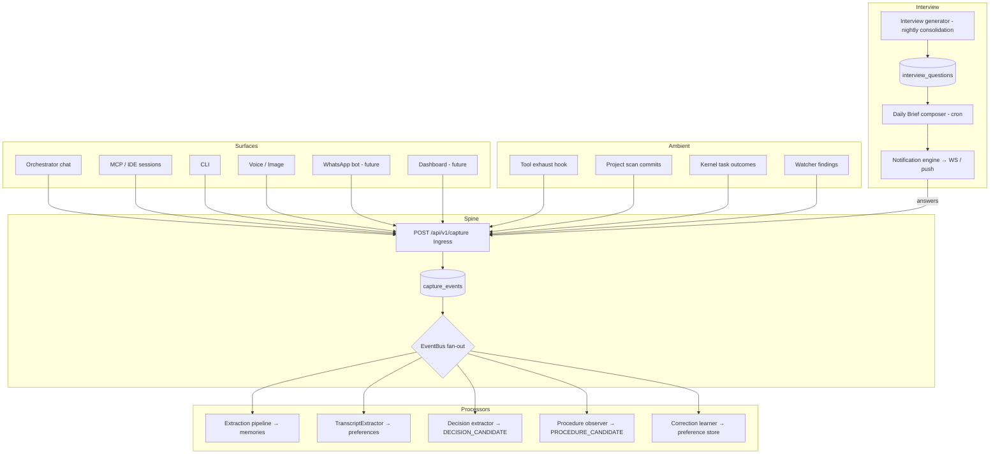

# Capture Spine — Universal Input Layer — Feature Spec

> **Purpose**: The single input architecture every intelligence feature eats from. Four capture layers — ambient observation, conversation-as-capture, system-initiated interviews, and deliberate moments — so the user **never does data entry**. They work, talk, correct, and answer good questions; the system captures everything else silently.
>
> **Why this exists**: Judgment Engine, Apprentice, Life Compiler, Time Machine, and the you-model all require a continuous stream of decisions, corrections, observations, and resolved outcomes. Every previous product in this category (decision journals, quantified-self trackers, reflection apps) died because capture required discipline. This spec removes the discipline requirement.
>
> **Architecture ref**: `KNOWLEDGE.md` — extends the extraction pipeline, EventBus, consolidation cycle, and notification engine. Hard rule from Anti-Patterns: *zero capture friction, no maintenance tax, observe work — don't ask users to categorize.*
>
> **Existing code leveraged**: `services/transcript_extractor.py` (conversation parsing), `extraction/pipeline.py` (3-tier extraction), `services/metamemory.py` + `knowledge_gaps` table (what the system doesn't know), `watchers/digest.py` (daily digest), `kernel/notification_engine.py` (delivery), `jobs/consolidation.py` (nightly cycle), `core/events.py` (EventBus).
>
> **Multi-tenant**: All data scoped by `tenant_id`. Capture events, corrections, and interview questions are per-tenant.

---

## Requirements

### Story 1: Universal Capture Ingress

As a **user**, I want one endpoint that accepts input from every surface I use (agent chat, MCP sessions, CLI, voice note, photo, pasted text, future WhatsApp bot) so that there is never a "second place" to write things down — the chat is the form.

#### Acceptance Criteria

- GIVEN any surface WHEN it `POST /api/v1/capture/` with `{content, surface, modality, occurred_at?, properties?}` THEN a `capture_events` row is created append-only and a `CAPTURE_RECEIVED` event fires
- GIVEN `modality="voice"` with an audio file reference WHEN capture completes THEN the existing Whisper pipeline (`services/multimodal.py`) transcribes it and the transcript becomes the capture content with `properties.audio_object_key` preserved
- GIVEN `modality="image"` WHEN capture completes THEN the existing OCR pipeline extracts text and stores the image reference in MinIO
- GIVEN a capture event is created WHEN routing runs THEN the content is fanned out to registered capture processors (extraction pipeline, decision extractor, procedure observer) via EventBus — processors subscribe, the ingress never calls them directly
- GIVEN the same content hash arrives twice from the same surface within 10 minutes WHEN dedup runs THEN the second event is stored with `status='duplicate'` and no processors fire (protects against client retries)
- GIVEN a capture produces downstream artifacts (memories, preferences, decisions) WHEN processing completes THEN each artifact stores `capture_event_id` so every fact in the system traces back to the exact moment and surface it entered from (provenance)
- GIVEN I `GET /api/v1/capture/?surface=mcp&since=2026-07-01` THEN I see capture events filtered by surface and date with pagination
- GIVEN an unauthenticated request WHEN it hits the ingress THEN it is rejected by the existing auth middleware (no anonymous capture)

---

### Story 2: Agent Session Auto-Capture

As a **user**, I want every conversation with any of my agents (orchestrator sessions, MCP/IDE sessions, CLI) to flow through the capture spine automatically so that talking to my agents *is* the primary input method and nothing said is lost.

#### Acceptance Criteria

- GIVEN an orchestrator session ends WHEN `SESSION_END` fires THEN a capture processor submits the session transcript to the spine with `surface="orchestrator"` and the existing `TranscriptExtractor` runs over it
- GIVEN an MCP session (Claude Code / IDE) completes a tool exchange WHEN the MCP server relays it THEN the exchange is captured with `surface="mcp"` including tool calls made (tool name + args summary, not full output)
- GIVEN a transcript contains decision-like statements ("I'll go with X because...", "let's use X instead of Y") WHEN the decision extractor processor runs THEN candidate decisions are emitted as `DECISION_CANDIDATE` events for the Judgment Engine to consume (see `judgment-engine.md` Story 1)
- GIVEN transcript extraction already creates preferences (`ingest_transcript.py`) WHEN the spine is live THEN that endpoint internally routes through `POST /api/v1/capture/` so ingestion is uniform (backward-compatible response shape)
- GIVEN capture volume from agent sessions WHEN a session produces zero extractable content THEN the capture event is still stored (audit trail) but marked `properties.yield=0` — nightly consolidation prunes zero-yield events older than 90 days

---

### Story 3: Correction Hook

As a **user**, I want every time I edit, override, or reject an agent's output to be captured as a first-class preference/training signal so that my corrections — the highest-value data I produce — stop evaporating.

#### Acceptance Criteria

- GIVEN an agent produced output X and I submit edited version X′ WHEN any surface calls `POST /api/v1/capture/correction` with `{original, corrected, context, kind}` THEN a `corrections` row is created with a computed summary diff
- GIVEN `kind="override"` (I rejected the agent's recommendation and chose differently) WHEN the correction is stored THEN a `CORRECTION_RECORDED` event fires with `properties.severity="override"` — overrides weigh more than edits in downstream learning
- GIVEN a correction on a draft (email, doc, code comment) WHEN extraction runs THEN style-preference signals are extracted (tone, length, structure) and reinforced into the preference store with `source="correction"` and confidence uncapped at 0.85 (corrections are stronger evidence than inferred statements)
- GIVEN 3+ corrections share the same extracted pattern within 30 days WHEN consolidation runs THEN they are distilled into a single explicit preference memory ("user shortens AI drafts by ~40%, removes bullet lists in emails")
- GIVEN I `GET /api/v1/capture/corrections?kind=override` THEN I see correction history filterable by kind, with per-domain counts
- GIVEN the future you-model (era5 self-improving) needs training pairs WHEN it queries corrections THEN `(original, corrected, context)` triples are exportable as NDJSON via the existing export infrastructure

---

### Story 4: Ambient Observation

As a **user**, I want the system to observe the work exhaust I already produce (git commits, terminal commands via agent tools, task completions, watcher findings, calendar) so that ~70% of capture happens with zero effort from me.

#### Acceptance Criteria

- GIVEN an agent executes a tool (`tools/terminal.py`, `tools/git.py`, `tools/browser.py`) WHEN execution completes THEN an observation capture event is created with `surface="tool_exhaust"`, `properties={tool, args_summary, exit_status, duration_ms, project_id?}` — full outputs are NOT stored, only summaries (storage discipline)
- GIVEN a registered project (`kernel/project_registry.py`) WHEN the nightly scan runs THEN new commits since last scan are captured as observations: `{sha, message, files_changed, insertions, deletions}` per commit
- GIVEN a kernel task completes or fails WHEN `TASK_COMPLETED`/`TASK_FAILED` fires THEN an observation links the task's declared intent to its actual outcome and duration — this is the raw material for estimate calibration (Judgment Engine) and procedure detection (Apprentice)
- GIVEN a watcher produces findings WHEN `WATCHER_COMPLETED` fires THEN findings are captured as observations so outcome resolution can later cite them ("the dependency upgrade you predicted safe did break CI — watcher run #841")
- GIVEN the same tool sequence (≥3 steps, same order, same project) is observed 3 times within 60 days WHEN consolidation runs THEN a `PROCEDURE_CANDIDATE` event fires with the trajectory (consumed later by the Apprentice; only the event contract is in scope here)
- GIVEN observations accumulate WHEN a day produces >500 observations for a tenant THEN excess low-signal observations (exit_status=0, no project) are sampled at 10% rather than stored exhaustively

---

### Story 5: Interview Engine — the system asks, you answer

As a **user**, I want the system to ask me a small number of precise, high-value questions at receptive moments — instead of me remembering to journal — so that the hardest data to observe (outcomes, reasons, reflections) gets captured in one-line answers.

#### Acceptance Criteria

- GIVEN nightly consolidation runs WHEN the interview generator executes THEN it produces at most `INTERVIEW_MAX_QUESTIONS_PER_DAY` (default 3) questions drawn from these origins, in priority order:
  1. `outcome_resolution` — predictions past their horizon with no automatic resolution (from Judgment Engine)
  2. `knowledge_gap` — top unresolved rows from the existing `knowledge_gaps` table
  3. `drift` — stated intentions/goals whose observed behavior diverges (intentions with zero related observations in 14 days)
  4. `reflection` — post-completion "what did the estimate miss?" for tasks that overran by >2x
- GIVEN a question is generated WHEN it is stored THEN `interview_questions` holds: question text, origin, origin_ref (FK-ish JSONB pointer), priority, status (`pending/asked/answered/skipped/expired`), and `expires_at` (default 7 days)
- GIVEN the daily brief is composed (Story 6) WHEN questions are pending THEN the top questions are embedded in the brief with one-tap/one-line answer affordances
- GIVEN I answer a question WHEN `POST /api/v1/interview/{id}/answer` receives `{answer}` THEN the answer routes back through the capture spine, the origin is updated (knowledge gap resolved, prediction resolved, reflection stored), and `INTERVIEW_ANSWERED` fires
- GIVEN I skip or ignore a question twice WHEN it recurs THEN it is marked `skipped` and its origin's ask-priority is halved — the system must never nag (anti-annoyance, same principle as recall cooldowns)
- GIVEN a question expires unanswered WHEN the sweep runs THEN status becomes `expired` and, for `outcome_resolution` origin, the prediction resolves as `ambiguous` rather than staying open forever
- GIVEN I `GET /api/v1/interview/pending` THEN I see today's questions (this is what the WhatsApp bot / dashboard / CLI all render)

---

### Story 6: Daily Brief — one delivery channel

As a **user**, I want everything the system wants from me or for me compressed into one daily brief (plus rare high-priority interrupts) so that capture requests never compete with my attention across scattered notifications.

#### Acceptance Criteria

- GIVEN the brief cron fires (default 07:30 local, configurable) WHEN composition runs THEN the brief contains, in order: (1) high-priority notifications since last brief, (2) today's interview questions, (3) yesterday's capture summary (n memories, n decisions, n observations — one line), (4) watcher digest (existing `watchers/digest.py` output)
- GIVEN the brief is composed WHEN delivery runs THEN it is delivered through the existing notification engine as a single notification with `properties.kind="daily_brief"` and pushed over WebSocket; future surfaces (WhatsApp, PWA push) subscribe to the same event
- GIVEN a notification arrives during the day WHEN its priority is below `interrupt` THEN it is held for the next brief instead of delivered immediately (the notification engine gains a `deliver_at_brief` flag) — interrupts remain immediate
- GIVEN I answer questions directly from the brief THEN answers hit `POST /api/v1/interview/{id}/answer` (Story 5) with no other UI required
- GIVEN no content exists for a day WHEN composition runs THEN no brief is sent (silence is acceptable; noise is not)

---

## Design

### Architecture Overview



Key design decisions:

1. **Append-only ingress, processors via events.** The ingress writes one row and fires one event. Processors subscribe. Adding the Apprentice or you-model later means adding a subscriber, not touching the ingress.
2. **Provenance everywhere.** Every downstream artifact stores `capture_event_id`. This is what makes the Time Machine and audit-grade trust possible later — do it from day one, it costs one column.
3. **Summaries, not payloads, for ambient data.** Tool exhaust stores arg summaries and exit codes, never full outputs. Volume discipline is what keeps this runnable on a VPS.
4. **The interview budget is a hard cap.** Three questions a day, halve priority on skip, expire after 7 days. The system that nags gets uninstalled.

### Data Models

```sql
-- Migration 019_capture_spine.py

CREATE TABLE capture_events (
    id              UUID PRIMARY KEY DEFAULT gen_random_uuid(),
    tenant_id       VARCHAR(64) NOT NULL,
    surface         VARCHAR(32) NOT NULL,          -- orchestrator|mcp|cli|voice|image|whatsapp|dashboard|tool_exhaust|project_scan|kernel_task|watcher|interview_answer|api
    modality        VARCHAR(16) NOT NULL DEFAULT 'text',  -- text|voice|image|structured
    content         TEXT NOT NULL DEFAULT '',
    content_hash    VARCHAR(64) NOT NULL,
    status          VARCHAR(16) NOT NULL DEFAULT 'received', -- received|processed|duplicate|failed
    yield_count     INTEGER NOT NULL DEFAULT 0,     -- artifacts produced downstream
    occurred_at     TIMESTAMPTZ NOT NULL DEFAULT now(),
    properties      JSONB NOT NULL DEFAULT '{}',    -- tool, project_id, session_id, audio_object_key, ...
    created_at      TIMESTAMPTZ NOT NULL DEFAULT now()
);
CREATE INDEX ix_capture_tenant_time ON capture_events (tenant_id, occurred_at DESC);
CREATE INDEX ix_capture_surface ON capture_events (tenant_id, surface);
CREATE INDEX ix_capture_hash ON capture_events (tenant_id, content_hash);

CREATE TABLE corrections (
    id              UUID PRIMARY KEY DEFAULT gen_random_uuid(),
    tenant_id       VARCHAR(64) NOT NULL,
    capture_event_id UUID REFERENCES capture_events(id),
    kind            VARCHAR(16) NOT NULL,           -- edit|override|reject|approve
    original        TEXT NOT NULL,
    corrected       TEXT NOT NULL DEFAULT '',
    diff_summary    TEXT NOT NULL DEFAULT '',       -- computed, human-readable
    context         JSONB NOT NULL DEFAULT '{}',    -- agent, task type, project, surface
    domain_tags     TEXT[] NOT NULL DEFAULT '{}',
    created_at      TIMESTAMPTZ NOT NULL DEFAULT now()
);
CREATE INDEX ix_corrections_tenant ON corrections (tenant_id, created_at DESC);
CREATE INDEX ix_corrections_kind ON corrections (tenant_id, kind);

CREATE TABLE interview_questions (
    id              UUID PRIMARY KEY DEFAULT gen_random_uuid(),
    tenant_id       VARCHAR(64) NOT NULL,
    question        TEXT NOT NULL,
    origin          VARCHAR(32) NOT NULL,           -- outcome_resolution|knowledge_gap|drift|reflection
    origin_ref      JSONB NOT NULL DEFAULT '{}',    -- {"prediction_id": ...} | {"gap_id": ...} | {"intention_id": ...} | {"task_id": ...}
    priority        FLOAT NOT NULL DEFAULT 0.5,
    status          VARCHAR(16) NOT NULL DEFAULT 'pending', -- pending|asked|answered|skipped|expired
    answer          TEXT,
    answer_capture_id UUID REFERENCES capture_events(id),
    asked_count     INTEGER NOT NULL DEFAULT 0,
    expires_at      TIMESTAMPTZ NOT NULL,
    answered_at     TIMESTAMPTZ,
    created_at      TIMESTAMPTZ NOT NULL DEFAULT now()
);
CREATE INDEX ix_interview_tenant_status ON interview_questions (tenant_id, status, priority DESC);
```

Also: add nullable `capture_event_id UUID` columns to `memories`, and store it in `properties.capture_event_id` for preferences/decisions (JSONB, no migration churn on era4 tables).

### API Contracts

```
POST /api/v1/capture/
{
  "content": "Decided to keep Apache AGE instead of moving to Neo4j — asyncpg search_path fix works",
  "surface": "cli",
  "modality": "text",
  "occurred_at": "2026-07-07T14:30:00Z",
  "properties": {"project": "life-graph"}
}
→ 201
{
  "id": "…", "status": "received", "surface": "cli",
  "processors_notified": ["extraction", "decision_extractor"]
}

POST /api/v1/capture/correction
{
  "kind": "edit",
  "original": "<agent draft>",
  "corrected": "<user version>",
  "context": {"agent": "email_drafter", "task": "client reply"}
}
→ 201 { "id": "…", "diff_summary": "shortened 42%, removed bullets, informal tone" }

GET  /api/v1/capture/?surface=mcp&since=…&limit=50
GET  /api/v1/capture/corrections?kind=override
GET  /api/v1/interview/pending
→ 200 { "questions": [ { "id": "…", "question": "Two weeks ago you were 85% sure the AGE migration would take 3 days. It took 9. What did the estimate miss?", "origin": "reflection", "expires_at": "…" } ] }

POST /api/v1/interview/{id}/answer   { "answer": "Underestimated the asyncpg search_path issue" }
POST /api/v1/interview/{id}/skip
GET  /api/v1/brief/today            → latest composed brief (for dashboard/CLI rendering)
```

### Core Implementation

```python
# life_graph/services/capture.py
"""Capture spine — universal input ingress. Append-only; processors subscribe via EventBus."""

import hashlib
from datetime import datetime, timedelta, timezone

from life_graph.core.events import EventBus, EventType
from life_graph.models.db import CaptureEvent

DUPLICATE_WINDOW = timedelta(minutes=10)


class CaptureService:
    def __init__(self, session_factory, event_bus: EventBus):
        self._sf = session_factory
        self._bus = event_bus

    async def ingest(
        self,
        tenant_id: str,
        content: str,
        surface: str,
        modality: str = "text",
        occurred_at: datetime | None = None,
        properties: dict | None = None,
    ) -> CaptureEvent:
        content_hash = hashlib.sha256(content.encode()).hexdigest()
        async with self._sf() as session:
            if await self._is_recent_duplicate(session, tenant_id, surface, content_hash):
                return await self._store(session, tenant_id, content, surface, modality,
                                         occurred_at, properties, content_hash, status="duplicate")
            event = await self._store(session, tenant_id, content, surface, modality,
                                      occurred_at, properties, content_hash, status="received")
        await self._bus.publish(EventType.CAPTURE_RECEIVED, {
            "capture_event_id": str(event.id),
            "tenant_id": tenant_id,
            "surface": surface,
            "modality": modality,
        })
        return event
```

```python
# life_graph/services/interview.py
"""Interview engine — the system asks, the user answers. Hard daily budget, anti-nag."""

QUESTION_BUDGET_ORDER = ["outcome_resolution", "knowledge_gap", "drift", "reflection"]


class InterviewService:
    async def generate_daily(self, tenant_id: str, max_questions: int = 3) -> list[InterviewQuestion]:
        """Called from nightly consolidation (new step 8). Draws candidates
        from each origin in priority order until the budget is filled."""
        candidates: list[InterviewQuestion] = []
        candidates += await self._unresolved_predictions(tenant_id)      # judgment engine hook
        candidates += await self._top_knowledge_gaps(tenant_id, limit=2)  # existing table
        candidates += await self._drifting_intentions(tenant_id)          # intentions vs observations
        candidates += await self._overrun_reflections(tenant_id)          # kernel task outcomes
        candidates.sort(key=lambda q: (QUESTION_BUDGET_ORDER.index(q.origin), -q.priority))
        return candidates[:max_questions]

    async def answer(self, tenant_id: str, question_id: str, answer: str) -> None:
        q = await self._get(tenant_id, question_id)
        capture = await self._capture.ingest(
            tenant_id, answer, surface="interview_answer",
            properties={"question_id": question_id, "origin": q.origin, "origin_ref": q.origin_ref},
        )
        await self._mark_answered(q, answer, capture.id)
        await self._route_to_origin(q, answer)   # resolve gap / prediction / store reflection
        await self._bus.publish(EventType.INTERVIEW_ANSWERED, {...})

    async def skip(self, tenant_id: str, question_id: str) -> None:
        q = await self._get(tenant_id, question_id)
        q.status = "skipped"
        await self._halve_origin_priority(q)      # never nag
```

```python
# life_graph/workers/tasks.py — new cron entries
# daily_brief:       cron("30 2 * * *")  # 07:30 IST ≈ 02:00 UTC, configurable per tenant
# interview_expire:  runs inside daily_brief composition (sweep expired questions first)
# consolidation:     gains step 8 "interview generation" after existing step 7 audit
```

### Dependencies & Integrations

| Integrates with | How |
|---|---|
| `extraction/pipeline.py` | Subscribes to `CAPTURE_RECEIVED` for text modality — replaces direct calls scattered across API routes |
| `services/transcript_extractor.py` | Becomes a capture processor; `POST /api/v1/ingest/transcript` routes through the spine internally |
| `services/multimodal.py` | Voice/image captures delegate to existing Whisper/OCR then re-enter as text |
| `knowledge_gaps` table + `services/metamemory.py` | Interview generator's `knowledge_gap` origin |
| `kernel/notification_engine.py` | Brief delivery; gains `deliver_at_brief` batching flag |
| `watchers/digest.py` | Digest output embedded as brief section 4 |
| `jobs/consolidation.py` | Gains step 8: interview generation; prunes zero-yield captures |
| `judgment-engine.md` | Consumes `DECISION_CANDIDATE`; supplies `outcome_resolution` questions; resolves predictions from answers |

### New EventType Additions

```python
# In life_graph/core/events.py — add to EventType enum:
CAPTURE_RECEIVED = "capture:received"
CORRECTION_RECORDED = "capture:correction"
DECISION_CANDIDATE = "capture:decision_candidate"
PROCEDURE_CANDIDATE = "capture:procedure_candidate"
INTERVIEW_ASKED = "interview:asked"
INTERVIEW_ANSWERED = "interview:answered"
BRIEF_COMPOSED = "brief:composed"
```

### New Environment Variables

```bash
LIFE_GRAPH_CAPTURE_ENABLED=true
LIFE_GRAPH_CAPTURE_DUP_WINDOW_MINUTES=10
LIFE_GRAPH_CAPTURE_OBSERVATION_DAILY_CAP=500
LIFE_GRAPH_INTERVIEW_MAX_QUESTIONS_PER_DAY=3
LIFE_GRAPH_INTERVIEW_QUESTION_TTL_DAYS=7
LIFE_GRAPH_BRIEF_CRON="30 2 * * *"
```

### Error Handling

- Processor failure must never fail ingress: `CAPTURE_RECEIVED` handlers run isolated (existing EventBus semantics); a failed processor marks the capture `properties.failed_processors[]` for retry by consolidation
- Whisper/OCR failure → capture stored with `status='failed'` and original object key retained for reprocessing
- Brief composition failure → log + skip day (never send partial garbage); interview questions roll to next day
- Interview answer to an already-expired question → 410 Gone with friendly message; answer still captured as a plain memory

### Security Considerations

- Tool-exhaust observations must redact obvious secrets before storage (reuse env-var/token regexes from the extraction rules tier)
- Correction payloads may contain sensitive drafts — corrections are excluded from the Delegate/export surface by default (`properties.exportable=false`)
- Capture ingress rate-limited per tenant via existing Redis sliding window (plan-aware)

---

## Tasks

### Phase 1: Schema & Ingress (~1.5 days)
- [ ] Migration `019_capture_spine.py`: capture_events, corrections, interview_questions (+ `memories.capture_event_id`)
- [ ] SQLAlchemy models in `models/db.py`, Pydantic schemas in `models/schemas.py`
- [ ] `services/capture.py` (ingest, dedup, list) + `api/capture.py` router + DI provider
- [ ] New EventTypes + register router in `main.py`

### Phase 2: Processors & Session Auto-Capture (~1.5 days)
- [ ] Extraction pipeline subscribes to `CAPTURE_RECEIVED`
- [ ] Route `ingest_transcript` through the spine; orchestrator `SESSION_END` hook; MCP server hook
- [ ] Decision extractor processor (regex tier: "decided to", "going with", "chose X over Y") emitting `DECISION_CANDIDATE`
- [ ] Voice/image delegation to multimodal service

### Phase 3: Correction Hook (~1 day)
- [ ] `POST /capture/correction` + diff summary (difflib ratio + heuristics: length delta, structure delta, tone keywords)
- [ ] Correction → preference reinforcement processor; consolidation distillation rule (3+ similar in 30 days)
- [ ] NDJSON export of correction triples

### Phase 4: Ambient Observation (~1 day)
- [ ] Tool registry post-execution hook → observation captures (with secret redaction + daily cap sampling)
- [ ] Project scan commit observations; kernel task outcome observations; watcher finding observations
- [ ] Procedure-candidate detection (3x same trajectory) firing `PROCEDURE_CANDIDATE` (event only — Apprentice consumes later)

### Phase 5: Interview Engine + Daily Brief (~1.5 days)
- [ ] `services/interview.py` (generate_daily, answer, skip, expire sweep) + `api/interview.py`
- [ ] Consolidation step 8: interview generation; origin routing (gap resolve, reflection store; prediction resolve stub until judgment engine lands)
- [ ] Brief composer cron + `deliver_at_brief` batching in notification engine + `GET /brief/today`

### Phase 6: Tests & Polish (~1 day)
- [ ] Integration tests: ingress dedup, processor fan-out, correction extraction, interview budget/anti-nag, brief composition (follow `tests/integration/` httpx pattern)
- [ ] Update KNOWLEDGE.md (new tables, events, cron), .env.example
- [ ] OpenAPI examples for all new endpoints

**Total: ~7.5 days**
