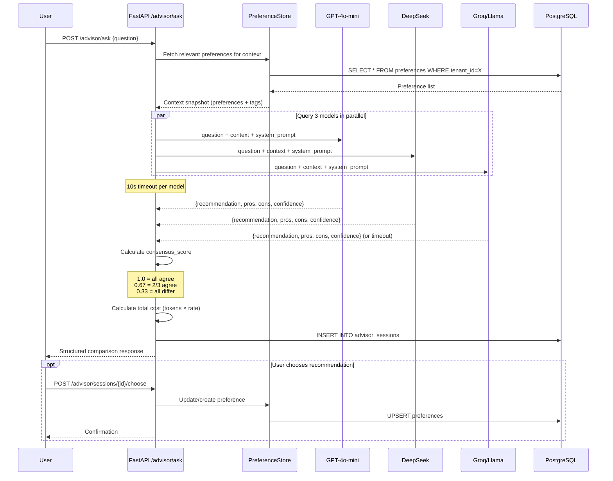
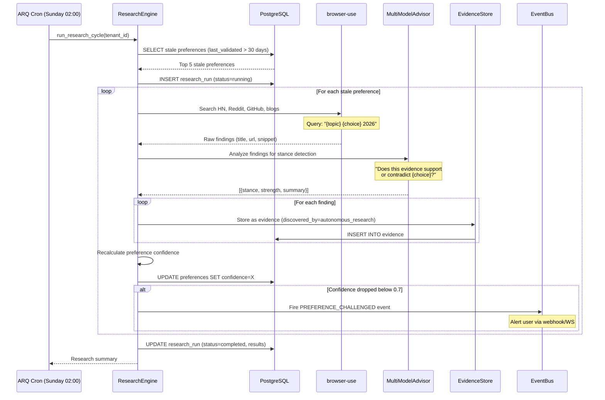

# Era 4 — Personal AI (Knowledge Engine) — Feature Spec

> **Purpose**: An AI system that stores your preferences, challenges your assumptions with evidence from multiple AI models, and actively researches whether your opinions still hold. This is the CORE PRODUCT — the thing nobody else has.
>
> **Architecture ref**: `KNOWLEDGE.md` — builds on existing Life Graph memory system
>
> **Existing endpoints**: Leverages `/api/v1/identity/` (beliefs, stale detection), `/api/v1/graph/` (Apache AGE), and extraction pipeline
>
> **Multi-tenant**: All data scoped by `tenant_id`. Preferences, evidence, advisor sessions, and research runs are per-tenant.

---

## Requirements

### Story 1: Preference CRUD & Storage

As a **developer**, I want to store my technology preferences, tool choices, and opinions in a structured preference store so that my AI systems always know my current stance on any topic.

#### Acceptance Criteria

- GIVEN I am authenticated WHEN I `POST /api/v1/preferences/` with topic="ORM", choice="SQLAlchemy", reason="Type safety + async support", confidence=0.9, and source="explicit" THEN the system creates a preference record, generates a 768-dim embedding for semantic search, and returns the new preference with an ID
- GIVEN a preference with topic="ORM" already exists WHEN I create another with topic="ORM" and choice="Prisma" THEN both coexist — the system does NOT deduplicate by topic (user may have context-dependent preferences)
- GIVEN I have 15 stored preferences WHEN I `GET /api/v1/preferences/` with no filters THEN I see all 15 preferences sorted by `updated_at` DESC with pagination (limit/offset)
- GIVEN I have preferences tagged "backend" and "frontend" WHEN I `GET /api/v1/preferences/?tags=backend` THEN I see only backend-tagged preferences
- GIVEN I have a preference with id=X WHEN I `PATCH /api/v1/preferences/{X}` with confidence=0.6 and reason="New benchmarks show Prisma catching up" THEN the preference is updated, `updated_at` changes, and a history entry is recorded in `properties.history`
- GIVEN I have a preference with id=X WHEN I `DELETE /api/v1/preferences/{X}` THEN the preference is soft-deleted (status='archived'), not hard-deleted
- GIVEN a preference has confidence=0.95 and was last validated 45 days ago WHEN I `GET /api/v1/preferences/?stale_days=30` THEN this preference appears in the stale list with a `days_since_validated` field
- GIVEN a preference has source="inferred" WHEN I view it THEN the confidence is capped at 0.7 initially (inferred sources start with lower trust)
- GIVEN I search for "database choice" WHEN I `POST /api/v1/preferences/search` with query="database choice" THEN the system returns semantically similar preferences (e.g., "PostgreSQL over MySQL", "SQLite for dev") ranked by cosine similarity

---

### Story 2: Evidence Collection & Linking

As a **developer**, I want to attach supporting and contradicting evidence to my preferences so that I can see the full picture and make informed decisions.

#### Acceptance Criteria

- GIVEN I have preference id=X for "PostgreSQL over MySQL" WHEN I `POST /api/v1/evidence/` with preference_id=X, content="PostgreSQL 17 benchmarks show 2x improvement in JSONB queries", source_url="https://...", stance="supports", strength=0.85 THEN an evidence record is created and linked to the preference
- GIVEN preference id=X has 3 supporting and 2 contradicting evidence items WHEN I `GET /api/v1/preferences/{X}/evidence` THEN I see all 5 items grouped by stance (supports/contradicts) with a net_score calculated as `sum(supporting_strengths) - sum(contradicting_strengths)`
- GIVEN evidence with source_type="benchmark" WHEN the system calculates credibility THEN benchmark evidence gets a 1.2x strength multiplier (more credible than reddit posts at 0.8x)
- GIVEN I add evidence with the exact same source_url to the same preference WHEN the POST completes THEN the system returns 409 Conflict: "Evidence from this URL already exists for this preference"
- GIVEN evidence was added 90 days ago WHEN I view it THEN the evidence has a `freshness_score` that decays over time (evidence older than 180 days shows a ⚠️ stale warning)
- GIVEN evidence has an embedding WHEN I `POST /api/v1/evidence/search` with query="PostgreSQL performance" THEN the system returns semantically similar evidence across ALL preferences, not just one
- GIVEN I delete evidence id=Y WHEN the DELETE completes THEN the evidence is soft-deleted and the parent preference's confidence is recalculated based on remaining evidence

---

### Story 3: Multi-Model Advisor

As a **developer**, I want to ask technology questions and get structured recommendations from 3 different AI models (GPT-4o-mini, DeepSeek, Groq/Llama) so that I avoid single-model bias and see where models agree or disagree.

#### Acceptance Criteria

- GIVEN I `POST /api/v1/advisor/ask` with question="Should I use Bun or Node.js for my next API?" THEN the system queries 3 models in parallel, each receiving my relevant preferences as context, and returns within 15 seconds
- GIVEN all 3 models return their answers WHEN the response is assembled THEN I see a structured comparison with: per-model recommendation, pros (list), cons (list), confidence (0-1), and a brief reasoning paragraph
- GIVEN all 3 models recommend the same choice WHEN the consensus is calculated THEN consensus_score=1.0 ("Unanimous") and the response includes a "High confidence — all models agree" badge
- GIVEN 2 models agree and 1 disagrees WHEN the consensus is calculated THEN consensus_score=0.67 ("Majority") and the dissenting model's reasoning is highlighted as "Dissenting view"
- GIVEN all 3 models recommend different choices WHEN the consensus is calculated THEN consensus_score=0.33 ("Split") and the response includes "⚠️ No consensus — review each model's reasoning carefully"
- GIVEN the query costs tokens across 3 models WHEN the session completes THEN total_cost is calculated (target: ~₹0.15/question) and stored in the advisor_sessions record
- GIVEN I have 10 previous advisor sessions WHEN I `GET /api/v1/advisor/sessions` THEN I see a list of past sessions with question, consensus_score, chosen_recommendation, and total_cost
- GIVEN one model times out (>10s) WHEN the other 2 have responded THEN the system returns results from the 2 available models with a note: "DeepSeek did not respond in time — showing 2 of 3 models"
- GIVEN I `POST /api/v1/advisor/sessions/{id}/choose` with chosen_model="gpt-4o-mini" THEN the system records which recommendation I followed, updating the preference store if applicable
- GIVEN an API key is missing or invalid for one model WHEN the system initializes THEN it logs a warning and operates with the remaining models (graceful degradation)

---

### Story 4: Autonomous Research

As a **developer**, I want the system to automatically research whether my preferences still hold by scraping tech sources and feeding findings through the multi-model advisor, so that I'm proactively alerted when my opinions become outdated.

#### Acceptance Criteria

- GIVEN preferences exist that haven't been validated in 30+ days WHEN the weekly research cron runs (Sunday 02:00 UTC) THEN the system selects the top 5 most stale preferences for research
- GIVEN the cron selects a stale preference "FastAPI over Django" WHEN research starts THEN the system uses browser-use to search Hacker News, Reddit r/python, GitHub trending, and curated tech blogs for recent discussions about FastAPI vs Django
- GIVEN the scraper finds 8 relevant articles/discussions WHEN the findings are processed THEN each finding is stored as evidence (source_type=research, source="autonomous_research") with stance detection (supports/contradicts) via the multi-model advisor
- GIVEN new evidence contradicts a preference WHEN the preference's confidence is recalculated THEN confidence decreases proportionally to the contradicting evidence strength
- GIVEN a preference's confidence drops below 0.7 after research WHEN the research run completes THEN the system fires a `PREFERENCE_CHALLENGED` event and the user sees an alert: "🔍 Your preference for FastAPI over Django has new contradicting evidence. Confidence dropped to 0.62"
- GIVEN the research cron runs WHEN it completes THEN a `research_runs` record is created with: preferences_checked, evidence_found, alerts_triggered, total_cost, duration_seconds
- GIVEN I `GET /api/v1/research/runs` WHEN research has been running THEN I see a history of all research runs with stats and per-preference breakdown
- GIVEN the research cron encounters a rate-limited source WHEN scraping fails THEN the system logs the error, skips that source, and continues with remaining sources (no full-run failure)
- GIVEN I `POST /api/v1/research/trigger` with preference_id=X WHEN I want immediate research THEN the system runs an on-demand research cycle for that specific preference (bypassing the 30-day threshold)
- GIVEN the monthly research budget is set to ₹50 WHEN cumulative research cost approaches ₹45 THEN the system logs a warning and reduces research frequency to 1 preference per run

---

### Story 5: Transcript Ingestion

As a **developer**, I want to ingest conversation transcripts from Antigravity, Claude, and ChatGPT so that the system automatically extracts my preferences and opinions from past conversations without manual entry.

#### Acceptance Criteria

- GIVEN I `POST /api/v1/ingest/transcript` with a JSON body containing messages (role + content pairs) and source="antigravity" THEN the system parses the conversation and extracts preference-like statements from user messages
- GIVEN the transcript contains "I prefer FastAPI over Django because of async support and auto-generated docs" WHEN extraction runs THEN the system creates a preference with topic="Web Framework", choice="FastAPI", reason="async support and auto-generated docs", source="inferred", confidence=0.65
- GIVEN the transcript contains "I've been using PostgreSQL for 5 years and it's the best database" WHEN extraction runs THEN the system detects this as a strong preference (long duration indicator) and sets confidence=0.70 (capped for inferred)
- GIVEN extraction finds a preference that semantically matches an existing preference (cosine ≥ 0.90) WHEN dedup runs THEN the existing preference is reinforced (confidence += 0.05, reinforced_count++) instead of creating a duplicate
- GIVEN extraction finds a preference that contradicts an existing one WHEN the contradiction is detected THEN the system creates evidence (stance="contradicts") on the existing preference and fires a `CONTRADICTION_DETECTED` event
- GIVEN a transcript has 200 messages WHEN ingestion completes THEN the response includes: preferences_extracted, preferences_reinforced, contradictions_found, and processing_time_ms
- GIVEN the transcript is in ChatGPT export format (JSON with mapping/messages structure) WHEN I specify format="chatgpt" THEN the system correctly parses the ChatGPT JSON schema
- GIVEN the transcript is in Claude export format WHEN I specify format="claude" THEN the system correctly parses Claude's conversation export schema
- GIVEN the transcript is plain text (copy-paste) WHEN I specify format="plain" THEN the system splits by common patterns ("Human:", "Assistant:", "User:", "AI:") and extracts preferences from human messages only

---

### Story 6: Knowledge Graph Integration

As a **developer**, I want my preferences visualized as nodes in the knowledge graph with edges showing supports/contradicts/depends_on relationships so that I can explore how my technology opinions interconnect.

#### Acceptance Criteria

- GIVEN I create a new preference WHEN the preference is stored THEN a corresponding node is created in the Apache AGE graph with label `Preference` and properties: topic, choice, confidence
- GIVEN preference A="Use PostgreSQL" and preference B="Use SQLAlchemy" WHEN the system detects that SQLAlchemy is the ORM for PostgreSQL THEN a `DEPENDS_ON` edge is created from B to A
- GIVEN preference A="Use FastAPI" and evidence contradicts it WHEN the evidence is stored THEN an `Evidence` node is created with a `CONTRADICTS` edge to preference A (or `SUPPORTS` edge depending on stance)
- GIVEN I `GET /api/v1/graph/entity/PostgreSQL` WHEN preferences reference PostgreSQL THEN I see the PostgreSQL entity with all connected preferences, evidence, and relationships
- GIVEN I `POST /api/v1/graph/query` with a Cypher query "MATCH (p:Preference)-[:CONTRADICTS]->(e:Evidence) RETURN p, e" THEN I see all preferences that have contradicting evidence
- GIVEN I click a preference node in the visual explorer WHEN the detail panel opens THEN I see: all evidence (grouped by stance), confidence history over time, and related preferences via graph edges
- GIVEN two preferences are connected by a `DEPENDS_ON` edge WHEN the upstream preference's confidence drops below 0.5 THEN the system alerts: "⚠️ Your preference for SQLAlchemy depends on PostgreSQL, but PostgreSQL confidence has dropped to 0.45"

---

## Design

### Architecture Overview

```
┌────────────────────┐     ┌──────────────────┐     ┌──────────────────┐
│  Future Next.js    │────▶│  FastAPI API      │────▶│  PostgreSQL      │
│  Frontend          │     │  /api/v1/         │     │  + pgvector      │
│  (Preference UI)   │     │  preferences/*    │     │  + Apache AGE    │
│                    │     │  evidence/*       │     │                  │
│                    │     │  advisor/*        │     │  Tables:         │
│                    │     │  research/*       │     │  preferences     │
│                    │     │  ingest/*         │     │  evidence        │
│                    │     │  graph/*          │     │  advisor_sessions│
└────────────────────┘     └──────┬───────────┘     │  research_runs   │
                                  │                  └──────────────────┘
                    ┌─────────────┼─────────────┐
                    │             │             │
                    ▼             ▼             ▼
             ┌───────────┐ ┌──────────┐ ┌─────────────┐
             │ LLM Router│ │ browser- │ │ ARQ Worker  │
             │ (LiteLLM) │ │ use      │ │ (research   │
             │ GPT/DS/   │ │ scraper  │ │  cron)      │
             │ Groq      │ │          │ │             │
             └───────────┘ └──────────┘ └─────────────┘
```

**Key flows:**
1. **Preference Management** (CRUD, search, stale detection): Frontend → FastAPI → PostgreSQL + pgvector
2. **Evidence Collection**: FastAPI → PostgreSQL (with embedding generation for semantic search)
3. **Multi-Model Advisor**: FastAPI → LiteLLM router → 3 LLM providers in parallel → structured merge → PostgreSQL
4. **Autonomous Research**: ARQ cron → browser-use scraper → multi-model advisor → evidence store → preference confidence update
5. **Transcript Ingestion**: FastAPI → extraction pipeline (regex + NLP) → preference dedup → evidence linking
6. **Knowledge Graph**: FastAPI → Apache AGE graph operations on preference/evidence nodes

---

### Data Models

```sql
-- ============================================================
-- Preferences — the user's stored technology opinions/choices
-- ============================================================
CREATE TABLE preferences (
  id                UUID PRIMARY KEY DEFAULT gen_random_uuid(),
  tenant_id         VARCHAR(64) NOT NULL,

  -- Core fields
  topic             TEXT NOT NULL,                     -- "ORM", "Database", "Web Framework"
  choice            TEXT NOT NULL,                     -- "SQLAlchemy", "PostgreSQL", "FastAPI"
  reason            TEXT,                              -- "Type safety + async support"
  context           TEXT,                              -- "For Python backend projects"

  -- Confidence tracking
  confidence        FLOAT NOT NULL DEFAULT 0.5,        -- 0.0 to 1.0
  confidence_history JSONB DEFAULT '[]',               -- [{date, value, reason}]

  -- Source provenance
  source            VARCHAR(20) NOT NULL DEFAULT 'explicit',  -- explicit | inferred | research
  source_detail     TEXT,                              -- "Conversation with Claude on 2026-01-15"

  -- Organization
  tags              TEXT[] DEFAULT '{}',               -- ["backend", "database", "python"]
  category          VARCHAR(50),                       -- "infrastructure", "tooling", "language"
  properties        JSONB DEFAULT '{}',                -- Extensible metadata, history entries

  -- Validation tracking
  last_validated_at TIMESTAMPTZ DEFAULT NOW(),         -- When was this last confirmed?
  validated_count   INT NOT NULL DEFAULT 0,            -- How many times validated?
  last_challenged_at TIMESTAMPTZ,                      -- When was this last challenged?

  -- Vector search
  embedding         vector(768),                       -- all-mpnet-base-v2 embedding
  embedding_model   VARCHAR(50) DEFAULT 'all-mpnet-base-v2',

  -- Lifecycle
  status            VARCHAR(20) NOT NULL DEFAULT 'active',  -- active | uncertain | archived
  created_at        TIMESTAMPTZ NOT NULL DEFAULT NOW(),
  updated_at        TIMESTAMPTZ NOT NULL DEFAULT NOW()
);

-- Indexes for preferences
CREATE INDEX ix_preferences_tenant_status ON preferences(tenant_id, status);
CREATE INDEX ix_preferences_tenant_topic ON preferences(tenant_id, topic);
CREATE INDEX ix_preferences_tenant_category ON preferences(tenant_id, category);
CREATE INDEX ix_preferences_confidence ON preferences(confidence);
CREATE INDEX ix_preferences_last_validated ON preferences(tenant_id, last_validated_at);
CREATE INDEX ix_preferences_tags ON preferences USING GIN (tags);
CREATE INDEX ix_preferences_properties ON preferences USING GIN (properties);
CREATE INDEX ix_preferences_source ON preferences(tenant_id, source);

-- ============================================================
-- Evidence — supporting/contradicting data for preferences
-- ============================================================
CREATE TABLE evidence (
  id                UUID PRIMARY KEY DEFAULT gen_random_uuid(),
  tenant_id         VARCHAR(64) NOT NULL,
  preference_id     UUID NOT NULL REFERENCES preferences(id) ON DELETE CASCADE,

  -- Content
  content           TEXT NOT NULL,                     -- The evidence text/summary
  source_url        TEXT,                              -- URL where evidence was found
  source_type       VARCHAR(30) NOT NULL DEFAULT 'article',
                                                       -- benchmark | article | reddit |
                                                       -- hn_discussion | ai_opinion |
                                                       -- github_trend | blog | paper

  -- Model provenance (if evidence came from an AI model)
  model_source      VARCHAR(50),                       -- "gpt-4o-mini", "deepseek-chat", etc.

  -- Stance and strength
  stance            VARCHAR(15) NOT NULL,              -- supports | contradicts | neutral
  strength          FLOAT NOT NULL DEFAULT 0.5,        -- 0.0 to 1.0

  -- Credibility multipliers by source_type (applied at query time):
  -- benchmark: 1.2x, paper: 1.1x, article: 1.0x, blog: 0.9x, reddit: 0.8x, ai_opinion: 0.7x
  raw_strength      FLOAT NOT NULL DEFAULT 0.5,        -- Original strength before multiplier

  -- Vector search
  embedding         vector(768),
  embedding_model   VARCHAR(50) DEFAULT 'all-mpnet-base-v2',

  -- Metadata
  discovered_by     VARCHAR(30) DEFAULT 'manual',      -- manual | autonomous_research | transcript
  properties        JSONB DEFAULT '{}',

  -- Lifecycle
  status            VARCHAR(20) NOT NULL DEFAULT 'active',  -- active | archived
  created_at        TIMESTAMPTZ NOT NULL DEFAULT NOW(),
  updated_at        TIMESTAMPTZ NOT NULL DEFAULT NOW()
);

-- Indexes for evidence
CREATE INDEX ix_evidence_preference ON evidence(preference_id, stance);
CREATE INDEX ix_evidence_tenant ON evidence(tenant_id, status);
CREATE INDEX ix_evidence_source_type ON evidence(source_type);
CREATE INDEX ix_evidence_stance ON evidence(stance);
CREATE UNIQUE INDEX ix_evidence_url_preference ON evidence(preference_id, source_url)
  WHERE source_url IS NOT NULL;  -- Prevent duplicate URLs per preference

-- ============================================================
-- Advisor Sessions — multi-model consultation records
-- ============================================================
CREATE TABLE advisor_sessions (
  id                UUID PRIMARY KEY DEFAULT gen_random_uuid(),
  tenant_id         VARCHAR(64) NOT NULL,

  -- Question
  question          TEXT NOT NULL,
  context_snapshot  JSONB DEFAULT '{}',                 -- Preferences sent as context to models

  -- Per-model responses
  model_responses   JSONB NOT NULL DEFAULT '[]',       -- Array of:
  -- [{
  --   model: "gpt-4o-mini",
  --   recommendation: "Use Bun",
  --   pros: ["Fast startup", "Built-in bundler"],
  --   cons: ["Young ecosystem", "Fewer packages"],
  --   confidence: 0.8,
  --   reasoning: "...",
  --   tokens_used: 450,
  --   latency_ms: 1200,
  --   cost_usd: 0.0003,
  --   status: "success"  -- success | timeout | error
  -- }]

  -- Consensus
  consensus_score   FLOAT,                             -- 1.0=unanimous, 0.67=majority, 0.33=split
  consensus_label   VARCHAR(20),                       -- unanimous | majority | split | partial
  winning_choice    TEXT,                              -- The recommendation most models agreed on

  -- User's decision
  chosen_model      VARCHAR(50),                       -- Which model's advice the user followed
  chosen_recommendation TEXT,                          -- What the user decided
  user_notes        TEXT,                              -- User's reasoning for their choice

  -- Cost tracking
  total_tokens      INT NOT NULL DEFAULT 0,
  total_cost_usd    FLOAT NOT NULL DEFAULT 0,          -- Sum of all model costs
  total_latency_ms  INT NOT NULL DEFAULT 0,            -- Max of model latencies (parallel)

  -- Lifecycle
  status            VARCHAR(20) NOT NULL DEFAULT 'completed',  -- completed | partial | failed
  created_at        TIMESTAMPTZ NOT NULL DEFAULT NOW()
);

-- Indexes for advisor_sessions
CREATE INDEX ix_advisor_tenant_created ON advisor_sessions(tenant_id, created_at DESC);
CREATE INDEX ix_advisor_consensus ON advisor_sessions(consensus_score);
CREATE INDEX ix_advisor_status ON advisor_sessions(tenant_id, status);

-- ============================================================
-- Research Runs — autonomous research job records
-- ============================================================
CREATE TABLE research_runs (
  id                UUID PRIMARY KEY DEFAULT gen_random_uuid(),
  tenant_id         VARCHAR(64) NOT NULL,

  -- Run metadata
  trigger           VARCHAR(20) NOT NULL DEFAULT 'cron',  -- cron | manual
  started_at        TIMESTAMPTZ NOT NULL DEFAULT NOW(),
  completed_at      TIMESTAMPTZ,
  duration_seconds  INT,

  -- Results
  preferences_checked   INT NOT NULL DEFAULT 0,
  evidence_found        INT NOT NULL DEFAULT 0,
  evidence_supporting   INT NOT NULL DEFAULT 0,
  evidence_contradicting INT NOT NULL DEFAULT 0,
  alerts_triggered      INT NOT NULL DEFAULT 0,
  confidence_changes    JSONB DEFAULT '[]',             -- [{preference_id, old_confidence, new_confidence}]

  -- Per-preference breakdown
  preference_results JSONB DEFAULT '[]',               -- [{preference_id, topic, sources_checked,
                                                       --   evidence_found, errors}]

  -- Cost tracking
  scraping_cost_usd  FLOAT NOT NULL DEFAULT 0,         -- browser-use costs
  llm_cost_usd       FLOAT NOT NULL DEFAULT 0,         -- Multi-model advisor costs
  total_cost_usd     FLOAT NOT NULL DEFAULT 0,

  -- Status
  status            VARCHAR(20) NOT NULL DEFAULT 'running',  -- running | completed | failed | budget_limited
  error             TEXT,

  created_at        TIMESTAMPTZ NOT NULL DEFAULT NOW()
);

-- Indexes for research_runs
CREATE INDEX ix_research_tenant_created ON research_runs(tenant_id, created_at DESC);
CREATE INDEX ix_research_status ON research_runs(tenant_id, status);
```

---

### API Contracts

#### Module Structure

```
life_graph/
├── api/
│   ├── preferences.py              # Preference CRUD + search + stale detection
│   ├── evidence.py                 # Evidence CRUD + search
│   ├── advisor.py                  # Multi-model advisor sessions
│   ├── research.py                 # Research runs + manual trigger
│   └── ingest.py                   # (existing) + transcript ingestion route
├── services/
│   ├── preference_store.py         # Preference business logic + confidence calc
│   ├── evidence_store.py           # Evidence business logic + credibility scoring
│   ├── multi_model_advisor.py      # Parallel LLM query orchestrator
│   ├── research_engine.py          # Autonomous research pipeline
│   └── transcript_extractor.py     # Transcript parsing + preference extraction
├── workers/
│   └── tasks.py                    # (existing) + research_cron task
└── models/
    └── db.py                       # (existing) + Preference, Evidence,
                                    #   AdvisorSession, ResearchRun models
```

---

#### Preference CRUD

```
POST /api/v1/preferences/
X-Tenant-ID: tenant_abc
Authorization: Bearer <api_key>
```

**Request:**
```json
{
  "topic": "ORM",
  "choice": "SQLAlchemy",
  "reason": "Type safety, async support, mature ecosystem",
  "context": "For Python backend projects with PostgreSQL",
  "confidence": 0.9,
  "source": "explicit",
  "tags": ["backend", "python", "database"],
  "category": "tooling"
}
```

**Response (201):**
```json
{
  "success": true,
  "data": {
    "id": "a1b2c3d4-...",
    "tenant_id": "tenant_abc",
    "topic": "ORM",
    "choice": "SQLAlchemy",
    "reason": "Type safety, async support, mature ecosystem",
    "context": "For Python backend projects with PostgreSQL",
    "confidence": 0.9,
    "source": "explicit",
    "tags": ["backend", "python", "database"],
    "category": "tooling",
    "last_validated_at": "2026-07-07T00:00:00Z",
    "validated_count": 0,
    "status": "active",
    "created_at": "2026-07-07T00:00:00Z",
    "updated_at": "2026-07-07T00:00:00Z"
  }
}
```

**Error (422) — invalid confidence:**
```json
{
  "success": false,
  "error": "Confidence must be between 0.0 and 1.0"
}
```

---

```
GET /api/v1/preferences/
X-Tenant-ID: tenant_abc
```

**Query params:** `?status=active&tags=backend&category=tooling&stale_days=30&source=explicit&min_confidence=0.5&limit=20&offset=0`

**Response (200):**
```json
{
  "success": true,
  "data": [
    {
      "id": "a1b2c3d4-...",
      "topic": "ORM",
      "choice": "SQLAlchemy",
      "confidence": 0.9,
      "source": "explicit",
      "tags": ["backend", "python"],
      "days_since_validated": 5,
      "evidence_count": { "supporting": 3, "contradicting": 1 },
      "status": "active",
      "updated_at": "2026-07-07T00:00:00Z"
    }
  ],
  "pagination": {
    "total": 42,
    "limit": 20,
    "offset": 0
  }
}
```

---

```
PATCH /api/v1/preferences/{id}
X-Tenant-ID: tenant_abc
```

**Request:**
```json
{
  "confidence": 0.6,
  "reason": "New benchmarks show Prisma catching up"
}
```

**Response (200):**
```json
{
  "success": true,
  "data": {
    "id": "a1b2c3d4-...",
    "topic": "ORM",
    "choice": "SQLAlchemy",
    "confidence": 0.6,
    "reason": "New benchmarks show Prisma catching up",
    "updated_at": "2026-07-07T12:00:00Z",
    "confidence_history": [
      { "date": "2026-07-01T00:00:00Z", "value": 0.9, "reason": "Initial" },
      { "date": "2026-07-07T12:00:00Z", "value": 0.6, "reason": "Manual update" }
    ]
  }
}
```

---

```
POST /api/v1/preferences/search
X-Tenant-ID: tenant_abc
```

**Request:**
```json
{
  "query": "database choice for backend",
  "limit": 10,
  "min_similarity": 0.5
}
```

**Response (200):**
```json
{
  "success": true,
  "data": [
    {
      "id": "x1y2z3-...",
      "topic": "Database",
      "choice": "PostgreSQL",
      "confidence": 0.95,
      "similarity": 0.87,
      "tags": ["backend", "database"]
    }
  ]
}
```

---

#### Evidence CRUD

```
POST /api/v1/evidence/
X-Tenant-ID: tenant_abc
```

**Request:**
```json
{
  "preference_id": "a1b2c3d4-...",
  "content": "PostgreSQL 17 benchmarks show 2x improvement in JSONB queries over MySQL 8.4",
  "source_url": "https://benchmarks.example.com/pg17-vs-mysql84",
  "source_type": "benchmark",
  "stance": "supports",
  "strength": 0.85
}
```

**Response (201):**
```json
{
  "success": true,
  "data": {
    "id": "e1f2g3-...",
    "preference_id": "a1b2c3d4-...",
    "content": "PostgreSQL 17 benchmarks show 2x improvement in JSONB queries over MySQL 8.4",
    "source_url": "https://benchmarks.example.com/pg17-vs-mysql84",
    "source_type": "benchmark",
    "stance": "supports",
    "strength": 0.85,
    "raw_strength": 0.85,
    "effective_strength": 1.02,
    "freshness_score": 1.0,
    "discovered_by": "manual",
    "status": "active",
    "created_at": "2026-07-07T00:00:00Z"
  }
}
```

**Error (409) — duplicate URL:**
```json
{
  "success": false,
  "error": "Evidence from this URL already exists for this preference"
}
```

---

```
GET /api/v1/preferences/{id}/evidence
X-Tenant-ID: tenant_abc
```

**Response (200):**
```json
{
  "success": true,
  "data": {
    "preference_id": "a1b2c3d4-...",
    "topic": "Database",
    "choice": "PostgreSQL",
    "net_score": 1.54,
    "supporting": [
      {
        "id": "e1f2g3-...",
        "content": "PostgreSQL 17 benchmarks...",
        "source_type": "benchmark",
        "effective_strength": 1.02,
        "freshness_score": 1.0,
        "created_at": "2026-07-07T00:00:00Z"
      }
    ],
    "contradicting": [
      {
        "id": "h4i5j6-...",
        "content": "MySQL 9.0 introduces native JSONB...",
        "source_type": "article",
        "effective_strength": 0.48,
        "freshness_score": 0.82,
        "created_at": "2026-06-15T00:00:00Z"
      }
    ]
  }
}
```

---

#### Multi-Model Advisor

```
POST /api/v1/advisor/ask
X-Tenant-ID: tenant_abc
```

**Request:**
```json
{
  "question": "Should I use Bun or Node.js for my next API?",
  "include_preferences": true,
  "models": ["gpt-4o-mini", "deepseek-chat", "llama-3.1-8b-instant"]
}
```

**Response (200):**
```json
{
  "success": true,
  "data": {
    "session_id": "s1t2u3-...",
    "question": "Should I use Bun or Node.js for my next API?",
    "consensus": {
      "score": 0.67,
      "label": "majority",
      "winning_choice": "Node.js",
      "summary": "2 of 3 models recommend Node.js for production APIs due to ecosystem maturity"
    },
    "models": [
      {
        "model": "gpt-4o-mini",
        "recommendation": "Node.js",
        "confidence": 0.85,
        "pros": ["Mature ecosystem", "Extensive package support", "Battle-tested in production"],
        "cons": ["Slower startup", "No built-in TypeScript"],
        "reasoning": "For production APIs, Node.js's ecosystem maturity outweighs Bun's performance benefits...",
        "status": "success"
      },
      {
        "model": "deepseek-chat",
        "recommendation": "Bun",
        "confidence": 0.70,
        "pros": ["4x faster startup", "Built-in TypeScript", "Native test runner"],
        "cons": ["Immature ecosystem", "Compatibility gaps", "Smaller community"],
        "reasoning": "Bun's performance advantages are significant for developer experience...",
        "status": "success",
        "dissenting": true
      },
      {
        "model": "llama-3.1-8b-instant",
        "recommendation": "Node.js",
        "confidence": 0.75,
        "pros": ["Production proven", "LTS support", "Debugging tools"],
        "cons": ["Performance overhead", "CommonJS/ESM confusion"],
        "reasoning": "Node.js is the safer choice given your preference for stability...",
        "status": "success"
      }
    ],
    "context_used": [
      { "topic": "Runtime", "choice": "Node.js", "confidence": 0.8 },
      { "topic": "Language", "choice": "TypeScript", "confidence": 0.95 }
    ],
    "cost": {
      "total_tokens": 2850,
      "total_cost_usd": 0.0018,
      "total_cost_inr": 0.15,
      "per_model": [
        { "model": "gpt-4o-mini", "tokens": 1200, "cost_usd": 0.0009, "latency_ms": 1450 },
        { "model": "deepseek-chat", "tokens": 950, "cost_usd": 0.0004, "latency_ms": 2100 },
        { "model": "llama-3.1-8b-instant", "tokens": 700, "cost_usd": 0.0005, "latency_ms": 890 }
      ]
    },
    "created_at": "2026-07-07T00:00:00Z"
  }
}
```

---

```
GET /api/v1/advisor/sessions
X-Tenant-ID: tenant_abc
```

**Query params:** `?limit=20&offset=0`

**Response (200):**
```json
{
  "success": true,
  "data": [
    {
      "session_id": "s1t2u3-...",
      "question": "Should I use Bun or Node.js for my next API?",
      "consensus_score": 0.67,
      "consensus_label": "majority",
      "winning_choice": "Node.js",
      "chosen_recommendation": "Node.js",
      "total_cost_inr": 0.15,
      "created_at": "2026-07-07T00:00:00Z"
    }
  ],
  "pagination": { "total": 10, "limit": 20, "offset": 0 }
}
```

---

```
POST /api/v1/advisor/sessions/{id}/choose
X-Tenant-ID: tenant_abc
```

**Request:**
```json
{
  "chosen_model": "gpt-4o-mini",
  "chosen_recommendation": "Node.js",
  "notes": "Going with Node.js for the LTS support",
  "update_preference": true
}
```

**Response (200):**
```json
{
  "success": true,
  "data": {
    "session_id": "s1t2u3-...",
    "chosen_model": "gpt-4o-mini",
    "chosen_recommendation": "Node.js",
    "preference_updated": true,
    "preference_id": "pref_runtime_abc"
  }
}
```

---

#### Research Endpoints

```
GET /api/v1/research/runs
X-Tenant-ID: tenant_abc
```

**Response (200):**
```json
{
  "success": true,
  "data": [
    {
      "id": "r1s2t3-...",
      "trigger": "cron",
      "preferences_checked": 5,
      "evidence_found": 12,
      "evidence_supporting": 8,
      "evidence_contradicting": 4,
      "alerts_triggered": 1,
      "total_cost_usd": 0.045,
      "duration_seconds": 187,
      "status": "completed",
      "confidence_changes": [
        {
          "preference_id": "pref_abc",
          "topic": "FastAPI over Django",
          "old_confidence": 0.85,
          "new_confidence": 0.62
        }
      ],
      "created_at": "2026-07-06T02:00:00Z"
    }
  ]
}
```

---

```
POST /api/v1/research/trigger
X-Tenant-ID: tenant_abc
```

**Request:**
```json
{
  "preference_id": "a1b2c3d4-..."
}
```

**Response (202):**
```json
{
  "success": true,
  "data": {
    "run_id": "r4u5v6-...",
    "preference_id": "a1b2c3d4-...",
    "status": "queued",
    "message": "Research run queued. Results will be available at GET /api/v1/research/runs/r4u5v6-..."
  }
}
```

---

#### Transcript Ingestion

```
POST /api/v1/ingest/transcript
X-Tenant-ID: tenant_abc
```

**Request:**
```json
{
  "format": "plain",
  "source": "antigravity",
  "messages": [
    { "role": "user", "content": "I prefer FastAPI over Django because of async support" },
    { "role": "assistant", "content": "That makes sense, FastAPI has native async..." },
    { "role": "user", "content": "And I always use PostgreSQL, never MySQL" }
  ]
}
```

**Response (200):**
```json
{
  "success": true,
  "data": {
    "preferences_extracted": 2,
    "preferences_reinforced": 0,
    "contradictions_found": 0,
    "processing_time_ms": 1245,
    "details": [
      {
        "topic": "Web Framework",
        "choice": "FastAPI",
        "confidence": 0.65,
        "source": "inferred",
        "action": "created"
      },
      {
        "topic": "Database",
        "choice": "PostgreSQL",
        "confidence": 0.70,
        "source": "inferred",
        "action": "created"
      }
    ]
  }
}
```

---

### Sequence Diagrams

#### Multi-Model Advisor Flow



#### Autonomous Research Cron Flow



---

### Core Implementation

#### Multi-Model Advisor Service

```python
"""Multi-model advisor service — queries multiple LLMs in parallel.

Provides structured comparison of recommendations from different AI models,
with consensus scoring and cost tracking.
"""

from __future__ import annotations

import asyncio
import logging
import time
import uuid
from dataclasses import dataclass
from datetime import datetime, timezone

from sqlalchemy import insert
from sqlalchemy.ext.asyncio import AsyncSession

from life_graph.config import settings

logger = logging.getLogger(__name__)

# Model cost rates (USD per 1K tokens)
MODEL_COSTS: dict[str, dict[str, float]] = {
    "gpt-4o-mini": {"input": 0.00015, "output": 0.0006},
    "deepseek-chat": {"input": 0.00014, "output": 0.00028},
    "llama-3.1-8b-instant": {"input": 0.00005, "output": 0.00008},
}

DEFAULT_MODELS = ["gpt-4o-mini", "deepseek-chat", "llama-3.1-8b-instant"]
MODEL_TIMEOUT_SECONDS = 10


@dataclass
class ModelResponse:
    """Structured response from a single LLM."""

    model: str
    recommendation: str
    pros: list[str]
    cons: list[str]
    confidence: float
    reasoning: str
    tokens_used: int
    latency_ms: int
    cost_usd: float
    status: str  # success | timeout | error


@dataclass
class AdvisorResult:
    """Aggregated result from all models."""

    session_id: uuid.UUID
    question: str
    responses: list[ModelResponse]
    consensus_score: float
    consensus_label: str
    winning_choice: str | None
    total_tokens: int
    total_cost_usd: float
    total_latency_ms: int
    context_used: list[dict]


class MultiModelAdvisor:
    """Orchestrates parallel queries to multiple LLM providers.

    Uses LiteLLM for unified API access. Each model receives the user's
    preferences as context so recommendations are personalized.
    """

    def __init__(self, session_factory):
        self.session_factory = session_factory

    async def ask(
        self,
        question: str,
        tenant_id: str,
        preferences: list[dict],
        models: list[str] | None = None,
    ) -> AdvisorResult:
        """Query multiple models in parallel and return structured comparison.

        Args:
            question: The user's question.
            tenant_id: Tenant scope.
            preferences: User's relevant preferences for context injection.
            models: List of model names to query (default: 3 models).

        Returns:
            AdvisorResult with per-model responses and consensus scoring.
        """
        models = models or DEFAULT_MODELS
        system_prompt = self._build_system_prompt(preferences)

        # Query all models in parallel with timeout
        tasks = [
            self._query_model(model, question, system_prompt)
            for model in models
        ]
        responses = await asyncio.gather(*tasks, return_exceptions=True)

        # Process responses (handle timeouts/errors gracefully)
        model_responses: list[ModelResponse] = []
        for model, result in zip(models, responses):
            if isinstance(result, Exception):
                logger.warning("Model %s failed: %s", model, result)
                model_responses.append(ModelResponse(
                    model=model,
                    recommendation="",
                    pros=[],
                    cons=[],
                    confidence=0.0,
                    reasoning=f"Error: {result}",
                    tokens_used=0,
                    latency_ms=MODEL_TIMEOUT_SECONDS * 1000,
                    cost_usd=0.0,
                    status="timeout" if "timeout" in str(result).lower() else "error",
                ))
            else:
                model_responses.append(result)

        # Calculate consensus from successful responses only
        successful = [r for r in model_responses if r.status == "success"]
        consensus_score, consensus_label, winning_choice = self._calculate_consensus(
            successful
        )

        session_id = uuid.uuid4()
        result = AdvisorResult(
            session_id=session_id,
            question=question,
            responses=model_responses,
            consensus_score=consensus_score,
            consensus_label=consensus_label,
            winning_choice=winning_choice,
            total_tokens=sum(r.tokens_used for r in model_responses),
            total_cost_usd=sum(r.cost_usd for r in model_responses),
            total_latency_ms=max(
                (r.latency_ms for r in model_responses), default=0
            ),
            context_used=[
                {"topic": p["topic"], "choice": p["choice"], "confidence": p["confidence"]}
                for p in preferences
            ],
        )

        # Persist session to DB
        await self._save_session(tenant_id, result)

        return result

    async def _query_model(
        self, model: str, question: str, system_prompt: str
    ) -> ModelResponse:
        """Query a single model with timeout.

        Uses LiteLLM for unified access. Parses the structured response
        from the model's output.
        """
        import litellm

        start = time.monotonic()
        try:
            response = await asyncio.wait_for(
                litellm.acompletion(
                    model=model,
                    messages=[
                        {"role": "system", "content": system_prompt},
                        {"role": "user", "content": question},
                    ],
                    temperature=0.3,
                    response_format={"type": "json_object"},
                ),
                timeout=MODEL_TIMEOUT_SECONDS,
            )
            latency_ms = int((time.monotonic() - start) * 1000)

            # Parse structured response
            import json

            content = response.choices[0].message.content
            parsed = json.loads(content)
            tokens = response.usage.total_tokens

            # Calculate cost
            rates = MODEL_COSTS.get(model, {"input": 0.001, "output": 0.002})
            cost = (
                response.usage.prompt_tokens * rates["input"]
                + response.usage.completion_tokens * rates["output"]
            ) / 1000

            return ModelResponse(
                model=model,
                recommendation=parsed.get("recommendation", ""),
                pros=parsed.get("pros", []),
                cons=parsed.get("cons", []),
                confidence=parsed.get("confidence", 0.5),
                reasoning=parsed.get("reasoning", ""),
                tokens_used=tokens,
                latency_ms=latency_ms,
                cost_usd=round(cost, 6),
                status="success",
            )

        except asyncio.TimeoutError:
            latency_ms = int((time.monotonic() - start) * 1000)
            return ModelResponse(
                model=model,
                recommendation="",
                pros=[],
                cons=[],
                confidence=0.0,
                reasoning=f"{model} did not respond within {MODEL_TIMEOUT_SECONDS}s",
                tokens_used=0,
                latency_ms=latency_ms,
                cost_usd=0.0,
                status="timeout",
            )

    def _build_system_prompt(self, preferences: list[dict]) -> str:
        """Build system prompt with user context from preferences."""
        pref_lines = "\n".join(
            f"- {p['topic']}: prefers {p['choice']} (confidence: {p['confidence']}) — {p.get('reason', 'no reason given')}"
            for p in preferences
        )
        return f"""You are a technology advisor. The user has these existing preferences:

{pref_lines}

Respond in JSON with this exact structure:
{{
  "recommendation": "Your recommended choice",
  "pros": ["Pro 1", "Pro 2", "Pro 3"],
  "cons": ["Con 1", "Con 2"],
  "confidence": 0.85,
  "reasoning": "A brief paragraph explaining your recommendation given the user's context"
}}

Be honest. If the user's existing preference is wrong, say so with evidence.
Consider their constraints (self-hosted, cost-efficient, no vendor lock-in)."""

    def _calculate_consensus(
        self, responses: list[ModelResponse]
    ) -> tuple[float, str, str | None]:
        """Calculate consensus score from model recommendations.

        Returns:
            Tuple of (score, label, winning_choice).
            Score: 1.0=unanimous, 0.67=majority, 0.33=split.
        """
        if not responses:
            return 0.0, "no_data", None

        recommendations = [r.recommendation.lower().strip() for r in responses]
        unique = set(recommendations)

        if len(unique) == 1:
            return 1.0, "unanimous", responses[0].recommendation

        # Count votes for each recommendation
        from collections import Counter

        votes = Counter(recommendations)
        most_common, count = votes.most_common(1)[0]

        if count >= 2:
            # Find the original-cased version
            winner = next(
                r.recommendation for r in responses
                if r.recommendation.lower().strip() == most_common
            )
            return round(count / len(responses), 2), "majority", winner

        return round(1 / len(responses), 2), "split", None

    async def _save_session(self, tenant_id: str, result: AdvisorResult) -> None:
        """Persist advisor session to database."""
        async with self.session_factory() as session:
            from life_graph.models.db import AdvisorSession

            record = AdvisorSession(
                id=result.session_id,
                tenant_id=tenant_id,
                question=result.question,
                context_snapshot={"preferences": result.context_used},
                model_responses=[
                    {
                        "model": r.model,
                        "recommendation": r.recommendation,
                        "pros": r.pros,
                        "cons": r.cons,
                        "confidence": r.confidence,
                        "reasoning": r.reasoning,
                        "tokens_used": r.tokens_used,
                        "latency_ms": r.latency_ms,
                        "cost_usd": r.cost_usd,
                        "status": r.status,
                    }
                    for r in result.responses
                ],
                consensus_score=result.consensus_score,
                consensus_label=result.consensus_label,
                winning_choice=result.winning_choice,
                total_tokens=result.total_tokens,
                total_cost_usd=result.total_cost_usd,
                total_latency_ms=result.total_latency_ms,
            )
            session.add(record)
            await session.commit()
```

#### Research Cron Service

```python
"""Autonomous research engine — proactively validates stale preferences.

Runs as a weekly cron job. Uses browser-use to scrape tech sources,
feeds findings through the multi-model advisor, and updates preference
confidence based on new evidence.
"""

from __future__ import annotations

import logging
import time
import uuid
from datetime import datetime, timedelta, timezone

from sqlalchemy import select, update
from sqlalchemy.ext.asyncio import AsyncSession

from life_graph.config import settings

logger = logging.getLogger(__name__)

# Research configuration
STALE_THRESHOLD_DAYS = 30
MAX_PREFERENCES_PER_RUN = 5
MONTHLY_BUDGET_USD = 0.60        # ~₹50/month
CONFIDENCE_ALERT_THRESHOLD = 0.7

# Source credibility multipliers
SOURCE_CREDIBILITY: dict[str, float] = {
    "benchmark": 1.2,
    "paper": 1.1,
    "article": 1.0,
    "hn_discussion": 0.95,
    "blog": 0.9,
    "github_trend": 0.85,
    "reddit": 0.8,
    "ai_opinion": 0.7,
}

# Search targets
RESEARCH_SOURCES = [
    {
        "name": "Hacker News",
        "search_url": "https://hn.algolia.com/api/v1/search?query={query}&tags=story",
        "source_type": "hn_discussion",
    },
    {
        "name": "Reddit",
        "subreddits": ["programming", "python", "node", "devops", "selfhosted"],
        "source_type": "reddit",
    },
    {
        "name": "GitHub Trending",
        "url": "https://github.com/trending",
        "source_type": "github_trend",
    },
]


class ResearchEngine:
    """Orchestrates autonomous research for stale preferences.

    Pipeline: find stale → scrape sources → analyze with advisor → store evidence → update confidence.
    """

    def __init__(self, session_factory, advisor, evidence_store):
        self.session_factory = session_factory
        self.advisor = advisor
        self.evidence_store = evidence_store

    async def run_research_cycle(
        self,
        tenant_id: str,
        preference_id: str | None = None,
        trigger: str = "cron",
    ) -> dict:
        """Run a full research cycle for a tenant.

        Args:
            tenant_id: Tenant to research for.
            preference_id: If set, research only this preference (manual trigger).
            trigger: "cron" for scheduled, "manual" for on-demand.

        Returns:
            Research run summary dict.
        """
        run_id = uuid.uuid4()
        start_time = time.monotonic()

        # Create run record
        async with self.session_factory() as session:
            from life_graph.models.db import ResearchRun

            run = ResearchRun(
                id=run_id,
                tenant_id=tenant_id,
                trigger=trigger,
                status="running",
            )
            session.add(run)
            await session.commit()

        try:
            # Step 1: Find preferences to research
            if preference_id:
                preferences = await self._get_preference(tenant_id, preference_id)
            else:
                preferences = await self._get_stale_preferences(tenant_id)

            if not preferences:
                await self._complete_run(run_id, "completed", {
                    "preferences_checked": 0,
                    "message": "No stale preferences found",
                })
                return {"preferences_checked": 0}

            # Step 2: Check budget
            remaining_budget = await self._check_budget(tenant_id)
            if remaining_budget <= 0:
                await self._complete_run(run_id, "budget_limited", {
                    "message": "Monthly research budget exhausted",
                })
                return {"status": "budget_limited"}

            # Step 3: Research each preference
            total_evidence = 0
            total_supporting = 0
            total_contradicting = 0
            alerts = 0
            confidence_changes = []
            preference_results = []
            total_cost = 0.0

            for pref in preferences:
                result = await self._research_preference(tenant_id, pref)
                preference_results.append(result)
                total_evidence += result["evidence_found"]
                total_supporting += result.get("supporting", 0)
                total_contradicting += result.get("contradicting", 0)
                total_cost += result.get("cost", 0)

                if result.get("confidence_change"):
                    confidence_changes.append(result["confidence_change"])
                    if result["confidence_change"]["new_confidence"] < CONFIDENCE_ALERT_THRESHOLD:
                        alerts += 1
                        await self._fire_challenge_alert(
                            tenant_id, pref, result["confidence_change"]
                        )

            duration = int(time.monotonic() - start_time)

            # Step 4: Update run record
            summary = {
                "preferences_checked": len(preferences),
                "evidence_found": total_evidence,
                "evidence_supporting": total_supporting,
                "evidence_contradicting": total_contradicting,
                "alerts_triggered": alerts,
                "total_cost_usd": round(total_cost, 6),
                "duration_seconds": duration,
                "confidence_changes": confidence_changes,
                "preference_results": preference_results,
            }
            await self._complete_run(run_id, "completed", summary)

            logger.info(
                "Research cycle complete for tenant %s: %d preferences, %d evidence, %d alerts",
                tenant_id, len(preferences), total_evidence, alerts,
            )
            return summary

        except Exception as e:
            logger.exception("Research cycle failed for tenant %s", tenant_id)
            await self._complete_run(run_id, "failed", {"error": str(e)})
            raise

    async def _get_stale_preferences(self, tenant_id: str) -> list[dict]:
        """Find preferences not validated in STALE_THRESHOLD_DAYS."""
        cutoff = datetime.now(timezone.utc) - timedelta(days=STALE_THRESHOLD_DAYS)
        async with self.session_factory() as session:
            from life_graph.models.db import Preference

            result = await session.execute(
                select(Preference)
                .where(
                    Preference.tenant_id == tenant_id,
                    Preference.status == "active",
                    Preference.last_validated_at < cutoff,
                )
                .order_by(Preference.last_validated_at.asc())
                .limit(MAX_PREFERENCES_PER_RUN)
            )
            rows = result.scalars().all()
            return [self._pref_to_dict(r) for r in rows]

    async def _research_preference(self, tenant_id: str, pref: dict) -> dict:
        """Research a single preference across multiple sources.

        1. Build search queries from preference topic + choice
        2. Scrape sources using browser-use
        3. Analyze findings for stance detection
        4. Store as evidence
        5. Recalculate confidence
        """
        query = f"{pref['topic']} {pref['choice']} 2026"
        findings = []
        errors = []

        # Scrape each source (with error isolation)
        for source in RESEARCH_SOURCES:
            try:
                source_findings = await self._scrape_source(source, query)
                findings.extend(source_findings)
            except Exception as e:
                logger.warning(
                    "Failed to scrape %s for '%s': %s",
                    source["name"], query, e,
                )
                errors.append({"source": source["name"], "error": str(e)})

        if not findings:
            return {
                "preference_id": pref["id"],
                "topic": pref["topic"],
                "evidence_found": 0,
                "errors": errors,
            }

        # Analyze findings with multi-model advisor for stance detection
        supporting = 0
        contradicting = 0
        cost = 0.0

        for finding in findings[:10]:  # Cap at 10 per preference
            stance_result = await self._detect_stance(pref, finding)
            stance = stance_result["stance"]
            strength = stance_result["strength"]

            # Store as evidence
            await self.evidence_store.create(
                tenant_id=tenant_id,
                preference_id=pref["id"],
                content=finding["snippet"],
                source_url=finding.get("url"),
                source_type=finding["source_type"],
                stance=stance,
                strength=strength,
                discovered_by="autonomous_research",
            )

            if stance == "supports":
                supporting += 1
            elif stance == "contradicts":
                contradicting += 1
            cost += stance_result.get("cost", 0)

        # Recalculate preference confidence
        confidence_change = await self._recalculate_confidence(
            tenant_id, pref["id"]
        )

        return {
            "preference_id": pref["id"],
            "topic": pref["topic"],
            "evidence_found": len(findings),
            "supporting": supporting,
            "contradicting": contradicting,
            "cost": cost,
            "errors": errors,
            "confidence_change": confidence_change,
        }

    async def _scrape_source(self, source: dict, query: str) -> list[dict]:
        """Scrape a single source using browser-use.

        Returns list of findings: [{title, url, snippet, source_type}]
        """
        # browser-use integration point
        from browser_use import Agent

        agent = Agent(
            task=f"Search for recent discussions about: {query}. "
                 f"Return the top 5 results with title, URL, and a 2-sentence summary.",
            llm=None,  # Uses default configured LLM
        )
        result = await agent.run()

        # Parse agent output into structured findings
        findings = []
        for item in result.get("results", []):
            findings.append({
                "title": item.get("title", ""),
                "url": item.get("url", ""),
                "snippet": item.get("summary", ""),
                "source_type": source.get("source_type", "article"),
            })

        return findings

    async def _detect_stance(self, pref: dict, finding: dict) -> dict:
        """Use LLM to detect if a finding supports or contradicts a preference."""
        import litellm
        import json

        prompt = f"""Given the user's preference:
- Topic: {pref['topic']}
- Choice: {pref['choice']}
- Reason: {pref.get('reason', 'not specified')}

And this finding:
"{finding['snippet']}"

Does this finding SUPPORT or CONTRADICT the user's preference?
Respond in JSON: {{"stance": "supports|contradicts|neutral", "strength": 0.0-1.0, "summary": "brief explanation"}}"""

        response = await litellm.acompletion(
            model="gpt-4o-mini",  # Use cheapest model for stance detection
            messages=[{"role": "user", "content": prompt}],
            temperature=0.1,
            response_format={"type": "json_object"},
        )

        parsed = json.loads(response.choices[0].message.content)
        cost = (response.usage.total_tokens * 0.00015) / 1000

        return {
            "stance": parsed.get("stance", "neutral"),
            "strength": parsed.get("strength", 0.5),
            "summary": parsed.get("summary", ""),
            "cost": cost,
        }

    async def _recalculate_confidence(
        self, tenant_id: str, preference_id: str
    ) -> dict | None:
        """Recalculate preference confidence based on all evidence.

        Formula:
          base_confidence = original_confidence
          evidence_delta = sum(supporting_strengths × credibility) - sum(contradicting_strengths × credibility)
          new_confidence = clamp(base_confidence + evidence_delta * 0.1, 0.1, 1.0)
        """
        async with self.session_factory() as session:
            from life_graph.models.db import Evidence, Preference

            # Get current preference
            pref = await session.get(Preference, preference_id)
            if not pref:
                return None

            old_confidence = pref.confidence

            # Get all active evidence
            result = await session.execute(
                select(Evidence).where(
                    Evidence.preference_id == preference_id,
                    Evidence.tenant_id == tenant_id,
                    Evidence.status == "active",
                )
            )
            evidence_list = result.scalars().all()

            supporting_sum = sum(
                e.strength * SOURCE_CREDIBILITY.get(e.source_type, 1.0)
                for e in evidence_list if e.stance == "supports"
            )
            contradicting_sum = sum(
                e.strength * SOURCE_CREDIBILITY.get(e.source_type, 1.0)
                for e in evidence_list if e.stance == "contradicts"
            )

            evidence_delta = supporting_sum - contradicting_sum
            new_confidence = max(0.1, min(1.0, old_confidence + evidence_delta * 0.1))
            new_confidence = round(new_confidence, 3)

            if abs(new_confidence - old_confidence) < 0.01:
                return None  # No meaningful change

            # Update preference
            pref.confidence = new_confidence
            pref.last_validated_at = datetime.now(timezone.utc)

            # Append to confidence history
            history = pref.confidence_history or []
            history.append({
                "date": datetime.now(timezone.utc).isoformat(),
                "value": new_confidence,
                "reason": "autonomous_research",
            })
            pref.confidence_history = history

            await session.commit()

            return {
                "preference_id": str(preference_id),
                "topic": pref.topic,
                "old_confidence": old_confidence,
                "new_confidence": new_confidence,
            }

    async def _fire_challenge_alert(
        self, tenant_id: str, pref: dict, change: dict
    ) -> None:
        """Fire a PREFERENCE_CHALLENGED event when confidence drops below threshold."""
        from life_graph.core.events import EventBus, EventType

        await EventBus.emit(
            EventType.PREFERENCE_CHALLENGED,
            tenant_id=tenant_id,
            data={
                "preference_id": pref["id"],
                "topic": pref["topic"],
                "choice": pref["choice"],
                "old_confidence": change["old_confidence"],
                "new_confidence": change["new_confidence"],
                "message": (
                    f"🔍 Your preference for {pref['choice']} ({pref['topic']}) "
                    f"has new contradicting evidence. "
                    f"Confidence dropped from {change['old_confidence']:.2f} to {change['new_confidence']:.2f}"
                ),
            },
        )

    async def _check_budget(self, tenant_id: str) -> float:
        """Check remaining monthly research budget."""
        now = datetime.now(timezone.utc)
        month_start = now.replace(day=1, hour=0, minute=0, second=0, microsecond=0)

        async with self.session_factory() as session:
            from life_graph.models.db import ResearchRun

            result = await session.execute(
                select(ResearchRun.total_cost_usd).where(
                    ResearchRun.tenant_id == tenant_id,
                    ResearchRun.created_at >= month_start,
                    ResearchRun.status == "completed",
                )
            )
            spent = sum(row[0] for row in result.fetchall())
            return MONTHLY_BUDGET_USD - spent

    async def _complete_run(
        self, run_id: uuid.UUID, status: str, data: dict
    ) -> None:
        """Update research run record with results."""
        async with self.session_factory() as session:
            from life_graph.models.db import ResearchRun

            await session.execute(
                update(ResearchRun)
                .where(ResearchRun.id == run_id)
                .values(
                    status=status,
                    completed_at=datetime.now(timezone.utc),
                    duration_seconds=data.get("duration_seconds", 0),
                    preferences_checked=data.get("preferences_checked", 0),
                    evidence_found=data.get("evidence_found", 0),
                    evidence_supporting=data.get("evidence_supporting", 0),
                    evidence_contradicting=data.get("evidence_contradicting", 0),
                    alerts_triggered=data.get("alerts_triggered", 0),
                    confidence_changes=data.get("confidence_changes", []),
                    preference_results=data.get("preference_results", []),
                    total_cost_usd=data.get("total_cost_usd", 0),
                    llm_cost_usd=data.get("total_cost_usd", 0),
                    error=data.get("error"),
                )
            )
            await session.commit()

    def _pref_to_dict(self, pref) -> dict:
        """Convert a Preference ORM object to a dict."""
        return {
            "id": str(pref.id),
            "topic": pref.topic,
            "choice": pref.choice,
            "reason": pref.reason,
            "confidence": pref.confidence,
            "source": pref.source,
            "tags": pref.tags or [],
            "last_validated_at": pref.last_validated_at.isoformat() if pref.last_validated_at else None,
        }

    async def _get_preference(self, tenant_id: str, preference_id: str) -> list[dict]:
        """Get a single preference by ID for manual research trigger."""
        async with self.session_factory() as session:
            from life_graph.models.db import Preference

            pref = await session.get(Preference, preference_id)
            if pref and pref.tenant_id == tenant_id:
                return [self._pref_to_dict(pref)]
            return []
```

#### ARQ Worker Registration

```python
# In life_graph/workers/settings.py — add to existing cron_jobs list:

from arq.cron import cron

cron_jobs = [
    # Existing jobs...
    cron(run_all_consolidations, hour=3, minute=0),       # Nightly consolidation
    cron(run_decay_sweep, hour=4, minute=0),              # Nightly decay

    # New: Weekly research cron (Sunday 02:00 UTC)
    cron(run_all_research, weekday=6, hour=2, minute=0),  # Sunday = 6
]
```

---

### Dependencies & Integrations

| Dependency | Purpose | Notes |
|:-----------|:--------|:------|
| **LiteLLM** | Unified LLM API for multi-model queries | Routes to GPT-4o-mini, DeepSeek, Groq. Already in `pyproject.toml` |
| **browser-use** | Web scraping for autonomous research | `pip install browser-use`. Runs headless Chrome |
| **sentence-transformers** | Generate 768-dim embeddings | Already used for memories. Same model: `all-mpnet-base-v2` |
| **pgvector** | Vector similarity search for preferences + evidence | Already installed as Postgres extension |
| **Apache AGE** | Graph storage for preference relationships | Already configured. New node labels: `Preference`, `Evidence` |
| **ARQ** | Cron scheduling for weekly research | Already configured. Add new cron entry |
| **EventBus** | Fire `PREFERENCE_CHALLENGED` events | Add new `EventType` to existing enum |
| **Redis** | Job locking + event relay | Already configured |

### New EventType Addition

```python
# In life_graph/core/events.py — add to EventType enum:
class EventType(str, Enum):
    # ... existing events ...
    PREFERENCE_CHALLENGED = "preference.challenged"
    PREFERENCE_CREATED = "preference.created"
    PREFERENCE_UPDATED = "preference.updated"
    EVIDENCE_ADDED = "evidence.added"
    RESEARCH_COMPLETED = "research.completed"
```

### New Environment Variables

```
# Multi-model advisor
LIFE_GRAPH_ADVISOR_MODELS=gpt-4o-mini,deepseek-chat,llama-3.1-8b-instant
LIFE_GRAPH_ADVISOR_TIMEOUT_SECONDS=10
LIFE_GRAPH_ADVISOR_MAX_COST_PER_QUERY=0.01

# Research engine
LIFE_GRAPH_RESEARCH_STALE_DAYS=30
LIFE_GRAPH_RESEARCH_MAX_PER_RUN=5
LIFE_GRAPH_RESEARCH_MONTHLY_BUDGET_USD=0.60
LIFE_GRAPH_RESEARCH_CONFIDENCE_THRESHOLD=0.7

# LLM API Keys (via LiteLLM)
OPENAI_API_KEY=sk-...
DEEPSEEK_API_KEY=sk-...
GROQ_API_KEY=gsk_...
```

### Error Handling

| Scenario | Action |
|:---------|:-------|
| All 3 LLM models fail | Return 503: "All advisor models unavailable. Try again later" |
| 1-2 models timeout | Return partial results with note about missing models |
| browser-use scraping blocked | Log warning, skip source, continue with remaining sources |
| Duplicate evidence URL | Return 409: "Evidence from this URL already exists for this preference" |
| Preference not found | Return 404: "Preference not found" |
| Research budget exceeded | Return 429: "Monthly research budget exhausted. Resets on {date}" |
| Invalid transcript format | Return 400: "Unsupported transcript format. Use: plain, chatgpt, or claude" |
| Embedding generation fails | Store without embedding, log error, queue async retry |
| Graph node creation fails | Log error, continue without graph (non-blocking) |

### Security Considerations

| Concern | Mitigation |
|:--------|:---------|
| Multi-tenant data isolation | All queries scoped by `tenant_id` from middleware contextvar |
| LLM API key exposure | Keys stored in env vars, never in DB or responses |
| Scraped content injection | Sanitize all scraped text before storing. Strip HTML/JS |
| Cost runaway | Per-query cost cap + monthly budget limit + alerts at 90% |
| Rate limiting on scrape targets | Respect robots.txt, 2s delay between requests, retry with backoff |

---

### Monthly Cost Estimate

| Component | Usage Estimate | Cost (USD) | Cost (INR) |
|:----------|:--------------|:-----------|:-----------|
| **Multi-Model Advisor** | 10 questions/day × 30 days | ~$0.54 | ~₹45 |
| **Autonomous Research** | 4 runs/month × 5 preferences × 10 findings | ~$0.36 | ~₹30 |
| **Transcript Ingestion** | 5 transcripts/month (regex-heavy, minimal LLM) | ~$0.06 | ~₹5 |
| **Embedding Generation** | ~200 new embeddings/month (local model) | $0.00 | ₹0 |
| **Total** | | **~$0.96** | **~₹80** |

> **Note**: Embeddings are free (local `all-mpnet-base-v2`). LLM costs assume GPT-4o-mini rates. DeepSeek and Groq/Llama are even cheaper. Actual cost likely **under ₹60/month**.

---

## Tasks

### Phase 1: Database Schema & Models (~1 day)

- [ ] Add `Preference`, `Evidence`, `AdvisorSession`, `ResearchRun` SQLAlchemy models to `life_graph/models/db.py` following existing patterns (UUID PK, tenant_id, mapped_column) (~3h)
- [ ] Create Alembic migration `006_personal_ai.py` with all 4 tables, indexes, and constraints (~2h)
- [ ] Run migration, verify tables in PostgreSQL: `preferences`, `evidence`, `advisor_sessions`, `research_runs` (~30m)
- [ ] Add new EventType entries to `life_graph/core/events.py`: `PREFERENCE_CHALLENGED`, `PREFERENCE_CREATED`, `PREFERENCE_UPDATED`, `EVIDENCE_ADDED`, `RESEARCH_COMPLETED` (~30m)
- [ ] Add Pydantic request/response schemas to `life_graph/models/schemas.py`: `PreferenceCreate`, `PreferenceUpdate`, `PreferenceResponse`, `EvidenceCreate`, `EvidenceResponse`, `AdvisorAsk`, `AdvisorResponse`, `TranscriptIngest` (~2h)

### Phase 2: Preference Store (~1.5 days)

- [ ] Implement `PreferenceStore` service in `life_graph/services/preference_store.py`: CRUD, search, stale detection, confidence history tracking (~4h)
- [ ] Implement embedding generation on preference create/update using existing `sentence-transformers` pipeline (~1h)
- [ ] Implement confidence capping for inferred sources (max 0.7 initial confidence) (~30m)
- [ ] Implement semantic search via pgvector cosine similarity on preference embeddings (~2h)
- [ ] Implement `preferences.py` API router: `POST /`, `GET /`, `GET /{id}`, `PATCH /{id}`, `DELETE /{id}`, `POST /search` (~3h)
- [ ] Write integration tests for preference CRUD, search, stale detection, confidence capping (~2h)

### Phase 3: Evidence Store (~1 day)

- [ ] Implement `EvidenceStore` service in `life_graph/services/evidence_store.py`: CRUD, credibility scoring, freshness decay, net score calculation (~3h)
- [ ] Implement source credibility multipliers: benchmark=1.2x, paper=1.1x, article=1.0x, blog=0.9x, reddit=0.8x, ai_opinion=0.7x (~1h)
- [ ] Implement evidence dedup by source_url per preference (unique constraint) (~30m)
- [ ] Implement `evidence.py` API router: `POST /`, `GET /`, `GET /preferences/{id}/evidence`, `POST /search`, `DELETE /{id}` (~2h)
- [ ] Write integration tests for evidence CRUD, credibility scoring, dedup, grouped retrieval (~2h)

### Phase 4: Multi-Model Advisor (~1.5 days)

- [ ] Implement `MultiModelAdvisor` service in `life_graph/services/multi_model_advisor.py`: parallel LLM queries, structured response parsing, consensus scoring (~4h)
- [ ] Implement LiteLLM integration with 3 model configurations (GPT-4o-mini, DeepSeek, Groq/Llama) and JSON response format (~2h)
- [ ] Implement consensus algorithm: unanimous (1.0), majority (0.67), split (0.33) with graceful degradation on timeouts (~1h)
- [ ] Implement cost tracking per model and per session (~1h)
- [ ] Implement `advisor.py` API router: `POST /ask`, `GET /sessions`, `GET /sessions/{id}`, `POST /sessions/{id}/choose` (~2h)
- [ ] Write integration tests for advisor ask (mock LLM responses), consensus calculation, session persistence, choose flow (~2h)

### Phase 5: Transcript Ingestion (~1 day)

- [ ] Implement `TranscriptExtractor` service in `life_graph/services/transcript_extractor.py`: parse transcripts, extract preference-like statements using regex patterns from existing extraction pipeline (~3h)
- [ ] Implement format parsers: plain text (role:content splitting), ChatGPT JSON, Claude export format (~2h)
- [ ] Implement preference dedup on ingestion: cosine similarity ≥ 0.90 → reinforce existing instead of creating duplicate (~1h)
- [ ] Implement contradiction detection on ingestion: flag when extracted preference contradicts existing one (~1h)
- [ ] Add transcript ingestion route to existing `ingest.py`: `POST /api/v1/ingest/transcript` (~1h)
- [ ] Write integration tests for transcript parsing (all 3 formats), extraction, dedup, contradiction detection (~2h)

### Phase 6: Autonomous Research (~1.5 days)

- [ ] Implement `ResearchEngine` service in `life_graph/services/research_engine.py`: stale preference detection, source scraping orchestration, stance detection, confidence recalculation (~4h)
- [ ] Implement browser-use integration for scraping HN, Reddit, GitHub trending (~2h)
- [ ] Implement stance detection pipeline: feed findings + preference context to GPT-4o-mini for supports/contradicts classification (~1h)
- [ ] Implement monthly budget tracking and enforcement (~1h)
- [ ] Register research cron in `life_graph/workers/settings.py`: weekly Sunday 02:00 UTC (~30m)
- [ ] Implement `research.py` API router: `GET /runs`, `GET /runs/{id}`, `POST /trigger` (~1h)
- [ ] Write integration tests for research engine (mock browser-use), budget tracking, confidence recalculation, alert firing (~2h)

### Phase 7: Knowledge Graph Integration (~0.5 days)

- [ ] Implement graph node creation for preferences: create `Preference` node on preference create, with properties: topic, choice, confidence (~2h)
- [ ] Implement graph edge creation: `SUPPORTS`/`CONTRADICTS` edges from Evidence to Preference, `DEPENDS_ON`/`RELATED_TO` edges between Preferences (~2h)
- [ ] Implement dependency cascade alerts: when upstream preference confidence drops, alert on dependent preferences (~1h)
- [ ] Write integration tests for graph node/edge creation and Cypher queries (~1h)

### Phase 8: Testing & Polish (~1 day)

- [ ] End-to-end test: create preference → add supporting evidence → add contradicting evidence → verify confidence recalculation (~1h)
- [ ] End-to-end test: ask advisor → verify 3-model parallel query → verify consensus scoring → choose recommendation → verify preference update (~2h)
- [ ] End-to-end test: ingest transcript → verify preference extraction → verify dedup with existing preferences (~1h)
- [ ] End-to-end test: trigger manual research → verify evidence creation → verify confidence update → verify alert if below threshold (~1h)
- [ ] End-to-end test: create preference → verify graph node → add evidence → verify graph edge → query graph (~1h)
- [ ] Add new env vars to `.env.example` and `life_graph/config.py` settings (~30m)
- [ ] Update `docs/FEATURES.md` with new endpoint catalog for preferences, evidence, advisor, research, transcript ingestion (~1h)
- [ ] Update `KNOWLEDGE.md` with Era 4 architecture, new tables, and key files map (~30m)

**Total estimated effort: ~8 days**

---

*Generated: 07 Jul 2026*
*Ref: KNOWLEDGE.md, docs/ARCHITECTURE.md, docs/FEATURES.md, life_graph/models/db.py*
