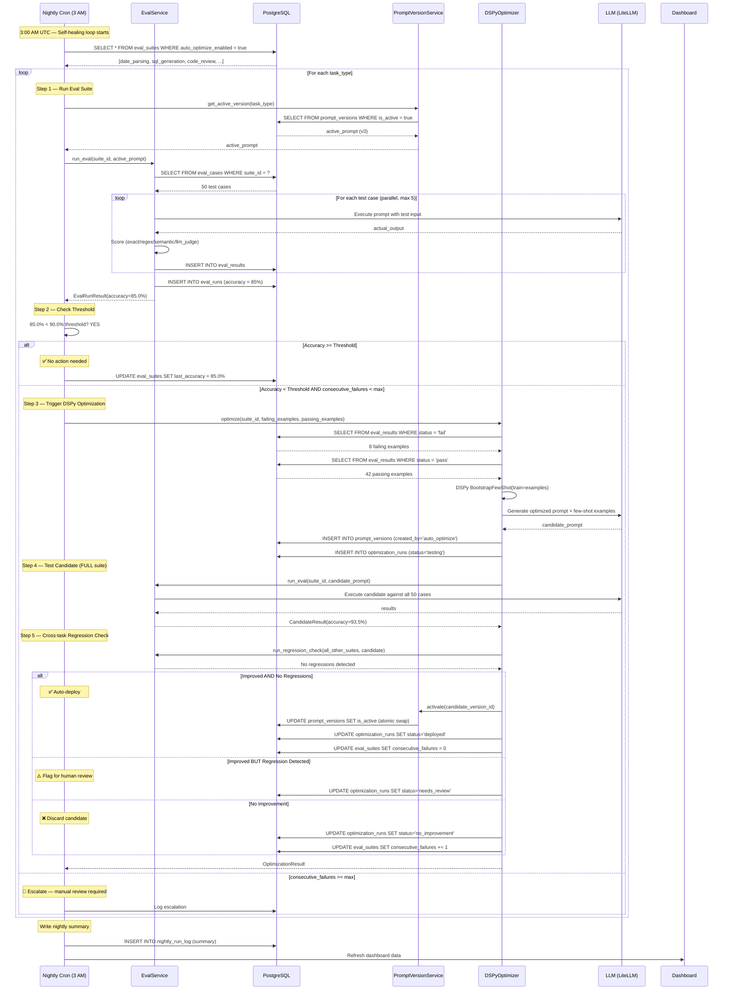

# Era 5 — Self-Improving Agent System

> **Purpose**: An agent system that automatically detects its weaknesses, optimizes its own prompts, and deploys improvements — without human intervention. The complete feedback loop: eval → detect weakness → optimize → test → deploy.
>
> **Context**: Life Graph is a brain-inspired memory microservice (FastAPI + PostgreSQL + pgvector). All prompts used by the AI pipeline (extraction, scoring, contradiction detection, consolidation) are candidates for self-optimization. This system layers on top of the existing architecture, adding closed-loop prompt quality management.
>
> **Architecture ref**: `KNOWLEDGE.md` for core architecture, `docs/ARCHITECTURE.md` for pipeline details
>
> **Key insight**: Nobody has built this. Most teams manually tune prompts. This system treats prompt quality as a **metric to be optimized continuously** — the same way DevOps treats uptime.

---

## Table of Contents

1. [Requirements](#requirements)
2. [Design](#design)
3. [Tasks](#tasks)

---

# Requirements

## Story 1: Eval Suite Definition & Execution

As an **AI engineer**, I want to define eval suites per task type (date parsing, SQL generation, code review, etc.) and run them against active prompts so that I can systematically measure prompt quality across all AI capabilities.

### Acceptance Criteria

- GIVEN I want to evaluate a task type WHEN I create an eval suite for "date_parsing" with 50 test cases (input → expected output pairs) THEN the system stores the suite in `eval_suites` with each case in `eval_cases`, tagged with the task_type
- GIVEN an eval suite exists for "sql_generation" WHEN I trigger a run manually or via cron THEN the system executes every test case against the currently active prompt for that task_type, scoring each response (exact_match, contains, regex, semantic_similarity, llm_judge)
- GIVEN an eval run is in progress WHEN a test case completes THEN the result (pass/fail, actual output, latency_ms, tokens_used, cost_usd) is recorded in `eval_results` immediately
- GIVEN an eval run completes WHEN all cases have been scored THEN a summary is written to `eval_runs`: total cases, passed, failed, errored, accuracy_pct, avg_latency_ms, p95_latency_ms, total_cost_usd, and duration_seconds
- GIVEN I want to add a test case with scoring type `semantic_similarity` WHEN I provide an expected output and a similarity threshold (default 0.85) THEN the eval runner computes cosine similarity between the actual and expected embeddings and marks pass if similarity ≥ threshold
- GIVEN the eval runner encounters an LLM timeout or API error WHEN scoring a test case THEN the case is marked as `error` (not `fail`), the error message is recorded, and the run continues with remaining cases
- GIVEN I want to understand failures WHEN I view an eval run's results THEN I can filter by status (pass/fail/error) and see per-case detail: input, expected output, actual output, score, latency, and failure reason

---

## Story 2: Nightly Automated Eval Runs

As a **platform operator**, I want eval suites to run automatically every night at 3 AM so that prompt quality is continuously monitored without manual intervention.

### Acceptance Criteria

- GIVEN the nightly cron fires at 3 AM UTC WHEN eval suites exist for task types ["date_parsing", "sql_generation", "code_review", "entity_extraction", "contradiction_detection"] THEN the system runs each suite sequentially against the currently active prompt for that task_type
- GIVEN a nightly eval run completes WHEN the results are stored THEN the system updates `eval_suites.last_run_at` and `eval_suites.last_accuracy_pct` for quick dashboard lookups
- GIVEN a nightly eval run for "sql_generation" completes with accuracy 87.5% WHEN the threshold is configured at 90% THEN the system flags this task_type for optimization and logs the gap: "sql_generation: 87.5% (threshold: 90.0%, gap: -2.5%)"
- GIVEN all nightly evals complete WHEN I check the next morning THEN I can see a full report: per-task accuracy, which tasks are below threshold, which triggered optimization, and total eval cost for the night
- GIVEN the nightly cron fails mid-run (DB outage, OOM) WHEN the error is caught THEN the cron marks the run as `error`, logs the failure with traceback, and continues with the next task_type (does not abort the entire batch)
- GIVEN the system has no eval suites configured WHEN the cron fires THEN it logs "No eval suites configured, skipping nightly eval" and exits cleanly without error

---

## Story 3: Prompt Version Management

As an **AI engineer**, I want every system prompt to be versioned with full history so that I can track changes, compare versions, and rollback if a new prompt degrades quality.

### Acceptance Criteria

- GIVEN I create a new prompt for task_type "date_parsing" WHEN it is saved THEN the system stores it in `prompt_versions` with version_number=1, is_active=true, created_by='human', and eval_score=NULL (not yet evaluated)
- GIVEN a prompt version is active for "date_parsing" WHEN I create a new version with updated prompt_text THEN the new version gets version_number=N+1 (auto-incremented), is_active=false by default, and the previous version remains active until the new one is explicitly activated
- GIVEN the auto-optimizer creates a new prompt WHEN it is saved THEN the version's created_by is set to 'auto_optimize' and the `optimization_run_id` links back to the optimization that produced it
- GIVEN I want to activate a specific version WHEN I call the activate endpoint THEN the system sets is_active=true on the target version, is_active=false on all other versions for that task_type, and logs the activation event
- GIVEN only one version can be active per task_type WHEN I try to activate a version while another is active THEN the system automatically deactivates the current active version (atomic swap within a transaction)
- GIVEN a new prompt version was deployed and quality dropped WHEN I trigger a rollback THEN the system deactivates the current version, reactivates the previous version, and logs the rollback with reason
- GIVEN I want to see the history WHEN I query versions for "date_parsing" THEN I see all versions sorted by version_number DESC with: version_number, prompt_text (truncated), few_shot_examples count, is_active, eval_score, created_by, created_at
- GIVEN I want to compare two versions WHEN I request a diff THEN the system returns a structured diff showing prompt_text changes and few_shot_examples additions/removals

---

## Story 4: DSPy Auto-Optimization

As a **platform operator**, I want the system to automatically optimize prompts using DSPy when eval accuracy drops below threshold so that prompt quality self-heals without human intervention.

### Acceptance Criteria

- GIVEN the nightly eval for "sql_generation" returns accuracy 85% WHEN the threshold is 90% THEN the system automatically triggers a DSPy optimization run, logged in `optimization_runs` with status='running'
- GIVEN optimization is triggered WHEN the system collects training data THEN it pulls the failing test cases from the most recent eval run as negative examples AND the passing test cases as positive examples, creating a balanced training set
- GIVEN training data is collected WHEN DSPy BootstrapFewShot runs THEN it generates: (1) an optimized system prompt and (2) up to 8 few-shot examples selected from the training data, stored as a new `prompt_versions` entry with created_by='auto_optimize'
- GIVEN DSPy produces a candidate prompt WHEN the system tests it THEN it runs the FULL eval suite for that task_type against the candidate (not just the failing cases) to measure overall accuracy
- GIVEN the candidate prompt scores higher than the current active prompt AND introduces no regressions on any other task_type WHEN the system evaluates deployment criteria THEN it automatically activates the candidate prompt and marks the optimization_run as status='deployed'
- GIVEN the candidate prompt scores higher on the target task_type BUT causes regressions on another task_type (accuracy drop > 2%) WHEN the system evaluates deployment criteria THEN it marks the optimization_run as status='needs_review', keeps the current prompt active, and creates a human review flag
- GIVEN the candidate prompt scores equal to or lower than the current prompt WHEN the system evaluates deployment criteria THEN it marks the optimization_run as status='no_improvement', discards the candidate, and logs "Optimization failed to improve: old=85.0%, new=83.5%"
- GIVEN an optimization run fails (DSPy crash, timeout, OOM) WHEN the error is caught THEN the run is marked as status='error' with the error message, the current prompt remains active, and an alert is logged
- GIVEN I want transparency WHEN I view an optimization run THEN I see: trigger reason, training data stats (positive/negative examples), old prompt vs new prompt diff, old score vs new score, deployment decision, and timestamp

---

## Story 5: Self-Healing Loop Orchestration

As a **platform operator**, I want the complete self-healing loop (eval → detect → optimize → test → deploy) to run autonomously every night so that prompt quality continuously improves without any human intervention.

### Acceptance Criteria

- GIVEN it is 3 AM UTC WHEN the self-healing cron fires THEN it executes the following pipeline for each registered task_type: (1) run eval suite → (2) check accuracy against threshold → (3) if below threshold, trigger DSPy optimization → (4) test candidate against full suite → (5) deploy if improved with no regressions, or flag for review
- GIVEN the pipeline runs for 5 task types WHEN all complete THEN a nightly summary is stored: task types evaluated, accuracy per type, optimizations triggered, optimizations deployed, optimizations flagged for review, total cost, total duration
- GIVEN the pipeline deploys an optimized prompt WHEN the next night's eval runs THEN the eval runs against the NEW active prompt, creating a continuous improvement loop
- GIVEN two consecutive optimization attempts fail for the same task_type WHEN the third nightly run triggers THEN the system skips optimization for that task_type and creates an escalation: "sql_generation has failed optimization 3 consecutive times — manual review required"
- GIVEN the self-healing loop is running WHEN I want to pause it for a task_type THEN I can set `auto_optimize_enabled=false` on the eval_suite, and the loop will skip that task_type (still runs eval, but won't trigger optimization)
- GIVEN the self-healing loop completes WHEN I check the dashboard the next morning THEN I see a clear timeline: "3:00 AM — Started | 3:12 AM — date_parsing: 95.2% ✅ | 3:28 AM — sql_generation: 85.0% ⚠️ → optimizing... | 3:45 AM — sql_generation: 92.1% ✅ deployed | 3:52 AM — Done"

---

## Story 6: Quality Dashboard

As a **platform operator**, I want a quality dashboard showing prompt quality trends, per-task accuracy, auto-fixes applied, and cost over time so that I can monitor the self-improving system's health at a glance.

### Acceptance Criteria

- GIVEN I navigate to the quality dashboard WHEN eval data exists THEN I see summary cards: overall accuracy (weighted average across all task types), task types monitored, auto-fixes applied this week, prompts pending human review, and total eval cost this month
- GIVEN the dashboard loads WHEN time-series data exists THEN I see a line chart showing accuracy % per task type over the last 30 days, with the 90% threshold marked as a horizontal line
- GIVEN the dashboard loads WHEN per-task data exists THEN I see a bar chart showing current accuracy per task type, color-coded: green (≥ 90%), yellow (80-89%), red (< 80%)
- GIVEN an auto-optimization was deployed this week WHEN I view "Auto-fixes Applied" THEN I see a list: task_type, old accuracy → new accuracy, prompt version deployed, and timestamp
- GIVEN optimization runs were flagged for review WHEN I view "Pending Review" THEN I see: task_type, candidate prompt (truncated), reason for flagging (e.g., "regression on entity_extraction: 94% → 91%"), and approve/reject actions
- GIVEN I approve a flagged optimization WHEN I click "Approve & Deploy" THEN the candidate prompt is activated, the optimization_run is marked status='deployed', and the dashboard updates
- GIVEN I reject a flagged optimization WHEN I click "Reject" with a reason THEN the candidate prompt is discarded, the optimization_run is marked status='rejected', and the reason is logged
- GIVEN I want cost visibility WHEN I view the cost panel THEN I see: eval cost per task type (line chart over time), optimization cost per run, total self-healing cost this month, and projected monthly cost
- GIVEN I want to drill into a task type WHEN I click on a task type in the bar chart THEN I see: version history, accuracy trend, last 10 eval runs with pass/fail breakdown, and the currently active prompt text

---

## Story 7: Failure Analysis & Training Data Management

As an **AI engineer**, I want detailed failure analysis stored with eval results so that I can understand WHY prompts fail and the auto-optimizer has high-quality training data.

### Acceptance Criteria

- GIVEN an eval case fails WHEN the result is stored THEN the system records: expected output, actual output, failure_type (wrong_format, wrong_content, partial_match, hallucination, timeout), and a similarity_score between expected and actual
- GIVEN I want to categorize failures WHEN I view failure analysis THEN I see failures grouped by failure_type with counts: "wrong_format: 12, wrong_content: 8, hallucination: 3, timeout: 2"
- GIVEN the auto-optimizer needs training data WHEN it collects examples THEN it pulls from `eval_results` WHERE status='fail' for the target task_type, filtering to the most recent eval run, and enriches each with the failure_type for context
- GIVEN I want to add a manual test case WHEN I create a case from a real-world failure I observed THEN I can add it to the eval suite with source='manual' and it becomes part of future eval runs AND optimization training data
- GIVEN failures are accumulating for a specific pattern WHEN the system detects 5+ failures with similarity_score > 0.8 (similar failures) THEN it groups them as a "failure cluster" and surfaces it on the dashboard: "Recurring failure: date parsing fails for ISO 8601 with timezone offsets"

---

# Design

## Architecture Overview

```
┌─────────────────────────────────────────────────────────────────────────────────┐
│                    SELF-IMPROVING AGENT SYSTEM (Era 5)                          │
│                                                                                 │
│  ┌────────────────┐   ┌──────────────────┐   ┌───────────────────────────────┐ │
│  │  Quality        │   │  FastAPI API      │   │  Background Workers (ARQ)    │ │
│  │  Dashboard      │   │                   │   │                              │ │
│  │  (Next.js)      │──▶│  /eval/*          │   │  ┌────────────────────────┐  │ │
│  │                 │   │  /prompts/*        │   │  │ NightlySelfHealCron    │  │ │
│  │  • Accuracy     │   │  /optimize/*       │   │  │ (3 AM UTC)             │  │ │
│  │    trends       │   │  /dashboard/*      │   │  │                        │  │ │
│  │  • Auto-fixes   │   │                   │   │  │ for each task_type:     │  │ │
│  │  • Pending      │   └────────┬──────────┘   │  │  1. Run eval suite     │  │ │
│  │    review       │            │              │  │  2. Check threshold    │  │ │
│  │  • Cost over    │            │              │  │  3. Optimize if needed │  │ │
│  │    time         │            ▼              │  │  4. Test candidate     │  │ │
│  └────────────────┘   ┌──────────────────┐   │  │  5. Deploy or flag     │  │ │
│                        │  PostgreSQL       │   │  └────────────────────────┘  │ │
│                        │                   │   │                              │ │
│                        │  ├─ eval_suites   │   │  ┌────────────────────────┐  │ │
│                        │  ├─ eval_cases    │   │  │ DSPy Optimizer         │  │ │
│                        │  ├─ eval_runs     │   │  │                        │  │ │
│                        │  ├─ eval_results  │   │  │ • Collect fail/pass    │  │ │
│                        │  ├─ prompt_       │   │  │ • BootstrapFewShot     │  │ │
│                        │  │  versions      │   │  │ • Generate candidate   │  │ │
│                        │  └─ optimization_ │   │  │ • Score vs full suite  │  │ │
│                        │     runs          │   │  └────────────────────────┘  │ │
│                        └──────────────────┘   └───────────────────────────────┘ │
└─────────────────────────────────────────────────────────────────────────────────┘
```

### Key Design Decisions

1. **Self-contained within Life Graph** — The self-improving system runs inside the existing FastAPI application. No separate service. Eval runs, optimization, and deployment all happen via internal service calls, not HTTP.
2. **DSPy as optimization engine** — DSPy's `BootstrapFewShot` is used because it requires no gradient descent, works with any LLM, and generates few-shot examples automatically. This is simpler and cheaper than fine-tuning.
3. **Full-suite validation before deployment** — A candidate prompt must pass the FULL eval suite, not just the failing cases. This prevents overfitting to failures while regressing on passing cases.
4. **Cross-task regression check** — Before deploying an optimized prompt for task A, the system runs all other task types' evals to ensure no cross-contamination (shared system context could affect other tasks).
5. **Human-in-the-loop for regressions** — The system auto-deploys only when improvement is clear and no regressions exist. Any ambiguous case (regression detected, marginal improvement) is flagged for human review.
6. **Exponential backoff on repeated failures** — If optimization fails 3 consecutive times for a task type, the system stops trying and escalates. This prevents infinite loops of wasted compute.
7. **Cost tracking everywhere** — Every eval run and optimization run tracks token usage and cost. The dashboard surfaces total self-healing cost so the operator can ensure ROI.

---

## Data Models

### SQL Schema

```sql
-- ============================================================
-- Eval Suites — one per task type
-- ============================================================
CREATE TABLE eval_suites (
  id                      TEXT PRIMARY KEY DEFAULT gen_random_uuid()::text,
  tenant_id               TEXT NOT NULL,
  task_type               TEXT NOT NULL,                     -- 'date_parsing', 'sql_generation', 'code_review', etc.
  name                    TEXT NOT NULL,                     -- Human-readable name
  description             TEXT,
  accuracy_threshold_pct  DECIMAL(5,2) NOT NULL DEFAULT 90.00,  -- Below this → trigger optimization
  auto_optimize_enabled   BOOLEAN NOT NULL DEFAULT true,     -- Can disable per-suite
  consecutive_failures    INT NOT NULL DEFAULT 0,            -- Count of failed optimization attempts
  max_consecutive_fails   INT NOT NULL DEFAULT 3,            -- Escalate after this many

  -- Denormalized for quick dashboard lookups
  case_count              INT NOT NULL DEFAULT 0,
  last_run_at             TIMESTAMPTZ,
  last_accuracy_pct       DECIMAL(5,2),

  created_at              TIMESTAMPTZ NOT NULL DEFAULT NOW(),
  updated_at              TIMESTAMPTZ NOT NULL DEFAULT NOW()
);

CREATE UNIQUE INDEX idx_es_tenant_task ON eval_suites(tenant_id, task_type);
CREATE INDEX idx_es_tenant ON eval_suites(tenant_id);
CREATE INDEX idx_es_auto_opt ON eval_suites(auto_optimize_enabled) WHERE auto_optimize_enabled = true;

-- ============================================================
-- Eval Cases — individual test cases within a suite
-- ============================================================
CREATE TABLE eval_cases (
  id                TEXT PRIMARY KEY DEFAULT gen_random_uuid()::text,
  suite_id          TEXT NOT NULL REFERENCES eval_suites(id) ON DELETE CASCADE,
  input_text        TEXT NOT NULL,                          -- The input to send to the prompt
  expected_output   TEXT NOT NULL,                          -- Ground truth expected response
  scoring_type      TEXT NOT NULL DEFAULT 'exact_match'     -- 'exact_match', 'contains', 'regex', 'semantic_similarity', 'llm_judge'
                    CHECK (scoring_type IN ('exact_match', 'contains', 'regex', 'semantic_similarity', 'llm_judge')),
  scoring_config    JSONB DEFAULT '{}',                     -- Type-specific config:
                                                            --   regex: { "pattern": "...", "flags": "i" }
                                                            --   semantic_similarity: { "threshold": 0.85 }
                                                            --   llm_judge: { "criteria": [...], "pass_threshold": 70 }
  metadata          JSONB DEFAULT '{}',                     -- Extra context: tags, difficulty, source
  source            TEXT NOT NULL DEFAULT 'manual',         -- 'manual', 'auto_generated', 'from_failure'
  is_active         BOOLEAN NOT NULL DEFAULT true,
  created_at        TIMESTAMPTZ NOT NULL DEFAULT NOW()
);

CREATE INDEX idx_ec_suite ON eval_cases(suite_id) WHERE is_active = true;
CREATE INDEX idx_ec_scoring ON eval_cases(suite_id, scoring_type);

-- ============================================================
-- Eval Runs — one record per suite execution
-- ============================================================
CREATE TABLE eval_runs (
  id                  TEXT PRIMARY KEY DEFAULT gen_random_uuid()::text,
  suite_id            TEXT NOT NULL REFERENCES eval_suites(id) ON DELETE CASCADE,
  prompt_version_id   TEXT NOT NULL,                         -- FK to prompt_versions.id
  trigger             TEXT NOT NULL DEFAULT 'manual',        -- 'manual', 'nightly_cron', 'optimization_test', 'regression_check'
  status              TEXT NOT NULL DEFAULT 'running'        -- 'running', 'completed', 'error', 'cancelled'
                      CHECK (status IN ('running', 'completed', 'error', 'cancelled')),

  -- Summary stats (populated on completion)
  total_cases         INT,
  passed              INT,
  failed              INT,
  errored             INT,
  accuracy_pct        DECIMAL(5,2),
  avg_latency_ms      FLOAT,
  p95_latency_ms      FLOAT,
  total_tokens        INT,
  total_cost_usd      DECIMAL(10,6),
  duration_seconds    FLOAT,

  error_message       TEXT,                                  -- If status = 'error'
  started_at          TIMESTAMPTZ NOT NULL DEFAULT NOW(),
  completed_at        TIMESTAMPTZ
);

CREATE INDEX idx_er_suite ON eval_runs(suite_id, started_at DESC);
CREATE INDEX idx_er_prompt ON eval_runs(prompt_version_id);
CREATE INDEX idx_er_trigger ON eval_runs(trigger, started_at DESC);

-- ============================================================
-- Eval Results — per-case results within a run
-- ============================================================
CREATE TABLE eval_results (
  id                  TEXT PRIMARY KEY DEFAULT gen_random_uuid()::text,
  run_id              TEXT NOT NULL REFERENCES eval_runs(id) ON DELETE CASCADE,
  case_id             TEXT NOT NULL REFERENCES eval_cases(id) ON DELETE CASCADE,
  status              TEXT NOT NULL                           -- 'pass', 'fail', 'error'
                      CHECK (status IN ('pass', 'fail', 'error')),
  actual_output       TEXT,                                   -- What the prompt actually returned
  score               DECIMAL(5,4),                           -- 0.0000 - 1.0000 (for semantic/llm_judge)
  failure_type        TEXT,                                   -- 'wrong_format', 'wrong_content', 'partial_match',
                                                              -- 'hallucination', 'timeout', 'crash'
  failure_reason      TEXT,                                   -- Human-readable explanation
  similarity_score    DECIMAL(5,4),                           -- Cosine similarity between expected & actual
  latency_ms          INT,
  tokens_used         INT,
  cost_usd            DECIMAL(10,6),
  error_message       TEXT,                                   -- If status = 'error'
  created_at          TIMESTAMPTZ NOT NULL DEFAULT NOW()
);

CREATE INDEX idx_eres_run ON eval_results(run_id);
CREATE INDEX idx_eres_case ON eval_results(case_id);
CREATE INDEX idx_eres_status ON eval_results(run_id, status);
CREATE INDEX idx_eres_failure ON eval_results(run_id, failure_type) WHERE status = 'fail';

-- ============================================================
-- Prompt Versions — versioned prompt storage
-- ============================================================
CREATE TABLE prompt_versions (
  id                    TEXT PRIMARY KEY DEFAULT gen_random_uuid()::text,
  tenant_id             TEXT NOT NULL,
  task_type             TEXT NOT NULL,                        -- 'date_parsing', 'sql_generation', etc.
  version_number        INT NOT NULL,                        -- Auto-incremented per task_type
  prompt_text           TEXT NOT NULL,                        -- The full system prompt
  few_shot_examples     JSONB DEFAULT '[]',                  -- Array of { "input": "...", "output": "..." }
  is_active             BOOLEAN NOT NULL DEFAULT false,       -- Only ONE active per task_type per tenant
  eval_score            DECIMAL(5,2),                         -- Last eval accuracy % for this version
  created_by            TEXT NOT NULL DEFAULT 'human',        -- 'human' or 'auto_optimize'
  optimization_run_id   TEXT,                                 -- FK to optimization_runs.id (if auto-generated)
  change_note           TEXT,                                 -- "Improved date format handling"
  activated_at          TIMESTAMPTZ,                          -- When this version was activated
  deactivated_at        TIMESTAMPTZ,                          -- When this version was deactivated
  created_at            TIMESTAMPTZ NOT NULL DEFAULT NOW()
);

-- Only one active version per task_type per tenant
CREATE UNIQUE INDEX idx_pv_active ON prompt_versions(tenant_id, task_type)
  WHERE is_active = true;
CREATE UNIQUE INDEX idx_pv_version ON prompt_versions(tenant_id, task_type, version_number);
CREATE INDEX idx_pv_tenant_task ON prompt_versions(tenant_id, task_type, version_number DESC);
CREATE INDEX idx_pv_created_by ON prompt_versions(created_by);

-- ============================================================
-- Optimization Runs — DSPy auto-optimization attempts
-- ============================================================
CREATE TABLE optimization_runs (
  id                        TEXT PRIMARY KEY DEFAULT gen_random_uuid()::text,
  tenant_id                 TEXT NOT NULL,
  suite_id                  TEXT NOT NULL REFERENCES eval_suites(id),
  task_type                 TEXT NOT NULL,

  -- Trigger context
  trigger_eval_run_id       TEXT NOT NULL REFERENCES eval_runs(id),
  trigger_accuracy_pct      DECIMAL(5,2) NOT NULL,            -- The accuracy that triggered optimization
  threshold_pct             DECIMAL(5,2) NOT NULL,            -- The threshold it was below

  -- Training data stats
  training_positive_count   INT,                              -- Passing examples used
  training_negative_count   INT,                              -- Failing examples used

  -- Candidate prompt
  candidate_version_id      TEXT REFERENCES prompt_versions(id), -- The new prompt version generated
  candidate_eval_run_id     TEXT REFERENCES eval_runs(id),       -- The eval run testing the candidate
  candidate_accuracy_pct    DECIMAL(5,2),                        -- Candidate's eval score

  -- Previous prompt reference
  previous_version_id       TEXT REFERENCES prompt_versions(id),
  previous_accuracy_pct     DECIMAL(5,2),

  -- Deployment decision
  status                    TEXT NOT NULL DEFAULT 'running'
                            CHECK (status IN (
                              'running',          -- Optimization in progress
                              'testing',          -- Candidate being evaluated
                              'deployed',         -- Candidate deployed successfully
                              'no_improvement',   -- Candidate didn't beat current
                              'needs_review',     -- Regression detected, needs human
                              'rejected',         -- Human rejected the candidate
                              'error'             -- Something crashed
                            )),
  regression_details        JSONB,                            -- If needs_review: which tasks regressed
  review_decision           TEXT,                             -- 'approved' or 'rejected'
  review_reason             TEXT,                             -- Human's reason for decision
  reviewed_by               TEXT,                             -- Who reviewed
  reviewed_at               TIMESTAMPTZ,

  -- Cost tracking
  optimization_tokens       INT,
  optimization_cost_usd     DECIMAL(10,6),
  eval_tokens               INT,
  eval_cost_usd             DECIMAL(10,6),
  total_cost_usd            DECIMAL(10,6),

  error_message             TEXT,
  started_at                TIMESTAMPTZ NOT NULL DEFAULT NOW(),
  completed_at              TIMESTAMPTZ
);

CREATE INDEX idx_or_tenant ON optimization_runs(tenant_id, started_at DESC);
CREATE INDEX idx_or_task ON optimization_runs(task_type, started_at DESC);
CREATE INDEX idx_or_status ON optimization_runs(status);
CREATE INDEX idx_or_review ON optimization_runs(status) WHERE status = 'needs_review';

-- ============================================================
-- Nightly Run Log — top-level record per nightly self-heal cycle
-- ============================================================
CREATE TABLE nightly_run_log (
  id                    TEXT PRIMARY KEY DEFAULT gen_random_uuid()::text,
  tenant_id             TEXT NOT NULL,
  status                TEXT NOT NULL DEFAULT 'running'
                        CHECK (status IN ('running', 'completed', 'partial', 'error')),
  task_types_evaluated  INT NOT NULL DEFAULT 0,
  optimizations_triggered INT NOT NULL DEFAULT 0,
  optimizations_deployed  INT NOT NULL DEFAULT 0,
  optimizations_flagged   INT NOT NULL DEFAULT 0,
  total_eval_cost_usd   DECIMAL(10,6),
  total_opt_cost_usd    DECIMAL(10,6),
  total_cost_usd        DECIMAL(10,6),
  duration_seconds      FLOAT,
  summary               JSONB,                               -- Per-task breakdown: [{task_type, accuracy, action, result}]
  error_message         TEXT,
  started_at            TIMESTAMPTZ NOT NULL DEFAULT NOW(),
  completed_at          TIMESTAMPTZ
);

CREATE INDEX idx_nrl_tenant ON nightly_run_log(tenant_id, started_at DESC);
```

---

## API Contracts

### Module Structure

```
life_graph/
├── self_improving/
│   ├── __init__.py
│   ├── router.py                    # FastAPI router: /api/v1/self-improving/*
│   ├── eval_service.py              # Eval suite CRUD + runner
│   ├── eval_scorer.py               # Scoring implementations (exact, regex, semantic, llm_judge)
│   ├── prompt_version_service.py    # Prompt CRUD + version management
│   ├── optimizer_service.py         # DSPy optimization orchestration
│   ├── nightly_cron.py              # Self-healing loop cron job
│   ├── dashboard_service.py         # Dashboard aggregation queries
│   ├── models.py                    # SQLAlchemy models for all 6 tables
│   └── schemas.py                   # Pydantic request/response schemas
```

---

### Eval Suite Endpoints

#### Create Eval Suite

```
POST /api/v1/self-improving/eval-suites
X-Tenant-ID: tenant_abc
```

**Request:**
```json
{
  "task_type": "sql_generation",
  "name": "SQL Generation Eval Suite",
  "description": "Validates SQL query generation from natural language",
  "accuracy_threshold_pct": 90.0,
  "auto_optimize_enabled": true
}
```

**Response (201):**
```json
{
  "id": "es_abc123",
  "tenant_id": "tenant_abc",
  "task_type": "sql_generation",
  "name": "SQL Generation Eval Suite",
  "description": "Validates SQL query generation from natural language",
  "accuracy_threshold_pct": 90.0,
  "auto_optimize_enabled": true,
  "case_count": 0,
  "last_run_at": null,
  "last_accuracy_pct": null,
  "created_at": "2026-07-07T03:00:00Z"
}
```

#### List Eval Suites

```
GET /api/v1/self-improving/eval-suites
X-Tenant-ID: tenant_abc
```

**Response (200):**
```json
{
  "suites": [
    {
      "id": "es_abc123",
      "task_type": "sql_generation",
      "name": "SQL Generation Eval Suite",
      "accuracy_threshold_pct": 90.0,
      "auto_optimize_enabled": true,
      "case_count": 50,
      "last_run_at": "2026-07-07T03:12:00Z",
      "last_accuracy_pct": 92.0
    }
  ],
  "total": 1
}
```

---

### Eval Case Endpoints

#### Add Test Case

```
POST /api/v1/self-improving/eval-suites/{suite_id}/cases
X-Tenant-ID: tenant_abc
```

**Request:**
```json
{
  "input_text": "Show me all orders from last month",
  "expected_output": "SELECT * FROM orders WHERE created_at >= DATE_TRUNC('month', NOW() - INTERVAL '1 month') AND created_at < DATE_TRUNC('month', NOW())",
  "scoring_type": "semantic_similarity",
  "scoring_config": { "threshold": 0.85 },
  "metadata": { "difficulty": "medium", "tags": ["date_range", "relative_time"] }
}
```

**Response (201):**
```json
{
  "id": "ec_def456",
  "suite_id": "es_abc123",
  "input_text": "Show me all orders from last month",
  "expected_output": "SELECT * FROM orders WHERE ...",
  "scoring_type": "semantic_similarity",
  "scoring_config": { "threshold": 0.85 },
  "source": "manual",
  "is_active": true,
  "created_at": "2026-07-07T10:00:00Z"
}
```

#### Bulk Import Cases

```
POST /api/v1/self-improving/eval-suites/{suite_id}/cases/bulk
X-Tenant-ID: tenant_abc
Content-Type: application/json
```

**Request:**
```json
{
  "cases": [
    {
      "input_text": "How many users signed up today?",
      "expected_output": "SELECT COUNT(*) FROM users WHERE created_at::date = CURRENT_DATE",
      "scoring_type": "semantic_similarity"
    },
    {
      "input_text": "List top 5 products by revenue",
      "expected_output": "SELECT p.name, SUM(oi.price * oi.quantity) AS revenue FROM products p JOIN order_items oi ON p.id = oi.product_id GROUP BY p.name ORDER BY revenue DESC LIMIT 5",
      "scoring_type": "semantic_similarity"
    }
  ]
}
```

**Response (201):**
```json
{
  "created": 2,
  "skipped": 0,
  "errors": []
}
```

---

### Eval Run Endpoints

#### Trigger Eval Run

```
POST /api/v1/self-improving/eval-suites/{suite_id}/run
X-Tenant-ID: tenant_abc
```

**Request:**
```json
{
  "prompt_version_id": "pv_ghi789",
  "trigger": "manual"
}
```

**Response (202):**
```json
{
  "run_id": "er_jkl012",
  "suite_id": "es_abc123",
  "status": "running",
  "total_cases": 50,
  "started_at": "2026-07-07T10:30:00Z"
}
```

#### Get Eval Run Results

```
GET /api/v1/self-improving/eval-runs/{run_id}
X-Tenant-ID: tenant_abc
```

**Response (200):**
```json
{
  "id": "er_jkl012",
  "suite_id": "es_abc123",
  "prompt_version_id": "pv_ghi789",
  "trigger": "manual",
  "status": "completed",
  "total_cases": 50,
  "passed": 46,
  "failed": 3,
  "errored": 1,
  "accuracy_pct": 92.0,
  "avg_latency_ms": 245.3,
  "p95_latency_ms": 512.0,
  "total_tokens": 12500,
  "total_cost_usd": 0.0375,
  "duration_seconds": 42.7,
  "started_at": "2026-07-07T10:30:00Z",
  "completed_at": "2026-07-07T10:30:43Z",
  "results": [
    {
      "case_id": "ec_def456",
      "status": "pass",
      "actual_output": "SELECT * FROM orders WHERE ...",
      "score": 0.9312,
      "similarity_score": 0.9312,
      "latency_ms": 198,
      "tokens_used": 250,
      "cost_usd": 0.00075
    },
    {
      "case_id": "ec_mno345",
      "status": "fail",
      "actual_output": "SELECT * FROM users",
      "score": 0.4521,
      "failure_type": "wrong_content",
      "failure_reason": "Missing WHERE clause for date filter",
      "similarity_score": 0.4521,
      "latency_ms": 210,
      "tokens_used": 180,
      "cost_usd": 0.00054
    }
  ]
}
```

#### Get Eval Run Failure Analysis

```
GET /api/v1/self-improving/eval-runs/{run_id}/failures
X-Tenant-ID: tenant_abc
```

**Response (200):**
```json
{
  "run_id": "er_jkl012",
  "total_failures": 3,
  "by_failure_type": {
    "wrong_content": 2,
    "wrong_format": 1
  },
  "failure_clusters": [
    {
      "pattern": "Date range queries with relative time expressions",
      "count": 2,
      "avg_similarity": 0.42,
      "case_ids": ["ec_mno345", "ec_pqr678"]
    }
  ],
  "failures": [
    {
      "case_id": "ec_mno345",
      "input_text": "How many users signed up today?",
      "expected_output": "SELECT COUNT(*) FROM users WHERE created_at::date = CURRENT_DATE",
      "actual_output": "SELECT * FROM users",
      "failure_type": "wrong_content",
      "failure_reason": "Missing WHERE clause for date filter",
      "similarity_score": 0.4521
    }
  ]
}
```

---

### Prompt Version Endpoints

#### Create Prompt Version

```
POST /api/v1/self-improving/prompt-versions
X-Tenant-ID: tenant_abc
```

**Request:**
```json
{
  "task_type": "sql_generation",
  "prompt_text": "You are a SQL expert. Convert natural language queries to PostgreSQL SQL...",
  "few_shot_examples": [
    {
      "input": "Show all active users",
      "output": "SELECT * FROM users WHERE status = 'active'"
    }
  ],
  "change_note": "Added few-shot example for active user queries",
  "created_by": "human"
}
```

**Response (201):**
```json
{
  "id": "pv_new123",
  "tenant_id": "tenant_abc",
  "task_type": "sql_generation",
  "version_number": 4,
  "prompt_text": "You are a SQL expert...",
  "few_shot_examples": [...],
  "is_active": false,
  "eval_score": null,
  "created_by": "human",
  "created_at": "2026-07-07T11:00:00Z"
}
```

#### Activate Prompt Version

```
POST /api/v1/self-improving/prompt-versions/{version_id}/activate
X-Tenant-ID: tenant_abc
```

**Response (200):**
```json
{
  "id": "pv_new123",
  "task_type": "sql_generation",
  "version_number": 4,
  "is_active": true,
  "activated_at": "2026-07-07T11:05:00Z",
  "deactivated_version": {
    "id": "pv_old789",
    "version_number": 3,
    "deactivated_at": "2026-07-07T11:05:00Z"
  }
}
```

#### Rollback Prompt Version

```
POST /api/v1/self-improving/prompt-versions/{version_id}/rollback
X-Tenant-ID: tenant_abc
```

**Request:**
```json
{
  "reason": "New version caused accuracy regression on date parsing"
}
```

**Response (200):**
```json
{
  "rolled_back_to": {
    "id": "pv_old789",
    "version_number": 3,
    "is_active": true,
    "activated_at": "2026-07-07T11:10:00Z"
  },
  "deactivated": {
    "id": "pv_new123",
    "version_number": 4,
    "is_active": false,
    "deactivated_at": "2026-07-07T11:10:00Z"
  },
  "rollback_reason": "New version caused accuracy regression on date parsing"
}
```

#### List Prompt Versions

```
GET /api/v1/self-improving/prompt-versions?task_type=sql_generation
X-Tenant-ID: tenant_abc
```

**Response (200):**
```json
{
  "versions": [
    {
      "id": "pv_old789",
      "version_number": 3,
      "prompt_text": "You are a SQL expert...",
      "few_shot_examples_count": 5,
      "is_active": true,
      "eval_score": 92.0,
      "created_by": "auto_optimize",
      "optimization_run_id": "or_xyz789",
      "activated_at": "2026-07-06T03:45:00Z",
      "created_at": "2026-07-06T03:42:00Z"
    },
    {
      "id": "pv_older456",
      "version_number": 2,
      "prompt_text": "Convert the following...",
      "few_shot_examples_count": 3,
      "is_active": false,
      "eval_score": 85.0,
      "created_by": "human",
      "activated_at": "2026-07-01T10:00:00Z",
      "deactivated_at": "2026-07-06T03:45:00Z",
      "created_at": "2026-07-01T10:00:00Z"
    }
  ],
  "total": 3
}
```

---

### Optimization Endpoints

#### Trigger Manual Optimization

```
POST /api/v1/self-improving/optimize/{suite_id}
X-Tenant-ID: tenant_abc
```

**Response (202):**
```json
{
  "optimization_run_id": "or_abc123",
  "task_type": "sql_generation",
  "status": "running",
  "trigger_accuracy_pct": 85.0,
  "threshold_pct": 90.0,
  "started_at": "2026-07-07T12:00:00Z"
}
```

#### Get Optimization Run

```
GET /api/v1/self-improving/optimization-runs/{run_id}
X-Tenant-ID: tenant_abc
```

**Response (200):**
```json
{
  "id": "or_abc123",
  "task_type": "sql_generation",
  "status": "deployed",
  "trigger_accuracy_pct": 85.0,
  "threshold_pct": 90.0,
  "training_positive_count": 42,
  "training_negative_count": 8,
  "previous_version_id": "pv_old789",
  "previous_accuracy_pct": 85.0,
  "candidate_version_id": "pv_new123",
  "candidate_accuracy_pct": 93.5,
  "improvement_pct": 8.5,
  "optimization_cost_usd": 0.125,
  "eval_cost_usd": 0.0375,
  "total_cost_usd": 0.1625,
  "started_at": "2026-07-07T03:28:00Z",
  "completed_at": "2026-07-07T03:45:00Z"
}
```

#### Review Flagged Optimization

```
POST /api/v1/self-improving/optimization-runs/{run_id}/review
X-Tenant-ID: tenant_abc
```

**Request:**
```json
{
  "decision": "approved",
  "reason": "Regression on entity_extraction is within acceptable margin (94% → 92.5%)",
  "reviewed_by": "user_abc"
}
```

**Response (200):**
```json
{
  "id": "or_abc123",
  "status": "deployed",
  "review_decision": "approved",
  "review_reason": "Regression on entity_extraction is within acceptable margin",
  "reviewed_by": "user_abc",
  "reviewed_at": "2026-07-07T09:30:00Z",
  "candidate_version_id": "pv_new123",
  "activated": true
}
```

---

### Dashboard Endpoints

#### Get Quality Overview

```
GET /api/v1/self-improving/dashboard/overview
X-Tenant-ID: tenant_abc
```

**Response (200):**
```json
{
  "overall_accuracy_pct": 93.2,
  "task_types_monitored": 5,
  "auto_fixes_this_week": 2,
  "pending_review_count": 1,
  "total_eval_cost_this_month_usd": 1.25,
  "total_optimization_cost_this_month_usd": 0.85,
  "last_nightly_run": {
    "started_at": "2026-07-07T03:00:00Z",
    "status": "completed",
    "duration_seconds": 312.5
  }
}
```

#### Get Accuracy Trends (Line Chart Data)

```
GET /api/v1/self-improving/dashboard/accuracy-trends?days=30
X-Tenant-ID: tenant_abc
```

**Response (200):**
```json
{
  "threshold_pct": 90.0,
  "series": [
    {
      "task_type": "date_parsing",
      "data_points": [
        { "date": "2026-06-07", "accuracy_pct": 88.0 },
        { "date": "2026-06-08", "accuracy_pct": 88.0 },
        { "date": "2026-06-09", "accuracy_pct": 93.5 },
        { "date": "2026-07-07", "accuracy_pct": 95.2 }
      ]
    },
    {
      "task_type": "sql_generation",
      "data_points": [
        { "date": "2026-06-07", "accuracy_pct": 82.0 },
        { "date": "2026-06-08", "accuracy_pct": 82.0 },
        { "date": "2026-06-09", "accuracy_pct": 91.0 },
        { "date": "2026-07-07", "accuracy_pct": 93.5 }
      ]
    }
  ]
}
```

#### Get Per-Task Accuracy (Bar Chart Data)

```
GET /api/v1/self-improving/dashboard/per-task-accuracy
X-Tenant-ID: tenant_abc
```

**Response (200):**
```json
{
  "threshold_pct": 90.0,
  "tasks": [
    { "task_type": "date_parsing", "accuracy_pct": 95.2, "status": "healthy" },
    { "task_type": "sql_generation", "accuracy_pct": 93.5, "status": "healthy" },
    { "task_type": "code_review", "accuracy_pct": 87.0, "status": "warning" },
    { "task_type": "entity_extraction", "accuracy_pct": 96.1, "status": "healthy" },
    { "task_type": "contradiction_detection", "accuracy_pct": 78.5, "status": "critical" }
  ]
}
```

#### Get Auto-Fixes Applied

```
GET /api/v1/self-improving/dashboard/auto-fixes?days=7
X-Tenant-ID: tenant_abc
```

**Response (200):**
```json
{
  "fixes": [
    {
      "task_type": "sql_generation",
      "old_accuracy_pct": 85.0,
      "new_accuracy_pct": 93.5,
      "improvement_pct": 8.5,
      "prompt_version_deployed": "pv_new123",
      "version_number": 4,
      "deployed_at": "2026-07-07T03:45:00Z"
    },
    {
      "task_type": "date_parsing",
      "old_accuracy_pct": 88.0,
      "new_accuracy_pct": 95.2,
      "improvement_pct": 7.2,
      "prompt_version_deployed": "pv_dp_v3",
      "version_number": 3,
      "deployed_at": "2026-07-05T03:32:00Z"
    }
  ],
  "total": 2
}
```

#### Get Cost Over Time

```
GET /api/v1/self-improving/dashboard/cost-trends?days=30
X-Tenant-ID: tenant_abc
```

**Response (200):**
```json
{
  "daily_costs": [
    {
      "date": "2026-07-07",
      "eval_cost_usd": 0.0375,
      "optimization_cost_usd": 0.125,
      "total_cost_usd": 0.1625
    },
    {
      "date": "2026-07-06",
      "eval_cost_usd": 0.0350,
      "optimization_cost_usd": 0.0,
      "total_cost_usd": 0.0350
    }
  ],
  "monthly_total_usd": 2.10,
  "projected_monthly_usd": 4.50
}
```

#### Get Pending Reviews

```
GET /api/v1/self-improving/dashboard/pending-reviews
X-Tenant-ID: tenant_abc
```

**Response (200):**
```json
{
  "pending": [
    {
      "optimization_run_id": "or_flag456",
      "task_type": "code_review",
      "candidate_accuracy_pct": 91.0,
      "previous_accuracy_pct": 87.0,
      "regression_details": {
        "entity_extraction": { "before": 96.1, "after": 93.8, "delta": -2.3 }
      },
      "candidate_prompt_preview": "You are a senior code reviewer...",
      "created_at": "2026-07-07T03:50:00Z"
    }
  ],
  "total": 1
}
```

---

## Sequence Diagram — Self-Healing Loop



---

## Core Python Implementation

### Nightly Self-Healing Cron

```python
"""
life_graph/self_improving/nightly_cron.py

The complete self-healing loop. Registered as an ARQ cron job at 3 AM UTC.
"""

import logging
import time
from datetime import datetime, timezone
from decimal import Decimal

from sqlalchemy import select, update
from sqlalchemy.ext.asyncio import AsyncSession

from life_graph.self_improving.eval_service import EvalService
from life_graph.self_improving.optimizer_service import DSPyOptimizerService
from life_graph.self_improving.prompt_version_service import PromptVersionService
from life_graph.self_improving.models import EvalSuite, NightlyRunLog

logger = logging.getLogger(__name__)


async def nightly_self_heal(ctx: dict) -> dict:
    """
    The self-healing loop. For each task_type:
    1. Run eval suite against current active prompt
    2. Check accuracy against threshold
    3. If below threshold, trigger DSPy optimization
    4. Test candidate against FULL eval suite
    5. Deploy if improved with no regressions, else flag for review

    Registered in workers/settings.py as:
        cron_jobs = [cron(nightly_self_heal, hour=3, minute=0)]
    """
    db: AsyncSession = ctx["db"]
    eval_service = EvalService(db)
    prompt_service = PromptVersionService(db)
    optimizer = DSPyOptimizerService(db, eval_service, prompt_service)

    # Fetch all enabled eval suites
    result = await db.execute(
        select(EvalSuite)
        .where(EvalSuite.auto_optimize_enabled.is_(True))
        .order_by(EvalSuite.task_type)
    )
    suites = result.scalars().all()

    if not suites:
        logger.info("No eval suites configured, skipping nightly eval")
        return {"status": "skipped", "reason": "no_suites"}

    # Create nightly run log
    nightly_log = NightlyRunLog(
        tenant_id=suites[0].tenant_id,  # Single-tenant for now
        status="running",
    )
    db.add(nightly_log)
    await db.flush()

    start_time = time.monotonic()
    summary = []
    total_eval_cost = Decimal("0")
    total_opt_cost = Decimal("0")
    optimizations_triggered = 0
    optimizations_deployed = 0
    optimizations_flagged = 0

    for suite in suites:
        task_result = {
            "task_type": suite.task_type,
            "action": "eval_only",
            "result": "healthy",
        }

        try:
            # ── Step 1: Run eval suite ──────────────────────────────
            logger.info(f"[{suite.task_type}] Running eval suite...")
            active_prompt = await prompt_service.get_active_version(
                suite.tenant_id, suite.task_type
            )
            if not active_prompt:
                logger.warning(f"[{suite.task_type}] No active prompt, skipping")
                task_result["result"] = "skipped_no_prompt"
                summary.append(task_result)
                continue

            eval_run = await eval_service.run_eval(
                suite_id=suite.id,
                prompt_version_id=active_prompt.id,
                trigger="nightly_cron",
            )
            total_eval_cost += eval_run.total_cost_usd or Decimal("0")

            task_result["accuracy_pct"] = float(eval_run.accuracy_pct)
            logger.info(
                f"[{suite.task_type}] Eval complete: "
                f"{eval_run.accuracy_pct}% accuracy "
                f"({eval_run.passed}/{eval_run.total_cases} passed)"
            )

            # Update suite denormalized fields
            suite.last_run_at = datetime.now(timezone.utc)
            suite.last_accuracy_pct = eval_run.accuracy_pct

            # ── Step 2: Check threshold ─────────────────────────────
            if eval_run.accuracy_pct >= suite.accuracy_threshold_pct:
                logger.info(
                    f"[{suite.task_type}] ✅ Above threshold "
                    f"({eval_run.accuracy_pct}% >= {suite.accuracy_threshold_pct}%)"
                )
                suite.consecutive_failures = 0
                task_result["result"] = "healthy"
                summary.append(task_result)
                continue

            # Below threshold — check if we should optimize
            logger.warning(
                f"[{suite.task_type}] ⚠️ Below threshold: "
                f"{eval_run.accuracy_pct}% < {suite.accuracy_threshold_pct}% "
                f"(gap: {suite.accuracy_threshold_pct - eval_run.accuracy_pct}%)"
            )

            # Check consecutive failure limit
            if suite.consecutive_failures >= suite.max_consecutive_fails:
                logger.error(
                    f"[{suite.task_type}] 🚨 Exceeded max consecutive failures "
                    f"({suite.consecutive_failures}/{suite.max_consecutive_fails}). "
                    f"Escalating — manual review required."
                )
                task_result["action"] = "escalated"
                task_result["result"] = "needs_manual_intervention"
                summary.append(task_result)
                continue

            # ── Step 3: Trigger DSPy optimization ───────────────────
            logger.info(f"[{suite.task_type}] Triggering DSPy optimization...")
            optimizations_triggered += 1
            task_result["action"] = "optimized"

            opt_result = await optimizer.optimize(
                suite=suite,
                trigger_eval_run=eval_run,
                active_prompt=active_prompt,
            )
            total_opt_cost += opt_result.total_cost_usd or Decimal("0")

            if opt_result.status == "deployed":
                logger.info(
                    f"[{suite.task_type}] ✅ Optimization deployed: "
                    f"{opt_result.previous_accuracy_pct}% → "
                    f"{opt_result.candidate_accuracy_pct}%"
                )
                optimizations_deployed += 1
                suite.consecutive_failures = 0
                task_result["result"] = "deployed"
                task_result["old_accuracy"] = float(opt_result.previous_accuracy_pct)
                task_result["new_accuracy"] = float(opt_result.candidate_accuracy_pct)

            elif opt_result.status == "needs_review":
                logger.warning(
                    f"[{suite.task_type}] ⚠️ Optimization flagged for review: "
                    f"regression detected"
                )
                optimizations_flagged += 1
                task_result["result"] = "needs_review"
                task_result["regression_details"] = opt_result.regression_details

            elif opt_result.status == "no_improvement":
                logger.warning(
                    f"[{suite.task_type}] ❌ Optimization failed to improve: "
                    f"{opt_result.previous_accuracy_pct}% → "
                    f"{opt_result.candidate_accuracy_pct}%"
                )
                suite.consecutive_failures += 1
                task_result["result"] = "no_improvement"

            elif opt_result.status == "error":
                logger.error(
                    f"[{suite.task_type}] ❌ Optimization error: "
                    f"{opt_result.error_message}"
                )
                suite.consecutive_failures += 1
                task_result["result"] = "error"
                task_result["error"] = opt_result.error_message

        except Exception as e:
            logger.exception(f"[{suite.task_type}] Unexpected error in self-heal loop")
            task_result["result"] = "error"
            task_result["error"] = str(e)

        summary.append(task_result)

    # ── Finalize nightly log ────────────────────────────────────────
    elapsed = time.monotonic() - start_time
    nightly_log.status = "completed"
    nightly_log.task_types_evaluated = len(suites)
    nightly_log.optimizations_triggered = optimizations_triggered
    nightly_log.optimizations_deployed = optimizations_deployed
    nightly_log.optimizations_flagged = optimizations_flagged
    nightly_log.total_eval_cost_usd = total_eval_cost
    nightly_log.total_opt_cost_usd = total_opt_cost
    nightly_log.total_cost_usd = total_eval_cost + total_opt_cost
    nightly_log.duration_seconds = elapsed
    nightly_log.summary = summary
    nightly_log.completed_at = datetime.now(timezone.utc)

    await db.commit()

    logger.info(
        f"Nightly self-heal complete: "
        f"{len(suites)} tasks evaluated, "
        f"{optimizations_triggered} optimizations triggered, "
        f"{optimizations_deployed} deployed, "
        f"{optimizations_flagged} flagged for review, "
        f"total cost: ${total_eval_cost + total_opt_cost:.4f}, "
        f"duration: {elapsed:.1f}s"
    )

    return {
        "status": "completed",
        "summary": summary,
        "total_cost_usd": float(total_eval_cost + total_opt_cost),
        "duration_seconds": elapsed,
    }
```

### DSPy BootstrapFewShot Integration

```python
"""
life_graph/self_improving/optimizer_service.py

DSPy-based prompt optimization. Collects failing/passing examples from eval results,
runs BootstrapFewShot to generate better prompt + few-shot examples, then validates
the candidate against the full eval suite before deployment.
"""

import logging
import time
from dataclasses import dataclass
from decimal import Decimal
from typing import Optional

import dspy
from sqlalchemy import select
from sqlalchemy.ext.asyncio import AsyncSession

from life_graph.self_improving.eval_service import EvalService
from life_graph.self_improving.models import (
    EvalResult,
    EvalRun,
    EvalSuite,
    OptimizationRun,
    PromptVersion,
)
from life_graph.self_improving.prompt_version_service import PromptVersionService

logger = logging.getLogger(__name__)


# ── DSPy Signature ──────────────────────────────────────────────────
class TaskSignature(dspy.Signature):
    """Execute a task given input text and return the expected output format."""

    input_text: str = dspy.InputField(desc="The input to process")
    output: str = dspy.OutputField(desc="The correctly formatted output")


class TaskModule(dspy.Module):
    """DSPy module wrapping the task execution with optimizable prompt."""

    def __init__(self):
        super().__init__()
        self.generate = dspy.ChainOfThought(TaskSignature)

    def forward(self, input_text: str) -> dspy.Prediction:
        return self.generate(input_text=input_text)


# ── Optimization Service ────────────────────────────────────────────
@dataclass
class OptimizationResult:
    """Result of an optimization attempt."""

    status: str  # 'deployed', 'no_improvement', 'needs_review', 'error'
    previous_accuracy_pct: Optional[Decimal] = None
    candidate_accuracy_pct: Optional[Decimal] = None
    total_cost_usd: Optional[Decimal] = None
    regression_details: Optional[dict] = None
    error_message: Optional[str] = None


class DSPyOptimizerService:
    """Orchestrates DSPy-based prompt optimization."""

    # Minimum improvement required to auto-deploy (percentage points)
    MIN_IMPROVEMENT_PCT = 1.0

    # Maximum regression allowed on other task types (percentage points)
    MAX_REGRESSION_PCT = 2.0

    # Max few-shot examples to generate
    MAX_FEW_SHOT = 8

    def __init__(
        self,
        db: AsyncSession,
        eval_service: EvalService,
        prompt_service: PromptVersionService,
    ):
        self.db = db
        self.eval_service = eval_service
        self.prompt_service = prompt_service

    async def optimize(
        self,
        suite: EvalSuite,
        trigger_eval_run: EvalRun,
        active_prompt: PromptVersion,
    ) -> OptimizationResult:
        """
        Full optimization pipeline:
        1. Collect training data from eval results
        2. Run DSPy BootstrapFewShot
        3. Test candidate against full suite
        4. Check for cross-task regressions
        5. Deploy or flag for review
        """
        start_time = time.monotonic()

        # Create optimization run record
        opt_run = OptimizationRun(
            tenant_id=suite.tenant_id,
            suite_id=suite.id,
            task_type=suite.task_type,
            trigger_eval_run_id=trigger_eval_run.id,
            trigger_accuracy_pct=trigger_eval_run.accuracy_pct,
            threshold_pct=suite.accuracy_threshold_pct,
            previous_version_id=active_prompt.id,
            previous_accuracy_pct=trigger_eval_run.accuracy_pct,
            status="running",
        )
        self.db.add(opt_run)
        await self.db.flush()

        try:
            # ── 1. Collect training data ────────────────────────────
            training_data = await self._collect_training_data(trigger_eval_run.id)
            opt_run.training_positive_count = len(training_data["positive"])
            opt_run.training_negative_count = len(training_data["negative"])

            logger.info(
                f"Training data collected: "
                f"{len(training_data['positive'])} positive, "
                f"{len(training_data['negative'])} negative examples"
            )

            # ── 2. Run DSPy BootstrapFewShot ────────────────────────
            candidate_prompt, few_shot_examples, opt_cost = (
                await self._run_dspy_optimization(
                    task_type=suite.task_type,
                    current_prompt=active_prompt.prompt_text,
                    training_data=training_data,
                )
            )
            opt_run.optimization_tokens = opt_cost["tokens"]
            opt_run.optimization_cost_usd = Decimal(str(opt_cost["cost_usd"]))

            # ── 3. Create candidate prompt version ──────────────────
            candidate_version = await self.prompt_service.create_version(
                tenant_id=suite.tenant_id,
                task_type=suite.task_type,
                prompt_text=candidate_prompt,
                few_shot_examples=few_shot_examples,
                created_by="auto_optimize",
                change_note=(
                    f"Auto-optimized by DSPy: triggered by "
                    f"{trigger_eval_run.accuracy_pct}% accuracy "
                    f"(threshold: {suite.accuracy_threshold_pct}%)"
                ),
                optimization_run_id=opt_run.id,
            )
            opt_run.candidate_version_id = candidate_version.id

            # ── 4. Test candidate against FULL eval suite ───────────
            logger.info("Testing candidate against full eval suite...")
            candidate_eval = await self.eval_service.run_eval(
                suite_id=suite.id,
                prompt_version_id=candidate_version.id,
                trigger="optimization_test",
            )
            opt_run.candidate_eval_run_id = candidate_eval.id
            opt_run.candidate_accuracy_pct = candidate_eval.accuracy_pct
            opt_run.eval_tokens = candidate_eval.total_tokens
            opt_run.eval_cost_usd = candidate_eval.total_cost_usd

            logger.info(
                f"Candidate scored: {candidate_eval.accuracy_pct}% "
                f"(previous: {trigger_eval_run.accuracy_pct}%)"
            )

            # ── 5. Evaluate deployment criteria ─────────────────────
            improvement = (
                candidate_eval.accuracy_pct - trigger_eval_run.accuracy_pct
            )

            if improvement < self.MIN_IMPROVEMENT_PCT:
                # No meaningful improvement
                opt_run.status = "no_improvement"
                logger.info(
                    f"No improvement: {trigger_eval_run.accuracy_pct}% → "
                    f"{candidate_eval.accuracy_pct}% "
                    f"(min required: +{self.MIN_IMPROVEMENT_PCT}%)"
                )
                return self._finalize(opt_run, start_time, "no_improvement")

            # ── 6. Cross-task regression check ──────────────────────
            regressions = await self._check_cross_task_regressions(
                tenant_id=suite.tenant_id,
                exclude_task_type=suite.task_type,
            )

            if regressions:
                opt_run.status = "needs_review"
                opt_run.regression_details = regressions
                logger.warning(
                    f"Regression detected on other tasks: {regressions}"
                )
                return self._finalize(opt_run, start_time, "needs_review",
                                      regression_details=regressions)

            # ── 7. Auto-deploy ──────────────────────────────────────
            await self.prompt_service.activate_version(
                candidate_version.id, suite.tenant_id
            )
            opt_run.status = "deployed"
            logger.info(
                f"✅ Candidate deployed: v{candidate_version.version_number} "
                f"({trigger_eval_run.accuracy_pct}% → "
                f"{candidate_eval.accuracy_pct}%)"
            )
            return self._finalize(opt_run, start_time, "deployed")

        except Exception as e:
            logger.exception("Optimization failed with error")
            opt_run.status = "error"
            opt_run.error_message = str(e)
            return self._finalize(opt_run, start_time, "error",
                                  error_message=str(e))

    async def _collect_training_data(
        self, eval_run_id: str
    ) -> dict[str, list[dict]]:
        """Collect passing and failing examples from eval results."""
        result = await self.db.execute(
            select(EvalResult)
            .where(EvalResult.run_id == eval_run_id)
            .where(EvalResult.status.in_(["pass", "fail"]))
        )
        results = result.scalars().all()

        positive = []
        negative = []
        for r in results:
            # Fetch the associated eval case for input/expected
            case = await self.db.get(
                type(r).__mapper__.relationships["case"].entity.class_, r.case_id
            )
            example = {
                "input": case.input_text,
                "expected_output": case.expected_output,
                "actual_output": r.actual_output,
            }
            if r.status == "pass":
                positive.append(example)
            else:
                example["failure_type"] = r.failure_type
                example["failure_reason"] = r.failure_reason
                negative.append(example)

        return {"positive": positive, "negative": negative}

    async def _run_dspy_optimization(
        self,
        task_type: str,
        current_prompt: str,
        training_data: dict[str, list[dict]],
    ) -> tuple[str, list[dict], dict]:
        """
        Run DSPy BootstrapFewShot optimization.

        Returns:
            (optimized_prompt_text, few_shot_examples, cost_info)
        """
        # Configure DSPy LM — use LiteLLM for model routing
        from life_graph.core.config import settings

        lm = dspy.LM(
            model=settings.optimization_model or "openrouter/google/gemini-2.5-flash",
            api_base=settings.litellm_api_base,
            api_key=settings.litellm_api_key,
            max_tokens=2048,
        )
        dspy.configure(lm=lm)

        # Build training examples as dspy.Example objects
        trainset = []
        for ex in training_data["positive"]:
            trainset.append(
                dspy.Example(
                    input_text=ex["input"],
                    output=ex["expected_output"],
                ).with_inputs("input_text")
            )

        # Also include negative examples with correct expected output
        # (DSPy learns what the RIGHT answer should be)
        for ex in training_data["negative"]:
            trainset.append(
                dspy.Example(
                    input_text=ex["input"],
                    output=ex["expected_output"],
                ).with_inputs("input_text")
            )

        # Define metric function for BootstrapFewShot
        def metric(example: dspy.Example, prediction: dspy.Prediction, trace=None):
            """Score prediction against expected output."""
            expected = example.output.strip().lower()
            actual = prediction.output.strip().lower()

            # Exact match scores 1.0
            if actual == expected:
                return 1.0

            # Partial match based on key tokens
            expected_tokens = set(expected.split())
            actual_tokens = set(actual.split())
            if expected_tokens and actual_tokens:
                overlap = len(expected_tokens & actual_tokens)
                return overlap / len(expected_tokens)

            return 0.0

        # Run BootstrapFewShot
        task_module = TaskModule()

        optimizer = dspy.BootstrapFewShot(
            metric=metric,
            max_bootstrapped_demos=self.MAX_FEW_SHOT,
            max_labeled_demos=min(len(trainset), self.MAX_FEW_SHOT),
            max_rounds=3,
        )

        optimized_module = optimizer.compile(
            task_module,
            trainset=trainset,
        )

        # Extract the optimized prompt and few-shot examples
        optimized_prompt = self._extract_prompt_from_module(
            optimized_module, task_type, current_prompt
        )
        few_shot_examples = self._extract_few_shot_from_module(optimized_module)

        # Track cost (approximate from LM history)
        cost_info = {
            "tokens": getattr(lm, "total_tokens", 0),
            "cost_usd": getattr(lm, "total_cost", 0.0),
        }

        return optimized_prompt, few_shot_examples, cost_info

    def _extract_prompt_from_module(
        self,
        module: dspy.Module,
        task_type: str,
        fallback_prompt: str,
    ) -> str:
        """Extract the optimized system prompt from the compiled DSPy module."""
        # DSPy stores the optimized instructions in the predictor
        try:
            predictor = module.generate
            if hasattr(predictor, "extended_signature"):
                instructions = predictor.extended_signature.instructions
                if instructions:
                    return instructions
        except Exception:
            pass
        return fallback_prompt

    def _extract_few_shot_from_module(
        self, module: dspy.Module
    ) -> list[dict]:
        """Extract few-shot demonstrations from the compiled DSPy module."""
        few_shot = []
        try:
            predictor = module.generate
            if hasattr(predictor, "demos") and predictor.demos:
                for demo in predictor.demos[: self.MAX_FEW_SHOT]:
                    few_shot.append(
                        {
                            "input": getattr(demo, "input_text", ""),
                            "output": getattr(demo, "output", ""),
                        }
                    )
        except Exception:
            pass
        return few_shot

    async def _check_cross_task_regressions(
        self,
        tenant_id: str,
        exclude_task_type: str,
    ) -> Optional[dict]:
        """
        Run a quick eval on all other task types to detect regressions.
        Returns regression details dict if any task dropped > MAX_REGRESSION_PCT,
        or None if no regressions.
        """
        result = await self.db.execute(
            select(EvalSuite)
            .where(EvalSuite.tenant_id == tenant_id)
            .where(EvalSuite.task_type != exclude_task_type)
            .where(EvalSuite.last_accuracy_pct.isnot(None))
        )
        other_suites = result.scalars().all()

        regressions = {}
        for suite in other_suites:
            # Get the active prompt for this task type
            active = await self.prompt_service.get_active_version(
                tenant_id, suite.task_type
            )
            if not active:
                continue

            # Quick eval run
            eval_run = await self.eval_service.run_eval(
                suite_id=suite.id,
                prompt_version_id=active.id,
                trigger="regression_check",
            )

            if suite.last_accuracy_pct and eval_run.accuracy_pct:
                delta = float(eval_run.accuracy_pct - suite.last_accuracy_pct)
                if delta < -self.MAX_REGRESSION_PCT:
                    regressions[suite.task_type] = {
                        "before": float(suite.last_accuracy_pct),
                        "after": float(eval_run.accuracy_pct),
                        "delta": delta,
                    }

        return regressions if regressions else None

    def _finalize(
        self,
        opt_run: OptimizationRun,
        start_time: float,
        status: str,
        regression_details: Optional[dict] = None,
        error_message: Optional[str] = None,
    ) -> OptimizationResult:
        """Finalize the optimization run and return result."""
        from datetime import datetime, timezone

        elapsed = time.monotonic() - start_time
        opt_run.total_cost_usd = (
            (opt_run.optimization_cost_usd or Decimal("0"))
            + (opt_run.eval_cost_usd or Decimal("0"))
        )
        opt_run.completed_at = datetime.now(timezone.utc)

        return OptimizationResult(
            status=status,
            previous_accuracy_pct=opt_run.previous_accuracy_pct,
            candidate_accuracy_pct=opt_run.candidate_accuracy_pct,
            total_cost_usd=opt_run.total_cost_usd,
            regression_details=regression_details,
            error_message=error_message,
        )
```

### Eval Service (Scorer Core)

```python
"""
life_graph/self_improving/eval_scorer.py

Scoring implementations for eval cases.
"""

import re
from decimal import Decimal
from enum import Enum

import numpy as np
from sentence_transformers import SentenceTransformer


class ScoringType(str, Enum):
    EXACT_MATCH = "exact_match"
    CONTAINS = "contains"
    REGEX = "regex"
    SEMANTIC_SIMILARITY = "semantic_similarity"
    LLM_JUDGE = "llm_judge"


class EvalScorer:
    """Scores eval case results against expected outputs."""

    def __init__(self, embedding_model: SentenceTransformer | None = None):
        self._embedding_model = embedding_model

    @property
    def embedding_model(self) -> SentenceTransformer:
        if self._embedding_model is None:
            self._embedding_model = SentenceTransformer("all-mpnet-base-v2")
        return self._embedding_model

    def score(
        self,
        scoring_type: str,
        expected: str,
        actual: str,
        config: dict | None = None,
    ) -> tuple[bool, float, str | None]:
        """
        Score an actual output against expected.

        Returns:
            (passed, score, failure_reason)
        """
        config = config or {}

        if scoring_type == ScoringType.EXACT_MATCH:
            return self._score_exact_match(expected, actual)
        elif scoring_type == ScoringType.CONTAINS:
            return self._score_contains(expected, actual)
        elif scoring_type == ScoringType.REGEX:
            return self._score_regex(expected, actual, config)
        elif scoring_type == ScoringType.SEMANTIC_SIMILARITY:
            return self._score_semantic(expected, actual, config)
        elif scoring_type == ScoringType.LLM_JUDGE:
            # LLM judge is async — handled separately
            raise ValueError("LLM judge scoring must use score_with_llm_judge()")
        else:
            raise ValueError(f"Unknown scoring type: {scoring_type}")

    def _score_exact_match(
        self, expected: str, actual: str
    ) -> tuple[bool, float, str | None]:
        """Exact string match (trimmed, case-sensitive)."""
        passed = expected.strip() == actual.strip()
        return (
            passed,
            1.0 if passed else 0.0,
            None if passed else f"Expected exact match: '{expected[:100]}...'",
        )

    def _score_contains(
        self, expected: str, actual: str
    ) -> tuple[bool, float, str | None]:
        """Substring check (case-insensitive)."""
        passed = expected.strip().lower() in actual.strip().lower()
        return (
            passed,
            1.0 if passed else 0.0,
            None if passed else f"Expected output to contain: '{expected[:100]}'",
        )

    def _score_regex(
        self, expected: str, actual: str, config: dict
    ) -> tuple[bool, float, str | None]:
        """Regex pattern match."""
        pattern = config.get("pattern", expected)
        flags_str = config.get("flags", "")
        flags = 0
        if "i" in flags_str:
            flags |= re.IGNORECASE
        if "m" in flags_str:
            flags |= re.MULTILINE

        match = re.search(pattern, actual.strip(), flags)
        passed = match is not None
        return (
            passed,
            1.0 if passed else 0.0,
            None if passed else f"Output did not match pattern: {pattern}",
        )

    def _score_semantic(
        self, expected: str, actual: str, config: dict
    ) -> tuple[bool, float, str | None]:
        """Cosine similarity between sentence embeddings."""
        threshold = config.get("threshold", 0.85)

        embeddings = self.embedding_model.encode(
            [expected.strip(), actual.strip()],
            normalize_embeddings=True,
        )
        similarity = float(np.dot(embeddings[0], embeddings[1]))

        passed = similarity >= threshold
        return (
            passed,
            similarity,
            None if passed else (
                f"Semantic similarity {similarity:.4f} "
                f"below threshold {threshold}"
            ),
        )
```

---

## Dependencies & Integrations

| Dependency | Purpose | Notes |
|:-----------|:--------|:------|
| **DSPy** | Prompt optimization via BootstrapFewShot | `pip install dspy-ai` — no GPU required |
| **LiteLLM** | LLM routing for eval + optimization | Already in use — routes to LM Studio or Gemini/OpenRouter |
| **sentence-transformers** | Semantic similarity scoring | Already in use for memory embeddings (`all-mpnet-base-v2`) |
| **ARQ** | Cron job scheduling for nightly self-heal | Already in use for consolidation + decay jobs |
| **PostgreSQL** | Storage for all eval/prompt/optimization data | Existing database — add 6 new tables |
| **promptfoo** (optional) | External eval framework for CI/CD integration | Can export eval suites as promptfoo YAML for CI pipelines |

## Error Handling

| Scenario | Action |
|:---------|:-------|
| LLM timeout during eval case | Mark case as `error`, continue run, don't count toward accuracy |
| DSPy optimization OOM/crash | Mark optimization as `error`, keep current prompt, increment consecutive_failures |
| DB connection lost during nightly run | Mark nightly log as `error`, log traceback, retry on next night |
| No active prompt for a task type | Skip that task type, log warning |
| Candidate prompt identical to current | Mark as `no_improvement`, skip testing |
| All eval cases error (0% accuracy is misleading) | If errored > 50% of cases, mark run as `error` not `completed` |
| Eval suite has 0 cases | Skip with warning: "Suite has no active test cases" |
| concurrent_failures exceeds max | Escalate: stop auto-optimizing, require manual intervention |

## Security Considerations

| Concern | Mitigation |
|:--------|:-----------|
| Tenant isolation | All queries scoped by `tenant_id` from middleware contextvar |
| Prompt injection in eval inputs | Eval inputs are user-provided test data — sandboxed in LLM call, never executed as code |
| Auto-deployed prompts could be adversarial | Cross-task regression check prevents deploying prompts that degrade other capabilities |
| Cost runaway from optimization loops | `max_consecutive_fails` caps retry attempts; cost tracked and surfaced on dashboard |
| Review bypass | `needs_review` status requires explicit human approval before deployment |

---

# Tasks

### Phase 1: Database Schema & Models (~1 day)

- [ ] Create Alembic migration for `eval_suites`, `eval_cases`, `eval_runs`, `eval_results`, `prompt_versions`, `optimization_runs`, `nightly_run_log` tables with all indexes and constraints (~3h)
- [ ] Run migration, verify tables, indexes, unique constraints (especially `idx_pv_active` partial unique index) in PostgreSQL (~30m)
- [ ] Create SQLAlchemy models in `life_graph/self_improving/models.py` matching the schema (~2h)
- [ ] Create Pydantic request/response schemas in `life_graph/self_improving/schemas.py` (~2h)

### Phase 2: Eval Pipeline (~1.5 days)

- [ ] Implement `EvalService` — suite CRUD (create, list, get, update threshold, delete) with tenant_id scoping (~2h)
- [ ] Implement eval case CRUD — add case, bulk import, list cases, soft-delete — with suite_id validation (~2h)
- [ ] Implement `EvalScorer` — scoring implementations: exact_match, contains, regex, semantic_similarity (~3h)
- [ ] Implement `EvalService.run_eval()` — execute all cases against a prompt version with parallel execution (asyncio.Semaphore, max 5), record results, compute summary stats (~4h)
- [ ] Implement failure analysis — classify failure_type (wrong_format, wrong_content, partial_match, hallucination), compute similarity_score between expected and actual (~2h)

### Phase 3: Prompt Version Management (~1 day)

- [ ] Implement `PromptVersionService` — create version (auto-increment version_number per task_type), get active version, list versions (~3h)
- [ ] Implement version activation — atomic swap using transaction: deactivate current, activate target, enforce partial unique index (~2h)
- [ ] Implement rollback — deactivate current active, reactivate target version, log rollback reason (~1h)
- [ ] Implement version diff — compare prompt_text between two versions, return structured diff of changes and few_shot additions/removals (~1h)

### Phase 4: DSPy Auto-Optimization (~1.5 days)

- [ ] Install and configure DSPy (`pip install dspy-ai`), integrate with LiteLLM for model routing (~1h)
- [ ] Implement `DSPyOptimizerService._collect_training_data()` — pull pass/fail examples from eval results, build dspy.Example trainset (~2h)
- [ ] Implement `DSPyOptimizerService._run_dspy_optimization()` — configure BootstrapFewShot with metric function, compile module, extract optimized prompt + few-shot examples (~4h)
- [ ] Implement `DSPyOptimizerService.optimize()` — full pipeline: collect data → optimize → create candidate version → test against full suite → evaluate deployment criteria (~3h)
- [ ] Implement `DSPyOptimizerService._check_cross_task_regressions()` — run quick evals on all other task types, detect regressions > 2% (~2h)

### Phase 5: Self-Healing Cron (~0.5 days)

- [ ] Implement `nightly_self_heal()` cron function — iterate suites, run eval, check threshold, trigger optimization, deploy/flag, write nightly summary (~3h)
- [ ] Register cron in `workers/settings.py` as `cron(nightly_self_heal, hour=3, minute=0)` (~30m)
- [ ] Implement escalation logic — consecutive failure tracking, skip optimization after max failures, log escalation (~1h)

### Phase 6: API Layer (~1 day)

- [ ] Create FastAPI router `life_graph/self_improving/router.py` with all endpoint groups (~1h)
- [ ] Implement eval suite endpoints: POST/GET/PATCH eval-suites, POST/GET eval-suites/{id}/cases, POST eval-suites/{id}/run (~3h)
- [ ] Implement prompt version endpoints: POST/GET prompt-versions, POST activate, POST rollback (~2h)
- [ ] Implement optimization endpoints: POST optimize/{suite_id}, GET optimization-runs/{id}, POST review (~2h)
- [ ] Implement dashboard endpoints: overview, accuracy-trends, per-task-accuracy, auto-fixes, cost-trends, pending-reviews (~3h)

### Phase 7: Testing (~0.5 days)

- [ ] Write integration tests for eval pipeline: create suite → add cases → run eval → verify results and accuracy calculation (~2h)
- [ ] Write integration tests for prompt versioning: create → activate → rollback → verify only one active per task_type (~1h)
- [ ] Write integration tests for optimization flow: mock DSPy → verify candidate creation → test deployment criteria (improve/no-improve/regression) (~2h)
- [ ] Write integration test for nightly cron: mock services → verify full loop: eval → threshold check → optimize → deploy (~1h)

**Total estimated effort: ~7 days**

---

*Generated: 07 Jul 2026*
*Ref: KNOWLEDGE.md, docs/ARCHITECTURE.md, docs/specs/eval-harness.md, docs/specs/prompt-registry.md*
