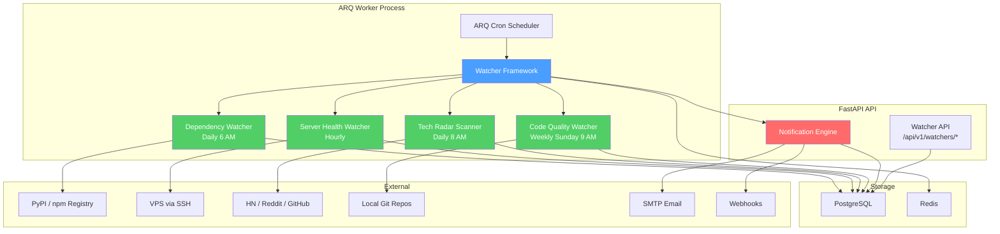
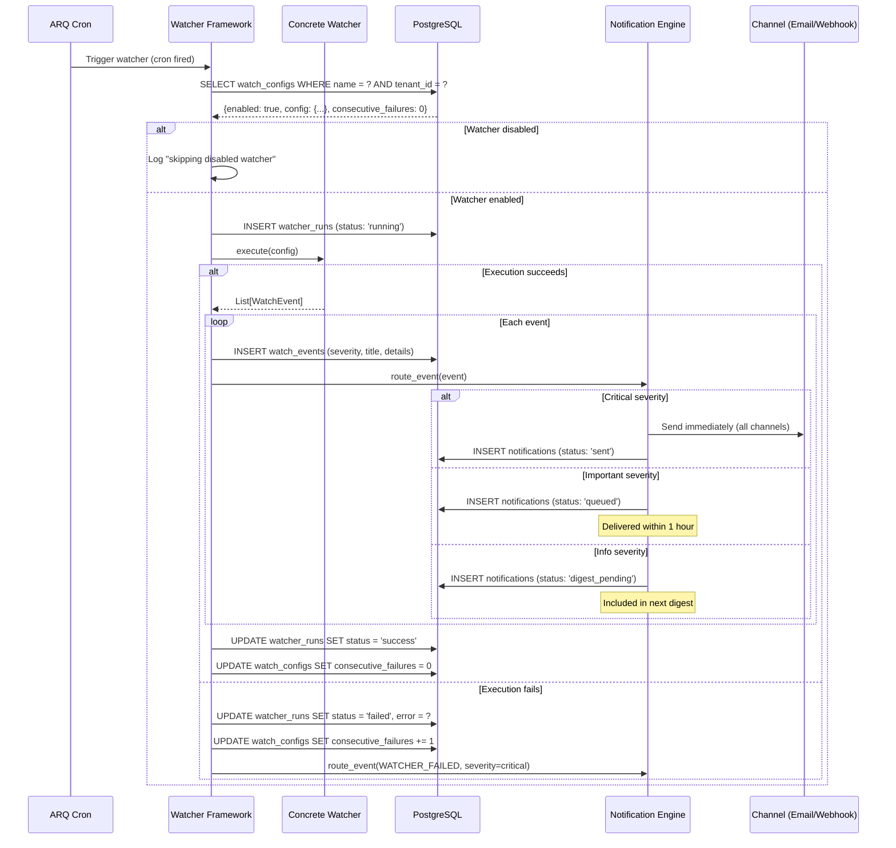
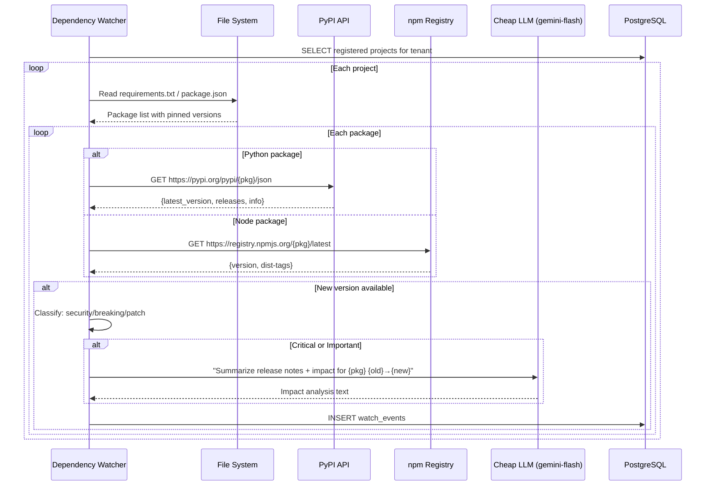

# Era 6 — Ambient AI (Watchers) Feature Spec

> **Purpose**: Build proactive AI background services ("watchers") that monitor your world — dependencies, server health, tech trends, code quality — and come to YOU with important information. AI that helps without being asked.
>
> **Architecture ref**: `KNOWLEDGE.md` — follows ARQ worker + EventBus patterns
>
> **AI Engine ref**: Life Graph's existing cron/task infrastructure via ARQ
>
> **Tenant-scoped**: Every watcher runs per `tenant_id`. All events, configs, and notifications are tenant-isolated.

---

## Requirements

### Story 1: Watcher Framework

As a **developer**, I want a pluggable watcher framework so that I can create new background monitors by simply subclassing a base watcher and defining a cron schedule.

#### Acceptance Criteria

- GIVEN the watcher framework is initialized WHEN the application starts THEN all registered watchers are scheduled via ARQ cron according to their configured cron expressions
- GIVEN a watcher subclass defines `schedule = "0 6 * * *"` and `execute()` WHEN the cron fires at 6 AM THEN the framework calls `execute()`, catches any exceptions, and records the run in `watcher_runs` with status `success` or `failed`
- GIVEN a watcher's `execute()` produces events WHEN each event has a severity (`critical`, `important`, `info`) THEN the event is stored in `watch_events` and routed to the notification engine
- GIVEN a watcher has a configuration WHEN the tenant updates it via API THEN the updated config is stored in `watch_configs` and takes effect on the next scheduled run
- GIVEN a watcher is disabled in its config WHEN the cron fires THEN the framework skips execution and logs `"Watcher {name} disabled for tenant {tenant_id}, skipping"`
- GIVEN a watcher run fails with an unhandled exception WHEN the error occurs THEN the framework stores the error in `watcher_runs.error`, increments `consecutive_failures`, and emits a `WATCHER_FAILED` event
- GIVEN a watcher has `consecutive_failures >= 5` WHEN the next cron fires THEN the framework auto-disables the watcher and emits a critical notification: "Watcher '{name}' auto-disabled after 5 consecutive failures"

---

### Story 2: Dependency Watcher

As a **developer**, I want to be alerted when my project dependencies have new versions — especially security fixes — so that I can keep my software secure and up to date without manually checking.

#### Acceptance Criteria

- GIVEN I have registered a project with a `requirements.txt` path WHEN the dependency watcher runs at 6 AM daily THEN it parses the file, extracts all pinned package names and versions, and checks PyPI for newer versions
- GIVEN I have registered a project with a `package.json` path WHEN the dependency watcher runs THEN it parses the file, extracts dependencies and devDependencies, and checks the npm registry for newer versions
- GIVEN a dependency has a new version available WHEN the watcher detects it THEN it creates a `watch_event` with: package name, current version, latest version, version delta (major/minor/patch), and changelog summary
- GIVEN a new version's release notes mention "security", "CVE", or "vulnerability" WHEN the watcher classifies the update THEN it assigns severity `critical` and the event title reads: "🔴 Security fix: {package} {old} → {new}"
- GIVEN a new version has a major version bump WHEN the watcher classifies it THEN it assigns severity `important` and flags it as a potential breaking change
- GIVEN a new version is a patch bump with no security keywords WHEN the watcher classifies it THEN it assigns severity `info`
- GIVEN the watcher has browser-use available WHEN a critical or important update is detected THEN it reads the release notes/changelog from PyPI or GitHub and generates an impact analysis: "FastAPI 0.116 changes X — affects 3 of your endpoints"
- GIVEN the watcher found updates WHEN all packages have been checked THEN it stores one `watch_event` per updated package and a summary event with total counts by severity
- GIVEN no updates are found WHEN the watcher completes THEN it records the run as success with `events_generated: 0` and does NOT create any watch events

---

### Story 3: Server Health Watcher

As a **developer running self-hosted services**, I want hourly health checks on my VPS so that I am warned about resource issues before they cause downtime.

#### Acceptance Criteria

- GIVEN I have configured a server with SSH credentials or an API endpoint WHEN the server health watcher runs hourly THEN it checks: disk usage (%), CPU load (1m/5m/15m), RAM usage (%), swap usage, and service statuses (systemd units)
- GIVEN the watcher collects disk usage data over time WHEN the disk usage is > 80% THEN it creates an `important` event with current usage and a prediction: "At current growth rate of {X} GB/day, disk will be full in {N} days"
- GIVEN the watcher collects disk usage data WHEN disk usage is > 95% THEN it creates a `critical` event: "🔴 Disk critically full ({X}%). Immediate action required."
- GIVEN the watcher detects a systemd service is not running WHEN the service was previously running THEN it creates a `critical` event: "Service '{name}' is down on {server}"
- GIVEN CPU load average (5m) exceeds the configured threshold (default: 80%) WHEN the check completes THEN it creates an `important` event with process breakdown
- GIVEN the server has predictable log growth WHEN the watcher calculates disk projection THEN it suggests safe actions: "Consider log rotation for /var/log/nginx/access.log (2.3 GB, growing 150 MB/day)"
- GIVEN the tenant has enabled auto-execute for safe actions WHEN the watcher identifies a safe action (log rotation, apt cache clean, journal vacuum) THEN it executes the action via SSH and records the result in the event
- GIVEN the server is unreachable via SSH WHEN the health check times out (30s) THEN it creates a `critical` event: "🔴 Server '{name}' unreachable — SSH connection timed out"
- GIVEN all metrics are within normal ranges WHEN the check completes THEN it records the run as success with a health snapshot stored in `watcher_runs.result` but does NOT create watch events

---

### Story 4: Tech Radar Scanner

As a **developer**, I want a daily digest of relevant tech news filtered by my interests so that I stay informed without manually browsing HN, Reddit, and GitHub.

#### Acceptance Criteria

- GIVEN the tech radar is configured with my interests (e.g., `["python", "fastapi", "selfhosted", "nextjs", "postgresql"]`) WHEN the scanner runs at 8 AM daily THEN it scrapes: HN front page (top 30), Reddit r/python + r/selfhosted + r/nextjs (hot 25 each), and GitHub trending (daily, Python + TypeScript)
- GIVEN the scanner has collected articles WHEN it processes each article THEN it scores relevance 0–100 using a cheap model (gemini-flash or local) based on: title keyword match, description/selftext match against interests, community engagement (upvotes, comments), and source credibility
- GIVEN articles have been scored WHEN articles score > 60 THEN they are stored in the `tech_radar` table with: title, url, source, score, summary, and tags
- GIVEN articles have been scored WHEN articles score ≤ 60 THEN they are discarded and NOT stored
- GIVEN relevant articles exist for today WHEN the scanner completes THEN it creates an `info` watch event containing a daily digest: articles grouped by topic, sorted by score, with 1-line summaries
- GIVEN the same URL was scraped yesterday WHEN it appears again today THEN it is deduplicated and not re-stored or re-scored
- GIVEN no articles score > 60 today WHEN the scanner completes THEN it records the run as success and creates an `info` event: "No notable tech news matching your interests today"
- GIVEN I view the tech radar via API WHEN I request articles THEN I can filter by: source, date range, minimum score, and tag

---

### Story 5: Code Quality Watcher

As a **developer**, I want weekly analysis of my coding patterns so that I can identify blind spots and improve my practices over time.

#### Acceptance Criteria

- GIVEN I have registered a project with a git repository path WHEN the code quality watcher runs weekly (Sunday 9 AM) THEN it analyzes the git history from the past 7 days
- GIVEN the watcher analyzes git history WHEN it processes commits THEN it tracks: files changed per commit, file churn (files changed most frequently), lines added/removed, commit frequency by day/hour, and test file vs source file ratio
- GIVEN the watcher has historical data WHEN it compares this week to the rolling 4-week average THEN it identifies trends: "Test coverage ratio dropped from 0.45 to 0.31 this week" or "Commit frequency increased 40% — watch for burnout"
- GIVEN the watcher detects that test files are rarely modified alongside source files WHEN the pattern is identified THEN it creates an `important` event: "You modified 12 source files in life_graph/services/ but 0 test files — consider adding tests for {specific_files}"
- GIVEN the watcher identifies high-churn files WHEN a file has been modified in > 50% of commits this week THEN it creates an `info` event: "High churn: {filename} modified in {N}/{total} commits — consider refactoring"
- GIVEN the watcher detects commit patterns WHEN commits cluster at unusual hours (after midnight local time) THEN it creates an `info` event with the observation (non-judgmental, just data)
- GIVEN the watcher completes analysis WHEN results are available THEN it stores a weekly report in `watcher_runs.result` with all metrics and creates a summary `info` event

---

### Story 6: Notification Engine

As a **developer**, I want watch events routed to me based on priority — critical alerts immediately, important ones same-day, info in a digest — so that I'm not overwhelmed but never miss something urgent.

#### Acceptance Criteria

- GIVEN a `critical` watch event is created WHEN the notification engine processes it THEN it immediately sends notifications via ALL enabled channels (terminal output, email, webhook) within 60 seconds
- GIVEN an `important` watch event is created WHEN the notification engine processes it THEN it queues it for same-day delivery and sends via the primary channel (email or webhook) within 1 hour
- GIVEN an `info` watch event is created WHEN the notification engine processes it THEN it accumulates the event for the next digest (daily at 7 PM or weekly on Monday 8 AM, configurable)
- GIVEN multiple `info` events have accumulated WHEN the digest generation runs THEN it compiles events into a readable summary grouped by watcher type, sorted by recency, with counts per category
- GIVEN the tenant has configured email (SMTP) as a channel WHEN a notification is sent via email THEN it sends a well-formatted email with: subject line including severity emoji, event title, details, and action links
- GIVEN the tenant has configured a webhook URL WHEN a notification is sent via webhook THEN it POSTs a JSON payload with: event_id, severity, title, details, watcher_name, timestamp, signed with HMAC-SHA256
- GIVEN the tenant has NOT configured any channels WHEN a notification is triggered THEN it stores the notification in the `notifications` table with `status = 'pending'` and logs a warning: "No notification channels configured for tenant {tenant_id}"
- GIVEN a notification was sent WHEN I view it via API THEN I can acknowledge it, which sets `acknowledged_at` and `acknowledged_by`
- GIVEN I query unacknowledged notifications WHEN critical notifications are > 24 hours old and unacknowledged THEN the engine re-sends them (max 3 retries)

---

### Story 7: Watcher Configuration Management

As a **developer**, I want to configure each watcher's schedule, enable/disable state, and parameters via API so that I can customize monitoring without editing code.

#### Acceptance Criteria

- GIVEN I call `GET /api/v1/watchers/configs` WHEN configs exist THEN I see all watchers with: name, description, schedule (cron), enabled status, last run time, next run time, and consecutive failures
- GIVEN I call `PATCH /api/v1/watchers/configs/{watcher_name}` with `{"enabled": false}` WHEN the update succeeds THEN the watcher is disabled and will not run on its next scheduled time
- GIVEN I call `PATCH /api/v1/watchers/configs/{watcher_name}` with `{"schedule": "0 */2 * * *"}` WHEN the cron expression is valid THEN the schedule is updated and takes effect on the next ARQ worker restart
- GIVEN I call `PATCH /api/v1/watchers/configs/{watcher_name}` with an invalid cron expression WHEN validation fails THEN the API returns 400: "Invalid cron expression: '{value}'"
- GIVEN I call `POST /api/v1/watchers/{watcher_name}/run` WHEN the watcher is enabled THEN the watcher executes immediately (out of schedule) and returns the run result
- GIVEN I call `GET /api/v1/watchers/runs?watcher_name=dependency_watcher&limit=10` WHEN runs exist THEN I see the last 10 runs with: status, started_at, completed_at, events_generated, and error (if any)

---

### Story 8: Watch Event Management

As a **developer**, I want to browse, filter, and acknowledge watch events so that I can review what my watchers have found and dismiss handled items.

#### Acceptance Criteria

- GIVEN I call `GET /api/v1/watchers/events?severity=critical&acknowledged=false` WHEN unacknowledged critical events exist THEN I see them sorted by newest first with: watcher_name, severity, title, details, created_at
- GIVEN I call `POST /api/v1/watchers/events/{event_id}/acknowledge` WHEN the event exists THEN it sets `acknowledged_at = NOW()` and `acknowledged_by = current_user` and returns the updated event
- GIVEN I call `POST /api/v1/watchers/events/acknowledge-all` with `{"watcher_name": "dependency_watcher", "severity": "info"}` WHEN matching events exist THEN all matching unacknowledged events are bulk-acknowledged
- GIVEN I call `GET /api/v1/watchers/events/summary` WHEN events exist THEN I get counts by severity and watcher: `{"critical": 2, "important": 5, "info": 23, "by_watcher": {"dependency_watcher": 12, "server_health": 8, ...}}`

---

## Design

### Architecture Overview



### Watcher Execution Flow



### Dependency Watcher Detail Flow



---

### Data Models

```sql
-- ============================================================
-- Watcher configurations — per-tenant settings for each watcher
-- ============================================================
CREATE TABLE watch_configs (
  id                    UUID PRIMARY KEY DEFAULT gen_random_uuid(),
  tenant_id             TEXT NOT NULL,
  watcher_name          TEXT NOT NULL,              -- 'dependency_watcher', 'server_health', etc.
  display_name          TEXT NOT NULL,              -- 'Dependency Watcher'
  description           TEXT,                       -- Human-readable description
  schedule              TEXT NOT NULL,              -- Cron expression: '0 6 * * *'
  enabled               BOOLEAN DEFAULT true,
  config                JSONB DEFAULT '{}',         -- Watcher-specific config (see examples below)
  consecutive_failures  INT DEFAULT 0,
  last_run_at           TIMESTAMPTZ,
  next_run_at           TIMESTAMPTZ,
  created_at            TIMESTAMPTZ DEFAULT NOW(),
  updated_at            TIMESTAMPTZ DEFAULT NOW(),
  UNIQUE(tenant_id, watcher_name)
);

CREATE INDEX idx_watch_cfg_tenant ON watch_configs(tenant_id);
CREATE INDEX idx_watch_cfg_enabled ON watch_configs(tenant_id, enabled)
  WHERE enabled = true;

-- config examples:
-- Dependency Watcher: {"projects": [{"name": "life-graph", "path": "/home/dev/agents", "type": "python"}, {"name": "uzhavu-web", "path": "/home/dev/uzhavu", "type": "node"}]}
-- Server Health:      {"servers": [{"name": "vps-01", "host": "192.168.1.100", "ssh_user": "root", "ssh_key_path": "/home/dev/.ssh/id_rsa", "services": ["nginx", "postgresql", "redis"]}], "auto_execute_safe": false, "disk_warn_pct": 80, "disk_crit_pct": 95, "cpu_warn_pct": 80}
-- Tech Radar:         {"interests": ["python", "fastapi", "selfhosted", "nextjs", "postgresql", "ai"], "sources": {"hn": true, "reddit": ["r/python", "r/selfhosted", "r/nextjs"], "github_trending": ["python", "typescript"]}, "min_score": 60}
-- Code Quality:       {"projects": [{"name": "life-graph", "repo_path": "/home/dev/agents", "test_dirs": ["tests/"], "source_dirs": ["life_graph/"]}]}

-- ============================================================
-- Watch events — outputs from watcher runs
-- ============================================================
CREATE TABLE watch_events (
  id                    UUID PRIMARY KEY DEFAULT gen_random_uuid(),
  tenant_id             TEXT NOT NULL,
  watcher_name          TEXT NOT NULL,              -- FK-like reference to watch_configs.watcher_name
  run_id                UUID,                       -- FK to watcher_runs.id
  severity              TEXT NOT NULL,              -- 'critical' | 'important' | 'info'
  title                 TEXT NOT NULL,              -- Short title: "Security fix: FastAPI 0.115→0.116"
  details               JSONB NOT NULL DEFAULT '{}', -- Structured event data (varies by watcher)
  summary               TEXT,                       -- Human-readable summary paragraph
  acknowledged_at       TIMESTAMPTZ,
  acknowledged_by       TEXT,                       -- User ID who acknowledged
  created_at            TIMESTAMPTZ DEFAULT NOW()
);

CREATE INDEX idx_watch_evt_tenant ON watch_events(tenant_id, created_at DESC);
CREATE INDEX idx_watch_evt_sev ON watch_events(tenant_id, severity, created_at DESC);
CREATE INDEX idx_watch_evt_watcher ON watch_events(tenant_id, watcher_name, created_at DESC);
CREATE INDEX idx_watch_evt_unack ON watch_events(tenant_id, severity)
  WHERE acknowledged_at IS NULL;
CREATE INDEX idx_watch_evt_run ON watch_events(run_id);

-- details examples:
-- Dependency: {"package": "fastapi", "current_version": "0.115.0", "latest_version": "0.116.0", "version_delta": "minor", "has_security_fix": false, "release_notes_url": "https://...", "impact_analysis": "...", "changelog_summary": "..."}
-- Server:    {"server": "vps-01", "metric": "disk", "current_value": 87.3, "threshold": 80, "prediction_days": 5, "suggested_actions": ["Rotate /var/log/nginx/access.log (2.3 GB)", "Clear apt cache (450 MB)"]}
-- Tech:      {"articles": [{"title": "...", "url": "...", "source": "hn", "score": 85, "summary": "..."}]}
-- Code:      {"files_changed": 34, "test_ratio": 0.31, "high_churn": ["file1.py", "file2.py"], "insights": ["..."]}

-- ============================================================
-- Watcher run history — tracks each execution
-- ============================================================
CREATE TABLE watcher_runs (
  id                    UUID PRIMARY KEY DEFAULT gen_random_uuid(),
  tenant_id             TEXT NOT NULL,
  watcher_name          TEXT NOT NULL,
  status                TEXT NOT NULL DEFAULT 'running', -- 'running' | 'success' | 'failed'
  started_at            TIMESTAMPTZ DEFAULT NOW(),
  completed_at          TIMESTAMPTZ,
  duration_ms           INT,
  events_generated      INT DEFAULT 0,
  result                JSONB DEFAULT '{}',         -- Summary data from the run
  error                 TEXT,                       -- Error message if failed
  created_at            TIMESTAMPTZ DEFAULT NOW()
);

CREATE INDEX idx_watcher_run_tenant ON watcher_runs(tenant_id, watcher_name, created_at DESC);
CREATE INDEX idx_watcher_run_status ON watcher_runs(tenant_id, status)
  WHERE status = 'failed';

-- ============================================================
-- Tech radar — stored articles from tech radar scanner
-- ============================================================
CREATE TABLE tech_radar (
  id                    UUID PRIMARY KEY DEFAULT gen_random_uuid(),
  tenant_id             TEXT NOT NULL,
  title                 TEXT NOT NULL,
  url                   TEXT NOT NULL,
  source                TEXT NOT NULL,              -- 'hn' | 'reddit' | 'github_trending'
  source_id             TEXT,                       -- HN item ID, Reddit post ID, etc.
  subreddit             TEXT,                       -- r/python, r/selfhosted, etc. (Reddit only)
  score                 INT NOT NULL,               -- Relevance score 0-100
  upvotes               INT DEFAULT 0,              -- Community engagement
  comments              INT DEFAULT 0,
  summary               TEXT,                       -- 1-2 sentence AI-generated summary
  tags                  TEXT[] DEFAULT '{}',         -- Matched interest tags
  scraped_at            TIMESTAMPTZ DEFAULT NOW(),
  UNIQUE(tenant_id, url)
);

CREATE INDEX idx_tech_radar_tenant ON tech_radar(tenant_id, scraped_at DESC);
CREATE INDEX idx_tech_radar_score ON tech_radar(tenant_id, score DESC);
CREATE INDEX idx_tech_radar_source ON tech_radar(tenant_id, source, scraped_at DESC);
CREATE INDEX idx_tech_radar_tags ON tech_radar USING GIN(tags);

-- ============================================================
-- Notifications — delivery tracking for watch events
-- ============================================================
CREATE TABLE notifications (
  id                    UUID PRIMARY KEY DEFAULT gen_random_uuid(),
  tenant_id             TEXT NOT NULL,
  event_id              UUID REFERENCES watch_events(id) ON DELETE CASCADE,
  channel               TEXT NOT NULL,              -- 'email' | 'webhook' | 'terminal' | 'whatsapp'
  severity              TEXT NOT NULL,              -- Copied from event for quick filtering
  status                TEXT NOT NULL DEFAULT 'pending', -- 'pending' | 'queued' | 'sent' | 'failed' | 'digest_pending'
  recipient             TEXT,                       -- Email address, webhook URL, etc.
  subject               TEXT,                       -- Email subject or notification title
  body                  TEXT,                       -- Rendered notification content
  sent_at               TIMESTAMPTZ,
  retry_count           INT DEFAULT 0,
  max_retries           INT DEFAULT 3,
  error_message         TEXT,                       -- Last error if failed
  digest_id             UUID,                       -- Groups notifications into a digest
  created_at            TIMESTAMPTZ DEFAULT NOW()
);

CREATE INDEX idx_notif_tenant ON notifications(tenant_id, created_at DESC);
CREATE INDEX idx_notif_status ON notifications(tenant_id, status)
  WHERE status IN ('pending', 'queued', 'failed');
CREATE INDEX idx_notif_digest ON notifications(digest_id)
  WHERE digest_id IS NOT NULL;
CREATE INDEX idx_notif_event ON notifications(event_id);

-- ============================================================
-- Notification channels — per-tenant channel configuration
-- ============================================================
CREATE TABLE notification_channels (
  id                    UUID PRIMARY KEY DEFAULT gen_random_uuid(),
  tenant_id             TEXT NOT NULL,
  channel_type          TEXT NOT NULL,              -- 'email' | 'webhook' | 'terminal' | 'whatsapp'
  enabled               BOOLEAN DEFAULT true,
  config                JSONB NOT NULL DEFAULT '{}', -- Channel-specific config
  priority              INT DEFAULT 0,              -- Higher = preferred for same-day delivery
  created_at            TIMESTAMPTZ DEFAULT NOW(),
  updated_at            TIMESTAMPTZ DEFAULT NOW(),
  UNIQUE(tenant_id, channel_type)
);

CREATE INDEX idx_notif_ch_tenant ON notification_channels(tenant_id, enabled)
  WHERE enabled = true;

-- config examples:
-- Email:    {"smtp_host": "smtp.gmail.com", "smtp_port": 587, "smtp_user": "dev@gmail.com", "smtp_pass_encrypted": "...", "from_name": "Ambient AI", "to_email": "dev@gmail.com"}
-- Webhook:  {"url": "https://hooks.slack.com/services/xxx", "secret": "whsec_xxx", "headers": {"X-Custom": "value"}}
-- Terminal: {"log_file": "/tmp/ambient-ai.log"}  (writes to a watched file)
-- WhatsApp: {"phone_number": "+919876543210"}  (future — uses WhatsApp bot integration)
```

---

### API Contracts

#### Module Structure

```
life_graph/watchers/
├── __init__.py
├── base.py                         # BaseWatcher abstract class
├── framework.py                    # WatcherFramework — registration, scheduling, execution
├── dependency_watcher.py           # Dependency version checker
├── server_health_watcher.py        # VPS health monitoring
├── tech_radar_watcher.py           # Tech news scanner
├── code_quality_watcher.py         # Git history analyzer
├── notification_engine.py          # Priority routing + channel delivery
├── digest.py                       # Digest compilation for info-level events
├── channels/
│   ├── __init__.py
│   ├── email_channel.py            # SMTP email delivery
│   ├── webhook_channel.py          # Webhook delivery with HMAC
│   └── terminal_channel.py         # Terminal/log file output
└── scrapers/
    ├── __init__.py
    ├── pypi.py                     # PyPI version checker
    ├── npm.py                      # npm registry checker
    ├── hackernews.py               # HN front page scraper
    ├── reddit.py                   # Reddit subreddit scraper
    └── github_trending.py          # GitHub trending scraper

life_graph/api/watchers.py          # API endpoints for watcher management
```

---

#### Watcher Config Endpoints

```
GET /api/v1/watchers/configs
X-Tenant-ID: tenant_abc
Authorization: Bearer <key>
```

**Response (200):**
```json
{
  "data": [
    {
      "watcherName": "dependency_watcher",
      "displayName": "Dependency Watcher",
      "description": "Checks PyPI/npm for new versions of your project dependencies",
      "schedule": "0 6 * * *",
      "enabled": true,
      "consecutiveFailures": 0,
      "lastRunAt": "2026-07-06T06:00:12Z",
      "nextRunAt": "2026-07-07T06:00:00Z",
      "config": {
        "projects": [
          {"name": "life-graph", "path": "/home/dev/agents", "type": "python"}
        ]
      }
    },
    {
      "watcherName": "server_health",
      "displayName": "Server Health Watcher",
      "description": "Hourly VPS health checks — disk, CPU, RAM, services",
      "schedule": "0 * * * *",
      "enabled": true,
      "consecutiveFailures": 0,
      "lastRunAt": "2026-07-06T23:00:08Z",
      "nextRunAt": "2026-07-07T00:00:00Z",
      "config": {
        "servers": [{"name": "vps-01", "host": "192.168.1.100", "ssh_user": "root"}],
        "auto_execute_safe": false
      }
    },
    {
      "watcherName": "tech_radar",
      "displayName": "Tech Radar Scanner",
      "description": "Daily digest of relevant tech news from HN, Reddit, GitHub",
      "schedule": "0 8 * * *",
      "enabled": true,
      "consecutiveFailures": 0,
      "lastRunAt": "2026-07-06T08:00:22Z",
      "nextRunAt": "2026-07-07T08:00:00Z",
      "config": {
        "interests": ["python", "fastapi", "selfhosted", "nextjs"],
        "min_score": 60
      }
    },
    {
      "watcherName": "code_quality",
      "displayName": "Code Quality Watcher",
      "description": "Weekly git history analysis — churn, test coverage, patterns",
      "schedule": "0 9 * * 0",
      "enabled": true,
      "consecutiveFailures": 0,
      "lastRunAt": "2026-07-06T09:00:15Z",
      "nextRunAt": "2026-07-13T09:00:00Z",
      "config": {
        "projects": [{"name": "life-graph", "repo_path": "/home/dev/agents"}]
      }
    }
  ]
}
```

---

```
PATCH /api/v1/watchers/configs/{watcher_name}
X-Tenant-ID: tenant_abc
Authorization: Bearer <key>
```

**Request:**
```json
{
  "enabled": true,
  "schedule": "0 7 * * *",
  "config": {
    "projects": [
      {"name": "life-graph", "path": "/home/dev/agents", "type": "python"},
      {"name": "uzhavu-web", "path": "/home/dev/uzhavu", "type": "node"}
    ]
  }
}
```

**Response (200):**
```json
{
  "data": {
    "watcherName": "dependency_watcher",
    "schedule": "0 7 * * *",
    "enabled": true,
    "config": {"...updated config..."},
    "updatedAt": "2026-07-07T00:05:00Z"
  }
}
```

**Errors:**
- `400` — Invalid cron expression or config schema
- `404` — Unknown watcher name

---

```
POST /api/v1/watchers/{watcher_name}/run
X-Tenant-ID: tenant_abc
Authorization: Bearer <key>
```

Triggers an immediate manual run of the specified watcher.

**Response (200):**
```json
{
  "data": {
    "runId": "f47ac10b-58cc-4372-a567-0e02b2c3d479",
    "watcherName": "dependency_watcher",
    "status": "success",
    "startedAt": "2026-07-07T00:05:30Z",
    "completedAt": "2026-07-07T00:05:48Z",
    "durationMs": 18200,
    "eventsGenerated": 3,
    "result": {
      "packages_checked": 24,
      "updates_found": 3,
      "critical": 1,
      "important": 1,
      "info": 1
    }
  }
}
```

---

#### Watcher Run History

```
GET /api/v1/watchers/runs?watcher_name=dependency_watcher&limit=10
X-Tenant-ID: tenant_abc
Authorization: Bearer <key>
```

**Response (200):**
```json
{
  "data": [
    {
      "id": "f47ac10b-58cc-4372-a567-0e02b2c3d479",
      "watcherName": "dependency_watcher",
      "status": "success",
      "startedAt": "2026-07-07T06:00:12Z",
      "completedAt": "2026-07-07T06:00:30Z",
      "durationMs": 18200,
      "eventsGenerated": 3,
      "result": {"packages_checked": 24, "updates_found": 3}
    },
    {
      "id": "a1b2c3d4-e5f6-7890-abcd-ef1234567890",
      "watcherName": "dependency_watcher",
      "status": "failed",
      "startedAt": "2026-07-06T06:00:10Z",
      "completedAt": "2026-07-06T06:00:11Z",
      "durationMs": 1200,
      "eventsGenerated": 0,
      "error": "PyPI API returned 503 Service Unavailable"
    }
  ],
  "pagination": {"page": 1, "limit": 10, "total": 45}
}
```

---

#### Watch Events

```
GET /api/v1/watchers/events?severity=critical&acknowledged=false&limit=20
X-Tenant-ID: tenant_abc
Authorization: Bearer <key>
```

**Response (200):**
```json
{
  "data": [
    {
      "id": "e1234567-89ab-cdef-0123-456789abcdef",
      "watcherName": "dependency_watcher",
      "severity": "critical",
      "title": "🔴 Security fix: FastAPI 0.115.0 → 0.116.0",
      "details": {
        "package": "fastapi",
        "current_version": "0.115.0",
        "latest_version": "0.116.0",
        "version_delta": "minor",
        "has_security_fix": true,
        "impact_analysis": "FastAPI 0.116.0 fixes CVE-2026-1234 (path traversal in StaticFiles). You use StaticFiles in 2 endpoints — api/static.py:L12 and api/docs.py:L5. Upgrade immediately."
      },
      "summary": "FastAPI 0.116.0 patches a critical path traversal vulnerability (CVE-2026-1234). Your project uses the affected StaticFiles middleware in 2 locations.",
      "acknowledgedAt": null,
      "createdAt": "2026-07-07T06:00:15Z"
    },
    {
      "id": "a2345678-90bc-def0-1234-567890abcdef",
      "watcherName": "server_health",
      "severity": "critical",
      "title": "🔴 Disk critically full (96%) on vps-01",
      "details": {
        "server": "vps-01",
        "metric": "disk",
        "current_value": 96.2,
        "threshold": 95,
        "largest_dirs": [
          {"/var/log/nginx": "4.2 GB"},
          {"/var/lib/postgresql": "12.1 GB"}
        ],
        "suggested_actions": [
          "Rotate /var/log/nginx/access.log (2.3 GB)",
          "Vacuum PostgreSQL (estimated 1.5 GB reclaimable)"
        ]
      },
      "acknowledgedAt": null,
      "createdAt": "2026-07-07T05:00:08Z"
    }
  ],
  "pagination": {"page": 1, "limit": 20, "total": 2}
}
```

---

```
POST /api/v1/watchers/events/{event_id}/acknowledge
X-Tenant-ID: tenant_abc
Authorization: Bearer <key>
```

**Response (200):**
```json
{
  "data": {
    "id": "e1234567-89ab-cdef-0123-456789abcdef",
    "acknowledgedAt": "2026-07-07T00:10:00Z",
    "acknowledgedBy": "user_abc"
  }
}
```

---

```
POST /api/v1/watchers/events/acknowledge-all
X-Tenant-ID: tenant_abc
Authorization: Bearer <key>
```

**Request:**
```json
{
  "watcherName": "tech_radar",
  "severity": "info"
}
```

**Response (200):**
```json
{
  "data": {
    "acknowledged": 15,
    "watcherName": "tech_radar",
    "severity": "info"
  }
}
```

---

```
GET /api/v1/watchers/events/summary
X-Tenant-ID: tenant_abc
Authorization: Bearer <key>
```

**Response (200):**
```json
{
  "data": {
    "total": 30,
    "unacknowledged": 12,
    "bySeverity": {
      "critical": 2,
      "important": 5,
      "info": 23
    },
    "byWatcher": {
      "dependency_watcher": {"critical": 1, "important": 2, "info": 5},
      "server_health": {"critical": 1, "important": 1, "info": 3},
      "tech_radar": {"critical": 0, "important": 1, "info": 12},
      "code_quality": {"critical": 0, "important": 1, "info": 3}
    }
  }
}
```

---

#### Tech Radar

```
GET /api/v1/watchers/tech-radar?source=hn&min_score=70&days=7&limit=20
X-Tenant-ID: tenant_abc
Authorization: Bearer <key>
```

**Response (200):**
```json
{
  "data": [
    {
      "id": "tr_001",
      "title": "Replacing Celery with ARQ for async task queues",
      "url": "https://blog.example.com/arq-vs-celery",
      "source": "hn",
      "score": 92,
      "upvotes": 347,
      "comments": 89,
      "summary": "Author benchmarks ARQ vs Celery for async Python workloads. ARQ is 3x faster for Redis-backed queues with significantly less memory usage.",
      "tags": ["python", "async", "background-jobs"],
      "scrapedAt": "2026-07-06T08:00:22Z"
    },
    {
      "id": "tr_002",
      "title": "PostgreSQL 17: The features that matter most",
      "url": "https://www.postgresql.org/about/news/...",
      "source": "reddit",
      "subreddit": "r/selfhosted",
      "score": 85,
      "upvotes": 523,
      "comments": 112,
      "summary": "Deep dive into PG17's incremental backup, JSON table functions, and improved EXPLAIN output. Relevant for self-hosted production deployments.",
      "tags": ["postgresql", "selfhosted"],
      "scrapedAt": "2026-07-06T08:00:22Z"
    }
  ],
  "pagination": {"page": 1, "limit": 20, "total": 8}
}
```

---

#### Notification Channels

```
GET /api/v1/watchers/notification-channels
X-Tenant-ID: tenant_abc
Authorization: Bearer <key>
```

**Response (200):**
```json
{
  "data": [
    {
      "id": "ch_001",
      "channelType": "email",
      "enabled": true,
      "config": {
        "smtp_host": "smtp.gmail.com",
        "smtp_port": 587,
        "smtp_user": "dev@gmail.com",
        "from_name": "Ambient AI",
        "to_email": "dev@gmail.com"
      },
      "priority": 1
    },
    {
      "id": "ch_002",
      "channelType": "webhook",
      "enabled": true,
      "config": {
        "url": "https://hooks.slack.com/services/xxx"
      },
      "priority": 0
    }
  ]
}
```

---

```
POST /api/v1/watchers/notification-channels
X-Tenant-ID: tenant_abc
Authorization: Bearer <key>
```

**Request:**
```json
{
  "channelType": "email",
  "config": {
    "smtp_host": "smtp.gmail.com",
    "smtp_port": 587,
    "smtp_user": "dev@gmail.com",
    "smtp_pass": "app-password-here",
    "from_name": "Ambient AI",
    "to_email": "dev@gmail.com"
  },
  "priority": 1
}
```

**Response (201):**
```json
{
  "data": {
    "id": "ch_001",
    "channelType": "email",
    "enabled": true,
    "priority": 1,
    "createdAt": "2026-07-07T00:15:00Z"
  }
}
```

**Errors:**
- `400` — Invalid channel type or missing config fields
- `409` — Channel type already configured for this tenant

```
PATCH /api/v1/watchers/notification-channels/{channel_id}
DELETE /api/v1/watchers/notification-channels/{channel_id}
```

---

```
GET /api/v1/watchers/notifications?status=sent&channel=email&limit=20
X-Tenant-ID: tenant_abc
Authorization: Bearer <key>
```

**Response (200):**
```json
{
  "data": [
    {
      "id": "notif_001",
      "eventId": "e1234567-89ab-cdef-0123-456789abcdef",
      "channel": "email",
      "severity": "critical",
      "status": "sent",
      "subject": "🔴 Security fix: FastAPI 0.115.0 → 0.116.0",
      "sentAt": "2026-07-07T06:00:20Z",
      "retryCount": 0
    }
  ],
  "pagination": {"page": 1, "limit": 20, "total": 45}
}
```

---

### Core Python Implementation

#### Base Watcher Class

```python
"""Base watcher class for the Ambient AI framework.

All watchers subclass BaseWatcher and implement execute().
The framework handles scheduling, error tracking, and event routing.
"""

from __future__ import annotations

import logging
import time
import uuid
from abc import ABC, abstractmethod
from dataclasses import dataclass, field
from datetime import datetime, timezone
from enum import Enum
from typing import Any

from sqlalchemy import select, update

from life_graph.models.db import WatchConfig, WatchEvent, WatcherRun
from life_graph.storage.database import async_session

logger = logging.getLogger(__name__)


class Severity(str, Enum):
    """Event severity levels for priority routing."""
    CRITICAL = "critical"
    IMPORTANT = "important"
    INFO = "info"


@dataclass
class WatchEventData:
    """An event produced by a watcher.

    Attributes:
        severity: Priority level (critical/important/info).
        title: Short human-readable title.
        details: Structured data specific to the event type.
        summary: Optional longer human-readable description.
    """
    severity: Severity
    title: str
    details: dict[str, Any] = field(default_factory=dict)
    summary: str | None = None


class BaseWatcher(ABC):
    """Abstract base class for all watchers.

    Subclasses must define:
        name: Unique identifier for the watcher.
        display_name: Human-readable name.
        description: What this watcher does.
        default_schedule: Default cron expression.
        execute(): The monitoring logic.

    The framework calls run() which wraps execute() with:
        - Config loading from DB
        - Enabled/disabled check
        - Run tracking (watcher_runs table)
        - Error handling and consecutive failure tracking
        - Event persistence and notification routing
    """

    name: str
    display_name: str
    description: str
    default_schedule: str

    def __init__(self, tenant_id: str) -> None:
        self.tenant_id = tenant_id
        self._events: list[WatchEventData] = []

    def emit_event(
        self,
        severity: Severity,
        title: str,
        details: dict[str, Any] | None = None,
        summary: str | None = None,
    ) -> None:
        """Queue an event to be persisted after execute() completes.

        Args:
            severity: Event priority level.
            title: Short descriptive title.
            details: Structured event data.
            summary: Optional human-readable summary.
        """
        self._events.append(WatchEventData(
            severity=severity,
            title=title,
            details=details or {},
            summary=summary,
        ))

    @abstractmethod
    async def execute(self, config: dict[str, Any]) -> dict[str, Any]:
        """Run the watcher's monitoring logic.

        Args:
            config: Watcher-specific configuration from watch_configs.config.

        Returns:
            Dict with run result summary (stored in watcher_runs.result).

        Raises:
            Any exception will be caught by the framework and recorded.
        """
        ...

    async def run(self) -> dict[str, Any]:
        """Execute the watcher with full lifecycle management.

        This is called by the framework (not directly by subclasses).
        Handles: config loading, enabled check, run tracking, error handling.

        Returns:
            Dict with run result or skip/failure info.
        """
        self._events = []

        # Load config from DB
        async with async_session() as session:
            result = await session.execute(
                select(WatchConfig).where(
                    WatchConfig.tenant_id == self.tenant_id,
                    WatchConfig.watcher_name == self.name,
                )
            )
            watch_config = result.scalar_one_or_none()

        if not watch_config:
            logger.warning("No config found for watcher %s tenant %s", self.name, self.tenant_id)
            return {"status": "skipped", "reason": "no_config"}

        if not watch_config.enabled:
            logger.info("Watcher %s disabled for tenant %s, skipping", self.name, self.tenant_id)
            return {"status": "skipped", "reason": "disabled"}

        # Check auto-disable threshold
        if watch_config.consecutive_failures >= 5:
            logger.warning(
                "Watcher %s auto-disabled for tenant %s after %d consecutive failures",
                self.name, self.tenant_id, watch_config.consecutive_failures,
            )
            async with async_session() as session:
                await session.execute(
                    update(WatchConfig)
                    .where(WatchConfig.id == watch_config.id)
                    .values(enabled=False)
                )
                await session.commit()
            self.emit_event(
                Severity.CRITICAL,
                f"Watcher '{self.display_name}' auto-disabled after 5 consecutive failures",
                {"watcher_name": self.name, "failures": watch_config.consecutive_failures},
            )
            await self._persist_events(run_id=None)
            return {"status": "auto_disabled"}

        # Create run record
        run_id = uuid.uuid4()
        start_time = time.monotonic()
        async with async_session() as session:
            run = WatcherRun(
                id=run_id,
                tenant_id=self.tenant_id,
                watcher_name=self.name,
                status="running",
                started_at=datetime.now(timezone.utc),
            )
            session.add(run)
            await session.commit()

        try:
            config = watch_config.config or {}
            run_result = await self.execute(config)
            duration_ms = int((time.monotonic() - start_time) * 1000)

            # Persist events
            await self._persist_events(run_id)

            # Update run as success
            async with async_session() as session:
                await session.execute(
                    update(WatcherRun)
                    .where(WatcherRun.id == run_id)
                    .values(
                        status="success",
                        completed_at=datetime.now(timezone.utc),
                        duration_ms=duration_ms,
                        events_generated=len(self._events),
                        result=run_result,
                    )
                )
                await session.execute(
                    update(WatchConfig)
                    .where(WatchConfig.id == watch_config.id)
                    .values(
                        consecutive_failures=0,
                        last_run_at=datetime.now(timezone.utc),
                    )
                )
                await session.commit()

            logger.info(
                "Watcher %s completed for tenant %s: %d events in %dms",
                self.name, self.tenant_id, len(self._events), duration_ms,
            )
            return run_result

        except Exception as e:
            duration_ms = int((time.monotonic() - start_time) * 1000)

            # Update run as failed
            async with async_session() as session:
                await session.execute(
                    update(WatcherRun)
                    .where(WatcherRun.id == run_id)
                    .values(
                        status="failed",
                        completed_at=datetime.now(timezone.utc),
                        duration_ms=duration_ms,
                        error=str(e),
                    )
                )
                await session.execute(
                    update(WatchConfig)
                    .where(WatchConfig.id == watch_config.id)
                    .values(
                        consecutive_failures=WatchConfig.consecutive_failures + 1,
                        last_run_at=datetime.now(timezone.utc),
                    )
                )
                await session.commit()

            logger.exception("Watcher %s failed for tenant %s", self.name, self.tenant_id)
            raise

    async def _persist_events(self, run_id: uuid.UUID | None) -> None:
        """Store queued events in the database and route to notification engine."""
        if not self._events:
            return

        from life_graph.watchers.notification_engine import NotificationEngine

        async with async_session() as session:
            for event_data in self._events:
                event = WatchEvent(
                    id=uuid.uuid4(),
                    tenant_id=self.tenant_id,
                    watcher_name=self.name,
                    run_id=run_id,
                    severity=event_data.severity.value,
                    title=event_data.title,
                    details=event_data.details,
                    summary=event_data.summary,
                )
                session.add(event)

                # Route to notification engine
                await NotificationEngine(self.tenant_id).route_event(event)

            await session.commit()
```

---

#### Dependency Watcher

```python
"""Dependency Watcher — checks PyPI/npm for new versions of project dependencies.

Runs daily at 6 AM (configurable). Parses requirements.txt and package.json
from registered projects, checks registries for updates, classifies severity,
and optionally generates impact analysis via LLM.
"""

from __future__ import annotations

import logging
import re
from pathlib import Path
from typing import Any

import httpx

from life_graph.watchers.base import BaseWatcher, Severity

logger = logging.getLogger(__name__)

# Keywords that indicate a security-related release
SECURITY_KEYWORDS = {
    "security", "cve", "vulnerability", "exploit", "patch",
    "xss", "csrf", "injection", "traversal", "rce", "ssrf",
    "authentication bypass", "privilege escalation",
}


def _parse_requirements_txt(content: str) -> list[dict[str, str]]:
    """Parse requirements.txt into list of {name, version} dicts.

    Handles formats: package==1.0.0, package>=1.0.0, package~=1.0.0
    Ignores comments, empty lines, and -r/-e directives.
    """
    packages = []
    for line in content.strip().splitlines():
        line = line.strip()
        if not line or line.startswith("#") or line.startswith("-"):
            continue
        # Match: package==1.0.0 or package>=1.0.0 or package~=1.0.0
        match = re.match(r"^([a-zA-Z0-9_.-]+)\s*[=~><!]+\s*([0-9][0-9a-zA-Z.*-]*)", line)
        if match:
            packages.append({"name": match.group(1).lower(), "version": match.group(2)})
    return packages


def _parse_package_json(content: dict[str, Any]) -> list[dict[str, str]]:
    """Parse package.json into list of {name, version} dicts.

    Extracts from both dependencies and devDependencies.
    Strips version prefixes (^, ~, >=).
    """
    packages = []
    for section in ("dependencies", "devDependencies"):
        deps = content.get(section, {})
        for name, version_spec in deps.items():
            # Strip ^, ~, >=, etc.
            version = re.sub(r"^[\^~>=<]*", "", version_spec)
            if version and version[0].isdigit():
                packages.append({"name": name, "version": version})
    return packages


def _classify_version_delta(current: str, latest: str) -> str:
    """Classify the version delta as major/minor/patch.

    Uses simple semver comparison. Falls back to 'unknown' if parsing fails.
    """
    try:
        curr_parts = [int(x) for x in current.split(".")[:3]]
        lat_parts = [int(x) for x in latest.split(".")[:3]]
        # Pad to 3 parts
        while len(curr_parts) < 3:
            curr_parts.append(0)
        while len(lat_parts) < 3:
            lat_parts.append(0)

        if lat_parts[0] > curr_parts[0]:
            return "major"
        elif lat_parts[1] > curr_parts[1]:
            return "minor"
        elif lat_parts[2] > curr_parts[2]:
            return "patch"
        return "none"
    except (ValueError, IndexError):
        return "unknown"


def _has_security_keywords(text: str) -> bool:
    """Check if text contains any security-related keywords."""
    text_lower = text.lower()
    return any(kw in text_lower for kw in SECURITY_KEYWORDS)


class DependencyWatcher(BaseWatcher):
    """Check registered project dependencies for new versions.

    Supports Python (requirements.txt → PyPI) and Node.js (package.json → npm).
    Classifies updates by severity: security (critical), breaking (important), patch (info).
    """

    name = "dependency_watcher"
    display_name = "Dependency Watcher"
    description = "Checks PyPI/npm for new versions of your project dependencies"
    default_schedule = "0 6 * * *"  # Daily at 6 AM

    async def execute(self, config: dict[str, Any]) -> dict[str, Any]:
        """Parse dependency files, check registries, classify updates.

        Config shape:
            {"projects": [{"name": "life-graph", "path": "/home/dev/agents", "type": "python"}]}

        Returns:
            {"packages_checked": N, "updates_found": N, "critical": N, ...}
        """
        projects = config.get("projects", [])
        if not projects:
            logger.info("No projects configured for dependency watcher")
            return {"packages_checked": 0, "updates_found": 0}

        stats = {"packages_checked": 0, "updates_found": 0, "critical": 0, "important": 0, "info": 0}

        async with httpx.AsyncClient(timeout=30.0) as client:
            for project in projects:
                project_name = project.get("name", "unknown")
                project_path = project.get("path", "")
                project_type = project.get("type", "python")

                try:
                    packages = await self._load_packages(project_path, project_type)
                except Exception as e:
                    logger.error("Failed to load packages for %s: %s", project_name, e)
                    self.emit_event(
                        Severity.IMPORTANT,
                        f"Failed to read dependencies for project '{project_name}'",
                        {"project": project_name, "error": str(e)},
                    )
                    continue

                for pkg in packages:
                    stats["packages_checked"] += 1
                    try:
                        latest = await self._check_latest_version(
                            client, pkg["name"], project_type,
                        )
                        if latest and latest != pkg["version"]:
                            await self._process_update(
                                client, project_name, pkg, latest, project_type, stats,
                            )
                    except Exception as e:
                        logger.warning(
                            "Failed to check %s: %s", pkg["name"], e,
                        )

        # Emit summary event if updates were found
        if stats["updates_found"] > 0:
            self.emit_event(
                Severity.INFO,
                f"Dependency scan complete: {stats['updates_found']} updates found",
                stats,
                summary=(
                    f"Checked {stats['packages_checked']} packages across {len(projects)} projects. "
                    f"Found {stats['critical']} critical, {stats['important']} important, "
                    f"and {stats['info']} info-level updates."
                ),
            )

        return stats

    async def _load_packages(
        self, project_path: str, project_type: str,
    ) -> list[dict[str, str]]:
        """Load package list from the project's dependency file."""
        path = Path(project_path)

        if project_type == "python":
            req_file = path / "requirements.txt"
            if not req_file.exists():
                raise FileNotFoundError(f"requirements.txt not found at {req_file}")
            content = req_file.read_text(encoding="utf-8")
            return _parse_requirements_txt(content)

        elif project_type == "node":
            pkg_file = path / "package.json"
            if not pkg_file.exists():
                raise FileNotFoundError(f"package.json not found at {pkg_file}")
            import json
            content = json.loads(pkg_file.read_text(encoding="utf-8"))
            return _parse_package_json(content)

        else:
            raise ValueError(f"Unsupported project type: {project_type}")

    async def _check_latest_version(
        self, client: httpx.AsyncClient, package_name: str, project_type: str,
    ) -> str | None:
        """Query PyPI or npm for the latest version of a package."""
        try:
            if project_type == "python":
                resp = await client.get(f"https://pypi.org/pypi/{package_name}/json")
                if resp.status_code == 200:
                    return resp.json()["info"]["version"]
            elif project_type == "node":
                resp = await client.get(
                    f"https://registry.npmjs.org/{package_name}/latest",
                    headers={"Accept": "application/json"},
                )
                if resp.status_code == 200:
                    return resp.json().get("version")
        except httpx.HTTPError as e:
            logger.warning("Registry request failed for %s: %s", package_name, e)
        return None

    async def _process_update(
        self,
        client: httpx.AsyncClient,
        project_name: str,
        pkg: dict[str, str],
        latest_version: str,
        project_type: str,
        stats: dict[str, int],
    ) -> None:
        """Classify an update and emit the appropriate event."""
        stats["updates_found"] += 1
        name = pkg["name"]
        current = pkg["version"]
        delta = _classify_version_delta(current, latest_version)

        # Fetch release info for classification
        release_info = ""
        try:
            release_info = await self._fetch_release_info(client, name, latest_version, project_type)
        except Exception as e:
            logger.debug("Could not fetch release info for %s: %s", name, e)

        # Classify severity
        is_security = _has_security_keywords(release_info)
        if is_security:
            severity = Severity.CRITICAL
            title = f"🔴 Security fix: {name} {current} → {latest_version}"
            stats["critical"] += 1
        elif delta == "major":
            severity = Severity.IMPORTANT
            title = f"⚠️ Breaking change: {name} {current} → {latest_version}"
            stats["important"] += 1
        else:
            severity = Severity.INFO
            title = f"📦 Update available: {name} {current} → {latest_version}"
            stats["info"] += 1

        details = {
            "project": project_name,
            "package": name,
            "current_version": current,
            "latest_version": latest_version,
            "version_delta": delta,
            "has_security_fix": is_security,
            "changelog_summary": release_info[:500] if release_info else None,
        }

        # For critical/important, try to generate impact analysis
        if severity in (Severity.CRITICAL, Severity.IMPORTANT) and release_info:
            try:
                impact = await self._generate_impact_analysis(name, current, latest_version, release_info)
                details["impact_analysis"] = impact
            except Exception as e:
                logger.debug("Could not generate impact analysis for %s: %s", name, e)

        self.emit_event(severity, title, details)

    async def _fetch_release_info(
        self, client: httpx.AsyncClient, name: str, version: str, project_type: str,
    ) -> str:
        """Fetch release notes or changelog summary from the registry."""
        if project_type == "python":
            resp = await client.get(f"https://pypi.org/pypi/{name}/{version}/json")
            if resp.status_code == 200:
                data = resp.json()
                description = data.get("info", {}).get("description", "")
                # Take last release note section or first 500 chars
                return description[:500]
        elif project_type == "node":
            resp = await client.get(f"https://registry.npmjs.org/{name}/{version}")
            if resp.status_code == 200:
                data = resp.json()
                return data.get("description", "")[:500]
        return ""

    async def _generate_impact_analysis(
        self, name: str, current: str, latest: str, release_info: str,
    ) -> str:
        """Use cheap LLM to generate an impact analysis for a dependency update.

        Returns a concise analysis of how this update might affect the user's project.
        """
        from life_graph.config import settings

        try:
            import litellm
            response = await litellm.acompletion(
                model=settings.LLM_CHEAP_MODEL or "gemini/gemini-2.5-flash",
                messages=[{
                    "role": "user",
                    "content": (
                        f"Analyze this dependency update for a Python/FastAPI project:\n\n"
                        f"Package: {name}\n"
                        f"Current: {current}\n"
                        f"New: {latest}\n\n"
                        f"Release info:\n{release_info[:1000]}\n\n"
                        f"In 2-3 sentences, explain what changed and potential impact. "
                        f"Be specific about breaking changes if any."
                    ),
                }],
                max_tokens=200,
                temperature=0.3,
            )
            return response.choices[0].message.content.strip()
        except Exception as e:
            logger.warning("LLM impact analysis failed for %s: %s", name, e)
            return f"Update from {current} to {latest}. Review release notes for details."
```

---

#### Tech Radar Scanner

```python
"""Tech Radar Scanner — scrapes HN, Reddit, GitHub trending for relevant tech news.

Runs daily at 8 AM (configurable). Scores articles by relevance to user's interests
using keyword matching + engagement signals + optional cheap LLM scoring.
Articles scoring above threshold are stored for the daily digest.
"""

from __future__ import annotations

import logging
import re
from datetime import datetime, timezone
from typing import Any

import httpx
from sqlalchemy import select
from sqlalchemy.dialects.postgresql import insert as pg_insert

from life_graph.models.db import TechRadar
from life_graph.storage.database import async_session
from life_graph.watchers.base import BaseWatcher, Severity

logger = logging.getLogger(__name__)


def _score_article(
    title: str,
    description: str,
    interests: list[str],
    upvotes: int = 0,
    comments: int = 0,
    source: str = "hn",
) -> int:
    """Score an article's relevance 0-100 based on interest matching and engagement.

    Scoring formula:
        - Keyword match in title: +15 per match (max 45)
        - Keyword match in description: +8 per match (max 24)
        - Engagement bonus: log-scaled upvotes (max 20)
        - Comment bonus: log-scaled comments (max 11)
        - Source credibility: HN +5, GitHub +3, Reddit +0 (baseline)
    """
    import math

    score = 0
    title_lower = title.lower()
    desc_lower = description.lower() if description else ""

    # Keyword matching — title is worth more
    title_matches = sum(1 for interest in interests if interest.lower() in title_lower)
    desc_matches = sum(1 for interest in interests if interest.lower() in desc_lower)
    score += min(title_matches * 15, 45)
    score += min(desc_matches * 8, 24)

    # Engagement bonus (log-scaled to avoid HN front page dominance)
    if upvotes > 0:
        score += min(int(math.log10(upvotes + 1) * 8), 20)
    if comments > 0:
        score += min(int(math.log10(comments + 1) * 5), 11)

    # Source credibility bonus
    source_bonus = {"hn": 5, "github_trending": 3, "reddit": 0}
    score += source_bonus.get(source, 0)

    return min(score, 100)


def _extract_tags(title: str, description: str, interests: list[str]) -> list[str]:
    """Extract matching interest tags from the article content."""
    text = f"{title} {description}".lower()
    return [i for i in interests if i.lower() in text]


class TechRadarWatcher(BaseWatcher):
    """Scan HN, Reddit, and GitHub trending for relevant tech news.

    Filters and scores articles by user interests, stores high-scoring ones,
    and generates a daily digest event.
    """

    name = "tech_radar"
    display_name = "Tech Radar Scanner"
    description = "Daily digest of relevant tech news from HN, Reddit, GitHub"
    default_schedule = "0 8 * * *"  # Daily at 8 AM

    async def execute(self, config: dict[str, Any]) -> dict[str, Any]:
        """Scrape sources, score articles, store relevant ones.

        Config shape:
            {
                "interests": ["python", "fastapi", "selfhosted"],
                "sources": {"hn": true, "reddit": ["r/python"], "github_trending": ["python"]},
                "min_score": 60
            }
        """
        interests = config.get("interests", [])
        if not interests:
            logger.info("No interests configured for tech radar")
            return {"articles_scraped": 0, "articles_stored": 0}

        sources = config.get("sources", {"hn": True, "reddit": ["r/python"], "github_trending": ["python"]})
        min_score = config.get("min_score", 60)

        all_articles: list[dict[str, Any]] = []
        stats = {"articles_scraped": 0, "articles_stored": 0, "sources_checked": 0}

        async with httpx.AsyncClient(timeout=30.0) as client:
            # Scrape HN
            if sources.get("hn"):
                stats["sources_checked"] += 1
                try:
                    hn_articles = await self._scrape_hackernews(client)
                    all_articles.extend(hn_articles)
                except Exception as e:
                    logger.warning("HN scraping failed: %s", e)

            # Scrape Reddit
            for subreddit in sources.get("reddit", []):
                stats["sources_checked"] += 1
                try:
                    reddit_articles = await self._scrape_reddit(client, subreddit)
                    all_articles.extend(reddit_articles)
                except Exception as e:
                    logger.warning("Reddit scraping failed for %s: %s", subreddit, e)

            # Scrape GitHub trending
            for language in sources.get("github_trending", []):
                stats["sources_checked"] += 1
                try:
                    gh_articles = await self._scrape_github_trending(client, language)
                    all_articles.extend(gh_articles)
                except Exception as e:
                    logger.warning("GitHub trending scraping failed for %s: %s", language, e)

        stats["articles_scraped"] = len(all_articles)

        # Score and filter
        scored_articles = []
        for article in all_articles:
            score = _score_article(
                title=article["title"],
                description=article.get("description", ""),
                interests=interests,
                upvotes=article.get("upvotes", 0),
                comments=article.get("comments", 0),
                source=article["source"],
            )
            if score >= min_score:
                article["score"] = score
                article["tags"] = _extract_tags(
                    article["title"], article.get("description", ""), interests,
                )
                scored_articles.append(article)

        # Deduplicate by URL and store
        stored = await self._store_articles(scored_articles)
        stats["articles_stored"] = stored

        # Emit digest event
        if scored_articles:
            top_articles = sorted(scored_articles, key=lambda a: a["score"], reverse=True)[:10]
            digest_details = {
                "articles": [
                    {
                        "title": a["title"],
                        "url": a["url"],
                        "source": a["source"],
                        "score": a["score"],
                        "summary": a.get("description", "")[:150],
                    }
                    for a in top_articles
                ],
                "total_relevant": len(scored_articles),
                "sources_checked": stats["sources_checked"],
            }
            self.emit_event(
                Severity.INFO,
                f"📡 Tech Radar: {len(scored_articles)} relevant articles found",
                digest_details,
                summary=self._build_digest_summary(top_articles),
            )
        else:
            self.emit_event(
                Severity.INFO,
                "No notable tech news matching your interests today",
                {"articles_scraped": stats["articles_scraped"], "min_score": min_score},
            )

        return stats

    async def _scrape_hackernews(self, client: httpx.AsyncClient) -> list[dict[str, Any]]:
        """Scrape top 30 stories from HN front page via Algolia API."""
        resp = await client.get(
            "https://hn.algolia.com/api/v1/search",
            params={"tags": "front_page", "hitsPerPage": 30},
        )
        resp.raise_for_status()
        data = resp.json()

        articles = []
        for hit in data.get("hits", []):
            articles.append({
                "title": hit.get("title", ""),
                "url": hit.get("url") or f"https://news.ycombinator.com/item?id={hit['objectID']}",
                "source": "hn",
                "source_id": hit.get("objectID"),
                "description": hit.get("story_text", "") or "",
                "upvotes": hit.get("points", 0),
                "comments": hit.get("num_comments", 0),
            })
        return articles

    async def _scrape_reddit(
        self, client: httpx.AsyncClient, subreddit: str,
    ) -> list[dict[str, Any]]:
        """Scrape hot 25 posts from a subreddit via Reddit JSON API."""
        sub = subreddit.lstrip("r/")
        resp = await client.get(
            f"https://www.reddit.com/r/{sub}/hot.json",
            params={"limit": 25},
            headers={"User-Agent": "AmbientAI/1.0"},
        )
        resp.raise_for_status()
        data = resp.json()

        articles = []
        for child in data.get("data", {}).get("children", []):
            post = child.get("data", {})
            if post.get("is_self") and not post.get("selftext"):
                continue  # Skip empty self-posts
            articles.append({
                "title": post.get("title", ""),
                "url": post.get("url", ""),
                "source": "reddit",
                "source_id": post.get("id"),
                "subreddit": f"r/{sub}",
                "description": (post.get("selftext", "") or "")[:500],
                "upvotes": post.get("ups", 0),
                "comments": post.get("num_comments", 0),
            })
        return articles

    async def _scrape_github_trending(
        self, client: httpx.AsyncClient, language: str,
    ) -> list[dict[str, Any]]:
        """Scrape GitHub trending repos via the unofficial API.

        Falls back to GitHub search API sorted by stars if trending page fails.
        """
        # Use GitHub search API as a reliable alternative
        resp = await client.get(
            "https://api.github.com/search/repositories",
            params={
                "q": f"language:{language} created:>2026-07-01",
                "sort": "stars",
                "order": "desc",
                "per_page": 15,
            },
            headers={"Accept": "application/vnd.github.v3+json"},
        )
        resp.raise_for_status()
        data = resp.json()

        articles = []
        for repo in data.get("items", []):
            articles.append({
                "title": f"{repo['full_name']}: {repo.get('description', '')}",
                "url": repo.get("html_url", ""),
                "source": "github_trending",
                "source_id": str(repo.get("id")),
                "description": repo.get("description", ""),
                "upvotes": repo.get("stargazers_count", 0),
                "comments": repo.get("forks_count", 0),
            })
        return articles

    async def _store_articles(self, articles: list[dict[str, Any]]) -> int:
        """Store scored articles in tech_radar table, deduplicating by URL."""
        if not articles:
            return 0

        stored = 0
        async with async_session() as session:
            for article in articles:
                stmt = pg_insert(TechRadar).values(
                    tenant_id=self.tenant_id,
                    title=article["title"],
                    url=article["url"],
                    source=article["source"],
                    source_id=article.get("source_id"),
                    subreddit=article.get("subreddit"),
                    score=article["score"],
                    upvotes=article.get("upvotes", 0),
                    comments=article.get("comments", 0),
                    summary=article.get("description", "")[:500],
                    tags=article.get("tags", []),
                    scraped_at=datetime.now(timezone.utc),
                ).on_conflict_do_nothing(
                    index_elements=["tenant_id", "url"],
                )
                result = await session.execute(stmt)
                if result.rowcount > 0:
                    stored += 1
            await session.commit()
        return stored

    def _build_digest_summary(self, articles: list[dict[str, Any]]) -> str:
        """Build a human-readable digest summary from top articles."""
        lines = [f"Today's top {len(articles)} tech articles:\n"]
        for i, article in enumerate(articles, 1):
            source = article["source"].upper()
            score = article["score"]
            title = article["title"][:80]
            lines.append(f"  {i}. [{source} | {score}pts] {title}")
        return "\n".join(lines)
```

---

### Dependencies & Integrations

| Dependency | Purpose | Notes |
|:-----------|:--------|:------|
| **ARQ** | Cron scheduling for watcher execution | Existing infra — add new cron jobs to `workers/settings.py` |
| **httpx** | Async HTTP for PyPI, npm, Reddit, HN, GitHub APIs | Already in project dependencies |
| **litellm** | Cheap LLM calls for impact analysis + relevance scoring | Existing integration, use `gemini/gemini-2.5-flash` |
| **asyncssh** (new) | SSH connections for server health checks | `pip install asyncssh` |
| **croniter** (new) | Cron expression parsing and validation | `pip install croniter` |
| **aiosmtplib** (new) | Async SMTP email delivery | `pip install aiosmtplib` |
| **gitpython** (new) | Git history analysis for code quality watcher | `pip install gitpython` |
| **EventBus** | Internal event system for watcher events | Extend `EventType` enum with watcher events |
| **Redis** | Job locking (prevent concurrent runs) | Existing infrastructure |
| **PostgreSQL** | All watcher data storage | 6 new tables via Alembic migration |

### Error Handling

| Scenario | Action |
|:---------|:-------|
| Registry API (PyPI/npm) returns 503 | Log warning, skip package, continue with remaining packages |
| Registry API rate-limited (429) | Backoff 60s, retry once, then skip with warning event |
| SSH connection timeout | Emit critical event "Server unreachable", record failed run |
| SSH auth failure | Emit critical event with details, auto-disable after 3 failures |
| HN/Reddit API down | Skip source, log warning, continue with other sources |
| Git repo not found at path | Emit important event, skip project |
| LLM call fails | Fall back to template-based summary, log warning |
| SMTP delivery fails | Set notification status=failed, retry up to 3 times with exponential backoff |
| Webhook delivery fails (non-2xx) | Retry 3 times, then mark as failed with error message |
| Watcher takes > 5 minutes | Kill with timeout, record as failed run |
| Cron expression invalid on config update | Return 400 validation error, don't save |
| All channels fail for critical event | Log error, keep notification as pending, retry on next engine cycle |

### Security Considerations

| Concern | Mitigation |
|:--------|:-----------|
| SSH credentials stored in DB | Encrypt ssh_key_path references, never store private keys in DB — reference file paths only |
| SMTP passwords | AES-256 encrypt `smtp_pass` before storage, decrypt only at send time |
| Webhook secrets | HMAC-SHA256 sign all webhook payloads |
| External API credentials leaking in logs | Never log API keys, tokens, or credentials — sanitize all log output |
| File path traversal in project paths | Validate paths are within allowed directories, reject `..` traversal |
| Auto-execute SSH commands | Only allow whitelisted safe commands (log rotation, cache clear), require explicit opt-in |
| Reddit/HN content injection | Sanitize all scraped content before storage — strip HTML, limit lengths |

---

## Tasks

### Phase 1: Foundation — Base Watcher Framework (~2 days)

- [ ] Create `life_graph/watchers/` package with `__init__.py`, `base.py`, `framework.py` (~1h)
- [ ] Implement `BaseWatcher` abstract class: `emit_event()`, `run()` lifecycle, config loading from DB, error tracking with consecutive failure counter (~4h)
- [ ] Implement `WatcherFramework` class: watcher registration, ARQ cron scheduling integration, tenant iteration (~3h)
- [ ] Create Alembic migration 006 for all 6 tables: `watch_configs`, `watch_events`, `watcher_runs`, `tech_radar`, `notifications`, `notification_channels` with indexes (~3h)
- [ ] Add SQLAlchemy models to `models/db.py`: `WatchConfig`, `WatchEvent`, `WatcherRun`, `TechRadar`, `Notification`, `NotificationChannel` (~2h)
- [ ] Add new event types to `EventType` enum: `WATCHER_COMPLETED`, `WATCHER_FAILED` (~30m)
- [ ] Register watcher cron jobs in `workers/settings.py` — entry points for ARQ scheduler (~1h)
- [ ] Write unit tests for `BaseWatcher.run()` lifecycle: success path, failure path, disabled skip, auto-disable after 5 failures (~2h)

### Phase 2: Notification Engine (~1.5 days)

- [ ] Implement `NotificationEngine` class: `route_event()` with priority routing — critical=immediate, important=queued, info=digest_pending (~3h)
- [ ] Implement email channel: `EmailChannel` with aiosmtplib — connect, render HTML email template, send, handle errors (~3h)
- [ ] Implement webhook channel: `WebhookChannel` with httpx — POST JSON, HMAC-SHA256 signing, retry logic (~2h)
- [ ] Implement terminal channel: `TerminalChannel` — write formatted output to log file (~1h)
- [ ] Implement digest generation: `DigestGenerator` — compile pending info events into readable summary, group by watcher (~2h)
- [ ] Add digest cron job to ARQ: daily 7 PM and weekly Monday 8 AM (~1h)
- [ ] Write unit tests for routing logic, email rendering, webhook signing, and digest compilation (~2h)

### Phase 3: Dependency Watcher (~1.5 days)

- [ ] Implement `DependencyWatcher` class: `execute()` method with project iteration loop (~2h)
- [ ] Implement `_parse_requirements_txt()` and `_parse_package_json()` parsers with edge case handling (~2h)
- [ ] Implement PyPI and npm version checkers via httpx with rate limit awareness (~2h)
- [ ] Implement severity classification: security keyword detection, semver delta analysis (~1h)
- [ ] Implement LLM-based impact analysis via litellm (cheap model) for critical/important updates (~2h)
- [ ] Write unit tests: parser tests with real-world fixtures, mock registry responses, classification accuracy (~2h)

### Phase 4: Server Health Watcher (~1.5 days)

- [ ] Implement `ServerHealthWatcher` class with asyncssh-based SSH command execution (~3h)
- [ ] Implement metric collectors: disk (`df`), CPU (`uptime`), RAM (`free`), services (`systemctl`) — parse command output (~3h)
- [ ] Implement disk projection: linear regression on last 7 days of disk usage data from `watcher_runs.result` (~2h)
- [ ] Implement safe action suggestions and optional auto-execution (log rotation, apt cache clean, journal vacuum) with whitelist validation (~2h)
- [ ] Write unit tests: mock SSH responses, metric parsing, projection math, safe action whitelist (~2h)

### Phase 5: Tech Radar Scanner (~1 day)

- [ ] Implement `TechRadarWatcher` class with parallel source scraping (~2h)
- [ ] Implement HN scraper via Algolia API, Reddit scraper via JSON API, GitHub trending via search API (~3h)
- [ ] Implement `_score_article()` relevance scoring with keyword matching + engagement signals (~1h)
- [ ] Implement article deduplication and storage with `ON CONFLICT DO NOTHING` (~1h)
- [ ] Write unit tests: scoring function edge cases, scraper response parsing, dedup behavior (~2h)

### Phase 6: Code Quality Watcher (~1 day)

- [ ] Implement `CodeQualityWatcher` class with GitPython-based repo analysis (~2h)
- [ ] Implement metrics: file churn, commit frequency, test-to-source ratio, lines added/removed per week (~3h)
- [ ] Implement trend detection: compare current week metrics against 4-week rolling average (~2h)
- [ ] Implement pattern insights: test coverage gaps, high-churn files, unusual commit hours (~1h)
- [ ] Write unit tests: mock git log output, metric calculations, trend detection thresholds (~2h)

### Phase 7: API Endpoints (~1 day)

- [ ] Implement `api/watchers.py` router with all endpoints: configs CRUD, manual run trigger, run history, events with filters (~4h)
- [ ] Implement event management: acknowledge single, acknowledge-all with filters, summary endpoint (~2h)
- [ ] Implement tech radar query endpoint with source/score/date/tag filters and pagination (~1h)
- [ ] Implement notification channel CRUD endpoints and notification history query (~2h)
- [ ] Wire router into FastAPI app with `/api/v1/watchers` prefix and tenant middleware (~30m)
- [ ] Write integration tests for all endpoints: CRUD, filters, pagination, error cases (~3h)

### Phase 8: Testing & Polish (~0.5 days)

- [ ] End-to-end test: register project → run dependency watcher → verify events created → verify notification sent (~2h)
- [ ] End-to-end test: configure server → run health watcher → verify metrics stored → verify critical alert on high disk (~1h)
- [ ] End-to-end test: configure interests → run tech radar → verify articles scored and stored → verify digest event (~1h)
- [ ] Test auto-disable: simulate 5 consecutive failures → verify watcher disabled + critical notification (~30m)
- [ ] Test notification routing: critical=immediate, important=queued, info=digest — verify correct behavior for each (~30m)

**Total estimated effort: ~9 days**

---

*Generated: 07 Jul 2026*
*Ref: KNOWLEDGE.md, workers/tasks.py, core/events.py, docs/specs/whatsapp-bot.md*
