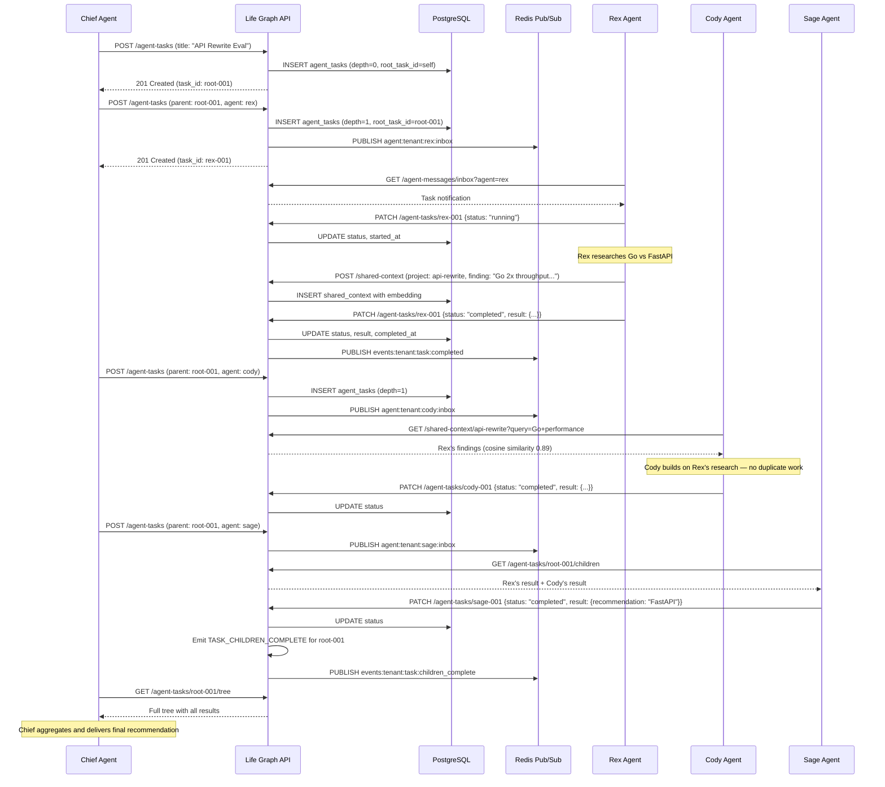
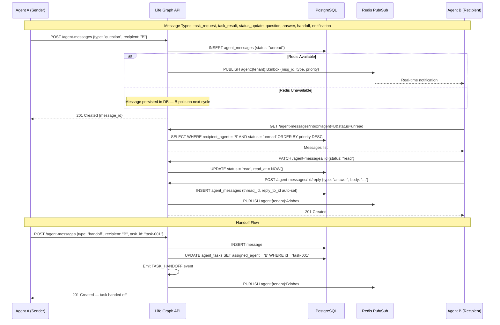
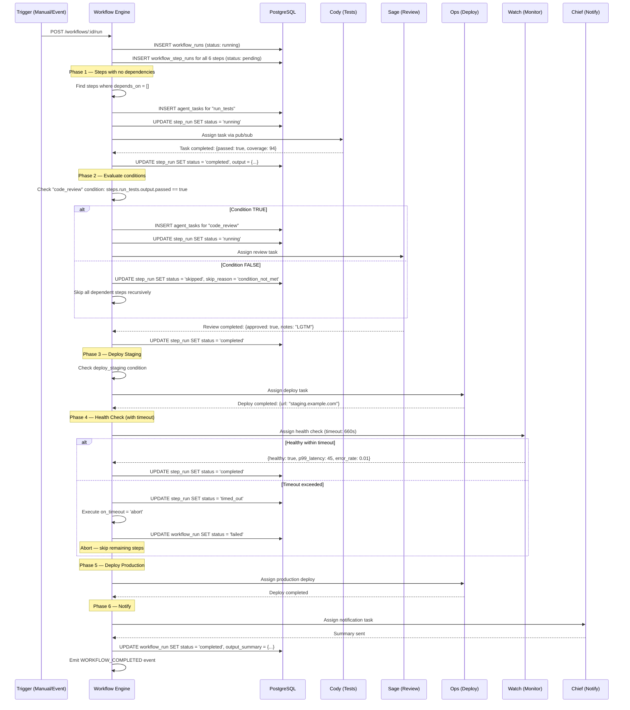

# Era 7 — Agent Networks: Feature Spec

> ✅ **STATUS: IMPLEMENTED (July 2026).** Migration `017_agent_networks.py`; APIs `api/agent_workflows.py`, `api/agent_tasks.py`, `api/agent_messages.py`, `api/agent_context.py`, `api/internal_sync.py`; tests `tests/integration/test_agent_networks.py`. The task checklist below was not ticked during implementation — treat the code as the source of truth. **Do not rebuild.**

> **Purpose**: Enable multiple AI agents to coordinate on complex tasks through delegation, communication, workflow orchestration, and shared context. A single agent working alone can handle simple tasks — but real-world projects require research, prototyping, review, and deployment working in concert.
>
> **Architecture ref**: `KNOWLEDGE.md` — extends the existing EventBus, Redis bridge, and tenant-scoped data model
>
> **Comms ref**: `.comms/README.md` — the file-based inter-agent protocol that this feature supersedes with a DB-backed, API-driven system
>
> **Multi-tenant**: All agent network data is scoped by `tenant_id`. Cross-tenant agent communication is explicitly blocked.

---

## Requirements

### Story 1: Agent-to-Agent Delegation

As an **AI agent (parent)**, I want to spawn sub-tasks and delegate them to specialized agents so that complex work is decomposed into smaller pieces handled by the best-suited agent.

#### Acceptance Criteria

- GIVEN a parent agent has a complex task WHEN it calls `POST /api/v1/agent-tasks` with `parent_task_id` set to its own task ID THEN the system creates a child task, links it to the parent, and sets `status = pending`
- GIVEN a parent task has spawned 3 child tasks WHEN I query `GET /api/v1/agent-tasks/:parentId/children` THEN I receive all 3 child tasks with their current statuses, assigned agents, and results
- GIVEN a child task completes with `status = completed` WHEN it is the last pending child of a parent THEN the system emits a `TASK_CHILDREN_COMPLETE` event so the parent agent can aggregate results
- GIVEN a child task fails with `status = failed` WHEN the parent has `on_child_failure = abort` THEN all sibling tasks are cancelled and the parent is notified with the failure reason
- GIVEN a child task fails WHEN the parent has `on_child_failure = continue` THEN the parent continues waiting for remaining siblings and receives the failure in the aggregated results
- GIVEN a delegation chain Chief → Rex → Cody WHEN I query `GET /api/v1/agent-tasks/:taskId/tree` THEN I see the full tree with depth indicators showing the parent-child hierarchy
- GIVEN a delegation depth exceeds 5 levels WHEN an agent tries to create a child task THEN the system returns `400 Bad Request` with message "Maximum delegation depth (5) exceeded" to prevent runaway recursion
- GIVEN a parent task is cancelled WHEN it has active children THEN all children are recursively cancelled with `status = cancelled` and `cancel_reason = parent_cancelled`

---

### Story 2: Agent Communication Protocol

As an **AI agent**, I want to send and receive structured messages to/from other agents so that I can ask questions, hand off work, and share status updates without file-based workarounds.

#### Acceptance Criteria

- GIVEN Agent Rex wants to ask Agent Cody a question WHEN Rex calls `POST /api/v1/agent-messages` with `type = question` and `recipient_agent = cody` THEN the message is stored and Cody receives it in their next inbox poll
- GIVEN Agent Cody has 3 unread messages WHEN Cody calls `GET /api/v1/agent-messages/inbox?status=unread` THEN all 3 messages are returned sorted by priority (critical > high > medium > low) then by `created_at`
- GIVEN a message of type `task_request` is sent WHEN the recipient agent accepts it THEN a new `agent_task` is auto-created and linked to the message via `source_message_id`
- GIVEN a message of type `task_result` is sent WHEN the recipient reads it THEN the associated task's `result` JSONB is updated with the message payload
- GIVEN Agent Rex sends a `handoff` message to Agent Sage WHEN Sage accepts THEN the original task's `assigned_agent` is updated from Rex to Sage, and a `TASK_HANDOFF` event is emitted
- GIVEN a message is sent with `type = status_update` WHEN any agent queries the task THEN the latest status update is visible in the task's `status_history` JSONB array
- GIVEN a message is sent to an agent that doesn't exist WHEN the system validates THEN it returns `404 Not Found` with message "Agent 'unknown_agent' not found"
- GIVEN Redis pub/sub is available WHEN a high-priority message is sent THEN the system publishes to `agent:{tenant_id}:{agent_name}:inbox` for real-time notification in addition to DB persistence

---

### Story 3: Cross-System Communication (Life Graph ↔ Uzhavu)

As a **platform operator**, I want Life Graph and Uzhavu AI Engine to exchange data so that agents learn from both systems and optimized prompts flow automatically.

#### Acceptance Criteria

- GIVEN Life Graph has extracted user preferences WHEN a sync trigger fires (hourly or on-demand) THEN Life Graph calls `POST /internal/sync/preferences` on the Uzhavu AI Engine with the latest preference memories, authenticated via shared API key
- GIVEN Uzhavu AI Engine has new analytics data (prompt performance, user satisfaction) WHEN the analytics aggregation job runs THEN Uzhavu calls `POST /internal/sync/analytics` on Life Graph, which stores the data as memories with `source_type = uzhavu_sync`
- GIVEN the shared API key in the request header (`X-Internal-API-Key`) does not match WHEN either system receives a sync request THEN it returns `401 Unauthorized` and logs the attempt
- GIVEN the target system is unreachable WHEN a sync request times out after 10 seconds THEN the sending system retries up to 3 times with exponential backoff (2s, 4s, 8s) and logs the failure
- GIVEN all retries fail WHEN the sync is abandoned THEN the system creates a `sync_failure` record in `cross_system_syncs` with the error details, and an admin alert is emitted via the EventBus
- GIVEN a successful sync WHEN the receiving system processes the data THEN it records the sync in `cross_system_syncs` with `status = completed`, `records_synced` count, and `sync_duration_ms`
- GIVEN Life Graph has learned that "user prefers concise responses" WHEN this preference is synced to Uzhavu THEN the Uzhavu AI Engine adjusts the persona prompt variables for that org automatically

---

### Story 4: Workflow Orchestration (DAG Execution)

As a **platform operator or agent**, I want to define and execute multi-step workflows as directed acyclic graphs so that complex processes like "deploy with confidence" run automatically with conditional branching.

#### Acceptance Criteria

- GIVEN I define a workflow with 6 steps as a JSON DAG WHEN I call `POST /api/v1/workflows` THEN the system validates the DAG (no cycles, all step references valid), stores it, and returns the workflow definition
- GIVEN a workflow "deploy_with_confidence" is defined WHEN I call `POST /api/v1/workflows/:id/run` THEN the system creates a `workflow_run` record, starts executing the first step(s) with no dependencies, and returns the run ID
- GIVEN Step 1 (run tests) completes with `output.passed = true` WHEN Step 2 (code review) has `depends_on = [step_1]` and `condition = "steps.step_1.output.passed == true"` THEN Step 2 is automatically started
- GIVEN Step 1 (run tests) completes with `output.passed = false` WHEN Step 2 has a condition requiring `passed == true` THEN Step 2 is skipped with `status = skipped` and `skip_reason = "condition_not_met"`, and dependent steps are also skipped
- GIVEN Step 4 (health check) has `timeout_seconds = 600` WHEN 600 seconds elapse without completion THEN the step is marked `status = timed_out` and the `on_timeout` action (abort or continue) is executed
- GIVEN a workflow run is in progress WHEN I call `GET /api/v1/workflows/:workflowId/runs/:runId` THEN I see each step's status (pending, running, completed, failed, skipped, timed_out), start/end times, and outputs
- GIVEN a workflow run completes all steps WHEN the final step finishes THEN the `workflow_run` is marked `status = completed` and a `WORKFLOW_COMPLETED` event is emitted with a summary of all step results
- GIVEN a workflow has a step with `retry_count = 2` WHEN that step fails on the first attempt THEN the system retries it (up to 2 more times) before marking it as failed
- GIVEN I want to cancel a running workflow WHEN I call `POST /api/v1/workflows/:workflowId/runs/:runId/cancel` THEN all pending/running steps are cancelled and the run is marked `status = cancelled`

---

### Story 5: Shared Context

As an **AI agent working in a team**, I want to access context and findings from other agents working on the same project so that I don't duplicate research and can build on prior work.

#### Acceptance Criteria

- GIVEN Agent Rex researched "Go vs FastAPI performance" WHEN Agent Cody starts a related task in the same project THEN Cody can call `GET /api/v1/shared-context/:projectId?query=Go+performance` and find Rex's research findings as context entries
- GIVEN a task creates a shared context entry WHEN the entry is stored THEN it has an embedding vector so that semantic search works across project context
- GIVEN a task completes with results WHEN the agent calls `POST /api/v1/shared-context` with `auto_extract = true` THEN key findings from the task result are extracted as individual context entries (using the existing extraction pipeline)
- GIVEN Agent Rex and Agent Cody are both working on tasks with `project_id = "api-rewrite"` WHEN either posts a context entry THEN the other can find it via `GET /api/v1/shared-context/:projectId`
- GIVEN a shared context entry exists with `content = "Go achieves 2x throughput vs Python for CPU-bound workloads"` WHEN Agent Cody asks a question about performance THEN semantic search surfaces this entry (cosine similarity ≥ 0.7)
- GIVEN a conversation thread (parent task + all child tasks) WHEN I call `GET /api/v1/shared-context/thread/:rootTaskId` THEN I see all context entries from every task in the thread, forming a complete knowledge trail
- GIVEN an agent tries to post a shared context entry with content identical to an existing entry (cosine ≥ 0.95) WHEN dedup is enabled THEN the system merges tags and updates `access_count` instead of creating a duplicate
- GIVEN a shared context entry has not been accessed in 30 days WHEN the decay sweep runs THEN its `relevance_score` is reduced but it is NOT deleted (agent context has longer retention than regular memories)

---

## Design

### Architecture Overview

```
┌──────────────┐     ┌──────────────────────────┐     ┌──────────────────┐
│  Agent A     │────▶│  Life Graph API           │────▶│  PostgreSQL      │
│  (Chief)     │     │  /agent-tasks             │     │  agent_tasks     │
│              │     │  /agent-messages           │     │  agent_messages  │
└──────────────┘     │  /workflows               │     │  workflows       │
                     │  /shared-context           │     │  shared_context  │
┌──────────────┐     │  /internal/sync            │     └──────────────────┘
│  Agent B     │────▶│                            │
│  (Rex)       │     │                            │     ┌──────────────────┐
│              │     │                            │────▶│  Redis           │
└──────────────┘     │                            │     │  pub/sub inbox   │
                     │                            │     │  workflow events  │
┌──────────────┐     │                            │     └──────────────────┘
│  Agent C     │────▶│                            │
│  (Cody)      │     └────────────┬───────────────┘
│              │                  │
└──────────────┘                  │ Internal sync
                     ┌────────────▼───────────────┐
                     │  Uzhavu AI Engine           │
                     │  POST /internal/sync/...    │
                     │  (FastAPI)                  │
                     └────────────────────────────┘
```

**Key flows:**
1. **Delegation**: Agent A creates a task → assigns to Agent B → B creates child tasks → results bubble up
2. **Messaging**: Agents exchange messages via DB-backed queues with Redis pub/sub for real-time notification
3. **Workflow**: DAG definition stored as JSON → execution engine walks the graph → conditional branching at each step
4. **Shared Context**: Task results are auto-extracted into project-scoped context with vector embeddings for semantic search
5. **Cross-System Sync**: Bidirectional webhook sync between Life Graph and Uzhavu via internal endpoints with shared API key auth

---

### Data Models

```sql
-- ============================================================
-- Agent Tasks — extends the task concept with delegation
-- ============================================================
CREATE TABLE agent_tasks (
    id                  UUID PRIMARY KEY DEFAULT gen_random_uuid(),
    tenant_id           VARCHAR(64) NOT NULL,

    -- ── Task Content ─────────────────────────────────────────
    title               TEXT NOT NULL,
    description         TEXT,
    task_type           VARCHAR(30) NOT NULL DEFAULT 'general',
        -- general | research | code | review | deploy | monitor
    instructions        TEXT,                             -- Detailed instructions for the assigned agent

    -- ── Assignment ───────────────────────────────────────────
    assigned_agent      VARCHAR(64) NOT NULL,             -- Agent name: chief, rex, cody, sage, ops, watch
    created_by_agent    VARCHAR(64) NOT NULL,             -- Agent that created this task
    project_id          VARCHAR(128),                     -- Groups tasks by project for shared context

    -- ── Delegation Tree ──────────────────────────────────────
    parent_task_id      UUID REFERENCES agent_tasks(id) ON DELETE SET NULL,
    root_task_id        UUID REFERENCES agent_tasks(id) ON DELETE SET NULL,
        -- Points to the top-level task in the chain (denormalized for fast tree queries)
    depth               INT NOT NULL DEFAULT 0,           -- 0 = root, 1 = first child, etc. Max 5
    on_child_failure    VARCHAR(20) NOT NULL DEFAULT 'continue',
        -- continue | abort

    -- ── Status ───────────────────────────────────────────────
    status              VARCHAR(20) NOT NULL DEFAULT 'pending',
        -- pending | claimed | running | completed | failed | cancelled | timed_out
    status_history      JSONB NOT NULL DEFAULT '[]',
        -- [{status, timestamp, agent, reason}]
    priority            VARCHAR(10) NOT NULL DEFAULT 'medium',
        -- low | medium | high | critical
    cancel_reason       TEXT,

    -- ── Result ───────────────────────────────────────────────
    result              JSONB,                            -- Structured output from the agent
    error               TEXT,                             -- Error message if failed
    retry_count         INT NOT NULL DEFAULT 0,
    max_retries         INT NOT NULL DEFAULT 2,

    -- ── Timing ───────────────────────────────────────────────
    timeout_seconds     INT DEFAULT 3600,                 -- Default 1 hour
    created_at          TIMESTAMPTZ NOT NULL DEFAULT NOW(),
    claimed_at          TIMESTAMPTZ,
    started_at          TIMESTAMPTZ,
    completed_at        TIMESTAMPTZ,
    deadline            TIMESTAMPTZ,                      -- Optional hard deadline

    -- ── Linking ──────────────────────────────────────────────
    source_message_id   UUID,                             -- Message that triggered this task
    workflow_run_id     UUID,                             -- If this task is part of a workflow run
    workflow_step_id    UUID,                             -- Specific workflow step

    -- ── Metadata ─────────────────────────────────────────────
    properties          JSONB NOT NULL DEFAULT '{}',      -- Extensible metadata
    tags                VARCHAR(50)[] DEFAULT '{}'
);

CREATE INDEX ix_agent_tasks_tenant_status ON agent_tasks(tenant_id, status);
CREATE INDEX ix_agent_tasks_assigned ON agent_tasks(tenant_id, assigned_agent, status);
CREATE INDEX ix_agent_tasks_parent ON agent_tasks(parent_task_id) WHERE parent_task_id IS NOT NULL;
CREATE INDEX ix_agent_tasks_root ON agent_tasks(root_task_id) WHERE root_task_id IS NOT NULL;
CREATE INDEX ix_agent_tasks_project ON agent_tasks(tenant_id, project_id) WHERE project_id IS NOT NULL;
CREATE INDEX ix_agent_tasks_workflow ON agent_tasks(workflow_run_id) WHERE workflow_run_id IS NOT NULL;
CREATE INDEX ix_agent_tasks_created ON agent_tasks(tenant_id, created_at DESC);
CREATE INDEX ix_agent_tasks_properties ON agent_tasks USING gin(properties);
CREATE INDEX ix_agent_tasks_tags ON agent_tasks USING gin(tags);


-- ============================================================
-- Agent Messages — structured communication between agents
-- ============================================================
CREATE TABLE agent_messages (
    id                  UUID PRIMARY KEY DEFAULT gen_random_uuid(),
    tenant_id           VARCHAR(64) NOT NULL,

    -- ── Routing ──────────────────────────────────────────────
    sender_agent        VARCHAR(64) NOT NULL,             -- Agent that sent the message
    recipient_agent     VARCHAR(64) NOT NULL,             -- Target agent
    thread_id           UUID,                             -- Groups related messages (like email threads)
    reply_to_id         UUID REFERENCES agent_messages(id) ON DELETE SET NULL,

    -- ── Content ──────────────────────────────────────────────
    message_type        VARCHAR(30) NOT NULL,
        -- task_request | task_result | status_update | question | answer | handoff | notification
    subject             VARCHAR(200),                     -- Brief subject line
    body                TEXT NOT NULL,                    -- Full message content
    payload             JSONB NOT NULL DEFAULT '{}',     -- Structured data (task params, results, etc.)
    attachments         JSONB DEFAULT '[]',              -- [{name, type, url}]

    -- ── Status ───────────────────────────────────────────────
    status              VARCHAR(20) NOT NULL DEFAULT 'unread',
        -- unread | read | archived | acted_on
    priority            VARCHAR(10) NOT NULL DEFAULT 'medium',
        -- low | medium | high | critical

    -- ── References ───────────────────────────────────────────
    task_id             UUID REFERENCES agent_tasks(id) ON DELETE SET NULL,
        -- Task this message relates to

    -- ── Timestamps ───────────────────────────────────────────
    created_at          TIMESTAMPTZ NOT NULL DEFAULT NOW(),
    read_at             TIMESTAMPTZ,
    expires_at          TIMESTAMPTZ,                      -- Auto-archive after this time

    -- ── Metadata ─────────────────────────────────────────────
    properties          JSONB NOT NULL DEFAULT '{}'
);

CREATE INDEX ix_agent_messages_inbox ON agent_messages(tenant_id, recipient_agent, status, priority DESC, created_at DESC);
CREATE INDEX ix_agent_messages_outbox ON agent_messages(tenant_id, sender_agent, created_at DESC);
CREATE INDEX ix_agent_messages_thread ON agent_messages(thread_id) WHERE thread_id IS NOT NULL;
CREATE INDEX ix_agent_messages_task ON agent_messages(task_id) WHERE task_id IS NOT NULL;
CREATE INDEX ix_agent_messages_type ON agent_messages(tenant_id, message_type);
CREATE INDEX ix_agent_messages_unread ON agent_messages(tenant_id, recipient_agent, created_at DESC)
    WHERE status = 'unread';


-- ============================================================
-- Cross-System Syncs — audit log for Life Graph ↔ Uzhavu
-- ============================================================
CREATE TABLE cross_system_syncs (
    id                  UUID PRIMARY KEY DEFAULT gen_random_uuid(),
    tenant_id           VARCHAR(64) NOT NULL,

    -- ── Sync Details ─────────────────────────────────────────
    direction           VARCHAR(20) NOT NULL,
        -- outbound (LG → Uzhavu) | inbound (Uzhavu → LG)
    sync_type           VARCHAR(40) NOT NULL,
        -- preferences | analytics | prompts | agent_context
    target_system       VARCHAR(40) NOT NULL,
        -- life_graph | uzhavu
    endpoint_url        TEXT NOT NULL,

    -- ── Result ───────────────────────────────────────────────
    status              VARCHAR(20) NOT NULL DEFAULT 'pending',
        -- pending | in_progress | completed | failed | partial
    records_sent        INT NOT NULL DEFAULT 0,
    records_synced      INT NOT NULL DEFAULT 0,
    records_failed      INT NOT NULL DEFAULT 0,
    sync_duration_ms    INT,
    error               TEXT,
    retry_count         INT NOT NULL DEFAULT 0,

    -- ── Timestamps ───────────────────────────────────────────
    created_at          TIMESTAMPTZ NOT NULL DEFAULT NOW(),
    started_at          TIMESTAMPTZ,
    completed_at        TIMESTAMPTZ,
    next_retry_at       TIMESTAMPTZ,

    -- ── Metadata ─────────────────────────────────────────────
    request_payload     JSONB,                            -- Redacted summary (not full payload)
    response_summary    JSONB,                            -- {status_code, body_preview}
    properties          JSONB NOT NULL DEFAULT '{}'
);

CREATE INDEX ix_css_tenant_status ON cross_system_syncs(tenant_id, status);
CREATE INDEX ix_css_tenant_type ON cross_system_syncs(tenant_id, sync_type, created_at DESC);
CREATE INDEX ix_css_retry ON cross_system_syncs(status, next_retry_at)
    WHERE status = 'failed' AND next_retry_at IS NOT NULL;


-- ============================================================
-- Workflows — DAG definitions for multi-agent processes
-- ============================================================
CREATE TABLE workflows (
    id                  UUID PRIMARY KEY DEFAULT gen_random_uuid(),
    tenant_id           VARCHAR(64) NOT NULL,

    -- ── Definition ───────────────────────────────────────────
    name                VARCHAR(128) NOT NULL,
    description         TEXT,
    version             INT NOT NULL DEFAULT 1,
    is_active           BOOLEAN NOT NULL DEFAULT true,

    -- ── Metadata ─────────────────────────────────────────────
    created_by          VARCHAR(64),                      -- Agent or user who defined it
    created_at          TIMESTAMPTZ NOT NULL DEFAULT NOW(),
    updated_at          TIMESTAMPTZ NOT NULL DEFAULT NOW(),
    properties          JSONB NOT NULL DEFAULT '{}',
    tags                VARCHAR(50)[] DEFAULT '{}'
);

CREATE UNIQUE INDEX ix_workflows_name ON workflows(tenant_id, name);
CREATE INDEX ix_workflows_tenant ON workflows(tenant_id, is_active);


-- ============================================================
-- Workflow Steps — individual nodes in the DAG
-- ============================================================
CREATE TABLE workflow_steps (
    id                  UUID PRIMARY KEY DEFAULT gen_random_uuid(),
    workflow_id         UUID NOT NULL REFERENCES workflows(id) ON DELETE CASCADE,

    -- ── Step Definition ──────────────────────────────────────
    step_key            VARCHAR(64) NOT NULL,             -- Unique within workflow: "run_tests", "code_review"
    name                VARCHAR(128) NOT NULL,
    description         TEXT,
    step_order          INT NOT NULL,                     -- Display order

    -- ── Execution ────────────────────────────────────────────
    assigned_agent      VARCHAR(64) NOT NULL,             -- Which agent runs this step
    task_type           VARCHAR(30) NOT NULL DEFAULT 'general',
    instructions        TEXT,                             -- Task instructions for the agent
    timeout_seconds     INT DEFAULT 3600,
    retry_count         INT NOT NULL DEFAULT 0,

    -- ── DAG Edges ────────────────────────────────────────────
    depends_on          VARCHAR(64)[] DEFAULT '{}',       -- step_keys this step depends on
    condition           TEXT,                             -- JSONPath or simple expression evaluated against parent outputs
        -- e.g. "steps.run_tests.output.passed == true"
    on_failure          VARCHAR(20) NOT NULL DEFAULT 'abort',
        -- abort | continue | skip_dependents
    on_timeout          VARCHAR(20) NOT NULL DEFAULT 'abort',

    -- ── Metadata ─────────────────────────────────────────────
    properties          JSONB NOT NULL DEFAULT '{}'
);

CREATE UNIQUE INDEX ix_wsteps_workflow_key ON workflow_steps(workflow_id, step_key);
CREATE INDEX ix_wsteps_workflow ON workflow_steps(workflow_id, step_order);


-- ============================================================
-- Workflow Runs — an execution instance of a workflow
-- ============================================================
CREATE TABLE workflow_runs (
    id                  UUID PRIMARY KEY DEFAULT gen_random_uuid(),
    workflow_id         UUID NOT NULL REFERENCES workflows(id) ON DELETE CASCADE,
    tenant_id           VARCHAR(64) NOT NULL,

    -- ── Execution State ──────────────────────────────────────
    status              VARCHAR(20) NOT NULL DEFAULT 'pending',
        -- pending | running | completed | failed | cancelled | timed_out
    trigger             VARCHAR(40) NOT NULL DEFAULT 'manual',
        -- manual | schedule | event | api
    triggered_by        VARCHAR(64),                      -- Agent or user

    -- ── Input / Output ───────────────────────────────────────
    input_params        JSONB NOT NULL DEFAULT '{}',     -- Parameters passed at run start
    output_summary      JSONB,                           -- Aggregated results from all steps

    -- ── Timestamps ───────────────────────────────────────────
    created_at          TIMESTAMPTZ NOT NULL DEFAULT NOW(),
    started_at          TIMESTAMPTZ,
    completed_at        TIMESTAMPTZ,

    -- ── Metadata ─────────────────────────────────────────────
    properties          JSONB NOT NULL DEFAULT '{}'
);

CREATE INDEX ix_wruns_workflow ON workflow_runs(workflow_id, created_at DESC);
CREATE INDEX ix_wruns_tenant ON workflow_runs(tenant_id, status);
CREATE INDEX ix_wruns_running ON workflow_runs(status) WHERE status = 'running';


-- ============================================================
-- Workflow Step Runs — per-step execution within a run
-- ============================================================
CREATE TABLE workflow_step_runs (
    id                  UUID PRIMARY KEY DEFAULT gen_random_uuid(),
    workflow_run_id     UUID NOT NULL REFERENCES workflow_runs(id) ON DELETE CASCADE,
    workflow_step_id    UUID NOT NULL REFERENCES workflow_steps(id) ON DELETE CASCADE,

    -- ── Execution State ──────────────────────────────────────
    status              VARCHAR(20) NOT NULL DEFAULT 'pending',
        -- pending | running | completed | failed | skipped | timed_out | cancelled
    skip_reason         TEXT,                             -- Why was this step skipped

    -- ── Assignment ───────────────────────────────────────────
    agent_task_id       UUID REFERENCES agent_tasks(id) ON DELETE SET NULL,
        -- The actual agent_task created for this step

    -- ── Result ───────────────────────────────────────────────
    output              JSONB,                            -- Step output data
    error               TEXT,
    attempt             INT NOT NULL DEFAULT 1,

    -- ── Timestamps ───────────────────────────────────────────
    created_at          TIMESTAMPTZ NOT NULL DEFAULT NOW(),
    started_at          TIMESTAMPTZ,
    completed_at        TIMESTAMPTZ,

    -- ── Metadata ─────────────────────────────────────────────
    properties          JSONB NOT NULL DEFAULT '{}'
);

CREATE UNIQUE INDEX ix_wsruns_run_step ON workflow_step_runs(workflow_run_id, workflow_step_id);
CREATE INDEX ix_wsruns_run ON workflow_step_runs(workflow_run_id, status);
CREATE INDEX ix_wsruns_task ON workflow_step_runs(agent_task_id) WHERE agent_task_id IS NOT NULL;


-- ============================================================
-- Shared Context — project-scoped knowledge across agents
-- ============================================================
CREATE TABLE shared_context (
    id                  UUID PRIMARY KEY DEFAULT gen_random_uuid(),
    tenant_id           VARCHAR(64) NOT NULL,

    -- ── Scope ────────────────────────────────────────────────
    project_id          VARCHAR(128) NOT NULL,            -- Groups context by project
    source_task_id      UUID REFERENCES agent_tasks(id) ON DELETE SET NULL,
    source_agent        VARCHAR(64) NOT NULL,             -- Agent that produced this context

    -- ── Content ──────────────────────────────────────────────
    title               VARCHAR(200) NOT NULL,
    content             TEXT NOT NULL,
    content_type        VARCHAR(30) NOT NULL DEFAULT 'finding',
        -- finding | decision | question | reference | code_snippet | analysis
    tags                VARCHAR(50)[] DEFAULT '{}',

    -- ── Relevance ────────────────────────────────────────────
    relevance_score     FLOAT NOT NULL DEFAULT 1.0,      -- Decays over time (0.0-1.0)
    access_count        INT NOT NULL DEFAULT 0,

    -- ── Deduplication ────────────────────────────────────────
    content_hash        VARCHAR(64),                      -- SHA-256 of normalized content
    embedding           vector(768),                      -- For semantic search

    -- ── Timestamps ───────────────────────────────────────────
    created_at          TIMESTAMPTZ NOT NULL DEFAULT NOW(),
    updated_at          TIMESTAMPTZ NOT NULL DEFAULT NOW(),
    last_accessed       TIMESTAMPTZ,

    -- ── Metadata ─────────────────────────────────────────────
    properties          JSONB NOT NULL DEFAULT '{}'
);

CREATE INDEX ix_shared_ctx_project ON shared_context(tenant_id, project_id);
CREATE INDEX ix_shared_ctx_task ON shared_context(source_task_id) WHERE source_task_id IS NOT NULL;
CREATE INDEX ix_shared_ctx_agent ON shared_context(tenant_id, source_agent);
CREATE INDEX ix_shared_ctx_type ON shared_context(tenant_id, project_id, content_type);
CREATE INDEX ix_shared_ctx_hash ON shared_context(tenant_id, project_id, content_hash);
CREATE INDEX ix_shared_ctx_tags ON shared_context USING gin(tags);
```

---

### API Contracts

#### Module Structure

```
life_graph/
├── api/
│   ├── agent_tasks.py              # Task CRUD, delegation, tree queries
│   ├── agent_messages.py           # Messaging inbox/outbox
│   ├── agent_workflows.py          # Workflow CRUD, run management
│   ├── agent_context.py            # Shared context CRUD, search
│   └── internal_sync.py            # Cross-system sync endpoints
├── services/
│   ├── delegation.py               # Task delegation engine + tree management
│   ├── agent_messaging.py          # Message routing + Redis pub/sub
│   ├── workflow_engine.py          # DAG execution engine
│   ├── shared_context.py           # Context management + dedup + search
│   └── cross_system_sync.py        # Sync orchestrator with retry logic
├── models/
│   └── db.py                       # + AgentTask, AgentMessage, Workflow, etc.
└── core/
    └── events.py                   # + TASK_* and WORKFLOW_* event types
```

---

#### Agent Task CRUD & Delegation

```
POST /api/v1/agent-tasks
X-Tenant-ID: <tenant_id>
X-API-Key: <api_key>
```

**Request:**
```json
{
    "title": "Research Go vs FastAPI for API rewrite",
    "description": "Compare performance, ecosystem, learning curve, and deployment story",
    "task_type": "research",
    "assigned_agent": "rex",
    "created_by_agent": "chief",
    "project_id": "api-rewrite",
    "parent_task_id": "550e8400-e29b-41d4-a716-446655440000",
    "priority": "high",
    "instructions": "Focus on: 1) Benchmark data for REST APIs, 2) Async support, 3) Library ecosystem for our use cases",
    "timeout_seconds": 7200,
    "on_child_failure": "continue",
    "tags": ["research", "go", "fastapi", "performance"]
}
```

**Response (201):**
```json
{
    "id": "7c9e6679-7425-40de-944b-e07fc1f90ae7",
    "tenant_id": "tenant_abc",
    "title": "Research Go vs FastAPI for API rewrite",
    "task_type": "research",
    "assigned_agent": "rex",
    "created_by_agent": "chief",
    "project_id": "api-rewrite",
    "parent_task_id": "550e8400-e29b-41d4-a716-446655440000",
    "root_task_id": "550e8400-e29b-41d4-a716-446655440000",
    "depth": 1,
    "status": "pending",
    "priority": "high",
    "created_at": "2026-07-07T00:00:00Z"
}
```

**Errors:**
- `400` — Maximum delegation depth exceeded (depth > 5)
- `400` — Parent task not found or belongs to different tenant
- `404` — `assigned_agent` not registered

```
GET /api/v1/agent-tasks/:taskId/children
X-Tenant-ID: <tenant_id>
```

**Response (200):**
```json
{
    "parent_task_id": "550e8400-e29b-41d4-a716-446655440000",
    "children": [
        {
            "id": "7c9e6679-7425-40de-944b-e07fc1f90ae7",
            "title": "Research Go vs FastAPI",
            "assigned_agent": "rex",
            "status": "completed",
            "result": {"recommendation": "FastAPI", "confidence": 0.8}
        },
        {
            "id": "8d0f7780-8536-51ef-055c-f18gd2g01bf8",
            "title": "Prototype REST API in Go",
            "assigned_agent": "cody",
            "status": "running",
            "result": null
        }
    ],
    "summary": {
        "total": 2,
        "completed": 1,
        "running": 1,
        "failed": 0,
        "pending": 0
    }
}
```

```
GET /api/v1/agent-tasks/:taskId/tree
X-Tenant-ID: <tenant_id>
```

**Response (200):**
```json
{
    "tree": {
        "id": "550e8400-e29b-41d4-a716-446655440000",
        "title": "API Rewrite Evaluation",
        "assigned_agent": "chief",
        "status": "running",
        "depth": 0,
        "children": [
            {
                "id": "7c9e6679-7425-40de-944b-e07fc1f90ae7",
                "title": "Research Go vs FastAPI",
                "assigned_agent": "rex",
                "status": "completed",
                "depth": 1,
                "children": []
            },
            {
                "id": "8d0f7780-8536-51ef-055c-f18gd2g01bf8",
                "title": "Prototype in Go",
                "assigned_agent": "cody",
                "status": "running",
                "depth": 1,
                "children": [
                    {
                        "id": "9e1g8891-9647-62fg-166d-g29he3h12cg9",
                        "title": "Write benchmark suite",
                        "assigned_agent": "cody",
                        "status": "pending",
                        "depth": 2,
                        "children": []
                    }
                ]
            }
        ]
    }
}
```

```
PATCH /api/v1/agent-tasks/:taskId
X-Tenant-ID: <tenant_id>
```

**Request (complete a task):**
```json
{
    "status": "completed",
    "result": {
        "recommendation": "FastAPI",
        "reasons": ["Existing team expertise", "Async native", "Pydantic validation"],
        "confidence": 0.85
    }
}
```

```
POST /api/v1/agent-tasks/:taskId/cancel
X-Tenant-ID: <tenant_id>
```

**Request:**
```json
{
    "reason": "Requirements changed — no longer evaluating Go"
}
```

Recursively cancels all children.

---

#### Agent Messaging

```
POST /api/v1/agent-messages
X-Tenant-ID: <tenant_id>
```

**Request:**
```json
{
    "sender_agent": "rex",
    "recipient_agent": "cody",
    "message_type": "question",
    "subject": "Go module structure for microservices?",
    "body": "I'm comparing Go and FastAPI. What's the recommended module structure for a Go microservice with 20+ endpoints? How does it compare to FastAPI's router pattern?",
    "priority": "high",
    "task_id": "7c9e6679-7425-40de-944b-e07fc1f90ae7",
    "payload": {
        "context": "api-rewrite research",
        "expected_response_type": "technical_analysis"
    }
}
```

**Response (201):**
```json
{
    "id": "msg-001",
    "sender_agent": "rex",
    "recipient_agent": "cody",
    "message_type": "question",
    "subject": "Go module structure for microservices?",
    "status": "unread",
    "priority": "high",
    "created_at": "2026-07-07T00:05:00Z"
}
```

```
GET /api/v1/agent-messages/inbox?status=unread&agent=cody&limit=20
X-Tenant-ID: <tenant_id>
```

**Response (200):**
```json
{
    "agent": "cody",
    "messages": [
        {
            "id": "msg-001",
            "sender_agent": "rex",
            "message_type": "question",
            "subject": "Go module structure for microservices?",
            "priority": "high",
            "status": "unread",
            "task_id": "7c9e6679-7425-40de-944b-e07fc1f90ae7",
            "created_at": "2026-07-07T00:05:00Z",
            "body_preview": "I'm comparing Go and FastAPI. What's the recommended..."
        }
    ],
    "unread_count": 1
}
```

```
PATCH /api/v1/agent-messages/:messageId
X-Tenant-ID: <tenant_id>
```

**Request (mark as read):**
```json
{
    "status": "read"
}
```

```
POST /api/v1/agent-messages/:messageId/reply
X-Tenant-ID: <tenant_id>
```

**Request:**
```json
{
    "sender_agent": "cody",
    "message_type": "answer",
    "body": "Go uses a flat package structure with internal/ for private packages. For 20+ endpoints, I'd recommend grouping by domain...",
    "payload": {
        "code_example": "// Example structure\ncmd/api/main.go\ninternal/handler/...\ninternal/service/..."
    }
}
```

Auto-sets `thread_id` from the original message, `reply_to_id` to the original message ID, and `recipient_agent` to the original sender.

---

#### Cross-System Sync (Internal)

```
POST /internal/sync/preferences
X-Internal-API-Key: <shared_key>
```

**Request (Life Graph → Uzhavu):**
```json
{
    "tenant_id": "tenant_abc",
    "sync_id": "sync-001",
    "preferences": [
        {
            "memory_id": "mem-001",
            "content": "User prefers concise responses under 200 words",
            "importance": 0.9,
            "confidence": 0.85,
            "tags": ["preference", "communication", "response-length"],
            "updated_at": "2026-07-06T12:00:00Z"
        }
    ],
    "sync_timestamp": "2026-07-07T00:00:00Z"
}
```

**Response (200):**
```json
{
    "sync_id": "sync-001",
    "status": "completed",
    "records_received": 1,
    "records_applied": 1,
    "records_skipped": 0
}
```

```
POST /internal/sync/analytics
X-Internal-API-Key: <shared_key>
```

**Request (Uzhavu → Life Graph):**
```json
{
    "tenant_id": "tenant_abc",
    "sync_id": "sync-002",
    "analytics": [
        {
            "prompt_name": "customer_support_persona",
            "satisfaction_score": 91.2,
            "avg_latency_ms": 1350,
            "total_uses": 3200,
            "period": "2026-07-06",
            "top_variables_used": ["org_name", "context"]
        }
    ],
    "sync_timestamp": "2026-07-07T01:00:00Z"
}
```

**Response (200):**
```json
{
    "sync_id": "sync-002",
    "status": "completed",
    "memories_created": 1,
    "memories_updated": 0
}
```

---

#### Workflow Management

```
POST /api/v1/workflows
X-Tenant-ID: <tenant_id>
```

**Request:**
```json
{
    "name": "deploy_with_confidence",
    "description": "Full deployment pipeline with tests, review, staging, health check, and production deploy",
    "steps": [
        {
            "step_key": "run_tests",
            "name": "Run Test Suite",
            "assigned_agent": "cody",
            "task_type": "code",
            "instructions": "Run the full test suite and report pass/fail with coverage",
            "depends_on": [],
            "timeout_seconds": 600,
            "retry_count": 1
        },
        {
            "step_key": "code_review",
            "name": "Review Changes",
            "assigned_agent": "sage",
            "task_type": "review",
            "instructions": "Review all changes since last deployment. Check for security issues, performance regressions, and code quality",
            "depends_on": ["run_tests"],
            "condition": "steps.run_tests.output.passed == true",
            "on_failure": "abort"
        },
        {
            "step_key": "deploy_staging",
            "name": "Deploy to Staging",
            "assigned_agent": "ops",
            "task_type": "deploy",
            "instructions": "Deploy the current build to the staging environment",
            "depends_on": ["code_review"],
            "condition": "steps.code_review.output.approved == true"
        },
        {
            "step_key": "health_check",
            "name": "Monitor Staging Health",
            "assigned_agent": "watch",
            "task_type": "monitor",
            "instructions": "Monitor staging for 10 minutes. Check HTTP 200 rate, error rate, p99 latency, and memory usage",
            "depends_on": ["deploy_staging"],
            "timeout_seconds": 660,
            "on_timeout": "abort"
        },
        {
            "step_key": "deploy_production",
            "name": "Deploy to Production",
            "assigned_agent": "ops",
            "task_type": "deploy",
            "instructions": "Deploy to production using blue-green deployment",
            "depends_on": ["health_check"],
            "condition": "steps.health_check.output.healthy == true"
        },
        {
            "step_key": "notify",
            "name": "Send Deployment Summary",
            "assigned_agent": "chief",
            "task_type": "general",
            "instructions": "Compile a summary of the entire deployment and notify the team",
            "depends_on": ["deploy_production"]
        }
    ]
}
```

**Response (201):**
```json
{
    "id": "wf-001",
    "name": "deploy_with_confidence",
    "version": 1,
    "step_count": 6,
    "is_active": true,
    "dag_valid": true,
    "created_at": "2026-07-07T00:00:00Z"
}
```

**Errors:**
- `400` — Cycle detected in DAG
- `400` — Step references unknown `depends_on` step_key
- `409` — Workflow with this name already exists

```
POST /api/v1/workflows/:workflowId/run
X-Tenant-ID: <tenant_id>
```

**Request:**
```json
{
    "trigger": "manual",
    "triggered_by": "chief",
    "input_params": {
        "branch": "main",
        "commit_sha": "abc123",
        "deploy_target": "production-us-east"
    }
}
```

**Response (201):**
```json
{
    "run_id": "run-001",
    "workflow_id": "wf-001",
    "workflow_name": "deploy_with_confidence",
    "status": "running",
    "steps": [
        {"step_key": "run_tests", "status": "running", "assigned_agent": "cody"},
        {"step_key": "code_review", "status": "pending", "assigned_agent": "sage"},
        {"step_key": "deploy_staging", "status": "pending", "assigned_agent": "ops"},
        {"step_key": "health_check", "status": "pending", "assigned_agent": "watch"},
        {"step_key": "deploy_production", "status": "pending", "assigned_agent": "ops"},
        {"step_key": "notify", "status": "pending", "assigned_agent": "chief"}
    ],
    "started_at": "2026-07-07T00:10:00Z"
}
```

```
GET /api/v1/workflows/:workflowId/runs/:runId
X-Tenant-ID: <tenant_id>
```

**Response (200):** Full run status with per-step details, outputs, and timing.

```
POST /api/v1/workflows/:workflowId/runs/:runId/cancel
X-Tenant-ID: <tenant_id>
```

**Request:**
```json
{
    "reason": "Critical bug found — aborting deployment"
}
```

---

#### Shared Context

```
POST /api/v1/shared-context
X-Tenant-ID: <tenant_id>
```

**Request:**
```json
{
    "project_id": "api-rewrite",
    "source_task_id": "7c9e6679-7425-40de-944b-e07fc1f90ae7",
    "source_agent": "rex",
    "title": "Go vs FastAPI Performance Comparison",
    "content": "Go achieves ~2x throughput for CPU-bound REST endpoints (50k vs 25k req/s). However, for IO-bound workloads with async DB queries, FastAPI is within 15% of Go. FastAPI's Pydantic validation adds ~2ms overhead per request but catches 90% of input errors at the boundary.",
    "content_type": "finding",
    "tags": ["performance", "go", "fastapi", "benchmark"]
}
```

**Response (201):**
```json
{
    "id": "ctx-001",
    "project_id": "api-rewrite",
    "title": "Go vs FastAPI Performance Comparison",
    "source_agent": "rex",
    "content_type": "finding",
    "relevance_score": 1.0,
    "created_at": "2026-07-07T01:00:00Z",
    "deduplicated": false
}
```

```
GET /api/v1/shared-context/:projectId?query=performance+comparison&limit=10
X-Tenant-ID: <tenant_id>
```

**Response (200):**
```json
{
    "project_id": "api-rewrite",
    "results": [
        {
            "id": "ctx-001",
            "title": "Go vs FastAPI Performance Comparison",
            "content": "Go achieves ~2x throughput for CPU-bound REST endpoints...",
            "source_agent": "rex",
            "source_task_id": "7c9e6679-7425-40de-944b-e07fc1f90ae7",
            "content_type": "finding",
            "relevance_score": 1.0,
            "similarity": 0.89,
            "created_at": "2026-07-07T01:00:00Z"
        }
    ],
    "total": 1
}
```

```
GET /api/v1/shared-context/thread/:rootTaskId
X-Tenant-ID: <tenant_id>
```

Returns all context entries from every task in the delegation tree, forming a complete knowledge trail for the conversation thread.

---

### Sequence Diagrams

#### Multi-Agent Delegation Flow



#### Agent Communication Protocol



#### Workflow DAG Execution



---

### Core Python Implementation

#### Delegation Engine

```python
"""Task delegation engine for agent-to-agent sub-task management.

Handles parent-child task relationships, recursive cancellation,
and completion event aggregation.
"""

from __future__ import annotations

import logging
import uuid
from dataclasses import dataclass
from datetime import datetime, timezone

from sqlalchemy import select, update
from sqlalchemy.ext.asyncio import AsyncSession

from life_graph.core.events import EventType, event_bus

logger = logging.getLogger(__name__)

MAX_DELEGATION_DEPTH = 5


@dataclass
class DelegationResult:
    """Result of a delegation operation."""

    task_id: uuid.UUID
    parent_task_id: uuid.UUID | None
    root_task_id: uuid.UUID
    depth: int
    assigned_agent: str
    status: str


class DelegationEngine:
    """Manages agent-to-agent task delegation with tree tracking.

    Responsibilities:
    - Create child tasks with proper tree linkage (parent_task_id, root_task_id, depth)
    - Enforce maximum delegation depth to prevent runaway recursion
    - Handle recursive cancellation when a parent is cancelled
    - Detect when all children of a parent complete and emit aggregation events
    - Track the full delegation tree for visualization

    All operations are tenant-scoped via the session's tenant context.
    """

    def __init__(self, session: AsyncSession) -> None:
        self._session = session

    async def create_child_task(
        self,
        *,
        tenant_id: str,
        parent_task_id: uuid.UUID,
        title: str,
        assigned_agent: str,
        created_by_agent: str,
        task_type: str = "general",
        description: str | None = None,
        instructions: str | None = None,
        project_id: str | None = None,
        priority: str = "medium",
        on_child_failure: str = "continue",
        timeout_seconds: int = 3600,
        tags: list[str] | None = None,
        properties: dict | None = None,
    ) -> DelegationResult:
        """Create a child task linked to a parent in the delegation tree.

        Args:
            tenant_id: Tenant scope for the task.
            parent_task_id: The parent task this child belongs to.
            title: Human-readable task title.
            assigned_agent: Agent name to assign the task to.
            created_by_agent: Agent name that created this delegation.
            task_type: Type of task (research, code, review, deploy, monitor).
            description: Detailed description of the task.
            instructions: Step-by-step instructions for the assigned agent.
            project_id: Optional project grouping for shared context.
            priority: Task priority (low, medium, high, critical).
            on_child_failure: Behavior when children fail (continue, abort).
            timeout_seconds: Maximum execution time before timeout.
            tags: Optional tags for categorization.
            properties: Optional extensible metadata.

        Returns:
            DelegationResult with the created task details.

        Raises:
            ValueError: If delegation depth exceeds MAX_DELEGATION_DEPTH.
            ValueError: If parent task not found or belongs to different tenant.
        """
        # Resolve parent task to get depth and root
        parent = await self._get_task(parent_task_id, tenant_id)
        if parent is None:
            raise ValueError(
                f"Parent task {parent_task_id} not found for tenant {tenant_id}"
            )

        new_depth = parent.depth + 1
        if new_depth > MAX_DELEGATION_DEPTH:
            raise ValueError(
                f"Maximum delegation depth ({MAX_DELEGATION_DEPTH}) exceeded. "
                f"Current depth: {parent.depth}, attempted: {new_depth}"
            )

        # Root is either the parent's root or the parent itself (if parent is root)
        root_task_id = parent.root_task_id or parent.id

        # Inherit project_id from parent if not specified
        effective_project_id = project_id or parent.project_id

        task_id = uuid.uuid4()
        now = datetime.now(timezone.utc)

        from life_graph.models.db import AgentTask

        task = AgentTask(
            id=task_id,
            tenant_id=tenant_id,
            title=title,
            description=description,
            task_type=task_type,
            instructions=instructions,
            assigned_agent=assigned_agent,
            created_by_agent=created_by_agent,
            project_id=effective_project_id,
            parent_task_id=parent_task_id,
            root_task_id=root_task_id,
            depth=new_depth,
            on_child_failure=on_child_failure,
            status="pending",
            priority=priority,
            timeout_seconds=timeout_seconds,
            tags=tags or [],
            properties=properties or {},
            created_at=now,
            status_history=[
                {
                    "status": "pending",
                    "timestamp": now.isoformat(),
                    "agent": created_by_agent,
                    "reason": f"Delegated by {created_by_agent}",
                }
            ],
        )

        self._session.add(task)
        await self._session.flush()

        # Emit delegation event
        await event_bus.emit(
            EventType.TASK_DELEGATED,
            {
                "task_id": str(task_id),
                "parent_task_id": str(parent_task_id),
                "root_task_id": str(root_task_id),
                "assigned_agent": assigned_agent,
                "created_by_agent": created_by_agent,
                "depth": new_depth,
                "tenant_id": tenant_id,
            },
            source="delegation_engine",
        )

        logger.info(
            "Created child task %s (depth=%d) under parent %s, assigned to %s",
            task_id, new_depth, parent_task_id, assigned_agent,
        )

        return DelegationResult(
            task_id=task_id,
            parent_task_id=parent_task_id,
            root_task_id=root_task_id,
            depth=new_depth,
            assigned_agent=assigned_agent,
            status="pending",
        )

    async def on_task_completed(
        self,
        task_id: uuid.UUID,
        tenant_id: str,
    ) -> None:
        """Handle task completion — check if all siblings are done.

        When the last child of a parent completes (or fails), emit
        TASK_CHILDREN_COMPLETE so the parent can aggregate results.

        Also handles the on_child_failure policy: if 'abort' and a child
        failed, cancel all remaining siblings.
        """
        task = await self._get_task(task_id, tenant_id)
        if task is None or task.parent_task_id is None:
            return  # Root task or not found — nothing to aggregate

        parent = await self._get_task(task.parent_task_id, tenant_id)
        if parent is None:
            return

        # Get all siblings (children of the same parent)
        siblings = await self._get_children(parent.id, tenant_id)

        # Check on_child_failure policy
        if task.status == "failed" and parent.on_child_failure == "abort":
            # Cancel all non-terminal siblings
            for sibling in siblings:
                if sibling.status in ("pending", "claimed", "running"):
                    await self.cancel_task(
                        sibling.id,
                        tenant_id,
                        reason="Sibling task failed and parent has on_child_failure=abort",
                    )
            # Emit failure event for parent
            await event_bus.emit(
                EventType.TASK_CHILD_FAILED,
                {
                    "parent_task_id": str(parent.id),
                    "failed_task_id": str(task_id),
                    "policy": "abort",
                    "tenant_id": tenant_id,
                },
                source="delegation_engine",
            )
            return

        # Check if all children are in terminal state
        terminal_statuses = {"completed", "failed", "cancelled", "timed_out", "skipped"}
        all_done = all(s.status in terminal_statuses for s in siblings)

        if all_done:
            results = {
                str(s.id): {
                    "title": s.title,
                    "assigned_agent": s.assigned_agent,
                    "status": s.status,
                    "result": s.result,
                }
                for s in siblings
            }

            await event_bus.emit(
                EventType.TASK_CHILDREN_COMPLETE,
                {
                    "parent_task_id": str(parent.id),
                    "children_results": results,
                    "tenant_id": tenant_id,
                },
                source="delegation_engine",
            )
            logger.info(
                "All children of task %s completed — emitting aggregation event",
                parent.id,
            )

    async def cancel_task(
        self,
        task_id: uuid.UUID,
        tenant_id: str,
        reason: str = "Cancelled by user",
    ) -> int:
        """Cancel a task and recursively cancel all its children.

        Returns the total number of tasks cancelled (including children).
        """
        cancelled_count = 0
        task = await self._get_task(task_id, tenant_id)
        if task is None:
            return 0

        if task.status in ("completed", "failed", "cancelled"):
            return 0  # Already terminal

        # Cancel this task
        now = datetime.now(timezone.utc)
        task.status = "cancelled"
        task.cancel_reason = reason
        task.completed_at = now
        task.status_history.append(
            {
                "status": "cancelled",
                "timestamp": now.isoformat(),
                "agent": "system",
                "reason": reason,
            }
        )
        cancelled_count += 1

        # Recursively cancel children
        children = await self._get_children(task_id, tenant_id)
        for child in children:
            cancelled_count += await self.cancel_task(
                child.id,
                tenant_id,
                reason="parent_cancelled",
            )

        await self._session.flush()

        logger.info(
            "Cancelled task %s and %d children. Reason: %s",
            task_id, cancelled_count - 1, reason,
        )

        return cancelled_count

    async def get_task_tree(
        self,
        root_task_id: uuid.UUID,
        tenant_id: str,
    ) -> dict:
        """Build the full delegation tree from a root task.

        Returns a nested dict representing the tree structure with
        task details at each node.
        """
        root = await self._get_task(root_task_id, tenant_id)
        if root is None:
            return {}

        return await self._build_tree_node(root, tenant_id)

    async def _build_tree_node(self, task, tenant_id: str) -> dict:
        """Recursively build a tree node dict."""
        children = await self._get_children(task.id, tenant_id)
        child_nodes = [
            await self._build_tree_node(child, tenant_id)
            for child in children
        ]

        return {
            "id": str(task.id),
            "title": task.title,
            "assigned_agent": task.assigned_agent,
            "status": task.status,
            "depth": task.depth,
            "result": task.result,
            "created_at": task.created_at.isoformat() if task.created_at else None,
            "completed_at": task.completed_at.isoformat() if task.completed_at else None,
            "children": child_nodes,
        }

    async def _get_task(self, task_id: uuid.UUID, tenant_id: str):
        """Fetch a single task by ID, scoped by tenant."""
        from life_graph.models.db import AgentTask

        result = await self._session.execute(
            select(AgentTask).where(
                AgentTask.id == task_id,
                AgentTask.tenant_id == tenant_id,
            )
        )
        return result.scalar_one_or_none()

    async def _get_children(self, parent_task_id: uuid.UUID, tenant_id: str):
        """Fetch all direct children of a task."""
        from life_graph.models.db import AgentTask

        result = await self._session.execute(
            select(AgentTask).where(
                AgentTask.parent_task_id == parent_task_id,
                AgentTask.tenant_id == tenant_id,
            ).order_by(AgentTask.created_at)
        )
        return result.scalars().all()
```

#### Workflow Execution Engine

```python
"""Workflow execution engine for DAG-based multi-agent orchestration.

Walks a directed acyclic graph of workflow steps, evaluating conditions
at each node to decide whether to run, skip, or abort.
"""

from __future__ import annotations

import logging
import uuid
from datetime import datetime, timezone
from typing import Any

from sqlalchemy import select
from sqlalchemy.ext.asyncio import AsyncSession

from life_graph.core.events import EventType, event_bus

logger = logging.getLogger(__name__)


class ConditionEvaluator:
    """Evaluate step conditions against completed step outputs.

    Supports simple dot-notation expressions like:
        steps.run_tests.output.passed == true
        steps.code_review.output.approved == true
        steps.health_check.output.error_rate < 0.05
    """

    def __init__(self, step_outputs: dict[str, dict[str, Any]]) -> None:
        """Initialize with a map of step_key → {status, output}."""
        self._step_outputs = step_outputs

    def evaluate(self, condition: str | None) -> bool:
        """Evaluate a condition expression. Returns True if condition is None (no condition)."""
        if not condition:
            return True

        try:
            return self._eval_expression(condition.strip())
        except Exception:
            logger.warning(
                "Failed to evaluate condition '%s' — defaulting to False",
                condition,
                exc_info=True,
            )
            return False

    def _eval_expression(self, expr: str) -> bool:
        """Parse and evaluate a simple comparison expression.

        Format: <path> <operator> <value>
        Example: steps.run_tests.output.passed == true
        """
        # Split on operator
        for op in ("==", "!=", ">=", "<=", ">", "<"):
            if op in expr:
                left, right = expr.split(op, 1)
                left_val = self._resolve_path(left.strip())
                right_val = self._parse_value(right.strip())
                return self._compare(left_val, op, right_val)

        raise ValueError(f"No valid operator found in expression: {expr}")

    def _resolve_path(self, path: str) -> Any:
        """Resolve a dot-notation path like 'steps.run_tests.output.passed'."""
        parts = path.split(".")
        if parts[0] != "steps" or len(parts) < 3:
            raise ValueError(f"Path must start with 'steps.<step_key>': {path}")

        step_key = parts[1]
        step_data = self._step_outputs.get(step_key)
        if step_data is None:
            raise ValueError(f"Step '{step_key}' not found in outputs")

        # Navigate the remaining path
        current = step_data
        for part in parts[2:]:
            if isinstance(current, dict):
                current = current.get(part)
            else:
                raise ValueError(f"Cannot traverse '{part}' on non-dict: {current}")

        return current

    @staticmethod
    def _parse_value(value_str: str) -> Any:
        """Parse a literal value from the right side of a comparison."""
        if value_str.lower() == "true":
            return True
        if value_str.lower() == "false":
            return False
        if value_str.lower() == "null":
            return None
        try:
            return int(value_str)
        except ValueError:
            pass
        try:
            return float(value_str)
        except ValueError:
            pass
        # Strip quotes for string values
        if value_str.startswith(("'", '"')) and value_str.endswith(("'", '"')):
            return value_str[1:-1]
        return value_str

    @staticmethod
    def _compare(left: Any, op: str, right: Any) -> bool:
        """Compare two values using the given operator."""
        if op == "==":
            return left == right
        if op == "!=":
            return left != right
        if op == ">":
            return left > right
        if op == "<":
            return left < right
        if op == ">=":
            return left >= right
        if op == "<=":
            return left <= right
        raise ValueError(f"Unknown operator: {op}")


class WorkflowEngine:
    """Execute workflow DAGs step by step with condition evaluation.

    The engine:
    1. Starts a workflow run and creates step_run records for each step
    2. Identifies steps with no unmet dependencies (ready to run)
    3. Creates agent_tasks for ready steps and assigns to agents
    4. When a step completes, re-evaluates the DAG for newly ready steps
    5. Handles conditions, timeouts, retries, and cancellation

    All operations are tenant-scoped.
    """

    def __init__(self, session: AsyncSession) -> None:
        self._session = session

    async def start_run(
        self,
        *,
        workflow_id: uuid.UUID,
        tenant_id: str,
        trigger: str = "manual",
        triggered_by: str | None = None,
        input_params: dict | None = None,
    ) -> uuid.UUID:
        """Start a new workflow run.

        Creates the workflow_run record and step_run records for each step,
        then kicks off steps with no dependencies.

        Returns the run ID.
        """
        from life_graph.models.db import WorkflowRun, WorkflowStep, WorkflowStepRun

        now = datetime.now(timezone.utc)

        # Fetch workflow steps
        steps = await self._get_workflow_steps(workflow_id)
        if not steps:
            raise ValueError(f"Workflow {workflow_id} has no steps")

        # Validate DAG (no cycles)
        self._validate_dag(steps)

        # Create run
        run_id = uuid.uuid4()
        run = WorkflowRun(
            id=run_id,
            workflow_id=workflow_id,
            tenant_id=tenant_id,
            status="running",
            trigger=trigger,
            triggered_by=triggered_by,
            input_params=input_params or {},
            created_at=now,
            started_at=now,
        )
        self._session.add(run)

        # Create step runs
        step_runs = {}
        for step in steps:
            step_run = WorkflowStepRun(
                id=uuid.uuid4(),
                workflow_run_id=run_id,
                workflow_step_id=step.id,
                status="pending",
                created_at=now,
            )
            self._session.add(step_run)
            step_runs[step.step_key] = step_run

        await self._session.flush()

        # Start steps with no dependencies
        await self._advance_dag(run_id, tenant_id, steps, step_runs)

        await event_bus.emit(
            EventType.WORKFLOW_STARTED,
            {
                "run_id": str(run_id),
                "workflow_id": str(workflow_id),
                "tenant_id": tenant_id,
                "trigger": trigger,
                "step_count": len(steps),
            },
            source="workflow_engine",
        )

        logger.info(
            "Started workflow run %s for workflow %s with %d steps",
            run_id, workflow_id, len(steps),
        )

        return run_id

    async def on_step_completed(
        self,
        *,
        run_id: uuid.UUID,
        step_key: str,
        tenant_id: str,
        status: str,
        output: dict | None = None,
        error: str | None = None,
    ) -> None:
        """Handle a step completing — advance the DAG.

        Updates the step_run record, evaluates conditions for dependent
        steps, and either starts them or skips them. If all steps are
        terminal, completes the workflow run.
        """
        from life_graph.models.db import WorkflowStep, WorkflowStepRun

        now = datetime.now(timezone.utc)

        # Update step run
        step_run = await self._get_step_run_by_key(run_id, step_key)
        if step_run is None:
            logger.warning("Step run not found for %s in run %s", step_key, run_id)
            return

        step_run.status = status
        step_run.output = output
        step_run.error = error
        step_run.completed_at = now

        await self._session.flush()

        # Get all steps and step_runs
        steps = await self._get_run_steps(run_id)
        step_runs = await self._get_all_step_runs(run_id)

        # Check for failure with abort policy
        if status == "failed":
            step_def = next((s for s in steps if s.step_key == step_key), None)
            if step_def and step_def.on_failure == "abort":
                await self._abort_run(run_id, tenant_id, f"Step '{step_key}' failed with abort policy")
                return

        # Advance the DAG
        await self._advance_dag(run_id, tenant_id, steps, step_runs)

        # Check if all steps are terminal
        terminal = {"completed", "failed", "skipped", "timed_out", "cancelled"}
        all_runs = await self._get_all_step_runs(run_id)
        if all(sr.status in terminal for sr in all_runs.values()):
            await self._complete_run(run_id, tenant_id, all_runs)

    async def _advance_dag(
        self,
        run_id: uuid.UUID,
        tenant_id: str,
        steps: list,
        step_runs: dict,
    ) -> None:
        """Find and start all steps whose dependencies are satisfied."""
        # Build outputs map for condition evaluation
        step_outputs = {}
        for step_key, sr in step_runs.items():
            if sr.status == "completed":
                step_outputs[step_key] = {"status": sr.status, "output": sr.output or {}}

        evaluator = ConditionEvaluator(step_outputs)

        for step in steps:
            sr = step_runs.get(step.step_key)
            if sr is None or sr.status != "pending":
                continue

            # Check if all dependencies are satisfied
            deps_met = True
            deps_failed = False
            for dep_key in (step.depends_on or []):
                dep_sr = step_runs.get(dep_key)
                if dep_sr is None:
                    deps_met = False
                    break
                if dep_sr.status in ("pending", "running", "claimed"):
                    deps_met = False
                    break
                if dep_sr.status in ("failed", "cancelled", "timed_out", "skipped"):
                    deps_failed = True

            if not deps_met:
                continue

            if deps_failed:
                # A dependency failed — skip this step
                sr.status = "skipped"
                sr.skip_reason = "dependency_failed"
                sr.completed_at = datetime.now(timezone.utc)
                await self._session.flush()
                continue

            # Evaluate condition
            if not evaluator.evaluate(step.condition):
                sr.status = "skipped"
                sr.skip_reason = "condition_not_met"
                sr.completed_at = datetime.now(timezone.utc)
                await self._session.flush()
                logger.info(
                    "Skipping step '%s' — condition not met: %s",
                    step.step_key, step.condition,
                )
                continue

            # All dependencies met and condition passed — start the step
            await self._start_step(run_id, tenant_id, step, sr)

    async def _start_step(
        self,
        run_id: uuid.UUID,
        tenant_id: str,
        step,
        step_run,
    ) -> None:
        """Create an agent_task for a workflow step and start it."""
        from life_graph.models.db import AgentTask

        now = datetime.now(timezone.utc)
        task_id = uuid.uuid4()

        task = AgentTask(
            id=task_id,
            tenant_id=tenant_id,
            title=step.name,
            description=step.description,
            task_type=step.task_type,
            instructions=step.instructions,
            assigned_agent=step.assigned_agent,
            created_by_agent="workflow_engine",
            status="pending",
            timeout_seconds=step.timeout_seconds,
            max_retries=step.retry_count,
            workflow_run_id=run_id,
            workflow_step_id=step.id,
            created_at=now,
            status_history=[
                {
                    "status": "pending",
                    "timestamp": now.isoformat(),
                    "agent": "workflow_engine",
                    "reason": f"Workflow step: {step.step_key}",
                }
            ],
        )
        self._session.add(task)

        step_run.status = "running"
        step_run.agent_task_id = task_id
        step_run.started_at = now

        await self._session.flush()

        logger.info(
            "Started workflow step '%s' (run %s) — assigned to %s",
            step.step_key, run_id, step.assigned_agent,
        )

    async def _complete_run(
        self,
        run_id: uuid.UUID,
        tenant_id: str,
        step_runs: dict,
    ) -> None:
        """Mark a workflow run as completed and emit the completion event."""
        from life_graph.models.db import WorkflowRun

        now = datetime.now(timezone.utc)

        result = await self._session.execute(
            select(WorkflowRun).where(WorkflowRun.id == run_id)
        )
        run = result.scalar_one_or_none()
        if run is None:
            return

        # Determine overall status
        any_failed = any(sr.status == "failed" for sr in step_runs.values())
        run.status = "failed" if any_failed else "completed"
        run.completed_at = now
        run.output_summary = {
            step_key: {
                "status": sr.status,
                "output": sr.output,
                "error": sr.error,
            }
            for step_key, sr in step_runs.items()
        }

        await self._session.flush()

        await event_bus.emit(
            EventType.WORKFLOW_COMPLETED,
            {
                "run_id": str(run_id),
                "status": run.status,
                "tenant_id": tenant_id,
                "summary": run.output_summary,
            },
            source="workflow_engine",
        )

        logger.info("Workflow run %s completed with status: %s", run_id, run.status)

    async def _abort_run(
        self,
        run_id: uuid.UUID,
        tenant_id: str,
        reason: str,
    ) -> None:
        """Abort a workflow run — cancel all pending steps."""
        from life_graph.models.db import WorkflowRun

        now = datetime.now(timezone.utc)

        result = await self._session.execute(
            select(WorkflowRun).where(WorkflowRun.id == run_id)
        )
        run = result.scalar_one_or_none()
        if run:
            run.status = "failed"
            run.completed_at = now

        # Cancel all pending/running step runs
        step_runs = await self._get_all_step_runs(run_id)
        for sr in step_runs.values():
            if sr.status in ("pending", "running"):
                sr.status = "cancelled"
                sr.skip_reason = reason
                sr.completed_at = now

        await self._session.flush()

        await event_bus.emit(
            EventType.WORKFLOW_FAILED,
            {
                "run_id": str(run_id),
                "reason": reason,
                "tenant_id": tenant_id,
            },
            source="workflow_engine",
        )

        logger.warning("Workflow run %s aborted: %s", run_id, reason)

    def _validate_dag(self, steps: list) -> None:
        """Validate that the workflow steps form a valid DAG (no cycles).

        Uses Kahn's algorithm for topological sort — if we can't sort
        all nodes, there's a cycle.

        Raises:
            ValueError: If a cycle is detected or a dependency references
                an unknown step_key.
        """
        step_keys = {s.step_key for s in steps}
        in_degree: dict[str, int] = {key: 0 for key in step_keys}
        adjacency: dict[str, list[str]] = {key: [] for key in step_keys}

        for step in steps:
            for dep in (step.depends_on or []):
                if dep not in step_keys:
                    raise ValueError(
                        f"Step '{step.step_key}' depends on unknown step '{dep}'"
                    )
                adjacency[dep].append(step.step_key)
                in_degree[step.step_key] += 1

        # Kahn's algorithm
        queue = [key for key, degree in in_degree.items() if degree == 0]
        sorted_count = 0

        while queue:
            current = queue.pop(0)
            sorted_count += 1
            for neighbor in adjacency[current]:
                in_degree[neighbor] -= 1
                if in_degree[neighbor] == 0:
                    queue.append(neighbor)

        if sorted_count != len(step_keys):
            raise ValueError(
                "Cycle detected in workflow DAG — "
                "steps cannot have circular dependencies"
            )

    # ── DB helpers (replace with actual model queries) ─────────

    async def _get_workflow_steps(self, workflow_id: uuid.UUID) -> list:
        """Fetch all steps for a workflow, ordered by step_order."""
        from life_graph.models.db import WorkflowStep

        result = await self._session.execute(
            select(WorkflowStep)
            .where(WorkflowStep.workflow_id == workflow_id)
            .order_by(WorkflowStep.step_order)
        )
        return result.scalars().all()

    async def _get_run_steps(self, run_id: uuid.UUID) -> list:
        """Fetch workflow steps for a given run."""
        from life_graph.models.db import WorkflowRun, WorkflowStep

        result = await self._session.execute(
            select(WorkflowRun).where(WorkflowRun.id == run_id)
        )
        run = result.scalar_one_or_none()
        if run is None:
            return []
        return await self._get_workflow_steps(run.workflow_id)

    async def _get_step_run_by_key(self, run_id: uuid.UUID, step_key: str):
        """Fetch a step_run by its step_key within a run."""
        from life_graph.models.db import WorkflowStep, WorkflowStepRun

        result = await self._session.execute(
            select(WorkflowStepRun)
            .join(WorkflowStep, WorkflowStepRun.workflow_step_id == WorkflowStep.id)
            .where(
                WorkflowStepRun.workflow_run_id == run_id,
                WorkflowStep.step_key == step_key,
            )
        )
        return result.scalar_one_or_none()

    async def _get_all_step_runs(self, run_id: uuid.UUID) -> dict:
        """Fetch all step_runs for a run, keyed by step_key."""
        from life_graph.models.db import WorkflowStep, WorkflowStepRun

        result = await self._session.execute(
            select(WorkflowStepRun, WorkflowStep.step_key)
            .join(WorkflowStep, WorkflowStepRun.workflow_step_id == WorkflowStep.id)
            .where(WorkflowStepRun.workflow_run_id == run_id)
        )
        return {step_key: sr for sr, step_key in result.all()}
```

---

### New Event Types

The following event types are added to `life_graph/core/events.py`:

```python
# ── Agent Network Events ─────────────────────────────────────
TASK_DELEGATED = "task:delegated"
TASK_COMPLETED = "task:completed"
TASK_FAILED = "task:failed"
TASK_CHILDREN_COMPLETE = "task:children_complete"
TASK_CHILD_FAILED = "task:child_failed"
TASK_HANDOFF = "task:handoff"
TASK_CANCELLED = "task:cancelled"
MESSAGE_SENT = "message:sent"
MESSAGE_READ = "message:read"
WORKFLOW_STARTED = "workflow:started"
WORKFLOW_COMPLETED = "workflow:completed"
WORKFLOW_FAILED = "workflow:failed"
WORKFLOW_STEP_COMPLETED = "workflow:step_completed"
SYNC_COMPLETED = "sync:completed"
SYNC_FAILED = "sync:failed"
CONTEXT_SHARED = "context:shared"
```

---

### Dependencies & Integrations

| Dependency | Purpose | Notes |
|:-----------|:--------|:------|
| **Redis pub/sub** | Real-time agent inbox notifications | Existing `RedisBridge` extended for agent channels |
| **pgvector** | Semantic search on `shared_context.embedding` | Existing embedding pipeline reused |
| **EventBus** | Internal event routing for task/workflow lifecycle | 16 new event types added |
| **Extraction Pipeline** | Auto-extract context entries from task results | Existing `life_graph/extraction/pipeline.py` |
| **Embedding Service** | Generate embeddings for shared context entries | Existing `life_graph/services/embeddings.py` |
| **Uzhavu AI Engine** | Cross-system sync target | New internal endpoints on both sides |
| **httpx** | Async HTTP client for cross-system sync requests | Already in dependencies |

### Error Handling

| Scenario | Action |
|:---------|:-------|
| Delegation depth > 5 | Return 400: "Maximum delegation depth (5) exceeded" |
| Parent task not found / wrong tenant | Return 400: "Parent task not found for this tenant" |
| Agent name not registered | Return 404: "Agent 'unknown' not found" |
| Cycle detected in workflow DAG | Return 400: "Cycle detected — steps cannot have circular dependencies" |
| Step references unknown dependency | Return 400: "Step 'X' depends on unknown step 'Y'" |
| Cross-system sync auth failure | Return 401, log attempt, do not retry |
| Cross-system sync timeout | Retry 3x with exponential backoff (2s, 4s, 8s), then record failure |
| Workflow step timeout | Mark step `timed_out`, execute `on_timeout` policy (abort or continue) |
| Message to non-existent agent | Return 404: "Agent 'X' not found" |
| Duplicate shared context (cosine ≥ 0.95) | Merge tags and increment access_count instead of inserting |
| Workflow run cancel | Recursively cancel all pending/running steps and agent tasks |

### Security Considerations

| Concern | Mitigation |
|:--------|:-----------|
| Cross-tenant task access | All queries scoped by `tenant_id` — agents cannot see other tenants' tasks |
| Cross-system auth | Shared API key in `X-Internal-API-Key` header, rotated monthly, stored in env vars |
| Delegation depth bomb | Hard limit of 5 levels prevents recursive task explosion |
| Workflow infinite loops | DAG validation using Kahn's algorithm rejects cyclic definitions |
| Message spoofing | Sender agent identity verified against authenticated session |
| Context data leakage | Shared context scoped by `project_id` within tenant |

---

## Tasks

### Phase 1: Foundation — Schema & Models (~3 days)

- [ ] Add `AgentTask`, `AgentMessage`, `CrossSystemSync`, `Workflow`, `WorkflowStep`, `WorkflowRun`, `WorkflowStepRun`, `SharedContext` models to `life_graph/models/db.py` following existing `mapped_column` patterns (~6h)
- [ ] Create Alembic migration #006 with all 8 tables, indexes, and foreign keys (~2h)
- [ ] Run migration, verify tables, indexes, unique constraints, and GIN indexes in PostgreSQL (~30m)
- [ ] Add 16 new event types to `EventType` enum in `life_graph/core/events.py` (~30m)
- [ ] Add Pydantic request/response schemas in `life_graph/schemas/` for all new endpoints (~4h)
- [ ] Write model-level unit tests: create records, verify constraints, test cascade deletes (~3h)

### Phase 2: Task Delegation Engine (~4 days)

- [ ] Implement `DelegationEngine` in `life_graph/services/delegation.py` — create_child_task with depth tracking, root_task_id resolution, and project_id inheritance (~4h)
- [ ] Implement `on_task_completed` — detect when all children are done, emit `TASK_CHILDREN_COMPLETE`, handle `on_child_failure` policy (~3h)
- [ ] Implement `cancel_task` with recursive child cancellation and status_history updates (~2h)
- [ ] Implement `get_task_tree` — recursive tree builder for visualization (~2h)
- [ ] Create `life_graph/api/agent_tasks.py` router with endpoints: `POST /agent-tasks`, `GET /:taskId`, `PATCH /:taskId`, `GET /:taskId/children`, `GET /:taskId/tree`, `POST /:taskId/cancel` (~5h)
- [ ] Wire delegation engine into FastAPI dependency injection following `Depends()` pattern (~1h)
- [ ] Write integration tests: create parent → spawn children → complete children → verify aggregation event (~4h)
- [ ] Write integration tests: cancel parent → verify recursive child cancellation (~2h)
- [ ] Write integration tests: exceed depth limit → verify 400 error (~1h)
- [ ] Write integration tests: on_child_failure=abort → verify sibling cancellation (~2h)

### Phase 3: Agent Messaging (~3 days)

- [ ] Implement `AgentMessagingService` in `life_graph/services/agent_messaging.py` — send message, get inbox (filtered/sorted), mark read, reply with auto-threading (~4h)
- [ ] Implement handoff message type — update task's `assigned_agent` and emit `TASK_HANDOFF` event (~2h)
- [ ] Implement `task_request` message type — auto-create `AgentTask` from message payload (~2h)
- [ ] Add Redis pub/sub notification on message send: `PUBLISH agent:{tenant}:{agent}:inbox` (~2h)
- [ ] Create `life_graph/api/agent_messages.py` router with endpoints: `POST /agent-messages`, `GET /inbox`, `PATCH /:messageId`, `POST /:messageId/reply` (~4h)
- [ ] Write integration tests: send message → poll inbox → mark read → verify ordering by priority (~3h)
- [ ] Write integration tests: send question → reply → verify threading and reply_to_id (~2h)
- [ ] Write integration tests: handoff message → verify task reassignment and event emission (~2h)

### Phase 4: Cross-System Sync (~3 days)

- [ ] Implement `CrossSystemSyncService` in `life_graph/services/cross_system_sync.py` — sync preferences outbound, receive analytics inbound, retry logic with exponential backoff (~5h)
- [ ] Implement shared API key authentication middleware for `/internal/sync/*` endpoints (~2h)
- [ ] Create `life_graph/api/internal_sync.py` router with endpoints: `POST /internal/sync/preferences`, `POST /internal/sync/analytics` (~3h)
- [ ] Implement sync audit logging to `cross_system_syncs` table with duration, record counts, and error tracking (~2h)
- [ ] Implement retry mechanism: 3 retries with 2s/4s/8s backoff, `sync_failure` record on exhaustion (~2h)
- [ ] Implement analytics-to-memories conversion: store Uzhavu analytics as memories with `source_type = uzhavu_sync` (~2h)
- [ ] Write integration tests: mock Uzhavu endpoint → sync preferences → verify audit record (~3h)
- [ ] Write integration tests: auth failure → verify 401 and no retry (~1h)
- [ ] Write integration tests: timeout → verify 3 retries → verify failure record (~2h)
- [ ] Add `LIFE_GRAPH_UZHAVU_SYNC_URL` and `LIFE_GRAPH_INTERNAL_API_KEY` to settings.py (~30m)

### Phase 5: Workflow Orchestration (~5 days)

- [ ] Implement `WorkflowEngine` in `life_graph/services/workflow_engine.py` — DAG validation using Kahn's algorithm (~3h)
- [ ] Implement `start_run` — create run + step_runs, identify and start steps with no dependencies (~3h)
- [ ] Implement `ConditionEvaluator` — parse and evaluate dot-notation expressions against step outputs (~3h)
- [ ] Implement `on_step_completed` — advance DAG, evaluate conditions, start/skip dependent steps (~4h)
- [ ] Implement step timeout detection: background checker that marks timed-out steps and executes on_timeout policy (~3h)
- [ ] Implement `_abort_run` — cancel all pending steps and mark run as failed (~1h)
- [ ] Implement step retry logic: on failure, increment attempt and re-run if under retry_count limit (~2h)
- [ ] Implement `_complete_run` — detect when all steps are terminal, aggregate output_summary, emit `WORKFLOW_COMPLETED` (~2h)
- [ ] Create `life_graph/api/agent_workflows.py` router with endpoints: `POST /workflows`, `GET /:id`, `POST /:id/run`, `GET /:id/runs/:runId`, `POST /:id/runs/:runId/cancel` (~5h)
- [ ] Wire workflow engine into EventBus: subscribe to `TASK_COMPLETED` → check if it's a workflow step → call `on_step_completed` (~2h)
- [ ] Write integration tests: create workflow → start run → complete steps in order → verify DAG advancement (~4h)
- [ ] Write integration tests: condition evaluator — true/false paths, numeric comparisons, null handling (~2h)
- [ ] Write integration tests: step timeout → verify on_timeout=abort cancels run (~2h)
- [ ] Write integration tests: cycle detection → verify 400 on cyclic DAG (~1h)
- [ ] Write integration tests: cancel running workflow → verify all steps cancelled (~2h)

### Phase 6: Shared Context (~3 days)

- [ ] Implement `SharedContextService` in `life_graph/services/shared_context.py` — CRUD with embedding generation and dedup (~4h)
- [ ] Implement semantic search on shared context: pgvector cosine similarity with `relevance_score` weighting (~3h)
- [ ] Implement auto-extraction from task results using existing `life_graph/extraction/pipeline.py` (~3h)
- [ ] Implement dedup logic: SHA-256 content_hash for exact match, cosine ≥ 0.95 for near match → merge tags and update access_count (~2h)
- [ ] Implement thread context: `GET /shared-context/thread/:rootTaskId` — recursive query for all context in a task tree (~2h)
- [ ] Implement context decay: reduce `relevance_score` for entries not accessed in 30+ days (integrate with existing decay sweep job) (~2h)
- [ ] Create `life_graph/api/agent_context.py` router with endpoints: `POST /shared-context`, `GET /:projectId`, `GET /thread/:rootTaskId` (~3h)
- [ ] Write integration tests: post context → semantic search → verify results ranked by similarity (~3h)
- [ ] Write integration tests: post duplicate content → verify merge instead of insert (~2h)
- [ ] Write integration tests: thread query → verify all context from task tree returned (~2h)

### Phase 7: Integration & Testing (~3 days)

- [ ] End-to-end test: Chief creates task → delegates to Rex → Rex completes → Rex's context available to Cody → Cody completes → Chief aggregates (~4h)
- [ ] End-to-end test: Define "deploy_with_confidence" workflow → run → simulate step completions → verify full DAG execution with conditions (~4h)
- [ ] End-to-end test: Agent messaging — question → answer → verify thread → handoff → verify task reassignment (~3h)
- [ ] End-to-end test: Cross-system sync — push preferences → verify audit log → receive analytics → verify memory creation (~3h)
- [ ] End-to-end test: Shared context dedup — post same finding twice → verify merge, not duplicate (~2h)
- [ ] End-to-end test: Workflow failure — step fails with abort policy → verify cascade cancellation (~2h)
- [ ] Load test: simulate 50 concurrent agent tasks with delegation trees → verify no race conditions in tree operations (~3h)
- [ ] Documentation: API docs for all 5 components, agent network architecture guide, workflow authoring guide (~3h)

**Total estimated effort: ~24 days**

---

*Generated: 07 Jul 2026*
*Ref: KNOWLEDGE.md, .comms/README.md, life_graph/core/events.py, life_graph/models/db.py*
