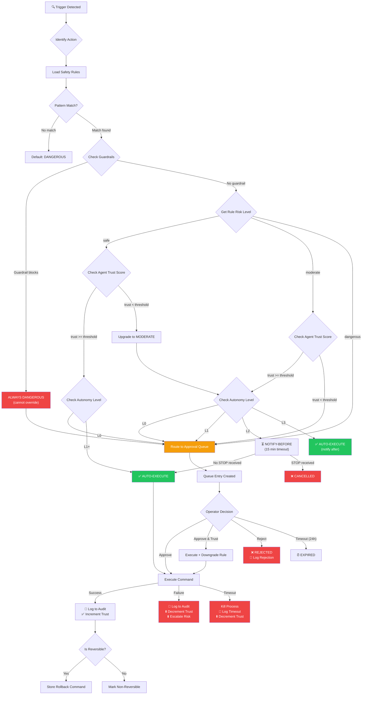
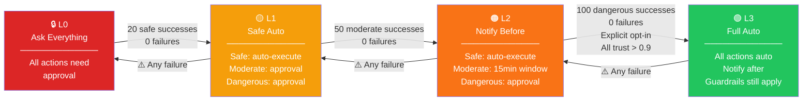
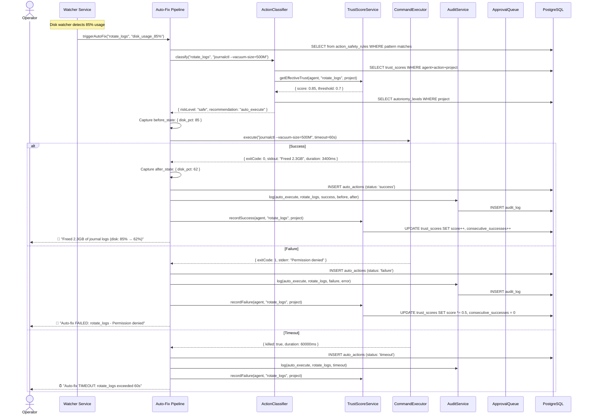
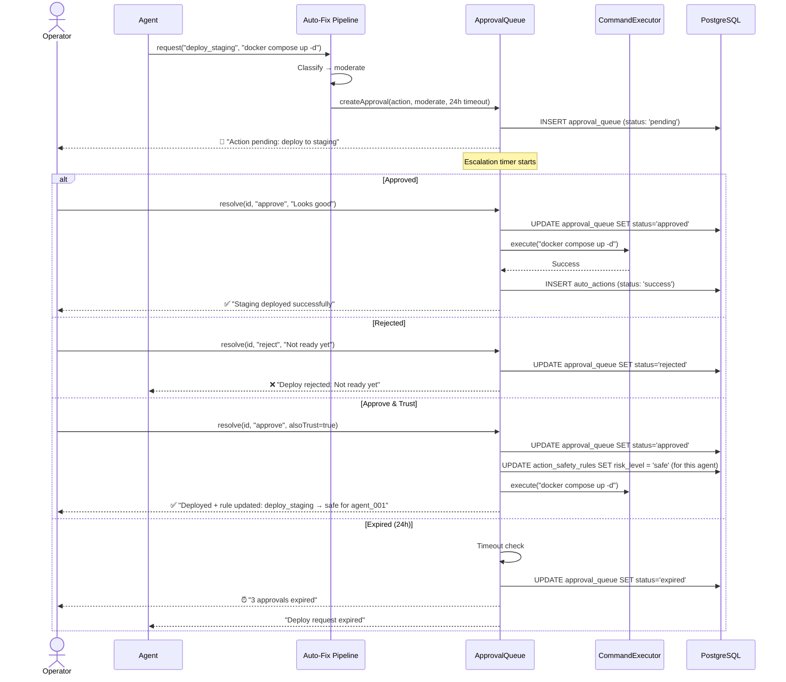

# Era 8 — Autonomous AI

> **Purpose**: AI that makes safe decisions and takes safe actions without asking for permission. The highest level of trust — only for well-tested, low-risk operations. Covers risk classification, auto-fix pipelines, trust scoring, approval workflows, audit logging, and progressive autonomy.
>
> **Context**: Life Graph is a brain-inspired memory microservice (FastAPI + PostgreSQL). Autonomous AI extends the agent layer with self-executing capabilities — rotating logs, fixing lint, clearing caches — without human approval, while maintaining full auditability and rollback capability.
>
> **Architecture ref**: `KNOWLEDGE.md` — follows existing event-driven, tenant-scoped patterns. `docs/ARCHITECTURE.md` for service layer design.
>
> **Principle**: Start locked down. Earn trust through success. Any failure revokes trust immediately.

---

## Table of Contents

1. [Requirements](#requirements)
2. [Design](#design)
3. [Tasks](#tasks)

---

# Requirements

## Story 1: Action Safety Classification

As an **agent operator**, I want to **classify every possible agent action by risk level** so that **the system knows which actions are safe to auto-execute, which need notification, and which require human approval**.

### Acceptance Criteria

- GIVEN I navigate to Autonomy → Safety Rules WHEN I view the rules list THEN I see all action safety rules with columns: action name, pattern, risk level (safe/moderate/dangerous), category, trust threshold override, and enabled status
- GIVEN I click "Add Rule" WHEN I provide an action name `rotate_logs`, pattern `journalctl --vacuum*`, risk level `safe`, and category `maintenance` THEN the system creates a new rule in `action_safety_rules` and the classifier uses it immediately
- GIVEN a rule exists for `deploy_production` with risk level `dangerous` WHEN an agent requests to deploy to production THEN the action is classified as `dangerous` and routed to the approval queue — never auto-executed
- GIVEN a rule with pattern `npm update --save-dev *` exists at risk level `safe` WHEN an agent wants to update a dev dependency THEN the action matches the pattern via glob matching and is classified as `safe`
- GIVEN no rule matches an incoming action WHEN the classifier evaluates it THEN the action defaults to `dangerous` (fail-closed) and is routed to the approval queue
- GIVEN a rule exists at risk level `safe` but the agent's trust score for this action type is below the rule's `trust_threshold` WHEN the classifier evaluates it THEN the action is upgraded to `moderate` (trust override)
- GIVEN I am editing a rule WHEN I change `clear_cache` from `safe` to `dangerous` THEN all future cache-clear actions require approval, and an audit log entry records the rule change with who changed it and why
- GIVEN I want to temporarily disable a rule WHEN I toggle the rule's `enabled` field to `false` THEN the classifier skips this rule and falls through to the default (`dangerous`)
- GIVEN I want to bulk-manage rules WHEN I click "Import Rules" and upload a JSON file THEN the system validates and imports the rules, reporting created/updated/skipped counts
- GIVEN an action has multiple matching rules WHEN the classifier evaluates it THEN the most specific pattern wins (longest match), and ties are broken by choosing the highest risk level (conservative)

---

## Story 2: Auto-Fix Pipeline

As an **agent**, I want to **automatically detect, classify, and fix safe issues without human intervention** so that **routine maintenance happens instantly without creating tickets or waiting for approval**.

### Acceptance Criteria

- GIVEN a file watcher detects disk usage at 85% WHEN the auto-fix pipeline evaluates this THEN it classifies the fix (`journalctl --vacuum-size=500M`) as `safe`, executes it, records the before/after state (disk usage 85% → 62%), and sends a notification: "Freed 2.3GB of journal logs"
- GIVEN a pre-commit hook detects a lint error in a staged file WHEN the auto-fix pipeline evaluates this THEN it classifies `ruff --fix` as `safe`, executes the fix, commits with message "auto-fix: lint errors in {filename}", and notifies: "Fixed 3 lint errors in utils.py"
- GIVEN a CVE is detected in a dependency WHEN the auto-fix pipeline evaluates this THEN it classifies the update as `moderate`, creates a notification-before entry, and waits for acknowledgment before executing
- GIVEN the auto-fix pipeline executes a safe action WHEN the action fails (non-zero exit code) WHEN the failure is detected THEN the system records the failure, decrements the trust score for this action type, and escalates the action to `moderate` for future occurrences
- GIVEN the auto-fix pipeline executes a safe action WHEN the action succeeds THEN the system records success in `auto_actions` with: trigger, action, before_state, after_state, duration_ms, and stdout/stderr
- GIVEN a moderate action is in the pipeline WHEN the system sends a notification-before THEN the notification includes: what will happen, why (the trigger), estimated impact, and a "Proceed" / "Skip" / "Escalate to Dangerous" choice
- GIVEN an auto-action is executing WHEN it exceeds the timeout (configurable, default 60s) THEN the action is killed, marked as `timeout`, trust score is decremented, and the operator is alerted
- GIVEN an auto-fix pipeline runs for a project WHEN I view the project's auto-fix history THEN I see a table of all auto-actions with: trigger, action, risk level, result, before/after state, duration, and timestamp — sortable and filterable
- GIVEN the pipeline detects multiple issues simultaneously WHEN processing them THEN actions are queued and executed sequentially (never parallel) to prevent conflicting operations
- GIVEN an auto-action completes successfully WHEN the result is reversible THEN the system stores the rollback command in `auto_actions.rollback_command` for one-click undo

---

## Story 3: Trust Score System

As an **operator**, I want **agents to build trust through successful autonomous actions** so that **safe actions are earned, not assumed, and any failure immediately restricts autonomy**.

### Acceptance Criteria

- GIVEN a new agent is registered WHEN its trust profile is created THEN all trust scores start at 0.0 (no trust) and every action requires approval (L0 autonomy)
- GIVEN an agent has successfully executed `rotate_logs` 10 times without failure WHEN the trust score is calculated THEN the trust score for (`agent_id`, `rotate_logs`) increases to reflect the success streak and the action may qualify for auto-execution
- GIVEN an agent has a trust score of 0.85 for `clear_cache` WHEN the action safety rule for `clear_cache` has `trust_threshold = 0.7` THEN the agent's trust exceeds the threshold and `clear_cache` is auto-executed as safe
- GIVEN an agent has a trust score of 0.85 for `clear_cache` WHEN the agent fails a `clear_cache` action THEN the trust score drops by 50% (configurable decay factor) and `clear_cache` goes back to `moderate` or `dangerous` until trust rebuilds
- GIVEN an agent accumulates trust WHEN I view the Trust Dashboard THEN I see per-agent, per-action-type trust scores with: current score, total successes, total failures, last action time, and a sparkline showing trust over time
- GIVEN a trust score has not been updated in 30 days WHEN the nightly decay job runs THEN the trust score decays by 5% per week of inactivity (configurable), reflecting that stale trust is not reliable trust
- GIVEN an operator wants to manually boost trust WHEN they click "Set Trust" on an agent's action type THEN they can set the trust score to any value (0.0–1.0) with a required reason, and an audit log records the manual override
- GIVEN trust scores exist per agent, per task type, and per project WHEN querying trust THEN the effective trust is the minimum of all three scores — the most restrictive scope wins
- GIVEN an agent's trust score for a category drops below 0.3 WHEN the system evaluates it THEN all actions in that category are escalated to `dangerous` regardless of individual action rules, and the operator is alerted: "Agent {name} trust critical for {category}"
- GIVEN multiple agents work on the same project WHEN one agent's trust drops THEN other agents' trust scores are unaffected — trust is per-agent, not shared

---

## Story 4: Approval Queue

As an **operator**, I want **moderate and dangerous actions to queue for my approval** so that **I maintain control over risky operations while safe actions proceed automatically**.

### Acceptance Criteria

- GIVEN an agent requests a `moderate` action (deploy to staging) WHEN the action enters the approval queue THEN a queue entry is created with: action description, risk level, agent name, trigger reason, estimated impact, and requested timestamp
- GIVEN an approval queue entry exists WHEN the operator views the queue THEN they see all pending approvals sorted by priority (dangerous first, then moderate) with oldest first within each priority level
- GIVEN an operator reviews a pending action WHEN they click "Approve" THEN the action is executed immediately, the queue entry is updated to `approved`, the execution result is recorded, and the agent's trust score is incremented
- GIVEN an operator reviews a pending action WHEN they click "Reject" with a reason THEN the action is cancelled, the queue entry is updated to `rejected` with the reason, and the agent is notified of the rejection
- GIVEN an operator reviews a pending action WHEN they click "Approve & Trust" THEN the action is approved AND the action's safety rule is downgraded one level (e.g., `moderate` → `safe`) for this agent, with an audit trail
- GIVEN multiple pending lint fix actions exist WHEN the operator clicks "Batch Approve" and selects "All lint fixes" THEN all matching actions are approved simultaneously and the batch approval is logged as a single audit entry
- GIVEN a queue entry has been pending for longer than the configured timeout (default: 24 hours) WHEN the timeout check runs THEN the action is marked as `expired`, the agent is notified, and the operator sees a "X actions expired" summary
- GIVEN an operator wants to delegate approvals WHEN they configure an approval rule "auto-approve all `safe`-classified actions from agent X" THEN matching future actions bypass the queue (effectively a trust override)
- GIVEN the operator is away WHEN actions queue up THEN the system sends escalation notifications: first at 1 hour, then at 4 hours, then at 12 hours — configurable per risk level
- GIVEN an action in the queue becomes stale (the trigger condition no longer applies) WHEN the queue processes it THEN the action is marked as `stale` and moved to history without execution

---

## Story 5: Audit Log

As a **compliance officer**, I want **every autonomous action logged with full context** so that **I can prove what the AI did, why it did it, when, and reverse it if needed**.

### Acceptance Criteria

- GIVEN an agent auto-executes a safe action WHEN the action completes THEN an audit log entry is created with: agent_id, action_name, action_command, trigger_type, trigger_detail, risk_level, result (success/failure/timeout), before_state, after_state, duration_ms, and timestamp
- GIVEN a moderate action is approved and executed WHEN the audit log is written THEN the entry additionally includes: approved_by (user ID), approval_timestamp, time_in_queue, and the approval queue entry ID
- GIVEN an operator queries the audit log WHEN they filter by agent, action type, risk level, result, or date range THEN the results are paginated and returned in under 500ms for up to 1M records (indexed queries)
- GIVEN an auto-action modified a file WHEN the audit log records it THEN the before_state contains the file content hash and relevant metadata, and the after_state contains the new hash — enabling diff reconstruction
- GIVEN a reversible action was logged with a rollback command WHEN the operator clicks "Rollback" on the audit entry THEN the rollback command is executed, a new audit entry is created with `action_type = 'rollback'` referencing the original entry, and the before/after states are swapped
- GIVEN I want to export the audit log WHEN I click "Export" with a date range THEN the system streams an NDJSON file containing all matching audit entries — suitable for compliance archival
- GIVEN the audit log grows large WHEN the retention policy is configured (default: 90 days) THEN entries older than the retention period are archived to cold storage and purged from the primary table
- GIVEN an audit entry exists for a dangerous action WHEN I view the detail THEN I see the complete decision chain: trigger → classification → queue entry → approval → execution → result — a full provenance trail
- GIVEN I want to understand why an action was classified at a particular risk level WHEN I view the audit entry THEN the `classification_reasoning` field shows: matched rule ID, matched pattern, trust score at time of classification, and any trust overrides applied

---

## Story 6: Progressive Autonomy

As an **operator**, I want **the system to progressively increase autonomy as trust builds** so that **it starts fully locked down and naturally evolves to handle more actions independently**.

### Acceptance Criteria

- GIVEN a new project is onboarded WHEN the autonomy system initializes THEN the project starts at L0 (ask everything) — every action requires approval, regardless of safety classification
- GIVEN a project is at L0 WHEN agents successfully complete 20 approved safe actions without any failure THEN the system recommends promotion to L1 and sends a notification: "Project {name} eligible for L1 autonomy — safe actions will auto-execute"
- GIVEN the operator approves promotion to L1 WHEN the autonomy level changes THEN all actions classified as `safe` auto-execute without approval, while `moderate` and `dangerous` still require approval
- GIVEN a project is at L1 WHEN agents successfully complete 50 approved moderate actions without failure THEN the system recommends promotion to L2: "Project {name} eligible for L2 — moderate actions will notify-before-execute"
- GIVEN a project is at L2 WHEN a moderate action is triggered THEN the system sends a notification with a 15-minute window: "Will deploy to staging in 15 minutes. Reply STOP to cancel." If no STOP received, the action executes.
- GIVEN a project is at L3 (full auto) WHEN any action is triggered THEN all actions execute automatically with post-execution notifications — even dangerous actions (only for explicitly opted-in projects with all trust scores above 0.9)
- GIVEN a project is at L2 WHEN any auto-executed action fails THEN the project is automatically demoted to L1, all pending moderate auto-actions are cancelled, and the operator is alerted: "Project {name} demoted to L1 due to {action} failure"
- GIVEN the operator wants to manually change the autonomy level WHEN they select a project and choose a level THEN the change takes effect immediately, is logged in the audit log, and overrides the automatic promotion system
- GIVEN I view the Autonomy Dashboard WHEN data exists THEN I see per-project cards showing: current level (L0–L3), promotion progress bar, last promotion/demotion event, total auto-actions this week, success rate, and trust score summary
- GIVEN a project has been at L3 for 30 days WHEN the system evaluates it THEN it runs a "trust audit" — replaying the last 100 actions against current rules to verify they would still classify correctly, alerting on any drift

---

## Story 7: Rollback & Recovery

As an **operator**, I want to **undo any autonomous action that went wrong** so that **I have a safety net and the AI's autonomy never puts the system in an unrecoverable state**.

### Acceptance Criteria

- GIVEN an auto-action completed and has a stored rollback command WHEN I click "Rollback" on the action THEN the rollback command executes, the original action is marked as `rolled_back`, a new audit entry is created linking to the original, and a notification is sent
- GIVEN an auto-action modified a configuration file WHEN I view the audit entry THEN I see the full before/after content diff and a "Restore Original" button
- GIVEN an auto-action is not reversible (e.g., sent a notification) WHEN I view the audit entry THEN the rollback button is disabled with tooltip: "This action is not reversible"
- GIVEN multiple related auto-actions occurred in sequence WHEN I want to rollback THEN the system warns: "This action was followed by 3 dependent actions. Rolling back may require rolling back: {list}. Proceed?"
- GIVEN a rollback is executed WHEN it fails THEN the system alerts the operator with the error, marks the rollback as `failed`, and escalates to `dangerous` for manual intervention

---

## Story 8: Safety Guardrails

As a **platform admin**, I want **hard limits on what autonomous AI can do** so that **even with maximum trust and L3 autonomy, certain actions are absolutely never auto-executed**.

### Acceptance Criteria

- GIVEN a global guardrail exists for `delete_database` WHEN any agent at any trust level requests this action THEN it is ALWAYS classified as `dangerous` and ALWAYS requires approval — guardrails override all trust scores and autonomy levels
- GIVEN I configure a guardrail WHEN I set `max_auto_actions_per_hour = 50` THEN the system refuses to auto-execute more than 50 actions per hour per agent, queuing the rest for manual approval with notice: "Rate limit reached"
- GIVEN a guardrail `no_production_without_staging` is enabled WHEN an agent tries to deploy to production without a successful staging deployment in the last 24 hours THEN the action is blocked with reason: "Guardrail: staging deployment required before production"
- GIVEN an agent tries to execute an action that would affect more than `max_blast_radius` resources (default: 10) WHEN the guardrail evaluates it THEN the action is escalated to `dangerous` regardless of its safety classification
- GIVEN guardrails are configured WHEN anyone (including platform admins) tries to disable a guardrail THEN the system requires two-person approval and logs the change with both approvers' IDs

---

# Design

## Architecture Overview

```
┌──────────────────────────────────────────────────────────────────────────┐
│                     AUTONOMOUS AI FRAMEWORK                              │
│                                                                          │
│  ┌───────────────┐   ┌────────────────┐   ┌──────────────────────────┐  │
│  │  CLI / Web UI  │   │  FastAPI API   │   │  Agent Runtime           │  │
│  │               │   │                │   │                          │  │
│  │  Approval Q   │──▶│  /autonomy/*   │   │  ├─ Watchers (disk,git)  │  │
│  │  Trust Dash   │   │  /approvals/*  │──▶│  ├─ Auto-Fix Pipeline    │  │
│  │  Audit Log    │   │  /audit/*      │   │  ├─ Action Classifier    │  │
│  │  Safety Rules │   │  /safety/*     │   │  └─ Trust Evaluator      │  │
│  └───────────────┘   └────────────────┘   └──────────────────────────┘  │
│         │                    │                        │                   │
│         │            ┌──────┴────────────────────────┘                   │
│         │            │                                                    │
│         │            ▼                                                    │
│         │     ┌─────────────┐     ┌─────────────┐                       │
│         └────▶│ PostgreSQL   │     │ Redis        │                       │
│               │ ├─ action_   │     │ ├─ queues    │                       │
│               │ │  safety_   │     │ ├─ pub/sub   │                       │
│               │ │  rules     │     │ └─ rate      │                       │
│               │ ├─ auto_     │     │    limits    │                       │
│               │ │  actions   │     └─────────────┘                       │
│               │ ├─ trust_    │                                            │
│               │ │  scores    │                                            │
│               │ ├─ approval_ │                                            │
│               │ │  queue     │                                            │
│               │ └─ audit_log │                                            │
│               └─────────────┘                                            │
└──────────────────────────────────────────────────────────────────────────┘
```

### Key Design Decisions

1. **Fail-closed by default** — Any action without a matching safety rule is classified as `dangerous`. This means a misconfiguration or missing rule never leads to unauthorized execution. The system is safe-by-default.
2. **Trust is per-agent, per-action-type, per-project** — No global trust scores. Agent A's success with log rotation doesn't give Agent B trust, and doesn't apply to a different project. Effective trust = `min(agent_trust, action_type_trust, project_trust)`.
3. **Sequential execution, never parallel** — Auto-fix actions within a project execute sequentially to prevent race conditions (e.g., two agents both trying to fix the same config file). Cross-project actions can run in parallel.
4. **Rollback-first design** — Every auto-action must declare whether it's reversible and provide a rollback command. Irreversible actions automatically get +1 risk level bump.
5. **Audit log is append-only** — No updates, no deletes. Even rollbacks create new entries. This ensures compliance-grade auditability.
6. **Progressive autonomy is project-scoped** — Each project has its own autonomy level (L0–L3). A new project always starts at L0 regardless of how trusted the agent is elsewhere.
7. **Guardrails override everything** — Hard limits (rate limits, blast radius, forbidden actions) cannot be overridden by trust scores, autonomy levels, or operator approvals. They require two-person approval to modify.
8. **Notification channels are pluggable** — Notifications for auto-actions go through the existing EventBus → webhook/WebSocket system. CLI, web dashboard, and notification replies all use the same approval API.

---

## Data Models

### SQL Schema

```sql
-- ============================================================
-- Action Safety Rules — configurable risk classification
-- ============================================================
CREATE TABLE action_safety_rules (
  id                TEXT PRIMARY KEY DEFAULT gen_random_uuid()::text,
  tenant_id         TEXT NOT NULL,

  -- Classification
  action_name       TEXT NOT NULL,                        -- Human-readable: 'rotate_logs', 'deploy_staging'
  action_pattern    TEXT NOT NULL,                        -- Glob pattern: 'journalctl --vacuum*', 'npm update *'
  category          TEXT NOT NULL DEFAULT 'general',      -- 'maintenance', 'deployment', 'dependency', 'code_fix', 'data', 'config'
  risk_level        TEXT NOT NULL DEFAULT 'dangerous'     -- 'safe', 'moderate', 'dangerous'
                    CHECK (risk_level IN ('safe', 'moderate', 'dangerous')),

  -- Trust override
  trust_threshold   DECIMAL(3,2) DEFAULT 0.7,            -- Min trust score to honor this risk level
                                                          -- If agent trust < threshold, risk upgrades one level
  -- Guardrail flags
  is_guardrail      BOOLEAN NOT NULL DEFAULT false,       -- If true, cannot be overridden by trust/autonomy
  max_blast_radius  INT,                                  -- Max resources affected before auto-escalation
  requires_staging  BOOLEAN NOT NULL DEFAULT false,       -- Must have staging success before production

  -- Reversibility
  is_reversible     BOOLEAN NOT NULL DEFAULT true,        -- Can this action be undone?
  rollback_template TEXT,                                 -- Template: 'git checkout {file}', 'systemctl restart {service}'

  -- Metadata
  enabled           BOOLEAN NOT NULL DEFAULT true,
  priority          INT NOT NULL DEFAULT 100,             -- Lower = higher priority for pattern matching
  description       TEXT,
  created_by        TEXT NOT NULL,
  created_at        TIMESTAMPTZ NOT NULL DEFAULT NOW(),
  updated_at        TIMESTAMPTZ NOT NULL DEFAULT NOW()
);

CREATE INDEX idx_asr_tenant ON action_safety_rules(tenant_id);
CREATE INDEX idx_asr_tenant_cat ON action_safety_rules(tenant_id, category);
CREATE INDEX idx_asr_tenant_risk ON action_safety_rules(tenant_id, risk_level);
CREATE INDEX idx_asr_enabled ON action_safety_rules(tenant_id, enabled) WHERE enabled = true;
CREATE INDEX idx_asr_guardrail ON action_safety_rules(tenant_id) WHERE is_guardrail = true;
CREATE UNIQUE INDEX idx_asr_tenant_name ON action_safety_rules(tenant_id, action_name);

-- ============================================================
-- Auto Actions — log of every autonomous action taken
-- ============================================================
CREATE TABLE auto_actions (
  id                TEXT PRIMARY KEY DEFAULT gen_random_uuid()::text,
  tenant_id         TEXT NOT NULL,

  -- What happened
  agent_id          TEXT NOT NULL,                        -- Which agent executed this
  action_name       TEXT NOT NULL,                        -- Matches action_safety_rules.action_name
  action_command    TEXT NOT NULL,                        -- Actual command executed
  risk_level        TEXT NOT NULL                         -- Classified risk at time of execution
                    CHECK (risk_level IN ('safe', 'moderate', 'dangerous')),
  project_id        TEXT,                                 -- Project scope (nullable for global actions)

  -- Why it happened
  trigger_type      TEXT NOT NULL,                        -- 'watcher', 'schedule', 'event', 'manual_request'
  trigger_detail    TEXT NOT NULL,                        -- 'disk_usage_85%', 'lint_error_in_commit', 'cve_2026_1234'
  safety_rule_id    TEXT REFERENCES action_safety_rules(id),

  -- Before/After state
  before_state      JSONB,                               -- { "disk_usage_pct": 85, "file_hash": "abc123" }
  after_state       JSONB,                               -- { "disk_usage_pct": 62, "file_hash": "def456" }

  -- Execution result
  status            TEXT NOT NULL DEFAULT 'pending'       -- 'pending', 'executing', 'success', 'failure', 'timeout', 'rolled_back', 'skipped'
                    CHECK (status IN ('pending', 'executing', 'success', 'failure', 'timeout', 'rolled_back', 'skipped')),
  exit_code         INT,
  stdout            TEXT,
  stderr            TEXT,
  error_message     TEXT,                                 -- Populated on failure/timeout
  duration_ms       INT,

  -- Rollback
  is_reversible     BOOLEAN NOT NULL DEFAULT false,
  rollback_command  TEXT,                                 -- Actual rollback command if reversible
  rolled_back_at    TIMESTAMPTZ,
  rollback_action_id TEXT,                               -- FK to the rollback auto_action

  -- Approval (if moderate/dangerous)
  approval_id       TEXT REFERENCES approval_queue(id),   -- NULL if auto-executed (safe)
  approved_by       TEXT,
  approved_at       TIMESTAMPTZ,

  -- Timestamps
  queued_at         TIMESTAMPTZ NOT NULL DEFAULT NOW(),
  started_at        TIMESTAMPTZ,
  completed_at      TIMESTAMPTZ,
  created_at        TIMESTAMPTZ NOT NULL DEFAULT NOW()
);

CREATE INDEX idx_aa_tenant ON auto_actions(tenant_id, created_at DESC);
CREATE INDEX idx_aa_agent ON auto_actions(tenant_id, agent_id, created_at DESC);
CREATE INDEX idx_aa_project ON auto_actions(tenant_id, project_id, created_at DESC);
CREATE INDEX idx_aa_status ON auto_actions(tenant_id, status) WHERE status IN ('pending', 'executing');
CREATE INDEX idx_aa_action_name ON auto_actions(tenant_id, action_name, status);
CREATE INDEX idx_aa_trigger ON auto_actions(tenant_id, trigger_type, created_at DESC);

-- ============================================================
-- Trust Scores — per agent/action_type/project trust
-- ============================================================
CREATE TABLE trust_scores (
  id                TEXT PRIMARY KEY DEFAULT gen_random_uuid()::text,
  tenant_id         TEXT NOT NULL,

  -- Scope (all three define the trust dimension)
  agent_id          TEXT NOT NULL,
  action_type       TEXT NOT NULL,                        -- Matches action_safety_rules.action_name or category
  project_id        TEXT,                                 -- NULL = global trust for this agent+action

  -- Trust metrics
  score             DECIMAL(4,3) NOT NULL DEFAULT 0.000,  -- 0.000 to 1.000
  total_successes   INT NOT NULL DEFAULT 0,
  total_failures    INT NOT NULL DEFAULT 0,
  consecutive_successes INT NOT NULL DEFAULT 0,           -- Reset to 0 on any failure
  consecutive_failures  INT NOT NULL DEFAULT 0,           -- Reset to 0 on any success

  -- History
  peak_score        DECIMAL(4,3) NOT NULL DEFAULT 0.000,  -- Highest ever achieved
  last_action_at    TIMESTAMPTZ,
  last_failure_at   TIMESTAMPTZ,
  last_success_at   TIMESTAMPTZ,

  -- Config
  decay_rate        DECIMAL(4,3) NOT NULL DEFAULT 0.050,  -- 5% decay per week of inactivity
  failure_penalty   DECIMAL(4,3) NOT NULL DEFAULT 0.500,  -- 50% reduction on failure

  -- Manual override
  manual_override   DECIMAL(4,3),                         -- If set, overrides calculated score
  override_reason   TEXT,
  override_by       TEXT,
  override_at       TIMESTAMPTZ,

  created_at        TIMESTAMPTZ NOT NULL DEFAULT NOW(),
  updated_at        TIMESTAMPTZ NOT NULL DEFAULT NOW()
);

CREATE UNIQUE INDEX idx_ts_unique ON trust_scores(tenant_id, agent_id, action_type, project_id);
CREATE INDEX idx_ts_tenant_agent ON trust_scores(tenant_id, agent_id);
CREATE INDEX idx_ts_tenant_project ON trust_scores(tenant_id, project_id) WHERE project_id IS NOT NULL;
CREATE INDEX idx_ts_low_trust ON trust_scores(tenant_id, score) WHERE score < 0.3;
CREATE INDEX idx_ts_stale ON trust_scores(last_action_at) WHERE last_action_at < NOW() - INTERVAL '30 days';

-- ============================================================
-- Approval Queue — pending human approvals
-- ============================================================
CREATE TABLE approval_queue (
  id                TEXT PRIMARY KEY DEFAULT gen_random_uuid()::text,
  tenant_id         TEXT NOT NULL,

  -- What needs approval
  agent_id          TEXT NOT NULL,
  action_name       TEXT NOT NULL,
  action_command    TEXT NOT NULL,
  risk_level        TEXT NOT NULL
                    CHECK (risk_level IN ('moderate', 'dangerous')),
  category          TEXT NOT NULL DEFAULT 'general',
  project_id        TEXT,

  -- Context
  trigger_type      TEXT NOT NULL,
  trigger_detail    TEXT NOT NULL,
  estimated_impact  TEXT,                                 -- "Will update 3 npm packages"
  safety_rule_id    TEXT REFERENCES action_safety_rules(id),

  -- Status
  status            TEXT NOT NULL DEFAULT 'pending'
                    CHECK (status IN ('pending', 'approved', 'rejected', 'expired', 'stale', 'batch_approved')),
  priority          INT NOT NULL DEFAULT 100,             -- Lower = higher priority

  -- Resolution
  resolved_by       TEXT,                                 -- User ID who approved/rejected
  resolution_note   TEXT,                                 -- Rejection reason or approval note
  resolved_at       TIMESTAMPTZ,
  also_trust        BOOLEAN NOT NULL DEFAULT false,       -- If true, also update safety rule (approve & trust)

  -- Batch tracking
  batch_id          TEXT,                                 -- Groups batch-approved actions

  -- Timeout
  timeout_hours     INT NOT NULL DEFAULT 24,              -- Hours before auto-expiry
  escalation_sent   JSONB DEFAULT '[]',                   -- Timestamps of escalation notifications sent

  -- Timestamps
  created_at        TIMESTAMPTZ NOT NULL DEFAULT NOW(),
  expires_at        TIMESTAMPTZ NOT NULL
);

CREATE INDEX idx_aq_tenant_pending ON approval_queue(tenant_id, status, priority, created_at)
  WHERE status = 'pending';
CREATE INDEX idx_aq_tenant ON approval_queue(tenant_id, created_at DESC);
CREATE INDEX idx_aq_agent ON approval_queue(tenant_id, agent_id, created_at DESC);
CREATE INDEX idx_aq_expires ON approval_queue(expires_at) WHERE status = 'pending';
CREATE INDEX idx_aq_batch ON approval_queue(batch_id) WHERE batch_id IS NOT NULL;
CREATE INDEX idx_aq_risk ON approval_queue(tenant_id, risk_level, status);

-- ============================================================
-- Audit Log — immutable, append-only compliance trail
-- ============================================================
CREATE TABLE audit_log (
  id                TEXT PRIMARY KEY DEFAULT gen_random_uuid()::text,
  tenant_id         TEXT NOT NULL,

  -- Who
  agent_id          TEXT,                                  -- NULL for manual/operator actions
  actor_type        TEXT NOT NULL DEFAULT 'agent'          -- 'agent', 'operator', 'system'
                    CHECK (actor_type IN ('agent', 'operator', 'system')),
  actor_id          TEXT NOT NULL,                         -- agent_id or user_id or 'system'

  -- What
  action_type       TEXT NOT NULL,                         -- 'auto_execute', 'approve', 'reject', 'rollback',
                                                          -- 'rule_change', 'trust_override', 'autonomy_change',
                                                          -- 'guardrail_change', 'batch_approve'
  action_name       TEXT NOT NULL,                         -- The specific action: 'rotate_logs', 'deploy_staging'
  action_command    TEXT,                                  -- Actual command or API call
  risk_level        TEXT,                                  -- Risk level at time of action

  -- Why
  trigger_type      TEXT,                                  -- What caused this action
  trigger_detail    TEXT,
  classification_reasoning JSONB,                         -- { "matched_rule_id": "...", "pattern": "...",
                                                          --   "trust_score": 0.85, "trust_override": false,
                                                          --   "autonomy_level": "L1" }

  -- Context
  project_id        TEXT,
  auto_action_id    TEXT,                                  -- FK to auto_actions if applicable
  approval_id       TEXT,                                  -- FK to approval_queue if applicable
  related_audit_id  TEXT,                                  -- FK to audit_log for rollback chains

  -- State
  before_state      JSONB,                                 -- Snapshot before action
  after_state       JSONB,                                 -- Snapshot after action
  result            TEXT NOT NULL                          -- 'success', 'failure', 'timeout', 'rejected', 'expired'
                    CHECK (result IN ('success', 'failure', 'timeout', 'rejected', 'expired', 'rolled_back')),
  error_message     TEXT,
  duration_ms       INT,

  -- Metadata (immutable — no updated_at)
  created_at        TIMESTAMPTZ NOT NULL DEFAULT NOW()
);

-- Partitioning hint: partition by tenant_id + month for large deployments
CREATE INDEX idx_al_tenant ON audit_log(tenant_id, created_at DESC);
CREATE INDEX idx_al_agent ON audit_log(tenant_id, agent_id, created_at DESC);
CREATE INDEX idx_al_project ON audit_log(tenant_id, project_id, created_at DESC);
CREATE INDEX idx_al_action_type ON audit_log(tenant_id, action_type, created_at DESC);
CREATE INDEX idx_al_result ON audit_log(tenant_id, result, created_at DESC);
CREATE INDEX idx_al_risk ON audit_log(tenant_id, risk_level, created_at DESC);
CREATE INDEX idx_al_related ON audit_log(related_audit_id) WHERE related_audit_id IS NOT NULL;

-- ============================================================
-- Autonomy Levels — per-project progressive autonomy state
-- ============================================================
CREATE TABLE autonomy_levels (
  id                TEXT PRIMARY KEY DEFAULT gen_random_uuid()::text,
  tenant_id         TEXT NOT NULL,
  project_id        TEXT NOT NULL,

  -- Current state
  level             TEXT NOT NULL DEFAULT 'L0'             -- 'L0', 'L1', 'L2', 'L3'
                    CHECK (level IN ('L0', 'L1', 'L2', 'L3')),
  level_description TEXT NOT NULL DEFAULT 'Ask Everything',

  -- Promotion tracking
  safe_successes    INT NOT NULL DEFAULT 0,                -- Count toward L0→L1 (threshold: 20)
  moderate_successes INT NOT NULL DEFAULT 0,               -- Count toward L1→L2 (threshold: 50)
  dangerous_successes INT NOT NULL DEFAULT 0,              -- Count toward L2→L3 (threshold: 100)
  promotion_eligible BOOLEAN NOT NULL DEFAULT false,
  promotion_threshold JSONB NOT NULL DEFAULT
    '{"L0_to_L1": 20, "L1_to_L2": 50, "L2_to_L3": 100}',

  -- Demotion tracking
  last_failure_at   TIMESTAMPTZ,
  demotion_count    INT NOT NULL DEFAULT 0,                -- Total times demoted

  -- Overrides
  manual_level      TEXT,                                   -- Operator override, NULL = use calculated
  manual_set_by     TEXT,
  manual_set_at     TIMESTAMPTZ,
  manual_reason     TEXT,

  -- L2 config
  moderate_timeout_minutes INT NOT NULL DEFAULT 15,        -- Wait time before auto-executing moderate actions

  -- L3 config
  l3_opted_in       BOOLEAN NOT NULL DEFAULT false,        -- Explicit opt-in required for L3
  l3_min_trust      DECIMAL(3,2) NOT NULL DEFAULT 0.90,    -- All trust scores must exceed this for L3

  -- Stats
  total_auto_actions INT NOT NULL DEFAULT 0,
  total_successes    INT NOT NULL DEFAULT 0,
  total_failures     INT NOT NULL DEFAULT 0,
  success_rate       DECIMAL(5,2),                          -- (successes / total) * 100

  -- Audit
  last_promotion_at  TIMESTAMPTZ,
  last_demotion_at   TIMESTAMPTZ,
  last_audit_at      TIMESTAMPTZ,                           -- Last trust audit run

  created_at        TIMESTAMPTZ NOT NULL DEFAULT NOW(),
  updated_at        TIMESTAMPTZ NOT NULL DEFAULT NOW()
);

CREATE UNIQUE INDEX idx_alvl_tenant_project ON autonomy_levels(tenant_id, project_id);
CREATE INDEX idx_alvl_tenant ON autonomy_levels(tenant_id);
CREATE INDEX idx_alvl_level ON autonomy_levels(tenant_id, level);
CREATE INDEX idx_alvl_eligible ON autonomy_levels(tenant_id, promotion_eligible) WHERE promotion_eligible = true;
```

---

## API Contracts

### Module Structure

```
life_graph/
├── autonomy/
│   ├── __init__.py
│   ├── router.py                    # FastAPI router mounting all sub-routers
│   ├── safety/
│   │   ├── router.py               # /autonomy/safety-rules CRUD
│   │   ├── service.py              # SafetyRuleService — CRUD + classification
│   │   ├── classifier.py           # ActionClassifier — pattern matching + trust check
│   │   └── schemas.py              # Pydantic models for rules
│   ├── pipeline/
│   │   ├── router.py               # /autonomy/auto-actions endpoints
│   │   ├── service.py              # AutoFixService — execute + record
│   │   ├── executor.py             # CommandExecutor — sandboxed execution
│   │   ├── watchers.py             # DiskWatcher, GitWatcher, DepWatcher
│   │   └── schemas.py
│   ├── trust/
│   │   ├── router.py               # /autonomy/trust endpoints
│   │   ├── service.py              # TrustScoreService — calculate + decay
│   │   ├── calculator.py           # TrustCalculator — score formula
│   │   └── schemas.py
│   ├── approvals/
│   │   ├── router.py               # /autonomy/approvals endpoints
│   │   ├── service.py              # ApprovalService — queue + resolve
│   │   └── schemas.py
│   ├── audit/
│   │   ├── router.py               # /autonomy/audit endpoints
│   │   ├── service.py              # AuditService — log + query + export
│   │   └── schemas.py
│   └── levels/
│       ├── router.py               # /autonomy/levels endpoints
│       ├── service.py              # AutonomyLevelService — promote/demote
│       └── schemas.py
```

---

### Safety Rules CRUD

```
POST /api/v1/autonomy/safety-rules
Authorization: Bearer <token>
X-Tenant-ID: <tenant_id>
```

**Request:**
```json
{
  "actionName": "rotate_logs",
  "actionPattern": "journalctl --vacuum*",
  "category": "maintenance",
  "riskLevel": "safe",
  "trustThreshold": 0.7,
  "isReversible": true,
  "rollbackTemplate": "echo 'Log rotation is not reversible'",
  "description": "Rotate systemd journal logs to free disk space"
}
```

**Response (201):**
```json
{
  "data": {
    "id": "asr_abc123",
    "tenantId": "tenant_xyz",
    "actionName": "rotate_logs",
    "actionPattern": "journalctl --vacuum*",
    "category": "maintenance",
    "riskLevel": "safe",
    "trustThreshold": 0.7,
    "isGuardrail": false,
    "isReversible": true,
    "rollbackTemplate": "echo 'Log rotation is not reversible'",
    "enabled": true,
    "priority": 100,
    "description": "Rotate systemd journal logs to free disk space",
    "createdAt": "2026-07-07T00:00:00Z"
  }
}
```

---

### GET `/api/v1/autonomy/safety-rules`

**Query Parameters:**
| Param | Type | Required | Description |
|:------|:-----|:---------|:------------|
| `category` | string | No | Filter by category |
| `riskLevel` | string | No | Filter by risk level |
| `enabled` | boolean | No | Filter by enabled status |
| `limit` | int | No | Pagination limit (default: 50, max: 200) |
| `offset` | int | No | Pagination offset |

**Response (200):**
```json
{
  "data": [
    {
      "id": "asr_abc123",
      "actionName": "rotate_logs",
      "actionPattern": "journalctl --vacuum*",
      "category": "maintenance",
      "riskLevel": "safe",
      "trustThreshold": 0.7,
      "enabled": true,
      "isGuardrail": false
    }
  ],
  "meta": { "total": 24, "limit": 50, "offset": 0 }
}
```

---

### POST `/api/v1/autonomy/classify`

**Classify an action before execution.**

**Request:**
```json
{
  "agentId": "agent_001",
  "actionName": "clear_cache",
  "actionCommand": "redis-cli FLUSHDB",
  "projectId": "proj_abc"
}
```

**Response (200):**
```json
{
  "data": {
    "riskLevel": "moderate",
    "matchedRule": {
      "id": "asr_def456",
      "actionName": "clear_cache",
      "originalRiskLevel": "safe",
      "appliedRiskLevel": "moderate"
    },
    "trustScore": 0.55,
    "trustThreshold": 0.7,
    "trustOverrideApplied": true,
    "autonomyLevel": "L1",
    "recommendation": "queue_for_approval",
    "reasoning": "Action 'clear_cache' is classified as 'safe' but agent trust (0.55) is below threshold (0.70). Upgraded to 'moderate'."
  }
}
```

---

### POST `/api/v1/autonomy/auto-actions`

**Trigger an auto-action (typically called by the agent runtime, not directly by users).**

**Request:**
```json
{
  "agentId": "agent_001",
  "actionName": "rotate_logs",
  "actionCommand": "journalctl --vacuum-size=500M",
  "projectId": "proj_abc",
  "triggerType": "watcher",
  "triggerDetail": "disk_usage_85%",
  "beforeState": { "disk_usage_pct": 85, "journal_size_mb": 2400 },
  "timeoutSeconds": 60
}
```

**Response (201 if safe/auto-executed, 202 if queued for approval):**
```json
{
  "data": {
    "id": "aa_xyz789",
    "status": "success",
    "riskLevel": "safe",
    "afterState": { "disk_usage_pct": 62, "journal_size_mb": 100 },
    "durationMs": 3400,
    "message": "Freed 2.3GB of journal logs"
  }
}
```

---

### GET `/api/v1/autonomy/auto-actions`

**Query Parameters:**
| Param | Type | Required | Description |
|:------|:-----|:---------|:------------|
| `agentId` | string | No | Filter by agent |
| `projectId` | string | No | Filter by project |
| `status` | string | No | Filter by status |
| `riskLevel` | string | No | Filter by risk level |
| `startDate` | datetime | No | Filter from date |
| `endDate` | datetime | No | Filter to date |
| `limit` | int | No | Pagination limit (default: 50) |
| `offset` | int | No | Pagination offset |

---

### GET `/api/v1/autonomy/trust`

**Get trust scores for an agent.**

**Query Parameters:**
| Param | Type | Required | Description |
|:------|:-----|:---------|:------------|
| `agentId` | string | Yes | Agent to query |
| `projectId` | string | No | Scope to project |
| `actionType` | string | No | Scope to action type |

**Response (200):**
```json
{
  "data": [
    {
      "id": "ts_001",
      "agentId": "agent_001",
      "actionType": "rotate_logs",
      "projectId": "proj_abc",
      "score": 0.85,
      "totalSuccesses": 42,
      "totalFailures": 2,
      "consecutiveSuccesses": 15,
      "peakScore": 0.92,
      "lastActionAt": "2026-07-06T18:00:00Z"
    }
  ],
  "meta": { "total": 8 }
}
```

---

### POST `/api/v1/autonomy/trust/override`

**Manually set a trust score.**

**Request:**
```json
{
  "agentId": "agent_001",
  "actionType": "clear_cache",
  "projectId": "proj_abc",
  "score": 0.9,
  "reason": "Manually verified agent has been correctly clearing Redis cache for 3 months"
}
```

**Response (200):**
```json
{
  "data": {
    "id": "ts_002",
    "previousScore": 0.55,
    "newScore": 0.9,
    "overrideBy": "user_admin",
    "reason": "Manually verified agent has been correctly clearing Redis cache for 3 months"
  }
}
```

---

### GET `/api/v1/autonomy/approvals`

**Get pending approvals.**

**Query Parameters:**
| Param | Type | Required | Description |
|:------|:-----|:---------|:------------|
| `status` | string | No | Filter by status (default: `pending`) |
| `riskLevel` | string | No | Filter by risk level |
| `agentId` | string | No | Filter by agent |
| `limit` | int | No | Pagination limit (default: 20) |

**Response (200):**
```json
{
  "data": [
    {
      "id": "aq_001",
      "agentId": "agent_001",
      "actionName": "deploy_staging",
      "actionCommand": "docker compose -f staging.yml up -d",
      "riskLevel": "moderate",
      "triggerDetail": "New commit on main branch",
      "estimatedImpact": "Will restart 3 staging containers",
      "createdAt": "2026-07-07T00:30:00Z",
      "expiresAt": "2026-07-08T00:30:00Z",
      "hoursRemaining": 23.5
    }
  ],
  "meta": { "total": 3, "pending": 3, "expired_today": 0 }
}
```

---

### POST `/api/v1/autonomy/approvals/:id/resolve`

**Approve, reject, or approve-and-trust an action.**

**Request:**
```json
{
  "decision": "approve",
  "note": "Staging deploy looks good, green tests",
  "alsoTrust": false
}
```

**Response (200):**
```json
{
  "data": {
    "id": "aq_001",
    "status": "approved",
    "resolvedBy": "user_admin",
    "executionResult": {
      "autoActionId": "aa_exec_001",
      "status": "success",
      "durationMs": 12500
    }
  }
}
```

---

### POST `/api/v1/autonomy/approvals/batch`

**Batch approve multiple actions.**

**Request:**
```json
{
  "filter": {
    "actionName": "fix_lint",
    "riskLevel": "moderate"
  },
  "decision": "approve",
  "note": "Batch approving all lint fixes"
}
```

**Response (200):**
```json
{
  "data": {
    "batchId": "batch_001",
    "approved": 7,
    "alreadyResolved": 1,
    "expired": 0
  }
}
```

---

### GET `/api/v1/autonomy/audit`

**Query the audit log.**

**Query Parameters:**
| Param | Type | Required | Description |
|:------|:-----|:---------|:------------|
| `agentId` | string | No | Filter by agent |
| `actionType` | string | No | Filter by action type |
| `riskLevel` | string | No | Filter by risk level |
| `result` | string | No | Filter by result |
| `projectId` | string | No | Filter by project |
| `startDate` | datetime | No | Filter from date |
| `endDate` | datetime | No | Filter to date |
| `limit` | int | No | Pagination limit (default: 50, max: 200) |
| `offset` | int | No | Pagination offset |

**Response (200):**
```json
{
  "data": [
    {
      "id": "al_001",
      "actorType": "agent",
      "actorId": "agent_001",
      "actionType": "auto_execute",
      "actionName": "rotate_logs",
      "riskLevel": "safe",
      "triggerDetail": "disk_usage_85%",
      "result": "success",
      "beforeState": { "disk_usage_pct": 85 },
      "afterState": { "disk_usage_pct": 62 },
      "durationMs": 3400,
      "classificationReasoning": {
        "matchedRuleId": "asr_abc123",
        "pattern": "journalctl --vacuum*",
        "trustScore": 0.85,
        "autonomyLevel": "L1"
      },
      "createdAt": "2026-07-07T00:30:00Z"
    }
  ],
  "meta": { "total": 1247, "limit": 50, "offset": 0 }
}
```

---

### POST `/api/v1/autonomy/audit/export`

**Export audit log as NDJSON.**

**Request:**
```json
{
  "startDate": "2026-06-01T00:00:00Z",
  "endDate": "2026-07-01T00:00:00Z",
  "projectId": "proj_abc"
}
```

**Response: `200 OK` (streaming NDJSON)**

---

### GET `/api/v1/autonomy/levels/:projectId`

**Get the current autonomy level for a project.**

**Response (200):**
```json
{
  "data": {
    "projectId": "proj_abc",
    "level": "L1",
    "levelDescription": "Safe actions auto-execute",
    "promotionProgress": {
      "nextLevel": "L2",
      "currentSuccesses": 32,
      "required": 50,
      "progressPct": 64.0
    },
    "stats": {
      "totalAutoActions": 187,
      "totalSuccesses": 185,
      "totalFailures": 2,
      "successRate": 98.93
    },
    "lastPromotionAt": "2026-06-15T10:00:00Z",
    "lastDemotionAt": null
  }
}
```

---

### POST `/api/v1/autonomy/levels/:projectId/set`

**Manually set the autonomy level.**

**Request:**
```json
{
  "level": "L2",
  "reason": "Agent has been stable for 2 months, promoting to notify-before-execute for moderate actions"
}
```

**Response (200):**
```json
{
  "data": {
    "projectId": "proj_abc",
    "previousLevel": "L1",
    "newLevel": "L2",
    "setBy": "user_admin",
    "reason": "Agent has been stable for 2 months"
  }
}
```

---

### POST `/api/v1/autonomy/audit/:id/rollback`

**Rollback a previously executed auto-action.**

**Response (200):**
```json
{
  "data": {
    "originalActionId": "aa_xyz789",
    "rollbackActionId": "aa_roll_001",
    "status": "success",
    "restoredState": { "disk_usage_pct": 85 },
    "message": "Rollback completed. Original action 'rotate_logs' has been reversed."
  }
}
```

**Error Response (400):**
```json
{
  "error": "Action is not reversible",
  "detail": "The action 'send_notification' does not have a rollback command"
}
```

---

## Sequence Diagrams

### Auto-Fix Pipeline Decision Flow



### Progressive Autonomy Levels



### Auto-Fix Pipeline Sequence



### Approval Queue Flow



---

## Core Python Implementations

### Action Safety Classifier

```python
"""
life_graph/autonomy/safety/classifier.py

Classifies actions by risk level using pattern matching, trust scores,
and autonomy levels. Fail-closed: unknown actions are always DANGEROUS.
"""

import fnmatch
import logging
from dataclasses import dataclass
from enum import Enum
from typing import Optional

from sqlalchemy.ext.asyncio import AsyncSession
from sqlalchemy import select, and_

from life_graph.models.db import ActionSafetyRule, TrustScore, AutonomyLevel

logger = logging.getLogger(__name__)


class RiskLevel(str, Enum):
    SAFE = "safe"
    MODERATE = "moderate"
    DANGEROUS = "dangerous"


class Recommendation(str, Enum):
    AUTO_EXECUTE = "auto_execute"
    NOTIFY_BEFORE = "notify_before"
    QUEUE_FOR_APPROVAL = "queue_for_approval"


@dataclass
class ClassificationResult:
    """Result of classifying an action's risk level."""
    risk_level: RiskLevel
    original_risk_level: RiskLevel          # Before trust/autonomy overrides
    recommendation: Recommendation
    matched_rule: Optional[ActionSafetyRule]
    trust_score: Optional[float]
    trust_threshold: Optional[float]
    trust_override_applied: bool
    autonomy_level: str
    reasoning: str


class ActionClassifier:
    """
    Classifies agent actions by risk level.

    Classification pipeline:
    1. Pattern-match action against safety rules (most specific wins)
    2. Check guardrails (override everything)
    3. Check agent trust score against rule threshold
    4. Check project autonomy level for final recommendation

    Fail-closed: no matching rule → DANGEROUS.
    """

    def __init__(self, db: AsyncSession):
        self.db = db

    async def classify(
        self,
        tenant_id: str,
        agent_id: str,
        action_name: str,
        action_command: str,
        project_id: Optional[str] = None,
    ) -> ClassificationResult:
        """Classify an action and return the recommendation."""

        # Step 1: Find matching safety rule
        rule = await self._find_matching_rule(tenant_id, action_name, action_command)

        if rule is None:
            # Fail-closed: unknown actions are DANGEROUS
            logger.warning(
                "No safety rule found for action '%s' (command: '%s'). Defaulting to DANGEROUS.",
                action_name, action_command,
            )
            return ClassificationResult(
                risk_level=RiskLevel.DANGEROUS,
                original_risk_level=RiskLevel.DANGEROUS,
                recommendation=Recommendation.QUEUE_FOR_APPROVAL,
                matched_rule=None,
                trust_score=None,
                trust_threshold=None,
                trust_override_applied=False,
                autonomy_level="L0",
                reasoning=f"No safety rule matches action '{action_name}'. "
                          f"Default: DANGEROUS (fail-closed).",
            )

        # Step 2: Check guardrails
        if rule.is_guardrail:
            return ClassificationResult(
                risk_level=RiskLevel.DANGEROUS,
                original_risk_level=RiskLevel.DANGEROUS,
                recommendation=Recommendation.QUEUE_FOR_APPROVAL,
                matched_rule=rule,
                trust_score=None,
                trust_threshold=None,
                trust_override_applied=False,
                autonomy_level="N/A",
                reasoning=f"Guardrail active for '{action_name}'. "
                          f"Always requires approval regardless of trust or autonomy.",
            )

        original_risk = RiskLevel(rule.risk_level)
        effective_risk = original_risk
        trust_override = False

        # Step 3: Check trust score
        trust_score = await self._get_effective_trust(
            tenant_id, agent_id, action_name, project_id
        )
        trust_threshold = float(rule.trust_threshold) if rule.trust_threshold else 0.7

        if trust_score is not None and trust_score < trust_threshold:
            # Trust too low — upgrade risk one level
            effective_risk = self._upgrade_risk(effective_risk)
            trust_override = True
            logger.info(
                "Trust override for '%s': score %.3f < threshold %.3f. "
                "Risk upgraded from %s to %s.",
                action_name, trust_score, trust_threshold,
                original_risk.value, effective_risk.value,
            )

        # Step 4: Determine recommendation based on autonomy level
        autonomy = await self._get_autonomy_level(tenant_id, project_id)
        recommendation = self._determine_recommendation(effective_risk, autonomy)

        reasoning_parts = [
            f"Rule '{rule.action_name}' matched (pattern: '{rule.action_pattern}').",
            f"Base risk: {original_risk.value}.",
        ]
        if trust_override:
            reasoning_parts.append(
                f"Trust override: score {trust_score:.3f} < threshold {trust_threshold:.2f}. "
                f"Effective risk: {effective_risk.value}."
            )
        reasoning_parts.append(
            f"Autonomy level: {autonomy}. Recommendation: {recommendation.value}."
        )

        return ClassificationResult(
            risk_level=effective_risk,
            original_risk_level=original_risk,
            recommendation=recommendation,
            matched_rule=rule,
            trust_score=trust_score,
            trust_threshold=trust_threshold,
            trust_override_applied=trust_override,
            autonomy_level=autonomy,
            reasoning=" ".join(reasoning_parts),
        )

    async def _find_matching_rule(
        self, tenant_id: str, action_name: str, action_command: str,
    ) -> Optional[ActionSafetyRule]:
        """Find the most specific matching safety rule.

        Priority order:
        1. Exact action_name match
        2. Glob pattern match on action_command (longest pattern wins)
        3. If ties, highest risk level wins (conservative)
        """
        stmt = (
            select(ActionSafetyRule)
            .where(
                and_(
                    ActionSafetyRule.tenant_id == tenant_id,
                    ActionSafetyRule.enabled == True,  # noqa: E712
                )
            )
            .order_by(ActionSafetyRule.priority.asc())
        )
        result = await self.db.execute(stmt)
        rules = result.scalars().all()

        # Exact name match first
        for rule in rules:
            if rule.action_name == action_name:
                return rule

        # Pattern matching — find most specific (longest pattern)
        best_match: Optional[ActionSafetyRule] = None
        best_len = 0

        for rule in rules:
            if fnmatch.fnmatch(action_command, rule.action_pattern):
                pattern_len = len(rule.action_pattern.replace("*", "").replace("?", ""))
                if pattern_len > best_len:
                    best_match = rule
                    best_len = pattern_len
                elif pattern_len == best_len and best_match:
                    # Tie-break: choose higher risk (conservative)
                    risk_order = {"dangerous": 3, "moderate": 2, "safe": 1}
                    if risk_order.get(rule.risk_level, 0) > risk_order.get(
                        best_match.risk_level, 0
                    ):
                        best_match = rule

        return best_match

    async def _get_effective_trust(
        self,
        tenant_id: str,
        agent_id: str,
        action_type: str,
        project_id: Optional[str],
    ) -> Optional[float]:
        """Get the effective trust score — minimum across all scopes.

        Effective trust = min(agent+action, agent+action+project)
        If no trust record exists, returns None (treated as 0).
        """
        stmt = select(TrustScore).where(
            and_(
                TrustScore.tenant_id == tenant_id,
                TrustScore.agent_id == agent_id,
                TrustScore.action_type == action_type,
            )
        )
        result = await self.db.execute(stmt)
        scores = result.scalars().all()

        if not scores:
            return 0.0  # No trust record = no trust

        effective = 1.0
        for ts in scores:
            score = float(ts.manual_override) if ts.manual_override is not None else float(ts.score)
            if ts.project_id is None or ts.project_id == project_id:
                effective = min(effective, score)

        return effective

    async def _get_autonomy_level(
        self, tenant_id: str, project_id: Optional[str]
    ) -> str:
        """Get the autonomy level for a project. Default: L0."""
        if not project_id:
            return "L0"

        stmt = select(AutonomyLevel).where(
            and_(
                AutonomyLevel.tenant_id == tenant_id,
                AutonomyLevel.project_id == project_id,
            )
        )
        result = await self.db.execute(stmt)
        level = result.scalar_one_or_none()

        if level is None:
            return "L0"

        # Manual override takes precedence
        if level.manual_level:
            return level.manual_level
        return level.level

    @staticmethod
    def _upgrade_risk(risk: RiskLevel) -> RiskLevel:
        """Upgrade risk one level (safe → moderate → dangerous)."""
        if risk == RiskLevel.SAFE:
            return RiskLevel.MODERATE
        return RiskLevel.DANGEROUS

    @staticmethod
    def _determine_recommendation(risk: RiskLevel, autonomy: str) -> Recommendation:
        """Determine the recommendation based on risk level and autonomy level.

        Matrix:
                    L0              L1              L2              L3
        safe        approval        auto-execute    auto-execute    auto-execute
        moderate    approval        approval        notify-before   auto-execute
        dangerous   approval        approval        approval        auto-execute
        """
        matrix = {
            ("safe", "L0"): Recommendation.QUEUE_FOR_APPROVAL,
            ("safe", "L1"): Recommendation.AUTO_EXECUTE,
            ("safe", "L2"): Recommendation.AUTO_EXECUTE,
            ("safe", "L3"): Recommendation.AUTO_EXECUTE,
            ("moderate", "L0"): Recommendation.QUEUE_FOR_APPROVAL,
            ("moderate", "L1"): Recommendation.QUEUE_FOR_APPROVAL,
            ("moderate", "L2"): Recommendation.NOTIFY_BEFORE,
            ("moderate", "L3"): Recommendation.AUTO_EXECUTE,
            ("dangerous", "L0"): Recommendation.QUEUE_FOR_APPROVAL,
            ("dangerous", "L1"): Recommendation.QUEUE_FOR_APPROVAL,
            ("dangerous", "L2"): Recommendation.QUEUE_FOR_APPROVAL,
            ("dangerous", "L3"): Recommendation.AUTO_EXECUTE,
        }
        return matrix.get(
            (risk.value, autonomy), Recommendation.QUEUE_FOR_APPROVAL
        )
```

### Auto-Fix Pipeline

```python
"""
life_graph/autonomy/pipeline/service.py

Auto-Fix Pipeline — detects issues, classifies risk, executes safe fixes,
queues moderate/dangerous actions for approval.
"""

import asyncio
import logging
import time
from dataclasses import dataclass
from datetime import datetime, timezone
from typing import Any, Optional

from sqlalchemy.ext.asyncio import AsyncSession

from life_graph.autonomy.safety.classifier import (
    ActionClassifier,
    ClassificationResult,
    Recommendation,
    RiskLevel,
)
from life_graph.autonomy.pipeline.executor import CommandExecutor, ExecutionResult
from life_graph.autonomy.trust.service import TrustScoreService
from life_graph.autonomy.audit.service import AuditService
from life_graph.autonomy.approvals.service import ApprovalService
from life_graph.core.events import EventBus, EventType

logger = logging.getLogger(__name__)


@dataclass
class AutoFixRequest:
    """Request to auto-fix an issue."""
    tenant_id: str
    agent_id: str
    action_name: str
    action_command: str
    project_id: Optional[str]
    trigger_type: str                   # 'watcher', 'schedule', 'event'
    trigger_detail: str                 # 'disk_usage_85%', 'lint_error_in_commit'
    before_state: Optional[dict[str, Any]]
    timeout_seconds: int = 60
    rollback_command: Optional[str] = None


@dataclass
class AutoFixResult:
    """Result of an auto-fix attempt."""
    auto_action_id: str
    status: str                         # 'success', 'failure', 'timeout', 'queued', 'skipped'
    risk_level: str
    recommendation: str
    before_state: Optional[dict[str, Any]]
    after_state: Optional[dict[str, Any]]
    duration_ms: Optional[int]
    message: str
    approval_id: Optional[str] = None   # If queued for approval


# Project-level execution locks: only one auto-fix per project at a time
_project_locks: dict[str, asyncio.Lock] = {}


def _get_project_lock(project_id: str) -> asyncio.Lock:
    """Get or create a per-project execution lock."""
    if project_id not in _project_locks:
        _project_locks[project_id] = asyncio.Lock()
    return _project_locks[project_id]


class AutoFixService:
    """
    Orchestrates the auto-fix pipeline:
    1. Classify the action
    2. Based on recommendation: auto-execute, notify-before, or queue for approval
    3. Execute (if permitted)
    4. Record results, update trust, write audit log
    """

    def __init__(
        self,
        db: AsyncSession,
        classifier: ActionClassifier,
        executor: CommandExecutor,
        trust_service: TrustScoreService,
        audit_service: AuditService,
        approval_service: ApprovalService,
        event_bus: EventBus,
    ):
        self.db = db
        self.classifier = classifier
        self.executor = executor
        self.trust_service = trust_service
        self.audit_service = audit_service
        self.approval_service = approval_service
        self.event_bus = event_bus

    async def process(self, request: AutoFixRequest) -> AutoFixResult:
        """Process an auto-fix request through the full pipeline."""
        logger.info(
            "Auto-fix pipeline: action='%s', trigger='%s', agent='%s'",
            request.action_name, request.trigger_detail, request.agent_id,
        )

        # Step 1: Classify the action
        classification = await self.classifier.classify(
            tenant_id=request.tenant_id,
            agent_id=request.agent_id,
            action_name=request.action_name,
            action_command=request.action_command,
            project_id=request.project_id,
        )

        logger.info(
            "Classification result: risk=%s, recommendation=%s, reasoning=%s",
            classification.risk_level.value,
            classification.recommendation.value,
            classification.reasoning,
        )

        # Step 2: Route based on recommendation
        match classification.recommendation:
            case Recommendation.AUTO_EXECUTE:
                return await self._auto_execute(request, classification)

            case Recommendation.NOTIFY_BEFORE:
                return await self._notify_before_execute(request, classification)

            case Recommendation.QUEUE_FOR_APPROVAL:
                return await self._queue_for_approval(request, classification)

    async def _auto_execute(
        self, request: AutoFixRequest, classification: ClassificationResult,
    ) -> AutoFixResult:
        """Execute the action immediately (safe + trusted)."""

        # Create auto_action record
        auto_action_id = await self._create_auto_action(
            request, classification, status="executing"
        )

        # Sequential execution per project
        lock = _get_project_lock(request.project_id or "__global__")

        async with lock:
            exec_result = await self.executor.execute(
                command=request.action_command,
                timeout_seconds=request.timeout_seconds,
            )

        # Determine status
        if exec_result.timed_out:
            status = "timeout"
        elif exec_result.exit_code == 0:
            status = "success"
        else:
            status = "failure"

        # Capture after_state (caller should provide a state-capture callback)
        after_state = exec_result.captured_state

        # Update auto_action record
        await self._update_auto_action(
            auto_action_id=auto_action_id,
            status=status,
            exit_code=exec_result.exit_code,
            stdout=exec_result.stdout,
            stderr=exec_result.stderr,
            duration_ms=exec_result.duration_ms,
            after_state=after_state,
            error_message=exec_result.error_message,
        )

        # Update trust score
        if status == "success":
            await self.trust_service.record_success(
                tenant_id=request.tenant_id,
                agent_id=request.agent_id,
                action_type=request.action_name,
                project_id=request.project_id,
            )
            message = self._format_success_message(request, exec_result, after_state)
        else:
            await self.trust_service.record_failure(
                tenant_id=request.tenant_id,
                agent_id=request.agent_id,
                action_type=request.action_name,
                project_id=request.project_id,
            )
            message = self._format_failure_message(request, exec_result, status)

        # Write audit log
        await self.audit_service.log_auto_execute(
            tenant_id=request.tenant_id,
            agent_id=request.agent_id,
            action_name=request.action_name,
            action_command=request.action_command,
            risk_level=classification.risk_level.value,
            trigger_type=request.trigger_type,
            trigger_detail=request.trigger_detail,
            result=status,
            before_state=request.before_state,
            after_state=after_state,
            duration_ms=exec_result.duration_ms,
            classification_reasoning={
                "matched_rule_id": classification.matched_rule.id if classification.matched_rule else None,
                "pattern": classification.matched_rule.action_pattern if classification.matched_rule else None,
                "trust_score": classification.trust_score,
                "trust_override": classification.trust_override_applied,
                "autonomy_level": classification.autonomy_level,
            },
            auto_action_id=auto_action_id,
            project_id=request.project_id,
            error_message=exec_result.error_message,
        )

        # Send notification
        await self.event_bus.emit(
            EventType.AUTONOMOUS_ACTION_COMPLETED,
            {
                "tenant_id": request.tenant_id,
                "auto_action_id": auto_action_id,
                "action_name": request.action_name,
                "status": status,
                "risk_level": classification.risk_level.value,
                "message": message,
            },
        )

        return AutoFixResult(
            auto_action_id=auto_action_id,
            status=status,
            risk_level=classification.risk_level.value,
            recommendation=classification.recommendation.value,
            before_state=request.before_state,
            after_state=after_state,
            duration_ms=exec_result.duration_ms,
            message=message,
        )

    async def _notify_before_execute(
        self, request: AutoFixRequest, classification: ClassificationResult,
    ) -> AutoFixResult:
        """Send a notification and wait for timeout before executing (L2 moderate)."""

        auto_action_id = await self._create_auto_action(
            request, classification, status="pending"
        )

        # Get the timeout from autonomy level config
        timeout_minutes = 15  # Default, loaded from autonomy_levels.moderate_timeout_minutes

        # Send notification with cancel window
        await self.event_bus.emit(
            EventType.AUTONOMOUS_ACTION_PENDING,
            {
                "tenant_id": request.tenant_id,
                "auto_action_id": auto_action_id,
                "action_name": request.action_name,
                "action_command": request.action_command,
                "trigger_detail": request.trigger_detail,
                "timeout_minutes": timeout_minutes,
                "message": (
                    f"Will execute '{request.action_name}' in {timeout_minutes} minutes. "
                    f"Trigger: {request.trigger_detail}. Reply STOP to cancel."
                ),
            },
        )

        # Wait for timeout or cancellation (handled by background task)
        # The actual execution happens via a scheduled task
        return AutoFixResult(
            auto_action_id=auto_action_id,
            status="pending",
            risk_level=classification.risk_level.value,
            recommendation=classification.recommendation.value,
            before_state=request.before_state,
            after_state=None,
            duration_ms=None,
            message=f"Scheduled for execution in {timeout_minutes} minutes. Reply STOP to cancel.",
        )

    async def _queue_for_approval(
        self, request: AutoFixRequest, classification: ClassificationResult,
    ) -> AutoFixResult:
        """Queue the action for human approval."""

        approval_id = await self.approval_service.create(
            tenant_id=request.tenant_id,
            agent_id=request.agent_id,
            action_name=request.action_name,
            action_command=request.action_command,
            risk_level=classification.risk_level.value,
            category=classification.matched_rule.category if classification.matched_rule else "general",
            project_id=request.project_id,
            trigger_type=request.trigger_type,
            trigger_detail=request.trigger_detail,
            safety_rule_id=classification.matched_rule.id if classification.matched_rule else None,
        )

        auto_action_id = await self._create_auto_action(
            request, classification, status="pending", approval_id=approval_id,
        )

        # Write audit log
        await self.audit_service.log_queued_for_approval(
            tenant_id=request.tenant_id,
            agent_id=request.agent_id,
            action_name=request.action_name,
            risk_level=classification.risk_level.value,
            trigger_detail=request.trigger_detail,
            approval_id=approval_id,
            project_id=request.project_id,
        )

        return AutoFixResult(
            auto_action_id=auto_action_id,
            status="queued",
            risk_level=classification.risk_level.value,
            recommendation=classification.recommendation.value,
            before_state=request.before_state,
            after_state=None,
            duration_ms=None,
            message=f"Queued for {classification.risk_level.value} approval. Approval ID: {approval_id}",
            approval_id=approval_id,
        )

    # --- Helper methods ---

    async def _create_auto_action(
        self,
        request: AutoFixRequest,
        classification: ClassificationResult,
        status: str,
        approval_id: Optional[str] = None,
    ) -> str:
        """Create an auto_actions record and return its ID."""
        # Implementation: INSERT into auto_actions table
        # Returns the generated ID
        ...

    async def _update_auto_action(self, auto_action_id: str, **kwargs) -> None:
        """Update an auto_actions record with execution results."""
        # Implementation: UPDATE auto_actions SET ...
        ...

    @staticmethod
    def _format_success_message(
        request: AutoFixRequest,
        result: ExecutionResult,
        after_state: Optional[dict],
    ) -> str:
        """Format a human-readable success message."""
        parts = [f"✅ Auto-fix '{request.action_name}' completed successfully."]
        if request.before_state and after_state:
            changes = []
            for key in request.before_state:
                if key in after_state and request.before_state[key] != after_state[key]:
                    changes.append(f"{key}: {request.before_state[key]} → {after_state[key]}")
            if changes:
                parts.append(f"Changes: {', '.join(changes)}.")
        if result.duration_ms:
            parts.append(f"Duration: {result.duration_ms}ms.")
        return " ".join(parts)

    @staticmethod
    def _format_failure_message(
        request: AutoFixRequest, result: ExecutionResult, status: str,
    ) -> str:
        """Format a human-readable failure message."""
        if status == "timeout":
            return (
                f"⏰ Auto-fix '{request.action_name}' timed out after "
                f"{request.timeout_seconds}s. Action was killed."
            )
        return (
            f"❌ Auto-fix '{request.action_name}' failed. "
            f"Exit code: {result.exit_code}. "
            f"Error: {result.stderr or result.error_message or 'Unknown error'}"
        )
```

### Trust Score Calculator

```python
"""
life_graph/autonomy/trust/calculator.py

Trust score calculation — Bayesian-inspired confidence scoring.
Trust grows with successful actions and decays on failure or inactivity.
"""

import math
import logging
from dataclasses import dataclass
from datetime import datetime, timezone, timedelta
from typing import Optional

logger = logging.getLogger(__name__)


@dataclass
class TrustUpdate:
    """Result of a trust score recalculation."""
    previous_score: float
    new_score: float
    delta: float
    total_successes: int
    total_failures: int
    consecutive_successes: int
    consecutive_failures: int
    peak_score: float
    reasoning: str


class TrustCalculator:
    """
    Calculates trust scores using a Bayesian-inspired confidence formula.

    Score formula:
        base = successes / (successes + failures + prior)
        streak_bonus = min(0.1, consecutive_successes * 0.005)
        recency_bonus = 0.05 if last success < 7 days else 0
        score = base + streak_bonus + recency_bonus

    On failure:
        score *= (1 - failure_penalty)   # Default: 50% reduction
        consecutive_successes = 0

    Inactivity decay:
        score *= (1 - decay_rate) ^ weeks_inactive
    """

    # Prior weight — prevents score from jumping to 1.0 after single success
    PRIOR_WEIGHT = 5.0

    def __init__(
        self,
        failure_penalty: float = 0.5,
        decay_rate: float = 0.05,
        max_score: float = 0.99,
    ):
        self.failure_penalty = failure_penalty
        self.decay_rate = decay_rate
        self.max_score = max_score

    def calculate_success(
        self,
        total_successes: int,
        total_failures: int,
        consecutive_successes: int,
        current_score: float,
        last_success_at: Optional[datetime] = None,
    ) -> TrustUpdate:
        """Recalculate trust after a successful action."""
        new_successes = total_successes + 1
        new_consecutive = consecutive_successes + 1
        previous_score = current_score

        # Base score: Bayesian estimate with prior
        base = new_successes / (new_successes + total_failures + self.PRIOR_WEIGHT)

        # Streak bonus: reward consistency (max +0.10)
        streak_bonus = min(0.10, new_consecutive * 0.005)

        # Recency bonus: active agents get a small boost
        recency_bonus = 0.0
        if last_success_at:
            days_since = (datetime.now(timezone.utc) - last_success_at).days
            if days_since < 7:
                recency_bonus = 0.05

        new_score = min(self.max_score, base + streak_bonus + recency_bonus)
        peak = max(current_score, new_score)

        return TrustUpdate(
            previous_score=previous_score,
            new_score=round(new_score, 3),
            delta=round(new_score - previous_score, 3),
            total_successes=new_successes,
            total_failures=total_failures,
            consecutive_successes=new_consecutive,
            consecutive_failures=0,
            peak_score=round(peak, 3),
            reasoning=(
                f"Success #{new_successes}. Base: {base:.3f}, "
                f"streak_bonus: +{streak_bonus:.3f} ({new_consecutive} consecutive), "
                f"recency_bonus: +{recency_bonus:.3f}. "
                f"Score: {previous_score:.3f} → {new_score:.3f}"
            ),
        )

    def calculate_failure(
        self,
        total_successes: int,
        total_failures: int,
        consecutive_failures: int,
        current_score: float,
    ) -> TrustUpdate:
        """Recalculate trust after a failed action.

        Failure is punitive: score drops by failure_penalty (default 50%).
        Consecutive failures compound: each additional failure applies
        the penalty again.
        """
        new_failures = total_failures + 1
        new_consecutive_failures = consecutive_failures + 1
        previous_score = current_score

        # Apply failure penalty
        new_score = current_score * (1 - self.failure_penalty)

        # Consecutive failure multiplier: increasingly harsh
        if new_consecutive_failures > 1:
            additional_penalty = 0.1 * (new_consecutive_failures - 1)
            new_score = max(0.0, new_score - additional_penalty)

        new_score = max(0.0, round(new_score, 3))

        return TrustUpdate(
            previous_score=previous_score,
            new_score=new_score,
            delta=round(new_score - previous_score, 3),
            total_successes=total_successes,
            total_failures=new_failures,
            consecutive_successes=0,
            consecutive_failures=new_consecutive_failures,
            peak_score=round(max(current_score, new_score), 3),
            reasoning=(
                f"Failure #{new_failures}. Penalty: {self.failure_penalty * 100:.0f}%. "
                f"Consecutive failures: {new_consecutive_failures}. "
                f"Score: {previous_score:.3f} → {new_score:.3f}"
            ),
        )

    def apply_decay(
        self,
        current_score: float,
        last_action_at: Optional[datetime],
        decay_rate: Optional[float] = None,
    ) -> TrustUpdate:
        """Apply inactivity decay to a trust score.

        Decay formula: score *= (1 - decay_rate) ^ weeks_inactive
        Called by nightly decay job for all stale trust scores.
        """
        rate = decay_rate or self.decay_rate

        if last_action_at is None:
            # Never used — no decay to apply, score stays at 0
            return TrustUpdate(
                previous_score=current_score,
                new_score=current_score,
                delta=0.0,
                total_successes=0,
                total_failures=0,
                consecutive_successes=0,
                consecutive_failures=0,
                peak_score=current_score,
                reasoning="No action history. No decay applied.",
            )

        now = datetime.now(timezone.utc)
        days_inactive = (now - last_action_at).days

        if days_inactive < 7:
            # Less than a week — no decay
            return TrustUpdate(
                previous_score=current_score,
                new_score=current_score,
                delta=0.0,
                total_successes=0,  # Not tracked in decay
                total_failures=0,
                consecutive_successes=0,
                consecutive_failures=0,
                peak_score=current_score,
                reasoning=f"Active within 7 days ({days_inactive}d). No decay.",
            )

        weeks_inactive = days_inactive / 7.0
        decay_factor = math.pow(1 - rate, weeks_inactive)
        new_score = max(0.0, round(current_score * decay_factor, 3))

        return TrustUpdate(
            previous_score=current_score,
            new_score=new_score,
            delta=round(new_score - current_score, 3),
            total_successes=0,
            total_failures=0,
            consecutive_successes=0,
            consecutive_failures=0,
            peak_score=current_score,
            reasoning=(
                f"Inactive for {days_inactive} days ({weeks_inactive:.1f} weeks). "
                f"Decay rate: {rate * 100:.1f}%/week. "
                f"Factor: {decay_factor:.3f}. "
                f"Score: {current_score:.3f} → {new_score:.3f}"
            ),
        )

    @staticmethod
    def get_effective_trust(
        agent_score: float,
        action_type_score: Optional[float] = None,
        project_score: Optional[float] = None,
    ) -> float:
        """Get effective trust — minimum across all scopes.

        The most restrictive scope wins. If a score is None (not tracked),
        it's excluded from the minimum calculation.
        """
        scores = [agent_score]
        if action_type_score is not None:
            scores.append(action_type_score)
        if project_score is not None:
            scores.append(project_score)
        return min(scores)
```

---

## Error Handling

| Scenario | Action |
|:---------|:-------|
| No safety rule matches action | Default to `dangerous`, queue for approval, log warning |
| Action execution fails (non-zero exit) | Record failure, decrement trust, escalate risk level |
| Action execution times out | Kill process, record timeout, decrement trust, alert operator |
| Trust score query fails (DB error) | Default to 0.0 trust (conservative), log error |
| Approval queue entry expired | Mark as `expired`, notify agent and operator |
| Rollback command fails | Mark rollback as `failed`, escalate to manual intervention |
| Concurrent auto-fix requests for same project | Queue sequentially via project-level lock |
| Agent tries to modify its own trust score | Reject (403): "Agents cannot modify their own trust scores" |
| Guardrail modification without two approvers | Reject (403): "Guardrail changes require two-person approval" |
| Blast radius exceeds limit | Escalate to `dangerous` regardless of rule |
| Rate limit exceeded (50 auto-actions/hour) | Queue remaining actions, notify operator |
| Audit log write fails | Retry 3x, then write to fallback file log, alert admin |

---

## Security Considerations

| Concern | Mitigation |
|:--------|:-----------|
| Agent privilege escalation (self-approving) | Agents cannot approve their own actions. Approvals require human actor with different identity |
| Command injection in action_command | CommandExecutor runs in sandboxed subprocess with restricted PATH. No shell expansion. Allowlist of permitted binaries |
| Trust score manipulation | Trust scores are calculated server-side from immutable action records. Manual overrides require human + audit trail |
| Audit log tampering | Append-only table. No UPDATE/DELETE permissions. Separate DB user for audit writes |
| Guardrail bypass | Guardrails checked before trust/autonomy. Cannot be disabled without two-person approval. Logged at highest priority |
| Runaway auto-fix loop | Rate limit: max 50 auto-actions per agent per hour. Circuit breaker: 3 consecutive failures disables auto-execution for that action type |
| Tenant isolation | All queries scoped by `tenant_id`. Trust scores, safety rules, and autonomy levels are per-tenant |
| Sensitive data in before/after state | State snapshots exclude secrets (API keys, passwords). Configurable exclusion patterns |
| L3 misuse (full auto) | L3 requires explicit opt-in, all trust scores > 0.9, 100 successful dangerous actions, and guardrails still apply. Can be disabled globally |

---

## Dependencies

| Package | Location | Version | Purpose | Size |
|:---|:---|:---|:---|:---|
| `asyncio` | Backend | stdlib | Project-level execution locks, timeouts | — |
| `fnmatch` | Backend | stdlib | Glob pattern matching for safety rules | — |
| `subprocess` | Backend | stdlib | Sandboxed command execution | — |
| `sqlalchemy[asyncio]` | Backend | existing | Async DB queries for all tables | — |
| `pydantic` | Backend | existing | Request/response validation | — |
| `arq` | Backend | existing | Background jobs (trust decay, approval timeout) | — |

No new external dependencies required — implemented entirely with existing stack.

---

## Integration Points

| Module | Integration | Direction |
|:-------|:-----------|:----------|
| **EventBus** (`core/events.py`) | Emit `AUTONOMOUS_ACTION_COMPLETED`, `AUTONOMOUS_ACTION_PENDING` events | Pipeline → EventBus |
| **Webhook System** | Approval notifications, auto-action alerts delivered via webhooks | EventBus → Webhooks |
| **Background Jobs** (ARQ) | Nightly trust decay, approval timeout checker, L3 trust audit | Cron → Trust/Approval |
| **Memory System** | Auto-actions can be stored as memories for long-term learning | Pipeline → MemoryManager |
| **Health Check** (`/health`) | Include autonomy subsystem health: pending approvals count, last auto-action status | Autonomy → Health |

---

# Tasks

## Phase 1: Database & Core Models (~2.5 days)

- [ ] Create SQLAlchemy models for `action_safety_rules`, `auto_actions`, `trust_scores`, `approval_queue`, `audit_log`, `autonomy_levels` in `life_graph/models/db.py` (~3h)
- [ ] Create Alembic migration `006_autonomous_ai.py` with all 6 tables, indexes, constraints, and CHECK constraints (~2h)
- [ ] Run migration, verify tables, indexes, and constraints in PostgreSQL with test inserts (~0.5h)
- [ ] Create Pydantic schemas for all request/response models in each sub-module's `schemas.py` (~3h)
- [ ] Seed initial safety rules for common actions: `rotate_logs`, `clear_cache`, `fix_lint`, `run_tests`, `deploy_staging`, `deploy_production`, `delete_data`, `update_deps` (~1.5h)
- [ ] Create `life_graph/autonomy/__init__.py` and module router that mounts all sub-routers under `/api/v1/autonomy/` (~1h)

## Phase 2: Action Safety Classifier (~2 days)

- [ ] Implement `ActionClassifier._find_matching_rule()` — exact name match first, then glob pattern matching with longest-match priority, conservative tie-breaking (~3h)
- [ ] Implement `ActionClassifier._get_effective_trust()` — query trust scores across agent/action/project scopes, return minimum (~2h)
- [ ] Implement `ActionClassifier._get_autonomy_level()` — query project autonomy level with manual override support (~1h)
- [ ] Implement `ActionClassifier._determine_recommendation()` — risk × autonomy matrix returning auto_execute / notify_before / queue_for_approval (~1h)
- [ ] Implement `ActionClassifier.classify()` — full pipeline: rule match → guardrail check → trust check → autonomy check → recommendation (~2h)
- [ ] Implement `SafetyRuleService` — CRUD for action_safety_rules with validation, uniqueness check, and guardrail protection (~3h)
- [ ] Implement safety rules router — `POST/GET/PATCH/DELETE /autonomy/safety-rules`, `POST /autonomy/classify` (~2h)
- [ ] Write unit tests for classifier: pattern matching, trust override, autonomy matrix, fail-closed default, guardrail behavior (~3h)

## Phase 3: Trust Score System (~2 days)

- [ ] Implement `TrustCalculator.calculate_success()` — Bayesian base + streak bonus + recency bonus with configurable prior weight (~2h)
- [ ] Implement `TrustCalculator.calculate_failure()` — penalty-based reduction with consecutive failure compounding (~1.5h)
- [ ] Implement `TrustCalculator.apply_decay()` — exponential decay formula for inactive trust scores (~1.5h)
- [ ] Implement `TrustCalculator.get_effective_trust()` — minimum across agent/action_type/project scopes (~0.5h)
- [ ] Implement `TrustScoreService` — `record_success()`, `record_failure()`, `get_trust()`, `override_trust()`, `decay_stale_scores()` (~4h)
- [ ] Implement trust router — `GET /autonomy/trust`, `POST /autonomy/trust/override` (~2h)
- [ ] Implement ARQ background job `decay_trust_scores` — nightly job that decays all scores with `last_action_at > 7 days` (~1.5h)
- [ ] Write unit tests for trust calculator: success growth curve, failure penalty, decay formula, effective trust minimum, edge cases (zero score, max score) (~3h)

## Phase 4: Auto-Fix Pipeline (~3 days)

- [ ] Implement `CommandExecutor.execute()` — sandboxed subprocess with timeout, stdout/stderr capture, exit code handling (~3h)
- [ ] Implement `AutoFixService.process()` — orchestration: classify → route → execute/queue → record → audit (~3h)
- [ ] Implement `AutoFixService._auto_execute()` — project-level lock, execute, update trust, write audit (~2h)
- [ ] Implement `AutoFixService._notify_before_execute()` — create pending record, emit event, schedule delayed execution via ARQ (~2h)
- [ ] Implement `AutoFixService._queue_for_approval()` — create approval queue entry, emit notification event (~1.5h)
- [ ] Implement auto-action router — `POST /autonomy/auto-actions`, `GET /autonomy/auto-actions`, `GET /autonomy/auto-actions/:id` (~2h)
- [ ] Implement `DiskWatcher` — monitor disk usage, trigger `rotate_logs` when threshold exceeded (~2h)
- [ ] Implement `GitWatcher` — monitor git hooks for lint errors, trigger `fix_lint` on commit (~2h)
- [ ] Write integration tests: safe action auto-executes, moderate action queues, dangerous action queues, failure decrements trust (~4h)

## Phase 5: Approval Queue (~2 days)

- [ ] Implement `ApprovalService.create()` — create queue entry with timeout, escalation schedule, estimated impact (~2h)
- [ ] Implement `ApprovalService.resolve()` — approve/reject/approve-and-trust with execution trigger on approval (~3h)
- [ ] Implement `ApprovalService.batch_resolve()` — filter-based batch approval with batch_id tracking (~2h)
- [ ] Implement `ApprovalService.check_expirations()` — find expired entries, mark as expired, notify (~1.5h)
- [ ] Implement `ApprovalService.send_escalations()` — escalation notifications at 1h/4h/12h intervals (~1.5h)
- [ ] Implement approval router — `GET /autonomy/approvals`, `POST /autonomy/approvals/:id/resolve`, `POST /autonomy/approvals/batch` (~2h)
- [ ] Implement ARQ background jobs: `check_approval_timeouts` (every 5 min), `send_approval_escalations` (every 30 min) (~2h)
- [ ] Write integration tests: approval flow, rejection flow, batch approval, timeout expiry, escalation sequence (~3h)

## Phase 6: Audit Log (~2 days)

- [ ] Implement `AuditService.log_auto_execute()` — create audit entry for auto-executed actions with full classification reasoning (~2h)
- [ ] Implement `AuditService.log_queued_for_approval()` — create audit entry when action is queued (~1h)
- [ ] Implement `AuditService.log_approval_decision()` — create audit entry for approve/reject decisions (~1h)
- [ ] Implement `AuditService.log_rule_change()` — create audit entry when safety rules are modified (~1h)
- [ ] Implement `AuditService.log_trust_override()` — create audit entry for manual trust changes (~1h)
- [ ] Implement `AuditService.log_autonomy_change()` — create audit entry for level promotions/demotions (~1h)
- [ ] Implement `AuditService.query()` — filtered, paginated queries with compound index usage (~2h)
- [ ] Implement `AuditService.export_ndjson()` — streaming NDJSON export for compliance (~2h)
- [ ] Implement audit router — `GET /autonomy/audit`, `POST /autonomy/audit/export`, `POST /autonomy/audit/:id/rollback` (~2h)
- [ ] Implement rollback endpoint — execute rollback command, create new audit entry, update original action as rolled_back (~2h)
- [ ] Write integration tests: audit trail for complete lifecycle (trigger → classify → execute → audit → rollback) (~3h)

## Phase 7: Progressive Autonomy (~2 days)

- [ ] Implement `AutonomyLevelService.get_level()` — query level with manual override support (~1h)
- [ ] Implement `AutonomyLevelService.check_promotion()` — evaluate promotion eligibility based on success counts and thresholds (~2h)
- [ ] Implement `AutonomyLevelService.promote()` — promote to next level, reset success counter, log audit entry, emit event (~2h)
- [ ] Implement `AutonomyLevelService.demote()` — demote on failure, cancel pending moderate actions, alert operator (~2h)
- [ ] Implement `AutonomyLevelService.set_manual()` — operator override with reason and audit logging (~1h)
- [ ] Implement `AutonomyLevelService.trust_audit()` — replay last 100 actions against current rules, alert on drift (~3h)
- [ ] Implement autonomy router — `GET /autonomy/levels/:projectId`, `POST /autonomy/levels/:projectId/set`, `GET /autonomy/levels/dashboard` (~2h)
- [ ] Implement ARQ background job `trust_audit` — monthly audit for L3 projects (~1.5h)
- [ ] Write integration tests: L0→L1 promotion, L1→L0 demotion on failure, manual override, promotion eligibility check (~3h)

## Phase 8: Guardrails & Rate Limiting (~1.5 days)

- [ ] Implement guardrail enforcement in `ActionClassifier` — check `is_guardrail` before all trust/autonomy logic (~1h)
- [ ] Implement rate limiting — track auto-actions per agent per hour in Redis, reject above threshold (~2h)
- [ ] Implement blast radius check — count affected resources, escalate if above `max_blast_radius` (~2h)
- [ ] Implement two-person approval for guardrail modifications — require second approver before rule change takes effect (~3h)
- [ ] Implement `no_production_without_staging` guardrail — check staging deployment history before production (~2h)
- [ ] Write unit tests for guardrail enforcement, rate limiting, blast radius check (~2h)

## Phase 9: Testing & Integration (~2.5 days)

- [ ] Write end-to-end test: full pipeline — watcher trigger → classify → auto-execute → audit → trust update (~3h)
- [ ] Write end-to-end test: approval flow — trigger → classify → queue → approve → execute → audit (~2h)
- [ ] Write end-to-end test: trust building — 20 successes → L0→L1 promotion → safe auto-execution (~2h)
- [ ] Write end-to-end test: failure cascade — auto-execute fails → trust drops → risk escalated → next action queued (~2h)
- [ ] Write end-to-end test: rollback — auto-execute → rollback → verify state restored → audit trail complete (~2h)
- [ ] Write end-to-end test: guardrail enforcement — guardrail action always queued regardless of trust/autonomy (~1h)
- [ ] Security test: verify tenant isolation — agent from tenant A cannot access tenant B's rules/trust/approvals (~1.5h)
- [ ] Security test: verify agent cannot self-approve or modify own trust scores (~1h)
- [ ] Performance test: classify 1000 actions against 200 rules — verify < 100ms per classification (~1.5h)
- [ ] Performance test: audit log query with 1M records — verify < 500ms with filters (~1.5h)
- [ ] Documentation: API docs for all autonomy endpoints, safety rule authoring guide, trust score explanation (~2h)

---

**Total Estimated Effort: ~22 days (1 developer)**

**Priority Order**: Phase 1 → Phase 2 → Phase 3 → Phase 4 → Phase 5 → Phase 6 → Phase 7 → Phase 8 → Phase 9

Phase 2 (Classifier) and Phase 3 (Trust) are the foundation — without them, nothing can make safe decisions. Phase 4 (Pipeline) is the core value — autonomous execution. Phase 5 (Approvals) and Phase 6 (Audit) provide the safety net. Phase 7 (Progressive Autonomy) and Phase 8 (Guardrails) are the governance layer. Phase 9 validates everything end-to-end.

---

*Generated: 07 Jul 2026*
*For: Life Graph — brain-inspired memory microservice*
*Architecture ref: KNOWLEDGE.md, docs/ARCHITECTURE.md*
