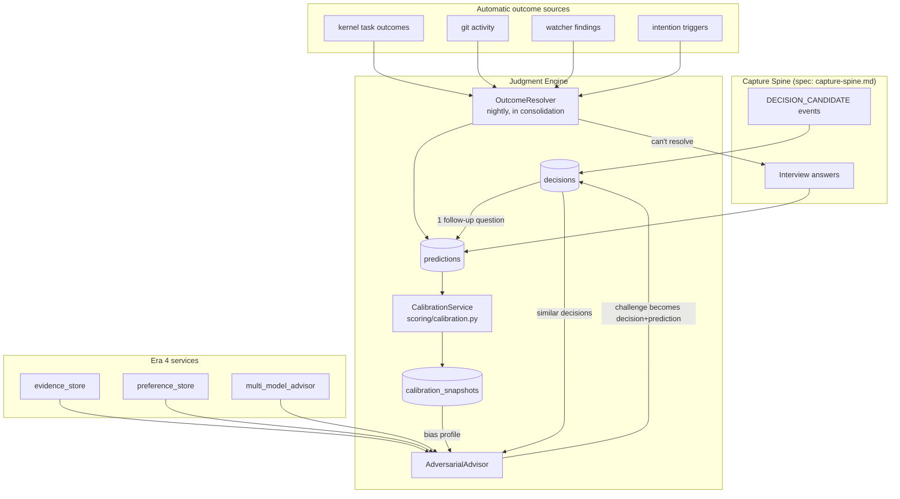
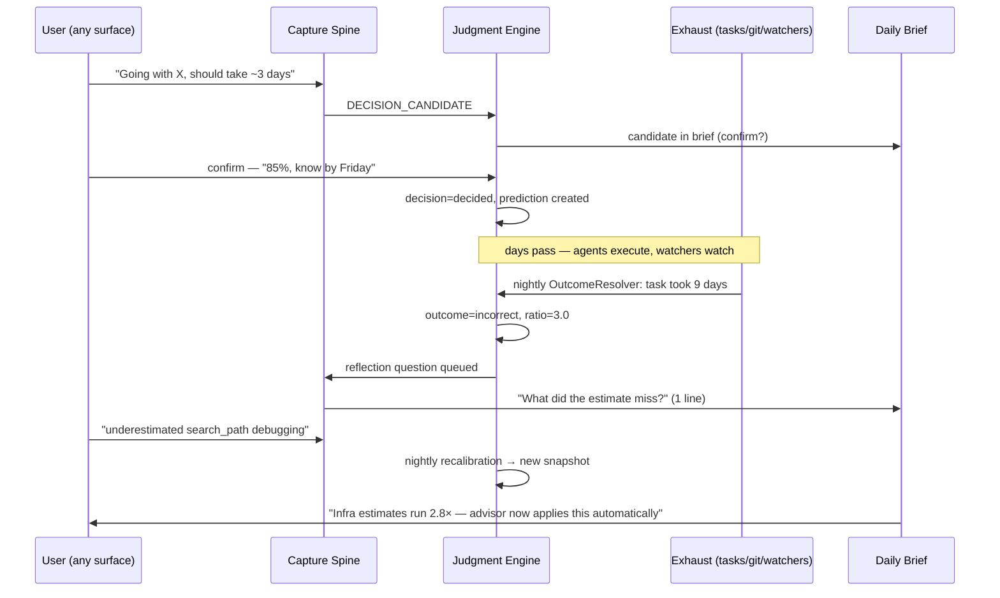

# Judgment Engine — Calibration, Decisions & the Adversarial Advisor — Feature Spec

> **Purpose**: The system that makes the user's judgment measurably better over time. Execution is being commoditized by agents; judgment is the residual human bottleneck. The Judgment Engine closes a loop no product closes today: **Decide** (advisor challenges you with your own history) → **Predict** (confidence logged) → **Act** → **Observe** (outcomes resolved automatically) → **Recalibrate** (your personal bias model updates nightly). The flagship demo is one screen: *your calibration curve improving over months.*
>
> **Why nobody has this**: calibration tools (Fatebook, Metaculus) are manual and world-facing; decision journals are write-only; digital twins are enterprise vaporware. The combination requires persistent memory + belief tracking + evidence + watchers + agent execution — a substrate only Life Graph has. The moat is the accumulated, outcome-resolved personal history itself.
>
> **Architecture ref**: `KNOWLEDGE.md`. **Depends on**: `capture-spine.md` (Phases 1–2 minimum — decision candidates and interview questions flow through the spine).
>
> **Existing code leveraged**: `services/contradiction.py` + `services/identity.py` (belief challenge), `services/evidence_store.py` + `services/preference_store.py` (era 4), `services/multi_model_advisor.py` (dissent), `watchers/` (outcome verification), `tools/git.py` + `kernel/project_registry.py` (estimate verification), `services/intentions.py` (trigger machinery), `jobs/consolidation.py` (nightly recalibration), `scoring/` (curve math lives beside decay math).
>
> **Multi-tenant**: All data scoped by `tenant_id`.

---

## Requirements

### Story 1: Decision Records — captured from conversation, not forms

As a **user**, I want my decisions recorded automatically when I make them in conversation with my agents — with at most one follow-up question — so that a complete decision journal accumulates without me ever "journaling."

#### Acceptance Criteria

- GIVEN the capture spine fires `DECISION_CANDIDATE` (e.g. transcript contained "I'll go with AGE over Neo4j because it stays inside Postgres") WHEN the decision processor runs THEN a `decisions` row is created with status=`candidate`, extracted fields {title, chosen_option, alternatives[], reasoning, domain_tags}, and provenance `capture_event_id`
- GIVEN a candidate decision is created WHEN it appears in the next daily brief THEN the user can confirm/discard in one tap; confirming asks exactly one follow-up: *"How confident (%), and when will we know?"* — the answer creates the linked prediction (Story 2)
- GIVEN I want to record a big decision explicitly WHEN I `POST /api/v1/judgment/decisions` with {title, options, chosen_option, reasoning, confidence, review_at, domain_tags} THEN it is stored with status=`decided` and source=`explicit`
- GIVEN a decision is created WHEN embedding generation runs THEN the decision gets a 768-dim embedding so similar past decisions are retrievable by cosine similarity
- GIVEN two candidate decisions from the same capture event overlap semantically (cosine ≥ 0.90) WHEN dedup runs THEN they merge (union of alternatives, longest reasoning wins)
- GIVEN I `GET /api/v1/judgment/decisions?domain=infra&status=decided` THEN I see decisions filtered by domain/status/date, newest first, with their linked predictions and outcomes inline
- GIVEN a decision has `review_at` set WHEN that time passes THEN an intention-style trigger fires and a review question enters the interview queue ("30 days ago you chose X — still the right call?")
- GIVEN a decision is superseded by a later contradicting decision WHEN contradiction detection runs (reusing `services/contradiction.py` candidate search) THEN the old decision gets `superseded_by` set and both remain queryable (Time Machine groundwork — never destroy decision history)

---

### Story 2: Predictions — every confidence claim becomes accountable

As a **user**, I want every falsifiable claim I make ("this migration takes 3 days", "this dependency upgrade is safe", "this client will sign") logged as a prediction with confidence and a resolution horizon so that my stated confidence can be compared against reality.

#### Acceptance Criteria

- GIVEN a confirmed decision WHEN the one-question follow-up is answered ("85%, we'll know by Friday") THEN a `predictions` row is created: statement, confidence=0.85, resolve_by=Friday, decision_id linked
- GIVEN I `POST /api/v1/judgment/predictions` directly with {statement, confidence, resolve_by, resolution_criteria?} THEN a standalone prediction is created (predictions don't require a parent decision)
- GIVEN a prediction mentions a time estimate on a kernel task or project work WHEN creation runs THEN `resolution_criteria` is auto-populated where possible: `{"type": "kernel_task", "task_id": …}` or `{"type": "git_activity", "project_id": …, "files_hint": […]}` or `{"type": "watcher", "watcher": "server_health", "condition": …}` or `{"type": "manual"}`
- GIVEN confidence values arrive WHEN validation runs THEN confidence must be in [0.5, 0.99] for binary statements (a 30% claim is a 70% claim of the negation — normalize, don't reject)
- GIVEN a prediction exists WHEN I `GET /api/v1/judgment/predictions?status=pending&due_before=…` THEN pending predictions are listed with days-until-horizon
- GIVEN 10+ predictions share a domain tag WHEN listing THEN per-domain aggregates are included (count, mean confidence, resolved fraction) — the raw material for Story 4
- GIVEN a prediction was created from conversation WHEN I view it THEN provenance shows the exact capture event and quote it came from

---

### Story 3: Outcome Resolution — automatic first, interview fallback

As a **user**, I want prediction outcomes resolved automatically from system exhaust (task completions, git history, watcher findings, intention triggers) — and only asked about when automation can't tell — so that the calibration loop runs without bookkeeping.

#### Acceptance Criteria

- GIVEN nightly consolidation runs WHEN the outcome resolver executes THEN every pending prediction past (or within 24h of) its horizon is checked against its `resolution_criteria`
- GIVEN criteria type=`kernel_task` WHEN the task completed within the predicted window THEN outcome=`correct` with `resolution_evidence={"task_id":…, "completed_at":…, "predicted_by":…}`; overran → `incorrect` with the actual/predicted ratio recorded
- GIVEN criteria type=`git_activity` WHEN commits matching the hint landed by the horizon THEN resolve accordingly, citing shas — never resolve on absence alone with confidence; absence → escalate to interview
- GIVEN criteria type=`watcher` WHEN a watcher finding matches the condition (e.g. CI broke after the "safe" upgrade) THEN resolve `incorrect` citing the finding id
- GIVEN automation cannot resolve WHEN the resolver finishes THEN an `outcome_resolution` interview question is queued via the capture spine ("You predicted X by Friday at 85% — did it happen?") with one-tap yes/no/ambiguous
- GIVEN an interview answer arrives WHEN routing runs THEN the prediction resolves with source=`interview` and the answer text stored as evidence
- GIVEN a question expires unanswered (7 days) WHEN the sweep runs THEN outcome=`ambiguous` — ambiguous outcomes are excluded from calibration math but counted in an "unresolved rate" metric (a high unresolved rate is itself a finding)
- GIVEN any resolution WHEN it commits THEN `PREDICTION_RESOLVED` fires with {prediction_id, outcome, source} — webhooks/WebSocket carry it like any event

---

### Story 4: Calibration Engine — your personal bias model

As a **user**, I want nightly-computed calibration curves, Brier scores, and per-domain estimate multipliers from my resolved predictions so that the system knows — with numbers — exactly how my confidence maps to reality.

#### Acceptance Criteria

- GIVEN ≥20 resolved predictions exist WHEN nightly recalibration runs THEN a `calibration_snapshots` row is written per domain (and one `overall`) containing: brier_score, resolved_count, confidence buckets [(0.5–0.6), (0.6–0.7), (0.7–0.8), (0.8–0.9), (0.9–1.0)] each with {claimed_mean, actual_rate, n}
- GIVEN fewer than 20 resolved predictions WHEN recalibration runs THEN no snapshot is produced and the API returns `insufficient_data` with progress (n/20) — never show fake curves
- GIVEN time-estimate predictions resolve with actual durations WHEN recalibration runs THEN a per-domain `estimate_multiplier` is computed (geometric mean of actual/predicted, winsorized at p90) — e.g. "infra work runs 2.8× your estimate"
- GIVEN calibration history accumulates WHEN I `GET /api/v1/judgment/calibration?domain=overall&window=90d` THEN I get the current curve, Brier trend over time, and the delta vs the previous 90-day window ("you improved 12%")
- GIVEN a bucket shows systematic overconfidence (claimed 0.9, actual 0.6, n≥5) WHEN the snapshot is written THEN a bias finding is stored: `{"kind": "overconfidence", "domain": "infra", "claimed": 0.9, "actual": 0.61, "n": 7}` and surfaces in the next brief once (not repeatedly)
- GIVEN the advisor (Story 5) requests my bias profile WHEN `GET /api/v1/judgment/profile` is called THEN it returns machine-usable facts: per-domain calibration deltas, estimate multipliers, top failure patterns (from Story 5 pattern mining), unresolved rate
- GIVEN calibration math runs WHEN implemented THEN it lives in `scoring/calibration.py` beside `decay.py` — pure functions, unit-testable without DB

---

### Story 5: Adversarial Advisor — AI that disagrees with receipts

As a **user**, I want to submit a decision I'm about to make and get a structured challenge grounded in MY history — similar past decisions and their outcomes, my calibration in this domain, my beliefs and their contradicting evidence, plus multi-model dissent — so that I get pushback with receipts instead of sycophancy.

#### Acceptance Criteria

- GIVEN I `POST /api/v1/judgment/challenge` with {proposal, context?, domain_tags?} THEN within 20s I receive a challenge report with sections: (1) similar past decisions (cosine ≥ 0.75) with their outcomes, (2) base rates ("your last 4 projects of this shape: 1 finished"), (3) my calibration in this domain ("at 85% here, you're right 58% of the time; multiply time estimates by 2.8"), (4) relevant beliefs with contradicting evidence (from era-4 evidence store), (5) dissenting model view (via `multi_model_advisor` — the *strongest* counter-argument, explicitly instructed not to agree), (6) a verdict: `proceed | proceed_with_changes | reconsider` with the 1–3 load-bearing reasons
- GIVEN the challenge completes WHEN I proceed anyway or change course THEN `POST /api/v1/judgment/challenge/{id}/resolve` records {action_taken, notes} — the challenge itself becomes a decision record + prediction, so **the advisor's own hit-rate is tracked** ("challenges you ignored were right 70% of the time" — or wrong; the advisor is calibrated too)
- GIVEN no similar history exists WHEN the report is built THEN sections degrade gracefully ("no comparable decisions yet — this challenge is generic") rather than hallucinating relevance
- GIVEN a big decision is detected in conversation (candidate with high importance signals: money, commitments >2 weeks, irreversibility keywords) WHEN the daily brief is composed THEN it suggests — once — running the challenge ("Want me to argue against this first?"); never auto-challenges small decisions (anti-annoyance)
- GIVEN failure patterns exist WHEN consolidation runs monthly THEN trajectory mining over resolved decisions produces `failure_patterns` memories ("side projects abandoned at week ~6 when a new idea appears", derived from ≥3 instances, each citing its decision ids) — patterns must cite instances or they aren't stored
- GIVEN a challenge report is generated WHEN it cites anything THEN every citation carries ids (decision_id, evidence_id, prediction_id) — a report with uncited claims is a bug; this is the audit-grade trust principle applied to the advisor itself
- GIVEN LLM cost concerns WHEN a challenge runs THEN retrieval + stats sections (1–4) are computed locally with zero LLM calls; only the dissent section (5) and verdict prose use models (target ≤ ₹2/challenge)

---

### Story 6: Judgment Dashboard Data

As a **user**, I want the numbers behind my judgment exposed as clean API endpoints so that the future dashboard (and CLI/brief today) can render the flagship screen: my calibration improving.

#### Acceptance Criteria

- GIVEN resolved history exists WHEN I `GET /api/v1/judgment/stats` THEN I get: decisions total/open/reviewed, predictions pending/resolved/ambiguous, current overall Brier + 90-day trend, top 3 bias findings, advisor hit-rate
- GIVEN I `GET /api/v1/judgment/calibration/curve?domain=infra` THEN I get bucket data ready to plot (claimed vs actual per bucket, with n) plus the identity line reference
- GIVEN I `GET /api/v1/judgment/decisions/{id}` THEN I get the full decision dossier: options, reasoning, predictions + outcomes, challenge report if any, provenance chain back to capture events (Time Machine-ready)
- GIVEN the CLI runs `life-graph judgment stats` THEN the same data renders as a terminal table (extend `cli.py`)

---

## Design

### Architecture Overview



Key design decisions:

1. **Calibration is pure math in `scoring/`** — Brier scores and buckets are deterministic functions, unit-tested without DB or LLM, exactly like `decay.py`. The LLM never grades outcomes.
2. **Never auto-resolve on absence of evidence.** Absence → interview question. False outcome data poisons calibration worse than missing data.
3. **The advisor is itself calibrated.** Every challenge becomes a tracked prediction. An advisor that can't show its own hit-rate is just another opinion.
4. **Receipts or it didn't happen.** Every report section cites row ids. This is what separates the Judgment Engine from a system prompt that says "be critical."
5. **Local-first economics.** Sections 1–4 of a challenge are SQL + vector search. LLM spend is confined to dissent + verdict prose.

### Data Models

```sql
-- Migration 020_judgment_engine.py

CREATE TABLE decisions (
    id              UUID PRIMARY KEY DEFAULT gen_random_uuid(),
    tenant_id       VARCHAR(64) NOT NULL,
    title           VARCHAR(500) NOT NULL,
    reasoning       TEXT NOT NULL DEFAULT '',
    options         JSONB NOT NULL DEFAULT '[]',      -- [{"option": "...", "notes": "..."}]
    chosen_option   VARCHAR(500),
    status          VARCHAR(16) NOT NULL DEFAULT 'candidate', -- candidate|decided|reviewed|superseded|discarded
    source          VARCHAR(16) NOT NULL DEFAULT 'conversation', -- conversation|explicit|challenge
    domain_tags     TEXT[] NOT NULL DEFAULT '{}',
    importance      VARCHAR(16) NOT NULL DEFAULT 'normal',
    embedding       VECTOR(768),
    capture_event_id UUID,                             -- provenance (capture spine)
    challenge_id    UUID,                              -- if a challenge was run
    superseded_by   UUID REFERENCES decisions(id),
    decided_at      TIMESTAMPTZ,
    review_at       TIMESTAMPTZ,
    reviewed_at     TIMESTAMPTZ,
    properties      JSONB NOT NULL DEFAULT '{}',
    created_at      TIMESTAMPTZ NOT NULL DEFAULT now(),
    updated_at      TIMESTAMPTZ NOT NULL DEFAULT now()
);
CREATE INDEX ix_decisions_tenant ON decisions (tenant_id, created_at DESC);
CREATE INDEX ix_decisions_status ON decisions (tenant_id, status);
CREATE INDEX ix_decisions_embedding ON decisions USING ivfflat (embedding vector_cosine_ops);

CREATE TABLE predictions (
    id              UUID PRIMARY KEY DEFAULT gen_random_uuid(),
    tenant_id       VARCHAR(64) NOT NULL,
    decision_id     UUID REFERENCES decisions(id),
    statement       TEXT NOT NULL,
    confidence      FLOAT NOT NULL CHECK (confidence >= 0.5 AND confidence <= 0.99),
    domain_tags     TEXT[] NOT NULL DEFAULT '{}',
    resolve_by      TIMESTAMPTZ NOT NULL,
    resolution_criteria JSONB NOT NULL DEFAULT '{"type": "manual"}',
    outcome         VARCHAR(16) NOT NULL DEFAULT 'pending', -- pending|correct|incorrect|ambiguous|expired
    resolved_at     TIMESTAMPTZ,
    resolution_source VARCHAR(16),                     -- kernel_task|git|watcher|intention|interview|manual
    resolution_evidence JSONB NOT NULL DEFAULT '{}',
    actual_vs_predicted FLOAT,                         -- for time estimates: actual/predicted ratio
    capture_event_id UUID,
    created_at      TIMESTAMPTZ NOT NULL DEFAULT now()
);
CREATE INDEX ix_predictions_tenant_outcome ON predictions (tenant_id, outcome, resolve_by);
CREATE INDEX ix_predictions_decision ON predictions (decision_id);

CREATE TABLE calibration_snapshots (
    id              UUID PRIMARY KEY DEFAULT gen_random_uuid(),
    tenant_id       VARCHAR(64) NOT NULL,
    domain          VARCHAR(64) NOT NULL DEFAULT 'overall',
    window_days     INTEGER NOT NULL DEFAULT 90,
    resolved_count  INTEGER NOT NULL,
    ambiguous_count INTEGER NOT NULL DEFAULT 0,
    brier_score     FLOAT NOT NULL,
    buckets         JSONB NOT NULL,                    -- [{"lo":0.8,"hi":0.9,"claimed_mean":0.84,"actual_rate":0.61,"n":7}, ...]
    estimate_multiplier FLOAT,                         -- geometric mean actual/predicted (time estimates)
    bias_findings   JSONB NOT NULL DEFAULT '[]',
    computed_at     TIMESTAMPTZ NOT NULL DEFAULT now()
);
CREATE INDEX ix_calibration_tenant ON calibration_snapshots (tenant_id, domain, computed_at DESC);

CREATE TABLE challenges (
    id              UUID PRIMARY KEY DEFAULT gen_random_uuid(),
    tenant_id       VARCHAR(64) NOT NULL,
    proposal        TEXT NOT NULL,
    report          JSONB NOT NULL,                    -- sections with cited ids
    verdict         VARCHAR(32) NOT NULL,              -- proceed|proceed_with_changes|reconsider
    action_taken    VARCHAR(32),                       -- followed|ignored|modified (set on resolve)
    outcome_prediction_id UUID REFERENCES predictions(id),
    total_cost_usd  FLOAT NOT NULL DEFAULT 0,
    created_at      TIMESTAMPTZ NOT NULL DEFAULT now()
);
```

### API Contracts

```
POST /api/v1/judgment/decisions
{ "title": "Keep Apache AGE over Neo4j", "options": [{"option": "AGE"}, {"option": "Neo4j"}],
  "chosen_option": "AGE", "reasoning": "stays in Postgres, no second DB to operate",
  "confidence": 0.8, "review_at": "2026-10-01T00:00:00Z", "domain_tags": ["infra","storage"] }
→ 201 { "id": "…", "status": "decided", "prediction_id": "…" }

POST /api/v1/judgment/predictions
{ "statement": "AGE search_path fix holds under load; no graph-related incidents for 90 days",
  "confidence": 0.85, "resolve_by": "2026-10-05T00:00:00Z",
  "resolution_criteria": {"type": "watcher", "watcher": "server_health", "condition": "no_incident_tagged:graph"} }
→ 201

GET /api/v1/judgment/calibration?domain=overall&window=90d
→ 200 {
  "brier_score": 0.19, "trend": {"previous": 0.24, "delta_pct": -20.8},
  "resolved_count": 34, "unresolved_rate": 0.12,
  "buckets": [{"lo": 0.8, "hi": 0.9, "claimed_mean": 0.84, "actual_rate": 0.61, "n": 7}, …],
  "estimate_multiplier": 2.8
}

POST /api/v1/judgment/challenge
{ "proposal": "Take the 3-month Uzhavu client customization contract alongside dashboard work",
  "domain_tags": ["career", "workload"] }
→ 200 {
  "id": "…", "verdict": "reconsider",
  "report": {
    "similar_decisions": [{"decision_id": "…", "title": "…", "outcome": "abandoned wk 6"}],
    "base_rates": {"pattern": "concurrent >1 major commitment", "n": 4, "completed": 1},
    "calibration": {"domain": "workload", "claimed": 0.85, "actual": 0.58, "estimate_multiplier": 2.8},
    "belief_conflicts": [{"belief": "…", "contradicting_evidence_ids": ["…"]}],
    "dissent": {"model": "deepseek", "argument": "…"},
    "load_bearing_reasons": ["…", "…"]
  },
  "one_question": "If you proceed: confidence this ships without dropping the dashboard?"
}

POST /api/v1/judgment/challenge/{id}/resolve   { "action_taken": "modified", "notes": "took it, but deferred start by 6 weeks" }
GET  /api/v1/judgment/stats
GET  /api/v1/judgment/profile          → machine-usable bias profile (for agents/advisor context)
GET  /api/v1/judgment/decisions/{id}   → full dossier with provenance chain
```

### Sequence Diagram — the full loop



### Core Implementation

```python
# life_graph/scoring/calibration.py
"""Pure calibration math. No DB, no LLM — unit-testable like decay.py."""

from dataclasses import dataclass
from math import exp, log

BUCKETS = [(0.5, 0.6), (0.6, 0.7), (0.7, 0.8), (0.8, 0.9), (0.9, 1.0)]


@dataclass
class Resolved:
    confidence: float
    correct: bool
    domain_tags: tuple[str, ...] = ()
    duration_ratio: float | None = None  # actual/predicted, time estimates only


def brier_score(resolved: list[Resolved]) -> float:
    """Mean squared error of confidence vs outcome. 0 = oracle, 0.25 = coin flip at 50%."""
    if not resolved:
        raise ValueError("no resolved predictions")
    return sum((r.confidence - (1.0 if r.correct else 0.0)) ** 2 for r in resolved) / len(resolved)


def bucket_curve(resolved: list[Resolved]) -> list[dict]:
    out = []
    for lo, hi in BUCKETS:
        rs = [r for r in resolved if lo <= r.confidence < hi or (hi == 1.0 and r.confidence == hi)]
        if not rs:
            continue
        out.append({
            "lo": lo, "hi": hi, "n": len(rs),
            "claimed_mean": sum(r.confidence for r in rs) / len(rs),
            "actual_rate": sum(1 for r in rs if r.correct) / len(rs),
        })
    return out


def estimate_multiplier(resolved: list[Resolved], winsor_p: float = 0.9) -> float | None:
    """Geometric mean of actual/predicted duration ratios, winsorized against outliers."""
    ratios = sorted(r.duration_ratio for r in resolved if r.duration_ratio and r.duration_ratio > 0)
    if len(ratios) < 5:
        return None
    cap = ratios[min(int(len(ratios) * winsor_p), len(ratios) - 1)]
    ratios = [min(r, cap) for r in ratios]
    return exp(sum(log(r) for r in ratios) / len(ratios))


def bias_findings(buckets: list[dict], min_n: int = 5, gap: float = 0.15) -> list[dict]:
    """Systematic miscalibration: claimed vs actual gap beyond threshold with enough samples."""
    findings = []
    for b in buckets:
        if b["n"] >= min_n and b["claimed_mean"] - b["actual_rate"] >= gap:
            findings.append({"kind": "overconfidence", **b})
        elif b["n"] >= min_n and b["actual_rate"] - b["claimed_mean"] >= gap:
            findings.append({"kind": "underconfidence", **b})
    return findings
```

```python
# life_graph/services/outcome_resolver.py
"""Resolves predictions from system exhaust. Absence of evidence → interview, never a guess."""

class OutcomeResolver:
    RESOLVERS = {
        "kernel_task": "_resolve_kernel_task",
        "git_activity": "_resolve_git",
        "watcher": "_resolve_watcher",
        "intention": "_resolve_intention",
    }

    async def run_nightly(self, tenant_id: str) -> ResolverReport:
        due = await self._due_predictions(tenant_id)   # past horizon or within 24h
        report = ResolverReport()
        for pred in due:
            kind = pred.resolution_criteria.get("type", "manual")
            method = getattr(self, self.RESOLVERS.get(kind, ""), None)
            verdict = await method(pred) if method else None
            if verdict is not None:
                await self._resolve(pred, verdict)      # fires PREDICTION_RESOLVED
                report.auto += 1
            else:
                await self._queue_interview(pred)       # capture spine, origin=outcome_resolution
                report.escalated += 1
        return report
```

```python
# life_graph/services/adversarial_advisor.py
"""Challenge reports with receipts. Sections 1-4 are local; LLM only for dissent + verdict."""

class AdversarialAdvisor:
    async def challenge(self, tenant_id: str, proposal: str, domain_tags: list[str]) -> Challenge:
        emb = await self._embeddings.embed(proposal)
        similar = await self._similar_decisions(tenant_id, emb, threshold=0.75, limit=5)
        base_rates = await self._base_rates(tenant_id, similar)          # SQL over outcomes
        profile = await self._calibration.profile(tenant_id, domain_tags)
        conflicts = await self._belief_conflicts(tenant_id, emb)          # era4 evidence store
        dissent = await self._advisor.dissent(proposal, context=profile)  # multi_model_advisor, forced-contrarian prompt
        verdict = self._verdict(similar, base_rates, profile, conflicts, dissent)
        challenge = await self._store(tenant_id, proposal, {...cited sections...}, verdict)
        # the advisor is accountable: its verdict becomes a tracked prediction on resolve()
        return challenge
```

```python
# jobs/consolidation.py — pipeline gains two steps after existing step 7 (audit):
#   step 8: interview generation      (capture-spine spec)
#   step 9: outcome resolution + calibration snapshot (this spec)
# workers: monthly cron `failure_pattern_mining` (1 LLM pass over resolved decision trajectories)
```

### Dependencies & Integrations

| Depends on | Why |
|---|---|
| `capture-spine.md` Phases 1–2 | Decision candidates in; interview questions out; provenance ids |
| `services/multi_model_advisor.py` (era 4, built) | Dissent section — reused with a forced-contrarian prompt |
| `services/evidence_store.py` + `preference_store.py` (era 4, built) | Belief-conflict section |
| `services/contradiction.py` | Decision supersession detection |
| `kernel/process_manager.py`, `tools/git.py`, `watchers/` | Automatic outcome resolution |
| `services/intentions.py` | `review_at` triggers reuse intention trigger machinery |
| `scoring/` | Calibration math lives beside decay math, same testing style |

### New EventType Additions

```python
# In life_graph/core/events.py — add to EventType enum:
DECISION_RECORDED = "judgment:decision:recorded"
DECISION_SUPERSEDED = "judgment:decision:superseded"
PREDICTION_CREATED = "judgment:prediction:created"
PREDICTION_RESOLVED = "judgment:prediction:resolved"
CALIBRATION_UPDATED = "judgment:calibration:updated"
DECISION_CHALLENGED = "judgment:challenged"
BIAS_DETECTED = "judgment:bias:detected"
```

### New Environment Variables

```bash
LIFE_GRAPH_JUDGMENT_ENABLED=true
LIFE_GRAPH_JUDGMENT_MIN_RESOLVED_FOR_CALIBRATION=20
LIFE_GRAPH_JUDGMENT_CALIBRATION_WINDOW_DAYS=90
LIFE_GRAPH_JUDGMENT_CHALLENGE_BUDGET_INR_MONTHLY=100
LIFE_GRAPH_JUDGMENT_SIMILARITY_THRESHOLD=0.75
```

### Error Handling

- Challenge with all-empty local sections → still returns, marked `"grounding": "generic"` — never fabricate history
- Multi-model dissent timeout → report ships with sections 1–4 + note (same graceful degradation as era-4 advisor)
- Resolver conflicting signals (task completed but watcher shows breakage) → outcome=`ambiguous`, both cited, interview question asks the human to adjudicate
- Calibration with n<20 → `insufficient_data` response, no snapshot row

### Security & Integrity Considerations

- Decisions/predictions are among the most sensitive personal data in the system: excluded from any future Delegate surface by default; export requires the standard admin NDJSON path
- Calibration must be tamper-evident to be trustworthy: snapshots are append-only; resolved predictions are immutable (corrections create a new resolution row in `properties.resolution_history`, never overwrite)
- The advisor prompt must never see other tenants' data (existing tenant-scoping discipline applies to every retrieval in the report builder)

### Monthly Cost Estimate

| Item | Volume | Cost |
|---|---|---|
| Decision/prediction extraction | regex tier via capture spine | ₹0 |
| Outcome resolution | SQL + exhaust matching | ₹0 |
| Nightly calibration | pure math | ₹0 |
| Challenges (dissent + verdict) | ~10/month × ₹2 | ~₹20 |
| Failure-pattern mining | 1 LLM pass/month | ~₹10 |
| **Total** | | **~₹30/month** |

---

## Tasks

### Phase 1: Schema & Models (~1 day)
- [ ] Migration `020_judgment_engine.py`: decisions, predictions, calibration_snapshots, challenges
- [ ] SQLAlchemy models + Pydantic schemas; new EventTypes

### Phase 2: Decisions & Predictions (~1.5 days)
- [ ] `services/judgment.py`: decision CRUD, candidate confirmation flow, dedup/merge, supersession via contradiction service
- [ ] Prediction CRUD with confidence normalization + criteria auto-population (kernel_task/git/watcher detection)
- [ ] `api/judgment.py` router + DI + register in `main.py`
- [ ] Subscribe to `DECISION_CANDIDATE` from capture spine; one-question follow-up via brief

### Phase 3: Outcome Resolver (~1.5 days)
- [ ] `services/outcome_resolver.py` with 4 resolver kinds + interview escalation
- [ ] Consolidation step 9 wiring; `PREDICTION_RESOLVED` events; resolution immutability
- [ ] Interview answer routing back to predictions (completes the capture-spine stub)

### Phase 4: Calibration Engine (~1 day)
- [ ] `scoring/calibration.py` pure functions (brier, buckets, multiplier, bias findings) + unit tests
- [ ] Nightly snapshot job; `GET /calibration`, `/profile`, `/stats` endpoints; insufficient-data handling
- [ ] Bias findings → one-time brief surfacing

### Phase 5: Adversarial Advisor (~2 days)
- [ ] `services/adversarial_advisor.py`: local sections (similar decisions, base rates, calibration, belief conflicts) with mandatory citations
- [ ] Forced-contrarian dissent via `multi_model_advisor`; verdict assembly; cost tracking + budget guard
- [ ] `POST /challenge` + `/challenge/{id}/resolve`; challenge → tracked prediction (advisor accountability)
- [ ] Big-decision detection heuristic → brief suggestion (once, never nagging)

### Phase 6: Pattern Mining, CLI, Tests (~1.5 days)
- [ ] Monthly failure-pattern mining job (instances-cited-or-dropped rule)
- [ ] `life-graph judgment stats` CLI command
- [ ] Integration tests: candidate→confirm→predict→resolve→calibrate happy path; ambiguity paths; challenge grounding/degradation; tenant isolation
- [ ] Update KNOWLEDGE.md, .env.example, OpenAPI examples

**Total: ~8.5 days** (after capture-spine Phases 1–2)
