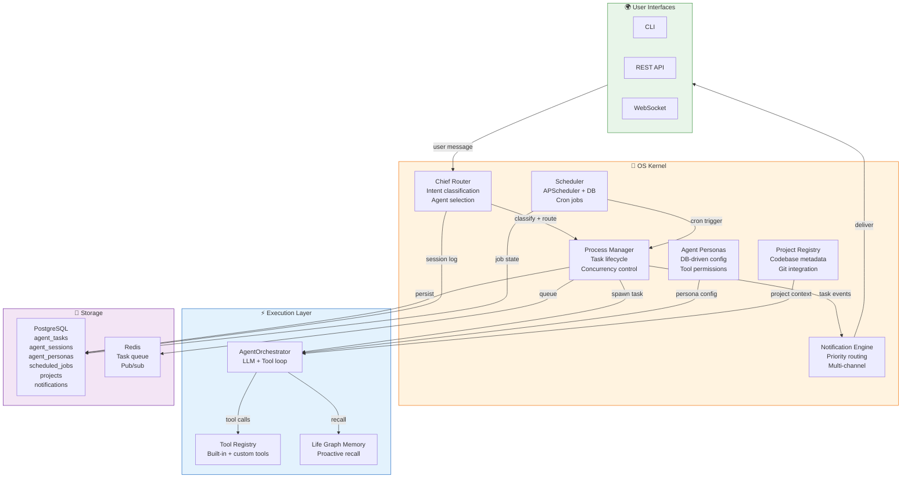
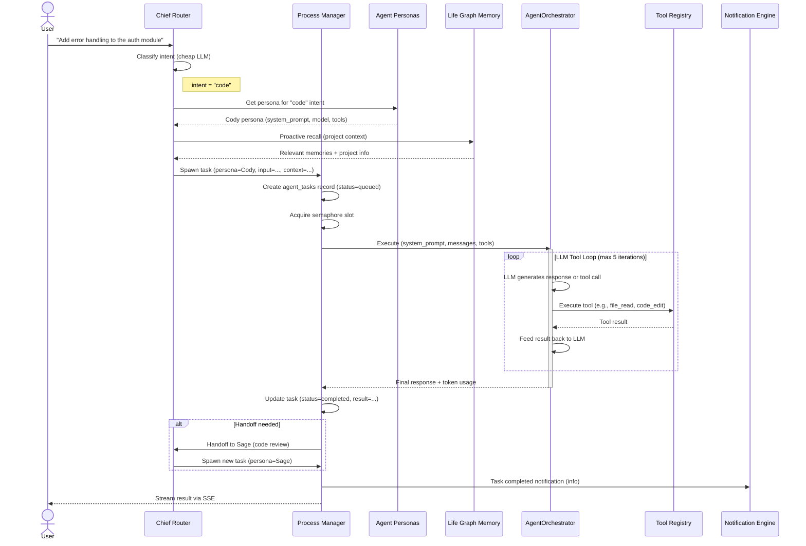
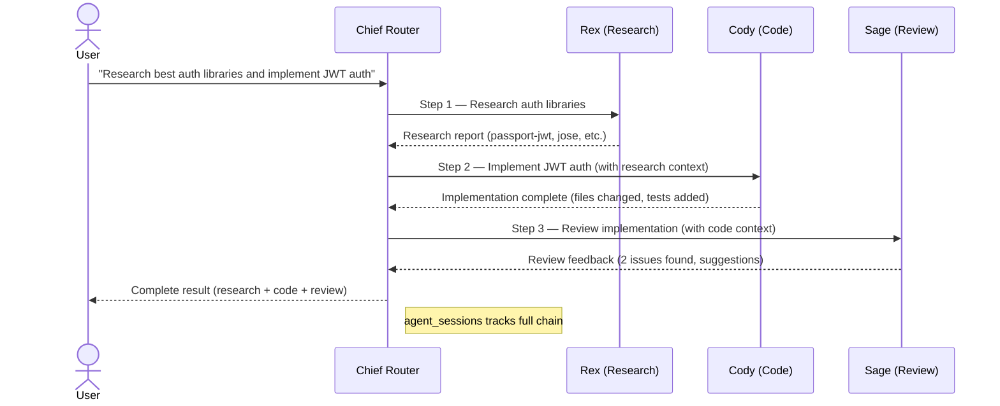

# Life Graph OS Kernel — Feature Spec

> **Purpose**: The core operating system layer that transforms Life Graph from a memory microservice into an always-running AI system. The kernel manages agent personas, task execution, intelligent routing, scheduled jobs, project awareness, and notifications — making Life Graph the brain that drives autonomous agent workflows.
>
> **Architecture ref**: `docs/ARCHITECTURE.md` — extends the existing service layer
>
> **Existing patterns**: Follows `life_graph/agents/orchestrator.py` (LLM loop), `life_graph/core/events.py` (EventBus), `life_graph/config.py` (Pydantic Settings)
>
> **Multi-tenant**: Every kernel resource is scoped by `tenant_id`. Personal tenant gets full system access; customer tenants get read-only tools.

---

## Requirements

### Story 1: Process Manager — Spawn and Track Agent Tasks

As a **system operator**, I want to spawn agent tasks like OS processes and track their lifecycle so that multiple agents can work concurrently with full visibility into what's running.

#### Acceptance Criteria

- GIVEN a valid tenant context WHEN I submit a task via `POST /api/v1/kernel/tasks` with `agent_name`, `input`, and optional `priority` THEN the system creates an `agent_tasks` record with status `queued`, assigns a `task_id`, and returns it immediately
- GIVEN a task is queued WHEN the Process Manager picks it up THEN the status transitions to `running`, `started_at` is set, and the assigned agent begins execution via `AgentOrchestrator`
- GIVEN a task is running WHEN the agent completes successfully THEN the status transitions to `completed`, `completed_at` is set, and the `result` JSONB contains the agent's output
- GIVEN a task is running WHEN the agent encounters an unrecoverable error THEN the status transitions to `failed`, `error` captures the exception, and `retry_count` increments
- GIVEN a task has failed with `retry_count < max_retries` WHEN the Process Manager checks retry eligibility THEN it re-queues the task with exponential backoff delay
- GIVEN a running task WHEN I call `POST /api/v1/kernel/tasks/{task_id}/cancel` THEN the task's `asyncio.Task` is cancelled, status transitions to `cancelled`, and any held resources are released
- GIVEN a running task WHEN it exceeds `timeout_seconds` (default: 300) THEN the Process Manager cancels it automatically and sets status to `timeout`
- GIVEN multiple tasks are queued WHEN the Process Manager runs THEN it executes up to `max_concurrent_tasks` (default: 5) simultaneously using `asyncio.Semaphore`
- GIVEN tasks exist WHEN I call `GET /api/v1/kernel/tasks` with optional filters (`status`, `agent_name`, `since`) THEN I receive a paginated list of tasks ordered by `created_at DESC`
- GIVEN a task exists WHEN I call `GET /api/v1/kernel/tasks/{task_id}` THEN I receive the full task record including `result`, `error`, `logs`, and duration
- GIVEN tasks accumulate WHEN the nightly cleanup runs THEN completed/failed tasks older than 30 days are archived (soft-deleted)

---

### Story 2: Chief Router — Intelligent Message Classification and Routing

As a **user interacting via any interface**, I want my messages automatically classified and routed to the right specialist agent so that I get expert-quality responses without manually choosing which agent to talk to.

#### Acceptance Criteria

- GIVEN a user sends a message via CLI, API, or WebSocket WHEN the Chief Router receives it THEN it classifies the intent using a cheap LLM (`llm_model_cheap`) into one of: `code`, `research`, `deploy`, `monitor`, `question`, `data`, `docs`, `general`
- GIVEN the intent is classified WHEN the Chief selects a specialist THEN it queries `agent_personas` for the best matching persona based on `intent_tags` and spawns a task via the Process Manager
- GIVEN a specialist agent completes WHEN it determines a handoff is needed (e.g., research → code) THEN it returns a `handoff` result with `next_agent` and `context`, and the Chief spawns the next specialist with accumulated context
- GIVEN a multi-step workflow WHEN the Chief orchestrates Rex → Cody → Sage THEN each step's output feeds into the next step's input, and the full chain is tracked in `agent_sessions`
- GIVEN the Chief routes a message WHEN an `agent_sessions` record is created THEN it stores: `session_id`, `tenant_id`, `user_message`, `classified_intent`, `routed_to` (persona name), `handoff_chain` (JSONB array), `total_duration_ms`, `status`
- GIVEN intent classification WHEN the cheap LLM is unavailable THEN the Chief falls back to keyword-based regex classification (pattern matching on message content)
- GIVEN a conversation is ongoing WHEN the user sends follow-up messages THEN the Chief maintains session continuity by routing to the same specialist unless the intent shifts
- GIVEN the routing decision WHEN Life Graph memories are available THEN the Chief injects relevant proactive recall context into the specialist's system prompt

---

### Story 3: Agent Personas — Database-Driven Agent Configurations

As an **operator**, I want agent personas stored in the database (not hardcoded Python classes) so that I can create, modify, and manage agent behaviors without code deployments.

#### Acceptance Criteria

- GIVEN the system starts WHEN no personas exist in the database THEN the system seeds 6 built-in personas: Chief, Cody (code), Rex (research), Ops (deploy), Penny (data), Scribe (docs)
- GIVEN a persona exists WHEN an agent task is spawned for that persona THEN the `AgentOrchestrator` is initialized with the persona's `system_prompt`, `model`, `temperature`, and `allowed_tools`
- GIVEN I call `POST /api/v1/kernel/personas` with name, description, system_prompt, allowed_tools, model, and temperature THEN a new custom persona is created and immediately available for routing
- GIVEN I call `PATCH /api/v1/kernel/personas/{persona_id}` THEN the persona's configuration is updated and takes effect on the next task spawn (running tasks use the config they started with)
- GIVEN a persona has `allowed_tools` WHEN an agent task runs THEN only tools in the allow-list are passed to the LLM — unauthorized tool calls are blocked
- GIVEN the tenant is the personal/admin tenant WHEN loading tool permissions THEN the persona gets access to system tools: `terminal`, `git`, `docker`, `ssh`, `file_write`
- GIVEN the tenant is a customer tenant WHEN loading tool permissions THEN the persona gets only read-only tools: `memory_search`, `knowledge_query`, `file_read` — write/system tools are excluded
- GIVEN I call `GET /api/v1/kernel/personas` THEN I receive all personas (built-in + custom) for my tenant, with `is_builtin` flag distinguishing seeded from custom
- GIVEN I call `DELETE /api/v1/kernel/personas/{persona_id}` on a custom persona THEN it is soft-deleted; attempting to delete a built-in persona returns 403
- GIVEN a persona has `intent_tags` WHEN the Chief Router classifies an intent THEN it matches against persona `intent_tags` to find the best specialist

---

### Story 4: Scheduler — Persistent Cron Jobs via APScheduler

As a **system operator**, I want to register cron jobs that persist across restarts so that automated workflows (watchers, research cycles, optimization) run reliably on schedule.

#### Acceptance Criteria

- GIVEN the FastAPI application starts WHEN the lifespan context manager initializes THEN APScheduler starts with a PostgreSQL job store and loads all active jobs from `scheduled_jobs`
- GIVEN I call `POST /api/v1/kernel/schedules` with `name`, `cron_expression`, `agent_name`, `input`, and optional `description` THEN a new scheduled job is created in `scheduled_jobs` and registered with APScheduler
- GIVEN a cron trigger fires WHEN the scheduler invokes the job THEN it spawns an agent task via the Process Manager with the job's configured `agent_name` and `input`
- GIVEN a scheduled job exists WHEN I call `PATCH /api/v1/kernel/schedules/{schedule_id}` to update `cron_expression` or `is_active` THEN APScheduler reschedules or pauses the job accordingly
- GIVEN a scheduled job exists WHEN I call `DELETE /api/v1/kernel/schedules/{schedule_id}` THEN it is removed from APScheduler and soft-deleted in the database
- GIVEN a job fires WHEN the resulting task completes THEN `scheduled_jobs.last_run_at` and `last_run_status` are updated, and `run_count` increments
- GIVEN a scheduled job fails 3 consecutive times WHEN the system detects the pattern THEN it sets `is_active = false` and creates a `critical` notification: "Scheduled job '{name}' disabled after 3 consecutive failures"
- GIVEN I call `GET /api/v1/kernel/schedules` THEN I receive all scheduled jobs for my tenant with `next_run_at` computed from the cron expression
- GIVEN the application restarts WHEN APScheduler reinitializes THEN all previously active jobs resume from their stored state — no missed triggers during the downtime window are replayed (missed jobs are skipped)

---

### Story 5: Project Registry — Codebase Awareness

As an **operator**, I want to register codebases the OS manages so that agents have project context (language, dependencies, recent commits) when working on code tasks.

#### Acceptance Criteria

- GIVEN I call `POST /api/v1/kernel/projects` with `name`, `path`, `description`, and optional `git_url` THEN a new project record is created in the `projects` table
- GIVEN a project has a valid `path` on the host filesystem WHEN the system scans it THEN it auto-detects: `language` (from file extensions), `git_branch` (current branch), `git_remote` (origin URL), and `dependency_file` (requirements.txt / package.json / Cargo.toml)
- GIVEN a project is registered WHEN I call `POST /api/v1/kernel/projects/{project_id}/scan` THEN the system re-scans the project and updates `last_scanned_at`, `recent_commits` (last 10), `dependency_count`, and `file_count`
- GIVEN a project is registered WHEN an agent task targets that project (via `project_id` in task input) THEN the agent's system prompt is augmented with project context: name, language, recent commits, dependency info
- GIVEN I call `GET /api/v1/kernel/projects` THEN I receive all registered projects for my tenant with their latest scan metadata
- GIVEN I call `GET /api/v1/kernel/projects/{project_id}` THEN I receive full project details including `recent_commits`, `dependencies`, and scan history
- GIVEN I call `DELETE /api/v1/kernel/projects/{project_id}` THEN the project is soft-deleted and agents no longer receive its context
- GIVEN a project has a `git_url` WHEN the system scans THEN it reads `.git/HEAD` and `git log --oneline -10` without requiring network access

---

### Story 6: Notification Engine — Priority-Routed Alerts

As a **user**, I want notifications routed by priority through appropriate channels so that critical alerts reach me immediately while informational updates are batched.

#### Acceptance Criteria

- GIVEN a system event occurs (task failure, schedule disabled, agent error) WHEN a notification is created THEN it is stored in `notifications` with `priority` (critical / important / info), `channel`, `title`, `body`, and `metadata`
- GIVEN a `critical` notification is created WHEN the engine processes it THEN it is delivered immediately via all configured channels (terminal + email + webhook)
- GIVEN an `important` notification is created WHEN the engine processes it THEN it is queued for same-day delivery, batched every 4 hours
- GIVEN an `info` notification is created WHEN the engine processes it THEN it is queued for the weekly digest (Sunday 09:00 UTC)
- GIVEN the email channel is configured WHEN a notification is delivered via email THEN it is sent via SMTP using the configured `smtp_host`, `smtp_port`, `smtp_user`, `smtp_password`
- GIVEN the webhook channel is configured WHEN a notification is delivered via webhook THEN it sends a POST request to the configured URL with HMAC-SHA256 signature
- GIVEN the terminal channel is configured WHEN a notification is delivered via terminal THEN it is printed to the server's stdout with color-coded priority prefix
- GIVEN I call `GET /api/v1/kernel/notifications` with optional filters (`priority`, `read`, `since`) THEN I receive a paginated list of notifications for my tenant
- GIVEN I call `PATCH /api/v1/kernel/notifications/{notification_id}/read` THEN the notification is marked as read
- GIVEN I call `POST /api/v1/kernel/notifications/preferences` with per-channel settings THEN my notification routing preferences are saved to `tenant_configs.notification_prefs`

---

## Design

### Architecture Overview



### Message Flow — User → Chief → Agent → Result



### Multi-Step Handoff Flow



---

### Data Models

```sql
-- ============================================================
-- Agent Tasks — tracks every agent execution (like OS processes)
-- ============================================================
CREATE TABLE agent_tasks (
    id              UUID PRIMARY KEY DEFAULT gen_random_uuid(),
    tenant_id       VARCHAR(64) NOT NULL,
    task_name       TEXT,                                     -- Human-readable label
    agent_name      VARCHAR(100) NOT NULL,                    -- Persona name: 'cody', 'rex', etc.
    status          VARCHAR(20) NOT NULL DEFAULT 'queued',    -- queued|running|completed|failed|cancelled|timeout
    priority        VARCHAR(10) NOT NULL DEFAULT 'normal',    -- low|normal|high|critical
    input           JSONB NOT NULL DEFAULT '{}',              -- Task input: message, context, project_id
    result          JSONB DEFAULT '{}',                       -- Agent output on success
    error           TEXT,                                     -- Error message/traceback on failure
    logs            JSONB DEFAULT '[]',                       -- Structured execution log entries
    token_usage     JSONB DEFAULT '{}',                       -- {"prompt": N, "completion": N, "total": N}
    model_used      VARCHAR(100),                             -- Actual LLM model used (may differ from persona default)
    timeout_seconds INT NOT NULL DEFAULT 300,                 -- Max execution time
    retry_count     INT NOT NULL DEFAULT 0,
    max_retries     INT NOT NULL DEFAULT 2,
    parent_task_id  UUID REFERENCES agent_tasks(id)
        ON DELETE SET NULL,                                   -- For handoff chains
    session_id      UUID,                                     -- FK to agent_sessions
    project_id      UUID,                                     -- FK to projects (optional)
    started_at      TIMESTAMPTZ,
    completed_at    TIMESTAMPTZ,
    created_at      TIMESTAMPTZ NOT NULL DEFAULT NOW(),
    updated_at      TIMESTAMPTZ NOT NULL DEFAULT NOW()
);

CREATE INDEX idx_tasks_tenant_status ON agent_tasks(tenant_id, status);
CREATE INDEX idx_tasks_tenant_created ON agent_tasks(tenant_id, created_at DESC);
CREATE INDEX idx_tasks_agent ON agent_tasks(tenant_id, agent_name);
CREATE INDEX idx_tasks_session ON agent_tasks(session_id);
CREATE INDEX idx_tasks_parent ON agent_tasks(parent_task_id);
CREATE INDEX idx_tasks_queued ON agent_tasks(status, priority, created_at)
    WHERE status = 'queued';


-- ============================================================
-- Agent Sessions — tracks routing decisions and conversation chains
-- ============================================================
CREATE TABLE agent_sessions (
    id                  UUID PRIMARY KEY DEFAULT gen_random_uuid(),
    tenant_id           VARCHAR(64) NOT NULL,
    user_message        TEXT NOT NULL,                         -- Original user input
    classified_intent   VARCHAR(30),                           -- code|research|deploy|monitor|question|data|docs|general
    classification_conf FLOAT DEFAULT 0.0,                    -- LLM confidence in classification
    routed_to           VARCHAR(100),                          -- Initial persona name
    handoff_chain       JSONB DEFAULT '[]',                    -- [{"agent": "rex", "duration_ms": 1200}, ...]
    total_duration_ms   INT DEFAULT 0,
    total_tokens        INT DEFAULT 0,
    total_cost_usd      NUMERIC(10, 6) DEFAULT 0,
    status              VARCHAR(20) NOT NULL DEFAULT 'active', -- active|completed|failed|abandoned
    context             JSONB DEFAULT '{}',                    -- Accumulated context across handoffs
    memory_session_id   UUID,                                  -- FK to life_graph sessions table
    created_at          TIMESTAMPTZ NOT NULL DEFAULT NOW(),
    completed_at        TIMESTAMPTZ
);

CREATE INDEX idx_sessions_tenant ON agent_sessions(tenant_id, created_at DESC);
CREATE INDEX idx_sessions_intent ON agent_sessions(tenant_id, classified_intent);
CREATE INDEX idx_sessions_status ON agent_sessions(tenant_id, status)
    WHERE status = 'active';


-- ============================================================
-- Agent Personas — database-driven agent configurations
-- ============================================================
CREATE TABLE agent_personas (
    id              UUID PRIMARY KEY DEFAULT gen_random_uuid(),
    tenant_id       VARCHAR(64) NOT NULL,
    name            VARCHAR(100) NOT NULL,                    -- Unique per tenant: 'cody', 'rex', etc.
    display_name    VARCHAR(200),                             -- "Cody — Code Specialist"
    description     TEXT,                                     -- What this agent does
    system_prompt   TEXT NOT NULL,                            -- Full system prompt template
    model           VARCHAR(100) NOT NULL DEFAULT 'gemini/gemini-2.5-flash',
    temperature     FLOAT NOT NULL DEFAULT 0.7,
    max_tokens      INT NOT NULL DEFAULT 4096,
    allowed_tools   TEXT[] DEFAULT '{}',                      -- Tool names this persona can use
    intent_tags     TEXT[] DEFAULT '{}',                      -- Intents this persona handles: ['code', 'debug']
    icon            VARCHAR(10),                              -- Emoji: '🧑‍💻', '🔬', etc.
    is_builtin      BOOLEAN NOT NULL DEFAULT false,           -- Seeded personas can't be deleted
    is_active       BOOLEAN NOT NULL DEFAULT true,
    properties      JSONB DEFAULT '{}',                       -- Extensible config (e.g., custom instructions)
    use_count       INT NOT NULL DEFAULT 0,
    last_used_at    TIMESTAMPTZ,
    created_at      TIMESTAMPTZ NOT NULL DEFAULT NOW(),
    updated_at      TIMESTAMPTZ NOT NULL DEFAULT NOW()
);

CREATE UNIQUE INDEX idx_personas_name ON agent_personas(tenant_id, name);
CREATE INDEX idx_personas_tenant ON agent_personas(tenant_id, is_active);
CREATE INDEX idx_personas_intent ON agent_personas USING GIN(intent_tags);


-- ============================================================
-- Scheduled Jobs — persistent cron configuration
-- ============================================================
CREATE TABLE scheduled_jobs (
    id              UUID PRIMARY KEY DEFAULT gen_random_uuid(),
    tenant_id       VARCHAR(64) NOT NULL,
    name            VARCHAR(200) NOT NULL,                    -- Human-readable: "Nightly code analysis"
    description     TEXT,
    cron_expression VARCHAR(100) NOT NULL,                    -- Standard 5-field cron: '0 3 * * *'
    agent_name      VARCHAR(100) NOT NULL,                    -- Which persona runs this job
    input           JSONB NOT NULL DEFAULT '{}',              -- Task input passed to the agent
    is_active       BOOLEAN NOT NULL DEFAULT true,
    run_count       INT NOT NULL DEFAULT 0,
    consecutive_failures INT NOT NULL DEFAULT 0,
    last_run_at     TIMESTAMPTZ,
    last_run_status VARCHAR(20),                              -- completed|failed|timeout
    last_run_task_id UUID,                                    -- FK to agent_tasks
    next_run_at     TIMESTAMPTZ,                              -- Computed from cron_expression
    max_retries     INT NOT NULL DEFAULT 3,
    timeout_seconds INT NOT NULL DEFAULT 600,
    properties      JSONB DEFAULT '{}',                       -- Extra config (timezone, tags, etc.)
    created_at      TIMESTAMPTZ NOT NULL DEFAULT NOW(),
    updated_at      TIMESTAMPTZ NOT NULL DEFAULT NOW()
);

CREATE UNIQUE INDEX idx_schedules_name ON scheduled_jobs(tenant_id, name);
CREATE INDEX idx_schedules_tenant ON scheduled_jobs(tenant_id, is_active);
CREATE INDEX idx_schedules_next_run ON scheduled_jobs(next_run_at)
    WHERE is_active = true;


-- ============================================================
-- Projects — registered codebases
-- ============================================================
CREATE TABLE projects (
    id              UUID PRIMARY KEY DEFAULT gen_random_uuid(),
    tenant_id       VARCHAR(64) NOT NULL,
    name            VARCHAR(200) NOT NULL,                    -- "life-graph", "uzhavu-frontend"
    path            TEXT NOT NULL,                            -- Absolute path on host: '/home/dev/projects/life-graph'
    description     TEXT,
    git_url         TEXT,                                     -- Remote origin URL
    git_branch      VARCHAR(200),                             -- Current branch name
    language        VARCHAR(50),                              -- Primary language: python, typescript, rust
    framework       VARCHAR(100),                             -- fastapi, nextjs, nestjs
    dependency_file TEXT,                                     -- Path to deps file relative to project root
    dependency_count INT DEFAULT 0,
    file_count      INT DEFAULT 0,
    recent_commits  JSONB DEFAULT '[]',                       -- Last 10 commits: [{"hash", "message", "author", "date"}]
    scan_metadata   JSONB DEFAULT '{}',                       -- Additional scan results
    last_scanned_at TIMESTAMPTZ,
    is_active       BOOLEAN NOT NULL DEFAULT true,
    created_at      TIMESTAMPTZ NOT NULL DEFAULT NOW(),
    updated_at      TIMESTAMPTZ NOT NULL DEFAULT NOW()
);

CREATE UNIQUE INDEX idx_projects_name ON projects(tenant_id, name);
CREATE INDEX idx_projects_tenant ON projects(tenant_id, is_active);
CREATE INDEX idx_projects_language ON projects(tenant_id, language);


-- ============================================================
-- Notifications — priority-routed alerts
-- ============================================================
CREATE TABLE notifications (
    id              UUID PRIMARY KEY DEFAULT gen_random_uuid(),
    tenant_id       VARCHAR(64) NOT NULL,
    priority        VARCHAR(10) NOT NULL DEFAULT 'info',      -- critical|important|info
    channel         VARCHAR(20) NOT NULL DEFAULT 'terminal',  -- terminal|email|webhook
    title           VARCHAR(500) NOT NULL,
    body            TEXT,
    metadata        JSONB DEFAULT '{}',                       -- Source info: task_id, job_id, etc.
    is_read         BOOLEAN NOT NULL DEFAULT false,
    is_delivered    BOOLEAN NOT NULL DEFAULT false,
    delivered_at    TIMESTAMPTZ,
    delivery_error  TEXT,                                     -- Error if delivery failed
    source_type     VARCHAR(50),                              -- task|schedule|system|agent
    source_id       UUID,                                     -- FK to the source record
    created_at      TIMESTAMPTZ NOT NULL DEFAULT NOW()
);

CREATE INDEX idx_notifications_tenant ON notifications(tenant_id, created_at DESC);
CREATE INDEX idx_notifications_unread ON notifications(tenant_id, is_read, created_at DESC)
    WHERE is_read = false;
CREATE INDEX idx_notifications_priority ON notifications(tenant_id, priority, created_at DESC);
CREATE INDEX idx_notifications_pending ON notifications(is_delivered, priority, created_at)
    WHERE is_delivered = false;
```

---

### API Contracts

#### Module Structure

```
life_graph/
├── kernel/
│   ├── __init__.py
│   ├── process_manager.py          # Task spawning, lifecycle, concurrency
│   ├── chief_router.py             # Intent classification + agent routing
│   ├── personas.py                 # Persona CRUD + seeding
│   ├── scheduler.py                # APScheduler integration
│   ├── project_registry.py         # Project scanning + context building
│   ├── notification_engine.py      # Priority routing + channel delivery
│   └── channels/
│       ├── __init__.py
│       ├── terminal.py             # Stdout channel
│       ├── email.py                # SMTP channel
│       └── webhook.py              # HTTP POST channel
├── api/
│   └── kernel.py                   # All kernel API endpoints
```

---

#### Process Manager Endpoints

##### Create Task

```
POST /api/v1/kernel/tasks
Authorization: Bearer <api_key>
X-Tenant-ID: <tenant_id>
Content-Type: application/json
```

**Request:**
```json
{
    "agent_name": "cody",
    "task_name": "Add error handling to auth module",
    "input": {
        "message": "Add try/except blocks with proper logging to all auth endpoints",
        "project_id": "proj_001"
    },
    "priority": "normal",
    "timeout_seconds": 300
}
```

**Response (201):**
```json
{
    "id": "task_abc123",
    "tenant_id": "tenant_001",
    "task_name": "Add error handling to auth module",
    "agent_name": "cody",
    "status": "queued",
    "priority": "normal",
    "created_at": "2026-07-07T00:00:00Z"
}
```

**Errors:**
- `400` — Invalid agent_name (persona not found)
- `429` — Max concurrent tasks reached for tenant
- `422` — Missing required fields

##### List Tasks

```
GET /api/v1/kernel/tasks?status=running&agent_name=cody&limit=20&offset=0
Authorization: Bearer <api_key>
X-Tenant-ID: <tenant_id>
```

**Response (200):**
```json
{
    "tasks": [
        {
            "id": "task_abc123",
            "task_name": "Add error handling to auth module",
            "agent_name": "cody",
            "status": "running",
            "priority": "normal",
            "started_at": "2026-07-07T00:00:05Z",
            "model_used": "gemini/gemini-2.5-flash",
            "duration_ms": 12340,
            "created_at": "2026-07-07T00:00:00Z"
        }
    ],
    "total": 1,
    "limit": 20,
    "offset": 0
}
```

##### Get Task Detail

```
GET /api/v1/kernel/tasks/{task_id}
Authorization: Bearer <api_key>
X-Tenant-ID: <tenant_id>
```

**Response (200):**
```json
{
    "id": "task_abc123",
    "tenant_id": "tenant_001",
    "task_name": "Add error handling to auth module",
    "agent_name": "cody",
    "status": "completed",
    "priority": "normal",
    "input": {
        "message": "Add try/except blocks with proper logging...",
        "project_id": "proj_001"
    },
    "result": {
        "response": "I've added error handling to 3 auth endpoints...",
        "files_changed": ["api/auth.py"],
        "tool_calls": 4
    },
    "token_usage": {
        "prompt": 1250,
        "completion": 890,
        "total": 2140
    },
    "model_used": "gemini/gemini-2.5-flash",
    "logs": [
        {"ts": "2026-07-07T00:00:05Z", "level": "info", "msg": "Task started"},
        {"ts": "2026-07-07T00:00:06Z", "level": "info", "msg": "Tool: file_read(api/auth.py)"},
        {"ts": "2026-07-07T00:00:12Z", "level": "info", "msg": "Tool: code_edit(api/auth.py)"},
        {"ts": "2026-07-07T00:00:15Z", "level": "info", "msg": "Task completed"}
    ],
    "started_at": "2026-07-07T00:00:05Z",
    "completed_at": "2026-07-07T00:00:15Z",
    "created_at": "2026-07-07T00:00:00Z"
}
```

##### Cancel Task

```
POST /api/v1/kernel/tasks/{task_id}/cancel
Authorization: Bearer <api_key>
X-Tenant-ID: <tenant_id>
```

**Response (200):**
```json
{
    "id": "task_abc123",
    "status": "cancelled",
    "message": "Task cancelled successfully"
}
```

**Errors:**
- `404` — Task not found
- `409` — Task already completed/cancelled/failed (cannot cancel)

---

#### Chief Router Endpoints

##### Route Message

```
POST /api/v1/kernel/route
Authorization: Bearer <api_key>
X-Tenant-ID: <tenant_id>
Content-Type: application/json
```

**Request:**
```json
{
    "message": "Research the best approach for WebSocket scaling and then implement it",
    "session_id": null,
    "project_id": "proj_001",
    "stream": true
}
```

**Response (200, SSE stream):**
```
data: {"type": "classification", "intent": "research", "confidence": 0.87}

data: {"type": "routing", "agent": "rex", "step": 1, "total_steps": 2}

data: {"type": "token", "content": "Based on my research..."}

data: {"type": "handoff", "from": "rex", "to": "cody", "reason": "Implementation needed"}

data: {"type": "routing", "agent": "cody", "step": 2, "total_steps": 2}

data: {"type": "token", "content": "I've implemented WebSocket scaling using..."}

data: {"type": "done", "session_id": "sess_xyz", "total_tokens": 4500, "duration_ms": 45000}
```

**Response (200, non-streaming):**
```json
{
    "session_id": "sess_xyz",
    "classified_intent": "research",
    "handoff_chain": [
        {"agent": "rex", "duration_ms": 23000, "tokens": 2100},
        {"agent": "cody", "duration_ms": 22000, "tokens": 2400}
    ],
    "result": "Based on my research, Redis pub/sub is the best approach...\n\nI've implemented it in...",
    "total_tokens": 4500,
    "total_duration_ms": 45000,
    "total_cost_usd": 0.0045
}
```

##### Get Session History

```
GET /api/v1/kernel/sessions?limit=20&intent=code
Authorization: Bearer <api_key>
X-Tenant-ID: <tenant_id>
```

**Response (200):**
```json
{
    "sessions": [
        {
            "id": "sess_xyz",
            "user_message": "Research the best approach for WebSocket scaling...",
            "classified_intent": "research",
            "routed_to": "rex",
            "handoff_chain": [
                {"agent": "rex", "duration_ms": 23000},
                {"agent": "cody", "duration_ms": 22000}
            ],
            "status": "completed",
            "total_duration_ms": 45000,
            "total_tokens": 4500,
            "created_at": "2026-07-07T00:00:00Z"
        }
    ],
    "total": 1
}
```

---

#### Persona Endpoints

##### Create Persona

```
POST /api/v1/kernel/personas
Authorization: Bearer <api_key>
X-Tenant-ID: <tenant_id>
Content-Type: application/json
```

**Request:**
```json
{
    "name": "devops-guru",
    "display_name": "DevOps Guru",
    "description": "Specialized in CI/CD, Docker, Kubernetes, and infrastructure automation",
    "system_prompt": "You are DevOps Guru, an expert in...",
    "model": "gemini/gemini-2.5-flash",
    "temperature": 0.5,
    "max_tokens": 4096,
    "allowed_tools": ["terminal", "file_read", "file_write", "docker"],
    "intent_tags": ["deploy", "infrastructure", "docker"],
    "icon": "🚀"
}
```

**Response (201):**
```json
{
    "id": "persona_001",
    "tenant_id": "tenant_001",
    "name": "devops-guru",
    "display_name": "DevOps Guru",
    "is_builtin": false,
    "is_active": true,
    "created_at": "2026-07-07T00:00:00Z"
}
```

**Errors:**
- `409` — Persona with this name already exists for the tenant
- `422` — Invalid tool names in allowed_tools

##### List Personas

```
GET /api/v1/kernel/personas
Authorization: Bearer <api_key>
X-Tenant-ID: <tenant_id>
```

**Response (200):**
```json
{
    "personas": [
        {
            "id": "persona_chief",
            "name": "chief",
            "display_name": "Chief — Command Router",
            "description": "Classifies user intent and routes to the right specialist",
            "icon": "🧠",
            "model": "gemini/gemini-2.5-flash",
            "intent_tags": ["general"],
            "is_builtin": true,
            "is_active": true,
            "use_count": 142
        },
        {
            "id": "persona_cody",
            "name": "cody",
            "display_name": "Cody — Code Specialist",
            "description": "Writes, reviews, debugs, and refactors code across any language",
            "icon": "🧑‍💻",
            "model": "gemini/gemini-2.5-flash",
            "intent_tags": ["code", "debug", "refactor"],
            "is_builtin": true,
            "is_active": true,
            "use_count": 89
        }
    ],
    "total": 8
}
```

##### Update Persona

```
PATCH /api/v1/kernel/personas/{persona_id}
Authorization: Bearer <api_key>
X-Tenant-ID: <tenant_id>
Content-Type: application/json
```

**Request:**
```json
{
    "system_prompt": "Updated system prompt...",
    "temperature": 0.3,
    "allowed_tools": ["terminal", "file_read", "file_write", "docker", "ssh"]
}
```

**Response (200):**
```json
{
    "id": "persona_001",
    "name": "devops-guru",
    "updated_at": "2026-07-07T01:00:00Z",
    "message": "Persona updated. Changes take effect on next task spawn."
}
```

##### Delete Persona

```
DELETE /api/v1/kernel/personas/{persona_id}
Authorization: Bearer <api_key>
X-Tenant-ID: <tenant_id>
```

**Response (200):**
```json
{
    "id": "persona_001",
    "name": "devops-guru",
    "message": "Persona deactivated"
}
```

**Errors:**
- `403` — Cannot delete built-in personas
- `404` — Persona not found

---

#### Scheduler Endpoints

##### Create Schedule

```
POST /api/v1/kernel/schedules
Authorization: Bearer <api_key>
X-Tenant-ID: <tenant_id>
Content-Type: application/json
```

**Request:**
```json
{
    "name": "nightly-code-analysis",
    "description": "Analyze all registered projects for code quality issues",
    "cron_expression": "0 3 * * *",
    "agent_name": "cody",
    "input": {
        "message": "Run code quality analysis on all registered projects. Check for unused imports, type errors, and security issues.",
        "scope": "all_projects"
    },
    "timeout_seconds": 900
}
```

**Response (201):**
```json
{
    "id": "sched_001",
    "name": "nightly-code-analysis",
    "cron_expression": "0 3 * * *",
    "agent_name": "cody",
    "is_active": true,
    "next_run_at": "2026-07-08T03:00:00Z",
    "created_at": "2026-07-07T00:00:00Z"
}
```

##### List Schedules

```
GET /api/v1/kernel/schedules
Authorization: Bearer <api_key>
X-Tenant-ID: <tenant_id>
```

**Response (200):**
```json
{
    "schedules": [
        {
            "id": "sched_001",
            "name": "nightly-code-analysis",
            "cron_expression": "0 3 * * *",
            "agent_name": "cody",
            "is_active": true,
            "run_count": 14,
            "last_run_at": "2026-07-07T03:00:00Z",
            "last_run_status": "completed",
            "next_run_at": "2026-07-08T03:00:00Z",
            "consecutive_failures": 0
        }
    ],
    "total": 1
}
```

##### Update Schedule

```
PATCH /api/v1/kernel/schedules/{schedule_id}
Authorization: Bearer <api_key>
X-Tenant-ID: <tenant_id>
Content-Type: application/json
```

**Request:**
```json
{
    "cron_expression": "0 2 * * *",
    "is_active": true
}
```

**Response (200):**
```json
{
    "id": "sched_001",
    "cron_expression": "0 2 * * *",
    "next_run_at": "2026-07-08T02:00:00Z",
    "message": "Schedule updated and rescheduled"
}
```

##### Delete Schedule

```
DELETE /api/v1/kernel/schedules/{schedule_id}
Authorization: Bearer <api_key>
X-Tenant-ID: <tenant_id>
```

**Response (200):**
```json
{
    "id": "sched_001",
    "message": "Schedule removed"
}
```

---

#### Project Registry Endpoints

##### Register Project

```
POST /api/v1/kernel/projects
Authorization: Bearer <api_key>
X-Tenant-ID: <tenant_id>
Content-Type: application/json
```

**Request:**
```json
{
    "name": "life-graph",
    "path": "D:\\DevTools\\Projects\\agents",
    "description": "Brain-inspired memory microservice for AI agents",
    "git_url": "https://github.com/user/life-graph.git"
}
```

**Response (201):**
```json
{
    "id": "proj_001",
    "name": "life-graph",
    "path": "D:\\DevTools\\Projects\\agents",
    "language": "python",
    "framework": "fastapi",
    "git_branch": "main",
    "dependency_count": 24,
    "file_count": 107,
    "last_scanned_at": "2026-07-07T00:00:00Z",
    "created_at": "2026-07-07T00:00:00Z"
}
```

##### Scan Project

```
POST /api/v1/kernel/projects/{project_id}/scan
Authorization: Bearer <api_key>
X-Tenant-ID: <tenant_id>
```

**Response (200):**
```json
{
    "id": "proj_001",
    "language": "python",
    "framework": "fastapi",
    "git_branch": "feature/os-kernel",
    "dependency_count": 26,
    "file_count": 115,
    "recent_commits": [
        {
            "hash": "a1b2c3d",
            "message": "feat: add OS kernel process manager",
            "author": "dev",
            "date": "2026-07-07T00:00:00Z"
        }
    ],
    "last_scanned_at": "2026-07-07T01:00:00Z"
}
```

##### List Projects

```
GET /api/v1/kernel/projects
Authorization: Bearer <api_key>
X-Tenant-ID: <tenant_id>
```

**Response (200):**
```json
{
    "projects": [
        {
            "id": "proj_001",
            "name": "life-graph",
            "language": "python",
            "framework": "fastapi",
            "git_branch": "main",
            "file_count": 107,
            "last_scanned_at": "2026-07-07T00:00:00Z"
        },
        {
            "id": "proj_002",
            "name": "uzhavu-frontend",
            "language": "typescript",
            "framework": "nextjs",
            "git_branch": "develop",
            "file_count": 342,
            "last_scanned_at": "2026-07-06T12:00:00Z"
        }
    ],
    "total": 2
}
```

##### Get Project Detail

```
GET /api/v1/kernel/projects/{project_id}
Authorization: Bearer <api_key>
X-Tenant-ID: <tenant_id>
```

**Response (200):**
```json
{
    "id": "proj_001",
    "tenant_id": "tenant_001",
    "name": "life-graph",
    "path": "D:\\DevTools\\Projects\\agents",
    "description": "Brain-inspired memory microservice for AI agents",
    "git_url": "https://github.com/user/life-graph.git",
    "git_branch": "main",
    "language": "python",
    "framework": "fastapi",
    "dependency_file": "pyproject.toml",
    "dependency_count": 24,
    "file_count": 107,
    "recent_commits": [
        {
            "hash": "a1b2c3d",
            "message": "feat: add OS kernel process manager",
            "author": "dev",
            "date": "2026-07-07T00:00:00Z"
        },
        {
            "hash": "e4f5g6h",
            "message": "test: add kernel integration tests",
            "author": "dev",
            "date": "2026-07-06T23:00:00Z"
        }
    ],
    "scan_metadata": {
        "total_lines": 15420,
        "test_files": 7,
        "has_docker": true,
        "has_ci": true
    },
    "last_scanned_at": "2026-07-07T00:00:00Z",
    "created_at": "2026-07-06T12:00:00Z"
}
```

---

#### Notification Endpoints

##### List Notifications

```
GET /api/v1/kernel/notifications?priority=critical&read=false&limit=20
Authorization: Bearer <api_key>
X-Tenant-ID: <tenant_id>
```

**Response (200):**
```json
{
    "notifications": [
        {
            "id": "notif_001",
            "priority": "critical",
            "title": "Scheduled job 'nightly-code-analysis' disabled after 3 consecutive failures",
            "body": "The job failed 3 times in a row. Last error: LLM timeout after 900 seconds. Re-enable from /api/v1/kernel/schedules/sched_001",
            "metadata": {
                "schedule_id": "sched_001",
                "last_task_id": "task_xyz"
            },
            "is_read": false,
            "source_type": "schedule",
            "created_at": "2026-07-07T03:05:00Z"
        }
    ],
    "total": 1,
    "unread_count": 1
}
```

##### Mark Notification Read

```
PATCH /api/v1/kernel/notifications/{notification_id}/read
Authorization: Bearer <api_key>
X-Tenant-ID: <tenant_id>
```

**Response (200):**
```json
{
    "id": "notif_001",
    "is_read": true
}
```

##### Update Notification Preferences

```
POST /api/v1/kernel/notifications/preferences
Authorization: Bearer <api_key>
X-Tenant-ID: <tenant_id>
Content-Type: application/json
```

**Request:**
```json
{
    "channels": {
        "terminal": {
            "enabled": true,
            "min_priority": "info"
        },
        "email": {
            "enabled": true,
            "address": "dev@example.com",
            "min_priority": "important",
            "smtp_host": "smtp.gmail.com",
            "smtp_port": 587,
            "smtp_user": "dev@example.com",
            "smtp_password": "app-password"
        },
        "webhook": {
            "enabled": true,
            "url": "https://hooks.example.com/life-graph",
            "secret": "whsec_abc123",
            "min_priority": "critical"
        }
    },
    "digest": {
        "enabled": true,
        "schedule": "0 9 * * 0",
        "channel": "email"
    }
}
```

**Response (200):**
```json
{
    "message": "Notification preferences updated",
    "channels_configured": ["terminal", "email", "webhook"]
}
```

---

### Core Implementation

#### Process Manager

```python
"""Process Manager — spawns and manages agent tasks like OS processes.

Provides concurrent task execution with semaphore-based concurrency
control, automatic timeout, retry with exponential backoff, and
full lifecycle tracking.
"""

from __future__ import annotations

import asyncio
import logging
import uuid
from datetime import datetime, timezone
from typing import Any

from sqlalchemy import select, update
from sqlalchemy.ext.asyncio import AsyncSession

from life_graph.agents.orchestrator import AgentOrchestrator
from life_graph.core.events import EventType, event_bus
from life_graph.kernel.personas import PersonaService

logger = logging.getLogger(__name__)


class ProcessManager:
    """Manages the lifecycle of agent tasks.

    Tasks are spawned as asyncio.Tasks with semaphore-based concurrency
    control. Each task runs an AgentOrchestrator with the persona's
    configuration and reports results back to the database.

    Attributes:
        max_concurrent: Maximum number of tasks running simultaneously.
    """

    def __init__(
        self,
        max_concurrent: int = 5,
        persona_service: PersonaService | None = None,
    ) -> None:
        self.max_concurrent = max_concurrent
        self._semaphore = asyncio.Semaphore(max_concurrent)
        self._running_tasks: dict[str, asyncio.Task] = {}
        self._persona_service = persona_service

    async def spawn(
        self,
        db: AsyncSession,
        tenant_id: str,
        agent_name: str,
        input_data: dict[str, Any],
        *,
        task_name: str | None = None,
        priority: str = "normal",
        timeout_seconds: int = 300,
        max_retries: int = 2,
        parent_task_id: str | None = None,
        session_id: str | None = None,
        project_id: str | None = None,
    ) -> str:
        """Spawn a new agent task.

        Creates a task record in the database, then launches an asyncio
        task to execute it. Returns the task_id immediately.

        Args:
            db: Async database session.
            tenant_id: Tenant scope.
            agent_name: Name of the persona to use.
            input_data: Task input (message, context, etc.).
            task_name: Optional human-readable label.
            priority: Task priority (low/normal/high/critical).
            timeout_seconds: Max execution time before auto-cancel.
            max_retries: Maximum retry attempts on failure.
            parent_task_id: Parent task for handoff chains.
            session_id: Agent session this task belongs to.
            project_id: Project context for the task.

        Returns:
            The generated task_id (UUID string).

        Raises:
            ValueError: If the persona doesn't exist for this tenant.
        """
        task_id = str(uuid.uuid4())

        # Validate persona exists
        persona = await self._persona_service.get_by_name(
            db, tenant_id, agent_name
        )
        if not persona:
            raise ValueError(f"Persona '{agent_name}' not found")

        # Insert task record
        from life_graph.models.db import AgentTask  # avoid circular

        task_record = AgentTask(
            id=uuid.UUID(task_id),
            tenant_id=tenant_id,
            task_name=task_name,
            agent_name=agent_name,
            status="queued",
            priority=priority,
            input=input_data,
            timeout_seconds=timeout_seconds,
            max_retries=max_retries,
            parent_task_id=(
                uuid.UUID(parent_task_id) if parent_task_id else None
            ),
            session_id=uuid.UUID(session_id) if session_id else None,
            project_id=uuid.UUID(project_id) if project_id else None,
        )
        db.add(task_record)
        await db.commit()

        # Launch async execution
        asyncio_task = asyncio.create_task(
            self._execute_task(task_id, tenant_id, persona, input_data, timeout_seconds)
        )
        self._running_tasks[task_id] = asyncio_task

        await event_bus.emit(
            EventType.TASK_SPAWNED,
            {"task_id": task_id, "agent_name": agent_name, "tenant_id": tenant_id},
        )

        logger.info(
            "Task spawned: id=%s, agent=%s, tenant=%s",
            task_id, agent_name, tenant_id,
        )
        return task_id

    async def _execute_task(
        self,
        task_id: str,
        tenant_id: str,
        persona: dict[str, Any],
        input_data: dict[str, Any],
        timeout_seconds: int,
    ) -> None:
        """Execute a single agent task with concurrency control and timeout.

        Acquires a semaphore slot, runs the AgentOrchestrator, and
        updates the task record with the result or error.
        """
        async with self._semaphore:
            # Update status to running
            await self._update_task_status(task_id, "running")

            try:
                orchestrator = AgentOrchestrator(
                    model=persona["model"],
                    temperature=persona["temperature"],
                    max_tokens=persona.get("max_tokens", 4096),
                )

                # Collect streamed output
                result_parts: list[str] = []
                token_usage = {"prompt": 0, "completion": 0, "total": 0}

                async with asyncio.timeout(timeout_seconds):
                    async for event_str in orchestrator.run(
                        messages=[{"role": "user", "content": input_data.get("message", "")}],
                        system_prompt=persona["system_prompt"],
                    ):
                        # Parse SSE event and accumulate
                        import json
                        data = json.loads(event_str.replace("data: ", "").strip())

                        if data.get("type") == "token":
                            result_parts.append(data["content"])
                        elif data.get("type") == "usage":
                            token_usage = {
                                "completion": data.get("completion_tokens", 0),
                                "total": data.get("total_tokens", 0),
                            }
                        elif data.get("type") == "error":
                            raise RuntimeError(data.get("message", "Unknown error"))

                result = {
                    "response": "".join(result_parts),
                    "model": persona["model"],
                }

                await self._complete_task(task_id, result, token_usage, persona["model"])

            except TimeoutError:
                await self._update_task_status(task_id, "timeout")
                logger.warning("Task %s timed out after %ds", task_id, timeout_seconds)

            except asyncio.CancelledError:
                await self._update_task_status(task_id, "cancelled")
                logger.info("Task %s was cancelled", task_id)

            except Exception as exc:
                await self._fail_task(task_id, str(exc))
                logger.error("Task %s failed: %s", task_id, exc, exc_info=True)

            finally:
                self._running_tasks.pop(task_id, None)

    async def cancel(self, task_id: str) -> bool:
        """Cancel a running task.

        Args:
            task_id: The task to cancel.

        Returns:
            True if the task was found and cancelled, False otherwise.
        """
        asyncio_task = self._running_tasks.get(task_id)
        if asyncio_task and not asyncio_task.done():
            asyncio_task.cancel()
            logger.info("Cancellation requested for task %s", task_id)
            return True
        return False

    async def _update_task_status(self, task_id: str, status: str) -> None:
        """Update task status in the database."""
        # Uses a fresh session to avoid transaction conflicts
        from life_graph.storage.database import get_session

        async with get_session() as db:
            from life_graph.models.db import AgentTask

            now = datetime.now(timezone.utc)
            values: dict[str, Any] = {"status": status, "updated_at": now}
            if status == "running":
                values["started_at"] = now
            elif status in ("completed", "failed", "cancelled", "timeout"):
                values["completed_at"] = now

            await db.execute(
                update(AgentTask)
                .where(AgentTask.id == uuid.UUID(task_id))
                .values(**values)
            )
            await db.commit()

    async def _complete_task(
        self,
        task_id: str,
        result: dict,
        token_usage: dict,
        model: str,
    ) -> None:
        """Mark a task as completed with its result."""
        from life_graph.storage.database import get_session

        async with get_session() as db:
            from life_graph.models.db import AgentTask

            await db.execute(
                update(AgentTask)
                .where(AgentTask.id == uuid.UUID(task_id))
                .values(
                    status="completed",
                    result=result,
                    token_usage=token_usage,
                    model_used=model,
                    completed_at=datetime.now(timezone.utc),
                    updated_at=datetime.now(timezone.utc),
                )
            )
            await db.commit()

        await event_bus.emit(
            EventType.TASK_COMPLETED,
            {"task_id": task_id, "model": model},
        )

    async def _fail_task(self, task_id: str, error: str) -> None:
        """Mark a task as failed with the error message."""
        from life_graph.storage.database import get_session

        async with get_session() as db:
            from life_graph.models.db import AgentTask

            await db.execute(
                update(AgentTask)
                .where(AgentTask.id == uuid.UUID(task_id))
                .values(
                    status="failed",
                    error=error,
                    completed_at=datetime.now(timezone.utc),
                    updated_at=datetime.now(timezone.utc),
                )
            )
            await db.commit()

        await event_bus.emit(
            EventType.TASK_FAILED,
            {"task_id": task_id, "error": error},
        )

    @property
    def running_count(self) -> int:
        """Number of currently running tasks."""
        return sum(1 for t in self._running_tasks.values() if not t.done())

    @property
    def available_slots(self) -> int:
        """Number of available concurrency slots."""
        return self.max_concurrent - self.running_count
```

#### Chief Router

```python
"""Chief Router — classifies user intent and routes to specialist agents.

Uses a cheap LLM for intent classification with regex fallback,
then delegates to the appropriate agent persona via the Process Manager.
Supports multi-step handoff chains (e.g., Rex → Cody → Sage).
"""

from __future__ import annotations

import json
import logging
import re
import uuid
from datetime import datetime, timezone
from typing import Any

import litellm
from sqlalchemy.ext.asyncio import AsyncSession

from life_graph.config import Settings
from life_graph.kernel.process_manager import ProcessManager
from life_graph.kernel.personas import PersonaService

logger = logging.getLogger(__name__)

# ── Regex Fallback Patterns ───────────────────────────────────
INTENT_PATTERNS: dict[str, list[re.Pattern]] = {
    "code": [
        re.compile(r"\b(code|implement|refactor|debug|fix bug|add feature|function|class|endpoint)\b", re.I),
        re.compile(r"\b(write|create|build)\s+(a |the )?(script|module|service|api|test)\b", re.I),
    ],
    "research": [
        re.compile(r"\b(research|investigate|compare|evaluate|analyze|study|find out|look into)\b", re.I),
        re.compile(r"\b(what is|how does|why does|best practice|pros and cons)\b", re.I),
    ],
    "deploy": [
        re.compile(r"\b(deploy|release|rollback|docker|kubernetes|k8s|ci.?cd|pipeline|server)\b", re.I),
        re.compile(r"\b(ship|push to|go live|staging|production)\b", re.I),
    ],
    "monitor": [
        re.compile(r"\b(monitor|alert|health|status|uptime|metrics|logs|trace|debug)\b", re.I),
    ],
    "data": [
        re.compile(r"\b(data|database|query|sql|migration|schema|csv|export|import|etl)\b", re.I),
        re.compile(r"\b(analyze data|statistics|report|dashboard)\b", re.I),
    ],
    "docs": [
        re.compile(r"\b(document|documentation|readme|spec|write up|explain|describe)\b", re.I),
        re.compile(r"\b(changelog|api docs|openapi|swagger)\b", re.I),
    ],
    "question": [
        re.compile(r"^(what|how|why|when|where|who|can you|do you|is there)\b", re.I),
    ],
}

# ── Intent → Persona Mapping (default, overridden by DB) ──────
DEFAULT_ROUTING: dict[str, str] = {
    "code": "cody",
    "research": "rex",
    "deploy": "ops",
    "monitor": "ops",
    "data": "penny",
    "docs": "scribe",
    "question": "chief",
    "general": "chief",
}

CLASSIFICATION_PROMPT = """You are an intent classifier for an AI OS. Classify the user's message into ONE of these intents:
- code: Writing, editing, debugging, or refactoring code
- research: Investigating topics, comparing options, finding information
- deploy: Deployment, CI/CD, Docker, infrastructure, server operations
- monitor: System monitoring, health checks, logs, alerting
- data: Database operations, data analysis, SQL, ETL, reporting
- docs: Writing documentation, specs, READMEs, changelogs
- question: General questions that don't fit other categories
- general: Casual conversation or unclear intent

Respond with ONLY a JSON object: {"intent": "<intent>", "confidence": <0.0-1.0>}

User message: {message}"""


class ChiefRouter:
    """Classifies user intent and routes to specialist agent personas.

    Uses a cheap LLM for intent classification, with regex-based
    fallback when the LLM is unavailable. Supports multi-step
    handoff chains where one agent's output feeds into the next.

    Attributes:
        process_manager: The Process Manager for spawning tasks.
        persona_service: Service for loading persona configurations.
    """

    def __init__(
        self,
        process_manager: ProcessManager,
        persona_service: PersonaService,
        settings: Settings | None = None,
    ) -> None:
        self._settings = settings or Settings()
        self.process_manager = process_manager
        self.persona_service = persona_service

    async def route(
        self,
        db: AsyncSession,
        tenant_id: str,
        message: str,
        *,
        session_id: str | None = None,
        project_id: str | None = None,
        stream: bool = False,
    ) -> dict[str, Any]:
        """Classify a user message and route it to the right agent.

        Args:
            db: Async database session.
            tenant_id: Tenant scope.
            message: The user's message to classify and route.
            session_id: Existing session to continue (maintains routing).
            project_id: Project context for the task.
            stream: If True, returns SSE stream handle.

        Returns:
            Dict with session_id, classified_intent, routed_to, and task_id.
        """
        # Step 1: Classify intent
        intent, confidence = await self._classify_intent(message)
        logger.info(
            "Intent classified: intent=%s, confidence=%.2f, tenant=%s",
            intent, confidence, tenant_id,
        )

        # Step 2: Find the best persona
        agent_name = await self._resolve_agent(db, tenant_id, intent)

        # Step 3: Create session record
        new_session_id = session_id or str(uuid.uuid4())
        await self._create_session(
            db, new_session_id, tenant_id, message, intent, confidence, agent_name,
        )

        # Step 4: Spawn the task
        task_id = await self.process_manager.spawn(
            db,
            tenant_id,
            agent_name,
            {"message": message, "intent": intent, "project_id": project_id},
            task_name=f"[{intent}] {message[:80]}",
            session_id=new_session_id,
            project_id=project_id,
        )

        return {
            "session_id": new_session_id,
            "classified_intent": intent,
            "classification_confidence": confidence,
            "routed_to": agent_name,
            "task_id": task_id,
        }

    async def _classify_intent(self, message: str) -> tuple[str, float]:
        """Classify user intent using cheap LLM with regex fallback.

        Returns:
            Tuple of (intent_name, confidence_score).
        """
        try:
            response = await litellm.acompletion(
                model=self._settings.llm_model_cheap,
                messages=[
                    {
                        "role": "user",
                        "content": CLASSIFICATION_PROMPT.format(message=message),
                    }
                ],
                temperature=0.0,
                max_tokens=50,
            )
            content = response.choices[0].message.content.strip()

            # Parse JSON response
            result = json.loads(content)
            intent = result.get("intent", "general")
            confidence = float(result.get("confidence", 0.5))

            if intent not in DEFAULT_ROUTING:
                intent = "general"

            return intent, confidence

        except Exception as exc:
            logger.warning(
                "LLM classification failed, falling back to regex: %s", exc
            )
            return self._classify_by_regex(message)

    def _classify_by_regex(self, message: str) -> tuple[str, float]:
        """Fallback intent classification using regex pattern matching.

        Returns:
            Tuple of (intent_name, confidence_score).
        """
        scores: dict[str, int] = {}
        for intent, patterns in INTENT_PATTERNS.items():
            for pattern in patterns:
                if pattern.search(message):
                    scores[intent] = scores.get(intent, 0) + 1

        if not scores:
            return "general", 0.3

        best_intent = max(scores, key=scores.get)
        # Confidence based on how many patterns matched
        confidence = min(0.8, 0.4 + (scores[best_intent] * 0.15))
        return best_intent, confidence

    async def _resolve_agent(
        self,
        db: AsyncSession,
        tenant_id: str,
        intent: str,
    ) -> str:
        """Find the best persona for a given intent.

        Checks DB personas with matching intent_tags first,
        falls back to the DEFAULT_ROUTING map.
        """
        persona = await self.persona_service.get_by_intent(db, tenant_id, intent)
        if persona:
            return persona["name"]
        return DEFAULT_ROUTING.get(intent, "chief")

    async def _create_session(
        self,
        db: AsyncSession,
        session_id: str,
        tenant_id: str,
        message: str,
        intent: str,
        confidence: float,
        agent_name: str,
    ) -> None:
        """Create an agent_sessions record for routing tracking."""
        from life_graph.models.db import AgentSession

        session = AgentSession(
            id=uuid.UUID(session_id),
            tenant_id=tenant_id,
            user_message=message,
            classified_intent=intent,
            classification_conf=confidence,
            routed_to=agent_name,
            status="active",
        )
        db.add(session)
        await db.commit()
```

---

### Built-in Persona Seed Data

The system seeds these personas on first boot when the `agent_personas` table is empty for a tenant:

| Name | Display Name | Icon | Intent Tags | Model | Temp | Description |
|:-----|:-------------|:-----|:------------|:------|:-----|:------------|
| `chief` | Chief — Command Router | 🧠 | `general` | `gemini/gemini-2.5-flash` | 0.3 | Classifies intent and routes to specialists. Handles general questions directly. |
| `cody` | Cody — Code Specialist | 🧑‍💻 | `code`, `debug`, `refactor` | `gemini/gemini-2.5-flash` | 0.4 | Writes, reviews, debugs, and refactors code. Has file read/write, terminal, and git tools. |
| `rex` | Rex — Research Analyst | 🔬 | `research`, `question` | `gemini/gemini-2.5-flash` | 0.7 | Investigates topics, compares options, and produces structured research reports. Has web search and memory tools. |
| `ops` | Ops — DevOps Engineer | ⚙️ | `deploy`, `monitor`, `infrastructure` | `gemini/gemini-2.5-flash` | 0.3 | Manages deployments, Docker, CI/CD, monitoring, and infrastructure. Has terminal, docker, and ssh tools. |
| `penny` | Penny — Data Analyst | 📊 | `data`, `database`, `analytics` | `gemini/gemini-2.5-flash` | 0.5 | Queries databases, analyzes data, builds reports. Has SQL query and file export tools. |
| `scribe` | Scribe — Documentation Writer | 📝 | `docs`, `documentation` | `gemini/gemini-2.5-flash` | 0.6 | Writes documentation, specs, READMEs, changelogs, and API docs. Has file read/write and memory tools. |

---

### New Event Types

Add to `life_graph/core/events.py` → `EventType` enum:

```python
# ── OS Kernel Events ─────────────────────────────────────────
TASK_SPAWNED = "kernel:task:spawned"
TASK_COMPLETED = "kernel:task:completed"
TASK_FAILED = "kernel:task:failed"
TASK_CANCELLED = "kernel:task:cancelled"
TASK_TIMEOUT = "kernel:task:timeout"
SCHEDULE_FIRED = "kernel:schedule:fired"
SCHEDULE_DISABLED = "kernel:schedule:disabled"
NOTIFICATION_CREATED = "kernel:notification:created"
PROJECT_SCANNED = "kernel:project:scanned"
```

---

### New Config Settings

Add to `life_graph/config.py` → `Settings` class:

```python
# ── OS Kernel ─────────────────────────────────────────────
kernel_max_concurrent_tasks: int = 5
kernel_default_timeout: int = 300            # seconds
kernel_default_max_retries: int = 2
kernel_task_cleanup_days: int = 30           # archive tasks older than this
kernel_enable_scheduler: bool = True
kernel_notification_smtp_host: str = ""
kernel_notification_smtp_port: int = 587
kernel_notification_smtp_user: str = ""
kernel_notification_smtp_password: str = ""
kernel_notification_webhook_url: str = ""
kernel_notification_webhook_secret: str = ""
```

---

### Dependencies

| Dependency | Version | Purpose |
|:-----------|:--------|:--------|
| `APScheduler` | `>=3.10` | Persistent cron job scheduling with PostgreSQL job store |
| `litellm` | (existing) | LLM calls for intent classification and agent orchestration |
| `asyncio` | (stdlib) | Concurrent task execution, semaphore, timeout |
| `aiosmtplib` | `>=2.0` | Async SMTP for email notifications |
| `httpx` | (existing) | Webhook notification delivery |

---

## Tasks

> **STATUS: ALL PHASES COMPLETE** (July 7, 2026)
>
> All 7 phases implemented with 25 API endpoints, 126 integration tests,
> and 6 database tables. See `KNOWLEDGE.md` → Kernel File Map for details.
>
> **Implementation notes (deviations from spec):**
> - Migration numbering: 011, 012, 013 (not 006-011 as spec suggested)
> - No APScheduler — built a zero-dependency `CronExpression` parser instead
> - No `aiosmtplib` — notification channels (email/webhook/terminal) are stubs for now; core CRUD is done
> - No persona seed JSON — personas are created via API, not seeded at startup
> - `Notification.metadata` renamed to `extra_metadata` (Python attribute) to avoid SQLAlchemy reserved name conflict; DB column remains `metadata`
> - Chief Router uses pure regex (no LLM calls) per "LLM as advisor" rule

### Phase 1: Process Manager ✅

- [x] Create `life_graph/kernel/__init__.py` with module exports
- [x] Add `AgentTask` SQLAlchemy model to `life_graph/models/db.py`
- [x] Create Alembic migration 011 for `agent_tasks` table
- [x] Implement `life_graph/kernel/process_manager.py` — spawn, execute, cancel, timeout, retry logic
- [x] Add kernel event types to `life_graph/core/events.py`
- [x] Add kernel config settings to `life_graph/config.py`
- [x] Create `life_graph/api/kernel.py` — task CRUD endpoints
- [x] Write integration tests: `tests/integration/test_kernel_tasks.py` — 15 tests (3 pass, 12 skip)
- [x] Wire kernel routes into `life_graph/main.py`

### Phase 2: Agent Personas ✅

- [x] Add `AgentPersona` SQLAlchemy model to `life_graph/models/db.py`
- [x] Migration included in 011_os_kernel.py (combined)
- [x] Implement `life_graph/kernel/personas.py` — CRUD, intent matching, tool permission filtering
- [x] Add persona endpoints to `life_graph/api/kernel.py` (POST, GET list, GET detail, PATCH, DELETE)
- [x] Implement tenant-based tool permission filtering
- [x] Write integration tests: `tests/integration/test_kernel_personas.py` — 23 tests (11 pass, 12 skip)

### Phase 3: Chief Router ✅

- [x] Add `AgentSession` SQLAlchemy model to `life_graph/models/db.py`
- [x] Migration included in 011_os_kernel.py (combined)
- [x] Implement `life_graph/kernel/chief_router.py` — regex classification (8 intents), persona resolution, session tracking
- [x] Add `POST /api/v1/kernel/route` and `POST /api/v1/kernel/classify` endpoints
- [x] Add `GET /api/v1/kernel/sessions` endpoint
- [x] Write integration tests: `tests/integration/test_kernel_router.py` — 25 tests (20 pass, 5 skip)

### Phase 4: Scheduler ✅

- [x] Add `ScheduledJob` SQLAlchemy model to `life_graph/models/db.py`
- [x] Create Alembic migration 012 for `scheduled_jobs` table
- [x] Implement `life_graph/kernel/scheduler.py` — built-in CronExpression parser, job CRUD, auto-disable after 3 failures
- [x] Add schedule endpoints to `life_graph/api/kernel.py` (POST, GET list, GET detail, PATCH, DELETE)
- [x] Write integration tests: `tests/integration/test_kernel_scheduler.py` — 25 tests (16 pass, 9 skip)

### Phase 5: Project Registry ✅

- [x] Add `Project` SQLAlchemy model to `life_graph/models/db.py`
- [x] Create Alembic migration 013 (combined with notifications)
- [x] Implement `life_graph/kernel/project_registry.py` — register, scan (git, deps, file count, language/framework detection), context builder
- [x] Add project endpoints to `life_graph/api/kernel.py` (POST register, POST scan, GET list, GET detail, DELETE)
- [x] Write integration tests: `tests/integration/test_kernel_projects.py` — 22 tests (16 pass, 6 skip)

### Phase 6: Notification Engine ✅

- [x] Add `Notification` SQLAlchemy model to `life_graph/models/db.py`
- [x] Create Alembic migration 013 (combined with projects)
- [x] Implement `life_graph/kernel/notification_engine.py` — CRUD, mark-read, priority routing
- [x] Add notification endpoints to `life_graph/api/kernel.py` (GET list, PATCH read, POST read-all)
- [x] Add `NOTIFICATION_CREATED` event type
- [x] Write integration tests: `tests/integration/test_kernel_notifications.py` — 16 tests (7 pass, 9 skip)

### Phase 7: Integration & Polish ✅

- [x] Update `KNOWLEDGE.md` with kernel file map, DB tables, events, API catalog
- [x] Add kernel configuration to `.env.example`
- [x] Full regression test: 73 passed, 53 skipped, 0 failed
- [x] Update `START_HERE.md` — kernel marked as complete, next spec is Era 4

---

### Effort Summary

| Phase | Component | Effort |
|:------|:----------|:-------|
| 1 | Process Manager | ~3 days |
| 2 | Agent Personas | ~2 days |
| 3 | Chief Router | ~2 days |
| 4 | Scheduler | ~1.5 days |
| 5 | Project Registry | ~1 day |
| 6 | Notification Engine | ~1.5 days |
| 7 | Integration & Polish | ~1 day |
| | **Total** | **~12 days** |

> [!NOTE]
> Estimates assume a solo developer working ~6 productive hours/day. Phases 1–3 are sequential (each depends on the previous). Phases 4–6 can be parallelized after Phase 2 is complete. Phase 7 requires all prior phases.
