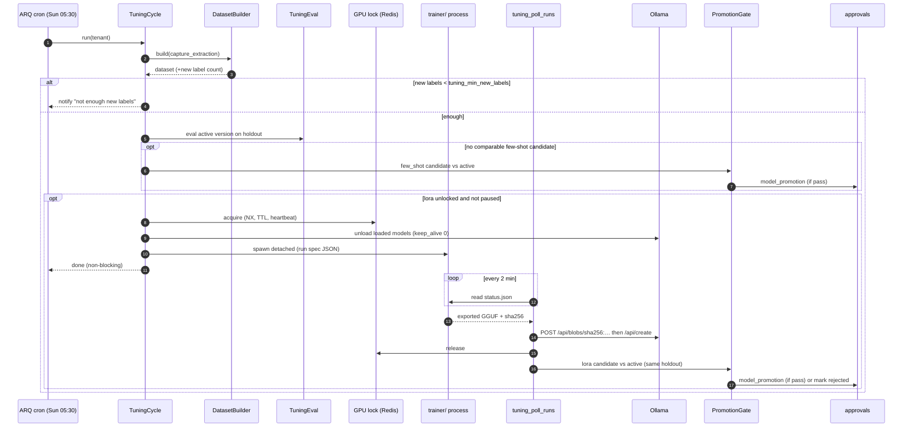

# Personal Model Tuning — Local Models That Learn From Your Corrections

> **Status: Spec'd, not built.** Drafted 2026-09-15. Nothing described here exists in the code yet; Phase 0 is the first build step.

> **Purpose**: Make Life Graph's local models measurably better at *this user's* recurring jobs — starting with capture extraction — by turning the approve / reject / edit decisions the user already makes into training data, then improving the local model (few-shot first, LoRA fine-tuning second) inside a loop that only promotes a new model when it beats the current one on held-out examples **and** the user approves it.
>
> **Context**: Life Graph runs its automated LLM work on local models (Ollama or LM Studio, OpenAI-compatible endpoint behind `LMStudioClient`). Capture extraction already routes every genuine user capture through an LLM (`extraction/llm.py`, gated by `settings.capture_llm_clean`) and every resulting memory lands `pending` for approval. That approval step is a free, continuous stream of human labels — but today it is thrown away: approve/reject only flips `memories.status`, edits overwrite `content` in place, the raw model output is discarded, and the `corrections` table built for exactly these triples is never written automatically.
>
> **Architecture ref**: `CHARTER.md` (invariants), `docs/design/07_strategic_direction_2026-07.md` ("content agents tuned by correction history, cheap local-model task agents"; "extraction tiers may be progressively replaced by small local models"), `docs/specs/capture-spine.md` (the "you-model" trained on correction triples), `docs/specs/era5-self-improving.md` (prompt optimisation — this spec is its model-weights sibling), `docs/specs/approvals-feed.md`.

> **Key insight**: We are not building an LLM. Pretraining is out of reach and pointless on one GPU. What *is* reachable is a small open-weight model (Qwen3 4B class) adapted to one narrow, high-volume task, using labels the user produces for free as a side effect of reviewing memories. On a narrow task with in-distribution data, a tuned small model plausibly matches a much larger generic one while staying local, private, and fast. "Plausibly" is deliberate — every claim of improvement in this spec is a hypothesis the eval gate must prove per user, per task.

---

## Table of Contents

1. [Scope and Non-Goals](#scope-and-non-goals)
2. [Requirements](#requirements)
3. [Design](#design)
4. [Tasks](#tasks)
5. [Kill Criteria](#kill-criteria)
6. [Open Questions](#open-questions)

---

# Scope and Non-Goals

**In scope (this spec):**

- Task `capture_extraction` — the LLM-first fact extractor in `extraction/llm.py` (`_extract_local`). It is the highest-volume LLM job and the only one with a natural human label today.
- Signal capture, dataset building, a deterministic eval gate, dynamic few-shot, local LoRA training, Ollama registration, approval-gated promotion, rollback, and a weekly automatic cycle.

**Designed for, not built here:**

- A second task, `memory_triage` (predict approve/reject to pre-sort the pending queue). The data model is task-generic so it can follow without schema changes.

**Explicit non-goals:**

1. **No pretraining / "LLM from scratch."** Out of reach on consumer hardware and strictly worse than open weights.
2. **No tuning of chat or reasoning models.** General conversation stays on the best available model (the `claude-cli` persona for user-initiated chat). Tuning targets narrow, repeated, structured jobs.
3. **No cloud in the loop.** Training data, adapters, eval, and judging stay on the host. No cloud model is ever used as a judge for personal data, and `claude-cli` is never used by any part of this feature.
4. **No labelling UI, no new chores.** Labels come only from actions the user already takes (approve, reject, edit). A golden set is optional, never required (Charter non-goal 1: no maintenance tax).
5. **No auto-promotion.** A better candidate becomes an approval, not a deployment (invariant 5, fail-closed). Rollback may be immediate because it only reduces risk.
6. **No cross-tenant training.** Every dataset, adapter, and model version belongs to exactly one tenant (invariant 4). This is also what keeps a future SaaS honest.
7. **Not repairing the Era 5 nightly self-heal.** `self_improving/nightly_cron.py` and `optimizer_service.py` call methods and columns that do not exist (e.g. `EvalSuite.is_active`, `eval_service.run_suite`, `prompt_service.get_active_prompt`). This spec reuses the Era 5 *tables* and `EvalService.run_eval`, and does not depend on the broken loop. Fixing it is a separate issue.

---

# Requirements

## Story 1: Capture the signal the user already produces

As **the user**, I want **my approve, reject, and edit decisions on extracted memories to be kept as training labels** so that **the system can learn from them without me doing any extra work**.

### Acceptance Criteria

- GIVEN a capture goes through LLM extraction WHEN the extractor returns THEN an `extraction_traces` row is written with the exact input text, model tag, prompt hash, raw model output, parsed facts, JSON validity, and latency — whether or not any fact survives dedup
- GIVEN extraction produced facts that were stored as memories WHEN each memory is created THEN `memories.properties.extraction_trace_id` and `properties.extraction_fact_index` link it back to the trace
- GIVEN a pending memory with an `extraction_trace_id` WHEN the user approves it THEN a `corrections` row with `kind='approve'`, `original` = the extracted content, and `context` containing `memory_id`, `extraction_trace_id`, `fact_index`, and actor is written — via an EventBus subscriber, not a call inside the approve handler
- GIVEN the same WHEN the user rejects it THEN a `corrections` row with `kind='reject'` is written
- GIVEN a memory with an `extraction_trace_id` WHEN the user edits its `content` via `PATCH /memories/{id}` THEN `MEMORY_UPDATED` is emitted carrying the content *before* and *after* the change, and a `corrections` row with `kind='edit'`, `original` and `corrected` is written
- GIVEN a memory is edited and later approved WHEN labels are derived THEN the approved target is the *edited* text, not the extracted text
- GIVEN a memory is deleted WHEN the next dataset is built THEN no example uses that memory's label or its trace's input text
- GIVEN `LIFE_GRAPH_TUNING_TRACE_ENABLED=false` WHEN extraction runs THEN no trace is written and ingestion behaves exactly as today
- GIVEN writing a trace or correction fails WHEN ingestion or approval is in progress THEN the user-facing operation still succeeds (the failure is logged, never raised)

---

## Story 2: Know when there is enough data

As **the user**, I want **to see how much usable training data exists and what it unlocks** so that **I know whether the system can learn anything yet**.

### Acceptance Criteria

- GIVEN I call `GET /api/v1/tuning/status?task_type=capture_extraction` WHEN data exists THEN I see: total traces, *resolved* traces (every linked memory approved or rejected), pending traces, approved / rejected / edited fact counts, empty-target traces (all facts rejected), and the date range covered
- GIVEN the counts WHEN thresholds are evaluated THEN the response states which stages are unlocked: `baseline_eval` (≥ `tuning_min_holdout` holdout cases), `few_shot` (≥ 100 resolved traces), `lora` (≥ `tuning_min_train` training examples)
- GIVEN an active model version exists WHEN I view status THEN I see its runtime tag, method, activation date, and headline holdout metrics
- GIVEN the dashboard Settings page WHEN I open "Personal models" THEN the same summary is shown read-only, with no required actions

---

## Story 3: A reproducible dataset snapshot

As **the system**, I want **to build immutable, tenant-scoped dataset snapshots with a stable train/holdout split** so that **every eval and training run is reproducible and the holdout never leaks into training**.

### Acceptance Criteria

- GIVEN resolved traces WHEN a dataset is built THEN only traces whose every linked memory is `active` or `rejected` are included; traces with any `pending` memory are excluded
- GIVEN a trace WHEN it is first assigned to a split THEN the split is `holdout` if `sha256(trace_id) mod 10 == 0` else `train`, and that assignment never changes across later snapshots
- GIVEN a trace linked to a correction whose `context.exportable` is `false`, or a trace whose capture was deleted WHEN a dataset is built THEN it is excluded
- GIVEN a trace WHEN its example is built THEN the input messages are byte-identical to the production prompt for the trace's prompt hash, and the target is `{"facts": [...]}` containing only approved facts (edited text where edited), preserving `fact_type` and `entities`
- GIVEN every fact of a trace was rejected WHEN its example is built THEN the target is `{"facts": []}` (this teaches selectivity) and the example is counted as `negative`
- GIVEN a dataset is built WHEN it completes THEN a `training_datasets` row records counts, label cutoff time, per-trace split manifest, file location, and a SHA-256 of the JSONL; the JSONL files live under `tuning_artifacts_dir/<tenant_hash>/datasets/<id>/` and never leave the host
- GIVEN two datasets built from the same resolved traces WHEN compared THEN their file hashes are identical

---

## Story 4: Measure before changing anything

As **the user**, I want **the current extraction model measured on my own held-out examples** so that **any later "improvement" is a number, not a feeling**.

### Acceptance Criteria

- GIVEN a dataset with ≥ `tuning_min_holdout` holdout cases WHEN an eval runs against a runtime tag THEN every holdout case is sent through the same message template and client path production uses, and each result records predicted facts, JSON validity, latency, and per-case precision/recall
- GIVEN predicted and expected facts WHEN scored THEN scoring type `fact_set_f1` embeds both sides locally (the configured embedding model via `LMStudioClient.embed_batch`), greedily matches pairs with cosine ≥ `tuning_similarity_threshold`, and computes precision, recall, and F1; an empty prediction against an empty target scores 1.0
- GIVEN a run completes WHEN results are stored THEN `eval_runs.model` records the runtime tag, and run-level metrics include micro-F1, precision, recall, JSON-valid rate, mean facts per case, and p50/p95 latency
- GIVEN the baseline phase WHEN evals run THEN at least the current `lm_extraction_model` and one larger local model are compared, so the headroom for tuning is known before any training
- GIVEN any eval WHEN it runs THEN no case is sent to a cloud model, regardless of `llm_fallback_chain`

---

## Story 5: Cheap improvement first — dynamic few-shot

As **the user**, I want **the extractor to see a few of my own past approved examples that resemble the new input** so that **it copies my style before we spend GPU time training**.

### Acceptance Criteria

- GIVEN a `few_shot` model version is active WHEN a capture is extracted THEN the k (default 3) nearest *training-split* resolved traces by input embedding are inserted as prior user/assistant turns using their approved targets
- GIVEN retrieval WHEN candidates are selected THEN only the current tenant's traces are eligible, and the capture being extracted is never its own example
- GIVEN a `few_shot` candidate WHEN evaluated THEN retrieval for holdout cases draws only from the training split
- GIVEN a few-shot candidate beats the active version on the promotion gate WHEN the gate passes THEN it is proposed for approval exactly like a LoRA candidate (Story 8)

---

## Story 6: Train a personal LoRA locally

As **the user**, I want **a LoRA adapter trained on my examples on my own GPU** so that **extraction reflects how I think without any data leaving the machine**.

### Acceptance Criteria

- GIVEN a dataset with ≥ `tuning_min_train` training examples WHEN a `lora` training run is requested THEN a `training_runs` row is created `queued` and the run starts only when the GPU lock is free
- GIVEN a run starts WHEN the GPU is prepared THEN all models currently loaded in the local runtime are unloaded first (Ollama `keep_alive: 0`) so training has the VRAM
- GIVEN training WHEN it executes THEN it runs in a **separate trainer process and virtualenv** (`trainer/`), not inside the API or the ARQ worker, so the ARQ `job_timeout` and the app's dependency set are unaffected
- GIVEN training WHEN loss is computed THEN only assistant-target tokens contribute (responses-only training), and the chat template matches the one the runtime uses at inference (Qwen3: thinking disabled)
- GIVEN training finishes WHEN artifacts are produced THEN the adapter is merged, exported to GGUF (default `q4_k_m`), registered with the local Ollama as `lg-<tenant_hash>-<task>:v<N>` with the base model's template and stop parameters, and a `model_versions` row is created `candidate`
- GIVEN the trainer process crashes, is killed, or exceeds `tuning_max_train_minutes` WHEN the poller next runs THEN the run is marked `failed` with the last log lines, the GPU lock is released, and no model version is created
- GIVEN I call `POST /api/v1/tuning/runs/{id}/cancel` WHEN the run is active THEN the trainer is terminated and the run is `cancelled`

---

## Story 7: A gate that says no by default

As **the user**, I want **a new model proposed only when it is clearly better on data it has never seen** so that **I never swap a working model for a lucky one**.

### Acceptance Criteria

- GIVEN a candidate WHEN the gate evaluates THEN candidate and active are evaluated on the **same frozen holdout** in the same session
- GIVEN results WHEN the gate decides THEN it passes only if **all** hold: holdout size ≥ `tuning_min_holdout`; candidate micro-F1 ≥ active micro-F1 + `tuning_promotion_min_f1_gain` (absolute); candidate JSON-valid rate ≥ 0.99; candidate precision does not drop by more than 0.02; candidate p95 latency ≤ active p95 × `tuning_max_latency_ratio`
- GIVEN any condition fails WHEN the gate decides THEN the candidate is marked `rejected` with the failing conditions recorded in `metrics.gate`, and nothing is proposed
- GIVEN the gate cannot run (eval errors, embedding backend down, holdout too small) WHEN deciding THEN the outcome is `could_not_check`, which is treated as a failure, never as a pass

---

## Story 8: Promotion needs a human; rollback does not

As **the user**, I want **to approve a model swap from the same approvals feed I already use** so that **nothing changes behind my back, and I can undo it instantly**.

### Acceptance Criteria

- GIVEN a candidate passes the gate WHEN it is proposed THEN an `approvals` row is created with `kind='model_promotion'`, `source='tuning'`, `source_ref=<model_version_id>`, and a payload with task, method, active vs candidate metrics, dataset size, and training duration; `MODEL_VERSION_PROPOSED` is emitted
- GIVEN the approvals feed WHEN I view the item THEN I see the metric deltas in plain words (e.g. "F1 0.71 → 0.79 on 142 held-out captures, p95 1.9s → 1.7s")
- GIVEN I approve WHEN `APPROVAL_RESOLVED` is handled THEN the candidate becomes `active`, the previous active becomes `retired`, the router cache is invalidated, and `MODEL_VERSION_ACTIVATED` is emitted — the tuning subscriber applies this, not `ApprovalService`
- GIVEN I reject WHEN resolved THEN the candidate becomes `rejected` and is removed from the runtime after `tuning_candidate_retention_days`
- GIVEN an active tuned version WHEN I call `POST /api/v1/tuning/models/{id}/rollback` THEN the most recently retired version (or the config default when none) becomes active immediately without an approval, and `MODEL_VERSION_ROLLED_BACK` is emitted
- GIVEN `LIFE_GRAPH_TUNING_ROUTING_ENABLED=false` WHEN extraction runs THEN the router ignores all model versions and uses `settings.lm_extraction_model` (kill switch)

---

## Story 9: The loop runs itself

As **the user**, I want **the whole cycle to run automatically in the background** so that **the model keeps improving while I just use the app**.

### Acceptance Criteria

- GIVEN `LIFE_GRAPH_TUNING_ENABLED=true` WHEN the weekly cycle fires THEN it builds a dataset, and continues only if ≥ `tuning_min_new_labels` resolved traces arrived since the last cycle's cutoff
- GIVEN enough new labels WHEN the cycle continues THEN it evaluates the active version, tries `few_shot` if no few-shot candidate has been evaluated on a comparable dataset, and tries `lora` only if the `lora` stage is unlocked
- GIVEN a candidate WHEN it is produced THEN it goes through Story 7's gate and, if passed, Story 8's approval — the cycle never activates anything itself
- GIVEN three consecutive cycles with no gate pass WHEN the third ends THEN automatic LoRA attempts pause, a notification explains why, and only a manual run or a config change resumes them
- GIVEN the cycle WHEN it runs THEN it writes one summary notification ("Checked 212 new labels. Candidate v3 did not beat v2 (+0.4 F1, needed +2.0). Nothing to approve.")
- GIVEN `LIFE_GRAPH_TUNING_ENABLED=false` (the default) WHEN the schedule fires THEN nothing runs; trace capture (Phase 0) is controlled separately

---

# Design

## Architecture Overview

```mermaid
flowchart LR
    subgraph Capture["Existing capture path"]
        IN[Capture text] --> EXT[LLMExtractor._extract_local]
        EXT -->|facts| MM[MemoryManager.ingest]
        MM --> MEM[(memories\npending)]
    end

    EXT -. EXTRACTION_TRACED .-> TR[(extraction_traces)]
    MM -. properties.extraction_trace_id .-> MEM

    MEM -->|approve / reject / edit| EV{{MEMORY_APPROVED\nMEMORY_REJECTED\nMEMORY_UPDATED}}
    EV --> CS[CorrectionSubscriber]
    CS --> CO[(corrections)]

    subgraph Loop["Tuning loop (tenant-scoped, local only)"]
        DS[DatasetBuilder] --> SNAP[(training_datasets\n+ JSONL on disk)]
        SNAP --> EVAL[TuningEval\nfact_set_f1]
        SNAP --> FS[Few-shot candidate]
        SNAP --> TRN[trainer/ process\nUnsloth LoRA → GGUF]
        TRN --> OLL[Ollama /api/create]
        OLL --> MV[(model_versions\ncandidate)]
        FS --> MV
        MV --> GATE{Promotion gate}
        EVAL --> GATE
    end

    TR --> DS
    CO --> DS
    GATE -->|pass| AP[(approvals\nmodel_promotion)]
    GATE -->|fail / could_not_check| REJ[candidate rejected]
    AP -->|APPROVAL_RESOLVED approved| ACT[activate + retire previous]
    ACT --> RT[TaskModelRouter]
    RT --> EXT
```

### Key Design Decisions

1. **Extraction first, because the label is free.** Every LLM-extracted fact becomes a pending memory the user already reviews. No other LLM job has a comparable built-in human signal. Synthesis, briefs, and chat have no ground truth; importance scoring and contradiction detection are deterministic by charter and stay that way.
2. **Few-shot before fine-tuning.** Retrieval of the user's own approved examples is cheap, instantly reversible, needs ~100 examples instead of ~500, and often captures much of the style gain. LoRA must beat few-shot, not just the untuned base, to be worth its operational cost.
3. **Deterministic, local scoring.** `fact_set_f1` uses embeddings plus a threshold, not an LLM judge. Consistent with invariant 1, reproducible, free, and it keeps personal data off cloud judges. (`eval_scorer.py`'s `llm_judge` is a stub anyway, and its `semantic_similarity` depends on sentence-transformers, which the `local-nlp` extra may not install.)
4. **Separate trainer process and virtualenv.** Unsloth, TRL, PEFT, and a CUDA-matched PyTorch are heavy and version-sensitive (Blackwell GPUs need CUDA 12.8+ builds). Isolating them in `trainer/` keeps the app's `uv.lock` clean, keeps the ARQ worker's `job_timeout=600` meaningful, and lets training crash without taking the API down.
5. **Merge and export GGUF instead of runtime adapters.** Ollama's `ADAPTER` support varies by architecture; a merged GGUF works for any base the runtime can already serve and is a single immutable artifact to hash, register, and delete.
6. **New tables rather than bending `optimization_runs`.** `optimization_runs` is shaped around DSPy prompt candidates (`candidate_version_id` → `prompt_versions`) and its service is broken. Model versions, datasets, and training runs have different lifecycles; forcing them into that table would couple this feature to code that does not work.
7. **Reuse where it is sound.** `eval_suites` / `eval_cases` / `eval_runs` / `eval_results` and `EvalService.run_eval(llm_fn=...)` hold holdout cases and results; the `approvals` feed and its Telegram commands carry promotion; `corrections` stores labels; the EventBus wires everything.
8. **Event-driven label capture.** The approve/reject/edit handlers only emit events (edit gains one it lacks today). A `CorrectionSubscriber` writes `corrections`. The handlers never learn that tuning exists (invariant 3).
9. **Tenant hash in runtime tags.** Tags are `lg-<first 10 hex of sha256(tenant_id)>-<task>:v<N>`, so a model list never exposes tenant names, while artifacts stay attributable.
10. **Honest about label noise.** A reject can mean "false", "not worth keeping", or "duplicate". All three mean "don't extract this", which is exactly the selectivity the charter wants from encoding. Recall is under-measured because the user rarely adds facts the model missed; precision and selectivity are the primary targets, and the spec says so.

---

## Data Models

### New tables (one migration: `038_personal_model_tuning`)

```sql
-- ============================================================
-- Raw LLM I/O for tuned tasks. The input text is the only copy
-- of the full capture for non-/capture paths (memories.reasoning
-- keeps just 500 chars), so this table is personal data: local,
-- tenant-scoped, retention-limited.
-- ============================================================
CREATE TABLE life_graph.extraction_traces (
  id                UUID PRIMARY KEY DEFAULT gen_random_uuid(),
  tenant_id         TEXT NOT NULL,
  task_type         TEXT NOT NULL DEFAULT 'capture_extraction',
  model             TEXT NOT NULL,            -- runtime tag actually called
  model_version_id  UUID,                     -- null = config default model
  prompt_hash       TEXT NOT NULL,            -- sha256 of system prompt + template + schema
  input_text        TEXT NOT NULL,
  input_embedding   VECTOR(1024),             -- settings.embedding_dimension; filled lazily for few-shot
  raw_output        TEXT,
  parsed_output     JSONB,                    -- {"facts": [...]} as parsed, pre-dedup
  json_valid        BOOLEAN NOT NULL,
  fact_count        INT NOT NULL DEFAULT 0,
  latency_ms        INT,
  split             TEXT CHECK (split IN ('train', 'holdout')),  -- assigned on first dataset build, never changed
  properties        JSONB NOT NULL DEFAULT '{}',                 -- surface, capture_event_id, source
  created_at        TIMESTAMPTZ NOT NULL DEFAULT now()
);
CREATE INDEX ix_extraction_traces_tenant_created ON life_graph.extraction_traces (tenant_id, created_at DESC);
CREATE INDEX ix_extraction_traces_tenant_task_split ON life_graph.extraction_traces (tenant_id, task_type, split);

-- ============================================================
-- Immutable dataset snapshots.
-- ============================================================
CREATE TABLE life_graph.training_datasets (
  id                UUID PRIMARY KEY DEFAULT gen_random_uuid(),
  tenant_id         TEXT NOT NULL,
  task_type         TEXT NOT NULL,
  label_cutoff_at   TIMESTAMPTZ NOT NULL,     -- corrections after this are not in the snapshot
  train_count       INT NOT NULL,
  holdout_count     INT NOT NULL,
  negative_count    INT NOT NULL,             -- examples with an empty target
  edited_count      INT NOT NULL,
  prompt_hash       TEXT NOT NULL,            -- only traces with this hash are included
  storage_uri       TEXT NOT NULL,            -- file:// path under tuning_artifacts_dir
  sha256            TEXT NOT NULL,            -- of train.jsonl || holdout.jsonl
  manifest          JSONB NOT NULL,           -- {"train": [trace_id...], "holdout": [...]}
  created_at        TIMESTAMPTZ NOT NULL DEFAULT now()
);
CREATE INDEX ix_training_datasets_tenant_task ON life_graph.training_datasets (tenant_id, task_type, created_at DESC);

-- ============================================================
-- A trainer invocation.
-- ============================================================
CREATE TABLE life_graph.training_runs (
  id                UUID PRIMARY KEY DEFAULT gen_random_uuid(),
  tenant_id         TEXT NOT NULL,
  task_type         TEXT NOT NULL,
  dataset_id        UUID NOT NULL REFERENCES life_graph.training_datasets(id),
  method            TEXT NOT NULL CHECK (method IN ('lora')),
  base_model        TEXT NOT NULL,            -- HF id, e.g. unsloth/Qwen3-4B
  runtime_base      TEXT NOT NULL,            -- runtime tag of the same base, e.g. qwen3:4b
  hyperparams       JSONB NOT NULL,
  status            TEXT NOT NULL DEFAULT 'queued'
                    CHECK (status IN ('queued','running','exporting','registering',
                                      'succeeded','failed','cancelled')),
  trigger           TEXT NOT NULL CHECK (trigger IN ('manual','weekly_cycle')),
  pid               INT,
  work_dir          TEXT,
  log_tail          TEXT,                     -- last ~50 lines, for failures
  train_loss        DOUBLE PRECISION,
  duration_seconds  INT,
  error_message     TEXT,
  started_at        TIMESTAMPTZ,
  finished_at       TIMESTAMPTZ,
  created_at        TIMESTAMPTZ NOT NULL DEFAULT now()
);
CREATE INDEX ix_training_runs_status ON life_graph.training_runs (status) WHERE status IN ('queued','running','exporting','registering');

-- ============================================================
-- What the router can serve for a task.
-- ============================================================
CREATE TABLE life_graph.model_versions (
  id                UUID PRIMARY KEY DEFAULT gen_random_uuid(),
  tenant_id         TEXT NOT NULL,
  task_type         TEXT NOT NULL,
  version_number    INT NOT NULL,
  method            TEXT NOT NULL CHECK (method IN ('baseline','few_shot','lora')),
  runtime_tag       TEXT NOT NULL,            -- what LMStudioClient.chat(model=...) receives
  config            JSONB NOT NULL DEFAULT '{}',  -- few_shot: {"k": 3}; lora: {"gguf_sha256": ..., "quant": "q4_k_m"}
  status            TEXT NOT NULL DEFAULT 'candidate'
                    CHECK (status IN ('candidate','active','retired','rejected')),
  dataset_id        UUID REFERENCES life_graph.training_datasets(id),
  training_run_id   UUID REFERENCES life_graph.training_runs(id),
  eval_run_id       UUID,                     -- self_improving eval_runs.id of the gate eval
  metrics           JSONB NOT NULL DEFAULT '{}',  -- {"holdout": {...}, "active_at_gate": {...}, "gate": {...}}
  approval_id       UUID,
  activated_at      TIMESTAMPTZ,
  retired_at        TIMESTAMPTZ,
  created_at        TIMESTAMPTZ NOT NULL DEFAULT now(),
  UNIQUE (tenant_id, task_type, version_number)
);
CREATE UNIQUE INDEX ux_model_versions_one_active
  ON life_graph.model_versions (tenant_id, task_type) WHERE status = 'active';
```

### Changes to existing tables (same migration)

```sql
-- The Era 5 eval tables live in the default schema (self_improving/models.py).

-- Record which model an eval run exercised (today nothing does).
ALTER TABLE eval_runs ADD COLUMN model TEXT;

-- Allow the tuning gate as a trigger.
ALTER TABLE eval_runs DROP CONSTRAINT ck_eval_runs_trigger;
ALTER TABLE eval_runs ADD CONSTRAINT ck_eval_runs_trigger CHECK (
  trigger IN ('manual','nightly_cron','optimization_test','regression_check','tuning_gate')
);

-- Allow the new deterministic scorer.
ALTER TABLE eval_cases DROP CONSTRAINT ck_eval_cases_scoring_type;
ALTER TABLE eval_cases ADD CONSTRAINT ck_eval_cases_scoring_type CHECK (
  scoring_type IN ('exact_match','contains','regex','semantic_similarity','llm_judge','fact_set_f1')
);
```

Mirror both constraint changes in the `CheckConstraint(...)` declarations in `self_improving/models.py`.

No change to `memories` or `corrections` columns: links live in `memories.properties` (`extraction_trace_id`, `extraction_fact_index`) and `corrections.context`, per the schema-less invariant. Verify during the migration task that `corrections.capture_event_id` is nullable; if not, make it nullable, since traces from `/memories` have no capture event.

### Label derivation rules

| Memory outcome (per extracted fact) | Contribution to the trace's target |
|---|---|
| Approved, never edited | fact included as extracted |
| Edited, then approved | fact included with the **latest edited** content |
| Rejected (edited or not) | fact excluded |
| Still pending | trace is **unresolved** and excluded from datasets |
| Not stored (exact/semantic duplicate of an existing memory) | fact excluded, trace still usable; counted in `properties.dedup_dropped` |
| Memory deleted | trace excluded entirely |

A trace is usable only when all of its stored facts are resolved. A trace whose every fact was rejected yields target `{"facts": []}`.

---

## Configuration (`life_graph/config.py`)

```python
    # ── Personal model tuning ─────────────────────────────
    tuning_trace_enabled: bool = True
    """Phase 0: record extraction I/O and correction labels. Cheap, local, and the
    prerequisite for everything else; independent of tuning_enabled."""
    tuning_enabled: bool = False
    """Master switch for dataset builds, evals, training, and the weekly cycle."""
    tuning_routing_enabled: bool = True
    """Kill switch: false makes TaskModelRouter ignore model_versions entirely."""
    tuning_artifacts_dir: str = "~/.local/share/life-graph/tuning"
    tuning_trainer_python: str = "trainer/.venv/bin/python"
    tuning_runtime_url: str = "http://localhost:11434"   # Ollama native API (create/blobs/ps)
    tuning_base_models: str = '{"qwen3:4b": "unsloth/Qwen3-4B", "qwen3:8b": "unsloth/Qwen3-8B"}'
    tuning_default_base: str = "qwen3:4b"
    tuning_similarity_threshold: float = 0.85
    tuning_min_holdout: int = 50
    tuning_min_train: int = 500
    tuning_min_new_labels: int = 200
    tuning_promotion_min_f1_gain: float = 0.02
    tuning_max_latency_ratio: float = 1.5
    tuning_max_train_minutes: int = 120
    tuning_few_shot_k: int = 3
    tuning_trace_retention_days: int = 365
    tuning_candidate_retention_days: int = 14
    tuning_max_failed_cycles: int = 3
```

---

## Events (`core/events.py`)

| Event | Value | Payload |
|---|---|---|
| `EXTRACTION_TRACED` | `tuning:extraction:traced` | `{trace_id, tenant_id, task_type, model, prompt_hash, input_text, raw_output, parsed_output, json_valid, fact_count, latency_ms}` |
| `MEMORY_UPDATED` *(exists, never emitted)* | `memory:updated` | `{id, tenant_id, changed_fields, content_before, content_after}` |
| `TUNING_DATASET_BUILT` | `tuning:dataset:built` | `{dataset_id, tenant_id, task_type, train_count, holdout_count}` |
| `TUNING_RUN_FINISHED` | `tuning:run:finished` | `{run_id, tenant_id, status, model_version_id?}` |
| `MODEL_VERSION_PROPOSED` | `tuning:model:proposed` | `{model_version_id, tenant_id, task_type, approval_id, metrics}` |
| `MODEL_VERSION_ACTIVATED` | `tuning:model:activated` | `{model_version_id, tenant_id, task_type, previous_id}` |
| `MODEL_VERSION_ROLLED_BACK` | `tuning:model:rolled_back` | `{from_id, to_id, tenant_id, task_type}` |

`EXTRACTION_TRACED` carries personal text. It must **not** be forwarded to webhooks or the Redis cross-instance bridge. Mark it local-only in the bridge's allowlist/denylist (verify which mechanism `core/events.py` uses) and add a test.

---

## Scheduled Jobs (`workers/settings.py`)

| Job | Schedule | Timeout | Purpose |
|---|---|---|---|
| `tuning_poll_runs` | every 2 min | 60 s | Advance `training_runs` from the trainer's status file; enforce `tuning_max_train_minutes`; release GPU lock; register models |
| `tuning_weekly_cycle` | Sun 05:30 UTC | 600 s | Story 9. Only enqueues work; never trains in-process |
| `tuning_trace_retention` | daily 04:45 UTC | 300 s | Delete traces older than `tuning_trace_retention_days` that are not referenced by an active or candidate dataset |

05:30 on Sunday avoids the existing 01:00–05:00 nightly slots.

---

## API Contracts

Router: `life_graph/tuning/api.py`, prefix `/api/v1/tuning`, tag `tuning`. All endpoints are tenant-scoped by `X-Tenant-ID`. Every endpoint except `GET /status` returns `409 TUNING_DISABLED` when `tuning_enabled` is false.

### GET `/api/v1/tuning/status?task_type=capture_extraction`

```json
{
  "data": {
    "task_type": "capture_extraction",
    "trace_enabled": true,
    "tuning_enabled": false,
    "traces": { "total": 612, "resolved": 540, "pending": 72, "first_at": "2026-09-16T08:02:11Z", "last_at": "2027-01-10T19:44:03Z" },
    "labels": { "approved_facts": 811, "rejected_facts": 297, "edited_facts": 64, "empty_target_traces": 41 },
    "split": { "train": 486, "holdout": 54 },
    "unlocked": { "baseline_eval": true, "few_shot": true, "lora": false },
    "needed_for_next": { "stage": "lora", "train_examples_missing": 14 },
    "active_model": {
      "model_version_id": "5b0c…",
      "method": "few_shot",
      "runtime_tag": "qwen3:4b",
      "activated_at": "2026-12-02T06:10:00Z",
      "holdout": { "f1": 0.74, "precision": 0.81, "recall": 0.69, "json_valid": 1.0, "p95_ms": 1830 }
    },
    "auto_lora_paused": false
  }
}
```

### POST `/api/v1/tuning/datasets`

Request `{ "task_type": "capture_extraction" }` → `201`

```json
{
  "data": {
    "id": "d7e1…", "task_type": "capture_extraction",
    "train_count": 486, "holdout_count": 54, "negative_count": 37, "edited_count": 58,
    "label_cutoff_at": "2027-01-10T19:44:03Z", "prompt_hash": "9f2c…", "sha256": "41aa…"
  }
}
```

`422 INSUFFICIENT_DATA` if `holdout_count < tuning_min_holdout`, with counts in `error.details`.

### POST `/api/v1/tuning/evals`

Request:

```json
{ "task_type": "capture_extraction", "dataset_id": "d7e1…", "targets": ["qwen3:4b", "qwen3:14b", {"model_version_id": "5b0c…"}] }
```

`202` with `{ "eval_run_ids": ["…", "…", "…"] }`. Each target runs over the holdout via `EvalService.run_eval` with a tuning `llm_fn`; results live in `eval_runs` / `eval_results`.

### GET `/api/v1/tuning/evals/{eval_run_id}`

```json
{
  "data": {
    "eval_run_id": "…", "model": "qwen3:14b", "status": "completed", "cases": 54,
    "metrics": { "f1": 0.77, "precision": 0.80, "recall": 0.74, "json_valid": 1.0, "mean_facts": 1.9, "p50_ms": 2400, "p95_ms": 5100 },
    "worst_cases": [ { "case_id": "…", "f1": 0.0, "expected": 2, "predicted": 4 } ]
  }
}
```

### POST `/api/v1/tuning/runs`

Request:

```json
{ "task_type": "capture_extraction", "method": "lora", "dataset_id": "d7e1…",
  "runtime_base": "qwen3:4b",
  "hyperparams": { "lora_r": 16, "lora_alpha": 16, "epochs": 2, "lr": 0.0002, "max_seq_len": 2048 } }
```

`202` `{ "data": { "run_id": "…", "status": "queued" } }`. For `method: "few_shot"` there is no trainer: the API creates a `few_shot` candidate `model_versions` row and runs the gate directly (response `{"model_version_id": …}`).

`409 GPU_BUSY` if another run holds the lock and `queue=false` was passed; otherwise the run is queued.

### GET `/api/v1/tuning/runs/{run_id}` · POST `/api/v1/tuning/runs/{run_id}/cancel`

```json
{ "data": { "run_id": "…", "status": "running", "stage": "train", "progress": 0.42, "train_loss": 0.61, "elapsed_seconds": 780 } }
```

### GET `/api/v1/tuning/models?task_type=capture_extraction`

Lists model versions newest first, with `status`, `method`, `runtime_tag`, `metrics.holdout`, `activated_at`.

### POST `/api/v1/tuning/models/{model_version_id}/rollback`

`200` `{ "data": { "active": { "model_version_id": "…", "runtime_tag": "qwen3:4b" }, "rolled_back_from": "…" } }`. Only valid on the currently active version.

---

## Sequence — Weekly Cycle



---

## Core Python Implementation

### Module layout

```
life_graph/tuning/
  __init__.py
  models.py          # ExtractionTrace, TrainingDataset, TrainingRun, ModelVersion (mapped_column style)
  schemas.py
  api.py             # router, registered in main.py
  traces.py          # TraceSubscriber (EXTRACTION_TRACED → row)
  corrections.py     # CorrectionSubscriber (MEMORY_APPROVED/REJECTED/UPDATED → corrections)
  labels.py          # label derivation (pure functions, unit-tested)
  datasets.py        # DatasetBuilder
  scoring.py         # fact_set_f1
  evals.py           # TuningEval (wraps EvalService.run_eval)
  router.py          # TaskModelRouter (+ few-shot message assembly)
  gate.py            # PromotionGate
  promotion.py       # propose / APPROVAL_RESOLVED subscriber / rollback
  runtime.py         # Ollama client: ps, unload, blobs, create, delete
  gpu_lock.py        # Redis lock with heartbeat
  cycle.py           # TuningCycle (weekly) + poll_runs
trainer/
  pyproject.toml     # unsloth, trl, peft, torch (CUDA-matched) — separate venv
  lg_trainer/__main__.py
```

### Recording the trace (`extraction/llm.py`, `_extract_local`)

```python
        t0 = time.monotonic()
        model = await get_task_model_router().resolve(tenant_id=get_current_tenant_id(),
                                                      task_type="capture_extraction")
        messages = model.build_messages(base_messages)  # inserts few-shot turns when configured
        try:
            raw_content = await self._lm_client.chat(
                messages=messages,
                model=model.runtime_tag,
                temperature=0.1,
                max_tokens=self._max_tokens,
                response_format={"type": "json_object"},
            )
        except Exception:
            logger.exception("Local LLM extraction failed")
            return []
        latency_ms = int((time.monotonic() - t0) * 1000)

        data, json_valid = _safe_json(raw_content)
        facts = _facts_from(data, text)            # existing parsing, unchanged
        trace_id = uuid.uuid4()
        if settings.tuning_trace_enabled:
            await _emit_trace(trace_id, model, text, raw_content, data, json_valid, len(facts), latency_ms)
        for index, fact in enumerate(facts):
            fact.trace_id, fact.trace_index = trace_id, index   # new optional fields on ExtractedFact
        return facts
```

`MemoryManager._process_fact` copies `fact.trace_id` / `fact.trace_index` into `properties["extraction_trace_id"]` / `properties["extraction_fact_index"]` next to the existing `fact_type` / `extraction_confidence` (`core/memory_manager.py`, Step 6). `_emit_trace` swallows and logs every exception.

`PROMPT_HASH` is computed once at import: `sha256(_SYSTEM_PROMPT + USER_TEMPLATE + json.dumps(_EXTRACTION_SCHEMA, sort_keys=True))`. Changing the prompt changes the hash, and datasets only mix traces with the same hash.

### Correction subscriber (`tuning/corrections.py`)

```python
class CorrectionSubscriber:
    """Turn memory review events into ``corrections`` rows for tuned tasks.

    Only memories that carry ``properties.extraction_trace_id`` produce a row;
    everything else is ignored, so ordinary memories are unaffected.
    """

    def subscribe(self, bus: EventBus) -> None:
        bus.subscribe(EventType.MEMORY_APPROVED, self._on_decision("approve"))
        bus.subscribe(EventType.MEMORY_REJECTED, self._on_decision("reject"))
        bus.subscribe(EventType.MEMORY_UPDATED, self._on_updated)

    def _on_decision(self, kind: str):
        async def handler(event: Event) -> None:
            memory = await self._load(event.payload["tenant_id"], event.payload["id"])
            if memory is None or "extraction_trace_id" not in (memory.properties or {}):
                return
            await self._write(memory, kind=kind, original=memory.content, corrected=None)
        return handler

    async def _on_updated(self, event: Event) -> None:
        payload = event.payload
        if "content" not in payload.get("changed_fields", []):
            return
        memory = await self._load(payload["tenant_id"], payload["id"])
        if memory is None or "extraction_trace_id" not in (memory.properties or {}):
            return
        await self._write(memory, kind="edit",
                          original=payload["content_before"], corrected=payload["content_after"])

    async def _write(self, memory: Memory, *, kind: str, original: str, corrected: str | None) -> None:
        props = memory.properties or {}
        try:
            async with async_session() as session:
                session.add(Correction(
                    tenant_id=memory.tenant_id,
                    kind=kind,
                    original=original,
                    corrected=corrected,
                    context={
                        "memory_id": str(memory.id),
                        "extraction_trace_id": props["extraction_trace_id"],
                        "fact_index": props.get("extraction_fact_index"),
                        "actor": get_current_user_id() or "user",
                        "task_type": "capture_extraction",
                    },
                    domain_tags=list(memory.tags or []),
                ))
                await session.commit()
        except Exception:
            logger.warning("Failed to record %s correction for %s", kind, memory.id, exc_info=True)
```

`PATCH /memories/{id}` reads the row before `store.update` and emits `MEMORY_UPDATED` with `content_before` / `content_after` only when content actually changed.

### Label derivation (`tuning/labels.py`)

```python
@dataclass(frozen=True)
class FactOutcome:
    index: int
    status: Literal["active", "rejected", "pending", "deleted", "not_stored"]
    extracted: dict[str, Any]        # {"content", "fact_type", "entities", ...} from parsed_output
    latest_content: str | None       # current memories.content (reflects edits)


def derive_target(outcomes: list[FactOutcome]) -> dict[str, Any] | None:
    """Return the training target for one trace, or None if it is unusable.

    Unusable: any stored fact still pending, or any linked memory deleted.
    """
    if any(o.status in ("pending", "deleted") for o in outcomes):
        return None
    facts = [
        {**o.extracted, "content": o.latest_content or o.extracted["content"]}
        for o in sorted(outcomes, key=lambda o: o.index)
        if o.status == "active"
    ]
    return {"facts": facts}


def assign_split(trace_id: uuid.UUID) -> Literal["train", "holdout"]:
    """Stable 90/10 split. Callers persist the result on first assignment."""
    return "holdout" if int(hashlib.sha256(trace_id.bytes).hexdigest(), 16) % 10 == 0 else "train"
```

### Scoring (`tuning/scoring.py`)

```python
async def fact_set_f1(
    predicted: list[str],
    expected: list[str],
    embed: Callable[[list[str]], Awaitable[list[list[float]]]],
    threshold: float,
) -> dict[str, float]:
    """Greedy one-to-one matching of predicted to expected facts by cosine similarity."""
    if not predicted and not expected:
        return {"precision": 1.0, "recall": 1.0, "f1": 1.0, "tp": 0}
    if not predicted or not expected:
        return {"precision": 0.0 if predicted else 1.0,
                "recall": 0.0 if expected else 1.0, "f1": 0.0, "tp": 0}

    vectors = await embed(predicted + expected)
    p_vecs, e_vecs = _normalise(vectors[: len(predicted)]), _normalise(vectors[len(predicted):])
    pairs = sorted(
        ((float(np.dot(p, e)), i, j) for i, p in enumerate(p_vecs) for j, e in enumerate(e_vecs)),
        reverse=True,
    )
    used_p: set[int] = set()
    used_e: set[int] = set()
    tp = 0
    for sim, i, j in pairs:
        if sim < threshold:
            break
        if i in used_p or j in used_e:
            continue
        used_p.add(i)
        used_e.add(j)
        tp += 1
    precision, recall = tp / len(predicted), tp / len(expected)
    f1 = 0.0 if tp == 0 else 2 * precision * recall / (precision + recall)
    return {"precision": precision, "recall": recall, "f1": f1, "tp": tp}
```

Run-level metrics are **micro-averaged** (sum TP, predicted, expected over all cases), so captures with many facts are not drowned out by captures with none.

### Router (`tuning/router.py`)

```python
@dataclass(frozen=True)
class TaskModel:
    runtime_tag: str
    model_version_id: uuid.UUID | None
    few_shot: list[tuple[str, dict[str, Any]]]   # (input_text, target) pairs, already retrieved

    def build_messages(self, base: list[dict[str, str]]) -> list[dict[str, str]]:
        """Insert few-shot turns between the system prompt and the real request."""
        if not self.few_shot:
            return base
        shots: list[dict[str, str]] = []
        for text, target in self.few_shot:
            shots.append({"role": "user", "content": render_user_turn(text)})
            shots.append({"role": "assistant", "content": json.dumps(target, ensure_ascii=False)})
        return [base[0], *shots, *base[1:]]


class TaskModelRouter:
    """Resolve the model for (tenant, task). Cached per tenant/task for 60 s.

    Fallback order: kill switch → active model_version → settings default.
    Never raises: any lookup failure returns the settings default.
    """

    async def resolve(self, *, tenant_id: str, task_type: str, input_text: str | None = None) -> TaskModel:
        default = TaskModel(settings.lm_extraction_model, None, [])
        if not settings.tuning_routing_enabled:
            return default
        try:
            version = await self._active_version(tenant_id, task_type)   # cached
            if version is None:
                return default
            shots: list[tuple[str, dict[str, Any]]] = []
            k = int(version.config.get("k", 0)) if version.method == "few_shot" else 0
            if k and input_text:
                shots = await self._nearest_train_examples(tenant_id, task_type, input_text, k)
            return TaskModel(version.runtime_tag, version.id, shots)
        except Exception:
            logger.warning("TaskModelRouter fell back to default", exc_info=True)
            return default

    def invalidate(self, tenant_id: str, task_type: str) -> None:
        self._cache.pop((tenant_id, task_type), None)
```

### Promotion gate (`tuning/gate.py`)

```python
@dataclass(frozen=True)
class GateResult:
    outcome: Literal["pass", "fail", "could_not_check"]
    reasons: list[str]
    candidate: dict[str, float]
    active: dict[str, float]


def decide(candidate: dict[str, float] | None, active: dict[str, float] | None, holdout_n: int) -> GateResult:
    """Fail-closed: anything missing or errored is could_not_check, never pass."""
    if candidate is None or active is None:
        return GateResult("could_not_check", ["eval did not complete"], candidate or {}, active or {})
    reasons: list[str] = []
    if holdout_n < settings.tuning_min_holdout:
        reasons.append(f"holdout {holdout_n} < {settings.tuning_min_holdout}")
    if candidate["f1"] < active["f1"] + settings.tuning_promotion_min_f1_gain:
        reasons.append(f"F1 {candidate['f1']:.3f} < {active['f1']:.3f} + {settings.tuning_promotion_min_f1_gain}")
    if candidate["json_valid"] < 0.99:
        reasons.append(f"JSON-valid {candidate['json_valid']:.3f} < 0.99")
    if candidate["precision"] < active["precision"] - 0.02:
        reasons.append(f"precision dropped {active['precision']:.3f} → {candidate['precision']:.3f}")
    if candidate["p95_ms"] > active["p95_ms"] * settings.tuning_max_latency_ratio:
        reasons.append(f"p95 {candidate['p95_ms']}ms > {settings.tuning_max_latency_ratio}× {active['p95_ms']}ms")
    return GateResult("fail" if reasons else "pass", reasons, candidate, active)
```

### Trainer (`trainer/lg_trainer/__main__.py`)

Invoked as `trainer/.venv/bin/python -m lg_trainer --spec <work_dir>/spec.json`. It writes `<work_dir>/status.json` (`{"stage", "progress", "train_loss", "error", "gguf_path", "gguf_sha256"}`) atomically after every stage and every N steps, and appends to `<work_dir>/train.log`. The poller never trusts a PID alone: a dead PID with a non-terminal status means `failed`.

```python
def main(spec: RunSpec) -> None:
    status = StatusWriter(spec.work_dir)
    status.stage("load")
    model, tokenizer = FastLanguageModel.from_pretrained(
        model_name=spec.base_model, max_seq_length=spec.max_seq_len, load_in_4bit=True,
    )
    model = FastLanguageModel.get_peft_model(
        model, r=spec.lora_r, lora_alpha=spec.lora_alpha, lora_dropout=0.0,
        target_modules=["q_proj", "k_proj", "v_proj", "o_proj", "gate_proj", "up_proj", "down_proj"],
        use_gradient_checkpointing="unsloth", random_state=spec.seed,
    )

    status.stage("data")
    dataset = load_jsonl(spec.train_path).map(
        lambda ex: {"text": tokenizer.apply_chat_template(
            ex["messages"], tokenize=False, enable_thinking=False)}   # must match inference template
    )

    status.stage("train")
    trainer = SFTTrainer(
        model=model, tokenizer=tokenizer, train_dataset=dataset,
        args=SFTConfig(
            per_device_train_batch_size=2, gradient_accumulation_steps=4,
            num_train_epochs=spec.epochs, learning_rate=spec.lr, warmup_ratio=0.05,
            lr_scheduler_type="cosine", logging_steps=5, seed=spec.seed,
            output_dir=str(spec.work_dir / "checkpoints"), save_strategy="no", report_to=[],
        ),
        callbacks=[status.callback()],
    )
    trainer = train_on_responses_only(trainer, **response_markers_for(spec.base_model))
    result = trainer.train()
    status.metric("train_loss", result.training_loss)

    status.stage("export")
    model.save_pretrained_gguf(str(spec.work_dir / "gguf"), tokenizer, quantization_method=spec.quant)
    gguf = single_gguf(spec.work_dir / "gguf")
    status.done(gguf_path=str(gguf), gguf_sha256=sha256_file(gguf))
```

The exact Unsloth and TRL call signatures move between releases. Pin versions in `trainer/pyproject.toml`, and treat the above as the shape. Phase 3 task 1 is a smoke run that proves the pinned set works on the target GPU.

### Registering with the runtime (`tuning/runtime.py`)

```python
class OllamaRuntime:
    """Minimal client for the Ollama native API used by tuning (not for inference)."""

    async def loaded_models(self) -> list[str]:
        r = await self._http.get("/api/ps")
        return [m["name"] for m in r.json().get("models", [])]

    async def unload_all(self) -> None:
        for name in await self.loaded_models():
            await self._http.post("/api/generate", json={"model": name, "keep_alive": 0})

    async def register_gguf(self, *, tag: str, gguf_path: Path, sha256: str, like: str) -> None:
        """Upload the blob (works when Ollama runs in a container without a shared mount)
        and create `tag` reusing the base model's template and parameters."""
        digest = f"sha256:{sha256}"
        if (await self._http.head(f"/api/blobs/{digest}")).status_code != 200:
            with gguf_path.open("rb") as fh:
                (await self._http.post(f"/api/blobs/{digest}", content=fh)).raise_for_status()
        base = (await self._http.post("/api/show", json={"model": like})).json()
        (await self._http.post("/api/create", json={
            "model": tag,
            "files": {gguf_path.name: digest},
            "template": base.get("template"),
            "parameters": _parse_parameters(base.get("parameters", "")),
            "stream": False,
        })).raise_for_status()

    async def delete(self, tag: str) -> None:
        await self._http.request("DELETE", "/api/delete", json={"model": tag})
```

Verify request shapes against the installed Ollama version in Phase 3. For LM Studio deployments, `register_gguf` is replaced by copying the GGUF into LM Studio's models directory. Ship it as a second implementation behind the same interface only if needed.

### Applying an approval (`tuning/promotion.py`)

```python
async def on_approval_resolved(event: Event) -> None:
    p = event.payload
    if p.get("kind") != "model_promotion" or p.get("source") != "tuning":
        return
    version_id = uuid.UUID(p["source_ref"])
    async with async_session() as session, session.begin():
        candidate = await session.get(ModelVersion, version_id, with_for_update=True)
        if candidate is None or candidate.status != "candidate" or candidate.tenant_id != p["tenant_id"]:
            return                                   # stale or foreign: do nothing
        if p["status"] != "approved":
            candidate.status = "rejected"
            return
        previous = await _active_for_update(session, candidate.tenant_id, candidate.task_type)
        if previous is not None:
            previous.status, previous.retired_at = "retired", utcnow()
            await session.flush()                    # free the partial unique index first
        candidate.status, candidate.activated_at = "active", utcnow()
    get_task_model_router().invalidate(candidate.tenant_id, candidate.task_type)
    await event_bus.emit(EventType.MODEL_VERSION_ACTIVATED, {
        "model_version_id": str(candidate.id), "tenant_id": candidate.tenant_id,
        "task_type": candidate.task_type, "previous_id": str(previous.id) if previous else None,
    }, source="tuning")
```

Verify that the `APPROVAL_RESOLVED` payload carries `kind`, `source`, `source_ref`, `status`, and `tenant_id`. If it does not, extend the emit in `api/approvals.py` (additive change).

---

## Privacy, Retention, and Forgetting

- **Where data lives:** traces are rows in Postgres, and datasets and GGUF files are on local disk under `tuning_artifacts_dir`. Nothing is uploaded, and none of it touches MinIO buckets that might be replicated off-site, unless the user's backup policy includes that directory. Document this in `docs/OPERATIONS.md`.
- **Opt-out:** a correction with `context.exportable=false` excludes its trace. This reuses the flag the corrections export already honours.
- **Deletion:** deleting a memory excludes its trace from all *future* datasets. A trained adapter cannot unlearn, so deleting a memory that appears in the active LoRA's training manifest flags that version in `/tuning/status` (`contains_deleted_examples: true`). The next cycle then retrains without it. For immediate removal, the user can roll back to a version that predates it.
- **Retention:** traces are deleted after `tuning_trace_retention_days` unless an active or candidate model's dataset references them.
- **Cloud isolation:** the eval `llm_fn` calls `LMStudioClient` directly, not `ResilientLLM`, so a misconfigured `llm_fallback_chain` can never route a holdout case to a cloud model. A unit test asserts this.
- **Future SaaS:** per-tenant models are the only mode. Pooled training across tenants is out of scope and would need explicit consent design.

---

## Expected Outcomes (hypotheses, not promises)

| Question | How we find out | When |
|---|---|---|
| How good is the current extractor on *my* captures? | Baseline eval, Phase 1 | Once ~500 resolved traces exist, which gives a holdout of ~50 |
| Is there headroom? | Compare `qwen3:4b` vs `qwen3:14b` vs a tuned candidate | Phase 1 |
| Does few-shot close most of the gap? | Few-shot candidate through the gate | Phase 2 |
| Does a LoRA on a 4B beat both? | LoRA candidate through the gate | Phase 3, at ≥500 train examples |
| Does it keep improving with more data? | Gate outcomes across weekly cycles | Phase 4, over months |

If Phase 1 shows the untuned model already scores high on the holdout, or that `qwen3:14b` is only marginally better than `qwen3:4b`, the headroom is small. Phase 3 then drops in priority (see Kill Criteria).

---

# Tasks

Estimates are focused-work days for one developer. Each phase is shippable on its own and leaves the system working if the next phase never happens.

## Phase 0 — Signal capture (ship first; ~2 days)

- [ ] **0.1** Migration `038_personal_model_tuning`: all four new tables, `eval_runs.model`, the `eval_cases` scoring constraint, and nullable `corrections.capture_event_id` if needed (0.5d)
- [ ] **0.2** `tuning/models.py` ORM models (`mapped_column`, `tenant_id` on all) (0.25d)
- [ ] **0.3** Config fields, `EventType` additions, and local-only handling for `EXTRACTION_TRACED` so it never reaches webhooks or Redis fan-out, plus a test (0.25d)
- [ ] **0.4** `extraction/llm.py`: compute `PROMPT_HASH`, time the call, emit `EXTRACTION_TRACED`, and add `trace_id` / `trace_index` to `ExtractedFact`. `MemoryManager` copies them into `properties` (0.5d)
- [ ] **0.5** `TraceSubscriber` and `CorrectionSubscriber`, registered in `main.py` lifespan through `startup_step` (0.25d)
- [ ] **0.6** `PATCH /memories/{id}` emits `MEMORY_UPDATED` with before/after content (0.1d)
- [ ] **0.7** `GET /api/v1/tuning/status` counts only (no dataset build yet) (0.15d)
- [ ] **0.8** Tests: trace written on extraction; no trace when disabled; trace failure doesn't break ingest; approve, reject and edit each write the right correction; memories without a trace write nothing (0.5d)
- [ ] **0.9** `python scripts/gen_state.py --html`; confirm new tables and events appear (0.05d)

## Phase 1 — Datasets and baseline eval (~3 days)

- [ ] **1.1** `labels.py` + unit tests covering every row of the label-derivation table (0.5d)
- [ ] **1.2** `DatasetBuilder`: resolved-trace query, stable split persisted on first assignment, prompt-hash filter, exclusions, JSONL writer, and a manifest + sha256 that is reproducible across builds (0.75d)
- [ ] **1.3** `scoring.py` `fact_set_f1` plus unit tests (identical, paraphrase, empty/empty, empty/non-empty, many-to-one) (0.4d)
- [ ] **1.4** Calibrate `tuning_similarity_threshold`: hand-check 40 matched and unmatched pairs from real traces, then record the chosen value and false-match rate in this spec (0.25d)
- [ ] **1.5** `TuningEval`: holdout → `eval_cases` (`source='tuning_holdout'`), `llm_fn` through `LMStudioClient` only, micro metrics into `eval_runs` (0.5d)
- [ ] **1.6** Endpoints `POST /datasets`, `POST /evals`, `GET /evals/{id}` (0.3d)
- [ ] **1.7** Verify Qwen3 extraction output on the current runtime is not polluted by thinking output. If it is, disable thinking in the extraction call and regenerate `PROMPT_HASH` (0.15d)
- [ ] **1.8** Run the baseline (`qwen3:4b`, `qwen3:14b`) and record the results in `docs/research/` (0.15d)

## Phase 2 — Dynamic few-shot (~2 days)

- [ ] **2.1** Lazy `input_embedding` backfill for train-split traces (worker job, batched through `embed_batch`) (0.4d)
- [ ] **2.2** `TaskModelRouter` with a cache, the kill switch, and train-split-only tenant-scoped nearest-neighbour retrieval that excludes the capture's own trace (0.6d)
- [ ] **2.3** Wire the router into `_extract_local`. Tests: default path is unchanged when there is no active version; few-shot turns inserted; kill switch honoured (0.3d)
- [ ] **2.4** `gate.py` + unit tests for every failure reason and `could_not_check` (0.3d)
- [ ] **2.5** `promotion.py`: propose into `approvals` (`kind='model_promotion'`), the `APPROVAL_RESOLVED` subscriber, rollback endpoint, events. Verify the approvals feed and Telegram `/approve` render and resolve the new kind (0.4d)

## Phase 3 — Local LoRA (~4.5 days)

- [ ] **3.1** `trainer/` package with pinned versions. Smoke test on the target GPU with a tiny base (Qwen3-0.6B, 20 examples) through GGUF export. Gated by `LG_TRAINER_SMOKE=1`, not in CI (1d)
- [ ] **3.2** Response-only masking and template parity test: the rendered training text for one example equals the runtime's rendered prompt for the same messages (0.5d)
- [ ] **3.3** `gpu_lock.py` (Redis `SET NX EX` + heartbeat) and `OllamaRuntime` (`ps`, unload, blobs, create, delete), verified against the installed Ollama version (0.75d)
- [ ] **3.4** `training_runs` lifecycle: spawn a detached process, `status.json` contract, the `tuning_poll_runs` cron, timeout, cancel, failure capture (0.75d)
- [ ] **3.5** On success: register the tag, create a `model_versions` candidate, run the gate on the same holdout, propose or reject (0.5d)
- [ ] **3.6** First real run on the user's data. Measure VRAM peak, duration, and what happens to a capture that arrives during training (queue, CPU offload, or error). Pick the behaviour and document it (0.5d)
- [ ] **3.7** Endpoints `POST /runs`, `GET /runs/{id}`, `POST /runs/{id}/cancel`, `GET /models` (0.25d)
- [ ] **3.8** Candidate cleanup: delete rejected tags from the runtime after `tuning_candidate_retention_days` (0.25d)

## Phase 4 — The automatic loop (~2 days)

- [ ] **4.1** `TuningCycle` (Story 9) and the `tuning_weekly_cycle` cron. Only enqueues work (0.75d)
- [ ] **4.2** Pause after `tuning_max_failed_cycles`; resume on manual run or config change (0.25d)
- [ ] **4.3** Cycle summary notification through the existing notification engine (0.25d)
- [ ] **4.4** `tuning_trace_retention` cron; `contains_deleted_examples` flag on status (0.35d)
- [ ] **4.5** Dashboard: read-only "Personal models" section in `/settings` and `/m/settings` (status, active model, last cycle), plus a rollback button (0.4d)

## Phase 5 — Close-out (~0.5 day)

- [x] **5.1** Probe added to `scripts/gen_state.py` with the spec, pointing at the finish line (`life_graph/tuning/cycle.py`). Regenerate `docs/STATE.md` after each phase (0.1d)
- [ ] **5.2** `docs/OPERATIONS.md`: artifacts directory, backup inclusion or exclusion, trainer venv setup, GPU notes (0.2d)
- [ ] **5.3** Flip this spec's status header to Built; record measured numbers from 1.8 and 3.6 (0.2d)

**Total: ~14 days** of focused work, spread over months. Phases 3–4 only matter once the data exists.

---

# Kill Criteria

Pre-committed, per the operating rhythm in `docs/design/07_strategic_direction_2026-07.md`:

1. **Not enough signal.** If fewer than 300 resolved traces exist 120 days after Phase 0 ships, capture volume is too low for tuning to matter. Stop after Phase 1, and keep trace capture only if the baseline eval is used.
2. **No headroom.** If Phase 1's baseline shows the active model within 0.03 F1 of `qwen3:14b` *and* above 0.85 F1, skip Phase 3. Phase 2 alone is enough.
3. **Few-shot is enough.** If Phase 3's first two LoRA candidates fail the gate against an active few-shot version, stop automatic LoRA. Keep the pipeline for manual use.
4. **Operational drag.** If training runs visibly degrade daytime capture (task 3.6), or a trainer dependency upgrade breaks the smoke test twice within 60 days, disable automatic LoRA until the cause is fixed.

---

# Open Questions

1. **Recall is under-measured.** The user rarely adds facts the model missed, so recall mostly reflects edits. Is an *optional* "missed something?" affordance on a capture worth its friction later? Default: no.
2. **Reject reasons.** Should rejects carry an optional one-tap reason ("wrong", "trivial", "duplicate")? It would sharpen labels but adds friction against Charter non-goal 1. Default: no; revisit only if label noise shows up in Phase 1.
3. **Which base model?** `qwen3:4b` is the default because it fits training comfortably in 16 GB VRAM and is fast at inference; `qwen3:8b` is feasible in 4-bit. Decide from Phase 1 numbers, not now.
4. **Second task.** `memory_triage` (predict approve/reject) could pre-sort the pending queue. It must never auto-approve without an autonomy rule. Spec it only after Phase 4 has run for a few cycles.
5. **Tamil / Tanglish captures.** The extraction prompt has no language instructions and the spaCy guard skips non-Latin text. Tuning may help most here; Phase 1 should report metrics split by `is_predominantly_non_latin(input_text)`.
