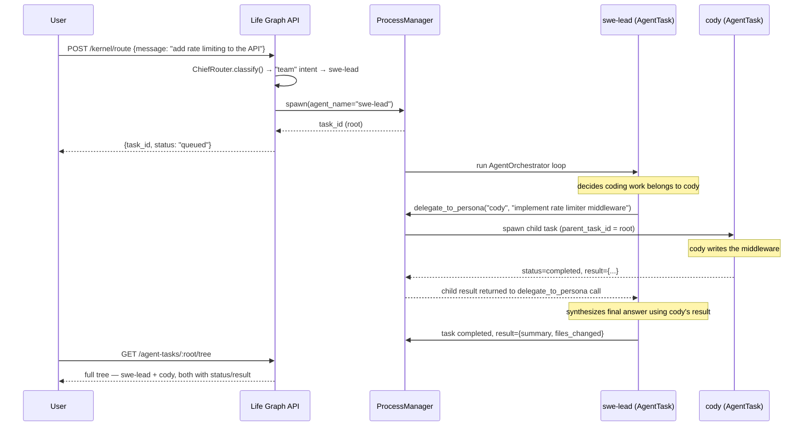
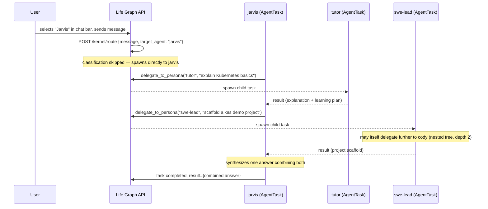

# Personal Roles — Feature Spec

> **Purpose**: Turn the kernel's single-role chat routing into a personal-assistant model with
> multiple specialized roles (SWE Team, Tech Tutor, Knowledge Scout, Work & Life Admin, and more
> over time) that Jarvis can invoke — reactively on request, or ambiently on a schedule — while
> reusing the existing persona/task/messaging infrastructure rather than adding a new "Role"
> abstraction.
>
> **Architecture ref**: `KNOWLEDGE.md`, `docs/specs/os-kernel.md` (personas, chief router),
> `docs/specs/era7-agent-networks.md` (task delegation tree, shared context — reused here
> unchanged), `docs/specs/agent-drivers.md` (driver/verifier_chain columns on `AgentPersona`,
> reused unchanged).
>
> **Multi-tenant**: All new personas and tasks are tenant-scoped exactly like existing ones. No
> change to tenant isolation.
>
> **V1 scope decision** (see "Explicitly out of scope" below): multi-role collaboration is
> **user-triggered**, not auto-detected. Ambient roles are **advisory-only** — they surface
> findings, they don't act on your behalf. Both are deliberate descopes to avoid building
> unproven automation before there's real usage data to calibrate it against.

---

## Requirements

### Story 1: New personal-life personas

As a user, I want Life Graph to have personas for tutoring, ambient research, and life/work admin
— not just the existing dev-focused ones — so Jarvis can help outside of software engineering.

#### Acceptance Criteria

- GIVEN the kernel seeds its built-in personas on startup WHEN seeding runs THEN four new personas
  are created alongside the existing six: `tutor`, `scout`, `admin`, and `swe-lead`
- GIVEN the `tutor` persona WHEN a user asks to learn something THEN `chief_router` can classify
  and route to it via `intent_tags = ["learn", "tutorial", "study"]`
- GIVEN the `scout` persona WHEN invoked THEN its `allowed_tools` includes only research tools
  (`web_search`, `browse_web`, `memory_search`) — no write/execute tools
- GIVEN the `admin` persona WHEN invoked THEN its `allowed_tools` includes only read/advisory
  tools (`memory_search`, `get_current_datetime`) in V1 — no tools that send messages, move money,
  or otherwise act in the world (see Story 4 for why)
- GIVEN each new persona WHEN queried via `GET /api/v1/kernel/personas` THEN it returns the same
  shape as existing built-ins (`display_name`, `icon`, `description`, `system_prompt`, `model`,
  `temperature`, `allowed_tools`, `intent_tags`) — no schema changes required

---

### Story 2: SWE Team delegation

As a user, I want to ask for something that needs a small engineering team (plan → code → verify)
and have `swe-lead` coordinate the existing `cody`/`ops`/`rex` personas, so I don't have to
manually orchestrate multi-step engineering work myself.

#### Acceptance Criteria

- GIVEN `swe-lead` is routed a task WHEN it decides part of the work belongs to a specialist THEN
  it calls the new `delegate_to_persona(persona, subtask, project_id)` tool, which creates a child
  `AgentTask` (`parent_task_id` = swe-lead's task, reusing the Era 7 delegation tree — no schema
  change)
- GIVEN `swe-lead`'s task is running as a background `AgentTask` (as all `ProcessManager`-spawned
  tasks already are — see "Why delegation can safely block" in Design) WHEN it calls
  `delegate_to_persona` with `wait=true` (the default) THEN the tool blocks until the child task
  reaches a terminal status and returns the child's `result`, so swe-lead can use it in its own
  reasoning
- GIVEN a delegated child task fails or times out WHEN `delegate_to_persona` returns THEN it
  returns an error payload (not an exception) so swe-lead's own tool-loop can decide whether to
  retry, delegate elsewhere, or report the failure — the existing dispatcher retry/one-bounce
  logic is untouched and still applies underneath
- GIVEN swe-lead delegates to `cody` and `rex` for a shared project WHEN both post findings THEN
  they use the existing `POST /api/v1/shared-context` (Era 7) so neither duplicates the other's
  research — no new context mechanism
- GIVEN a delegation chain WHEN a user views `GET /api/v1/agent-tasks/:rootTaskId/tree` (existing
  endpoint) THEN they see swe-lead and all delegated sub-tasks with status — this is the
  observability surface for "who did what," reusing Era 7's tree endpoint rather than a new one
- GIVEN `swe-lead` has a `verifier_chain = ["tests_pass", "diff_within_scope"]` (reusing the
  Agent-Drivers-era column that `uzhavu-ops`/`dependency-updater` already use, currently unset for
  swe-lead) WHEN a delegated child task completes THEN the verifier chain runs before swe-lead
  treats the result as final, rather than trusting a delegated persona's self-reported success —
  the same producer/verifier separation pattern documented in other agentic systems (e.g. a
  decompose→produce→verify loop), applied here via infrastructure this codebase already has

---

### Story 3: Explicit multi-role invocation (Jarvis)

As a user, I want to explicitly ask for a request that spans multiple roles (e.g. "use Tutor and
SWE Team to help me learn Kubernetes by building a project") and have it actually invoke both,
without the system silently guessing whether my request was compound.

#### Acceptance Criteria

- GIVEN a fifth new persona `jarvis` (in addition to Story 1's three) WHEN it is invoked THEN its
  `allowed_tools` includes `delegate_to_persona`, scoped to delegate to any built-in persona
- GIVEN `POST /api/v1/kernel/route` WHEN the request body includes an optional `target_agent`
  field THEN `ChiefRouter.route()` skips regex classification entirely and spawns directly to
  that persona (small, additive change to `route()` — classification is bypassed, not replaced)
- GIVEN the dashboard chat bar WHEN the user explicitly selects "Jarvis" from a small
  persona-override affordance (see Design) THEN the chat bar sends `target_agent = "jarvis"` on
  the route call
- GIVEN `jarvis` is running as a background task WHEN it calls `delegate_to_persona` multiple
  times (e.g. once for `tutor`, once for `swe-lead`) THEN each delegation follows the same
  parent/child task-tree pattern as Story 2 — Jarvis is not a special case, it's just a persona
  whose job is coordination
- GIVEN no auto-detection exists in V1 WHEN a user's message is ambiguous or compound and they
  did NOT select Jarvis THEN the request is routed single-role via the existing regex classifier,
  same as today — this is the accepted V1 tradeoff (see "Explicitly out of scope")

---

### Story 4: Ambient roles (Scout & Admin) — advisory only

As a user, I want Knowledge Scout and Work & Life Admin to proactively surface useful things on a
schedule, without needing to be asked each time, but without them taking real-world action on my
behalf until I've built up trust in them.

#### Acceptance Criteria

- GIVEN the existing `SchedulerService` WHEN an operator (or the user, via the kernel API) creates
  a `ScheduledJob` with `agent_name = "scout"` and a daily `cron_expression` THEN it spawns a
  `scout` task on schedule exactly like any other scheduled job — no new scheduling mechanism
- GIVEN `scout`'s task runs WHEN it finds something notable THEN it produces a `Notification` via
  the existing `NotificationEngine` — the user reviews it in the existing notification surfaces,
  same as any other kernel notification today
- GIVEN `admin`'s task runs on its own daily schedule WHEN it finds something (a bill due, a
  follow-up) THEN it likewise only creates a `Notification` — it never calls a tool that sends,
  pays, or writes on the user's behalf in V1, because `admin`'s `allowed_tools` (Story 1) simply
  doesn't include any such tool
- GIVEN a future version adds action-capable tools to `admin` WHEN that happens THEN those tool
  calls flow through the existing `ActionClassifier`/trust/approval pipeline unchanged — this spec
  makes no changes to the autonomy layer, it just currently gives `admin` nothing risky to call
- GIVEN `scout` or `admin` produce redundant findings across days WHEN evaluating this spec's
  scope THEN no new dedup/decay mechanism is introduced — this is flagged as a gap to watch, not
  solved here (see "Explicitly out of scope")

---

## Design

### Architecture Overview

```
User (chat bar)
    │
    ▼
POST /api/v1/kernel/route  { message, target_agent? }
    │
    ├─ target_agent set? ──────────────► spawn directly to that persona
    │                                    (Story 3: e.g. "jarvis")
    │
    └─ target_agent absent ────────────► ChiefRouter.classify() (unchanged)
                                          → single persona (existing behavior)

ProcessManager.spawn() → background AgentTask (asyncio.create_task, existing)
    │
    ▼
AgentOrchestrator runs the persona's system prompt + allowed_tools
    │
    ├─ swe-lead / jarvis call delegate_to_persona(persona, subtask)
    │       │
    │       ▼
    │   creates child AgentTask (parent_task_id = caller's task)   [Era 7, unchanged]
    │   spawns via ProcessManager, awaits terminal status
    │   returns child.result as the tool result
    │
    └─ scout / admin (no delegation) run their own task, end in a Notification

SchedulerService (existing) ──daily cron──► spawns scout / admin tasks (Story 4)
```

**Why delegation can safely block.** Every persona invocation — today, via `chief_router.route()`
— already runs as a background `AgentTask` under `ProcessManager`, not inside a live streamed
chat response (confirmed in `chief_router.py::route()`: it classifies, then calls
`ProcessManager.spawn()` and returns a `task_id` immediately; the chat UI polls/streams task
status separately). This means `delegate_to_persona` calling `await` on a child task's completion
does not block the user's chat connection — it blocks the *background task's* own execution,
which already has a generous `timeout_seconds` (default 3600s, same as any kernel task). This is
what avoids the "blocking tool call inside a 5-iteration chat loop" problem raised during design
review: delegation happens inside kernel tasks, never inside the live SSE chat turn itself.

---

### Data Model

**No new tables.** Every piece reuses existing schema:

| Concept | Reused from |
|---|---|
| Role definition | `AgentPersona` rows (new seed data only — same table as `cody`, `rex`, etc.) |
| Delegation tree | `AgentTask.parent_task_id` / `root_task_id` / `depth` (Era 7) |
| Cross-role knowledge sharing | `shared_context` (Era 7), unchanged |
| Ambient scheduling | `ScheduledJob` (existing kernel scheduler), unchanged |
| Findings surfaced to the user | `Notification` (existing kernel notification engine), unchanged |
| Safety gating for future risky tools | Autonomy layer (`ActionClassifier`, trust, approvals), unchanged |

**New persona seed rows** (added to `_BUILTIN_PERSONAS` in `kernel/personas.py`, following the
existing dict shape exactly):

```python
{
    "name": "tutor",
    "display_name": "Tech Tutor",
    "icon": "🎓",
    "description": "Tracks what you're learning, guides you, and checks understanding.",
    "system_prompt": (
        "You are Tutor. You help the user learn new technologies at their pace."
        " You check understanding before moving on, suggest small hands-on"
        " exercises, and track what they've already learned so you don't repeat"
        " yourself. Prefer teaching through building over lecturing."
    ),
    "intent_tags": ["learn", "tutorial", "study"],
    "temperature": 0.6,
    "allowed_tools": ["web_search", "memory_search"],
},
{
    "name": "scout",
    "display_name": "Knowledge Scout",
    "icon": "🧭",
    "description": "Ambiently researches topics useful to the user and surfaces findings.",
    "system_prompt": (
        "You are Scout. You research topics the user cares about and surface"
        " genuinely new, useful findings — not restatements of what you already"
        " reported. You never take action, only report."
    ),
    "intent_tags": ["research", "scout", "digest"],
    "temperature": 0.5,
    "allowed_tools": ["web_search", "browse_web", "memory_search"],
},
{
    "name": "admin",
    "display_name": "Work & Life Admin",
    "icon": "🗂️",
    "description": "Surfaces work/life admin items (bills, follow-ups, meeting prep) for review.",
    "system_prompt": (
        "You are Admin. You review the user's tracked commitments and surface"
        " anything that needs attention — nothing more. You never send, pay, or"
        " write anything on the user's behalf; you only report what you find."
    ),
    "intent_tags": ["admin", "reminder", "work"],
    "temperature": 0.4,
    "allowed_tools": ["memory_search", "get_current_datetime"],
},
{
    "name": "swe-lead",
    "display_name": "SWE Team Lead",
    "icon": "🧑‍💼",
    "description": "Coordinates cody/ops/rex on engineering work that needs more than one specialist.",
    "system_prompt": (
        "You are the SWE Team Lead. For work that needs more than one"
        " specialist, delegate sub-tasks to cody (code), ops (deploy/infra), or"
        " rex (research) using delegate_to_persona, then synthesize their"
        " results. For simple single-step work, just do it yourself — don't"
        " delegate needlessly."
    ),
    "intent_tags": ["team", "build", "project"],
    "temperature": 0.4,
    "allowed_tools": ["delegate_to_persona", "file_read", "file_write", "terminal", "git"],
    "verifier_chain": ["tests_pass", "diff_within_scope"],
},
{
    "name": "jarvis",
    "display_name": "Jarvis",
    "icon": "🤖",
    "description": "Explicitly-invoked orchestrator for requests that span multiple roles.",
    "system_prompt": (
        "You are Jarvis, the orchestrator. The user selected you explicitly"
        " because their request spans more than one role. Decide which"
        " personas are needed, delegate to them with delegate_to_persona, and"
        " synthesize a single coherent answer from their results."
    ),
    "intent_tags": [],
    "temperature": 0.4,
    "allowed_tools": ["delegate_to_persona"],
},
```

---

### `delegate_to_persona` Tool Contract

New file `life_graph/tools/delegate.py`, registered via the existing `@tool` decorator like every
other tool in `life_graph/tools/`.

```python
@tool(
    name="delegate_to_persona",
    description=(
        "Delegate a sub-task to another persona and get their result back."
        " Use this when part of the request is better handled by a specialist."
    ),
)
async def delegate_to_persona(
    persona: str,
    subtask: str,
    project_id: str | None = None,
    wait: bool = True,
    timeout_seconds: int = 600,
) -> dict:
    """Create a child AgentTask assigned to `persona` and (by default) await its result.

    Reuses ProcessManager.spawn() with parent_task_id set to the calling task's
    own id (threaded via the existing task-context contextvar) — the same
    delegation-tree mechanism Era 7 already defined. No new task type.
    """
```

- **`wait=True` (default)**: blocks until the child task reaches `completed`/`failed`/`timed_out`,
  then returns `{status, result}` or `{status: "failed", error}`. `timeout_seconds` here bounds
  only how long the *tool call* waits, not the child task's own lifetime — if the child hasn't
  finished when this elapses, the child keeps running (it has its own `timeout_seconds`, default
  3600s) and the tool returns `{status: "still_running", task_id}` rather than `"failed"`, so the
  calling persona doesn't misreport in-progress work as a failure and can check back via the task
  tree if needed.
- **`wait=False`**: returns `{task_id, status: "queued"}` immediately; the caller can check later
  via the existing task-tree endpoint. Available for genuinely long, independent sub-tasks, but
  V1's built-in personas (`swe-lead`, `jarvis`) always use the default — fire-and-forget delegation
  is left for a future persona that actually needs it, per YAGNI.
- **Errors**: unknown `persona` name → `ValueError` surfaced as a tool error (existing tool-error
  handling in `AgentOrchestrator` applies, no new error path); delegation depth still capped at 5
  by the existing Era 7 check.

### Router Change

`ChiefRouter.route()` gains one new optional parameter, `target_agent: str | None = None`. When
present, steps 1–2 (classify, resolve persona) are skipped and `agent_name = target_agent`;
everything else (session creation, spawn, response shape) is unchanged. `POST
/api/v1/kernel/route`'s request body gains the matching optional field.

### Dashboard Change

`components/chat-bar.tsx` gets a small persona-override affordance (e.g. a dropdown or `@`-mention
next to the input) listing personas whose `intent_tags` is empty (currently only `jarvis` — chief
and jarvis are the only "not auto-routed" personas) plus an "auto" default. Selecting one sends
`target_agent` on the route call. This is the concrete mechanism for Story 3 — no natural-language
detection involved.

---

### Sequence: SWE Team Delegation



### Sequence: Explicit Multi-Role (Jarvis)



---

### Explicitly Out of Scope for V1

Carried over from design review — these were considered and deliberately deferred, not
overlooked:

- **Automatic compound-request detection.** No regex-confidence heuristic or LLM-based escalation
  decides *for* the user whether a request needs multiple roles. Reviewed and rejected for V1: the
  likely heuristic (conjunction cues, multi-label regex) would probably miss the motivating example
  ("learn Kubernetes by building a project" has no lexical compound-cue), so it would add
  complexity without reliably delivering the capability it exists for. Revisit once there's real
  usage data on how multi-role requests actually get phrased. When it is revisited: model the
  router itself as its own swappable, LLM-backed agent (config-driven, replaceable independently
  of `ChiefRouter`'s regex path) rather than hardcoding new heuristics into `chief_router.py` —
  this mirrors how Qwen-Agent's `GroupChatAutoRouter` is a first-class agent, not glue code, and
  keeps the eventual smart-routing logic testable and replaceable on its own.
- **A generic `AgentRole` table/abstraction.** Three of four new roles are single-persona; adding a
  grouping table now would be pure indirection for them. `swe-lead` proves out the one real
  multi-persona case directly. If a second role later needs the same team pattern, extract a shared
  abstraction from two real examples instead of guessing at one.
- **Autonomous (non-advisory) actions from `scout`/`admin`.** Both are advisory-only by construction
  (their `allowed_tools` contains no action-capable tools) rather than by a new policy layer. This
  sidesteps the trust-cold-start / approval-fatigue problem raised in review — there's nothing for
  the autonomy layer to gate yet.
- **A dedicated eviction/summarization strategy for `shared_context` growth under ambient,
  recurring roles.** Flagged as a gap to watch, not solved here — the existing decay sweep applies
  as-is; if `scout`/`admin` cause it to grow meaningfully faster, that's a follow-up.

---

## Testing

Following existing conventions (`httpx.AsyncClient` + `ASGITransport`, tenant headers,
`pytest tests/integration/ -v`):

- Persona seeding: all four new personas plus `jarvis` appear after `PersonaService` seeds
  built-ins, with the exact `allowed_tools` listed above (guards the "advisory-only" boundary at
  the config level — a regression here silently grants `admin`/`scout` an action tool).
- `delegate_to_persona`: calling it from within a task creates a correctly-linked child
  (`parent_task_id`, `root_task_id`, `depth`), and `wait=True` returns the child's `result` once
  the child transitions to `completed`.
- `delegate_to_persona` error path: delegating to an unknown persona name surfaces a tool error,
  not an unhandled exception.
- Router override: `POST /kernel/route` with `target_agent="jarvis"` spawns directly to `jarvis`
  and skips `ChiefRouter.classify()` (assert classification was not invoked, not just that the
  right agent was reached).
- Scheduler integration: a `ScheduledJob` with `agent_name="scout"` and a daily cron spawns a
  `scout` task at the computed `next_fire_time` (existing scheduler test pattern, new persona).
- Delegation depth cap: a chain through `jarvis` → `swe-lead` → `cody` that attempts a further
  delegation past depth 5 is rejected (existing Era 7 behavior, exercised through the new tool).
