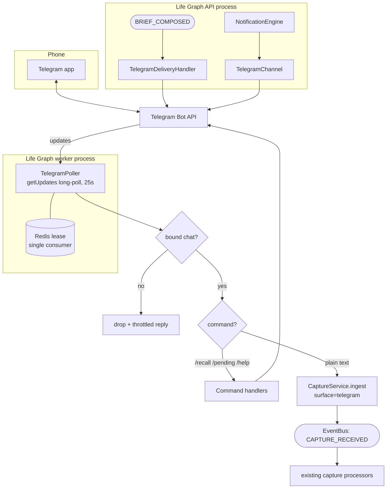

# Telegram Bridge — Phone as Capture Surface and Delivery Channel — Feature Spec

> **Status: Partially built** — phases 1–5 of 6.
>
> Built: the binding schema (migration 037), pairing (`services/telegram_binding.py`),
> the Bot API client, the long-poll consumer and the message router
> (`integrations/telegram/`), outbound delivery (`watchers/channels/telegram_channel.py`
> plus `services/telegram_delivery.py`), the chat commands
> (`integrations/telegram/commands.py`), and the management API
> (`api/integrations_telegram.py`) with photo and voice-note capture
> (`integrations/telegram/media.py`). The bridge is usable end to end: a code
> can be issued from the dashboard, a chat paired, and text, photos and voice
> notes captured from a phone.
>
> Not built: the remaining test work (phase 6). The generated status in
> [docs/STATE.md](../STATE.md) probes phase 5's router, so it now reads "Built"
> — phase 6 adds coverage rather than capability.

> **Purpose**: Give Life Graph a two-way channel to the phone. Inbound, any message
> sent to a personal bot becomes a capture event, so a thought can be recorded while
> walking without opening a terminal or the dashboard. Outbound, the daily brief and
> watcher notifications arrive in a chat instead of dying in a terminal or an inbox.
>
> **Why this first**: Every existing capture surface requires the user to be at a
> machine. `capture-spine.md` states the governing rule — *zero capture friction* —
> and the current surfaces do not honour it away from a desk. Telegram is the cheapest
> integration that fixes this: one bot token in an environment variable, no OAuth, no
> credential storage, no business verification, no per-message cost, and it works from
> behind NAT with no inbound port. It is deliberately chosen ahead of calendar and
> email, both of which need a per-tenant encrypted token store that does not exist yet.
>
> **Existing code leveraged**: `services/capture.py` (`CaptureService.ingest`, dedup,
> `CAPTURE_RECEIVED` fan-out), `core/trust.py` (`_SURFACE_TIER`, `classify_surface`),
> `watchers/notification_engine.py` (per-tenant channel routing and severity policy),
> `watchers/models.py` (`notification_channels` table — no schema change needed for outbound),
> `services/push_delivery.py` (the subscriber pattern to copy for brief delivery),
> `services/brief.py` (`BRIEF_COMPOSED`), `api/approvals.py`, `core/redaction.py`.
>
> **Multi-tenant**: A Telegram chat binds to exactly one tenant. Every read and write
> is scoped by the `tenant_id` resolved from the chat binding — never from a header,
> because the request does not come through the middleware stack.

---

## Requirements

### Story 1: Pair a chat with my account

As a **user**, I want to prove that a Telegram chat is mine before it can write to my memory, so that knowing the bot's name is not enough to inject content into my system.

#### Acceptance Criteria

- GIVEN I `POST /api/v1/integrations/telegram/pair` WHEN the request succeeds THEN a single-use pairing code is returned that expires in 10 minutes
- GIVEN I send `/start <code>` to the bot from an unbound chat WHEN the code is valid and unexpired THEN a `telegram_bindings` row is created linking that `chat_id` to my `tenant_id`, the code is consumed, and the bot confirms in the chat
- GIVEN I send `/start <code>` WHEN the code is expired, already used, or wrong THEN the bot replies with a generic failure and no binding is created
- GIVEN a message arrives from a `chat_id` with no binding WHEN the poller handles it THEN it is dropped with at most one generic reply per chat per hour, and nothing about any tenant is disclosed
- GIVEN a chat is already bound to tenant A WHEN a pairing code for tenant B is sent to it THEN the binding is **not** transferred; the bot instructs the user to unbind first
- GIVEN I `DELETE /api/v1/integrations/telegram/bindings/{id}` THEN the binding is removed and subsequent messages from that chat are treated as unbound

### Story 2: Any message becomes a memory

As a **user**, I want a plain message to the bot to enter the capture spine exactly as a CLI capture does, so that the phone is a first-class surface rather than a special case.

#### Acceptance Criteria

- GIVEN a bound chat WHEN I send a non-command text message THEN `CaptureService.ingest` is called with `surface="telegram"` and the message text, and `CAPTURE_RECEIVED` fires so the existing processors run unchanged
- GIVEN the same text is sent twice within ten minutes WHEN dedup runs THEN the second event is stored as `duplicate` by the existing spine logic — the bridge adds no dedup of its own
- GIVEN a message carries `forward_origin` (it was forwarded from someone else) WHEN it is ingested THEN `trust_tier` is passed explicitly as `EXTERNAL`, not derived from the surface
- GIVEN a message is sent in a group chat rather than a private chat WHEN the poller handles it THEN it is ignored; v1 binds private chats only
- GIVEN a voice note WHEN it is received THEN the file is downloaded and handed to the existing `services/multimodal.py` transcription path with `modality="voice"`
- GIVEN a photo with a caption WHEN it is received THEN the caption is captured as text and the image reference stored in `properties`; OCR reuses the existing multimodal path
- GIVEN Telegram delivers the same `update_id` twice WHEN the poller handles it THEN it is processed once, because the offset is only advanced after successful handling

### Story 3: Recall from the phone

As a **user**, I want to ask my memory a question from the chat, so that the phone is not write-only.

#### Acceptance Criteria

- GIVEN a bound chat WHEN I send `/recall <query>` THEN the existing recall path runs scoped to my tenant and the top results are returned as a single message
- GIVEN a result set WHEN it is rendered THEN it uses the index-line shape from progressive disclosure — id, truncated content, tags — not full memory objects
- GIVEN recall returns nothing WHEN the reply is composed THEN the bot says so plainly rather than sending an empty message
- GIVEN any outbound message WHEN it is composed THEN `core/redaction.redact_secrets` is applied, because chat history is retained on a third-party server indefinitely

### Story 4: The daily brief arrives in the chat

As a **user**, I want the brief I already generate to reach my phone through Telegram, so that it is read rather than discovered later.

#### Acceptance Criteria

- GIVEN `BRIEF_COMPOSED` fires WHEN a bound chat exists for that tenant THEN the brief is delivered to it, mirroring how `services/push_delivery.py` handles Web Push
- GIVEN delivery fails WHEN the handler runs THEN the failure is logged and the brief flow is unaffected — delivery must never break composition
- GIVEN a tenant has no binding WHEN the event fires THEN nothing is sent and nothing is logged as an error

### Story 5: Watcher notifications route to Telegram

As a **user**, I want Telegram to be selectable alongside email, webhook, and terminal, so that severity routing already built in the notification engine applies to it.

#### Acceptance Criteria

- GIVEN a `notification_channels` row with `channel_type="telegram"` and `enabled=true` WHEN a `CRITICAL` watcher event fires THEN it is delivered to the configured chat, and the engine's **severity routing** is unchanged
- GIVEN the channel class WHEN it is implemented THEN it returns `False` rather than raising on failure, matching every existing channel
- GIVEN the bot token is absent from config WHEN the channel is asked to send THEN it returns `False` and logs once, as `EmailChannel` does when `aiosmtplib` is missing
- GIVEN `NotificationEngine.send()` WHEN Telegram is added THEN one `elif` branch is added to its dispatch chain — see *A wrinkle in the notification engine* below

### Story 6: See what is waiting, decide on a real screen

As a **user**, I want to see pending approvals on my phone, but I do **not** want a single tapped button in a chat app to be sufficient authority to run a dangerous action.

#### Acceptance Criteria

- GIVEN a bound chat WHEN I send `/pending` THEN the pending approvals for my tenant are listed with their ids and titles
- GIVEN `LIFE_GRAPH_TELEGRAM_ALLOW_APPROVALS` is `false` (the default) WHEN I send `/approve <id>` THEN the bot declines and links to the dashboard
- GIVEN the flag is `true` WHEN I send `/approve <id>` THEN the bot asks for an explicit confirmation reply before calling the approve path, and an unconfirmed request expires after two minutes
- GIVEN any approval decision is taken over Telegram WHEN it resolves THEN the resulting record notes the chat surface, so the audit trail distinguishes it from a dashboard decision

---

## Design

### Architecture Overview



Two directions, deliberately kept separate. **Outbound** is a channel class plus an
event subscriber; it needs no new table because `notification_channels` already stores
per-tenant channel config. **Inbound** is a single long-polling consumer; it needs one
new table to answer the only question the bot cannot otherwise answer — *whose memory
is this chat allowed to write to?*

### Why long-polling rather than a webhook

A webhook needs a public HTTPS endpoint with a valid certificate. This deployment is
self-hosted on a workstation behind NAT. Long-polling (`getUpdates` with `timeout=25`)
needs no inbound port, no tunnel, and no certificate, and Telegram supports it as a
first-class mode. The cost is one long-lived outbound connection.

It must have exactly one consumer: Telegram delivers each update once, and two pollers
would race and randomly split messages. The poller therefore takes a Redis lease
(`SET telegram:poller:lease <instance> NX EX 60`, refreshed every 20s) and only polls
while it holds it. It runs in the **worker** process rather than the API process,
because the API runs with `--reload` in development and would restart the poller on
every file save.

### Data Models

```sql
-- Migration 037_telegram_bridge.py

CREATE TABLE telegram_bindings (
    id           UUID PRIMARY KEY DEFAULT gen_random_uuid(),
    tenant_id    TEXT NOT NULL,
    chat_id      BIGINT NOT NULL,
    chat_type    TEXT NOT NULL DEFAULT 'private',
    username     TEXT,
    active       BOOLEAN NOT NULL DEFAULT TRUE,
    bound_at     TIMESTAMPTZ NOT NULL DEFAULT NOW(),
    last_seen_at TIMESTAMPTZ,
    properties   JSONB NOT NULL DEFAULT '{}'
);

-- One tenant per chat. Enforced in the database, not just in code: this is the
-- boundary that decides whose memory a message is allowed to write to.
CREATE UNIQUE INDEX ix_telegram_bindings_chat ON telegram_bindings (chat_id)
    WHERE active;
CREATE INDEX ix_telegram_bindings_tenant ON telegram_bindings (tenant_id);

CREATE TABLE telegram_pairing_codes (
    code       TEXT PRIMARY KEY,
    tenant_id  TEXT NOT NULL,
    expires_at TIMESTAMPTZ NOT NULL,
    used_at    TIMESTAMPTZ,
    created_at TIMESTAMPTZ NOT NULL DEFAULT NOW()
);

CREATE INDEX ix_telegram_pairing_expires ON telegram_pairing_codes (expires_at);
```

The `getUpdates` offset is **not** stored here. It is a single integer that must
survive restarts but has no tenant scope and no audit value, so it lives in Redis at
`telegram:poller:offset`. Losing it replays at most the last 24 hours of updates, which
the capture spine's ten-minute hash dedup already absorbs.

### Trust tier

`telegram` must be added to `_SURFACE_TIER` in `core/trust.py`. Without it,
default-deny grades every phone capture as `EXTERNAL`, which prompt-fences the user's
own notes as reference-only data — the exact bug fixed in migration 036 for the
`source_type` vocabulary.

```python
# core/trust.py, in the capture-surface block
"telegram": TrustTier.SELF,
```

`SELF` is correct for a bound private chat: the binding proves the chat belongs to the
tenant, and the content is the user typing to themselves — the same standing as `cli`.
Two carve-outs are handled by the caller passing `trust_tier` explicitly rather than by
adding surfaces:

- a **forwarded** message (`forward_origin` present) was authored by someone else → `EXTERNAL`
- a message containing a **link preview body** the bot fetched → not fetched in v1; deferred rather than guessed

Note this is a different judgement from `whatsapp`, which is `HOSTILE_POSSIBLE` because
that surface was specified as a bot receiving messages from arbitrary third parties. The
distinction is who is on the other end, not which app it is.

### API Contracts

```
POST /api/v1/integrations/telegram/pair
→ 201 {"success": true, "data": {"code": "K7M2QX", "expires_at": "...", "bot_username": "..."}}

GET /api/v1/integrations/telegram/bindings
→ 200 {"success": true, "data": [{"id": "...", "chat_id": 12345, "username": "...", "bound_at": "...", "last_seen_at": "..."}]}

DELETE /api/v1/integrations/telegram/bindings/{id}
→ 204

GET /api/v1/integrations/telegram/status
→ 200 {"success": true, "data": {"configured": true, "poller": "leading" | "stopped" | "disabled" | "unknown", "last_poll_at": "...", "last_update_at": "...", "bound_chats": 1}}
   # As built. "standby" is not reachable from this process and "disabled"/"unknown"
   # were added; see "Why /status reads Redis instead of asking the poller" in phase 5.
```

`/status` exists because a long-polling consumer fails silently by design — the same
class of bug as the embedding backend that returned empty vectors while reporting
success. It is also surfaced in `/health` as a non-critical check, never a 503.

### Core Implementation

```python
# life_graph/integrations/telegram/poller.py

class TelegramPoller:
    """Single-consumer long-poll loop over getUpdates.

    Runs in the worker process under a Redis lease so that only one instance
    consumes updates. Telegram hands each update to exactly one getUpdates call;
    two pollers would silently split a conversation between them.
    """

    LEASE_KEY = "telegram:poller:lease"
    OFFSET_KEY = "telegram:poller:offset"

    async def run_forever(self) -> None:
        while not self._stopping:
            if not await self._acquire_lease():
                await asyncio.sleep(15)      # standby: another instance is leading
                continue
            try:
                updates = await self._get_updates(timeout=25)
                for update in updates:
                    await self._handle(update)
                    # Offset advances only after handling, so a crash replays
                    # rather than drops. The spine's hash dedup absorbs replays.
                    await self._store_offset(update["update_id"] + 1)
            except httpx.HTTPError:
                await self._backoff()        # exponential, capped at 60s
```

```python
# life_graph/integrations/telegram/router.py

async def handle_message(msg: dict, session: AsyncSession) -> None:
    chat = msg["chat"]
    if chat["type"] != "private":
        return                                # v1: private chats only

    text = (msg.get("text") or msg.get("caption") or "").strip()

    if text.startswith("/start"):
        return await pair(chat, text, session)

    binding = await lookup_binding(chat["id"], session)
    if binding is None:
        return await reply_unbound(chat["id"])   # throttled, discloses nothing

    if text.startswith("/"):
        return await run_command(binding, text, session)

    # Plain message → the capture spine, unchanged.
    tier = TrustTier.EXTERNAL if msg.get("forward_origin") else None
    await CaptureService(session, event_bus).ingest(
        tenant_id=binding.tenant_id,
        surface="telegram",
        content=text,
        modality="text",
        trust_tier=tier,                      # None → classify_surface("telegram")
        properties={"chat_id": chat["id"], "message_id": msg["message_id"]},
    )
```

```python
# life_graph/watchers/channels/telegram_channel.py

class TelegramChannel:
    """Watcher notification delivery over Telegram.

    Config dict keys: bot_token (falls back to settings), chat_id (required).
    Returns False on failure and never raises, like every other channel.
    """

    async def send(self, config, title, details, severity) -> bool:
        ...
```

#### A wrinkle in the notification engine

The three existing channels do **not** share a protocol, despite looking like they
should. Their `send()` signatures differ:

| Channel | Signature |
|---|---|
| `EmailChannel` | `send(config, subject, body, severity)` |
| `WebhookChannel` | `send(config, event_id, severity, title, details, watcher_name, timestamp=None)` |
| `TerminalChannel` | `send(config, severity, watcher_name, title, details=None)` |

`NotificationEngine.send()` reconciles them with a hardcoded `if channel_type == ...`
chain, so registering a class in `_ensure_channels()` is necessary but not sufficient —
a fourth `elif` branch must be added that adapts the event dict to whatever shape
`TelegramChannel.send()` takes.

This is an open/closed problem: every new channel edits a method that should not need
editing. **Unifying the channels behind one Protocol is explicitly out of scope here.**
It touches three working channels to benefit a fourth, and mixing a refactor into an
integration makes both harder to review and to revert. It is worth doing on its own,
and this spec is the record that it is worth doing.

### Dependencies & Integrations

- **New runtime dependency: none.** `httpx` is already a core dependency; the Bot API
  is plain HTTPS/JSON. No `python-telegram-bot`, which would pull its own event loop
  and job queue and duplicate machinery this repo already has.
- `NotificationEngine._ensure_channels()` gains one entry: `"telegram": TelegramChannel()`.
- `main.py` lifespan subscribes `telegram_delivery_handler` to `BRIEF_COMPOSED`,
  alongside `push_delivery_handler`.
- `workers/settings.py` `on_startup` launches the poller task.
- New router `api/integrations_telegram.py` registered in `main.py`.

### New EventType Additions

None. `BRIEF_COMPOSED` already fires and is the only event outbound needs.

Worth recording while adjacent: `NOTIFICATION_CREATED` and `APPROVAL_REQUESTED` are
declared in `core/events.py` but **nothing emits either of them**. This spec therefore
polls `ApprovalService.list_approvals` for `/pending` rather than subscribing. Making
those events real is a separate change and should not be smuggled in here.

### New Environment Variables

```bash
LIFE_GRAPH_TELEGRAM_BOT_TOKEN=            # empty disables the bridge entirely
LIFE_GRAPH_TELEGRAM_POLL_TIMEOUT=25       # getUpdates long-poll seconds
LIFE_GRAPH_TELEGRAM_ALLOW_APPROVALS=false # approve/reject from chat, off by default
LIFE_GRAPH_TELEGRAM_RATE_LIMIT_PER_MIN=20 # inbound messages per bound chat
```

### Error Handling

- Telegram API 5xx or network error → exponential backoff capped at 60s; the lease is
  released if it cannot be refreshed, so another instance can take over
- Telegram API 429 → honour `retry_after` from the response body
- Invalid or revoked bot token (401) → stop the poller, log once at ERROR, report
  `poller: "stopped"` from `/status`; do not spin
- A handler that raises → log, reply with a generic failure, still advance the offset
  for that update so one poisonous message cannot wedge the loop

### Security Considerations

- The bot token is a bearer credential for the whole bot. It stays in the environment,
  is never written to `telegram_bindings.properties`, and is redacted from logs by
  `core/redaction.redact_secrets`.
- Pairing codes are single-use, 10-minute, and generated with `secrets.token_hex`.
  Failed pairing attempts are rate-limited per chat.
- Unbound chats are answered with an identical generic message regardless of whether
  the code was wrong, expired, or absent — no oracle.
- **Chat content is retained on Telegram's servers indefinitely and is not
  end-to-end encrypted in normal cloud chats.** Every outbound message therefore passes
  through `redact_secrets`, and recall replies use index lines rather than full memory
  bodies. This is a genuine reduction in privacy compared with the dashboard, and is
  the main reason to keep approvals off by default.
- Approving an autonomous action is an authority decision. `charter` invariant
  *fail-closed autonomy* argues against making a single chat tap sufficient, hence the
  default-off flag plus an explicit confirmation step.

---

## Tasks

### Phase 1: Binding + schema (~0.5 day)
- [ ] Migration `037_telegram_bridge.py` — both tables, partial unique index on active chats
- [ ] Models in `models/db.py` with `tenant_id` on both
- [ ] `services/telegram_binding.py` — issue code, redeem code, lookup, revoke
- [ ] Add `"telegram": TrustTier.SELF` to `_SURFACE_TIER` with a comment explaining why it differs from `whatsapp`

### Phase 2: Inbound poller (~1 day)
- [ ] `integrations/telegram/client.py` — thin httpx wrapper over the Bot API
- [ ] `integrations/telegram/poller.py` — lease, offset, backoff, 429 handling
- [ ] `integrations/telegram/router.py` — `/start` pairing, unbound drop, plain text → `CaptureService.ingest`
- [ ] Launch from `workers/settings.py` `on_startup`

### Phase 3: Outbound (~0.5 day)
- [x] `watchers/channels/telegram_channel.py`
- [x] Register in `NotificationEngine._ensure_channels()` **and** add the `elif` dispatch branch in `NotificationEngine.send()`
- [x] `services/telegram_delivery.py` subscribing to `BRIEF_COMPOSED`, modelled on `push_delivery.py`
- [x] Subscribe it in the `main.py` lifespan **and** in `WorkerSettings.on_startup` — see below

#### Where the delivery handler has to be subscribed

`BRIEF_COMPOSED` is emitted by the 03:00 cron, which runs in the **ARQ worker**.
The `EventBus` is per-process: its Redis bridge is one-way fan-out feeding the
WebSocket relay in `api/websocket.py`, not a cross-process re-emit. A handler
subscribed only in the `main.py` lifespan therefore never hears the cron — it
only fires for the manual `POST /brief/compose`. `telegram_delivery_handler` is
subscribed in **both** places for that reason.

Note that `push_delivery_handler` is subscribed only in `main.py`, so Web Push
of the *scheduled* daily brief does not currently fire. That is pre-existing and
out of scope here, but it is the same one-line fix in the same block.

### Phase 4: Commands (~0.5 day)
- [x] `/help`, `/recall <query>` (index lines), `/pending`
- [x] `/approve` and `/reject` behind `LIFE_GRAPH_TELEGRAM_ALLOW_APPROVALS` with confirmation
- [x] `redact_secrets` on every outbound path — applied in `router._reply`, the single
      outbound choke point, so a new command cannot forget it

#### Why commands run inside a `tenant_scope`

`storage/postgres.py` reads the tenant from a contextvar
(`core/tenant.get_current_tenant_id`) rather than taking it as an argument, and
raises when it is unset. A request gets one from `TenantMiddleware`; the poller
does not, so any command touching the store has to set it.

Setting alone is not enough. The poller handles every chat sequentially inside
one asyncio task and therefore one context, so a `set_tenant_context` that is
never restored stays in place for the *next* chat's update — and the failure is
silent, because a wrong-but-present tenant reads as a valid scope. `core/tenant`
gained a `tenant_scope()` context manager for this, and the router wraps
everything after the binding check in it.

### Phase 5: API + observability (~0.5 day)
- [x] `api/integrations_telegram.py` — pair, list, delete, status — with OpenAPI examples
- [x] `/health` gains a non-critical `telegram` check
- [x] Voice notes and photo captions through the existing multimodal path

#### Why `/status` reads Redis instead of asking the poller

The poller runs in the ARQ worker process. The API serving `/status` runs in
another. `TelegramPoller.status` exists and is correct, but the instance the API
process can reach has never been started, so asking it would return `stopped`
forever regardless of what the worker is doing.

So the poller publishes its state and the endpoint reads it. The lease was
already in Redis; phase 5 added two stamps beside it. `telegram:poller:heartbeat`
is rewritten after every completed poll cycle and expires with the lease TTL,
which is the actual liveness signal — a leader that holds the lease but has
stopped turning shows a lease and no recent stamp. `telegram:poller:last_update`
records the last batch that actually contained a message and never expires,
because "nothing since Tuesday" is worth knowing.

Two consequences for the contract below. First, `standby` is never returned by
this endpoint: a standby instance is by definition the one that failed to take
the lease, so it writes nothing, and from outside the worker a standby is
indistinguishable from an absence. The value stays in the vocabulary because
`poller.status` inside the worker does distinguish it. Second, an unreachable
Redis reports `unknown` rather than `stopped` — reporting a verdict where there
is no observation would send someone to debug a poller that is running fine.
The response carries `last_poll_at` in addition to the contract's
`last_update_at` for the same reason.

The `/health` check reports the same structure and deliberately affects neither
the 503 nor the overall status. Running the API without the worker is a normal
way to develop, and a health check that is permanently red is one nobody reads.

#### Why forwarded photos and voice notes are refused

Phase 4 established that a forwarded *text* message is filed as `EXTERNAL`
rather than `SELF`: the trust argument for the `telegram` surface is that the
user typed it, and that argument does not extend to something they merely
relayed.

The multimodal path cannot make the same distinction. It derives a memory's
trust tier from its source, and both `voice` and `image` map to `SELF`; there
is no per-item override. Running a forwarded voice message through it would
file a stranger's words at the owner's own tier — precisely the content an
injection arrives in, and precisely the fencing that `is_untrusted` exists to
apply. So the bridge declines forwarded media and says why, rather than
laundering it. Lifting this needs a trust-tier argument threaded through
`process_voice`/`process_image` and the `ingest_capture_text` job; it is not
a Telegram-side fix.

#### One message, one memory

`process_image` gained an optional `caption` argument. A photo of a whiteboard
captioned "notes from standup" is one thought: ingesting the caption separately
would mean a search for "standup" found six words and missed the whiteboard.
The caption is now ingested together with the OCR text, and is enough on its
own to make an image with no text worth keeping. Callers that pass nothing get
the previous behaviour unchanged, including the `ValueError` on a blank image.

This also fixed an ordering bug in the router: media is now checked *before*
text, because `text` is populated from `caption` when there is no message body,
and checking text first stored the caption while silently discarding the photo.

### Phase 6: Tests (~1 day)
- [ ] Unit: pairing (valid, expired, reused, wrong tenant, rebind attempt)
- [ ] Unit: router dispatch, unbound drop, group-chat ignore, forward → `EXTERNAL`
- [ ] Unit: offset only advances after successful handling; duplicate `update_id` processed once
- [ ] Unit: lease contention — the standby instance does not call `getUpdates`
- [ ] Unit: channel returns `False` on failure and never raises
- [ ] Integration: `httpx.AsyncClient` + `ASGITransport` over the four endpoints
- [ ] `python scripts/gen_state.py --html` — new table, endpoints, and job appear in the diff

**Total: ~4 days.**
